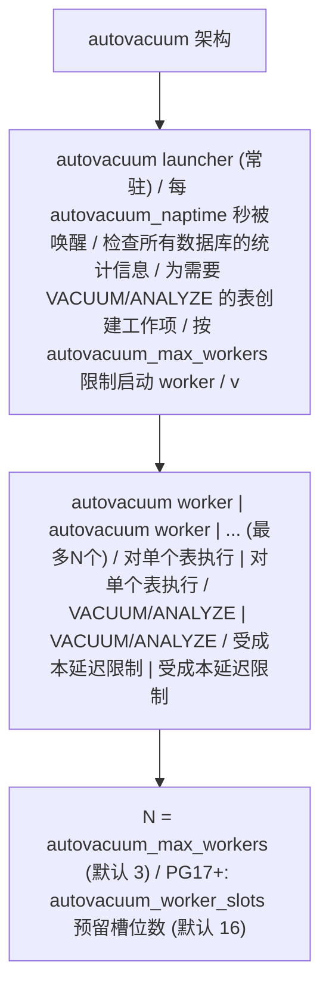

> 定位说明：本篇为进阶参考书（参考层），面向已完成本模块主线的读者；入门请先走学习路径前序阶段。定位标准见 docs/standards/reference-layer.md（仓库）。

## 前置知识

建议先阅读以下内容再进入本文：

- [VACUUM 机制](/postgresql/210-VACUUMMechanism)：死元组、可见性判断与标准 VACUUM 三步流程

# PostgreSQL Autovacuum 实战（autovacuum 篇）

> 本文是「PostgreSQL VACUUM」三篇系列的第二篇（autovacuum 篇），面向 DBA 与高级开发工程师，聚焦自动化清理的工程实践：autovacuum 守护进程（launcher 与 worker）的工作机制、三组触发阈值计算公式、核心参数逐个精讲、按表调参的方法与典型负载配置，以及如何用系统视图与日志观察 autovacuum 是否在干活。
>
> 系列另两篇：[VACUUM 机制](/postgresql/210-VACUUMMechanism)（MVCC 死元组与三步清理流程）与 [VACUUM 调优与排障](/postgresql/214-VACUUMTuningAndTroubleshoot)（膨胀诊断、在线重建、事务 ID 回卷排障与监控清单）。

主要章节：

- 第一章 autovacuum 守护进程工作机制
- 第二章 触发阈值计算公式
- 第三章 关键参数逐个详解
- 第四章 按表调参实战
- 第五章 观察 autovacuum 是否在干活
- 第六章 常见误区
- 第七章 练习题
- 第八章 参考文献与延伸阅读

---

## 第一章 autovacuum 守护进程工作机制

### 1.1 守护进程架构

autovacuum 是 PostgreSQL 的后台自动清理守护进程，自 8.1 版本起
成为核心功能，默认启用。它的目标是让 DBA 无需手动执行 VACUUM
即可保持数据库健康。autovacuum 的架构由两个组件构成：



**autovacuum launcher（启动器）**

启动器是一个常驻的后台进程，其工作循环如下：

1. 等待 autovacuum_naptime 指定的间隔时间（默认 1 分钟）。
2. 遍历所有数据库，查询 pg_stat_user_tables 等统计视图。
3. 对每个表，根据阈值公式判断是否需要 VACUUM 或 ANALYZE。
4. 将需要处理的表加入工作队列。
5. 按 autovacuum_max_workers 限制，启动 worker 处理工作项。
6. 回到步骤1。

**autovacuum worker（工作进程）**

每个 worker 负责对单个表执行 VACUUM 或 ANALYZE 操作。worker 的
行为与手动执行 VACUUM 完全相同，但受 autovacuum 专用的成本延迟
参数控制，以降低对在线业务的影响。worker 完成一张表后，会向
launcher 报告并请求下一张表，直到工作队列清空。

### 1.2 多表并发与 worker 调度

当多个表同时满足 autovacuum 触发条件时，launcher 需要决定处理
顺序。调度策略考虑以下因素：

1. **事务 ID 回卷优先**：表的 relfrozenxid 年龄接近
   autovacuum_freeze_max_age 的表获得最高优先级。
2. **死元组数量**：死元组越多的表优先级越高。
3. **等待时间**：长时间未被 VACUUM 的表优先级提升。

launcher 将候选表按优先级排序，依次分配给空闲的 worker。当所有
worker 都在工作中时，新候选表进入等待队列。这意味着
autovacuum_max_workers 过小会导致高优先级表（如即将回卷的表）
被低优先级表的 VACUUM 阻塞。

PG17 引入的 autovacuum_worker_slots 改进了 worker 管理：

| 属性         | 值                                |
|--------------|-----------------------------------|
| 参数名       | autovacuum_worker_slots           |
| 类型         | integer                           |
| 默认值       | 16 (可能因内核限制更小)           |
| 最小值       | 0                                 |
| 最大值       | 262143                            |
| 推荐值       | 16-64                             |
| 上下文       | postmaster                        |
| 影响说明     | 为 autovacuum worker 预留的后端槽位数 |

此参数与 autovacuum_max_workers 的关系是：max_workers 限制
同时运行的 worker 数，worker_slots 预留后端进程槽位确保
worker 能够被启动。在连接数极高的系统中，worker_slots 确保
autovacuum 不会因后端槽位耗尽而无法启动。

### 1.3 autovacuum 与手动 VACUUM 的关系

autovacuum worker 执行的 VACUUM 与手动执行的 VACUUM 在内核
逻辑上是相同的，但有以下差异：

| 特性              | autovacuum VACUUM        | 手动 VACUUM              |
|-------------------|--------------------------|--------------------------|
| 成本延迟          | 受 autovacuum_cost_* 控制 | 受 vacuum_cost_* 控制    |
| 触发方式          | 自动阈值触发             | 人工执行                 |
| 日志记录          | log_autovacuum_min_duration 控制 | 需加 VERBOSE            |
| 锁冲突处理        | 自动跳过（SKIP_LOCKED 等效）| 默认等待                |
| 事务 ID 回卷保护  | 强制触发（即使 autovacuum=off）| 不强制                 |

一个常见的误区是认为手动 VACUUM 会"干扰" autovacuum。实际上，
两者使用相同的锁（SHARE UPDATE EXCLUSIVE），因此同一表同一时刻
只能执行一个 VACUUM。如果 autovacuum 正在处理某表，手动 VACUUM
会等待；反之亦然。autovacuum launcher 不会为正在被手动 VACUUM
处理的表启动 worker。

---

## 第二章 触发阈值计算公式

### 2.1 三组触发公式

autovacuum 的核心是触发阈值的计算公式。对于每张表，autovacuum
分别计算 VACUUM 和 ANALYZE 的触发阈值：

**VACUUM 触发公式（基于 UPDATE/DELETE 产生的死元组）：**

```
vacuum_threshold = autovacuum_vacuum_threshold
                 + autovacuum_vacuum_scale_factor * n_live_tup

触发条件: n_dead_tup > vacuum_threshold
```

**ANALYZE 触发公式（基于所有修改）：**

```
analyze_threshold = autovacuum_analyze_threshold
                  + autovacuum_analyze_scale_factor * n_live_tup

触发条件: n_mod_since_analyze > analyze_threshold
```

**INSERT 触发公式（PG13+，基于纯 INSERT）：**

```
insert_threshold = autovacuum_vacuum_insert_threshold
                 + autovacuum_vacuum_insert_scale_factor * n_live_tup

触发条件: n_ins_since_vacuum > insert_threshold
```

其中：

- n_live_tup：表的估计活元组数（来自 pg_stat_user_tables）
- n_dead_tup：表的估计死元组数
- n_mod_since_analyze：自上次 ANALYZE 以来的修改数
- n_ins_since_vacuum：自上次 VACUUM 以来的插入数

### 2.2 默认参数下的触发示例

默认参数下的触发示例：

```
假设表 orders 有 n_live_tup = 1,000,000 行

默认参数：
  autovacuum_vacuum_threshold = 50
  autovacuum_vacuum_scale_factor = 0.2
  autovacuum_analyze_threshold = 50
  autovacuum_analyze_scale_factor = 0.1

VACUUM 触发阈值 = 50 + 0.2 * 1,000,000 = 200,050
  -> 死元组超过 200,050 时触发 VACUUM
  -> 即约 20% 的行变成死元组时触发

ANALYZE 触发阈值 = 50 + 0.1 * 1,000,000 = 100,050
  -> 修改超过 100,050 行时触发 ANALYZE
  -> 即约 10% 的行被修改时触发
```

再补一个 INSERT 触发的计算示例：

```
假设表 audit_log 有 n_live_tup = 20,000,000 行，只有 INSERT 没有 UPDATE/DELETE。

参数：
  autovacuum_vacuum_insert_threshold = 1000（默认）
  autovacuum_vacuum_insert_scale_factor = 0.2（默认）

INSERT 触发阈值 = 1000 + 0.2 * 20,000,000 = 4,000,100
  -> 累计插入超过 4,000,100 行时触发一次 VACUUM
  -> 该次 VACUUM 不清理死元组（没有死元组），主要工作是
     维护可见性映射与推进 relfrozenxid（防回卷水位）
```

---

## 第三章 关键参数逐个详解

### 3.1 autovacuum

| 属性         | 值             |
|--------------|----------------|
| 参数名       | autovacuum     |
| 类型         | boolean        |
| 默认值       | on             |
| 最小值       | -              |
| 最大值       | -              |
| 推荐值       | on（始终开启） |
| 上下文       | postmaster     |
| 影响说明     | 控制是否启动 autovacuum 守护进程 |

此参数为 autovacuum 的总开关。即使关闭此参数，PostgreSQL 仍会在
事务 ID 回卷风险时强制启动 autovacuum 进程，以防止数据库进入
只读状态。因此，关闭 autovacuum 并不能完全阻止 autovacuum 运行，
只是关闭了常规的自动清理。

```sql
-- 在 postgresql.conf 中设置（需重启）
autovacuum = on

-- 注意：关闭 autovacuum 极不推荐
-- 除非有完善的手动 VACUUM 调度方案
```

### 3.2 autovacuum_max_workers

| 属性         | 值                          |
|--------------|-----------------------------|
| 参数名       | autovacuum_max_workers      |
| 类型         | integer                     |
| 默认值       | 3                           |
| 最小值       | 1                           |
| 最大值       | 262143                      |
| 推荐值       | 3-10（视负载与CPU核数）     |
| 上下文       | postmaster                  |
| 影响说明     | 同时运行的最大 autovacuum worker 数量 |

此参数控制同时运行的 autovacuum worker 数量上限。需要注意，
增加此值不会加速单个表的 VACUUM 速度，只会增加同时处理的表数量。
过多的 worker 会增加 I/O 竞争，反而降低整体效率。

```sql
-- 推荐：根据 CPU 核数和磁盘 I/O 能力设置
-- 经验公式：min(CPU核数/2, 10)
ALTER SYSTEM SET autovacuum_max_workers = 6;
-- 需重启生效
```

### 3.3 autovacuum_naptime

| 属性         | 值                                |
|--------------|-----------------------------------|
| 参数名       | autovacuum_naptime                |
| 类型         | integer (毫秒)                    |
| 默认值       | 1min (60000ms)                    |
| 最小值       | 1ms                               |
| 最大值       | 2147483647ms                      |
| 推荐值       | 30s-1min（OLTP）/ 5min（OLAP）   |
| 上下文       | sighup                            |
| 影响说明     | launcher 检查数据库的间隔时间     |

此参数控制 launcher 两次扫描数据库统计信息的间隔。对于有大量
数据库的实例，实际每张表的检查间隔约为 autovacuum_naptime /
数据库数量。因此，数据库数量多时应适当减小此值。

```sql
-- 对于繁忙的 OLTP 系统，缩短检查间隔
ALTER SYSTEM SET autovacuum_naptime = '30s';
-- 重新加载配置即可（sighup）
SELECT pg_reload_conf();
```

### 3.4 autovacuum_vacuum_scale_factor

| 属性         | 值                                    |
|--------------|---------------------------------------|
| 参数名       | autovacuum_vacuum_scale_factor        |
| 类型         | real                                  |
| 默认值       | 0.2                                   |
| 最小值       | 0.0                                   |
| 最大值       | 100.0                                 |
| 推荐值       | 0.02-0.1（大表）/ 0.2（小表）        |
| 上下文       | sighup（可按表覆盖）                  |
| 影响说明     | VACUUM 触发的比例因子                 |

此参数是 autovacuum 调优中最常调整的参数。默认值 0.2 对于小表
合适，但对于大表会导致死元组堆积过多才触发清理。例如，一个
1 亿行的表，默认设置下要积累 2000 万死元组才会触发 VACUUM，
这会导致严重的表膨胀。

```sql
-- 对大型高更新表设置更低的 scale_factor
ALTER TABLE orders SET (
    autovacuum_vacuum_scale_factor = 0.02,  -- 2% 即触发
    autovacuum_vacuum_threshold = 1000      -- 至少 1000 死元组
);

-- 查看表的当前设置
SELECT reloptions FROM pg_class WHERE relname = 'orders';
```

### 3.5 autovacuum_vacuum_threshold

| 属性         | 值                                    |
|--------------|---------------------------------------|
| 参数名       | autovacuum_vacuum_threshold           |
| 类型         | integer                               |
| 默认值       | 50                                    |
| 最小值       | 0                                     |
| 最大值       | 2147483647                            |
| 推荐值       | 50（默认）/ 1000-5000（小高频表）    |
| 上下文       | sighup（可按表覆盖）                  |
| 影响说明     | VACUUM 触发的最小死元组数             |

此参数与 scale_factor 配合使用，提供触发的"基数"部分。对于
小型但高频更新的表（如会话表、计数器表），可能需要提高 threshold
以避免 autovacuum 过于频繁触发。

### 3.6 autovacuum_vacuum_cost_delay / cost_limit

| 属性              | autovacuum_vacuum_cost_delay | autovacuum_vacuum_cost_limit |
|-------------------|------------------------------|------------------------------|
| 类型              | real (毫秒)                  | integer                      |
| 默认值            | 2ms (PG12+) / -1 (PG11-)     | -1                           |
| 最小值            | -1                           | -1                           |
| 最大值            | 100ms                        | 10000                        |
| 推荐值            | 1-5ms                        | 200-2000                     |
| 上下文            | sighup                       | sighup                       |
| 影响说明          | worker 超限后的休眠时间      | worker 的 I/O 成本配额       |

这两个参数实现 autovacuum 的"成本延迟"机制，是控制 VACUUM 对
在线业务 I/O 影响的核心。cost_limit 是每个 worker 的 I/O 成本
配额，cost_delay 是耗尽配额后的休眠时间。cost_limit = -1 表示
使用全局 vacuum_cost_limit 值。

成本延迟机制的工作原理：

```
每个 I/O 操作有成本权重：
  读取共享缓冲池中的页面: cost = 1   (vacuum_cost_page_hit)
  读取未在缓冲池的页面:   cost = 2   (vacuum_cost_page_miss)
  随机读取磁盘页面:       cost = 20  (vacuum_cost_page_dirty)

worker 执行 VACUUM 时累加成本：
  累积成本 += 每次操作的 cost

当累积成本 >= cost_limit 时：
  worker 休眠 cost_delay 毫秒
  重置累积成本为 0
  继续执行

效果：限制 VACUUM 的 I/O 吞吐量，保护在线业务
```

```sql
-- 对于低峰期，可以临时加速 autovacuum
ALTER SYSTEM SET autovacuum_vacuum_cost_delay = 0;  -- 不休眠
ALTER SYSTEM SET autovacuum_vacuum_cost_limit = 2000;  -- 提高配额
SELECT pg_reload_conf();

-- 高峰期恢复保守设置
ALTER SYSTEM SET autovacuum_vacuum_cost_delay = '5ms';
ALTER SYSTEM SET autovacuum_vacuum_cost_limit = 500;
SELECT pg_reload_conf();
```

### 3.7 autovacuum_vacuum_insert_scale_factor / insert_threshold

| 属性         | 值                                              |
|--------------|--------------------------------------------------|
| 参数名       | autovacuum_vacuum_insert_scale_factor            |
| 类型         | real                                             |
| 默认值       | 0.2                                              |
| 上下文       | sighup（可按表覆盖）                             |
| 影响说明     | 纯 INSERT 负载触发 VACUUM 的比例因子（PG13+）    |

| 属性         | 值                                              |
|--------------|--------------------------------------------------|
| 参数名       | autovacuum_vacuum_insert_threshold               |
| 类型         | integer                                          |
| 默认值       | 1000                                             |
| 上下文       | sighup（可按表覆盖）                             |
| 影响说明     | 纯 INSERT 负载触发 VACUUM 的基数阈值（PG13+）    |

这两个参数解决一个传统盲区：追加写（append-only）表几乎不产生死元组，按死元组计算的触发条件永远不满足，但表的可见性映射与冻结水位同样需要推进。PG13 引入的 INSERT 触发机制让这类表也能被 autovacuum 定期处理（用于维护 VM、推进 relfrozenxid）。典型受益者：日志表、时序分区、审计流水表。

```sql
-- 对追加写大表设置 INSERT 触发（5% 新增即触发）
ALTER TABLE audit_log SET (
    autovacuum_vacuum_insert_scale_factor = 0.05,
    autovacuum_vacuum_insert_threshold = 100000
);

-- 预期效果：表新增约 5% 行数后，pg_stat_user_tables.last_autovacuum 开始更新，
-- 且 VACUUM 主要是推进 VM 与冻结水位，耗时远短于死元组清理。
```

### 3.8 autovacuum_analyze_scale_factor / analyze_threshold

| 属性         | 值                                              |
|--------------|--------------------------------------------------|
| 参数名       | autovacuum_analyze_scale_factor                  |
| 类型         | real                                             |
| 默认值       | 0.1                                              |
| 上下文       | sighup（可按表覆盖）                             |
| 影响说明     | 触发 ANALYZE 的比例因子                          |

| 属性         | 值                                              |
|--------------|--------------------------------------------------|
| 参数名       | autovacuum_analyze_threshold                     |
| 类型         | integer                                          |
| 默认值       | 50                                               |
| 上下文       | sighup（可按表覆盖）                             |
| 影响说明     | 触发 ANALYZE 的基数阈值                          |

ANALYZE 触发与表的数据修改量（INSERT + UPDATE + DELETE）挂钩。统计信息过期会导致优化器选错执行计划，因此对负载模式变化快的表（如状态分布倾斜的订单表），建议把 analyze 比例调得比 vacuum 比例更激进（例如 0.02），让执行计划始终建立在较新的统计之上。

```sql
-- 高频更新表：统计信息跟随更紧
ALTER TABLE orders SET (
    autovacuum_analyze_scale_factor = 0.02,
    autovacuum_analyze_threshold = 500
);

-- 验证统计信息新鲜度
SELECT relname, n_mod_since_analyze, last_analyze, last_autoanalyze
FROM pg_stat_user_tables
WHERE relname = 'orders';
-- 预期输出（示例）：
--  relname | n_mod_since_analyze |        last_analyze        |     last_autoanalyze
-- ---------+---------------------+----------------------------+---------------------------
--  orders  |               18302 | 2026-09-27 03:00:02.11+08 | 2026-09-27 09:41:18.7+08
```

### 3.9 log_autovacuum_min_duration

| 属性         | 值                                              |
|--------------|--------------------------------------------------|
| 参数名       | log_autovacuum_min_duration                      |
| 类型         | integer（毫秒）                                  |
| 默认值       | -1（禁用日志）                                   |
| 推荐值       | 0（记录全部）或 1s-10s                           |
| 上下文       | sighup                                           |
| 影响说明     | 仅记录耗时超过该值的 autovacuum 操作             |

这是观察 autovacuum 的第一开关：设为 0 记录每一次自动清理及其行数、缓冲区与 I/O 统计；设为正数只记录慢操作；-1 完全关闭。生产环境建议至少设为 1s，日志样例与分析方法见本文第五章。

```sql
ALTER SYSTEM SET log_autovacuum_min_duration = '1s';
SELECT pg_reload_conf();
```

---

## 第四章 按表调参实战

### 4.1 按表调优的优势

按表调优（ALTER TABLE SET）相比全局调优有以下优势：

1. **精准施策**：不同表有不同的写入模式，一刀切的全局设置无法
   适应所有表。
2. **降低风险**：全局调优可能对小表产生副作用，按表调优可隔离
   影响。
3. **审计便利**：按表设置记录在 pg_class.reloptions 中，便于审计。

```sql
-- 批量查看所有按表设置的 autovacuum 参数
SELECT
    c.relname,
    c.reloptions
FROM pg_class c
JOIN pg_namespace n ON c.relnamespace = n.oid
WHERE c.relkind = 'r'
  AND c.reloptions::text LIKE '%autovacuum%'
ORDER BY c.relname;

-- 批量设置多张表的 scale_factor
-- 假设要为所有以 'log_' 开头的表设置激进 autovacuum
DO $$
DECLARE
    r RECORD;
BEGIN
    FOR r IN
        SELECT relname FROM pg_class
        WHERE relkind = 'r' AND relname LIKE 'log_%'
    LOOP
        EXECUTE format(
            'ALTER TABLE %I SET (autovacuum_vacuum_scale_factor = 0.05)',
            r.relname
        );
    END LOOP;
END $$;
```

### 4.2 典型负载推荐配置速查

**场景一：高吞吐 OLTP（大量 UPDATE/DELETE）**

```sql
-- postgresql.conf 全局设置
autovacuum = on
autovacuum_max_workers = 6          -- 增加 worker 应对高吞吐
autovacuum_naptime = '30s'          -- 缩短检查间隔
autovacuum_vacuum_cost_delay = '1ms' -- 降低延迟提升清理速度
autovacuum_vacuum_cost_limit = 1000  -- 提高成本配额

-- 高频更新表按表设置
ALTER TABLE user_sessions SET (
    autovacuum_vacuum_scale_factor = 0.05,   -- 5% 即触发
    autovacuum_vacuum_threshold = 1000,
    autovacuum_analyze_scale_factor = 0.02   -- 2% 即更新统计
);

ALTER TABLE order_status SET (
    autovacuum_vacuum_scale_factor = 0.02,   -- 2% 即触发（极高频）
    autovacuum_vacuum_threshold = 500,
    autovacuum_vacuum_cost_delay = '0.5ms'   -- 几乎不休眠
);
```

**场景二：大型 OLAP（大量 INSERT，少 UPDATE）**

```sql
-- postgresql.conf 全局设置
autovacuum = on
autovacuum_max_workers = 3          -- 保持默认，并发需求低
autovacuum_naptime = '2min'         -- 延长检查间隔
autovacuum_vacuum_cost_delay = '5ms' -- 保守，避免影响分析查询

-- 大型事实表按表设置（利用 PG13+ 的 INSERT 触发）
ALTER TABLE sales_fact SET (
    autovacuum_vacuum_insert_scale_factor = 0.05,  -- 5% INSERT 触发
    autovacuum_vacuum_insert_threshold = 100000,
    autovacuum_analyze_scale_factor = 0.05
);

-- 维度表保持默认（变更少）
```

**场景三：混合负载（HTAP）**

```sql
-- postgresql.conf 全局设置
autovacuum = on
autovacuum_max_workers = 5
autovacuum_naptime = '45s'
autovacuum_vacuum_cost_delay = '2ms'
autovacuum_vacuum_cost_limit = 500

-- 热点表激进设置
ALTER TABLE hot_table SET (
    autovacuum_vacuum_scale_factor = 0.03,
    autovacuum_vacuum_threshold = 500
);

-- 冷数据表保守设置
ALTER TABLE cold_table SET (
    autovacuum_vacuum_scale_factor = 0.2,   -- 保持默认
    autovacuum_vacuum_threshold = 1000
);
```

### 4.3 负载场景深度调优策略

#### 4.3.1 高频小事务 OLTP

特征：大量短事务，频繁 UPDATE/DELETE 小批量数据。

策略：

```sql
-- 全局配置：适度激进的 autovacuum
ALTER SYSTEM SET autovacuum_naptime = '30s';
ALTER SYSTEM SET autovacuum_vacuum_cost_delay = '1ms';
ALTER SYSTEM SET autovacuum_vacuum_cost_limit = 1000;

-- 热点表：低 scale_factor + 低 threshold
ALTER TABLE user_sessions SET (
    autovacuum_vacuum_scale_factor = 0.03,
    autovacuum_vacuum_threshold = 200,
    autovacuum_analyze_scale_factor = 0.02,
    autovacuum_analyze_threshold = 100
);

-- 定期手动 ANALYZE 保持统计信息新鲜
-- 在低峰期执行
ANALYZE user_sessions;
```

#### 4.3.2 批量加载（ETL/DW）

特征：定期大批量 INSERT，少量 UPDATE/DELETE。

策略：

```sql
-- 全局配置：保守的 autovacuum
ALTER SYSTEM SET autovacuum_vacuum_cost_delay = '5ms';

-- 事实表：利用 INSERT 触发（PG13+）
ALTER TABLE sales_fact SET (
    autovacuum_vacuum_insert_scale_factor = 0.05,
    autovacuum_vacuum_insert_threshold = 100000,
    autovacuum_analyze_scale_factor = 0.05
);

-- 批量加载后手动 ANALYZE
-- ETL 流程末尾执行
ANALYZE sales_fact;

-- 对于大批量 DELETE 后的表，手动 VACUUM
-- 例如分区表的老数据清理后
VACUUM (ANALYZE, VERBOSE) old_partition;
```

#### 4.3.3 时序数据

特征：大量 INSERT，定期 DELETE 老数据（分区表）。

策略：

```sql
-- 时序表按分区管理
-- 新分区：激进 autovacuum（频繁 INSERT）
ALTER TABLE metrics_2026_08 SET (
    autovacuum_vacuum_insert_scale_factor = 0.03,
    autovacuum_analyze_scale_factor = 0.02
);

-- 老分区：保守 autovacuum（只读或即将 DROP）
ALTER TABLE metrics_2026_01 SET (
    autovacuum_vacuum_scale_factor = 0.5,
    autovacuum_vacuum_threshold = 100000
);

-- 优于 VACUUM 的方案：直接 DROP 老分区
DROP TABLE metrics_2025_01;
-- 这比 VACUUM 回收空间高效得多
```

#### 4.3.4 高并发读写混合

特征：读写都频繁，对延迟敏感。

策略：

```sql
-- 全局配置：平衡的 autovacuum
ALTER SYSTEM SET autovacuum_max_workers = 6;
ALTER SYSTEM SET autovacuum_vacuum_cost_delay = '2ms';
ALTER SYSTEM SET autovacuum_vacuum_cost_limit = 500;

-- 热点表：低频但快速的 VACUUM
ALTER TABLE hot_table SET (
    autovacuum_vacuum_scale_factor = 0.05,
    autovacuum_vacuum_threshold = 1000,
    autovacuum_vacuum_cost_delay = '1ms'  -- 按表覆盖cost_delay
);

-- 低峰期窗口手动 VACUUM 关键表
-- 通过 cron 调度
-- 0 3 * * * psql -c "VACUUM (ANALYZE, VERBOSE) hot_table;"
```

---

## 第五章 观察 autovacuum 是否在干活

### 5.1 pg_stat_user_tables：清理了吗、清了多少

这是监控 VACUUM 状态最常用的视图。

```sql
-- 全面的表级 VACUUM 状态查询
SELECT
    schemaname,                                          -- 模式名
    relname,                                             -- 表名
    n_live_tup,                                          -- 活元组数(估计)
    n_dead_tup,                                          -- 死元组数(估计)
    round(
        100.0 * n_dead_tup /
        NULLIF(n_live_tup + n_dead_tup, 0), 2
    ) AS dead_tuple_pct,                                 -- 死元组百分比
    last_vacuum,                                         -- 上次手动VACUUM
    last_autovacuum,                                     -- 上次自动VACUUM
    last_analyze,                                        -- 上次手动ANALYZE
    last_autoanalyze,                                    -- 上次自动ANALYZE
    vacuum_count,                                        -- 手动VACUUM次数
    autovacuum_count,                                    -- 自动VACUUM次数
    analyze_count,                                       -- 手动ANALYZE次数
    autoanalyze_count,                                   -- 自动ANALYZE次数
    pg_size_pretty(pg_relation_size(relid)) AS size      -- 表大小
FROM pg_stat_user_tables
ORDER BY n_dead_tup DESC
LIMIT 30;
```

### 5.2 pg_stat_progress_vacuum：正在清理到哪一步

此视图（PG9.6+）实时显示正在执行的 VACUUM 进度。

```sql
-- 实时 VACUUM 进度监控
SELECT
    pid,                                               -- 后端进程ID
    datname,                                           -- 数据库名
    relid::regclass AS table_name,                     -- 表名
    phase,                                             -- 当前阶段
    heap_blks_total,                                   -- 堆总块数
    heap_blks_scanned,                                 -- 已扫描块数
    heap_blks_vacuumed,                                -- 已清理块数
    index_vacuum_count,                                -- 索引清理轮数
    max_dead_tuples,                                   -- 死元组数组容量
    num_dead_tuples,                                   -- 当前死元组数
    round(
        100.0 * heap_blks_scanned / NULLIF(heap_blks_total, 0), 2
    ) AS scan_pct                                      -- 扫描进度百分比
FROM pg_stat_progress_vacuum;
```

phase 字段的取值及含义：

| phase 值                     | 含义                          |
|------------------------------|-------------------------------|
| initializing                 | 初始化阶段                    |
| scanning heap                | 扫描堆表                      |
| vacuuming indexes            | 清理索引                      |
| cleaning up indexes          | 索引清理收尾                  |
| truncating heap              | 截断末尾空页                  |
| performing final cleanup     | 最终清理                      |

### 5.3 pg_stat_activity：worker 在忙什么、被谁阻塞

用于诊断 VACUUM 是否被阻塞或阻塞其他操作。

```sql
-- 查看所有 VACUUM 相关会话及其等待状态
SELECT
    pid,
    usename,
    application_name,
    backend_type,                                     -- 后端类型
    state,                                            -- 会话状态
    query,                                            -- SQL语句
    wait_event_type,                                  -- 等待事件类型
    wait_event,                                       -- 等待事件
    now() - xact_start AS transaction_age,            -- 事务年龄
    now() - query_start AS query_age                  -- 查询年龄
FROM pg_stat_activity
WHERE backend_type = 'autovacuum worker'
   OR query ILIKE '%vacuum%'
ORDER BY query_start;
```

```sql
-- 查看阻塞 VACUUM 的会话
SELECT
    blocked.pid AS blocked_pid,
    blocked.query AS blocked_query,
    blocking.pid AS blocking_pid,
    blocking.query AS blocking_query,
    now() - blocked.query_start AS blocked_duration
FROM pg_stat_activity blocked
JOIN pg_stat_activity blocking
    ON blocking.pid = ANY (pg_blocking_pids(blocked.pid))
WHERE blocked.query ILIKE '%vacuum%';
```

### 5.4 日志分析

#### 5.4.1 启用 autovacuum 日志

```sql
-- 设置 autovacuum 日志阈值
-- 0 = 记录所有 autovacuum 操作
-- -1 = 禁用日志（默认）
-- 正数 = 仅记录耗时超过此值(毫秒)的操作
ALTER SYSTEM SET log_autovacuum_min_duration = 0;
SELECT pg_reload_conf();
```

autovacuum 日志示例：

```
LOG:  automatic vacuum of table "mydb.public.orders":     -- [1] 自动清理开始
      index scans: 1                                       -- [2] 索引扫描轮数
      pages: 0 removed, 8421 remain                        -- [3] 页面统计
      tuples: 15234 removed, 897623 remain, 0 are dead but not yet removable -- [4]
      buffer usage: 16842 hits, 2341 misses, 456 dirtied   -- [5] 缓冲池统计
      avg read rate: 12.345 MB/s, avg write rate: 2.345 MB/s -- [6] I/O速率
      system usage: CPU: user: 1.23 s, system: 0.45 s, elapsed: 15.67 s -- [7] 资源使用
      WAL records: 12345 (full page images: 0)            -- [8] WAL统计
```

#### 5.4.2 日志分析脚本

```bash
#!/bin/bash
# autovacuum 日志分析脚本
# 统计每日 autovacuum 运行情况

LOGFILE="/var/log/postgresql/postgresql-*.log"

echo "=== Autovacuum 日志分析报告 ==="
echo "日期: $(date)"
echo ""

# 统计每日 autovacuum 次数
echo "--- 每日 autovacuum 次数 ---"
grep "automatic vacuum of table" $LOGFILE | \
    awk '{print $1}' | \
    sort | uniq -c | sort -rn | head -10

echo ""

# 统计 autovacuum 耗时最长的表
echo "--- 耗时最长的 autovacuum (Top 10) ---"
grep -A7 "automatic vacuum of table" $LOGFILE | \
    grep "elapsed:" | \
    sed 's/.*elapsed: //' | \
    sort -t' ' -k1 -rn | head -10

echo ""

# 统计无法清理的死元组
echo "--- 无法清理死元组最多的表 ---"
grep "are dead but not yet removable" $LOGFILE | \
    sed 's/.*tuples: //' | \
    awk -F',' '{print $3}' | \
    sort -rn | head -10
```

### 5.5 快速巡检 SQL

两条查询即可完成日常巡检：worker 是否在工作、哪些表死元组最多。

```sql

-- 1. autovacuum worker 状态
SELECT
    count(*) FILTER (WHERE backend_type = 'autovacuum worker') AS active_workers,
    (SELECT setting FROM pg_settings WHERE name = 'autovacuum_max_workers') AS max_workers
FROM pg_stat_activity;

-- 2. 死元组 Top 10 表
SELECT
    relname,
    n_dead_tup,
    n_live_tup,
    round(100.0 * n_dead_tup / NULLIF(n_live_tup, 0), 2) AS dead_ratio_pct,
    last_autovacuum
FROM pg_stat_user_tables
WHERE n_dead_tup > 0
ORDER BY n_dead_tup DESC
LIMIT 10;
```

预期输出（示例）：

```text
 active_workers | max_workers
----------------+-------------
              2 | 3

     relname      | n_dead_tup | n_live_tup | dead_ratio_pct |        last_autovacuum
------------------+------------+------------+----------------+-------------------------------
  orders          |     412350 |    2100000 |          19.64 | 2026-09-27 08:12:44.9+08
  user_sessions   |      98210 |     150000 |          65.47 | 2026-09-27 02:31:07.2+08
```

判读要点：

1. active_workers 长期为 0 而 dead_tuple 持续增长：worker 被占用或触发阈值未满足，转 5.3 检查 worker 都在处理哪些表。
2. last_autovacuum 距今很久但 n_dead_tup 不高：该表写入少，属正常；反之若 n_dead_tup 高且 last_autovacuum 为 NULL，优先怀疑表级 autovacuum_enabled=false 或阈值过松。
3. dead_ratio_pct 仅在 n_live_tup 较大时才有意义，小表的高比率通常无需处理。
---

## 第六章 常见误区

#### 误区一：关闭 autovacuum 改用手动 VACUUM

许多 DBA 认为手动调度 VACUUM 比 autovacuum 更可控，因此关闭
autovacuum。这是一个危险的误区。

正确做法：保持 autovacuum 开启作为基线保障，在此基础上补充
手动 VACUUM 作为增强。autovacuum 的事务 ID 回卷防护机制是
手动 VACUUM 无法替代的。

#### 误区二：频繁执行 VACUUM FULL 消除膨胀

VACUUM FULL 需要 ACCESS EXCLUSIVE 锁，阻塞所有业务访问。对于
生产环境的大表，VACUUM FULL 可能导致长时间停机。

正确做法：通过合理的 autovacuum 调优预防膨胀。如果已经严重膨胀，
使用 pg_repack 或 pg_squeeze 在线消除膨胀。

```sql
-- 错误做法
VACUUM FULL orders;  -- 阻塞业务数小时

-- 正确做法
-- 使用 pg_repack 在线重建
CREATE EXTENSION pg_repack;
SELECT repack_table('orders');  -- 几乎不影响业务
```

#### 误区三：增大 autovacuum_max_workers 就能加速清理

autovacuum_max_workers 只控制并发 worker 数量，不影响单个 worker
的速度。过多的 worker 会增加 I/O 竞争，反而降低效率。

正确做法：优先调整 cost_delay / cost_limit 提升 worker 速度，
其次调整 scale_factor 确保及时触发，最后才考虑增加 worker 数。

#### 误区四：全局降低 scale_factor 适用于所有表

全局降低 scale_factor 会导致小表过于频繁触发 autovacuum，浪费
资源。

正确做法：仅对大表和高频更新表按表降低 scale_factor，小表保持
默认值。

#### 误区五：对正在膨胀的表反复手动 VACUUM

```sql
-- 错误：反复 VACUUM 无法解决持续写入导致的膨胀
VACUUM orders;
VACUUM orders;
VACUUM orders;
-- 死元组持续产生，VACUUM 跟不上

-- 正确：调整 autovacuum 参数使其更激进
ALTER TABLE orders SET (
    autovacuum_vacuum_scale_factor = 0.02,
    autovacuum_vacuum_cost_delay = '0.5ms'
);
```

> 误区二与误区五中提到的在线重建工具（pg_repack / pg_squeeze）的完整对比与操作步骤，见 [VACUUM 调优与排障](/postgresql/214-VACUUMTuningAndTroubleshoot) 第四章。

---

## 第七章 练习题

**题目 1：触发阈值计算**

已知表 orders 有 500 万活元组（n_live_tup=5000000），autovacuum 参数为默认值（threshold=50, scale_factor=0.2）。请计算：
（1）VACUUM 触发阈值是多少？
（2）死元组达到多少时才会触发 autovacuum？
（3）如果将该表 scale_factor 调整为 0.05，触发阈值变为多少？

**题目 2：高频表调优**

某表 high_traffic_table 有 2000 万行，每秒更新 10000 行（产生 10000 个死元组/秒）。当前 autovacuum 使用默认参数，膨胀严重。请给出完整的按表调优方案，包括 scale_factor、threshold、cost_delay、cost_limit 的推荐值及理由。

**题目 3：监控脚本编写**

编写一个 SQL 查询，列出当前数据库中满足以下所有条件的表：
- 死元组占比超过 20%
- 活元组数超过 10 万
- 上次 autovacuum 距今超过 1 小时（或从未 autovacuum）
结果按死元组数量降序排列。

**题目 4：故障诊断**

某 PostgreSQL 数据库出现以下症状：
- VACUUM VERBOSE 输出"500000 row versions cannot be removed yet"
- 无长事务
- 无预备事务
请给出完整的排查步骤，定位死元组无法清理的根因。

---

## 第八章 参考文献与延伸阅读

以下资料聚焦 autovacuum 机制与调优实战；机制原理与排障工具类资料分别见本系列 [VACUUM 机制](/postgresql/210-VACUUMMechanism) 与 [VACUUM 调优与排障](/postgresql/214-VACUUMTuningAndTroubleshoot) 的参考文献章节。

### 8.1 社区文章（autovacuum 专题）

| 文章标题 | 作者 | 来源 | 链接 |
|----------|------|------|------|
| Why autovacuum doesn't work and what to do about it | Laurenz Albe | Cybertec Blog | https://www.cybertec-postgresql.com/en/why-autovacuum-doesnt-work/ |
| Understanding PostgreSQL's Autovacuum | Bruce Momjian | EnterpriseDB Blog | https://www.enterprisedb.com/blog/understanding-postgresqls-autovacuum |
| Tuning PostgreSQL Autovacuum | Robert Haas | PostgreSQL Blog | https://www.postgresql.org/docs/17/routine-vacuuming.html |
| The Death of Dead Tuples | Robert Haas | PostgreSQL Mailing List | https://www.postgresql.org/message-id/flat/CA%2BTgmoZ%2BZHbqOvO%3Df%3DfM%3D |

### 8.2 中文社区资源

| 文章标题 | 作者/译者 | 来源 | 链接 |
|----------|----------|------|------|
| PostgreSQL VACUUM 详解 | 德哥 (Digoal) | 阿里云开发者社区 | https://developer.aliyun.com/article/67614 |
| PostgreSQL 自动清理机制实战 | PawSQL 团队 | PawSQL Blog | https://www.pawsql.com/blog/postgresql-autovacuum.html |

### 8.3 会议演讲

| 演讲标题 | 演讲者 | 会议/平台 | 年份 | 链接 |
|----------|--------|-----------|------|------|
| Autovacuum tuning in production | Laurenz Albe | PGCon | 2023 | https://www.pgcon.org/events/pgcon-2023/ |

---

## 结语

本文完成了 autovacuum 从架构到落地的完整讲解：launcher 与 worker 的分工、三组触发阈值公式、逐个参数的工程含义、按表调参的场景化方法，以及用 pg_stat_user_tables、pg_stat_progress_vacuum 与日志回答"autovacuum 到底有没有在干活"。

autovacuum 调优没有万能参数，只有与写入模式匹配的参数。正确的姿势是：先观察（死元组累积速率、触发频率、单次耗时），再假设（是触发太迟、清理太慢，还是被阻塞），然后一次只改一个参数并验证效果。当膨胀已经形成、调参无法挽回时，就需要本系列第三篇的工具箱——[VACUUM 调优与排障](/postgresql/214-VACUUMTuningAndTroubleshoot)提供膨胀诊断、在线重建与事务 ID 回卷排障的完整方案。

——全文完——
