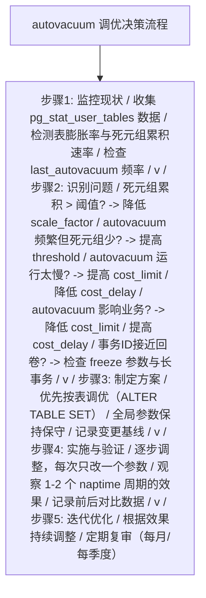
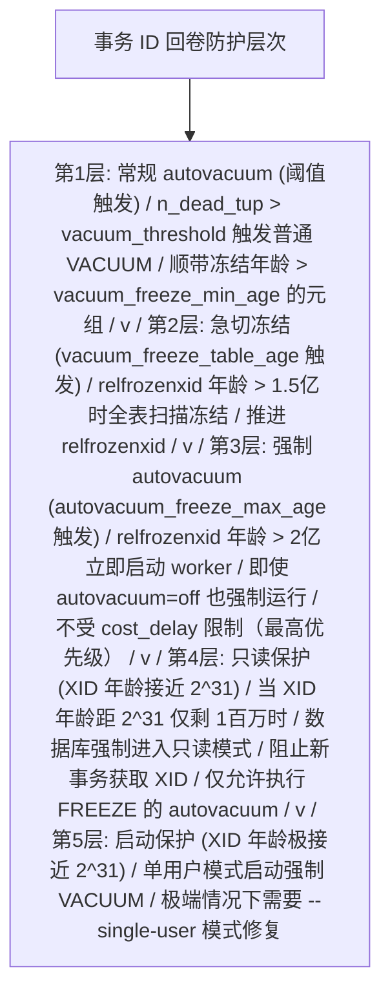
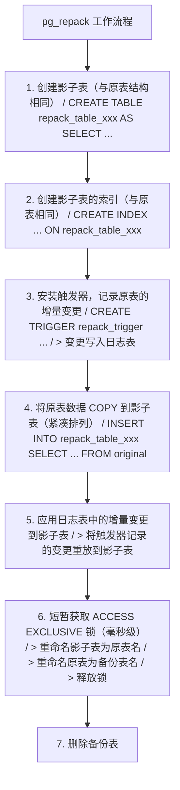
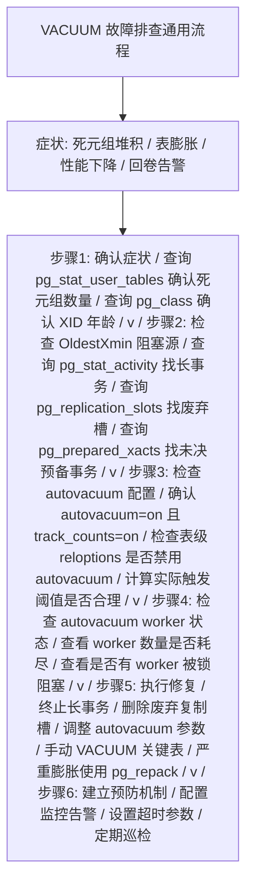

> 定位说明：本篇为进阶参考书（参考层），面向已完成本模块主线的读者；入门请先走学习路径前序阶段。定位标准见 docs/standards/reference-layer.md（仓库）。

## 前置知识

建议先阅读以下内容再进入本文：

- [VACUUM 机制](/postgresql/210-VACUUMMechanism)：死元组、可见性判断、标准 VACUUM 与 VACUUM FULL 的区别
- [Autovacuum 实战](/postgresql/212-VACUUMAutovacuum)：触发阈值与核心参数（排障时需要先判断"是不是参数问题"）

# PostgreSQL VACUUM 调优与排障（调优与排障篇）

> 本文是「PostgreSQL VACUUM」三篇系列的第三篇（调优与排障篇），面向生产环境 DBA，聚焦四条主线：膨胀诊断（pgstattuple 精确实测与统计估算）、表膨胀重建（pg_repack / pg_squeeze 在线方案与 VACUUM FULL 的锁代价）、事务 ID 回卷与 FREEZE 风暴的完整机制与排障，以及可直接落地的监控 SQL 清单与告警阈值建议。
>
> 系列另两篇：[VACUUM 机制](/postgresql/210-VACUUMMechanism)（MVCC 死元组与三步清理流程）与 [Autovacuum 实战](/postgresql/212-VACUUMAutovacuum)（守护进程、触发阈值与按表调参）。

主要章节：

- 第一章 参数总览与调优方法论
- 第二章 FREEZE 与事务 ID 回卷：机制与防护
- 第三章 膨胀诊断
- 第四章 表膨胀重建
- 第五章 性能影响与基准测试
- 第六章 监控 SQL 清单与告警阈值
- 第七章 故障排查实战
- 第八章 横向对比
- 第九章 练习题
- 第十章 参考文献与延伸阅读

---

## 第一章 参数总览与调优方法论

### 1.1 VACUUM 相关参数总览

以下表格汇总了所有 VACUUM 相关参数，按功能分类：

#### 1.1.1 autovacuum 控制参数

| 参数名                              | 类型    | 默认值  | 上下文     | 说明                        |
|-------------------------------------|---------|---------|------------|-----------------------------|
| autovacuum                          | boolean | on      | postmaster | 总开关                      |
| autovacuum_max_workers              | integer | 3       | postmaster | 最大 worker 数              |
| autovacuum_worker_slots (PG17+)     | integer | 16      | postmaster | 预留 worker 槽位            |
| autovacuum_naptime                  | integer | 1min    | sighup     | 检查间隔                    |
| log_autovacuum_min_duration         | integer | -1      | sighup     | 日志记录阈值                |

#### 1.1.2 VACUUM 触发阈值参数

| 参数名                                    | 类型    | 默认值 | 上下文 | 说明                    |
|-------------------------------------------|---------|--------|--------|-------------------------|
| autovacuum_vacuum_threshold               | integer | 50     | sighup | VACUUM 基数阈值         |
| autovacuum_vacuum_scale_factor            | real    | 0.2    | sighup | VACUUM 比例因子         |
| autovacuum_vacuum_insert_threshold (PG13+)| integer | 1000   | sighup | INSERT 触发基数         |
| autovacuum_vacuum_insert_scale_factor     | real    | 0.2    | sighup | INSERT 触发比例         |
| autovacuum_analyze_threshold              | integer | 50     | sighup | ANALYZE 基数阈值        |
| autovacuum_analyze_scale_factor           | real    | 0.1    | sighup | ANALYZE 比例因子        |

#### 1.1.3 FREEZE 相关参数

| 参数名                                  | 类型    | 默认值    | 上下文 | 说明                     |
|-----------------------------------------|---------|-----------|--------|--------------------------|
| vacuum_freeze_min_age                   | integer | 50000000  | user   | 元组冻结最小年龄         |
| vacuum_freeze_table_age                 | integer | 150000000 | user   | 急切冻结表年龄           |
| autovacuum_freeze_max_age               | integer | 200000000 | postmaster | 强制冻结阈值          |
| vacuum_multixact_freeze_min_age         | integer | 5000000   | user   | 多事务冻结最小年龄      |
| vacuum_multixact_freeze_table_age       | integer | 150000000 | user   | 多事务急切冻结表年龄    |
| autovacuum_multixact_freeze_max_age     | integer | 400000000 | postmaster | 多事务强制冻结阈值   |

#### 1.1.4 成本延迟参数

| 参数名                          | 类型    | 默认值 | 上下文 | 说明                        |
|---------------------------------|---------|--------|--------|-----------------------------|
| vacuum_cost_delay               | real    | 0      | user   | 手动 VACUUM 休眠时间        |
| vacuum_cost_limit               | integer | 200    | user   | 手动 VACUUM 成本配额        |
| vacuum_cost_page_hit            | integer | 1      | user   | 命中缓冲池的 cost           |
| vacuum_cost_page_miss           | integer | 2      | user   | 未命中缓冲池的 cost         |
| vacuum_cost_page_dirty          | integer | 20     | user   | 修改页面的 cost             |
| autovacuum_vacuum_cost_delay    | real    | 2ms    | sighup | autovacuum 休眠时间         |
| autovacuum_vacuum_cost_limit    | integer | -1     | sighup | autovacuum 成本配额(-1继承)|

#### 1.1.5 内存与缓冲参数

| 参数名                    | 类型    | 默认值  | 上下文     | 说明                        |
|---------------------------|---------|---------|------------|-----------------------------|
| maintenance_work_mem      | integer | 64MB    | user       | VACUUM 使用的内存            |
| autovacuum_work_mem      | integer | -1      | postmaster | autovacuum 专用内存(-1继承)|
| vacuum_buffer_usage_limit (PG17+) | integer | -1 | user  | VACUUM 缓冲池使用限制       |

### 1.2 调优决策流程

参数调优应遵循"测量-假设-验证-迭代"的科学方法，而非盲目套用公式。

#### 1.2.1 调优决策流程



### 1.3 maintenance_work_mem 调优

maintenance_work_mem 是影响 VACUUM 性能的关键内存参数。它决定了
VACUUM 的死元组数组大小。当死元组数超过此内存能容纳的上限时，
VACUUM 必须提前执行索引清理，导致多次索引扫描，严重影响性能。

死元组数组的容量计算：

```
每个死元组的行指针（ItemPointer）占 6 字节
最大死元组数 = maintenance_work_mem / 6

示例：
  maintenance_work_mem = 64MB = 67108864 字节
  最大死元组数 = 67108864 / 6 ≈ 11,184,810 (约1100万)

  如果表有 5000 万死元组，则需要 5 轮索引清理
  每轮索引清理都需要完整扫描所有索引
```

调优建议：

```sql
-- 对于大型表，增大 maintenance_work_mem
-- 注意：此值是每个 VACUUM/autovacuum worker 独立分配的
-- 总内存 = maintenance_work_mem * autovacuum_max_workers
ALTER SYSTEM SET maintenance_work_mem = '512MB';

-- 对于超大表（亿级行），可设为 1GB-2GB
-- 但需确保系统总内存充足
ALTER SYSTEM SET maintenance_work_mem = '1GB';

-- autovacuum 专用内存（PG14+）
-- 如果设置，autovacuum worker 使用此值而非 maintenance_work_mem
ALTER SYSTEM SET autovacuum_work_mem = '1GB';
```

---

## 第二章 FREEZE 与事务 ID 回卷：机制与防护

### 2.1 事务 ID（XID）机制

PostgreSQL 使用 32 位无符号整数表示事务 ID（Transaction ID, XID）。
32 位整数的取值范围是 0 到 4,294,967,295（约 42 亿）。事务 ID
在数据库运行期间单调递增，每开始一个新事务就分配一个新的 XID。

```
事务 ID 空间（32位）：

0                    2^31                    2^32-1
|--------|--------|--------|--------|--------|
0       1B       2B       3B       4B       ~4.29B

特殊值：
  0  = InvalidTransactionId (无效)
  1  = BootstrapTransactionId (引导)
  2  = FrozenTransactionId (冻结)
  3  = FirstNormalTransactionId (第一个正常事务)
```

32 位的 XID 空间看似很大（42 亿），但对于高吞吐系统，可能在
几周或几个月内耗尽。例如，一个每秒处理 1000 个事务的系统，
约 49 天就会用完 42 亿个 XID。

### 2.2 32 位限制与回卷风险

由于 XID 是 32 位的，当 XID 达到最大值后必须"回卷"（Wrap Around）
到较小的值重新使用。PostgreSQL 的回卷机制基于"模运算"比较：

```
XID 比较使用模 2^31 的环形空间：

将 32 位 XID 空间视为一个环：
                    2^31 (约21亿)
                       |
              已过去  |  未来
          (对当前可见)| (对当前不可见)
                       |
   当前XID ----->------|
                       |
          (对当前不可见)|  已过去
                       |  (对当前可见)
                       |
                    2^32-1 (约42亿)

对于"当前 XID" C 和"比较 XID" X：
  如果 (X - C) mod 2^32 < 2^31，则 X 在"过去"（已发生）
  如果 (X - C) mod 2^32 >= 2^31，则 X 在"未来"（未发生）
```

这种模运算比较使得 PostgreSQL 可以正确处理回卷。然而，如果
一个元组的 t_xmin 事务 ID 与当前 XID 的距离超过 2^31（约 21 亿），
模运算比较会将其误判为"未来事务"，导致该元组变得不可见。
这就是事务 ID 回卷问题的本质。

```
回卷问题图示：

假设当前 XID = 2^31 + 100 (约21亿+100)
某元组的 t_xmin = 100 (很久以前插入)

模运算比较：
  (100 - (2^31 + 100)) mod 2^32
  = (-2^31) mod 2^32
  = 2^31
  >= 2^31

判断结果：t_xmin 在"未来" -> 元组不可见！
实际：t_xmin 在很久以前的"过去" -> 元组应可见

后果：数据"消失"（逻辑上被误判为未来事务插入）
```

如果不加以防护，事务 ID 回卷会导致数据库中的数据"消失"，
因为旧元组的事务 ID 会被误认为是"未来"的。这是 PostgreSQL
最严重的故障之一。

### 2.3 FREEZE 操作

FREEZE 是 PostgreSQL 防止事务 ID 回卷的核心机制。自 PostgreSQL 9.4 起，
冻结不再把 t_xmin 改写为特殊值 FrozenTransactionId（值 2），而是在元组的
t_infomask 上设置 HEAP_XMIN_FROZEN 标志位（保留原始 xmin 以便审计追溯）。
冻结后的元组在可见性判断中被直接视为"已提交的过去事务"，对所有事务可见，
不再依赖原始 XID 做模运算比较，从而免疫回卷问题。

```
FREEZE 操作前后对比：

冻结前：
  元组: t_xmin=5000000, t_xmax=0, t_infomask=(XMIN_COMMITTED)
  可见性判断: 需要用 5000000 与当前 XID 做模运算比较
  风险: 如果当前 XID - 5000000 > 2^31，元组"消失"

冻结后（PostgreSQL 9.4+，标志位方式）：
  元组: t_xmin=5000000(保留), t_xmax=0, t_infomask=(HEAP_XMIN_FROZEN)
  可见性判断: 检测到冻结标志位 -> 直接返回"可见"
  效果: 永久可见，免疫 XID 回卷
```

FREEZE 的触发方式：

```sql
-- 方式1: 手动执行 VACUUM FREEZE
-- 强制冻结所有可冻结的元组（vacuum_freeze_min_age 被视为 0）
VACUUM FREEZE orders;

-- 方式2: autovacuum 自动冻结
-- 当表的 relfrozenxid 年龄超过 vacuum_freeze_table_age 时，
-- autovacuum 执行全表扫描的 VACUUM 并冻结符合条件的元组

-- 方式3: 指定选项的 VACUUM
VACUUM (FREEZE, VERBOSE) orders;
```

### 2.4 关键 FREEZE 参数详解

#### 2.4.1 vacuum_freeze_min_age

| 属性         | 值                                |
|--------------|-----------------------------------|
| 参数名       | vacuum_freeze_min_age             |
| 类型         | integer                           |
| 默认值       | 50000000 (5000万)                 |
| 最小值       | 0                                 |
| 最大值       | 1000000000 (10亿)                 |
| 推荐值       | 50000000 (默认)                   |
| 上下文       | user                              |
| 影响说明     | 元组 XID 年龄超过此值才被冻结     |

此参数定义了元组被冻结的"最小年龄"。在 VACUUM 扫描过程中，
如果某元组的 t_xmin 年龄（当前 XID - t_xmin）超过此值，则
冻结该元组。设置较低值会提前冻结元组，减少回卷风险但增加
VACUUM 工作量；设置较高值则相反。

```sql
-- 查看当前设置
SHOW vacuum_freeze_min_age;

-- 全局设置
ALTER SYSTEM SET vacuum_freeze_min_age = 50000000;
SELECT pg_reload_conf();

-- 按表设置
ALTER TABLE orders SET (vacuum_freeze_min_age = 10000000);
```

#### 2.4.2 vacuum_freeze_table_age

| 属性         | 值                                    |
|--------------|---------------------------------------|
| 参数名       | vacuum_freeze_table_age               |
| 类型         | integer                               |
| 默认值       | 150000000 (1.5亿)                     |
| 最小值       | 0                                     |
| 最大值       | 2000000000 (20亿)                     |
| 推荐值       | 150000000 (默认)                      |
| 上下文       | user                                  |
| 影响说明     | 表 relfrozenxid 年龄超过此值时触发全表扫描冻结 |

此参数控制 VACUUM 何时执行"急切冻结"（Eager Freezing）。当表的
relfrozenxid（表级冻结 XID）年龄超过此值时，VACUUM 会扫描全表
（即使有可见性映射也会扫描），主动冻结所有符合条件的元组，并
推进 relfrozenxid。

```
relfrozenxid 的含义：
  表级"冻结水位线"，所有 t_xmin < relfrozenxid 的元组已被冻结。
  age(relfrozenxid) = 当前 XID - relfrozenxid

VACUUM 的冻结策略：
  age(relfrozenxid) < vacuum_freeze_table_age:
    -> 惰性扫描（利用可见性映射跳过全冻结页）
    -> 不主动推进 relfrozenxid

  age(relfrozenxid) >= vacuum_freeze_table_age:
    -> 急切扫描（扫描所有页面，包括全可见页）
    -> 主动冻结所有年龄 >= vacuum_freeze_min_age 的元组
    -> 推进 relfrozenxid 到当前 OldestXmin
```

```sql
-- 查看各表的 relfrozenxid 年龄
SELECT
    relname,                          -- 表名
    age(relfrozenxid) AS xid_age,     -- XID 年龄
    relfrozenxid::text AS frozen_xid  -- 冻结水位线
FROM pg_class
WHERE relkind = 'r'                   -- 普通表
  AND relfrozenxid IS NOT NULL
ORDER BY xid_age DESC
LIMIT 20;
```

#### 2.4.3 autovacuum_freeze_max_age

| 属性         | 值                                        |
|--------------|-------------------------------------------|
| 参数名       | autovacuum_freeze_max_age                 |
| 类型         | integer                                   |
| 默认值       | 200000000 (2亿)                           |
| 最小值       | 100000                                   |
| 最大值       | 2000000000 (20亿)                         |
| 推荐值       | 200000000 (默认)                          |
| 上下文       | postmaster                                |
| 影响说明     | 表 relfrozenxid 年龄超过此值时强制触发 autovacuum |

此参数是防止事务 ID 回卷的"最后防线"。当任何表的 relfrozenxid
年龄达到此值时，autovacuum 会立即（不等待 naptime）启动 worker
执行冻结 VACUUM。即使 autovacuum 被关闭，此机制仍然生效。

此值必须小于 2^31（约21亿），留出足够的安全裕量。默认值 2 亿
提供了约 5% 的安全裕量。如果系统事务吞吐量极高，2 亿可能在
几天内达到，需要确保 autovacuum 能够及时完成冻结。

```sql
-- 监控接近回卷风险的表
SELECT
    relname,
    age(relfrozenxid) AS xid_age,
    round(100.0 * age(relfrozenxid) / 200000000, 2) AS pct_to_warning,
    round(100.0 * age(relfrozenxid) / 2147483647, 2) AS pct_to_wraparound
FROM pg_class
WHERE relkind = 'r'
  AND relfrozenxid IS NOT NULL
  AND age(relfrozenxid) > 150000000  -- 超过 1.5 亿的表
ORDER BY xid_age DESC;
```

### 2.5 回卷防护机制全景

PostgreSQL 的事务 ID 回卷防护是一个多层次机制：



### 2.6 多事务 ID（MultiXact）回卷

除了事务 ID 回卷，PostgreSQL 还有多事务 ID（MultiXact ID）回卷
问题。多事务 ID 用于表示多个事务同时对同一行持有共享锁（如
SELECT ... FOR SHARE）。

多事务 ID 也是 32 位的，同样存在回卷问题。防护机制与 XID 类似，
使用以下参数：

| 参数                                  | 默认值       | 含义                              |
|---------------------------------------|--------------|-----------------------------------|
| vacuum_multixact_freeze_min_age       | 5000000      | 元组多事务年龄超过此值才冻结      |
| vacuum_multixact_freeze_table_age     | 150000000    | 触发急切冻结的表级多事务年龄      |
| autovacuum_multixact_freeze_max_age   | 400000000    | 强制触发 autovacuum 的阈值        |

```sql
-- 查看多事务 ID 年龄
SELECT
    relname,
    age(relminmxid) AS mxid_age,        -- 多事务年龄
    relminmxid::text AS min_mxid        -- 表级最小多事务 ID
FROM pg_class
WHERE relkind = 'r'
  AND relminmxid IS NOT NULL
ORDER BY mxid_age DESC
LIMIT 20;
```

多事务 ID 回卷的症状比 XID 回卷更隐蔽，通常表现为行锁行为
异常或报错"MultiXactId X has not been created yet"。

### 2.7 回卷危机：典型触发条件与预防

**陷阱描述**：由于长事务、废弃复制槽或 autovacuum 失效，导致
表的 relfrozenxid 年龄逼近 2^31，数据库面临数据丢失风险。

**典型触发条件**：

1. 存在持续数天的长事务（如长-running 的分析查询、忘记关闭的事务）。
2. 复制槽未被消费，持有极旧的 xmin。
3. autovacuum 被手动关闭且无替代方案。
4. autovacuum worker 持续被锁阻塞无法完成冻结。

**症状**：

```
WARNING:  database "mydb" must be vacuumed within 177013 transactions
HINT:  To avoid a database shutdown, execute a database-wide VACUUM in that database.
```

**预防措施**：

```sql
-- 设置告警：relfrozenxid 年龄超过 1.5 亿时告警
-- 监控脚本
SELECT
    datname,
    age(datfrozenxid) AS db_age,
    round(100.0 * age(datfrozenxid) / 200000000, 2) AS pct_to_force
FROM pg_database
WHERE age(datfrozenxid) > 150000000;

-- 确保无长事务
SET statement_timeout = '300s';          -- 语句超时5分钟
SET idle_in_transaction_session_timeout = '600s';  -- 空闲事务超时10分钟

-- 清理废弃复制槽
SELECT pg_drop_replication_slot(slot_name)
FROM pg_replication_slots
WHERE active = false
  AND xmin IS NOT NULL
  AND age(xmin) > 100000000;
```

---

## 第三章 膨胀诊断

表膨胀（Table Bloat）是指表的物理大小远大于其逻辑数据量。膨胀率
是衡量 VACUUM 效果的核心指标。

### 3.1 基于统计信息的估算

```sql
-- 简单膨胀率估算（基于统计信息，速度快但精度低）
SELECT
    schemaname,
    relname,
    n_live_tup,                              -- 活元组数
    n_dead_tup,                              -- 死元组数
    round(
        100.0 * n_dead_tup / NULLIF(n_live_tup + n_dead_tup, 0),
        2
    ) AS dead_pct,                           -- 死元组百分比
    pg_size_pretty(pg_relation_size(relid)) AS table_size,  -- 表大小
    last_autovacuum,                         -- 上次自动清理时间
    last_vacuum                              -- 上次手动清理时间
FROM pg_stat_user_tables
WHERE n_live_tup > 0
ORDER BY dead_pct DESC
LIMIT 20;
```

### 3.2 基于 pgstattuple 的精确估算

```sql
-- 精确膨胀率估算（基于实际页面采样，精度高但耗时）
-- 使用 pgstattuple 扩展
CREATE EXTENSION IF NOT EXISTS pgstattuple;

-- 查看单表膨胀详情
SELECT * FROM pgstattuple('orders');
-- 返回字段：
--   table_len:        表总字节数
--   tuple_count:      活元组数
--   tuple_len:        活元组总字节数
--   tuple_percent:    活元组占比
--   dead_tuple_count: 死元组数
--   dead_tuple_len:   死元组总字节数
--   dead_tuple_percent: 死元组占比
--   free_space:       空闲空间字节数
--   free_percent:     空闲空间占比

-- 批量查看所有表膨胀
SELECT
    schemaname,
    relname,
    table_len,
    tuple_percent,
    dead_tuple_percent,
    free_percent,
    table_len - tuple_len AS bloat_bytes,    -- 膨胀字节数
    round(100.0 * (table_len - tuple_len) / table_len, 2) AS bloat_pct
FROM pgstattuple_approx('public.orders'::regclass);
```

### 3.3 索引膨胀检测

```sql
-- 使用 pgstatindex 扩展检测索引膨胀
CREATE EXTENSION IF NOT EXISTS pgstattuple;

-- 查看单个索引的膨胀情况
SELECT * FROM pgstatindex('idx_orders_status');
-- 返回字段：
--   version:          版本
--   tree_level:       B-Tree 层级
--   index_size:       索引大小(字节)
--   root_block_no:    根节点块号
--   internal_pages:   内部页数
--   leaf_pages:       叶子页数
--   empty_pages:      空页数
--   deleted_pages:    已删除页数
--   avg_leaf_density: 平均叶子密度(越高越好)
--   leaf_fragmentation: 叶子碎片率(越低越好)

-- 批量检测所有索引膨胀
SELECT
    schemaname,
    relname AS table_name,
    indexrelname AS index_name,
    pg_size_pretty(pg_relation_size(indexrelid)) AS index_size,
    idx_scan,                                -- 索引扫描次数
    idx_tup_read,                            -- 读取的元组数
    idx_tup_fetch                            -- 获取的元组数
FROM pg_stat_user_indexes
ORDER BY pg_relation_size(indexrelid) DESC
LIMIT 20;
```

### 3.4 膨胀检测完整脚本

```sql
-- 完整的表膨胀检测脚本
-- 结合 pgstattuple 与统计信息

-- 步骤1: 基于统计信息的快速筛查
WITH stat_bloat AS (
    SELECT
        schemaname,
        relname,
        n_live_tup,
        n_dead_tup,
        round(
            100.0 * n_dead_tup /
            NULLIF(n_live_tup + n_dead_tup, 0), 2
        ) AS dead_pct,
        pg_relation_size(relid) AS table_bytes,
        relid
    FROM pg_stat_user_tables
    WHERE n_live_tup > 10000  -- 仅检查大于1万行的表
)
SELECT
    schemaname,
    relname,
    n_live_tup,
    n_dead_tup,
    dead_pct,
    pg_size_pretty(table_bytes) AS table_size,
    last_autovacuum
FROM stat_bloat
WHERE dead_pct > 10  -- 死元组占比超过10%
ORDER BY dead_pct DESC;

-- 步骤2: 对高膨胀表执行精确测量
-- 需要安装 pgstattuple 扩展
CREATE EXTENSION IF NOT EXISTS pgstattuple;

SELECT
    table_name,
    table_len,
    tuple_len,
    tuple_percent,
    dead_tuple_len,
    dead_tuple_percent,
    free_space,
    free_percent,
    table_len - tuple_len AS bloat_bytes,
    round(100.0 * (table_len - tuple_len) / table_len, 2) AS bloat_pct
FROM (
    SELECT
        relname AS table_name,
        table_len,
        tuple_len,
        tuple_percent,
        dead_tuple_count,
        dead_tuple_len,
        dead_tuple_percent,
        free_space,
        free_percent
    FROM pgstattuple('orders')  -- 替换为实际表名
) t;

-- 步骤3: 索引膨胀检测
SELECT
    schemaname,
    relname AS table_name,
    indexrelname AS index_name,
    pg_size_pretty(pg_relation_size(indexrelid)) AS index_size,
    idx_scan AS index_scans,
    idx_tup_read,
    idx_tup_fetch,
    round(
        100.0 * idx_tup_fetch / NULLIF(idx_tup_read, 0), 2
    ) AS fetch_pct  -- 获取率，越低说明索引效率越差
FROM pg_stat_user_indexes
WHERE idx_scan > 0
ORDER BY pg_relation_size(indexrelid) DESC;
```

### 3.5 索引膨胀陷阱与治理

**陷阱描述**：VACUUM 清理了堆表死元组，但索引中仍残留大量指向
死元组的空叶节点，导致索引膨胀。

**根因**：

1. 频繁 UPDATE 的列上有索引，每次 UPDATE 都产生新索引项。
2. VACUUM 的索引清理未能有效回收索引空间（标准 VACUUM 不收缩索引）。
3. 长期运行的 VACUUM FULL 之间，索引持续膨胀。

**诊断**：

```sql
-- 使用 pgstatindex 检测索引膨胀
SELECT * FROM pgstatindex('idx_orders_status');

-- 关键指标：
--   avg_leaf_density < 50%  -> 严重膨胀
--   leaf_fragmentation > 50% -> 需要重建
```

**解决方案**：

```sql
-- 方案1: REINDEX（PG12+ 支持并发）
REINDEX INDEX CONCURRENTLY idx_orders_status;

-- 方案2: REINDEX TABLE（重建所有索引）
REINDEX TABLE CONCURRENTLY orders;

-- 方案3: 使用 pg_repack 重建表+索引
SELECT repack_table('orders');
```

---

## 第四章 表膨胀重建

标准 VACUUM 只把死元组空间标记为可重用，不会把磁盘空间还给操作系统（表末尾空页的截断是唯一例外）；VACUUM FULL 虽能物理收缩文件，但需要 ACCESS EXCLUSIVE 锁，在整个执行期间表完全不可读写，生产大表执行可能持续数小时甚至数天（两种模式的逐项对比见 [VACUUM 机制](/postgresql/210-VACUUMMechanism) 4.2 节）。因此，当膨胀已经形成时，正确的问题不是"要不要重建"，而是"用哪种工具、付出什么代价、如何控制风险"。本章给出完整的选型与操作方案。

### 4.1 三种清理工具对比

这三种工具都能处理表膨胀，但适用场景和代价不同。

| 对比维度       | 标准 VACUUM       | VACUUM FULL       | pg_repack             |
|----------------|-------------------|-------------------|-----------------------|
| 锁级别         | SHARE UPDATE EXCL | ACCESS EXCLUSIVE  | 短暂锁（几乎不阻塞）  |
| 并发影响       | 低                | 高（全程阻塞）    | 极低                  |
| 空间回收       | 标记可重用        | 物理收缩返回OS    | 物理收缩返回OS        |
| 索引处理       | 清理索引项        | 完全重建          | 完全重建              |
| 执行速度       | 快                | 慢                | 中                    |
| 额外空间需求   | 无                | 需要等量空间      | 需要等量空间          |
| 额外依赖       | 无                | 无                | 需安装扩展            |
| 主键要求       | 无                | 无                | 必须有主键或非空唯一键|
| 适用场景       | 日常维护          | 极端膨胀+可停机   | 生产环境在线消除膨胀  |

**pg_repack 工作原理**：



**pg_repack 使用示例**：

```sql
-- 安装扩展
CREATE EXTENSION pg_repack;

-- 对单表执行在线重建
-- 命令行执行（非 SQL）
-- pg_repack -d mydb -t orders -j 2
-- -d: 数据库名
-- -t: 表名
-- -j: 并行 worker 数

-- 对所有表执行在线重建
-- pg_repack -d mydb

-- 仅重建索引
-- pg_repack -d mydb -t orders --index-only

-- 仅重建指定索引
-- pg_repack -d mydb -t orders --index=idx_orders_status
```

### 4.3 pg_squeeze 简介

pg_squeeze 是另一个在线消除膨胀的扩展工具，与 pg_repack 类似
但实现方式不同。pg_squeeze 使用逻辑解码而非触发器捕获增量变更，
减少了对原表的写入放大。

| 对比维度       | pg_repack         | pg_squeeze                |
|----------------|-------------------|---------------------------|
| 增量捕获方式   | 触发器            | 逻辑解码                  |
| 对原表写入影响 | 有（触发器开销）  | 无                        |
| 依赖           | 无特殊依赖        | 逻辑复制槽                |
| 主键要求       | 必须有            | 必须有                    |
| 成熟度         | 高（广泛使用）    | 中                        |

```sql
-- pg_squeeze 使用示例
CREATE EXTENSION pg_squeeze;

-- 对表执行 squeeze
SELECT squeeze.table('orders');

-- 查看 squeeze 任务状态
SELECT * FROM squeeze.tasks;
```

### 4.4 工具选择决策树

```
是否需要消除膨胀?
  |
  +-- 否 -> 日常维护: 标准 VACUUM (autovacuum 自动执行)
  |
  +-- 是 -> 膨胀程度如何?
            |
            +-- 轻度 (<30%) -> 调优 autovacuum 参数，等待自动回收
            |
            +-- 中度 (30%-60%) -> 手动 VACUUM + 调优参数
            |
            +-- 重度 (>60%)
                |
                +-- 是否可以停机?
                    |
                    +-- 是 -> VACUUM FULL (低峰期执行)
                    |
                    +-- 否 -> 是否有主键?
                        |
                        +-- 是 -> pg_repack 或 pg_squeeze
                        |
                        +-- 否 -> 评估添加主键 / 接受膨胀
                                  或计划维护窗口执行 VACUUM FULL
```

### 4.5 重建相关的反模式

**反模式二：在高峰期执行 VACUUM FULL**

```sql
-- 错误：业务高峰期执行 VACUUM FULL 导致长时间锁表
VACUUM FULL orders;  -- 阻塞业务数小时

-- 正确：低峰期执行或使用 pg_repack
-- 低峰期
VACUUM FULL orders;

-- 或在线重建
SELECT repack_table('orders');
```

**反模式四：忽视 TOAST 表的膨胀**

```sql
-- 错误：只关注主表膨胀，忽视 TOAST 表
-- 大文本/字节数据存储在 TOAST 表中，同样会膨胀

-- 正确：检查 TOAST 表的膨胀
SELECT
    c.relname AS main_table,
    t.relname AS toast_table,
    pg_size_pretty(pg_relation_size(c.oid)) AS main_size,
    pg_size_pretty(pg_relation_size(t.oid)) AS toast_size
FROM pg_class c
JOIN pg_class t ON c.reltoastrelid = t.oid
WHERE c.relkind = 'r'
ORDER BY pg_relation_size(t.oid) DESC;
```

---

## 第五章 性能影响与基准测试

### 5.1 VACUUM 对性能的影响维度

VACUUM 对数据库性能的影响可以从以下五个维度量化：

1. **I/O 影响**：VACUUM 产生大量的磁盘读写，与业务 I/O 竞争。
2. **CPU 影响**：可见性判断、索引清理消耗 CPU。
3. **内存影响**：死元组数组占用 maintenance_work_mem。
4. **缓冲池影响**：VACUUM 读取的页面可能驱逐业务热点页面。
5. **锁影响**：SHARE UPDATE EXCLUSIVE 锁阻止并发 DDL。

### 5.2 基准测试案例

以下基准测试在以下环境进行：

- 硬件：Intel Xeon Gold 6248R @ 3.0GHz / 128GB RAM / NVMe SSD
- 软件：PostgreSQL 16.2 / Ubuntu 22.04 LTS
- 配置：shared_buffers=32GB / max_connections=200

#### 5.2.1 测试一：autovacuum scale_factor 对膨胀的影响

测试表：1000 万行，每行约 200 字节，持续 UPDATE 50% 行。

| scale_factor | 触发时死元组数 | 最大膨胀率 | VACUUM 频率 | 查询延迟(P95) |
|--------------|----------------|------------|-------------|---------------|
| 0.2 (默认)   | 2,000,050      | 38.5%      | 每 45 分钟  | 125ms         |
| 0.1          | 1,000,050      | 22.3%      | 每 25 分钟  | 98ms          |
| 0.05         | 500,050        | 12.1%      | 每 14 分钟  | 82ms          |
| 0.02         | 200,050        | 5.8%       | 每 6 分钟   | 75ms          |
| 0.01         | 100,050        | 3.2%       | 每 3 分钟   | 78ms          |

分析：scale_factor 从 0.2 降到 0.05，膨胀率从 38.5% 降至 12.1%，
查询延迟改善 34%。但降到 0.01 时，VACUUM 过于频繁，I/O 竞争导致
延迟略有回升。推荐大表设置 0.02-0.05。

#### 5.2.2 测试二：maintenance_work_mem 对 VACUUM 耗时的影响

测试表：1 亿行，5000 万死元组，3 个索引（总计约 30GB）。

| maintenance_work_mem | 死元组数组容量 | 索引扫描轮数 | VACUUM 总耗时 | 索引清理耗时 |
|----------------------|----------------|--------------|---------------|--------------|
| 64MB (默认)          | ~1100万        | 5 轮         | 42 分钟       | 28 分钟      |
| 256MB                | ~4400万        | 2 轮         | 22 分钟       | 12 分钟      |
| 512MB                | ~8900万        | 1 轮         | 14 分钟       | 6 分钟       |
| 1GB                  | ~1.78亿        | 1 轮         | 13 分钟       | 5 分钟       |
| 2GB                  | ~3.57亿        | 1 轮         | 13 分钟       | 5 分钟       |

分析：maintenance_work_mem 从 64MB 提升到 512MB，VACUUM 耗时减少
67%。但超过 1GB 后收益递减，因为索引清理不再是瓶颈。推荐大表
VACUUM 时设置 512MB-1GB。

#### 5.2.3 测试三：cost_delay 对业务影响与 VACUUM 速度的平衡

测试场景：OLTP 负载 5000 TPS，同时执行 autovacuum 清理 1000 万死元组。

| cost_delay | cost_limit | VACUUM 耗时 | 业务 TPS 影响 | 业务延迟(P99) |
|------------|------------|-------------|---------------|---------------|
| 0ms        | 2000       | 8 分钟      | -15%          | 180ms         |
| 1ms        | 1000       | 15 分钟     | -5%           | 95ms          |
| 2ms (默认) | 200        | 45 分钟     | -1%           | 52ms          |
| 5ms        | 200        | 95 分钟     | <1%           | 48ms          |
| 10ms       | 200        | 180 分钟    | <1%           | 47ms          |

分析：cost_delay=0 时 VACUUM 最快，但业务 TPS 下降 15%。默认设置
(2ms/200) 对业务影响极小但 VACUUM 较慢。推荐低峰期设为 1ms/1000，

### 5.3 I/O 影响分析

VACUUM 的 I/O 模式与业务查询不同，具有以下特征：

1. **顺序读为主**：VACUUM 顺序扫描堆表页面。
2. **随机写**：索引清理产生随机 I/O。
3. **大批量**：单次 VACUUM 可能扫描整个表。

使用 iostat 监控 VACUUM 期间的 I/O：

```bash
# 监控磁盘 I/O（每 5 秒刷新）
iostat -x 5

# 关注指标：
#   %util   : 磁盘利用率（VACUUM 期间可能接近 100%）
#   await   : I/O 等待时间（VACUUM 期间可能升高）
#   r/s w/s : 每秒读写次数
```

PostgreSQL 内部的 I/O 影响控制：

```sql
-- 查看当前 VACUUM 的 I/O 统计（PG17+）
SELECT
    pid,
    relid::regclass AS table_name,
    command,
    phase,
    buffer_usage_limit,                     -- 缓冲使用限制
    heap_blks_total,                        -- 堆总块数
    heap_blks_scanned,                      -- 已扫描块数
    heap_blks_vacuumed,                     -- 已清理块数
    index_vacuum_count                      -- 索引清理轮数
FROM pg_stat_progress_vacuum;
```
---

## 第六章 监控 SQL 清单与告警阈值

### 6.1 事务 ID 回卷监控

```sql
-- 事务ID回卷风险监控（推荐每5分钟执行一次）
SELECT
    c.relname AS table_name,
    c.relnamespace::regnamespace AS schema_name,
    age(c.relfrozenxid) AS xid_age,                  -- XID年龄
    c.relfrozenxid::text AS frozen_xid,              -- 冻结XID
    round(
        100.0 * age(c.relfrozenxid) / 200000000, 2
    ) AS pct_to_autovacuum,                          -- 距强制autovacuum百分比
    round(
        100.0 * age(c.relfrozenxid) / 2147483647, 2
    ) AS pct_to_wraparound,                          -- 距回卷百分比
    pg_size_pretty(pg_relation_size(c.oid)) AS size  -- 表大小
FROM pg_class c
WHERE c.relkind IN ('r', 't', 'm')                   -- 普通表/TOAST/物化视图
  AND c.relfrozenxid IS NOT NULL
  AND age(c.relfrozenxid) > 100000000                -- 年龄 > 1亿
ORDER BY xid_age DESC;
```

```sql
-- 数据库级 XID 消耗速率监控
SELECT
    datname,
    age(datfrozenxid) AS db_xid_age,                 -- 数据库XID年龄
    datfrozenxid::text AS db_frozen_xid,
    round(
        age(datfrozenxid) / 3600.0, 2
    ) AS xids_per_hour_estimate                      -- 估算每小时XID消耗(需多次采样)
FROM pg_database
ORDER BY db_xid_age DESC;
```

### 6.2 长事务与复制槽监控

```sql
-- 长事务监控（可能阻止死元组清理）
SELECT
    pid,
    usename,
    application_name,
    client_addr,
    state,
    backend_xmin,                                    -- 持有的xmin
    backend_xid,                                     -- 当前事务XID
    xact_start,                                      -- 事务开始时间
    now() - xact_start AS transaction_duration,      -- 事务持续时间
    query_start,
    now() - query_start AS query_duration,
    query,
    state_change
FROM pg_stat_activity
WHERE state != 'idle'
  AND xact_start IS NOT NULL
  AND now() - xact_start > interval '5 minutes'      -- 超过5分钟的事务
ORDER BY xact_start;
```

```sql
-- 复制槽监控（废弃的复制槽会阻止清理）
SELECT
    slot_name,
    plugin,
    slot_type,
    datname,
    temporary,
    active,                                          -- 是否活跃
    active_pid,                                      -- 活跃进程PID
    xmin,                                            -- 持有的xmin
    catalog_xmin,                                    -- 目录xmin
    restart_lsn,                                     -- 重启LSN
    confirmed_flush_lsn,                             -- 确认刷新LSN
    wal_status,                                      -- WAL状态
    safe_wal_size,                                   -- 安全WAL大小
    now() - pg_wal_lsn_diff(pg_current_wal_lsn(), restart_lsn) AS lag_duration
FROM pg_replication_slots
ORDER BY xmin;
```

### 6.3 综合监控仪表板（XID 与阻塞源）

```sql
-- 3. XID 回卷风险
SELECT
    count(*) AS tables_at_risk,
    max(age(relfrozenxid)) AS max_xid_age,
    round(100.0 * max(age(relfrozenxid)) / 200000000, 2) AS max_pct_to_force
FROM pg_class
WHERE relkind = 'r'
  AND age(relfrozenxid) > 150000000;

-- 4. 阻塞源
SELECT
    count(*) AS blocking_sessions
FROM pg_stat_activity
WHERE state != 'idle'
  AND xact_start IS NOT NULL
  AND now() - xact_start > interval '10 minutes';

-- 5. 废弃复制槽
SELECT
    count(*) AS inactive_slots
FROM pg_replication_slots
WHERE active = false;
```

### 6.4 生产环境配置基线

以下是针对不同规模数据库的推荐配置基线。

#### 6.4.1 小型数据库（< 50GB）

```ini
# postgresql.conf 推荐配置
autovacuum = on
autovacuum_max_workers = 3                    # 保持默认
autovacuum_naptime = '1min'                   # 保持默认
autovacuum_vacuum_cost_delay = '2ms'          # 保持默认
autovacuum_vacuum_cost_limit = 200            # 保持默认
maintenance_work_mem = '128MB'                # 适度提升
log_autovacuum_min_duration = 0               # 记录所有autovacuum
```

#### 6.4.2 中型数据库（50GB - 500GB）

```ini
# postgresql.conf 推荐配置
autovacuum = on
autovacuum_max_workers = 5                    # 适当增加
autovacuum_naptime = '45s'                    # 略微缩短
autovacuum_vacuum_cost_delay = '2ms'
autovacuum_vacuum_cost_limit = 500            # 提高配额
maintenance_work_mem = '512MB'                # 显著提升
log_autovacuum_min_duration = '1s'            # 仅记录耗时>1s的操作

# 大表按表调优（在SQL中设置）
# ALTER TABLE big_table SET (autovacuum_vacuum_scale_factor = 0.05);
```

#### 6.4.3 大型数据库（> 500GB）

```ini
# postgresql.conf 推荐配置
autovacuum = on
autovacuum_max_workers = 8                    # 大幅增加
autovacuum_naptime = '30s'                    # 缩短检查间隔
autovacuum_vacuum_cost_delay = '1ms'          # 降低延迟
autovacuum_vacuum_cost_limit = 1000           # 大幅提高配额
autovacuum_work_mem = '1GB'                   # autovacuum专用内存
maintenance_work_mem = '1GB'                  # 手动VACUUM内存
log_autovacuum_min_duration = '5s'            # 仅记录耗时>5s的操作

# 关键大表必须按表调优
```

### 6.5 告警阈值建议

监控只有配上阈值才构成告警。以下基线来自常见生产实践，可按业务容忍度调整：

| 监控项 | 指标 | 预警阈值 | 紧急阈值 | 说明 |
|--------|------|----------|----------|------|
| 死元组堆积 | dead_tuple_pct（pg_stat_user_tables） | > 20% 持续 1 小时 | > 50% | 结合 n_live_tup 绝对值过滤噪声 |
| 表膨胀 | pgstattuple 的 bloat_pct | > 30% | > 60% | 对 Top 表定期精确采样 |
| autovacuum 停摆 | last_autovacuum 距今 | > 2 小时（高频表） | > 24 小时 | 需按表分级，冷表可豁免 |
| XID 年龄（表级） | age(relfrozenxid) | > 1.5 亿 | > 1.8 亿 | 2 亿为强制 autovacuum 线 |
| XID 年龄（库级） | age(datfrozenxid) | > 1.5 亿 | > 1.8 亿 | 库级是只读保护的直接前兆 |
| 长事务 | 事务持续时间 | > 10 分钟 | > 1 小时 | 检查 idle in transaction |
| 废弃复制槽 | active = false 且 xmin 非空 | 出现即告警 | lag > 1GB | 会同时卡死元组与 WAL |
| VACUUM 无法清理 | VACUUM VERBOSE 的 nonremovable | 持续增长即告警 | - | 提示 OldestXmin 被钉住 |

两条落地建议：其一，所有阈值告警都应携带"距危险线的百分比"而非裸数值（例如 pct_to_wraparound），方便分级；其二，autovacuum 相关告警必须与 track_counts、autovacuum 开关的巡检联动——统计关闭时死元组指标会整体失真，容易漏报。

---

## 第七章 故障排查实战

### 7.1 案例一：事务 ID 即将回卷导致数据库只读

**现象描述**

某电商平台 PostgreSQL 数据库在业务高峰期突然变为只读状态，所有
写操作报错：

```
ERROR:  database is not accepting commands to avoid wraparound data loss in database "ecommerce"
HINT:  Stop the postmaster and vacuum that database in single-user mode.
```

**排查过程**

```sql
-- 步骤1: 检查数据库 XID 年龄（在只读状态下仍可查询）
SELECT
    datname,
    age(datfrozenxid) AS xid_age,
    round(100.0 * age(datfrozenxid) / 2147483647, 2) AS pct_to_wraparound
FROM pg_database
ORDER BY xid_age DESC;

-- 结果：ecommerce 数据库 XID 年龄 = 2,147,400,000，距回卷仅剩 483,647

-- 步骤2: 检查哪张表导致回卷风险
SELECT
    relname,
    age(relfrozenxid) AS xid_age,
    last_autovacuum,
    autovacuum_count
FROM pg_class
WHERE relkind = 'r'
  AND age(relfrozenxid) > 2000000000
ORDER BY xid_age DESC;

-- 结果：表 user_sessions 的 XID 年龄 = 2,147,390,000
--       last_autovacuum = NULL（从未被 autovacuum 处理）
--       autovacuum_count = 0

-- 步骤3: 检查为何 autovacuum 未处理该表
SELECT reloptions FROM pg_class WHERE relname = 'user_sessions';
-- 结果: {autovacuum_enabled=false}  -- autovacuum 被禁用!

-- 步骤4: 检查是否有长事务阻止冻结
SELECT
    pid,
    backend_xmin,
    now() - xact_start AS duration,
    query
FROM pg_stat_activity
WHERE backend_xmin IS NOT NULL
ORDER BY backend_xmin ASC;

-- 结果：发现一个 ETL 进程持有 xmin=100000000 的旧快照，已运行 72 小时
```

**根因分析**

1. 表 user_sessions 被设置了 autovacuum_enabled=false（可能由前任 DBA 设置）。
2. 一个 ETL 长事务运行 72 小时，持有极旧的 xmin。
3. 该表是高频更新表，XID 消耗极快。
4. 三重因素叠加导致 XID 年龄逼近回卷阈值，数据库进入只读保护。

**解决方案**

```sql
-- 紧急步骤1: 终止长事务
SELECT pg_terminate_backend(pid)
FROM pg_stat_activity
WHERE pid = <ETL进程PID>;

-- 紧急步骤2: 启用表的 autovacuum
ALTER TABLE user_sessions SET (autovacuum_enabled = true);

-- 紧急步骤3: 手动执行 FREEZE
-- 注意：只读状态下无法执行 VACUUM，需要先解除只读
```

数据库已进入只读保护后，普通模式下无法执行 VACUUM，需要先解除只读。标准做法是以单用户模式启动并执行冻结：

```text
# 步骤 3（续）：单用户模式执行 FREEZE
# 1) 停止正常实例
pg_ctl stop -D $PGDATA

# 2) 以单用户模式进入问题数据库
postgres --single -D $PGDATA ecommerce

# 3) 在单用户模式提示符中执行（回车两次确认执行）：
VACUUM FREEZE user_sessions;

# 4) 按 Ctrl+D 退出单用户模式，恢复正常启动
pg_ctl start -D $PGDATA
```

**预防措施**

```sql
-- 措施1: 全局禁止关闭 autovacuum（通过监控告警）
-- 定期检查是否有表禁用了 autovacuum
SELECT relname, reloptions
FROM pg_class
WHERE relkind = 'r'
  AND reloptions::text LIKE '%autovacuum_enabled=false%';

-- 措施2: 设置 idle_in_transaction_session_timeout
ALTER SYSTEM SET idle_in_transaction_session_timeout = '600s';
-- 自动终止超过10分钟的空闲事务

-- 措施3: 设置 statement_timeout 防止超长查询
ALTER SYSTEM SET statement_timeout = '300s';

-- 措施4: 监控 XID 年龄并设置告警
-- 当任何表 XID 年龄 > 1.5亿时告警
-- 当任何数据库 XID 年龄 > 1.8亿时紧急告警
```

**经验教训**

1. 永远不要在生产表上设置 autovacuum_enabled=false。
2. 必须监控并控制长事务，设置 idle_in_transaction_session_timeout。
3. 建立事务 ID 回卷预警机制，提前发现风险。
4. ETL 任务应有超时机制，避免无限期运行。

### 7.2 案例二：复制槽导致的死元组堆积

**现象描述**

某 SaaS 平台 PostgreSQL 主库磁盘空间持续增长，VACUUM VERBOSE 显示
大量"nonremovable row versions"，但无长事务。业务查询性能逐渐下降。

**排查过程**

```sql
-- 步骤1: 检查死元组无法清理的原因
VACUUM (VERBOSE) tenant_data;
-- 输出: "897623 row versions cannot be removed yet"
-- 说明存在持有旧 xmin 的对象

-- 步骤2: 检查长事务（无发现）
SELECT pid, backend_xmin, now() - xact_start AS duration
FROM pg_stat_activity
WHERE backend_xmin IS NOT NULL
  AND now() - xact_start > interval '10 minutes';
-- 结果: 0 行（无长事务）

-- 步骤3: 检查复制槽
SELECT
    slot_name,
    active,
    active_pid,
    xmin,
    catalog_xmin,
    restart_lsn,
    pg_wal_lsn_diff(pg_current_wal_lsn(), restart_lsn) AS lag_bytes
FROM pg_replication_slots
ORDER BY xmin ASC;

-- 结果：
-- slot_name      | active | xmin      | lag_bytes
-- etl_slot       | f      | 12345678  | 45 GB
-- replica_slot   | t      | 56789012  | 2 MB
```

**根因分析**

复制槽 etl_slot 处于非活跃状态（active=f），但持有 xmin=12345678
（非常旧的事务 ID）。该复制槽对应的 ETL 消费进程已崩溃，但复制槽
未被删除。PostgreSQL 为保证该复制槽能够恢复消费，保留了自该 xmin
之后的所有死元组和 WAL 日志，导致：

1. 主库堆表死元组无法清理，表持续膨胀。
2. WAL 日志堆积（45GB），磁盘空间告急。
3. 查询扫描大量死元组，性能下降。

**解决方案**

```sql
-- 步骤1: 确认复制槽确实废弃
-- 检查 active_pid 是否存在（如果存在说明消费者仍连接）
SELECT slot_name, active, active_pid
FROM pg_replication_slots
WHERE slot_name = 'etl_slot';
-- active=f, active_pid=NULL -> 确实废弃

-- 步骤2: 删除废弃的复制槽
SELECT pg_drop_replication_slot('etl_slot');

-- 步骤3: 等待 autovacuum 自动清理（或手动触发）
VACUUM (VERBOSE) tenant_data;
-- 此时 OldestXmin 前进，死元组可被清理

-- 步骤4: 监控磁盘空间回收
SELECT pg_size_pretty(pg_database_size('saas_db'));
```

**预防措施**

```sql
-- 措施1: 定期检查废弃复制槽
SELECT slot_name, active, xmin,
       pg_wal_lsn_diff(pg_current_wal_lsn(), restart_lsn) AS lag
FROM pg_replication_slots
WHERE active = false;

-- 措施2: 设置复制槽超时（PG13+ max_slot_wal_keep_size）
ALTER SYSTEM SET max_slot_wal_keep_size = '10GB';
-- 限制复制槽可保留的 WAL 大小，防止无限堆积

-- 措施3: 监控脚本（集成到告警系统）
-- 每小时检查一次，lag > 1GB 的非活跃槽告警
```

### 7.3 案例三：autovacuum 跟不上高写入负载

**现象描述**

某游戏平台排行榜表（leaderboard）每秒处理 5 万次 UPDATE，表大小
从预期的 2GB 膨胀到 18GB。查询延迟从 10ms 飙升到 500ms，玩家
投诉卡顿。

**排查过程**

```sql
-- 步骤1: 检查表膨胀情况
SELECT
    relname,
    n_live_tup,
    n_dead_tup,
    round(100.0 * n_dead_tup / n_live_tup, 2) AS dead_ratio,
    last_autovacuum,
    autovacuum_count,
    pg_size_pretty(pg_relation_size(relid)) AS size
FROM pg_stat_user_tables
WHERE relname = 'leaderboard';

-- 结果：
-- n_live_tup = 1,000,000
-- n_dead_tup = 8,500,000  (死元组是活元组的8.5倍!)
-- dead_ratio = 850%
-- last_autovacuum = 2小时前
-- autovacuum_count = 3 (整天只触发3次)

-- 步骤2: 检查 autovacuum 配置
SHOW autovacuum_vacuum_scale_factor;  -- 0.2 (默认)
SHOW autovacuum_vacuum_cost_delay;    -- 2ms (默认)
SHOW autovacuum_vacuum_cost_limit;    -- 200 (默认)

-- 步骤3: 计算当前触发阈值
-- 阈值 = 50 + 0.2 * 1,000,000 = 200,050
-- 需要累积 20 万死元组才触发，对高频表太迟钝

-- 步骤4: 检查 autovacuum worker 状态
SELECT count(*) FROM pg_stat_activity
WHERE backend_type = 'autovacuum worker';
-- 结果: 3 (全部被其他表占用)
```

**根因分析**

1. 默认 scale_factor=0.2 对高频表过于保守，触发太晚。
2. 默认 cost_delay=2ms / cost_limit=200 使 VACUUM 速度太慢，
   清理速度跟不上死元组产生速度。
3. autovacuum_max_workers=3 全被占用，排行榜表排队等待。

**解决方案**

```sql
-- 步骤1: 紧急手动清理
VACUUM (VERBOSE, ANALYZE) leaderboard;

-- 步骤2: 调整排行榜表的 autovacuum 参数（激进）
ALTER TABLE leaderboard SET (
    autovacuum_vacuum_scale_factor = 0.01,   -- 1% 即触发
    autovacuum_vacuum_threshold = 5000,       -- 至少5000死元组
    autovacuum_vacuum_cost_delay = '0.1ms',  -- 几乎不休眠
    autovacuum_analyze_scale_factor = 0.02   -- 频繁更新统计
);

-- 步骤3: 增加 autovacuum worker 数量
ALTER SYSTEM SET autovacuum_max_workers = 6;
-- 需重启

-- 步骤4: 增大 maintenance_work_mem 加速索引清理
ALTER SYSTEM SET autovacuum_work_mem = '512MB';

-- 步骤5: 监控效果
-- 观察 24 小时后:
SELECT relname, n_dead_tup, last_autovacuum, autovacuum_count
FROM pg_stat_user_tables
WHERE relname = 'leaderboard';
-- n_dead_tup 降至 50000 以下
-- autovacuum 频率提升到每 15 分钟一次
```

**预防措施**

1. 对高频更新表必须按表调优，不能依赖全局默认值。
2. 上线前评估写入负载，预设合理的 autovacuum 参数。
3. 建立膨胀率监控告警，dead_ratio > 50% 时预警。

### 7.4 故障排查通用流程



### 7.5 autovacuum 不触发

**陷阱描述**：表的死元组明显很多，但 autovacuum 始终不触发。

**排查清单**：

```sql
-- 1. 检查 autovacuum 是否启用
SHOW autovacuum;  -- 应为 on

-- 2. 检查 track_counts 是否启用（autovacuum 依赖统计收集）
SHOW track_counts;  -- 应为 on

-- 3. 检查表是否禁用了 autovacuum
SELECT
    relname,
    reloptions
FROM pg_class
WHERE relname = 'orders'
  AND reloptions::text LIKE '%autovacuum_enabled=false%';

-- 4. 检查触发阈值是否设置过高
SELECT
    relname,
    n_live_tup,
    n_dead_tup,
    -- 计算当前阈值
    50 + 0.2 * n_live_tup AS default_threshold,
    reloptions
FROM pg_stat_user_tables
WHERE relname = 'orders';

-- 5. 检查 autovacuum worker 是否已耗尽
SELECT count(*) FROM pg_stat_activity
WHERE backend_type = 'autovacuum worker';

-- 6. 检查是否有锁阻塞 autovacuum
SELECT
    pid,
    virtualxid,
    transactionid,
    granted,
    mode,
    query
FROM pg_locks
WHERE virtualxid = 'autovacuum';

-- 7. 检查表是否被其他 VACUUM 占用
SELECT
    pid,
    relid::regclass,
    mode,
    granted
FROM pg_locks
WHERE relation = 'orders'::regclass;
```

### 7.6 长事务阻塞 VACUUM

**陷阱描述**：一个长时间运行的事务持有旧快照，导致 OldestXmin
无法前进，VACUUM 无法清理死元组。

**典型场景**：

1. 应用忘记关闭数据库连接，事务处于 idle in transaction 状态。
2. ETL 工具执行长-running 查询。
3. 逻辑复制中的 standby 通过 hot_standby_feedback 持有 xmin。
4. pg_dump 长时间运行（虽然只读，但持有快照）。

**诊断与解决**：

```sql
-- 查找持有最旧 xmin 的会话
SELECT
    pid,
    usename,
    application_name,
    state,
    backend_xmin,
    backend_xid,
    xact_start,
    now() - xact_start AS duration,
    query
FROM pg_stat_activity
WHERE backend_xmin IS NOT NULL
ORDER BY backend_xmin ASC
LIMIT 5;

-- 终止长事务
SELECT pg_terminate_backend(pid)
FROM pg_stat_activity
WHERE state = 'idle in transaction'
  AND now() - xact_start > interval '30 minutes';

-- 设置 idle_in_transaction_session_timeout 防止未来发生
ALTER SYSTEM SET idle_in_transaction_session_timeout = '600000';  -- 10分钟
SELECT pg_reload_conf();
```

### 7.7 建议避免的操作

**反模式一：在事务中执行 VACUUM**

```sql
-- 错误：VACUUM 不能在事务块中执行
BEGIN;
VACUUM orders;  -- ERROR: VACUUM cannot run inside a transaction block
COMMIT;

-- 正确：VACUUM 自动提交执行
VACUUM orders;
```

---

## 第八章 横向对比

### 8.1 VACUUM vs Oracle 清理机制

Oracle 数据库使用 Undo 表空间存储旧版本数据，与 PostgreSQL 的
多版本堆表模型有本质区别。

| 对比维度       | PostgreSQL VACUUM              | Oracle SMON/Purge              |
|----------------|--------------------------------|--------------------------------|
| 旧版本存储位置 | 堆表内（与新版本共存）         | Undo 表空间（独立区域）        |
| 主表是否膨胀   | 是（需 VACUUM 回收）           | 否（原地更新）                 |
| 清理触发方式   | autovacuum 阈值触发            | 自动实时清理                   |
| 回滚段管理     | 无回滚段                       | Undo 段自动管理                |
| 空间回收方式   | 标记可重用（不收缩）           | Undo 段自动回收                |
| DBA 干预程度   | 高（需调优参数）               | 低（几乎全自动）               |
| 崩溃恢复复杂度 | 低（无需重做 Undo）            | 高（需重做 Undo）              |
| 长事务影响     | 死元组堆积，表膨胀             | Undo 空间增长，可能报错        |

**分析**：Oracle 的 Undo 模型在空间管理上更优雅，主表不会膨胀，
但代价是 Undo 表空间管理和崩溃恢复的复杂度更高。PostgreSQL 的
多版本堆表模型简化了崩溃恢复，但将空间管理的复杂度转移给了
VACUUM 机制和 DBA。

### 8.2 VACUUM vs MySQL InnoDB 清理机制

MySQL InnoDB 的并发控制与 Oracle 类似，使用 Undo Log 存储旧版本。

| 对比维度       | PostgreSQL VACUUM              | InnoDB Purge                    |
|----------------|--------------------------------|---------------------------------|
| 旧版本存储     | 堆表内                         | Undo Log                        |
| 清理进程       | autovacuum worker              | Purge 线程（后台常驻）          |
| 触发机制       | 阈值触发（scale_factor）       | 实时清理（事务提交后即清理）    |
| 并发度         | 受 max_workers 限制            | 多 Purge 线程                   |
| 空间回收       | 标记可重用                     | Undo 表空间自动回收             |
| 回卷风险       | 有（32位 XID）                 | 无（InnoDB 使用 48 位事务 ID）  |
| 参数调优复杂度 | 高                             | 中                              |

**分析**：InnoDB 的 Purge 机制比 PostgreSQL autovacuum 更实时，
死元组清理延迟更小。但 PostgreSQL 的优势在于崩溃恢复简洁性。
InnoDB 使用 48 位事务 ID，基本不存在回卷风险，而 PostgreSQL
的 32 位 XID 必须依赖 FREEZE 机制防护。

---

## 第九章 练习题

**题目 1：事务 ID 回卷**

PostgreSQL 使用 32 位事务 ID，请回答：
（1）为什么 32 位事务 ID 会导致回卷问题？
（2）FREEZE 操作如何解决回卷问题？
（3）autovacuum_freeze_max_age 参数的作用是什么？

**题目 2：回卷风险处置**

监控告警显示某表的 age(relfrozenxid) 已达到 1.9 亿。请给出：
（1）立即处置步骤
（2）长期预防措施

**题目 3：膨胀消除方案**

某 100GB 的表膨胀到 350GB，业务 7x24 小时运行，无法停机。该表有主键。请给出消除膨胀的完整方案，包括工具选择、操作步骤、风险评估和回滚计划。

---

## 第十章 参考文献与延伸阅读

以下资料聚焦膨胀治理与排障工具；机制原理与 autovacuum 调优类资料分别见本系列 [VACUUM 机制](/postgresql/210-VACUUMMechanism) 与 [Autovacuum 实战](/postgresql/212-VACUUMAutovacuum) 的参考文献章节。

### 10.1 扩展工具文档

| 工具名称 | 维护方 | 链接 | 用途说明 |
|----------|--------|------|---------|
| pg_repack | Keiji Yoshida / Reorg | https://github.com/reorg/pg_repack | 在线重建表与索引，消除膨胀无需长时间排他锁 |
| pg_squeeze | CyberTech | https://github.com/cybertec-postgresql/pg_squeeze | 基于逻辑解码的在线表重建，替代 pg_repack |
| pgcompact | Reorg | https://github.com/reorg/pgcompact | 通过常规更新减少表与索引膨胀 |
| pgstattuple | PostgreSQL contrib | https://www.postgresql.org/docs/17/pgstattuple.html | 精确统计表与索引的死元组分布 |
| pg_stat_statements | PostgreSQL contrib | https://www.postgresql.org/docs/17/pgstatstatements.html | SQL 语句性能统计，辅助定位写入热点 |
| pg_qualstats | POWA Team | https://github.com/powa-team/pg_qualstats | 收集查询谓词统计，辅助索引优化 |
| auto_explain | PostgreSQL contrib | https://www.postgresql.org/docs/17/auto-explain.html | 自动记录慢查询执行计划 |
| pgRouting | pgRouting Team | https://docs.pgrouting.org/ | 空间数据库路由扩展（涉及大型表维护场景） |
| prometheus-postgres-exporter | Prometheus Community | https://github.com/prometheus-community/postgres_exporter | Prometheus 监控指标导出，含 VACUUM 关键指标 |
| check_postgres | Bucktracking | https://github.com/bucardo/check_postgres | Nagios/Zabbix 集成的 PostgreSQL 监控脚本 |
| pgbadger | Dalibo | https://github.com/darold/pgbadger | PostgreSQL 日志分析工具，可统计 VACUUM 耗时分布 |
| PoWA | POWA Team | https://powa.readthedocs.io/ | PostgreSQL 工作负载分析器，可视化 VACUUM 历史 |

### 10.2 社区文章（膨胀与回卷视角）

| 文章标题 | 作者 | 来源 | 链接 |
|----------|------|------|------|
| Visualizing VACUUM and bloat in PostgreSQL | Laurenz Albe | Cybertec Blog | https://www.cybertec-postgresql.com/en/visualizing-vacuum-and-bloat-in-postgresql/ |
| Dealing with PostgreSQL Table Bloat | Nikolay Samokhvalov | Postgres.AI Blog | https://postgres.ai/blog/20210831-dealing-with-postgresql-table-bloat |
| PostgreSQL VACUUM: Problems and Solutions | Tomas Vondra | PostgreSQL Wiki | https://wiki.postgresql.org/wiki/Vacuum |
| PostgreSQL Transaction ID Wraparound Explained | Shaun Thomas | Severalnines Blog | https://severalnines.com/blog/postgresql-transaction-id-wraparound-explained |
| A Deep Dive into VACUUM Performance | Andres Freund | PostgreSQL Mailing List | https://www.postgresql.org/message-id/20190805235239.cymwudlgu5qdxg5d@alap3.anarazel.de |
| Index Bloat in PostgreSQL: Causes and Cures | Lukas Fittl | pganalyze Blog | https://pganalyze.com/blog/5mins-postgres-index-bloat-causes-cures |
| Understanding VACUUM Progress Reporting | Peter Geoghegan | PostgreSQL Documentation | https://www.postgresql.org/docs/17/progress-reporting.html#VACUUM-PROGRESS-REPORTING |

### 10.3 中文社区资源

| 文章标题 | 作者/译者 | 来源 | 链接 |
|----------|----------|------|------|
| PostgreSQL 数据库日常维护手册 | 周正中 | 阿里云 RDS 团队 | https://help.aliyun.com/zh/rds/apsaradb-rds-for-postgresql/user-guide/routine-maintenance/ |
| PostgreSQL 膨胀治理最佳实践 | 云和恩墨 | 云和恩墨技术博客 | https://www.enmotech.com/web/detail/1/622/0.html |
| PostgreSQL XID 回卷故障处理 | 平安科技 DBA 团队 | DBAplus 社群 | https://dbaplus.cn/news-159-2086-1.html |

### 10.4 工具与脚本仓库

| 仓库名称 | 维护方 | 链接 | 内容说明 |
|----------|--------|------|---------|
| postgresql-dba-scripts | Various DBAs | https://github.com/dataegret/pg-scripts | 数据库管理脚本集合，含 VACUUM 监控 SQL |
| postgresql-utils | Pythian Group | https://github.com/pythian/postgresql-utils | PostgreSQL 实用工具，含膨胀检测脚本 |
| pgfouine | Guillaume Smet | https://github.com/guismet/pgfouine | PostgreSQL 日志分析工具（已停止维护，仍有参考价值） |
| postgres-checkup | PostgresPro | https://github.com/postgrespro/postgres-checkup | 自动化健康检查工具，生成 VACUUM 诊断报告 |
| pgmonitor | Crunchy Data | https://github.com/CrunchyData/pgmonitor | CrunchyData 出品的 PostgreSQL 监控套件 |
| postgresql_perf | Alexey Lesovsky | https://github.com/lesovsky/postgresql_perf | PostgreSQL 性能调优脚本与查询 |
| awesome-postgres | Dhamotharan | https://github.com/dhamotharan/awesome-postgres | PostgreSQL 资源汇总，含 VACUUM 相关工具与文章 |

### 10.5 会议演讲

| 演讲标题 | 演讲者 | 会议/平台 | 年份 | 链接 |
|----------|--------|-----------|------|------|
| VACUUM and bloat: the dark side of MVCC | Tomas Vondra | PGCon | 2024 | https://www.pgcon.org/events/pgcon-2024/schedule/ |
| The future of VACUUM | Peter Geoghegan | PGCon | 2022 | https://www.pgcon.org/events/pgcon-2022/ |
| Scaling VACUUM for large tables | Andres Freund | PostgreSQL Conference | 2021 | https://www.postgresql.org/community/ |
| Taming VACUUM: Lessons from the trenches | Shaun Thomas | PGDay | 2020 | https://www.pgday.org/ |
| Index bloat and how to avoid it | Peter Geoghegan | PGCon | 2019 | https://www.pgcon.org/events/pgcon-2019/ |
| PostgreSQL 17 VACUUM improvements | Robert Haas | PostgreSQL CommitFest | 2024 | https://www.postgresql.org/community/ |

---

## 结语

本文完成了 VACUUM 治理闭环的最后一块拼图：用 pgstattuple 把膨胀从"感觉"变成数字，用 pg_repack / pg_squeeze 在不停机的前提下把空间还给操作系统，用五层防护体系与告警阈值把事务 ID 回卷扼杀在预警区，并用三个真实案例演示了从症状到根因的完整排障路径。

配合本系列的另外两篇——[VACUUM 机制](/postgresql/210-VACUUMMechanism)讲清"为什么需要清理、清理如何发生"，[Autovacuum 实战](/postgresql/212-VACUUMAutovacuum)讲清"如何让自动清理匹配写入模式"——读者应当已经具备在生产环境中独立运营 PostgreSQL 清理体系的完整能力：日常靠 autovacuum，异常靠监控告警，事故靠流程化排障。

VACUUM 机制是 PostgreSQL MVCC 架构的必然产物，也是这套"读不阻塞写"设计的代价所在。理解它、调优它、治理它，本质上就是理解 PostgreSQL 如何优雅地管理多版本数据的生命周期。

——全文完——
