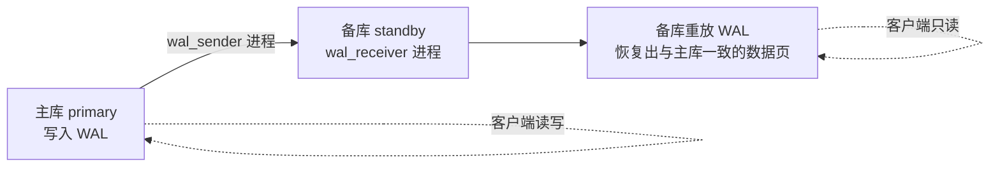

## 前置知识

- PostgreSQL 进程架构与 WAL 的角色（[系统架构](/postgresql/160-SystemArchitecture)）——流复制传输的就是 WAL；
- 知道 WAL 是"先写日志、再刷数据页"的崩溃恢复机制即可，本篇把它从"恢复工具"扩展为"复制载体"。

## 核心：复制的是 WAL，不是数据

流复制（streaming replication）的运行模型一句话讲完：**主库把 WAL 日志流式地发给备库，备库把同样的 WAL 重放一遍，从而得到与主库物理上逐块一致的数据副本**。



因为复制的是物理变更（哪个数据页哪个字节改了），备库是主库的**完整物理镜像**：所有库、所有表、所有索引一模一样。这个特性决定了它的优劣：

- 优点：零逻辑失真、搭建简单、备库可承载只读查询、是故障切换（HA）的基础；
- 代价：主备必须同大版本、无法只复制部分数据、备库不能本地写入、跨大版本升级帮不上忙（那是[逻辑复制](/postgresql/430-SubscribePublish)的领地）。

## 同步与异步：一致性换延迟的旋钮

```ini
# postgresql.conf（主库）
wal_level = replica                 # 流复制最低要求
max_wal_senders = 5                 # 可同时服务的备库数
synchronous_standby_names = 'FIRST 1 (standby1)'   # 留空即异步
```

- **异步复制（默认）**：主库提交不等备库。性能最好，但主库崩溃时最近的事务可能尚未到达备库——**丢数据窗口存在**；
- **同步复制**：`synchronous_standby_names` 指定备库后，每个提交要等备库确认收到（`remote_apply` 级别甚至等重放完成）才返回。零丢失，但备库抖动会直接拖慢主库提交。

选择原则：金融账务类核心库用同步（或至少半同步语义），一般业务用异步 + 监控延迟告警。`FIRST 1 (standby1)` 的写法支持多备库"任一确认即可"，兼顾可用性与安全。

## 动手：用 pg_basebackup 搭一套主从

`pg_basebackup` 的本质是"帮备库做一次物理初始化 + 写好连接信息"，十几分钟可跑通：

```bash
# ===== 主库（10.0.0.1）=====
# 1. 建复制专用账号
psql -c "CREATE ROLE repl WITH REPLICATION LOGIN PASSWORD 'repl_pass';"

# 2. pg_hba.conf 放行备库
#    host replication repl 10.0.0.2/32 scram-sha-256

# ===== 备库（10.0.0.2）=====
# 3. 用基础备份初始化备库数据目录（-R 自动写 standby.signal 与连接配置）
pg_basebackup -h 10.0.0.1 -U repl -D /var/lib/postgresql/17/main \
  -Fp -Xs -P -R

# 4. 启动备库（存在 standby.signal 即以备库身份运行）
pg_ctl start
```

参数记忆：`-Xs` 让 WAL 以流方式伴随备份（避免备份期间日志堆积）、`-R` 生成 `standby.signal` 文件并把 `primary_conninfo` 写进配置——**备库身份的判断标志就是数据目录里的 `standby.signal` 空文件**。

验证复制在工作：

```sql
-- 主库上查看备库连接与位置
SELECT application_name, state, sync_state,
       pg_wal_lsn_diff(pg_current_wal_lsn(), sent_lsn) AS lag_bytes
FROM pg_stat_replication;

-- 备库上确认只读与恢复状态
SELECT pg_is_in_recovery();   -- t
```

在主库建一张表、插入一行，到备库立刻能查到——复制闭环达成。

## 监控：两个必须盯的指标

1. **延迟字节数**：`pg_wal_lsn_diff(pg_current_wal_lsn(), replay_lsn)`——备库落后主库多少字节 WAL。持续增长说明重放跟不上；
2. **延迟时间**：备库执行 `SELECT now() - pg_last_xact_replay_timestamp();`——最近一次重放距现在多久，业务更容易理解的口径。

```sql
-- 主库一键体检
SELECT client_addr, state, sync_state,
       pg_wal_lsn_diff(pg_current_wal_lsn(), replay_lsn) AS replay_lag_bytes
FROM pg_stat_replication;
```

## 常见困惑与故障

**"备库查询偶尔报错 'canceling statement due to conflict with recovery'"？**——备库重放 WAL 与本地长查询冲突（比如主库删了备库查询正在读的表数据页）。解法按序：备库设 `hot_standby_feedback = on`（把查询情况反馈给主库，代价是主库膨胀风险）或调大 `max_standby_streaming_delay`。

**"主库磁盘被 WAL 撑爆了？"**——备库宕机期间，主库必须保留它未收到的 WAL。没有复制槽时受 `wal_keep_size` 限制（超了就放弃该备库），有槽时无限保留——所以[物理复制槽](/postgresql/400-PhysicalReplicationSlot)是一把双刃剑：保证不丢 WAL，但坏掉的备库忘记清理槽会撑爆主库磁盘。两者都要配监控。

**"备库能不能写？"**——不能，备库强制只读。需要"备库可写的部分数据"场景（如汇总表）属于逻辑复制的领地。

**"如何做故障切换？"**——手工流程：备库执行 `pg_ctl promote`（删 signal、停止重放、变为可写主库），应用切换连接串。生产环境应交给 Patroni/Repmgr 等工具自动仲裁，见[复制高可用](/postgresql/470-ReplicationHA)。

## 检验清单

- 能画出"主库 wal_sender → 备库 wal_receiver → 重放 WAL"的复制链路并说出物理复制的三条优劣；
- 能解释同步与异步的取舍，并知道 `synchronous_standby_names` 控制它；
- 用 pg_basebackup 完整搭过一套主从，能说出 `-R` 与 `standby.signal` 的作用；
- 知道两个延迟监控指标与"复制槽撑爆磁盘"的故障模式。

## 下一步

流复制是"整机镜像"，逻辑复制是"数据订阅"：先看[物理复制槽](/postgresql/400-PhysicalReplicationSlot)补全槽机制，再进入[逻辑解码与输出插件](/postgresql/420-LogicalDecodingOutputPlugin) 理解逻辑复制的地基。
