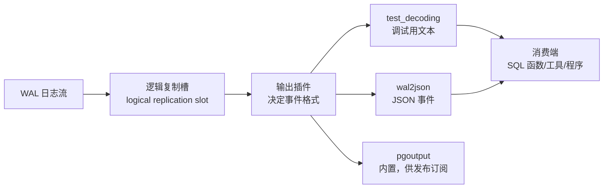

## 前置知识

- WAL 与流复制的基本模型（[流复制](/postgresql/390-StreamingReplication)）——逻辑解码消费的是同一份 WAL；
- 复制槽的"保日志"语义（[物理复制槽](/postgresql/400-PhysicalReplicationSlot)）——逻辑槽是它的孪生兄弟。

## 从"改了哪块磁盘"到"改了哪行数据"

流复制的 WAL 记录的是**物理变更**（某数据页某偏移量改了什么字节），只有同版本的 PostgreSQL 能读懂。而现实中有大量需求要的是**逻辑语义**："某表某行的某列从 A 变成了 B"：

- 缓存失效：订单变更后失效 Redis 缓存；
- 数据同步：把业务库变更推给 Elasticsearch、数据仓库、消息队列；
- 增量订阅：跨版本、跨库（甚至异构库）的数据流动；
- 审计：捕获谁在何时改了什么。

**逻辑解码（logical decoding）**就是 PostgreSQL 内置的翻译器：把 WAL 的物理记录还原成逻辑事件，再交给**输出插件**决定以什么格式吐出去。它是 [发布订阅](/postgresql/430-SubscribePublish) 与各类 CDC 工具（Debezium 等）的地基。

## 三层结构：槽、插件、消费者



三个角色各司其职：

1. **逻辑复制槽**：记住"消费到了 WAL 哪个位置"，并保证未消费的 WAL 不被回收；
2. **输出插件**：格式转换器。常用三个——`test_decoding`（内置，人类可读文本，调试与学习用）、`wal2json`（第三方，输出 JSON，方便程序消费）、`pgoutput`（内置二进制协议，专供原生发布订阅使用）；
3. **消费者**：SQL 函数轮询（简单场景）、`pg_recvlogical` 命令行工具（把事件写文件）、应用程序（pgjdbc、psycopg 的复制协议支持）。

## 动手：十分钟跑通逻辑解码

```sql
-- 0. 前提：wal_level 必须为 logical（修改后需重启）
SHOW wal_level;   -- logical

-- 1. 建槽（使用内置 test_decoding 插件）
SELECT pg_create_logical_replication_slot('demo_slot', 'test_decoding');

-- 2. 制造变更
CREATE TABLE t1 (id int primary key, note text);
INSERT INTO t1 VALUES (1, 'hello');
UPDATE t1 SET note = 'world' WHERE id = 1;
DELETE FROM t1 WHERE id = 1;

-- 3. 消费事件（ peek 不消费位；get 消费并推进槽位置）
SELECT data FROM pg_logical_slot_peek_changes('demo_slot', NULL, NULL);
-- table public.t1: INSERT: id[int4]:1 note[text]:'hello'
-- table public.t1: UPDATE: ... oldkey/newtuple ...
-- table public.t1: DELETE: id[int4]:1

SELECT count(*) FROM pg_logical_slot_get_changes('demo_slot', NULL, NULL);
-- 再 peek：空 —— 事件已消费，槽位置已推进

-- 4. 清理
SELECT pg_drop_replication_slot('demo_slot');
```

第 3 步是理解槽语义的关键实验：`peek` 反复看同一批事件（位置不动），`get` 消费后位置推进。**槽的位置一旦推进，事件就永远取不到了**——消费端必须自己保证处理成功后再确认。

## 插件选型速查

| 插件 | 来源 | 输出格式 | 适用 |
| --- | --- | --- | --- |
| `test_decoding` | 内置 | 自有文本格式 | 学习原理、问题排查 |
| `pgoutput` | 内置 | 二进制协议 | 原生发布订阅（430 篇的主角） |
| `wal2json` | 第三方扩展 | JSON | 自研同步程序、异构管道 |
| `decoderbufs` | 第三方 | Protobuf | Debezium 默认 |

安装第三方插件（以 wal2json 为例）：编译安装 `.so` 到 `lib` 目录后即可在 `pg_create_logical_replication_slot` 的第二参数直接引用，无需额外 DDL。

## 生产注意事项：三个真正的坑

1. **槽膨胀（最高频事故）**：逻辑槽的存在会阻止 PostgreSQL 回收它未消费的 WAL（与[物理复制槽](/postgresql/400-PhysicalReplicationSlot)同样的机制）。消费程序崩溃三天没人管，主库 pg_wal 目录轻松撑爆磁盘。三条防线：监控 `pg_replication_slots` 的 `restart_lsn` 滞后量与 `active` 状态；消费端离线时人工 `pg_drop_replication_slot` 或让程序幂等重放；PostgreSQL 13+ 配置 `max_slot_wal_keep_size` 给保留量封顶；

2. **不复制 DDL**：逻辑事件只包含表数据变更。`ALTER TABLE` 不产生可解码事件——下游表的 schema 演进需要独立的同步方案（这同样是[发布订阅](/postgresql/430-SubscribePublish)的边界）；

3. **大事务延迟吐出**：一个未提交的大事务产生的变更会暂存在内存/磁盘，直到 COMMIT 才整体吐出。订阅端看到的事件永远按提交顺序、以事务为粒度——这保证了一致性，也意味着长事务会放大延迟。

## 常见困惑

**"逻辑槽和物理槽什么区别？"**——机制相同（保 WAL + 记位置），语义不同：物理槽记录的是"重放到哪了"（LSN），服务于流复制；逻辑槽记录的是"解码到哪了"，且输出的是逻辑事件。一个库可以同时存在两种槽。

**"逻辑解码对性能影响大吗？"**——解码本身开销可控（有变更才解码），主要成本在"槽阻止 WAL 回收"的间接影响。给槽装好监控，比担心 CPU 更重要。

**"为什么不用触发器做变更捕获？"**——触发器在事务内同步执行，拖慢主业务写入且捕获不到 TRUNCATE/DDL 语义细节；逻辑解码在 WAL 层异步进行，对写入路径零侵入。CDC 领域 WAL 方案已是绝对主流。

## 检验清单

- 能画出"WAL → 槽 → 插件 → 消费者"三层结构并说出三种插件的使用场景；
- 完整跑通建槽、peek/get 对比、清槽的实验，理解槽位置推进语义；
- 能复述槽膨胀的成因与三条防线（监控/人工清理/max_slot_wal_keep_size）；
- 能说出逻辑解码不覆盖 DDL 与大事务延迟两条边界。

## 下一步

理解了地基之后，原生发布订阅只是薄薄一层封装：进入[订阅与发布](/postgresql/430-SubscribePublish)，几条命令搭起库到库的同步。
