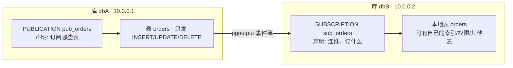

## 前置知识

- 逻辑解码三层结构（[逻辑解码与输出插件](/postgresql/420-LogicalDecodingOutputPlugin)）——发布订阅就是它的一层官方封装；
- 物理流复制的基本模型（[流复制](/postgresql/390-StreamingReplication)），作为对照系。

## 发布订阅是什么：一张图定位

如果说流复制复制的是"整个实例的磁盘镜像"，发布订阅复制的则是**被选中的表的数据变更流**：



底层就是上一篇的逻辑解码（`pgoutput` 插件），上层封装成两条 DDL：发布端建 `PUBLICATION`，订阅端建 `SUBSCRIPTION`。此后订阅端有一个 apply worker 进程持续接收并回放变更。

它解锁了物理复制做不到的事：

1. **选择性复制**：只同步几张表、甚至表的部分行（行过滤，PG 15+）；
2. **跨大版本升级**：从 PG 12 直订到 PG 17，逻辑层复制不关心物理格式；
3. **聚合写**：多个上游库的同类表汇入一个下游；
4. **订阅端可写**：本地表对本地应用开放（风险见文末）。

## 动手：三步搭起库到库同步

```sql
-- ===================== 发布端 =====================
-- 0. 前提：wal_level = logical（重启生效）

-- 1. 表必须有主键或 REPLICA IDENTITY，否则 UPDATE/DELETE 无法同步
CREATE TABLE orders (
  id bigint PRIMARY KEY,
  amount numeric(10,2),
  created_at timestamptz DEFAULT now()
);

-- 2. 建发布（可选全部表 FOR ALL TABLES 或指定表）
CREATE PUBLICATION pub_orders FOR TABLE orders;

-- 3. 建给订阅端的账号（PG 15+ 需显式授发布读权限）
CREATE ROLE repl LOGIN PASSWORD 'repl_pass' REPLICATION;
GRANT SELECT ON orders TO repl;

-- ===================== 订阅端 =====================
-- 4. 建结构相同的表（结构不会自动复制！）
CREATE TABLE orders (LIKE publish_db.orders INCLUDING ALL);
-- 简化示例；实际请从发布端 pg_dump --schema-only

-- 5. 建订阅
CREATE SUBSCRIPTION sub_orders
  CONNECTION 'host=10.0.0.1 port=5432 dbname=dbA user=repl password=repl_pass'
  PUBLICATION pub_orders
  WITH (copy_data = true);   -- 首次同步存量数据
```

`copy_data = true` 触发**首次同步**：订阅建立时对每张表做一遍快照拷贝，之后转入增量流。这个组合（先存量后增量、不重不漏）是自动保证的，原理是订阅端先拉一份快照位置，再从该位置开始消费事件。

验证闭环：

```sql
-- 发布端
INSERT INTO orders (id, amount) VALUES (1, 99.9);

-- 订阅端稍候
SELECT * FROM orders;   -- (1, 99.9) 已到达

-- 订阅端查看状态
SELECT * FROM pg_stat_subscription;
```

## 生产必读：四类故障场景

**1. 复制冲突（apply error）**——订阅端 apply 变更时撞上本地约束，是最常见故障：

```sql
-- 查看订阅端的报错（pg_stat_subscription 的 last_error 相关字段，
-- 或直接读订阅端日志："logical replication worker ... ERROR: duplicate key"）
```

典型成因：订阅端本地误写入了一条数据，上游同名主键再来一次就冲突。处理：修正冲突数据后，订阅端 `ALTER SUBSCRIPTION sub_orders REFRESH PUBLICATION;` 无法自愈时需要重建订阅（记住重建会重新走首次同步）。**纪律：订阅端的同步表应禁止本地写入**（至少用权限拦住应用层）。

**2. 表没主键**——UPDATE/DELETE 事件需要唯一标识定位行。没有主键的表只能复制 INSERT（或把 `REPLICA IDENTITY FULL` 设为整行匹配，代价是 WAL 放大与 apply 变慢）。建表纪律先行。

**3. DDL 不同步**——发布订阅只管数据。上游 `ALTER TABLE` 加列后，订阅端必须手工对齐 schema，否则 apply 报错卡住。schema 变更要和发布订阅操作纳入同一个变更流程。

**4. 大事务与订阅端积压**——上游一个千万行的大事务，apply 端要整体回放，期间延迟飙升。与逻辑解码篇同理：控制上游大事务、监控 `pg_stat_subscription` 的滞后。

## 监控清单

```sql
-- 订阅端：worker 是否存活、最近错误
SELECT subname, pid, received_lsn, last_msg_send_time,
       last_msg_receipt_time, latest_end_time
FROM pg_stat_subscription;

-- 发布端：每个订阅的连接与位置
SELECT application_name, state, sent_lsn, replay_lsn
FROM pg_stat_replication;

-- 发布端：逻辑槽膨胀检查（同逻辑解码篇）
SELECT slot_name, active, restart_lsn,
       pg_wal_lsn_diff(pg_current_wal_lsn(), restart_lsn) AS retained_bytes
FROM pg_replication_slots;
```

`pg_replication_slots` 里的订阅槽若 `active = f`（订阅端断开）且 retained_bytes 持续增长，就是磁盘告警的前兆。

## 选型：什么时候用它而不是流复制

| 维度 | 流复制 | 发布订阅（逻辑复制） |
| --- | --- | --- |
| 复制粒度 | 整实例 | 表级、行级 |
| 跨大版本 | 不支持 | 支持 |
| 订阅端可写 | 否 | 是（有风险） |
| DDL | 自动跟随 | 不同步 |
| 高可用切换 | 成熟（promote 秒级） | 弱，不建议做 HA 主方案 |
| 典型用途 | 热备、读写分离、HA | 升级迁移、选择性同步、汇聚 |

一句话决策：**做高可用和读写分离用流复制；做升级、迁移、选择性同步用发布订阅**。详细维度对比见[逻辑与物理复制对比](/postgresql/440-LogicalPhysicalReplicationCompare)。

## 检验清单

- 能说出 PUBLICATION/SUBSCRIPTION 与逻辑解码槽、pgoutput 插件的关系；
- 独立完成"建发布 → 建订阅 → copy_data → 增量验证"全流程；
- 能解释复制冲突的成因与处理纪律（订阅端禁写）；
- 记住两条硬边界：DDL 不同步、无主键表 UPDATE/DELETE 复制不了；
- 会用两张监控视图与槽膨胀检查做日常体检。

## 下一步

两种复制各自的边界已经清楚，系统性的维度对比见[逻辑与物理复制对比](/postgresql/440-LogicalPhysicalReplicationCompare)；做 HA 方案则继续[复制高可用](/postgresql/470-ReplicationHA)。
