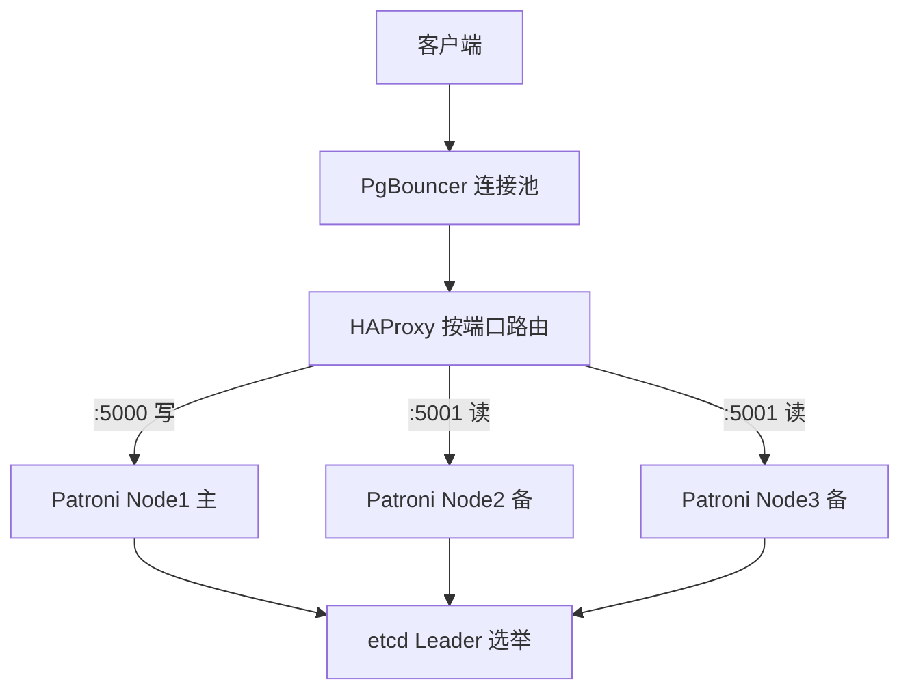

## 知识点地图

- **知识类别**：PostgreSQL 服务器管理 / 高可用架构（复制之上的运维层）。
- **解决什么问题**：[流复制](/postgresql/390-StreamingReplication)给了你一个备库，但备库不会"自己变成主库"。主库宕机时，谁来发现、谁来提升备库、客户端怎么找到新主库——这三件事就是高可用（HA）层要解决的。
- **什么时候用到**：主库单点是业务不能容忍时；要求"数据库故障后分钟级自动恢复、无需人半夜起来手工切换"时；搭建一主多备 + 自动选举的生产集群时。
- **前置阅读**：[流复制](/postgresql/390-StreamingReplication)、[物理复制槽](/postgresql/400-PhysicalReplicationSlot)。

## 心智模型：三层分工

一套生产级 PG 高可用由三层组成，各管一件事，混淆分工是大多数故障的根源：



| 层 | 组件 | 职责 | 不管什么 |
| --- | --- | --- | --- |
| 数据层 | PostgreSQL 流复制 | 主备数据一致 | 谁当主、客户端连谁 |
| 控制层 | Patroni + etcd | 健康探测、选主、提升备库、管理复制槽 | 数据怎么复制、流量去哪 |
| 接入层 | HAProxy + PgBouncer | 把写流量送到当前主库、收敛连接数 | 判断谁该当主 |

一句话记住：**etcd 存"谁当主"的共识，Patroni 执行共识，HAProxy 跟随共识转发流量**。

## 动手一：Patroni 集群搭建（三节点）

Patroni 是一个常驻在 PostgreSQL 旁边的 Python 守护进程：它周期性续约一个 etcd 上的"领导锁"，续得上就拉起主库，续不上就主动降级；备库节点的 Patroni 发现领导锁空缺，发起选举并提升自己。

每台机器一份 `patroni.yml`（以下为 node1 的核心段落，来自本文实战骨架，其余两台只改 `name`）：

```yaml
# patroni.yml
scope: fandex-cluster          # 集群名，同一集群三台必须相同
name: node1                    # 本节点名，同集群内唯一

restapi:
  listen: 0.0.0.0:8008         # Patroni 自己的 REST API 端口

etcd:
  hosts: 192.168.1.100:2379    # etcd 地址（生产至少 3 节点 etcd）

bootstrap:
  dcs:                         # 集群级配置，存进 etcd，全集群共享
    ttl: 30                    # 领导锁租约秒数——主库心跳失联多久后允许重选
    loop_wait: 10              # 每轮健康检查间隔
    maximum_lag_on_failover: 1048576   # 候选备库最大落后字节数（1MB）
    postgresql:
      use_pg_rewind: true      # 旧主重新加入时自动 pg_rewind 纠偏
      use_slots: true          # Patroni 自动管理物理复制槽
      parameters:
        wal_level: replica
        hot_standby: 'on'
        max_wal_senders: 10
        max_replication_slots: 10
        wal_log_hints: 'on'    # pg_rewind 的前置要求

postgresql:
  listen: 0.0.0.0:5432
  data_dir: /var/lib/postgresql/17/main
  authentication:
    superuser:
      username: postgres
      password: SuperPass123
    replication:
      username: replicator
      password: RepPass123
```

逐段解释两个最容易看不懂的参数：

- `ttl: 30` 是故障转移速度与脑裂风险的交换器。调小，主库一次网络抖动就可能触发重选（误切换）；调大，真宕机后要干等更久。30 秒是社区常用起点，etcd 与三台 PG 之间的网络质量决定你能调多小。
- `use_pg_rewind: true` 决定旧主库重新入队的姿势。没有它，故障转移后旧主的多余 WAL 会让它"回不去"（只能整库重灌）；有了它，Patroni 用 `pg_rewind` 把旧主的时间线回拨到与新主对齐——这就是 `wal_log_hints: 'on'` 必须同时打开的原因：rewind 需要页内提示来判断哪些块被改过。

启动与日常操作：

```bash
# 每台机器启动 Patroni（它会代替你管理本机 postgres 进程——不要再用 pg_ctl 手工启停）
patroni /etc/patroni/patroni.yml

# 查看集群拓扑与角色
patronictl -c /etc/patroni/patroni.yml list
# + Cluster: fandex-cluster ----+---------+---------+----+-----------+
# | Member | Host          | Role    | State   | TL | Lag in MB |
# | node1  | 192.168.1.10  | Leader  | running |  2 |           |
# | node2  | 192.168.1.11  | Replica | running |  2 |         0 |
# | node3  | 192.168.1.12  | Replica | running |  2 |         0 |

# 计划内维护：手工切换（先切后停旧主，业务无感）
patronictl -c /etc/patroni/patroni.yml switchover

# 灾难后强制换主（主库还在但不健康时用，有丢事务窗口）
patronictl -c /etc/patroni/patroni.yml failover
```

**switchover 与 failover 的区别必须刻进肌肉记忆**：switchover 是计划内的优雅换手（旧主先降级再选新主，零数据丢失）；failover 是主库已坏时的强制提升（最近未送达备库的事务会丢）。生产上"重启主库前先 switchover"是纪律，不是建议。

## 动手二：HAProxy 健康检查路由写与读

客户端不能"记住"谁是主——主会换。生产惯用 HAProxy 按端口分流：5000 端口永远指向当前主库，5001 指向任意健康备库。判据不是 HAProxy 自己探数据库，而是问 Patroni 的 REST API：

```text
# /etc/haproxy/haproxy.cfg 核心段
listen pg-write
    bind *:5000
    option httpchk GET /primary        # 问 Patroni：这台现在是主吗
    http-check expect status 200
    default-server inter 3s fall 2 rise 1
    server node1 192.168.1.10:5432 check port 8008
    server node2 192.168.1.11:5432 check port 8008
    server node3 192.168.1.12:5432 check port 8008

listen pg-read
    bind *:5001
    balance roundrobin
    option httpchk GET /replica        # 只路由到备库
    http-check expect status 200
    server node2 192.168.1.11:5432 check port 8008
    server node3 192.168.1.12:5432 check port 8008
```

工作方式：每个 PG 节点的 8008 端口由 Patroni 提供健康语义——`/primary` 只有在"本机持有领导锁且库可写"时返回 200。于是故障转移完成的瞬间，HAProxy 的下一轮检查自动把 5000 端口的流量切到新主，**客户端只连一个固定地址，完全不知道发生过切换**。

换成别的写法会发生什么：直接 `option tcp-check` 探 5432 端口是不够的——备库的 5432 同样通着，这样会把写流量送到只读备库，应用报 `cannot execute INSERT in a read-only transaction`。健康检查必须带"角色语义"，端口探测做不到。

## 动手三：PgBouncer 放进链路的位置与坑

连接池（[连接管理与 PgBouncer](/postgresql/165-ConnectionPoolingPgBouncer) 专篇详解）放进 HA 架构时有一个位置问题：**PgBouncer 放在 HAProxy 之前还是之后？**

```text
推荐：客户端 -> PgBouncer -> HAProxy -> Patroni/PG
     （应用只配一个 PgBouncer 地址；PgBouncer 用一个 URL 连 HAProxy 的 5000 端口）
```

原因：故障转移发生时， PgBouncer 到旧主的**存量连接会集体断开**。池在 HAProxy 之后时，断掉的连接由池补建、自动落到新主，客户端最多看到几毫秒抖动；池在 HAProxy 之前（即每台 PG 各挂一个本地池）时，客户端要自己处理重连与找新主，池的存在意义就没了。

事务级池化模式（`pool_mode = transaction`）在 HA 场景还有两个专属坑，详见连接池专篇；本篇只记结论：用 Patroni 的 `use_slots: true` 管理复制槽，别手工建槽——Patroni 换主时会同步搬运槽定义，手工槽会被遗漏。

## 实战场景演练

**场景 A：机房演练"拔掉主库电源"**。预期时间线：约 `ttl`（30s）内 etcd 租约过期 → 存活 Patroni 竞选 → 最不落后的备库提升（`maximum_lag_on_failover` 卡住掉队者）→ HAProxy 数秒内探到新主。演练后检查三件事：`patronictl list` 的 Timeline 是否 +1；旧主重新加电后是否被 Patroni 自动 rewind 并以备库身份入队；应用日志里有没有"连接失败重试"风暴（有则在客户端加重连退避）。

**场景 B：电商大促前把一个备库下线扩容**。正确顺序：`patronictl remove` 摘节点（或 `reinit`）→ 检查 `synchronous_standby_names` 是否引用该节点（引用了会卡写）→ 再动机器。顺序错了——先关机后摘节点——同步提交会在 `ttl` 之内 hang 住所有写入。

**场景 C：主库磁盘满，写入卡死但进程活着**。这是最容易误判成"需要 failover"的场景：Patroni 的健康检查只探"进程与端口"，探不出"磁盘满"。正确动作是先扩磁盘或清理 WAL 归档目录；强行 failover 只会把问题复制到新主。这也是"监控磁盘水位要早于监控数据库"的原因。

## 常见困惑

**"还需要 keepalived + VIP 吗？"**——不推荐。VIP 方案的脑裂窗口在"两个节点都认为自己持有 VIP"，而 Patroni + etcd 的共识由多数派仲裁（3 节点 etcd 坏 1 个仍能选举），语义更强。遗留架构里见到的 keepalived 通常是在替换过程中。

**"etcd 全挂了会怎样？"**——现有主库继续服务（它抓着最后一把锁，Patroni 不会因为联系不上 etcd 就主动停库），但任何故障转移都无法发生。所以 etcd 三节点要跨机架/跨可用区部署，etcd 挂掉属于"失去自愈能力"而非"失去数据库"。

**"备库延迟很高时主库挂了，会丢多少数据？"**——异步模式下丢的就是 `maximum_lag_on_failover` 允许提升的那部分差距。把 tolerance 调小（比如 1MB）可以少丢，但代价是候选备库经常不达标、转移失败率上升。要"零丢失的自动转移"，把至少一个备库配进 `synchronous_standby_names`。

## 复制监控速查

| 想知道什么 | 哪里看 |
| --- | --- |
| 集群角色与时间线 | `patronictl list`（TL 列） |
| 主库视角的每个备库位置 | `pg_stat_replication`（sent/write/flush/replay 四个 LSN） |
| 备库视角的接收状态 | `pg_stat_wal_receiver` |
| 复制延迟（时间口径） | 备库 `now() - pg_last_xact_replay_timestamp()` |
| 复制槽积压 | `pg_replication_slots` 的 `restart_lsn` 与 `active` |
| 是否处于恢复模式 | `pg_is_in_recovery()` |

## 动手实践：把故障转移跑一遍

任务：在本机用 Docker 起 1 个 etcd + 3 个 Patroni 容器（官方镜像 `patroni` 自带compose 示例），完成以下动作——

1. `patronictl list` 确认 1 主 2 备；
2. 建表写入 100 行，记下最大 id；
3. `docker stop` 主库容器，秒表计时，记录"到能继续写入"用了多久；
4. 在新主上确认数据无丢失，旧主容器 `docker start` 后观察它以什么角色回来；
5. （进阶）把 `ttl` 改成 10 再演练一次，记录触发误切换的条件。

<details>
<summary>参考检查命令（先自己跑再展开）</summary>

```bash
# 步骤 1
patronictl -c /etc/patroni/patroni.yml list

# 步骤 2
psql -h 127.0.0.1 -p 5000 -c "
  CREATE TABLE ha_demo(id int generated always as identity, note text);
  INSERT INTO ha_demo(note) SELECT md5(g::text) FROM generate_series(1,100) g;"

# 步骤 3：停主库（谁是 Leader 看 patronictl list）
docker stop <leader容器名>
# 观察循环：patronictl list 每 5 秒一次，直到新 Leader 出现并 State=running
# 可写验证（应成功）：
psql -h 127.0.0.1 -p 5000 -c "INSERT INTO ha_demo(note) VALUES ('after-failover');"

# 步骤 4：数据核对
psql -h 127.0.0.1 -p 5000 -tc "SELECT count(*), max(id) FROM ha_demo;"
# 旧主回来后再次 patronictl list：它应显示 Replica（pg_rewind 生效）
```

判读要点：总耗时 ≈ `ttl + loop_wait + 提升与重放时间`；旧主回不来（显示 failed/start）多半是 `wal_log_hints` 没开或 rewind 失败，查 Patroni 日志里的 `pg_rewind` 段。
</details>

## 检验清单

- 能说出数据层/控制层/接入层三层的组件与分工边界；
- 能解释 `ttl`、`maximum_lag_on_failover`、`use_pg_rewind` 三个参数各自控制什么风险；
- 能区分 switchover 与 failover 的适用时机与数据丢失语义；
- 知道为什么 HAProxy 的健康检查必须问 Patroni 的 REST API 而不是探端口；
- 知道 PgBouncer 在链路里的推荐位置及理由。

## 下一步

- [连接管理与 PgBouncer](/postgresql/165-ConnectionPoolingPgBouncer)：接入层池化的三种模式与事务级池化的坑；
- [增量备份](/postgresql/450-IncrementalBackup)与[逻辑备份与 PITR](/postgresql/455-LogicalBackupPITR)：高可用防不住误删数据，备份是最后一道防线；
- [逻辑复制](/postgresql/430-SubscribePublish)：版本升级与部分同步的另一种"可用性"形态。

## 参考与致谢

- Patroni 官方文档（MIT License）：<https://patroni.readthedocs.io/>
- PostgreSQL 官方文档 Chapter 26 High Availability, Load Balancing, and Replication（PostgreSQL Licence）：<https://www.postgresql.org/docs/current/high-availability.html>
- 本篇 Patroni 配置骨架源自 470 旧篇搬移，已按 Patroni 官方文档参数语义校订。
