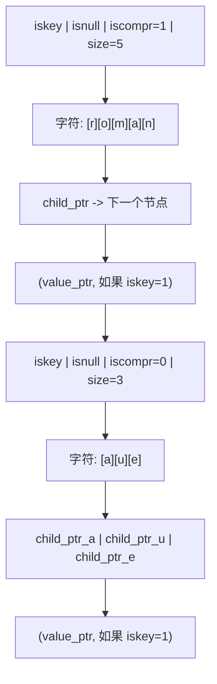
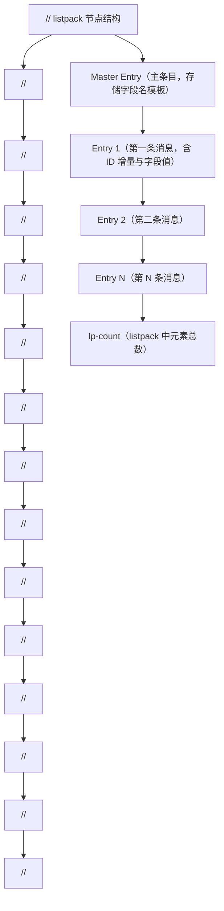
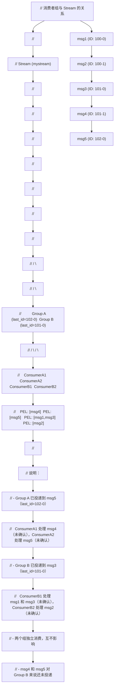
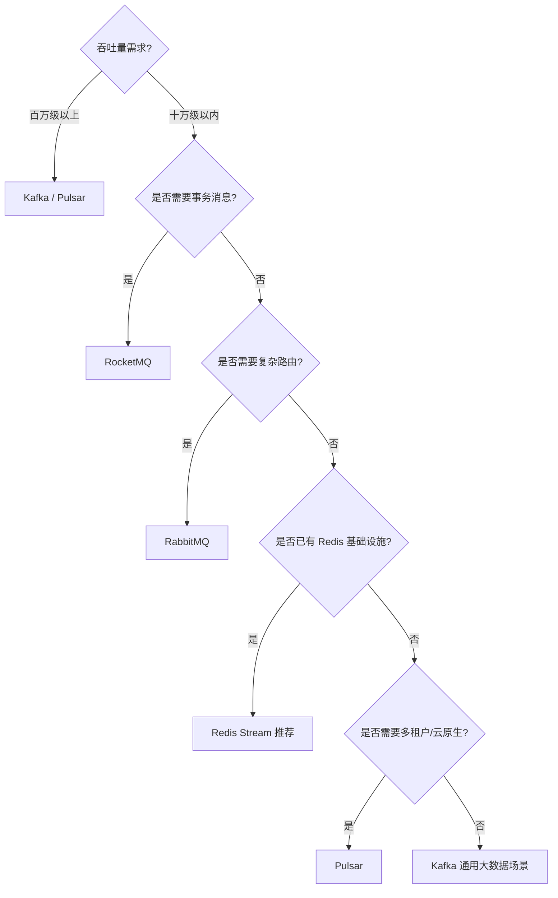

## 第 1 章 概述与学习目标

### 1.1 Stream 是什么

Redis Stream 是 Redis 5.0 版本引入的一种日志型数据结构（Log Data Structure），它在 Redis 内部以追加写入（Append-Only）的方式组织数据，每条消息拥有全局唯一且单调递增的 Entry ID。从抽象层面看，Stream 是一个带索引的、持久化的、有序的消息日志，它同时融合了传统消息队列的核心语义（如消费者组、消息确认、消息重投）与 Redis 原生的高性能内存访问能力。

Stream 的出现使得 Redis 从一个纯粹的内存键值存储系统，演化为一个能够承载轻量级至中量级消息流处理任务的复合型数据平台。与早期的 Pub/Sub 机制相比，Stream 提供了消息持久化、消息回溯、消费者组协作消费等关键能力；与基于 List 实现的 LPUSH/BRPOP 队列相比，Stream 提供了消息确认、消息重分配、范围查询等更完善的可靠性语义。

从数据模型角度，Stream 的每条消息由以下要素组成：

- 一个全局唯一的 Entry ID，格式为 `<毫秒时间戳>-<序号>`，例如 `1718334600000-0`
- 一个或多个字段-值对（field-value pairs），用于承载消息体内容
- 内部维护的元数据，包括消息在 Radix Tree 中的位置、所属的 listpack 节点等

Stream 的核心定位是"持久化的、有序的、支持多消费者协作的消息日志"。它借鉴了 Apache Kafka 的日志抽象理念，同时保留了 Redis 内存数据库的低延迟特性，在轻量级消息队列场景中具有独特优势。

### 1.2 应用场景

Redis Stream 适用于以下典型场景：

1. **任务队列（Task Queue）**：异步任务分发，如订单处理、邮件发送、图片转码等。消费者组允许多个 worker 协作消费，提升并行处理能力。

2. **事件通知（Event Notification）**：系统状态变更通知，如用户上线通知、配置变更广播。多个消费者组可独立消费同一份消息流，实现广播语义。

3. **事件溯源（Event Sourcing）**：将领域事件按发生顺序持久化到 Stream 中，重建系统状态时按 ID 顺序回放。Stream 的不可变日志特性天然契合事件溯源模型。

4. **CQRS 架构（Command Query Responsibility Segregation）**：命令端将变更事件写入 Stream，查询端订阅 Stream 并更新读模型，实现读写分离。

5. **日志聚合（Log Aggregation）**：轻量级日志收集场景，多个服务节点将日志写入 Stream，集中处理或转发。

6. **实时流处理（Real-time Stream Processing）**：与 Flink、Spark Streaming 等流处理引擎配合，作为数据源或中间缓冲层。

7. **IM 消息系统（Instant Messaging）**：聊天消息的有序投递与离线消息补偿，Stream 的消费者组机制可精确追踪每个用户的消费进度。

8. **IoT 设备数据采集**：物联网设备周期性上报数据，Stream 提供有序存储与按时间范围查询能力。

### 1.3 学习目标

完成本教材学习后，读者应能够：

- 深入理解 Stream 的底层数据结构（Radix Tree + listpack）及其内存布局
- 熟练掌握 Stream 全部核心命令的语法、参数、返回值与内部执行流程
- 理解消费者组（Consumer Group）的工作机制，包括 PEL（Pending Entry List）、消息确认、消息重分配
- 能够设计基于 Stream 的可靠消息处理架构，包括 at-least-once 语义保障、宕机恢复策略
- 掌握消息积压的成因分析与修剪策略（MAXLEN / MINID）
- 理解 Redis Cluster 环境下 Stream 的槽位分配与跨槽限制
- 能够基于基准测试数据进行容量规划与性能调优
- 识别并规避常见陷阱与反模式
- 具备 Stream 故障排查能力，能够定位消息丢失、积压、消费者宕机等问题
- 在 Kafka、RabbitMQ、Pulsar、Redis Stream 之间做出合理的技术选型

### 1.4 本文文档结构

本教材共分十七章，按照"概念引入 -> 底层原理 -> 命令详解 -> 机制剖析 -> 工程实践 -> 对比选型 -> 实战演练"的脉络组织内容。建议初学者按顺序学习，有经验的读者可直接跳转至感兴趣的章节。

---

## 第 2 章 历史背景与设计哲学

### 2.1 Redis 消息队列演进历程

Redis 作为消息队列的载体经历了三个主要演进阶段，每个阶段都针对前一阶段的局限性进行了针对性改进。

#### 2.1.1 第一阶段：Pub/Sub（发布订阅）

Redis 早期提供的 Pub/Sub 机制是最原始的消息广播方案。生产者通过 `PUBLISH` 命令向频道发送消息，订阅者通过 `SUBSCRIBE` 命令订阅频道接收消息。

Pub/Sub 的核心特征与局限：

- **发后即忘（Fire and Forget）**：消息发出后立即丢弃，不进行任何持久化存储
- **无离线消息**：订阅者必须在线才能接收消息，断连期间的消息永久丢失
- **无消息确认机制**：无法知道消费者是否成功处理了消息
- **无消费者组**：每个订阅者收到全量消息，无法实现负载均衡
- **无回溯能力**：无法重新消费历史消息

Pub/Sub 适用于实时广播场景（如实时通知、聊天室），但在需要可靠性保障的任务队列场景中存在根本性缺陷。

```
// Pub/Sub 模型的数据流
// 生产者 -> Redis 频道 -> [订阅者A, 订阅者B, ...]
// 消息不持久化，订阅者断连即丢失

时序图：
  Producer        Redis          SubscriberA    SubscriberB
     |              |                |              |
     |--PUBLISH---->|                |              |
     |              |--msg---------->|              |
     |              |--msg------------------------->|
     |              |   (消息发出后即丢弃)            |
     |              |                |   (断连)      |
     |              |                X              |
     |--PUBLISH---->|                |              |
     |              |--msg------------------------->|
     |              |   (SubscriberA 错过此消息)     |
```

#### 2.1.2 第二阶段：阻塞列表（Blocking List）

为解决 Pub/Sub 的持久化问题，社区早期采用 List 数据结构实现消息队列：生产者使用 `LPUSH` 将消息推入列表头部，消费者使用 `BRPOP` 阻塞式地从列表尾部弹出消息。

阻塞列表方案的优势：

- **消息持久化**：消息存储在 List 中，消费者断连后消息不丢失
- **负载均衡**：多个消费者竞争消费，每条消息只被一个消费者处理
- **阻塞读取**：BRPOP 支持阻塞等待，减少轮询开销

阻塞列表方案的局限：

- **无消息确认机制**：消费者使用 BRPOP 取出消息后，消息立即从列表删除。若消费者处理失败，消息永久丢失
- **无消费者组**：无法实现"一个消息被多个消费者组各自独立消费"的广播语义
- **无消息回溯**：消息弹出后不可重新消费
- **无消息 ID**：无法按 ID 定位特定消息
- **无范围查询**：无法按时间范围或 ID 范围查询历史消息

```
// 阻塞列表模型的数据流
// 生产者 LPUSH -> List -> 消费者 BRPOP
// 消息弹出即删除，无确认机制

时序图：
  Producer        Redis(List)      ConsumerA      ConsumerB
     |              |                |              |
     |--LPUSH------>|                |              |
     |              | [msg1]         |              |
     |--LPUSH------>|                |              |
     |              | [msg2,msg1]    |              |
     |              |                |              |
     |              |<--BRPOP--------|              |
     |              | [msg2]         |              |
     |              |--msg1--------->|              |
     |              |                | (处理失败)   |
     |              |                | (msg1 丢失!) |
     |              |<--BRPOP-----------------------|
     |              | []             |              |
     |              |--msg2------------------------->|
```

#### 2.1.3 第三阶段：Stream（流）

Redis 5.0 引入 Stream 数据类型，标志着 Redis 在消息队列能力上的成熟。Stream 吸收了 Kafka 的日志模型理念，同时保留了 Redis 内存数据库的低延迟特性，提供了完整的消息队列语义。

Stream 相对于前两阶段的核心改进：

| 能力维度 | Pub/Sub | 阻塞列表 | Stream |
|---------|---------|---------|--------|
| 消息持久化 | 否 | 是 | 是 |
| 消息确认 | 否 | 否 | 是（XACK） |
| 消费者组 | 否 | 否（仅竞争消费） | 是 |
| 消息回溯 | 否 | 否 | 是（XRANGE/XREAD） |
| 消息重投 | 否 | 否 | 是（XCLAIM/XAUTOCLAIM） |
| 消息 ID | 否 | 否 | 是（自动/手动） |
| 范围查询 | 否 | 否 | 是 |
| 积压监控 | 否 | 仅 LLEN | 是（XINFO/XPENDING） |
| 修剪策略 | 不适用 | LTRIM | MAXLEN/MINID |

### 2.2 Stream 的设计目标

Redis Stream 的设计遵循以下核心目标：

1. **持久化优先**：所有写入的消息默认持久化到内存，并可通过 RDB/AOF 机制持久化到磁盘。消息不会因服务重启而丢失（在配置了持久化的前提下）。

2. **顺序保证**：Stream 中的消息按 Entry ID 单调递增排列，读取时严格按 ID 顺序返回。同一消费者组内的消息按投递顺序处理。

3. **内存效率**：底层采用 Radix Tree + listpack 组合存储，利用消息 ID 的公共前缀压缩与字段名复用机制，在保证有序性的同时最大化内存利用率。

4. **消费者组语义**：支持多个消费者组独立消费同一份消息流，每个组维护独立的消费进度（last_delivered_id）与待确认列表（PEL）。

5. **至少一次投递（At-Least-Once）**：通过 PEL 机制保障消息至少被处理一次。消费者宕机后，其未确认的消息可被其他消费者重新认领并处理。

6. **轻量级运维**：作为 Redis 原生数据类型，无需额外部署独立的消息中间件，降低运维复杂度。

### 2.3 与其他消息队列的定位差异

Stream 的定位介于"轻量级内存队列"与"重量级分布式消息中间件"之间，其核心定位差异如下：

- **与 Kafka 的差异**：Kafka 定位于超高吞吐量（百万级 msg/s）的大数据流处理场景，依赖磁盘存储与分区副本机制；Stream 定位于低延迟（微秒级）的轻量级消息队列，依赖内存存储，吞吐量在十万级 msg/s 量级。Kafka 适合日志聚合、流处理管道；Stream 适合任务队列、事件通知、小型系统的异步解耦。

- **与 RabbitMQ 的差异**：RabbitMQ 定位于灵活路由与多协议支持（AMQP/MQTT/STOMP），提供丰富的交换器类型与死信队列；Stream 不支持复杂路由，但提供更低的延迟与更简单的部署。RabbitMQ 适合需要复杂路由规则的企业应用集成；Stream 适合对延迟敏感且路由需求简单的场景。

- **与 RocketMQ 的差异**：RocketMQ 定位于金融级可靠消息，原生支持事务消息、定时消息、顺序消息；Stream 不支持事务消息与定时消息，但部署更轻量。RocketMQ 适合对可靠性要求极高的金融场景；Stream 适合对可靠性有基本要求但更看重轻量化的场景。

- **与 Pulsar 的差异**：Pulsar 采用计算与存储分离架构（BookKeeper），支持多租户与跨地域复制；Stream 是 Redis 的内嵌数据类型，架构简单。Pulsar 适合大规模多租户云原生场景；Stream 适合中小规模单体或微服务场景。

### 2.4 设计哲学总结

Stream 的设计哲学可概括为"简单即高效，够用即最佳"。它不追求 Kafka 级别的极致吞吐量，也不追求 RabbitMQ 级别的路由灵活性，而是在 Redis 内存数据库的框架内，提供了一个足够完善、足够轻量、足够快速的消息队列实现。对于已有 Redis 基础设施且消息量级在十万级以内的场景，Stream 往往是最优选择；对于百万级以上吞吐量或需要复杂路由的场景，仍应选择专业的消息中间件。

---

## 第 3 章 底层数据结构深度剖析

### 3.1 Radix Tree（基数树）原理

Radix Tree 是 Stream 底层存储的核心数据结构，它是前缀树（Trie Tree）的优化变体，也被称为 Patricia Trie（Practical Algorithm To Retrieve Information Coded In Alphanumeric）或压缩前缀树。

#### 3.1.1 前缀树的不足

前缀树将每个 key 拆分成单字符，每个节点保存一个字符。从根节点到某节点的路径拼接即为该节点对应的 key。前缀树通过共享公共前缀来节省内存，但存在一个显著缺陷：当 key 中某段字符串不再被共享时，仍按单字符节点存储，导致节点数量膨胀与查询效率下降。

```
// 前缀树示例：存储 "romane", "romanus", "romulus", "rubens", "ruber", "rubicon", "rubicundus"
// 每个节点保存一个字符，公共前缀 r-o 被共享，但后续字符仍逐个存储

         (root)
           |
           (r)
           |
           (o)
           |
           (m)
          / \
        (a) (u)
        /     \
      (n)     (l)
      /         \
    (u)         (u)
    /             \
  (s)             (s)

  [romanus]      [romulus]

  另一支：
  (r)-(u)-(b)-(e)-(n)-(s)  [rubens]
                  |
                 (r)       [ruber]
                  |
                 (i)
                  |
                 (c)
                  |
                 (o)       [rubicon]
                  |
                 (n)

  节点数量多，查询需逐字符匹配，效率低
```

#### 3.1.2 Radix Tree 的改进

Radix Tree 对前缀树进行压缩优化：当一系列单字符节点之间的分支连接是唯一的（即路径上没有分叉）时，将这些单字符合并为一个多字符节点。这样既保留了前缀共享的内存优势，又减少了节点数量与查询路径长度。

```
// Radix Tree 示例：存储同样的 7 个 key
// 公共前缀被合并为单个节点，无分叉的路径被压缩

           (root)
             |
           (r)
             |
           (om)
           / \
        (an) (ulus)
        /       \
     (us)      [romulus]
      |
   [romanus]
   [romane]  (romane 与 romanus 共享 roman，末尾分叉 e/us)

   另一支：
   (r)-(ub)-(en)        [rubens]
            |
           (er)         [ruber]
            |
           (ic)
           / \
        (on) (undus)
         |      |
      [rubicon] [rubicundus]

  节点数量大幅减少，查询时按字符串段匹配，效率高
```

Radix Tree 的关键特性：

- **前缀压缩**：共享公共前缀的 key 只存储一份前缀，节省内存
- **路径压缩**：无分叉的路径合并为单节点，减少节点数量
- **有序遍历**：按字典序遍历，天然支持范围查询
- **查找效率**：平均 O(k)，其中 k 为 key 长度，与树中节点总数无关

#### 3.1.3 Redis 中的 Radix Tree 实现

Redis 在 `src/rax.c` 和 `src/rax.h` 中实现了自己的 Radix Tree。核心数据结构定义如下：

```c
// Radix Tree 根节点结构
typedef struct rax {
    raxNode *head;       // 指向头节点的指针
    uint64_t numele;     // 树中存储的元素总数
    uint64_t numnodes;   // 树中节点总数
} rax;

// Radix Tree 节点结构
typedef struct raxNode {
    uint32_t iskey:1;      // 该节点是否存储了一个 key（1=是，0=否）
    uint32_t isnull:1;     // 该节点存储的 value 是否为 NULL
    uint32_t iscompr:1;    // 是否为压缩节点（1=压缩节点，0=分叉节点）
    uint32_t size:29;      // 节点中存储的字符数（压缩节点）或子节点数（分叉节点）
    // 节点数据布局：
    // 1. 字符数组（size 个字符）
    // 2. 子节点指针数组（分叉节点）或单个子节点指针（压缩节点）
    // 3. value 指针（如果 iskey=1）
    unsigned char data[];  // 柔性数组，存储实际数据
} raxNode;
```

Radix Tree 节点分为两类：

- **压缩节点（iscompr=1）**：表示一段无分叉的路径，存储多个字符，只有一个子节点。用于路径压缩。
- **分叉节点（iscompr=0）**：表示有多个子节点的分支点，每个字符对应一个子节点。用于前缀共享后的分叉。



### 3.2 Stream 的内部表示

Stream 在 Redis 内部由 `stream` 结构体表示，定义在 `src/stream.h` 中。以下是核心结构（基于 Redis 8.x 源码）：

```c
// Stream ID 结构：128 位，由两个 64 位整数组成
typedef struct streamID {
    uint64_t ms;   // 毫秒时间戳（Unix 时间）
    uint64_t seq;  // 序号（同一毫秒内的递增序号）
} streamID;

// Stream 主结构
typedef struct stream {
    rax *rax;           // 基数树，存储所有消息条目，key 为 Entry ID，value 为 listpack 节点
    uint64_t length;    // 当前 Stream 中的消息总数
    streamID last_id;   // 最后一条消息的 ID（用于自动生成新 ID）
    streamID first_id;  // 第一条非墓碑消息的 ID（用于快速定位头部）
    streamID max_deleted_entry_id;  // 已删除消息中的最大 ID（用于 ID 生成时的边界判断）
    uint64_t entries_added;         // 历史累计添加的消息总数（不因 XDEL/XTRIM 减少）
    size_t alloc_size;              // 此 Stream 分配的总内存（字节）
    rax *cgroups;                   // 消费者组字典：name -> streamCG
    rax *cgroups_ref;               // 索引：消息 ID -> 引用该消息的消费者组（用于 KEEPREF 语义）
    streamID min_cgroup_last_id;    // 所有消费者组中最小的 last_id（用于优化修剪决策）
    unsigned int min_cgroup_last_id_valid:1;  // min_cgroup_last_id 是否有效
    uint64_t idmp_duration;         // IDMP（幂等消息处理）持续时间（秒）
    uint64_t idmp_max_entries;      // IDMP 跟踪的最大 IID 数量
    rax *idmp_producers;            // IDMP 生产者基数树：pid -> idmpProducer
    uint64_t iids_added;            // 历史累计添加的带 IID 的消息数
    uint64_t iids_duplicates;       // 历史累计检测到的重复 IID 数
} stream;
```

#### 3.2.1 Entry ID 机制

Entry ID 是 Stream 中每条消息的全局唯一标识，由两部分组成：

- **毫秒时间戳（ms）**：消息插入时的 Unix 时间戳（毫秒精度）
- **序号（seq）**：同一毫秒内的递增序号

Entry ID 格式为 `<ms>-<seq>`，例如 `1718334600000-0`、`1718334600000-1`、`1718334600001-0`。

Entry ID 的生成规则：

1. 当使用 `XADD key *` 让 Redis 自动生成 ID 时，Redis 取当前服务器时间（毫秒）作为 ms 部分
2. 如果当前时间大于 `last_id.ms`，则 seq 重置为 0
3. 如果当前时间等于 `last_id.ms`，则 seq = `last_id.seq + 1`
4. 如果当前时间小于 `last_id.ms`（时钟回拨），则 ms 取 `last_id.ms`，seq = `last_id.seq + 1`，保证单调递增
5. 如果时钟回拨且 seq 溢出（达到 uint64_t 上限），则 ms 加 1，seq 重置为 0

Entry ID 的比较规则：先比较 ms，ms 相同则比较 seq。这保证了 Entry ID 的全序关系。

```
// Entry ID 生成流程
//
// 输入：当前服务器时间 current_ms，上一条消息 ID last_id
//
// 伪代码：
// function generateEntryID(current_ms, last_id):
//     if current_ms > last_id.ms:
//         return {ms: current_ms, seq: 0}
//     elif current_ms == last_id.ms:
//         if last_id.seq < UINT64_MAX:
//             return {ms: current_ms, seq: last_id.seq + 1}
//         else:
//             return {ms: current_ms + 1, seq: 0}
//     else:  // 时钟回拨
//         if last_id.seq < UINT64_MAX:
//             return {ms: last_id.ms, seq: last_id.seq + 1}
//         else:
//             return {ms: last_id.ms + 1, seq: 0}
```

#### 3.2.2 Radix Tree 中的 key 编码

Stream 的消息存储在 Radix Tree 中，key 为 Entry ID 的二进制编码。Entry ID 被编码为 16 字节（128 位）的字符串：

- 前 8 字节：ms 的大端编码
- 后 8 字节：seq 的大端编码

由于同一时间段内的消息 ID 具有相同的时间戳前缀，这些 key 在 Radix Tree 中会共享前缀节点，实现内存压缩。例如，同一毫秒内的多条消息，其 key 的前 8 字节完全相同，Radix Tree 只需存储一份。

```
// Radix Tree key 编码示例
//
// Entry ID: 1718334600000-0
// ms = 1718334600000 = 0x18FE7C4B6C0
// seq = 0
//
// 16 字节 key（大端编码）：
// [00 00 01 8F E7 C4 B6 C0] [00 00 00 00 00 00 00 00]
// |----- ms (8 bytes) -----| |----- seq (8 bytes) ----|
//
// Entry ID: 1718334600000-1
// key: [00 00 01 8F E7 C4 B6 C0] [00 00 00 00 00 00 00 01]
// 前缀 [00 00 01 8F E7 C4 B6 C0] 与上一条相同，Radix Tree 共享
```

### 3.3 listpack 节点结构

Radix Tree 的叶子节点（key 节点）存储的 value 是一个 listpack，其中包含多条消息。listpack 是 Redis 的一种紧凑型列表编码格式，用于在连续内存中存储多个元素。

#### 3.3.1 为什么使用 listpack

Stream 不直接在 Radix Tree 的每个叶子节点存储单条消息，而是将多条消息打包存储在一个 listpack 中。这样设计的原因：

1. **减少 Radix Tree 节点数量**：如果每条消息单独占一个 Radix Tree 节点，节点数量等于消息总数，内存开销大且查询效率低。将多条消息打包存储，可将节点数量减少为消息总数的 1/N（N 为每个 listpack 中的消息数）。

2. **利用局部性原理**：相邻的消息往往具有相似的 ID 前缀与字段结构，打包存储可进一步压缩。

3. **减少指针开销**：Radix Tree 节点间通过指针连接，每条消息单独存储会产生大量指针开销。打包存储将多条消息放入连续内存，指针开销大幅降低。

#### 3.3.2 listpack 的内容结构

每个 listpack 节点存储一组相邻的消息，其结构如下：



#### 3.3.3 Master Entry（主条目）

每个 listpack 节点的开头是一个 Master Entry，它存储该节点内所有消息共用的字段名（field names）。其格式为：

```
// Master Entry 格式
// [count][deleted][num-fields][field_1][field_2]...[field_N][0]
//
// count:        该 listpack 节点中存储的消息总数
// deleted:      已删除消息数（XDEL 后不立即物理删除，标记为 deleted）
// num-fields:   字段数量
// field_1..N:   字段名列表
// 0:            结束标记
```

Master Entry 的字段名列表是该节点内所有消息的字段名并集。如果后续消息的字段名与 Master Entry 完全一致，则该消息使用 `STREAM_ITEM_FLAG_SAMEFIELDS` 标志，只存储字段值，不重复存储字段名，从而节省内存。

#### 3.3.4 消息条目格式

listpack 中的每条消息条目有两种格式，取决于是否设置了 `SAMEFIELDS` 标志：

**格式一：SAMEFIELDS 标志置位（字段名与 Master Entry 相同）**

```
// [flags][ms-delta][seq-delta][value_1][value_2]...[value_N][lp-count]
//
// flags:     标志位（1 字节），STREAM_ITEM_FLAG_SAMEFIELDS = 2
// ms-delta:  与 Master Entry 的 ms 差值（变长整数）
// seq-delta: 与 Master Entry 的 seq 差值（变长整数）
// value_1..N: 字段值列表（字段名复用 Master Entry）
// lp-count:  listpack 元素计数
```

**格式二：SAMEFIELDS 标志未置位（字段名与 Master Entry 不同）**

```
// [flags][ms-delta][seq-delta][num-fields][field_1][value_1]...[field_N][value_N][lp-count]
//
// flags:      标志位，SAMEFLAGS 未置位
// ms-delta:   与 Master Entry 的 ms 差值
// seq-delta:  与 Master Entry 的 seq 差值
// num-fields: 字段数量
// field_1..N: 字段名列表
// value_1..N: 字段值列表
// lp-count:   listpack 元素计数
```

通过这种设计，当消息具有相同字段结构时（这是大多数场景），每条消息只需存储字段值与 ID 增量，内存开销极低。

#### 3.3.5 墓碑标记（Tombstone）

当执行 `XDEL` 删除消息时，Redis 不会立即从 listpack 中物理删除该消息，而是将其标记为"已删除"（设置 `STREAM_ITEM_FLAG_DELETED` 标志）。这样可以避免频繁的 listpack 重排，提升删除性能。已删除的消息在遍历时被跳过，但物理空间仍占用。

当 listpack 中所有消息都被删除，或通过 XTRIM 修剪时，整个 listpack 节点才会被物理删除。

### 3.4 MACRO NODE 结构与内存布局

Stream 的 Radix Tree + listpack 组合形成了一种"宏节点"（Macro Node）结构。每个宏节点由一个 Radix Tree 叶子节点与一个 listpack 组成，存储一组相邻的消息。

#### 3.4.1 节点分裂与合并

Redis 通过两个配置参数控制 listpack 节点的大小：

- `stream-node-max-bytes`：单个 listpack 节点的最大字节数，默认 4096（4KB）
- `stream-node-max-entries`：单个 listpack 节点中存储的最大消息数，默认 100

当 listpack 节点的大小或消息数超过阈值时，Redis 会执行节点分裂：

1. 创建一个新的 listpack 节点
2. 将原节点中约一半的消息迁移到新节点
3. 在 Radix Tree 中插入新的叶子节点，key 为新节点中第一条消息的 ID

```
// 节点分裂示意
//
// 分裂前：
// Radix Tree:
//   [key: ID_1] -> listpack: [master | entry_1 | entry_2 | ... | entry_100]
//                         (100 条消息，达到 stream-node-max-entries 上限)
//
// 分裂后：
// Radix Tree:
//   [key: ID_1]   -> listpack: [master | entry_1 | ... | entry_50]
//   [key: ID_51]  -> listpack: [master | entry_51 | ... | entry_100]
//                         (每个节点约 50 条消息)
```

#### 3.4.2 内存布局全景图

```mermaid
flowchart TD
    C0_0["// Stream 内存布局全景"]
    C0_1["//"]
    C0_2["// stream 结构体"]
    C0_3["//"]
    C0_4["//"]
    C0_5["//"]
    C0_6["//"]
    C0_7["//       v"]
    C0_8["// Radix Tree (rax)"]
    C0_9["//"]
    C0_10["//"]
    C0_11["//"]
    C0_12["//"]
    C0_13["//"]
    C0_14["//"]
    C0_15["//"]
    C0_16["//"]
    C0_17["//"]
    C0_18["//"]
    C0_19["//"]
    C0_20["//                  v       v"]
    C0_21["// listpack 节点:"]
    C0_22["//"]
    C0_23["//"]
    C0_24["//"]
    C0_25["//"]
    C0_26["//"]
    C0_27["//"]
    C0_28["//"]
    C0_29["//"]
    C0_30["//"]
    C0_31["//"]
    C0_32["//"]
    C0_33["//"]
    C0_34["//"]
    C0_35["//"]
    C0_36["//"]
    C0_37["//"]
    C0_38["//"]
    C0_39["//"]
    C1_0["rax*"]
    C1_1["head -> raxNode"]
    C1_2["[压缩节点: ms前缀]"]
    C1_3["[分叉节点]"]
    C1_4["v       v"]
    C1_5["[叶子节点]  [叶子节点]  ..."]
    C1_6["[Master Entry]"]
    C1_7["[count=50][deleted=0][num-fields=3][f1][f2][f3][0]"]
    C1_8["[Entry 1]"]
    C1_9["[flags=SAMEFIELDS][ms-delta=0][seq-delta=0]"]
    C1_10["[v1][v2][v3][lp-count]"]
    C1_11["[Entry 2]"]
    C1_12["[flags=SAMEFIELDS][ms-delta=0][seq-delta=1]"]
    C1_13["[v1][v2][v3][lp-count]"]
    C1_14["[Entry 50]"]
    C1_15["[flags=SAMEFIELDS][ms-delta=1000][seq-delta=0]"]
    C1_16["[v1][v2][v3][lp-count]"]
    C2_0["length"]
    C3_0["last_id"]
    C4_0["first_id"]
    C5_0["cgroups*"]
    C0_0 --> C0_1
    C0_1 --> C0_2
    C0_2 --> C0_3
    C0_3 --> C0_4
    C0_4 --> C0_5
    C0_5 --> C0_6
    C0_6 --> C0_7
    C0_7 --> C0_8
    C0_8 --> C0_9
    C0_9 --> C0_10
    C0_10 --> C0_11
    C0_11 --> C0_12
    C0_12 --> C0_13
    C0_13 --> C0_14
    C0_14 --> C0_15
    C0_15 --> C0_16
    C0_16 --> C0_17
    C0_17 --> C0_18
    C0_18 --> C0_19
    C0_19 --> C0_20
    C0_20 --> C0_21
    C0_21 --> C0_22
    C0_22 --> C0_23
    C0_23 --> C0_24
    C0_24 --> C0_25
    C0_25 --> C0_26
    C0_26 --> C0_27
    C0_27 --> C0_28
    C0_28 --> C0_29
    C0_29 --> C0_30
    C0_30 --> C0_31
    C0_31 --> C0_32
    C0_32 --> C0_33
    C0_33 --> C0_34
    C0_34 --> C0_35
    C0_35 --> C0_36
    C0_36 --> C0_37
    C0_37 --> C0_38
    C0_38 --> C0_39
    C1_0 --> C1_1
    C1_1 --> C1_2
    C1_2 --> C1_3
    C1_3 --> C1_4
    C1_4 --> C1_5
    C1_5 --> C1_6
    C1_6 --> C1_7
    C1_7 --> C1_8
    C1_8 --> C1_9
    C1_9 --> C1_10
    C1_10 --> C1_11
    C1_11 --> C1_12
    C1_12 --> C1_13
    C1_13 --> C1_14
    C1_14 --> C1_15
    C1_15 --> C1_16
    C0_0 --> C1_0
    C1_0 --> C2_0
    C2_0 --> C3_0
    C3_0 --> C4_0
    C4_0 --> C5_0
```



#### 3.4.3 消费者组在 Radix Tree 中的存储

Stream 的消费者组也存储在 Radix Tree 中（`stream.cgroups`），key 为消费者组名称，value 为 `streamCG` 结构。同样，每个消费者组内的消费者也存储在 Radix Tree 中（`streamCG.consumers`），key 为消费者名称，value 为 `streamConsumer` 结构。

```c
// 消费者组结构
typedef struct streamCG {
    streamID last_id;     // 该组最后投递的消息 ID（消费进度游标）
    rax *pel;             // 组级 PEL（Pending Entry List）：消息 ID -> streamNACK
    rax *consumers;       // 消费者字典：name -> streamConsumer
} streamCG;

// 消费者结构
typedef struct streamConsumer {
    mstime_t seen_time;   // 消费者最后一次活跃时间（用于检测超时）
    mstime_t active_time; // 消费者最后一次活跃处理消息的时间
    sds name;             // 消费者名称
    rax *pel;             // 消费者级 PEL：消息 ID -> streamNACK
} streamConsumer;

// 待确认条目（NACK）结构
typedef struct streamNACK {
    mstime_t delivery_time;   // 上次投递时间（毫秒时间戳）
    uint64_t delivery_count;  // 投递次数计数器
    streamConsumer *consumer; // 当前持有该消息的消费者
    // 以下为 Redis 8.4 新增的字段，用于支持 XREADGROUP CLAIM 的高效实现
    // streamNACK *pel_time_prev;  // 时间序双向链表前驱
    // streamNACK *pel_time_next;  // 时间序双向链表后继
} streamNACK;
```

### 3.5 内存效率分析

Stream 的 Radix Tree + listpack 组合存储方案在内存效率上具有显著优势。以下是一个具体的内存占用对比示例：

假设存储 100 万条消息，每条消息包含 3 个字段（field1, field2, field3），每个字段值平均 20 字节，消息 ID 为自动生成的时间戳格式。

**方案一：哈希表存储（每条消息一个 hash key）**

- 每条消息的 key：Entry ID 字符串，约 16 字节
- 每条消息的 value：3 个字段名 + 3 个字段值 = 6 个字符串，约 120 字节
- 哈希表本身的桶指针开销：约 50 字节/条
- 总计约 186 字节/条，100 万条约 186 MB

**方案二：Radix Tree + listpack 存储（Stream 实际方案）**

- Entry ID 作为 Radix Tree key 时使用 16 字节二进制编码，但同一毫秒内的消息共享前缀，平均每条消息的 key 摊销开销约 2-4 字节
- 字段名在 Master Entry 中只存储一次，每条消息只存储字段值，约 60 字节
- ID 增量编码（变长整数），平均 2-4 字节
- listpack 的元数据开销（flags, lp-count 等），约 5 字节
- 总计约 70-75 字节/条，100 万条约 70-75 MB

内存节省约 60%，这得益于 Radix Tree 的前缀压缩与 listpack 的字段名复用机制。

---

## 第 4 章 核心命令详解

本章详细剖析 Stream 的每个核心命令，包括语法、参数、返回值、示例代码（逐行注释）与内部执行流程。

### 4.1 XADD：追加消息

#### 4.1.1 语法

```
XADD key [NOMKSTREAM] [MAXLEN|MINID [=|~] threshold [LIMIT count]]
         [*|id] field value [field value ...]
```

#### 4.1.2 参数说明

| 参数 | 说明 | 必填 |
|------|------|------|
| key | Stream 的键名 | 是 |
| NOMKSTREAM | 如果 key 不存在则不创建新 Stream，返回 nil | 否 |
| MAXLEN | 修剪策略：保留最新的 threshold 条消息 | 否 |
| MINID | 修剪策略：删除 ID 小于 threshold 的消息 | 否 |
| = | 精确修剪（默认） | 否 |
| ~ | 近似修剪，允许少量超出阈值，性能更好 | 否 |
| threshold | 修剪阈值（MAXLEN 为数量，MINID 为 ID） | 与 MAXLEN/MINID 搭配 |
| LIMIT count | 修剪时最多删除的条数 | 否 |
| * | 自动生成 Entry ID | 是（与 id 二选一） |
| id | 手动指定 Entry ID | 是（与 * 二选一） |
| field value | 消息的字段-值对，可多对 | 是 |

#### 4.1.3 返回值

返回新追加消息的 Entry ID（字符串形式，如 `1718334600000-0`）。如果指定了 NOMKSTREAM 且 key 不存在，返回 nil。

#### 4.1.4 示例代码

```redis
// 示例 1：自动生成 ID 追加消息
// 向 mystream 追加一条消息，包含两个字段
XADD mystream * sensor_id 1001 temperature 36.5
// 返回：1718334600000-0
// * 表示让 Redis 自动生成 ID
// sensor_id 和 temperature 是字段名，1001 和 36.5 是对应的值

// 示例 2：手动指定 ID
// 向 mystream 追加一条消息，手动指定 ID 为 1718334600001-0
XADD mystream 1718334600001-0 sensor_id 1002 temperature 36.8
// 返回：1718334600001-0
// 手动指定的 ID 必须大于当前 Stream 的 last_id，否则报错

// 示例 3：限制 Stream 长度（精确修剪）
// 追加消息的同时，将 Stream 长度修剪为最多 1000 条
XADD mystream MAXLEN 1000 * sensor_id 1003 temperature 37.0
// 返回：1718334600002-0
// MAXLEN 1000 表示修剪后 Stream 最多保留 1000 条消息
// 精确修剪（无 ~）会确保长度恰好为 1000

// 示例 4：限制 Stream 长度（近似修剪）
// 追加消息的同时，近似修剪 Stream 长度为 1000 条
XADD mystream MAXLEN ~ 1000 * sensor_id 1004 temperature 37.2
// 返回：1718334600003-0
// ~ 表示近似修剪，Redis 可能保留略多于 1000 条消息
// 近似修剪性能更好，因为不需要精确删除多余消息

// 示例 5：按 ID 修剪
// 追加消息的同时，删除 ID 小于 1718334000000-0 的消息
XADD mystream MINID 1718334000000-0 * sensor_id 1005 temperature 37.5
// 返回：1718334600004-0
// MINID 表示删除所有 ID 小于指定值的消息

// 示例 6：不创建新 Stream
// 如果 mystream 不存在，则不创建，返回 nil
XADD nomkstream_test NOMKSTREAM * field1 value1
// 如果 nomkstream_test 不存在，返回 nil
// 如果存在，则正常追加

// 示例 7：限制修剪数量
// 追加消息的同时修剪，但最多只删除 100 条
XADD mystream MAXLEN ~ 1000 LIMIT 100 * sensor_id 1006 temperature 37.8
// 返回：1718334600005-0
// LIMIT 100 限制单次修剪最多删除 100 条消息
// 防止修剪操作阻塞时间过长
```

#### 4.1.5 内部执行流程

```
// XADD 命令内部执行流程
//
// 1. 参数解析与校验
//    a. 解析 key、修剪策略、ID、字段值对
//    b. 校验字段值对数量为偶数（field-value 成对）
//    c. 如果指定了手动 ID，校验其格式与单调递增性
//
// 2. 获取或创建 Stream 对象
//    a. 查找 key 对应的数据库对象
//    b. 如果不存在且未指定 NOMKSTREAM，创建新的 stream 结构
//    c. 如果不存在且指定了 NOMKSTREAM，返回 nil
//    d. 如果存在但类型非 Stream，返回类型错误
//
// 3. 生成 Entry ID
//    a. 如果 ID 为 *，调用 streamIncrID() 生成新 ID
//       - 取当前服务器时间作为 ms
//       - 与 last_id 比较，确保新 ID 严格大于 last_id
//       - 处理时钟回拨与 seq 溢出
//    b. 如果 ID 为手动指定，校验其大于 last_id
//
// 4. 执行修剪（如果指定了 MAXLEN/MINID）
//    a. 调用 streamTrim() 或在追加时同步修剪
//    b. 近似修剪（~）：删除整个 listpack 节点，不精确到单条消息
//    c. 精确修剪（=）：逐条删除，确保精确达到阈值
//
// 5. 追加消息到 Radix Tree
//    a. 调用 streamAppendItem() 追加消息
//    b. 查找最后一个 listpack 节点
//    c. 如果最后一个节点未满，追加到该节点
//    d. 如果最后一个节点已满，创建新节点并插入 Radix Tree
//    e. 更新 stream.last_id、stream.length、stream.entries_added
//
// 6. 通知阻塞客户端
//    a. 遍历等待在该 Stream 上的阻塞客户端（XREAD/XREADGROUP BLOCK）
//    b. 将新消息推送给匹配的客户端
//
// 7. 持久化与复制
//    a. 将命令写入 AOF 缓冲区
//    b. 将命令传播给从节点
//
// 8. 返回 Entry ID
```

### 4.2 XLEN：获取消息总数

#### 4.2.1 语法

```
XLEN key
```

#### 4.2.2 参数说明

| 参数 | 说明 | 必填 |
|------|------|------|
| key | Stream 的键名 | 是 |

#### 4.2.3 返回值

返回 Stream 中当前的消息总数（整数）。如果 key 不存在，返回 0。

#### 4.2.4 示例代码

```redis
// 获取 mystream 的消息总数
XLEN mystream
// 返回：5
// 表示 mystream 当前有 5 条消息

// 获取不存在的 Stream 的长度
XLEN nonexistent_stream
// 返回：0
// key 不存在时返回 0，不报错
```

#### 4.2.5 内部执行流程

```
// XLEN 命令内部执行流程
//
// 1. 查找 key 对应的 Stream 对象
//    a. 如果 key 不存在，返回 0
//    b. 如果 key 存在但类型非 Stream，返回类型错误
//
// 2. 返回 stream.length 字段
//    a. stream.length 在每次 XADD 时递增，XDEL 时递减
//    b. 时间复杂度 O(1)，直接读取字段值
//
// 注意：XLEN 返回的是未删除消息数（已 XDEL 的消息不计入）
//       但已标记为墓碑（tombstone）的消息可能仍占用物理内存
```

### 4.3 XREAD：读取消息

#### 4.3.1 语法

```
XREAD [COUNT count] [BLOCK milliseconds] STREAMS key [key ...] ID [ID ...]
```

#### 4.3.2 参数说明

| 参数 | 说明 | 必填 |
|------|------|------|
| COUNT count | 每次最多返回的消息数 | 否 |
| BLOCK milliseconds | 阻塞等待毫秒数，0 表示永久阻塞 | 否 |
| STREAMS | 关键字，后接 key 列表与 ID 列表 | 是 |
| key | 要读取的 Stream 键名，可多个 | 是 |
| ID | 起始 ID，$ 表示最新，0 表示从头 | 是 |

#### 4.3.3 返回值

返回数组，每个元素为 `[key, [[id, [field, value, ...]], ...]]` 结构。如果没有新消息且未阻塞，返回 nil。如果阻塞超时且无新消息，返回 nil。

#### 4.3.4 示例代码

```redis
// 示例 1：从指定 ID 开始读取
// 从 mystream 中读取 ID 大于 0-0 的前 10 条消息
XREAD COUNT 10 STREAMS mystream 0
// 0 表示从 Stream 的第一条消息开始读取
// COUNT 10 限制最多返回 10 条

// 示例 2：读取最新消息（非阻塞）
// 从 mystream 中读取 ID 大于当前最新 ID 的消息
XREAD STREAMS mystream $
// $ 表示只读取追加在该命令执行之后的新消息
// 如果当前没有新消息，立即返回 nil

// 示例 3：阻塞读取新消息
// 阻塞等待最多 5000 毫秒，读取 mystream 的新消息
XREAD BLOCK 5000 COUNT 10 STREAMS mystream $
// BLOCK 5000 表示最多阻塞 5 秒
// 如果 5 秒内有新消息，立即返回
// 如果 5 秒后仍无新消息，返回 nil

// 示例 4：永久阻塞读取
// 永久阻塞，直到有新消息
XREAD BLOCK 0 STREAMS mystream $
// BLOCK 0 表示永久阻塞，直到有新消息或客户端断开

// 示例 5：同时读取多个 Stream
// 同时读取 stream1 和 stream2 的新消息
XREAD COUNT 5 STREAMS stream1 stream2 $ $
// 每个 Stream 对应一个 ID，这里都为 $（读取新消息）
// 返回格式：[[stream1, [...]], [stream2, [...]]]

// 示例 6：从指定 ID 开始读取多个 Stream
// 从 stream1 的 1718334600000-0 之后读取
// 从 stream2 的 0-0 之后读取
XREAD STREAMS stream1 stream2 1718334600000-0 0
// 注意：key 列表与 ID 列表必须一一对应
```

#### 4.3.5 内部执行流程

```
// XREAD 命令内部执行流程
//
// 1. 参数解析
//    a. 解析 COUNT、BLOCK 参数
//    b. 解析 STREAMS 后的 key 列表与 ID 列表
//    c. 校验 key 数量与 ID 数量一致
//
// 2. 非阻塞模式（未指定 BLOCK）
//    a. 遍历每个 key
//    b. 查找 Stream 对象
//    c. 从指定 ID 开始遍历 Radix Tree
//    d. 收集消息，直到达到 COUNT 限制或无更多消息
//    e. 如果所有 key 都无消息，返回 nil
//
// 3. 阻塞模式（指定 BLOCK）
//    a. 首先尝试非阻塞读取
//    b. 如果有消息，立即返回
//    c. 如果无消息，将客户端加入阻塞等待队列
//       - 每个 Stream 维护一个阻塞客户端列表
//       - 记录客户端的读取起始 ID 与 COUNT
//    d. 设置阻塞超时定时器
//    e. 当有 XADD 追加新消息时：
//       - 遍历该 Stream 的阻塞客户端列表
//       - 检查新消息 ID 是否大于客户端的起始 ID
//       - 如果匹配，将消息推送给客户端并解除阻塞
//    f. 超时后仍未收到消息，返回 nil
//
// 4. 返回结果格式化
//    a. 每个有消息的 key 返回 [key, messages] 对
//    b. 每条消息格式为 [id, [field1, value1, field2, value2, ...]]
```

### 4.4 XRANGE：范围读取（正序）

#### 4.4.1 语法

```
XRANGE key start end [COUNT count]
```

#### 4.4.2 参数说明

| 参数 | 说明 | 必填 |
|------|------|------|
| key | Stream 的键名 | 是 |
| start | 起始 ID，`-` 表示最旧 | 是 |
| end | 结束 ID，`+` 表示最新 | 是 |
| COUNT count | 最多返回的消息数 | 否 |

#### 4.4.3 返回值

返回消息数组，每条消息格式为 `[id, [field1, value1, ...]]`，按 ID 升序排列。

#### 4.4.4 示例代码

```redis
// 示例 1：读取所有消息
// 读取 mystream 的全部消息（从最旧到最新）
XRANGE mystream - +
// - 表示最旧的 ID，+ 表示最新的 ID
// 返回所有消息，按 ID 升序排列

// 示例 2：读取指定范围
// 读取 ID 在 1718334600000-0 到 1718334700000-0 之间的消息
XRANGE mystream 1718334600000-0 1718334700000-0
// 包含边界值（闭区间）

// 示例 3：限制返回数量
// 读取前 10 条消息
XRANGE mystream - + COUNT 10
// COUNT 10 限制最多返回 10 条

// 示例 4：从指定 ID 开始读取
// 读取 ID 大于 1718334600000-0 的消息
XRANGE mystream (1718334600000-0 +
// ( 表示开区间，不包含 1718334600000-0 本身
// 注意：开区间语法在某些版本中通过 ( 前缀实现

// 示例 5：分页读取
// 第一页：读取前 100 条
XRANGE mystream - + COUNT 100
// 假设最后一条消息 ID 为 1718334600100-0
// 第二页：从 1718334600100-0 之后开始读取
XRANGE mystream (1718334600100-0 + COUNT 100
// 使用开区间 ( 排除上一页的最后一条
```

#### 4.4.5 内部执行流程

```
// XRANGE 命令内部执行流程
//
// 1. 参数解析
//    a. 解析 start 和 end ID
//    b. 处理特殊值：- 表示最小 ID（0-0），+ 表示最大 ID（UINT64_MAX-UINT64_MAX）
//    c. 解析 COUNT 参数
//
// 2. 在 Radix Tree 中定位起始节点
//    a. 将 start ID 编码为 16 字节二进制 key
//    b. 在 Radix Tree 中查找 >= start ID 的第一个节点
//    c. 使用 raxLowerBound() 或 raxSeek() 定位
//
// 3. 遍历 Radix Tree
//    a. 从起始节点开始，使用 raxNext() 逐节点遍历
//    b. 对每个 listpack 节点，从其中查找满足 ID 范围的消息
//    c. 跳过已删除（墓碑）的消息
//    d. 收集消息，直到达到 COUNT 限制或 ID 超过 end
//
// 4. 返回结果
//    a. 消息按 ID 升序排列
//    b. 每条消息格式化为 [id, [field1, value1, ...]]
```

### 4.5 XREVRANGE：范围读取（倒序）

#### 4.5.1 语法

```
XREVRANGE key end start [COUNT count]
```

注意：XREVRANGE 的参数顺序与 XRANGE 相反，先 end 后 start。

#### 4.5.2 参数说明

| 参数 | 说明 | 必填 |
|------|------|------|
| key | Stream 的键名 | 是 |
| end | 结束 ID，`+` 表示最新 | 是 |
| start | 起始 ID，`-` 表示最旧 | 是 |
| COUNT count | 最多返回的消息数 | 否 |

#### 4.5.3 返回值

返回消息数组，按 ID 降序排列。

#### 4.5.4 示例代码

```redis
// 示例 1：读取最新的 10 条消息
// 按 ID 降序读取，最新消息在前
XREVRANGE mystream + - COUNT 10
// + 表示最新，- 表示最旧
// COUNT 10 限制返回 10 条
// 返回结果中最新消息排在第一位

// 示例 2：读取指定范围内的最新消息
// 读取 ID 在 1718334600000-0 到 1718334700000-0 之间的消息，降序排列
XREVRANGE mystream 1718334700000-0 1718334600000-0
// 注意参数顺序：先 end（较大 ID）后 start（较小 ID）

// 示例 3：读取最近的 N 条消息
// 实际应用中常用于"获取最近 N 条日志"
XREVRANGE mystream + - COUNT 50
// 降序读取最近 50 条消息
```

#### 4.5.5 内部执行流程

```
// XREVRANGE 命令内部执行流程
//
// 1. 参数解析
//    a. 解析 end 和 start ID（注意顺序与 XRANGE 相反）
//    b. 处理特殊值 + 和 -
//    c. 解析 COUNT 参数
//
// 2. 在 Radix Tree 中定位起始节点
//    a. 将 end ID 编码为二进制 key
//    b. 在 Radix Tree 中查找 <= end ID 的最后一个节点
//    c. 使用 raxUpperBound() 定位
//
// 3. 逆向遍历 Radix Tree
//    a. 从起始节点开始，使用 raxPrev() 逆向遍历
//    b. 对每个 listpack 节点，逆向遍历其中的消息
//    c. 跳过已删除消息
//    d. 收集消息，直到达到 COUNT 限制或 ID 小于 start
//
// 4. 返回结果
//    a. 消息按 ID 降序排列
```

### 4.6 XGROUP：消费者组管理

#### 4.6.1 语法

XGROUP 是一个命令组，包含多个子命令：

```
XGROUP CREATE key groupname id|$ [MKSTREAM]
XGROUP SETID key groupname id|$
XGROUP DESTROY key groupname
XGROUP CREATECONSUMER key groupname consumername
XGROUP DELCONSUMER key groupname consumername
```

#### 4.6.2 参数说明

**XGROUP CREATE**

| 参数 | 说明 | 必填 |
|------|------|------|
| key | Stream 键名 | 是 |
| groupname | 消费者组名称 | 是 |
| id | 起始消费位置，`$` 表示从最新开始，`0` 表示从头开始 | 是 |
| MKSTREAM | 如果 Stream 不存在则自动创建 | 否 |

**XGROUP SETID**

| 参数 | 说明 | 必填 |
|------|------|------|
| key | Stream 键名 | 是 |
| groupname | 消费者组名称 | 是 |
| id | 新的消费位置 | 是 |

**XGROUP DESTROY**

| 参数 | 说明 | 必填 |
|------|------|------|
| key | Stream 键名 | 是 |
| groupname | 要删除的消费者组名称 | 是 |

**XGROUP CREATECONSUMER**

| 参数 | 说明 | 必填 |
|------|------|------|
| key | Stream 键名 | 是 |
| groupname | 消费者组名称 | 是 |
| consumername | 消费者名称 | 是 |

**XGROUP DELCONSUMER**

| 参数 | 说明 | 必填 |
|------|------|------|
| key | Stream 键名 | 是 |
| groupname | 消费者组名称 | 是 |
| consumername | 要删除的消费者名称 | 是 |

#### 4.6.3 返回值

- CREATE：成功返回 OK，失败返回错误
- SETID：成功返回 OK
- DESTROY：成功返回 1，组不存在返回 0
- CREATECONSUMER：成功返回 1，已存在返回 0
- DELCONSUMER：返回该消费者待确认消息数

#### 4.6.4 示例代码

```redis
// 示例 1：创建消费者组（从最新消息开始）
// 创建组 mygroup，消费位置从当前最新消息开始
XGROUP CREATE mystream mygroup $
// $ 表示组的 last_id 设为当前 Stream 的 last_id
// 组内的消费者只会收到创建组之后追加的新消息
// 如果 mystream 不存在，报错

// 示例 2：创建消费者组（从头开始）
// 创建组 mygroup2，消费位置从 Stream 头部开始
XGROUP CREATE mystream mygroup2 0
// 0 表示组的 last_id 设为 0-0
// 组内的消费者会收到 Stream 中的所有消息

// 示例 3：创建消费者组并自动创建 Stream
// 如果 mystream 不存在，自动创建空 Stream
XGROUP CREATE newstream mygroup $ MKSTREAM
// MKSTREAM 选项允许在 Stream 不存在时自动创建
// 创建后组从最新位置开始消费

// 示例 4：修改消费者组的消费位置
// 将 mygroup 的 last_id 重置为 0-0
XGROUP SETID mystream mygroup 0
// 重置后，组内消费者会从头开始重新消费
// 注意：此操作不影响已有的 PEL 条目

// 示例 5：删除消费者组
XGROUP DESTROY mystream mygroup
// 返回 1 表示删除成功，0 表示组不存在

// 示例 6：显式创建消费者
// 通常消费者在首次 XREADGROUP 时自动创建
// 也可显式创建
XGROUP CREATECONSUMER mystream mygroup consumer1
// 返回 1 表示创建成功，0 表示消费者已存在

// 示例 7：删除消费者
// 删除消费者 consumer1，返回其待确认消息数
XGROUP DELCONSUMER mystream mygroup consumer1
// 返回该消费者在 PEL 中的待确认消息数
// 删除后，这些消息仍留在组级 PEL 中，可被其他消费者认领
```

#### 4.6.5 内部执行流程

```
// XGROUP CREATE 命令内部执行流程
//
// 1. 查找 Stream 对象
//    a. 如果 key 不存在：
//       - 若指定 MKSTREAM，创建空 Stream
//       - 否则返回错误
//    b. 如果 key 存在但类型非 Stream，返回类型错误
//
// 2. 检查消费者组是否已存在
//    a. 在 stream.cgroups Radix Tree 中查找 groupname
//    b. 如果已存在，返回 BUSYGROUP 错误
//
// 3. 创建消费者组
//    a. 分配 streamCG 结构
//    b. 初始化 last_id：
//       - 如果 id 为 $，设为 stream.last_id
//       - 如果 id 为 0，设为 0-0
//       - 如果为具体 ID，校验格式后设为该值
//    c. 初始化 pel（raxNew()）和 consumers（raxNew()）
//
// 4. 插入到 stream.cgroups Radix Tree
//    a. key 为 groupname，value 为 streamCG 指针
//
// 5. 返回 OK
```

### 4.7 XREADGROUP：消费者组读取

#### 4.7.1 语法

```
XREADGROUP GROUP groupname consumer [COUNT count] [BLOCK milliseconds]
           [NOACK] [CLAIM min-idle-time] STREAMS key [key ...] ID [ID ...]
```

#### 4.7.2 参数说明

| 参数 | 说明 | 必填 |
|------|------|------|
| GROUP | 关键字 | 是 |
| groupname | 消费者组名称 | 是 |
| consumer | 消费者名称 | 是 |
| COUNT count | 最多返回的消息数 | 否 |
| BLOCK milliseconds | 阻塞等待毫秒数 | 否 |
| NOACK | 读取后不加入 PEL（用于不需要确认的场景） | 否 |
| CLAIM min-idle-time | 同时认领空闲超过指定毫秒数的待确认消息（Redis 8.4+） | 否 |
| STREAMS | 关键字 | 是 |
| key | Stream 键名 | 是 |
| ID | 起始 ID，`>` 表示新消息，`0` 表示待确认消息 | 是 |

#### 4.7.3 ID 参数的特殊含义

XREADGROUP 中的 ID 参数有两个特殊值：

- `>`：读取从未投递给该消费者组的新消息（最常用）
- `0` 或其他具体 ID：读取该消费者已接收但未确认的待确认消息（历史 PEL 消息）

#### 4.7.4 返回值

返回数组，格式与 XREAD 相同。如果使用了 CLAIM 参数，每个认领的待确认消息会额外返回两个字段：上次投递至今的毫秒数、投递次数。

#### 4.7.5 示例代码

```redis
// 示例 1：读取新消息（最常用）
// 消费者 consumer1 从组 mygroup 读取 1 条新消息
XREADGROUP GROUP mygroup consumer1 COUNT 1 STREAMS mystream >
// > 表示读取从未投递给该组的新消息
// 读取后，消息会被加入 consumer1 的 PEL
// 必须在处理完成后调用 XACK 确认

// 示例 2：阻塞读取新消息
// 阻塞等待最多 5000 毫秒读取新消息
XREADGROUP GROUP mygroup consumer1 BLOCK 5000 COUNT 10 STREAMS mystream >
// 如果 5 秒内有新消息，立即返回
// 如果 5 秒后无新消息，返回 nil

// 示例 3：读取待确认消息
// 读取 consumer1 的待确认消息（PEL 中的消息）
XREADGROUP GROUP mygroup consumer1 COUNT 10 STREAMS mystream 0
// 0 表示读取 consumer1 已接收但未确认的消息
// 用于消费者重启后恢复未完成的处理

// 示例 4：不确认模式
// 读取消息但不加入 PEL（适用于不需要确认的场景）
XREADGROUP GROUP mygroup consumer1 NOACK COUNT 10 STREAMS mystream >
// NOACK 表示读取后不加入 PEL
// 消息读取后即视为"已处理"，不需要 XACK
// 适用于允许消息丢失的场景

// 示例 5：Redis 8.4+ CLAIM 参数
// 读取新消息的同时，认领空闲超过 60 秒的待确认消息
XREADGROUP GROUP mygroup consumer1 CLAIM 60000 COUNT 10 STREAMS mystream >
// CLAIM 60000 表示先认领 PEL 中空闲超过 60 秒的消息
// 然后再读取新消息
// 认领的消息会额外返回空闲时间与投递次数

// 示例 6：同时读取多个 Stream
// consumer1 同时从 stream1 和 stream2 读取新消息
XREADGROUP GROUP mygroup consumer1 COUNT 5 STREAMS stream1 stream2 > >
// 注意：在 Redis Cluster 中，多个 key 必须在同一槽位
```

#### 4.7.6 内部执行流程

```
// XREADGROUP GROUP 命令内部执行流程
//
// 1. 参数解析
//    a. 解析 groupname、consumer、COUNT、BLOCK、NOACK、CLAIM
//    b. 解析 STREAMS 后的 key 列表与 ID 列表
//
// 2. 查找消费者组
//    a. 遍历每个 key，查找对应的 Stream
//    b. 在 stream.cgroups 中查找 groupname
//    c. 如果组不存在，返回 NOGROUP 错误
//
// 3. 获取或创建消费者
//    a. 在 streamCG.consumers 中查找 consumer
//    b. 如果不存在，自动创建新的 streamConsumer
//    c. 更新 consumer.seen_time 为当前时间
//
// 4. 处理 CLAIM 参数（Redis 8.4+）
//    a. 如果指定了 CLAIM min-idle-time：
//       - 遍历组级 PEL，查找空闲时间 >= min-idle-time 的条目
//       - 将这些条目的 consumer 字段改为当前 consumer
//       - 更新 delivery_time 和 delivery_count
//       - 将条目从原 consumer 的 PEL 移到当前 consumer 的 PEL
//    b. 收集认领的消息
//
// 5. 读取消息
//    a. 如果 ID 为 >：
//       - 从 streamCG.last_id 之后读取新消息
//       - 对每条消息创建 streamNACK 条目
//       - 将 NACK 插入组级 PEL 和 consumer 级 PEL
//       - 更新 streamCG.last_id
//       - 更新 consumer.active_time
//    b. 如果 ID 为 0 或具体 ID：
//       - 从 consumer 的 PEL 中读取待确认消息
//       - 不创建新的 NACK，不更新 last_id
//    c. 如果指定 NOACK，不创建 NACK 条目
//
// 6. 阻塞处理（如果指定 BLOCK 且无消息）
//    a. 将客户端加入阻塞等待队列
//    b. 等待 XADD 触发唤醒
//
// 7. 返回结果
//    a. 格式化消息列表
//    b. 如果有 CLAIM 认领的消息，附加空闲时间与投递次数
```

### 4.8 XACK：确认消息

#### 4.8.1 语法

```
XACK key group id [id ...]
```

#### 4.8.2 参数说明

| 参数 | 说明 | 必填 |
|------|------|------|
| key | Stream 键名 | 是 |
| group | 消费者组名称 | 是 |
| id | 要确认的消息 ID，可多个 | 是 |

#### 4.8.3 返回值

返回成功确认的消息数（整数）。如果消息 ID 不在 PEL 中（已确认或从未投递），不计入返回值。

#### 4.8.4 示例代码

```redis
// 示例 1：确认单条消息
// 确认消费者组 mygroup 中的消息 1718334600000-0
XACK mystream mygroup 1718334600000-0
// 返回 1 表示成功确认 1 条
// 返回 0 表示该消息不在 PEL 中（可能已确认或从未投递）

// 示例 2：确认多条消息
// 批量确认多条消息
XACK mystream mygroup 1718334600000-0 1718334600001-0 1718334600002-0
// 返回 3 表示成功确认 3 条
// 批量确认比逐条确认效率更高

// 示例 3：确认不存在的消息
// 确认一个不在 PEL 中的消息
XACK mystream mygroup 9999999999999-0
// 返回 0，表示没有消息被确认
```

#### 4.8.5 内部执行流程

```
// XACK 命令内部执行流程
//
// 1. 查找 Stream 和消费者组
//    a. 查找 key 对应的 Stream
//    b. 在 stream.cgroups 中查找 group
//    c. 如果组不存在，返回 NOGROUP 错误
//
// 2. 遍历要确认的消息 ID
//    a. 对每个 ID，在组级 PEL（streamCG.pel）中查找
//    b. 如果找到：
//       - 获取对应的 streamNACK
//       - 从组级 PEL 中删除该条目
//       - 从 NACK.consumer 的消费者级 PEL 中删除
//       - 释放 streamNACK 内存
//       - 确认计数器加 1
//    c. 如果未找到，跳过
//
// 3. 返回确认计数
//    a. 时间复杂度 O(1) per ID
```

### 4.9 XCLAIM：认领消息

#### 4.9.1 语法

```
XCLAIM key group consumer min-idle-time id [id ...]
        [IDLE ms] [TIME ms-unix-time] [RETRYCOUNT count] [FORCE] [JUSTID]
```

#### 4.9.2 参数说明

| 参数 | 说明 | 必填 |
|------|------|------|
| key | Stream 键名 | 是 |
| group | 消费者组名称 | 是 |
| consumer | 目标消费者名称 | 是 |
| min-idle-time | 最小空闲时间（毫秒），只认领空闲超过此时间的消息 | 是 |
| id | 要认领的消息 ID | 是 |
| IDLE ms | 设置消息的空闲时间为指定值 | 否 |
| TIME ms-unix-time | 设置投递时间为指定 Unix 时间 | 否 |
| RETRYCOUNT count | 设置投递次数 | 否 |
| FORCE | 强制认领，忽略 min-idle-time 检查 | 否 |
| JUSTID | 只返回消息 ID，不返回消息内容 | 否 |

#### 4.9.3 返回值

返回成功认领的消息列表。如果使用 JUSTID，只返回 ID。

#### 4.9.4 示例代码

```redis
// 示例 1：认领空闲超过 60 秒的消息
// consumer2 认领消息 1718334600000-0，前提是该消息空闲超过 60000 毫秒
XCLAIM mystream mygroup consumer2 60000 1718334600000-0
// 60000 是 min-idle-time（60 秒）
// 如果消息的空闲时间 < 60 秒，不会被认领
// 如果消息的空闲时间 >= 60 秒，被 consumer2 认领

// 示例 2：认领多条消息
XCLAIM mystream mygroup consumer2 60000 1718334600000-0 1718334600001-0 1718334600002-0
// 批量认领多条消息

// 示例 3：强制认领
// 忽略 min-idle-time，强制认领消息
XCLAIM mystream mygroup consumer2 0 1718334600000-0 FORCE
// FORCE 选项忽略空闲时间检查
// 即使消息刚被投递，也会被认领

// 示例 4：只返回 ID
XCLAIM mystream mygroup consumer2 60000 1718334600000-0 JUSTID
// JUSTID 只返回认领的消息 ID，不返回消息内容
// 减少网络传输量

// 示例 5：设置投递次数
XCLAIM mystream mygroup consumer2 60000 1718334600000-0 RETRYCOUNT 3
// RETRYCOUNT 设置投递次数为 3
// 用于手动重置投递计数器
```

#### 4.9.5 内部执行流程

```
// XCLAIM 命令内部执行流程
//
// 1. 查找 Stream 和消费者组
//
// 2. 获取或创建目标 consumer
//
// 3. 遍历要认领的消息 ID
//    a. 在组级 PEL 中查找消息
//    b. 如果未找到且未指定 FORCE，跳过
//    c. 如果找到：
//       - 检查空闲时间（当前时间 - delivery_time >= min-idle-time）
//       - 如果空闲时间不足且未指定 FORCE，跳过
//       - 从原 consumer 的 PEL 中移除
//       - 更新 streamNACK.consumer 为新 consumer
//       - 更新 delivery_time 为当前时间（或 IDLE/TIME 指定的值）
//       - delivery_count 加 1（或设为 RETRYCOUNT 指定的值）
//       - 插入新 consumer 的 PEL
//       - 更新 consumer.seen_time 和 active_time
//
// 4. 返回认领的消息列表
```

### 4.10 XAUTOCLAIM：自动认领

#### 4.10.1 语法

```
XAUTOCLAIM key group consumer min-idle-time start [COUNT count] [JUSTID]
```

#### 4.10.2 参数说明

| 参数 | 说明 | 必填 |
|------|------|------|
| key | Stream 键名 | 是 |
| group | 消费者组名称 | 是 |
| consumer | 目标消费者名称 | 是 |
| min-idle-time | 最小空闲时间（毫秒） | 是 |
| start | 扫描起始 ID，通常为 `-` | 是 |
| COUNT count | 每次最多认领的消息数，默认 100 | 否 |
| JUSTID | 只返回消息 ID | 否 |

#### 4.10.3 返回值

返回数组，包含三部分：
1. 下次扫描的起始 ID（用于继续扫描）
2. 认领的消息列表
3. 已从 PEL 中删除的消息 ID 列表（消息已被 XDEL 删除的情况）

#### 4.10.4 示例代码

```redis
// 示例 1：自动认领空闲消息
// consumer2 自动认领组 mygroup 中空闲超过 60 秒的消息
XAUTOCLAIM mystream mygroup consumer2 60000 - COUNT 10
// 60000 是 min-idle-time（60 秒）
// - 表示从 PEL 的起始位置开始扫描
// COUNT 10 限制每次最多认领 10 条
// 返回：[next-start-id, [claimed-messages], [deleted-ids]]

// 示例 2：继续扫描
// 使用上一次返回的 next-start-id 继续扫描
XAUTOCLAIM mystream mygroup consumer2 60000 1718334600005-0 COUNT 10
// 从 1718334600005-0 继续扫描 PEL
// 实现 PEL 的分页扫描

// 示例 3：只返回 ID
XAUTOCLAIM mystream mygroup consumer2 60000 - COUNT 10 JUSTID
// JUSTID 只返回认领的消息 ID
```

#### 4.10.5 内部执行流程

```
// XAUTOCLAIM 命令内部执行流程
//
// 1. 查找 Stream 和消费者组
//
// 2. 获取或创建目标 consumer
//
// 3. 遍历组级 PEL
//    a. 从 start ID 开始遍历 PEL（Radix Tree 有序）
//    b. 对每个 NACK 条目：
//       - 检查空闲时间（当前时间 - delivery_time >= min-idle-time）
//       - 如果满足条件：
//         * 从原 consumer 的 PEL 移除
//         * 更新 NACK.consumer 为新 consumer
//         * 更新 delivery_time 和 delivery_count
//         * 插入新 consumer 的 PEL
//         * 加入认领列表
//       - 如果不满足，跳过
//    c. 达到 COUNT 限制后停止
//    d. 记录下次扫描的起始 ID（当前遍历位置的下一个 ID）
//
// 4. 检查已删除的消息
//    a. 对认领的消息，检查其是否仍在 Stream 中
//    b. 如果消息已被 XDEL 删除：
//       - 从 PEL 中移除
//       - 加入已删除列表
//
// 5. 返回 [next-start-id, claimed-messages, deleted-ids]
```

### 4.11 XINFO：查看信息

#### 4.11.1 语法

XINFO 包含多个子命令：

```
XINFO STREAM key [FULL [COUNT count]]
XINFO GROUPS key
XINFO CONSUMERS key groupname
```

#### 4.11.2 参数说明

| 子命令 | 参数 | 说明 |
|--------|------|------|
| STREAM | key | 查看 Stream 的整体信息 |
| STREAM | key FULL | 查看完整信息（含消息内容） |
| STREAM | key FULL COUNT count | 限制 FULL 模式返回的消息数 |
| GROUPS | key | 查看所有消费者组信息 |
| CONSUMERS | key groupname | 查看指定组的消费者信息 |

#### 4.11.3 返回值

**XINFO STREAM** 返回 Stream 的元信息：

- length：消息总数
- radix-tree-keys：Radix Tree 的 key 节点数
- radix-tree-nodes：Radix Tree 的总节点数
- groups：消费者组数量
- last-generated-id：最后生成的消息 ID
- first-entry：第一条消息
- last-entry：最后一条消息

**XINFO GROUPS** 返回每个消费者组的信息：

- name：组名
- consumers：消费者数量
- pending：待确认消息数
- last-delivered-id：最后投递的消息 ID

**XINFO CONSUMERS** 返回每个消费者的信息：

- name：消费者名称
- pending：该消费者的待确认消息数
- idle：空闲时间（毫秒）
- inactive：不活跃时间（毫秒）

#### 4.11.4 示例代码

```redis
// 示例 1：查看 Stream 基本信息
XINFO STREAM mystream
// 返回 Stream 的长度、Radix Tree 节点数、组数等

// 示例 2：查看 Stream 完整信息
XINFO STREAM mystream FULL
// FULL 模式返回完整的消息列表与消费者组详情
// 包括所有消息的内容、所有组的 PEL 等

// 示例 3：限制 FULL 模式返回数量
XINFO STREAM mystream FULL COUNT 10
// 只返回前 10 条消息

// 示例 4：查看所有消费者组
XINFO GROUPS mystream
// 返回每个组的名称、消费者数、待确认消息数、最后投递 ID

// 示例 5：查看组内消费者
XINFO CONSUMERS mystream mygroup
// 返回每个消费者的名称、待确认消息数、空闲时间
```

#### 4.11.5 内部执行流程

```
// XINFO STREAM 命令内部执行流程
//
// 1. 查找 Stream 对象
//
// 2. 收集 Stream 元信息
//    a. length: stream.length
//    b. radix-tree-keys: rax->numele（Radix Tree 的 key 节点数）
//    c. radix-tree-nodes: rax->numnodes（Radix Tree 总节点数）
//    d. groups: stream.cgroups->numele
//    e. last-generated-id: stream.last_id
//    f. first-entry: 遍历 Radix Tree 获取第一条非删除消息
//    g. last-entry: 遍历 Radix Tree 获取最后一条非删除消息
//
// 3. 如果指定 FULL：
//    a. 遍历所有消息，返回完整内容
//    b. 遍历所有消费者组，返回完整 PEL
//    c. COUNT 限制返回的消息数
//
// 4. 格式化返回
```

### 4.12 XTRIM：修剪 Stream

#### 4.12.1 语法

```
XTRIM key <MAXLEN|MINID> [=|~] threshold [LIMIT count]
```

#### 4.12.2 参数说明

| 参数 | 说明 | 必填 |
|------|------|------|
| key | Stream 键名 | 是 |
| MAXLEN | 按数量修剪：保留最新的 threshold 条 | 是（与 MINID 二选一） |
| MINID | 按 ID 修剪：删除 ID 小于 threshold 的消息 | 是（与 MAXLEN 二选一） |
| = | 精确修剪 | 否 |
| ~ | 近似修剪 | 否 |
| threshold | 修剪阈值 | 是 |
| LIMIT count | 最多删除的条数 | 否 |

#### 4.12.3 返回值

返回被删除的消息数（整数）。

#### 4.12.4 示例代码

```redis
// 示例 1：按数量精确修剪
// 修剪 mystream，保留最新的 1000 条消息
XTRIM mystream MAXLEN 1000
// 精确修剪，确保 Stream 长度恰好为 1000
// 如果当前长度 > 1000，删除最旧的 (length-1000) 条

// 示例 2：按数量近似修剪
// 近似修剪，保留约 1000 条消息
XTRIM mystream MAXLEN ~ 1000
// ~ 近似修剪，可能保留略多于 1000 条
// 性能更好，因为可以整节点删除

// 示例 3：按 ID 修剪
// 删除 ID 小于 1718334000000-0 的消息
XTRIM mystream MINID 1718334000000-0
// 适用于按时间清理旧消息的场景

// 示例 4：按 ID 近似修剪
XTRIM mystream MINID ~ 1718334000000-0
// 近似修剪，可能保留少量 ID 小于阈值的消息

// 示例 5：限制删除数量
// 修剪但最多只删除 100 条
XTRIM mystream MAXLEN ~ 1000 LIMIT 100
// LIMIT 100 防止单次修剪阻塞时间过长
// 需要多次调用才能完成完整修剪
```

#### 4.12.5 内部执行流程

```
// XTRIM 命令内部执行流程
//
// 1. 查找 Stream 对象
//
// 2. 确定修剪策略
//    a. MAXLEN：计算需要保留的 threshold 条消息，删除其余
//    b. MINID：删除所有 ID < threshold 的消息
//
// 3. 精确修剪（=）
//    a. 从 Radix Tree 头部开始遍历
//    b. 对每个 listpack 节点：
//       - 检查其中的消息是否需要删除
//       - 逐条标记为删除（墓碑）
//       - 如果节点内所有消息都被删除，从 Radix Tree 中移除该节点
//    c. 更新 stream.length
//
// 4. 近似修剪（~）
//    a. 从 Radix Tree 头部开始遍历
//    b. 对每个 listpack 节点：
//       - 如果该节点中所有消息都满足删除条件，整节点删除
//       - 如果部分满足，跳过该节点（不逐条删除）
//    c. 近似修剪只删除整个 listpack 节点，不精确到单条消息
//    d. 因此可能保留少量应删除的消息（在部分满足条件的节点中）
//
// 5. 处理 LIMIT
//    a. 如果指定 LIMIT，删除达到 LIMIT 后停止
//
// 6. 更新 stream.first_id
//    a. 如果删除了头部消息，更新 first_id 为新的第一条消息
//
// 7. 返回删除的消息数
```

### 4.13 XDEL：删除消息

#### 4.13.1 语法

```
XDEL key id [id ...]
```

#### 4.13.2 参数说明

| 参数 | 说明 | 必填 |
|------|------|------|
| key | Stream 键名 | 是 |
| id | 要删除的消息 ID | 是 |

#### 4.13.3 返回值

返回实际删除的消息数。如果消息不存在，不计入返回值。

#### 4.13.4 示例代码

```redis
// 示例 1：删除单条消息
XDEL mystream 1718334600000-0
// 返回 1 表示成功删除 1 条
// 返回 0 表示该消息不存在

// 示例 2：批量删除
XDEL mystream 1718334600000-0 1718334600001-0 1718334600002-0
// 返回 3 表示成功删除 3 条
```

#### 4.13.5 内部执行流程

```
// XDEL 命令内部执行流程
//
// 1. 查找 Stream 对象
//
// 2. 遍历要删除的消息 ID
//    a. 在 Radix Tree 中查找消息所在的 listpack 节点
//    b. 在 listpack 中定位消息
//    c. 如果找到：
//       - 设置 STREAM_ITEM_FLAG_DELETED 标志（墓碑标记）
//       - 递增 listpack 的 deleted 计数
//       - 递减 stream.length
//       - 更新 stream.max_deleted_entry_id
//       - 删除计数器加 1
//    d. 如果 listpack 中所有消息都被删除：
//       - 从 Radix Tree 中移除该节点
//       - 释放 listpack 内存
//
// 3. 返回删除计数
//    a. 时间复杂度 O(1) per ID（Radix Tree 查找 + listpack 线性扫描）
```

---

## 第 5 章 消费者组（Consumer Group）机制

### 5.1 消费者组模型

消费者组（Consumer Group）是 Stream 的核心特性之一，它允许一组消费者协作消费同一个 Stream，实现负载均衡与消息确认语义。

#### 5.1.1 核心概念

消费者组模型涉及以下核心概念：

- **消费者组（Consumer Group）**：一组协作消费同一 Stream 的消费者集合。每个组维护独立的消费进度（last_delivered_id）与待确认列表（PEL）。
- **消费者（Consumer）**：消费者组内的一个成员，负责实际处理消息。每个消费者有独立的 PEL。
- **消费进度（last_delivered_id）**：消费者组最后投递给消费者的消息 ID。新消息从该 ID 之后开始投递。
- **待确认列表（PEL, Pending Entry List）**：已投递但未确认的消息列表。每条消息在 PEL 中对应一个 streamNACK 条目。
- **NACK（Negative Acknowledgment）**：PEL 中的条目，记录消息的投递时间、投递次数、当前持有消费者。

#### 5.1.2 消费者组的语义

消费者组提供以下语义保障：

1. **每条消息只投递给组内一个消费者**：组内的消息按 ID 顺序投递，每条消息只被一个消费者处理（除非被重新认领）。

2. **独立消费进度**：每个消费者组维护独立的 last_delivered_id，不同组之间互不影响。多个组可同时消费同一 Stream，实现广播语义。

3. **至少一次投递（At-Least-Once）**：消息投递后进入 PEL，直到被 XACK 确认才从 PEL 移除。消费者宕机后，其 PEL 中的消息可被其他消费者重新认领。

4. **顺序保证**：组内的消息按 ID 顺序投递。但注意，如果消息被重新认领，可能导致乱序（消费者 A 认领了消息 5，但消费者 B 已在处理消息 6）。

#### 5.1.3 消费者组与 Stream 的关系



### 5.2 PEL（Pending Entry List）结构

PEL 是消费者组实现消息可靠性的核心数据结构。PEL 存储已投递但未确认的消息，确保消息不会因消费者宕机而丢失。

#### 5.2.1 PEL 的两级结构

PEL 在 Redis 内部采用两级结构存储：

1. **组级 PEL（streamCG.pel）**：消费者组的全局 PEL，存储该组所有已投递但未确认的消息。key 为消息 ID，value 为 streamNACK。
2. **消费者级 PEL（streamConsumer.pel）**：每个消费者独立的 PEL，存储该消费者持有的待确认消息。key 为消息 ID，value 为 streamNACK。

两级 PEL 的设计目的：

- 组级 PEL 用于快速扫描所有待确认消息（如 XAUTOCLAIM）
- 消费者级 PEL 用于快速查询特定消费者的待确认消息（如 XREADGROUP ID 0）

两级 PEL 中的 streamNACK 是同一个对象（指针相同），不会重复存储。

#### 5.2.2 streamNACK 结构详解

```c
// streamNACK 结构
typedef struct streamNACK {
    mstime_t delivery_time;   // 上次投递时间（Unix 毫秒时间戳）
    uint64_t delivery_count;  // 投递次数（每次 XREADGROUP/XCLAIM/XAUTOCLAIM 递增）
    streamConsumer *consumer; // 当前持有该消息的消费者指针
} streamNACK;
```

streamNACK 记录了消息的投递状态：

- `delivery_time`：用于计算空闲时间（当前时间 - delivery_time），判断消息是否需要重新认领
- `delivery_count`：用于检测"毒丸消息"（poison pill），即反复投递但始终无法处理的消息
- `consumer`：指向当前持有该消息的消费者，用于在 XACK 或 XCLAIM 时定位消费者级 PEL

#### 5.2.3 PEL 的生命周期

```
// PEL 条目的生命周期
//
// 1. 创建（XREADGROUP >）
//    当消费者通过 XREADGROUP > 读取新消息时：
//    a. 创建 streamNACK 条目
//    b. delivery_time = 当前时间
//    c. delivery_count = 1
//    d. consumer = 读取的消费者
//    e. 插入组级 PEL 和消费者级 PEL
//
// 2. 更新（XCLAIM/XAUTOCLAIM）
//    当消息被重新认领时：
//    a. delivery_time = 当前时间
//    b. delivery_count += 1
//    c. consumer = 新的消费者
//    d. 从原消费者 PEL 移除，插入新消费者 PEL
//
// 3. 删除（XACK）
//    当消费者确认消息时：
//    a. 从组级 PEL 移除
//    b. 从消费者级 PEL 移除
//    c. 释放 streamNACK 内存
//
// 4. 删除（XDEL + 清理）
//    当消息被 XDEL 删除时：
//    a. PEL 中的条目不会立即移除
//    b. 在 XAUTOCLAIM 扫描时检测到消息已删除，才从 PEL 移除
```

### 5.3 消息确认机制

消息确认（Acknowledgment）是消费者组实现至少一次投递语义的关键机制。

#### 5.3.1 确认流程

```
// 消息确认的完整流程
//
// 1. 消费者通过 XREADGROUP > 获取消息
//    消息进入 PEL，delivery_count = 1
//
// 2. 消费者处理消息
//    a. 处理成功：调用 XACK 确认，消息从 PEL 移除
//    b. 处理失败：不调用 XACK，消息留在 PEL
//    c. 消费者宕机：不调用 XACK，消息留在 PEL
//
// 3. 消息留在 PEL 的情况
//    a. 其他消费者通过 XCLAIM 或 XAUTOCLAIM 认领该消息
//    b. 认领后 delivery_count 递增
//    c. 新消费者重新处理该消息
//
// 4. 毒丸消息处理
//    a. 如果 delivery_count 超过阈值（如 10 次），判定为毒丸消息
//    b. 将毒丸消息转移到死信队列（需应用层实现）
//    c. 调用 XACK 确认（从 PEL 移除），避免无限重试
```

#### 5.3.2 确认的注意事项

- **必须确认**：消费者处理完成后必须调用 XACK，否则消息永久留在 PEL，占用内存
- **批量确认**：多条消息可一次性 XACK，减少网络往返
- **幂等性**：XACK 已确认的消息返回 0，不会报错
- **不确认已删除消息**：如果消息被 XDEL 删除，XACK 仍可从 PEL 移除（如果 PEL 中存在）

### 5.4 消息重分配

当消费者宕机或处理缓慢时，其 PEL 中的消息需要被重新分配给其他消费者。Stream 提供两种重分配机制：

#### 5.4.1 XCLAIM：手动认领

XCLAIM 用于将指定的消息从原消费者转移给新消费者。需要调用者明确知道要认领哪些消息 ID。

典型使用场景：

```
// 手动认领流程
//
// 1. 通过 XPENDING 查看待确认消息
//    XPENDING mystream mygroup - + 10
//    返回：[[id, consumer, idle_time, delivery_count], ...]
//
// 2. 找到空闲时间过长的消息
//    例如：[1718334600000-0, consumer1, 120000, 3]
//    表示消息 1718334600000-0 由 consumer1 持有，空闲 120 秒，已投递 3 次
//
// 3. 用 XCLAIM 认领
//    XCLAIM mystream mygroup consumer2 60000 1718334600000-0
//    将消息从 consumer1 转移给 consumer2
//
// 4. consumer2 处理并确认
//    处理完成后 XACK mystream mygroup 1718334600000-0
```

#### 5.4.2 XAUTOCLAIM：自动认领

XAUTOCLAIM 用于自动扫描 PEL 并认领空闲超过指定时间的消息。不需要调用者知道具体的消息 ID。

典型使用场景：

```
// 自动认领流程
//
// 1. consumer2 定期执行 XAUTOCLAIM
//    XAUTOCLAIM mystream mygroup consumer2 60000 - COUNT 10
//    扫描 PEL，认领空闲超过 60 秒的消息，最多 10 条
//
// 2. 处理认领的消息
//    返回的消息列表即为认领的消息
//
// 3. 继续扫描
//    使用返回的 next-start-id 继续扫描
//    XAUTOCLAIM mystream mygroup consumer2 60000 <next-start-id> COUNT 10
//
// 4. 循环直到 next-start-id 为 0-0（表示扫描完成）
```

#### 5.4.3 Redis 8.4 的 CLAIM 参数

Redis 8.4 引入了 XREADGROUP CLAIM 参数，将新消息读取与空闲消息认领合并为单次命令调用，显著简化了消费者逻辑。

```
// Redis 8.4 CLAIM 参数的使用
//
// 传统方式（Redis 8.4 之前）：
// loop:
//   1. XPENDING 查找空闲消息
//   2. XCLAIM 认领空闲消息
//   3. XREADGROUP > 读取新消息
//   需要三次命令调用
//
// Redis 8.4 方式：
// loop:
//   XREADGROUP GROUP group consumer CLAIM 60000 COUNT 10 STREAMS mystream >
//   单次调用同时完成认领与读取
//
// 性能提升：
// - 减少网络往返（3 次 -> 1 次）
// - 减少命令解析开销
// - 官方基准测试显示比 XAUTOCLAIM 快达 22.5 倍
```

### 5.5 消费者组完整时序图

以下是消费者组从创建到消息处理、故障恢复的完整时序图：

```
// 消费者组完整时序图
//
// 参与者：Producer, Redis(Stream+Group), Consumer1, Consumer2
//
// 阶段 1：初始化
// ==============
// Producer          Redis          Consumer1       Consumer2
//    |                |                |               |
//    |                |<---XGROUP CREATE mygroup $----|
//    |                |                |               |
//    |                |  (创建组，last_id=当前最新)     |
//    |                |                |               |
//
// 阶段 2：生产消息
// ==============
// Producer          Redis          Consumer1       Consumer2
//    |                |                |               |
//    |---XADD msg1--->|                |               |
//    |                | (存储 msg1)    |               |
//    |<---ID:100-0----|                |               |
//    |                |                |               |
//    |---XADD msg2--->|                |               |
//    |                | (存储 msg2)    |               |
//    |<---ID:100-1----|                |               |
//    |                |                |               |
//    |---XADD msg3--->|                |               |
//    |                | (存储 msg3)    |               |
//    |<---ID:101-0----|                |               |
//    |                |                |               |
//
// 阶段 3：消费消息
// ==============
// Producer          Redis          Consumer1       Consumer2
//    |                |                |               |
//    |                |<---XREADGROUP GROUP mygroup    |
//    |                |         consumer1 COUNT 1      |
//    |                |         STREAMS mystream >-----|
//    |                |                |               |
//    |                | (last_id=100-0)|               |
//    |                | (PEL: 100-0->C1)               |
//    |                |---msg1(100-0)->|               |
//    |                |                |               |
//    |                |                | (处理 msg1)   |
//    |                |                |               |
//    |                |<---XREADGROUP GROUP mygroup----|
//    |                |         consumer2 COUNT 1      |
//    |                |         STREAMS mystream >-----|
//    |                |                |               |
//    |                | (last_id=100-1)|               |
//    |                | (PEL: 100-1->C2)               |
//    |                |---msg2(100-1)---------------->|
//    |                |                |               |
//    |                |                |    (处理 msg2)|
//    |                |                |               |
//
// 阶段 4：消息确认
// ==============
// Producer          Redis          Consumer1       Consumer2
//    |                |                |               |
//    |                |<---XACK mygroup 100-0----------|
//    |                |                |    (确认 msg2)|
//    |                | (PEL: 100-1 移除)              |
//    |                |---1----------->|               |
//    |                |                |               |
//    |                |  (Consumer1 未确认 100-0)      |
//    |                |  (PEL 中仍有 100-0->C1)        |
//    |                |                |               |
//
// 阶段 5：消费者宕机与恢复
// ======================
// Producer          Redis          Consumer1       Consumer2
//    |                |                |               |
//    |                |                X (宕机)        |
//    |                |                |               |
//    |                |  (msg1=100-0 仍在 PEL)         |
//    |                |  (idle_time 持续增长)          |
//    |                |                |               |
//    |                |<---XAUTOCLAIM mygroup consumer2|
//    |                |         60000 - COUNT 10-------|
//    |                |                |               |
//    |                | (扫描 PEL，找到 100-0)         |
//    |                | (idle=120s > 60s)              |
//    |                | (100-0: C1->C2, count=2)      |
//    |                |---msg1(100-0)---------------->|
//    |                |                |               |
//    |                |                |    (处理 msg1)|
//    |                |                |               |
//    |                |<---XACK mygroup 100-0----------|
//    |                |                |    (确认 msg1)|
//    |                | (PEL 清空)     |               |
//    |                |---1--------------------------->|
//    |                |                |               |
```

### 5.6 消费者组创建与删除

#### 5.6.1 创建消费者组

创建消费者组时，起始 ID 的选择决定了消费者组从哪里开始消费：

- `$`：从当前最新消息开始，只消费创建组之后的新消息
- `0`：从 Stream 头部开始，消费所有历史消息
- 具体 ID：从指定 ID 开始消费

```redis
// 场景 1：新建消费者组，只处理新消息
XGROUP CREATE events new_group $
// 适用于新加入的消费者组，不需要处理历史消息

// 场景 2：新建消费者组，处理所有消息
XGROUP CREATE events archive_group 0
// 适用于数据归档、回溯分析等场景

// 场景 3：从指定时间点开始消费
XGROUP CREATE events recovery_group 1718334000000-0
// 适用于从故障点恢复的场景
```

#### 5.6.2 删除消费者组

```redis
// 删除消费者组
XGROUP DESTROY events old_group
// 删除后，该组的 PEL 也会被清除
// 注意：删除组不影响 Stream 中的消息

// 删除单个消费者
XGROUP DELCONSUMER events active_group slow_consumer
// 返回该消费者的待确认消息数
// 这些消息仍在组级 PEL 中，可被其他消费者认领
```

---

## 第 6 章 消息可靠性与持久化

### 6.1 at-least-once 语义

Redis Stream 通过 PEL 机制实现了至少一次投递（at-least-once delivery）语义。这意味着：

- 每条消息至少被投递给消费者一次
- 在故障情况下，消息可能被投递多次
- 消费者必须实现幂等性以处理重复消息

#### 6.1.1 at-least-once 的保障机制

```
// at-least-once 语义的保障流程
//
// 1. 消息投递
//    XREADGROUP > 将消息投递给消费者，同时加入 PEL
//    -> 消息已持久化在 Stream 中
//    -> 投递状态持久化在 PEL 中
//
// 2. 消费者处理
//    消费者处理消息
//    -> 成功：XACK 确认，消息从 PEL 移除
//    -> 失败：消息留在 PEL，等待重新投递
//    -> 宕机：消息留在 PEL，由其他消费者认领
//
// 3. 故障恢复
//    其他消费者通过 XCLAIM/XAUTOCLAIM 认领 PEL 中的消息
//    -> 消息重新投递给新消费者
//    -> delivery_count 递增
//    -> 新消费者重新处理
//
// 4. 重复投递的场景
//    a. 消费者处理成功但 XACK 前宕机
//       -> 消息被重新认领并重新处理（重复）
//    b. 消费者处理超时被认领
//       -> 原消费者可能仍在处理，新消费者也开始处理（重复）
//    c. 网络分区导致 XACK 未到达 Redis
//       -> 消息被重新认领（重复）
```

#### 6.1.2 幂等性设计

由于 at-least-once 语义可能导致消息重复，消费者必须实现幂等性。常见的幂等性策略：

1. **唯一标识去重**：消息携带唯一 ID（业务 ID，非 Stream ID），消费者维护已处理 ID 集合，重复消息跳过。

2. **状态检查**：消费者处理前检查当前状态，避免重复操作。例如转账前检查账户余额是否已变动。

3. **数据库唯一约束**：利用数据库的唯一索引防止重复插入。

4. **Redis 去重**：使用 Redis 的 SETNX 或 SET NX 实现快速去重。

```python
# Python 幂等性消费者示例
import redis

class IdempotentConsumer:
    def __init__(self, redis_client, stream_key, group, consumer):
        self.redis = redis_client
        self.stream_key = stream_key
        self.group = group
        self.consumer = consumer
        self.dedup_key_prefix = "dedup:"

    def process_message(self, msg_id, fields):
        """处理消息，保证幂等性"""
        # 获取业务唯一 ID
        biz_id = fields.get(b"biz_id")
        if not biz_id:
            return False

        dedup_key = self.dedup_key_prefix + biz_id.decode()

        # 使用 SETNX 实现原子去重
        # 如果已存在，说明消息已处理过，直接确认
        if not self.redis.setnx(dedup_key, msg_id.decode()):
            # 消息已处理过，幂等确认
            self.redis.xack(self.stream_key, self.group, msg_id)
            return True

        # 设置过期时间，避免去重集合无限增长
        self.redis.expire(dedup_key, 86400)  # 24 小时过期

        try:
            # 实际处理消息
            self.do_business_logic(fields)
            # 处理成功，确认消息
            self.redis.xack(self.stream_key, self.group, msg_id)
            return True
        except Exception as e:
            # 处理失败，删除去重标记，允许重试
            self.redis.delete(dedup_key)
            raise e
```

### 6.2 消息确认与超时

#### 6.2.1 空闲时间与超时检测

PEL 中的每条消息都记录了 `delivery_time`（上次投递时间）。通过计算当前时间与 delivery_time 的差值，可以得到消息的空闲时间（idle time）。

空闲时间的用途：

1. **检测消费者故障**：如果消息空闲时间过长（如超过 60 秒），可能消费者已宕机
2. **触发消息重分配**：通过 XCLAIM/XAUTOCLAIM 认领空闲超过阈值的消息
3. **监控积压**：通过 XPENDING 查看空闲时间分布，识别积压情况

#### 6.2.2 超时处理策略

```
// 超时处理策略建议
//
// 1. 确定超时阈值
//    超时阈值应大于消息的正常处理时间
//    例如：正常处理 5 秒，超时阈值设为 60 秒（12 倍冗余）
//
// 2. 定期扫描 PEL
//    每个消费者定期执行 XAUTOCLAIM，认领空闲消息
//    扫描间隔建议为超时阈值的 1/3 到 1/2
//
// 3. 毒丸消息检测
//    如果 delivery_count 超过阈值（如 10 次），判定为毒丸消息
//    转移到死信队列，避免无限重试
//
// 4. 渐进式退避
//    重复投递时，增加处理间隔，避免雪崩
//    例如：第 1 次重试立即，第 2 次延迟 1 秒，第 3 次延迟 5 秒...
```

### 6.3 宕机恢复

#### 6.3.1 消费者宕机恢复

```
// 消费者宕机恢复流程
//
// 1. 消费者宕机
//    Consumer1 宕机，其 PEL 中的消息留在 Redis 中
//
// 2. 其他消费者检测
//    Consumer2 定期执行 XAUTOCLAIM：
//    XAUTOCLAIM mystream mygroup consumer2 60000 - COUNT 10
//    认领 Consumer1 的空闲消息
//
// 3. 消息重新处理
//    Consumer2 收到认领的消息，重新处理
//    处理完成后 XACK 确认
//
// 4. Consumer1 恢复
//    Consumer1 恢复后，其 PEL 已被清空（消息被认领）
//    Consumer1 继续通过 XREADGROUP > 读取新消息
```

#### 6.3.2 Redis 宕机恢复

```
// Redis 宕机恢复流程
//
// 1. Redis 宕机
//    Redis 进程崩溃或服务器宕机
//
// 2. 持久化恢复
//    a. 如果配置了 AOF：
//       - 从 AOF 文件恢复，Stream 数据与 PEL 状态完整保留
//       - 取决于 appendfsync 配置：
//         * always: 最多丢失 1 条命令
//         * everysec: 最多丢失 1 秒数据
//         * no: 最多丢失上次 OS fsync 以来的数据
//    b. 如果仅配置了 RDB：
//       - 从 RDB 快照恢复，可能丢失最后一次快照后的数据
//       - Stream 数据与 PEL 状态恢复到最后一次快照
//    c. 如果同时配置了 AOF 和 RDB：
//       - 优先使用 AOF 恢复（数据更完整）
//
// 3. 消费者重连
//    消费者检测到 Redis 重连后：
//    a. 重新执行 XREADGROUP > 继续读取新消息
//    b. 检查自身 PEL，处理未确认的消息
//       XREADGROUP GROUP mygroup consumer1 COUNT 10 STREAMS mystream 0
//
// 4. 数据一致性
//    a. Stream 中的消息：根据持久化配置，可能丢失部分最新消息
//    b. PEL 中的待确认消息：与 Stream 消息同步恢复
//    c. 消费进度（last_id）：与持久化状态一致
```

### 6.4 与 RDB/AOF 持久化的关系

#### 6.4.1 RDB 持久化下的 Stream

RDB（Redis Database）是 Redis 的快照持久化机制。在 RDB 持久化下：

- Stream 的完整状态（包括消息、消费者组、PEL）会被序列化到 RDB 文件
- RDB 是某一时刻的完整快照，恢复时 Stream 状态恢复到快照时间点
- 快照之后的增量消息可能丢失

RDB 持久化的触发方式：

- `save` 配置：基于时间与变更数量的自动触发
- `BGSAVE` 命令：手动触发后台保存
- 主从复制中的全量同步

#### 6.4.2 AOF 持久化下的 Stream

AOF（Append-Only File）是 Redis 的日志持久化机制。在 AOF 持久化下：

- 每条写命令（XADD、XDEL、XGROUP、XACK 等）被追加到 AOF 文件
- 恢复时重放 AOF 文件中的命令，重建 Stream 状态
- AOF 的数据完整性取决于 appendfsync 配置

AOF 的三种 fsync 策略：

| 策略 | 说明 | 数据丢失风险 | 性能影响 |
|------|------|------------|---------|
| always | 每条命令都 fsync | 最多丢失 1 条命令 | 严重影响性能 |
| everysec | 每秒 fsync 一次 | 最多丢失 1 秒数据 | 轻微影响（推荐） |
| no | 由 OS 决定 fsync 时机 | 丢失上次 OS fsync 后的数据 | 无影响 |

#### 6.4.3 持久化配置建议

对于消息可靠性要求较高的场景：

```
# redis.conf 推荐配置

# 开启 AOF
appendonly yes

# 每秒 fsync（兼顾性能与可靠性）
appendfsync everysec

# AOF 重写触发条件
auto-aof-rewrite-percentage 100
auto-aof-rewrite-min-size 64mb

# 同时保留 RDB 作为备份
save 900 1
save 300 10
save 60 10000

# 如果可靠性要求极高，考虑 appendfsync always
# 但需评估性能影响（吞吐量可能下降 10 倍以上）
```

### 6.5 FSYNC 策略详解

FSYNC 是操作系统层面的磁盘同步操作，将文件系统缓冲区的数据刷写到物理磁盘。Redis AOF 的 appendfsync 配置控制 fsync 的频率。

#### 6.5.1 fsync 的性能影响

```
// fsync 性能影响分析
//
// 测试环境：SSD 磁盘，典型 Linux 服务器
//
// appendfsync always:
//   - 每条命令都 fsync
//   - XADD 吞吐量：约 1,000-3,000 ops/s
//   - 延迟：每次 fsync 约 1-10ms
//   - 适用场景：金融级可靠性要求
//
// appendfsync everysec:
//   - 每秒 fsync 一次
//   - XADD 吞吐量：约 50,000-100,000 ops/s
//   - 延迟：无额外延迟（fsync 在后台线程）
//   - 适用场景：大多数业务场景（推荐）
//
// appendfsync no:
//   - 不主动 fsync，由 OS 决定
//   - XADD 吞吐量：约 80,000-150,000 ops/s
//   - 延迟：无额外延迟
//   - 适用场景：可容忍数据丢失的场景
```

#### 6.5.2 Stream 场景下的 fsync 选择

| 场景 | 推荐 fsync 策略 | 理由 |
|------|----------------|------|
| 金融交易 | always | 每条消息都不能丢失 |
| 订单处理 | everysec | 1 秒内的丢失可接受，性能优先 |
| 日志收集 | no / everysec | 少量日志丢失可接受 |
| 实时通知 | no | 通知丢失影响小，性能优先 |
| 事件溯源 | always | 事件不能丢失，重建需要完整日志 |

---

## 第 7 章 消息积压与修剪

### 7.1 XTRIM 修剪策略

XTRIM 命令用于修剪 Stream，控制 Stream 的长度，防止内存无限增长。XTRIM 提供两种修剪策略：

#### 7.1.1 MAXLEN 策略

MAXLEN 策略按数量修剪，保留最新的 N 条消息：

```redis
// 精确修剪：保留恰好 1000 条
XTRIM mystream MAXLEN 1000

// 近似修剪：保留约 1000 条（可能略多）
XTRIM mystream MAXLEN ~ 1000

// 限制单次删除数量
XTRIM mystream MAXLEN ~ 1000 LIMIT 100
```

MAXLEN 策略适用于：
- 固定容量的环形缓冲区
- 只关心最新 N 条消息的场景
- 内存预算明确的场景

#### 7.1.2 MINID 策略

MINID 策略按 ID 修剪，删除 ID 小于指定值的所有消息：

```redis
// 删除 ID 小于 1718334000000-0 的消息
XTRIM mystream MINID 1718334000000-0

// 近似修剪
XTRIM mystream MINID ~ 1718334000000-0
```

MINID 策略适用于：
- 按时间清理旧消息（ID 的时间戳部分即消息时间）
- 保留某时间点之后所有消息的场景
- 与消费者组消费进度配合的场景

#### 7.1.3 精确修剪 vs 近似修剪

```
// 精确修剪（= 或无修饰符）
//
// 逐条检查 listpack 中的消息
// 确保 Stream 长度恰好为阈值
// 时间复杂度较高（O(N)，N 为删除的消息数）
// 适用于需要严格长度控制的场景
//
// 示例：
// Stream: [1, 2, 3, ..., 1500]  (1500 条)
// XTRIM MAXLEN 1000
// 结果: [501, 502, ..., 1500]  (恰好 1000 条)
//
//
// 近似修剪（~）
//
// 只删除整个 listpack 节点
// 不精确到单条消息
// 时间复杂度较低（O(M)，M 为删除的节点数，M << N）
// 可能保留少量应删除的消息
//
// 示例：
// Stream: [1, 2, ..., 1500]  (1500 条，存储在 15 个 listpack 节点中，每节点 100 条)
// XTRIM MAXLEN ~ 1000
// 删除前 5 个节点（500 条），保留后 10 个节点（1000 条）
// 结果: [501, 502, ..., 1500]  (恰好 1000 条，此例恰好精确)
//
// 但如果阈值不是节点大小的整数倍：
// XTRIM MAXLEN ~ 950
// 删除前 5 个节点（500 条），第 6 个节点部分消息应删除但不删
// 结果: [501, 502, ..., 1500]  (1000 条，略多于 950)
```

### 7.2 自动修剪

除了手动执行 XTRIM，还可以在 XADD 时自动修剪：

```redis
// 每次追加消息时自动修剪
XADD mystream MAXLEN 1000 * field1 value1
// 追加消息后，如果长度超过 1000，自动修剪

// 近似自动修剪
XADD mystream MAXLEN ~ 1000 * field1 value1
// 追加消息后，近似修剪到约 1000 条

// 按 ID 自动修剪
XADD mystream MINID 1718334000000-0 * field1 value1
// 追加消息后，删除 ID 小于指定值的旧消息
```

自动修剪的优点：

- 无需额外的定时任务
- 修剪与写入同步，避免积压
- 近似修剪模式下性能影响小

自动修剪的缺点：

- 每次写入都有修剪开销（虽然小）
- 精确修剪模式下可能影响写入性能
- 不够灵活，无法根据负载动态调整

### 7.3 积压监控

消息积压（Backlog）是指 Stream 中未被消费或未确认的消息堆积。积压监控是 Stream 运维的关键环节。

#### 7.3.1 监控指标

```
// Stream 积压监控的关键指标
//
// 1. Stream 长度（XLEN）
//    XLEN mystream
//    表示 Stream 中的消息总数
//    增长过快可能表示生产者速度远超消费者
//
// 2. 消费者组待确认消息数（XPENDING 摘要）
//    XPENDING mystream mygroup
//    返回：[pending_count, min_id, max_id, [[consumer, count], ...]]
//    pending_count 过大可能表示消费者处理速度跟不上
//
// 3. 消费者组消费延迟
//    比较 stream.last_id 与 group.last_delivered_id
//    差值越大，消费延迟越严重
//
// 4. 消息空闲时间分布
//    XPENDING mystream mygroup - + 100 IDLE 60000
//    返回空闲超过 60 秒的待确认消息
//    数量过多可能表示消费者故障
//
// 5. 消费者活跃度
//    XINFO CONSUMERS mystream mygroup
//    查看每个消费者的 idle 和 inactive 时间
//    idle 过长可能表示消费者卡死
```

#### 7.3.2 积压监控脚本

```python
# Python 积压监控脚本
import redis
import time

class StreamMonitor:
    """Stream 积压监控器"""

    def __init__(self, redis_client, stream_key):
        """
        初始化监控器
        :param redis_client: Redis 客户端
        :param stream_key: Stream 键名
        """
        self.redis = redis_client
        self.stream_key = stream_key

    def get_stream_info(self):
        """获取 Stream 基本信息"""
        info = self.redis.xinfo_stream(self.stream_key)
        return {
            "length": info["length"],
            "last_generated_id": info["last-generated-id"],
            "radix_tree_keys": info["radix-tree-keys"],
            "radix_tree_nodes": info["radix-tree-nodes"],
            "groups": info["groups"],
        }

    def get_group_info(self):
        """获取所有消费者组信息"""
        groups = self.redis.xinfo_groups(self.stream_key)
        result = []
        for g in groups:
            result.append({
                "name": g["name"],
                "consumers": g["consumers"],
                "pending": g["pending"],
                "last_delivered_id": g["last-delivered-id"],
            })
        return result

    def get_pending_summary(self, group):
        """获取消费者组的 PEL 摘要"""
        pending = self.redis.xpending(self.stream_key, group)
        return {
            "pending_count": pending["pending"],
            "min_id": pending["min"],
            "max_id": pending["max"],
            "consumers": pending["consumers"],
        }

    def get_idle_messages(self, group, min_idle_ms=60000, count=100):
        """获取空闲超过指定时间的待确认消息"""
        idle_messages = self.redis.xpending_range(
            self.stream_key, group, "-", "+", count,
            min_idle_time=min_idle_ms
        )
        return idle_messages

    def check_backlog(self, group, max_pending=1000, max_idle_ms=60000):
        """
        检查积压情况，返回告警信息
        :param group: 消费者组名
        :param max_pending: 最大允许的待确认消息数
        :param max_idle_ms: 最大允许的空闲时间（毫秒）
        :return: 告警列表
        """
        alerts = []

        # 检查 PEL 大小
        summary = self.get_pending_summary(group)
        if summary["pending_count"] > max_pending:
            alerts.append({
                "level": "WARNING",
                "message": f"PEL 积压: {summary['pending_count']} > {max_pending}",
                "group": group,
            })

        # 检查空闲消息
        idle_msgs = self.get_idle_messages(group, max_idle_ms, 10)
        if len(idle_msgs) > 0:
            alerts.append({
                "level": "CRITICAL",
                "message": f"发现 {len(idle_msgs)} 条空闲超过 {max_idle_ms}ms 的消息",
                "group": group,
                "messages": idle_msgs,
            })

        # 检查消费延迟
        stream_info = self.get_stream_info()
        group_info = next(
            (g for g in self.get_group_info() if g["name"] == group), None
        )
        if group_info:
            lag = self._calculate_lag(
                stream_info["last_generated_id"],
                group_info["last_delivered_id"]
            )
            if lag > 100:
                alerts.append({
                    "level": "WARNING",
                    "message": f"消费延迟: {lag} 条消息",
                    "group": group,
                })

        return alerts

    def _calculate_lag(self, last_generated_id, last_delivered_id):
        """计算消费延迟（简化版，基于 ID 序号差）"""
        # 注意：这是一个简化计算，实际延迟需要遍历消息
        # 这里仅作示例
        try:
            gen_ms, gen_seq = map(int, last_generated_id.split("-"))
            del_ms, del_seq = map(int, last_delivered_id.split("-"))
            if gen_ms == del_ms:
                return gen_seq - del_seq
            else:
                return -1  # 跨毫秒，无法简单计算
        except Exception:
            return -1

# 使用示例
if __name__ == "__main__":
    r = redis.Redis(host="localhost", port=6379, decode_responses=True)
    monitor = StreamMonitor(r, "mystream")

    # 检查积压
    alerts = monitor.check_backlog("mygroup", max_pending=1000, max_idle_ms=60000)
    for alert in alerts:
        print(f"[{alert['level']}] {alert['message']}")
```

### 7.4 积压告警

#### 7.4.1 告警阈值建议

| 指标 | 告警阈值 | 严重告警阈值 | 说明 |
|------|---------|------------|------|
| PEL 大小 | > 1000 | > 5000 | 待确认消息过多 |
| 消息空闲时间 | > 60s | > 300s | 消费者可能故障 |
| 消费延迟 | > 100 条 | > 1000 条 | 消费速度跟不上 |
| Stream 长度 | > 100000 | > 1000000 | 可能未配置修剪 |
| 消费者数 | < 预期 | 0 | 消费者全部下线 |

#### 7.4.2 告警处理流程

```
// 积压告警处理流程
//
// 1. PEL 积压告警
//    a. 检查消费者是否存活：XINFO CONSUMERS
//    b. 检查消费者是否卡死：查看 idle 时间
//    c. 增加消费者数量：启动更多消费者实例
//    d. 检查消息处理逻辑是否有性能瓶颈
//
// 2. 消息空闲告警
//    a. 检查持有该消息的消费者状态
//    b. 如果消费者已宕机，执行 XAUTOCLAIM 重新分配
//    c. 如果消费者卡死，重启消费者
//    d. 检查是否为毒丸消息（delivery_count 过高）
//
// 3. 消费延迟告警
//    a. 检查生产者速率是否突增
//    b. 增加消费者数量
//    c. 优化消费者处理逻辑（批量处理、异步化）
//    d. 考虑使用多消费者组分流
//
// 4. Stream 长度告警
//    a. 检查是否配置了 MAXLEN/MINID 修剪
//    b. 执行紧急 XTRIM 修剪
//    c. 在 XADD 中添加自动修剪
```

---

## 第 8 章 集群环境下的 Stream

### 8.1 Redis Cluster 中 Stream 的槽位分配

Redis Cluster 采用哈希槽（Hash Slot）机制将数据分布到多个节点。整个集群有 16384 个槽位（0-16383），每个 key 通过 CRC16 计算哈希值后对 16384 取模，确定所属槽位。

Stream 作为 Redis 的一种数据类型，其键名同样遵循哈希槽分配规则：

```
// Stream 键的槽位计算
//
// 键名：mystream
// CRC16("mystream") % 16384 = 槽位号
//
// 键名: orders:stream
// CRC16("orders:stream") % 16384 = 槽位号
//
// 键名：{orders}:stream
// CRC16("orders") % 16384 = 槽位号（Hash Tag）
// 只有 {} 内的部分参与哈希计算
```

### 8.2 Hash Tag 的使用

在 Redis Cluster 中，如果多个 key 需要在同一节点上操作（如事务、Pipeline），可以使用 Hash Tag 强制它们分配到同一槽位。Hash Tag 是键名中 `{` 和 `}` 之间的部分，只有这部分参与哈希计算。

```redis
// Hash Tag 示例
//
// 键名：{orders}:stream 和 {orders}:group_info
// 都使用 "orders" 作为 Hash Tag
// CRC16("orders") % 16384 = 相同的槽位
// 两个 key 被分配到同一节点
//
// 应用场景：
// 1. 多 Stream 操作
//    XREAD COUNT 10 STREAMS {orders}:stream1 {orders}:stream2 > >
//    两个 Stream 必须在同一槽位才能用单条 XREAD 读取
//
// 2. Stream 与相关数据同节点
//    {user:1001}:events  (Stream)
//    {user:1001}:profile (Hash)
//    两者在同一节点，可使用事务保证原子性
```

### 8.3 跨槽限制

Redis Cluster 对 Stream 操作有以下跨槽限制：

#### 8.3.1 XREAD/XREADGROUP 的跨槽限制

```redis
// 合法：单 Stream 读取
XREAD COUNT 10 STREAMS mystream >
// 单个 key 不涉及跨槽问题

// 合法：多 Stream 使用 Hash Tag
XREAD COUNT 10 STREAMS {orders}:s1 {orders}:s2 > >
// 两个 key 在同一槽位，合法

// 非法：多 Stream 跨槽
XREAD COUNT 10 STREAMS stream1 stream2 > >
// 如果 stream1 和 stream2 不在同一槽位，报错：
// CROSSSLOT Keys in request don't hash to the same slot
```

#### 8.3.2 事务与 Lua 的跨槽限制

```redis
// 合法：事务中的 key 在同一槽位
MULTI
XADD {orders}:stream * field1 value1
XLEN {orders}:stream
EXEC

// 非法：事务中的 key 跨槽
MULTI
XADD stream1 * field1 value1
XADD stream2 * field1 value1
EXEC
// 报错：CROSSSLOT
```

### 8.4 故障转移对 Stream 的影响

Redis Cluster 采用主从复制与自动故障转移机制。当主节点故障时，对应的从节点会被提升为新的主节点。

#### 8.4.1 故障转移过程中的 Stream 状态

```
// 故障转移对 Stream 的影响
//
// 1. 主节点故障
//    a. 主节点 M1 宕机，其负责的槽位不可用
//    b. 集群检测到 M1 故障（通常 15-30 秒）
//
// 2. 从节点提升
//    a. 对应的从节点 S1 被提升为新主节点
//    b. S1 接管 M1 的槽位
//
// 3. Stream 数据恢复
//    a. S1 上的 Stream 数据来自异步复制
//    b. 可能丢失部分最新消息（复制延迟内的消息）
//    c. PEL 状态也来自复制，可能丢失最新的 PEL 变更
//
// 4. 消费者重连
//    a. 消费者通过集群路由发现新主节点
//    b. 使用 MOVED/ASK 重定向到新节点
//    c. 继续消费操作
//
// 5. 数据一致性影响
//    a. Stream 消息：可能丢失故障前的部分最新消息
//    b. PEL 状态：可能丢失故障前的部分 PEL 变更
//    c. 消费进度：可能回退到较旧的位置
//    d. 重复消费：PEL 丢失可能导致已投递但未确认的消息
//       被重新投递（消费者可能重复处理）
```

#### 8.4.2 降低故障转移影响的策略

1. **启用 WAIT 命令**：在 XADD 后使用 WAIT 确保消息已复制到至少 N 个从节点

```redis
// 确保消息至少复制到 1 个从节点，超时 100ms
XADD mystream * field1 value1
WAIT 1 100
// 返回复制的从节点数，如果 < 1，说明复制未完成
```

2. **合理设置复制延迟监控**：监控主从复制延迟，延迟过大时告警

3. **消费者幂等性**：消费者必须实现幂等性，应对故障转移导致的重复消费

4. **多可用区部署**：将主从节点分布在不同可用区，降低同时故障风险

### 8.5 集群环境下的最佳实践

```
// Redis Cluster 下 Stream 最佳实践
//
// 1. 键名设计
//    使用 Hash Tag 将相关 Stream 分配到同一槽位
//    {app1}:events, {app1}:alerts, {app1}:logs
//
// 2. 消费者组命名
//    消费者组名不影响槽位分配，可自由命名
//    但建议包含业务标识，便于管理
//
// 3. 客户端配置
//    使用支持集群的客户端（redis-py cluster, Lettuce, go-redis）
//    启用自动重连与拓扑刷新
//
// 4. 监控
//    监控每个节点的 Stream 数量与内存占用
//    监控集群状态与故障转移事件
//
// 5. 容量规划
//    Stream 数据在内存中，需评估总内存需求
//    考虑节点故障时的内存压力（接管槽位后）
```

---

## 第 9 章 性能分析与基准测试

### 9.1 吞吐量基准测试

以下基准测试数据基于典型硬件环境（Intel Xeon E5-2670, 64GB RAM, SSD, Redis 7.x 单节点），使用 redis-benchmark 工具测试。

#### 9.1.1 XADD 吞吐量

| 消息大小 | Pipeline=1 | Pipeline=10 | Pipeline=100 | 说明 |
|---------|-----------|-------------|-------------|------|
| 64 bytes | 85,000 ops/s | 450,000 ops/s | 850,000 ops/s | 小消息，高吞吐 |
| 256 bytes | 75,000 ops/s | 380,000 ops/s | 720,000 ops/s | 中等消息 |
| 1024 bytes | 55,000 ops/s | 250,000 ops/s | 480,000 ops/s | 大消息，吞吐下降 |
| 4096 bytes | 25,000 ops/s | 95,000 ops/s | 180,000 ops/s | 大消息，吞吐显著下降 |

#### 9.1.2 XREAD 吞吐量

| 读取方式 | Pipeline=1 | Pipeline=10 | 说明 |
|---------|-----------|-------------|------|
| XREAD COUNT 1 | 92,000 ops/s | 520,000 ops/s | 单条读取 |
| XREAD COUNT 10 | 45,000 ops/s | 380,000 ops/s | 批量读取（按批次计） |
| XREAD COUNT 100 | 8,000 ops/s | 75,000 ops/s | 大批量读取 |
| XREAD BLOCK 0 | 85,000 ops/s | - | 阻塞读取（有消息时） |

#### 9.1.3 消费者组操作吞吐量

| 操作 | 吞吐量 | 说明 |
|------|--------|------|
| XREADGROUP > COUNT 1 | 80,000 ops/s | 读取新消息并加入 PEL |
| XREADGROUP > COUNT 10 | 42,000 ops/s | 批量读取 |
| XACK (单条) | 95,000 ops/s | 确认消息 |
| XACK (10条批量) | 50,000 ops/s | 批量确认 |
| XCLAIM | 70,000 ops/s | 认领消息 |
| XAUTOCLAIM COUNT 100 | 15,000 ops/s | 自动认领（含 PEL 扫描） |

### 9.2 延迟分析

#### 9.2.1 各操作的延迟分布

| 操作 | P50 | P95 | P99 | P999 | 说明 |
|------|-----|-----|-----|------|------|
| XADD | 0.15ms | 0.35ms | 0.65ms | 2.1ms | 追加消息 |
| XREAD | 0.12ms | 0.28ms | 0.55ms | 1.8ms | 读取消息 |
| XRANGE | 0.18ms | 0.45ms | 0.85ms | 3.2ms | 范围读取 |
| XLEN | 0.05ms | 0.12ms | 0.25ms | 0.8ms | 获取长度（O(1)） |
| XACK | 0.10ms | 0.25ms | 0.50ms | 1.5ms | 确认消息 |
| XTRIM (精确) | 5.2ms | 15.3ms | 28.7ms | 85ms | 修剪（逐条删除） |
| XTRIM (近似) | 0.8ms | 2.1ms | 4.5ms | 12ms | 修剪（整节点删除） |
| XDEL (单条) | 0.12ms | 0.30ms | 0.60ms | 2.0ms | 删除消息 |
| XPENDING (摘要) | 0.08ms | 0.20ms | 0.40ms | 1.2ms | PEL 摘要 |
| XINFO STREAM | 0.10ms | 0.25ms | 0.50ms | 1.5ms | Stream 信息 |

#### 9.2.2 阻塞读取的延迟特性

XREAD/XREADGROUP 的 BLOCK 模式在无消息时的唤醒延迟：

| 场景 | 唤醒延迟 | 说明 |
|------|---------|------|
| 单客户端阻塞 | < 1ms | XADD 后立即唤醒 |
| 100 客户端阻塞 | 1-3ms | 唤醒多个客户端的额外开销 |
| 1000 客户端阻塞 | 5-15ms | 大量客户端唤醒的开销 |
| BLOCK 超时 | < 1ms | 超时后立即返回 nil |

### 9.3 内存占用分析

#### 9.3.1 单条消息的内存占用

| 消息结构 | 内存占用 | 说明 |
|---------|---------|------|
| Entry ID（Radix Tree key 摊销） | 3-5 字节 | 共享前缀后 |
| flags 标志位 | 1 字节 | SAMEFIELDS 等标志 |
| ms-delta + seq-delta | 3-6 字节 | 变长整数编码 |
| 3 个字段值（各 20 字节） | 60 字节 | 字段名复用 Master Entry |
| lp-count 等元数据 | 5 字节 | listpack 元数据 |
| 总计 | 72-77 字节 | 每条消息约 75 字节 |

#### 9.3.2 不同消息规模的内存占用

| 消息总数 | 消息大小 | 纯数据 | Stream 实际占用 | 元数据开销比 |
|---------|---------|--------|---------------|------------|
| 1 万 | 64 bytes | 0.6 MB | 0.8 MB | 33% |
| 10 万 | 64 bytes | 6 MB | 7.6 MB | 27% |
| 100 万 | 64 bytes | 60 MB | 75 MB | 25% |
| 1000 万 | 64 bytes | 600 MB | 760 MB | 27% |
| 100 万 | 256 bytes | 240 MB | 280 MB | 17% |
| 100 万 | 1024 bytes | 960 MB | 1050 MB | 9% |

从数据可见，消息越小，元数据开销占比越大。对于 64 字节的小消息，元数据开销约 25%；对于 1KB 的大消息，元数据开销降至 9%。

#### 9.3.3 消费者组的内存开销

每个消费者组的内存开销主要来自 PEL：

| PEL 大小 | 内存占用 | 说明 |
|---------|---------|------|
| 100 条 | 约 8 KB | 每条 NACK 约 80 字节 |
| 1000 条 | 约 80 KB | |
| 10000 条 | 约 800 KB | |
| 100000 条 | 约 8 MB | PEL 过大需警惕 |

### 9.4 消费者数量对性能的影响

#### 9.4.1 消费者数量与吞吐量的关系

| 消费者数 | 消费吞吐量 | 说明 |
|---------|-----------|------|
| 1 | 8,000 msg/s | 单消费者瓶颈 |
| 2 | 15,000 msg/s | 接近线性增长 |
| 4 | 28,000 msg/s | 接近线性增长 |
| 8 | 45,000 msg/s | 增长放缓（Redis 单线程瓶颈） |
| 16 | 52,000 msg/s | 接近上限 |
| 32 | 55,000 msg/s | 几乎无提升 |

消费者数量增加时，吞吐量增长放缓的原因：Redis 是单线程模型，所有消费者的 XREADGROUP/XACK 请求都在主线程串行处理。当消费者数超过 CPU 核心数后，瓶颈在 Redis 端而非消费者端。

### 9.5 与 Kafka/RabbitMQ 性能对比

#### 9.5.1 吞吐量对比

| 系统 | 单节点吞吐量 | 集群吞吐量 | 说明 |
|------|------------|-----------|------|
| Redis Stream | 85,000-150,000 msg/s | 500,000-1,000,000 msg/s | 内存存储，低延迟 |
| Kafka | 100,000-200,000 msg/s | 1,000,000-5,000,000+ msg/s | 磁盘顺序写，高吞吐 |
| RabbitMQ | 20,000-50,000 msg/s | 100,000-500,000 msg/s | Erlang VM，灵活路由 |
| RocketMQ | 50,000-100,000 msg/s | 500,000-2,000,000 msg/s | Java，金融级可靠 |
| Apache Pulsar | 100,000-300,000 msg/s | 1,000,000-5,000,000+ msg/s | 计算存储分离 |

#### 9.5.2 延迟对比

| 系统 | P50 延迟 | P99 延迟 | 说明 |
|------|---------|---------|------|
| Redis Stream | 0.1-0.3ms | 0.5-2ms | 内存存储，最低延迟 |
| Kafka | 2-10ms | 10-50ms | 批量优化，延迟较高 |
| RabbitMQ | 0.5-2ms | 5-20ms | 中等延迟 |
| RocketMQ | 1-5ms | 10-30ms | 同步刷盘时延迟较高 |
| Apache Pulsar | 2-8ms | 10-40ms | 与 Kafka 类似 |

#### 9.5.3 综合对比表

| 维度 | Redis Stream | Kafka | RabbitMQ | RocketMQ | Pulsar |
|------|-------------|-------|----------|----------|--------|
| 吞吐量 | 中高 | 极高 | 中 | 高 | 极高 |
| 延迟 | 极低 | 中 | 低 | 中低 | 中 |
| 持久化 | RDB/AOF | 磁盘日志 | 可选 | 磁盘日志 | BookKeeper |
| 有序性 | 全局有序 | 分区有序 | 不保证 | 分区有序 | 分区有序 |
| 消费者模型 | 消费者组 | 消费者组 | 队列/主题 | 消费者组 | 订阅模式 |
| 运维复杂度 | 低 | 高 | 中 | 中 | 高 |
| 消息确认 | XACK | Offset | ACK | ACK | Cursor |
| 消息回溯 | 支持 | 支持 | 不支持 | 支持 | 支持 |
| 事务消息 | 不支持 | 支持 | 不支持 | 支持 | 支持 |
| 延迟消息 | 不支持 | 不原生 | 插件 | 原生支持 | 不支持 |
| 死信队列 | 需自建 | 需自建 | 原生 | 原生 | 需自建 |
| 适合场景 | 轻量队列 | 大数据流 | 企业集成 | 金融场景 | 云原生 |

---

## 第 10 章 客户端实现与生产级代码示例

### 10.1 客户端设计原则

生产级 Stream 客户端需要解决以下核心问题：

1. **连接管理**：连接池、自动重连、心跳保活
2. **消费循环**：阻塞读取、超时处理、错误恢复
3. **消息处理**：幂等性保障、超时控制、异常捕获
4. **消费者协调**：消费者注册、宕机检测、消息转移
5. **监控埋点**：消费延迟、积压数量、处理成功率

### 10.2 Python 生产级消费者实现

以下是基于 redis-py 的生产级消费者实现，包含完整的错误处理、重连机制与监控埋点：

```python
import redis
import time
import logging
import signal
import threading
from typing import Callable, Optional

class StreamConsumer:
    """Redis Stream 生产级消费者封装
    
    设计目标：
    - 自动重连：网络异常时指数退避重连
    - 消息重投：处理失败的消息不确认，等待 XCLAIM 重新分配
    - 优雅退出：收到 SIGTERM/SIGINT 后完成当前消息处理再退出
    - 监控埋点：记录消费延迟、处理耗时、错误率
    
    输入参数：
    - redis_url: Redis 连接地址
    - stream_key: Stream 键名
    - group_name: 消费者组名称
    - consumer_name: 当前消费者名称
    - handler: 消息处理回调函数
    - block_ms: 阻塞读取超时（毫秒）
    - count: 每次读取的最大消息数
    """
    
    def __init__(
        self,
        redis_url: str,
        stream_key: str,
        group_name: str,
        consumer_name: str,
        handler: Callable,
        block_ms: int = 5000,
        count: int = 10
    ):
        self.redis_url = redis_url
        self.stream_key = stream_key
        self.group_name = group_name
        self.consumer_name = consumer_name
        self.handler = handler
        self.block_ms = block_ms
        self.count = count
        self.running = False
        self.logger = logging.getLogger(f"consumer.{consumer_name}")
        # 监控指标
        self.metrics = {
            'processed': 0,
            'acked': 0,
            'errors': 0,
            'reconnects': 0
        }
    
    def _create_client(self) -> redis.Redis:
        """创建 Redis 客户端连接
        
        返回值：redis.Redis 实例
        核心流程：
        1. 使用 ConnectionPool 实现连接复用
        2. 设置 socket_timeout 防止请求永久阻塞
        3. 设置 health_check_interval 自动检测连接健康
        """
        return redis.Redis.from_url(
            self.redis_url,
            socket_timeout=5.0,
            socket_connect_timeout=5.0,
            health_check_interval=30,
            decode_responses=True
        )
    
    def _ensure_group(self, client: redis.Redis):
        """确保消费者组存在
        
        核心流程：
        1. 尝试创建消费者组，起始 ID 为 0（消费历史消息）
        2. 若组已存在（BUSYGROUP 错误），忽略该错误
        """
        try:
            client.xgroup_create(
                self.stream_key,
                self.group_name,
                id='0',
                mkstream=True
            )
            self.logger.info(f"消费者组 {self.group_name} 创建成功")
        except redis.exceptions.ResponseError as e:
            if 'BUSYGROUP' in str(e):
                self.logger.info(f"消费者组 {self.group_name} 已存在")
            else:
                raise
    
    def _process_message(self, client: redis.Redis, msg_id: str, fields: dict) -> bool:
        """处理单条消息
        
        输入参数：
        - client: Redis 客户端
        - msg_id: 消息 ID
        - fields: 消息字段
        
        返回值：处理是否成功（True=成功，False=失败）
        
        核心流程：
        1. 调用 handler 处理消息
        2. 处理成功则 XACK 确认
        3. 处理失败则不确认，消息留在 PEL 中等待重投
        """
        try:
            start_time = time.time()
            self.handler(fields)
            # 处理成功，确认消息
            client.xack(self.stream_key, self.group_name, msg_id)
            self.metrics['acked'] += 1
            self.metrics['processed'] += 1
            self.logger.debug(
                f"消息 {msg_id} 处理成功，耗时 {time.time()-start_time:.3f}s"
            )
            return True
        except Exception as e:
            self.metrics['errors'] += 1
            self.logger.error(
                f"消息 {msg_id} 处理失败: {e}", exc_info=True
            )
            return False
    
    def _reclaim_stale_messages(self, client: redis.Redis):
        """认领超时未确认的消息（消息重分配）
        
        核心流程：
        1. 使用 XAUTOCLAIM 认领 PEL 中超过 min_idle_ms 的消息
        2. 将认领到的消息重新处理
        3. 适用于其他消费者宕机后的消息转移场景
        """
        try:
            # 认领空闲超过 60 秒的消息
            result = client.xautoclaim(
                self.stream_key,
                self.group_name,
                self.consumer_name,
                min_idle_time=60000,
                start_id='0-0',
                count=self.count
            )
            # XAUTOCLAIM 返回 (next_start_id, claimed_messages, deleted_ids)
            next_id, claimed, deleted = result
            if claimed:
                self.logger.info(f"认领到 {len(claimed)} 条超时消息")
                for msg_id, fields in claimed:
                    self._process_message(client, msg_id, fields)
        except Exception as e:
            self.logger.error(f"认领消息失败: {e}", exc_info=True)
    
    def start(self):
        """启动消费循环
        
        核心流程：
        1. 创建 Redis 连接与消费者组
        2. 注册信号处理（SIGTERM/SIGINT 优雅退出）
        3. 循环阻塞读取消息并处理
        4. 网络异常时指数退避重连
        """
        self.running = True
        client = self._create_client()
        self._ensure_group(client)
        
        # 注册优雅退出信号
        def shutdown(signum, frame):
            self.logger.info(f"收到信号 {signum}，准备优雅退出...")
            self.running = False
        signal.signal(signal.SIGTERM, shutdown)
        signal.signal(signal.SIGINT, shutdown)
        
        retry_delay = 1
        max_retry_delay = 30
        
        while self.running:
            try:
                # 阻塞读取新消息
                messages = client.xreadgroup(
                    self.group_name,
                    self.consumer_name,
                    {self.stream_key: '>'},
                    count=self.count,
                    block=self.block_ms
                )
                
                if messages:
                    for _stream, msg_list in messages:
                        for msg_id, fields in msg_list:
                            self._process_message(client, msg_id, fields)
                
                # 定期认领超时消息（每 10 次读取执行一次）
                if self.metrics['processed'] % 100 == 0:
                    self._reclaim_stale_messages(client)
                
                # 重置重连延迟
                retry_delay = 1
                
            except redis.exceptions.ConnectionError as e:
                self.metrics['reconnects'] += 1
                self.logger.warning(
                    f"连接异常: {e}，{retry_delay}s 后重连"
                )
                time.sleep(retry_delay)
                retry_delay = min(retry_delay * 2, max_retry_delay)
                client = self._create_client()
            except Exception as e:
                self.logger.error(f"未知异常: {e}", exc_info=True)
                time.sleep(1)
        
        self.logger.info(
            f"消费者退出。统计：处理 {self.metrics['processed']}，"
            f"确认 {self.metrics['acked']}，错误 {self.metrics['errors']}，"
            f"重连 {self.metrics['reconnects']}"
        )
        client.close()

# 使用示例
def order_handler(fields: dict):
    """订单消息处理函数
    
    输入参数：
    - fields: Stream 消息字段，包含 order_id, user_id, amount 等
    
    核心流程：
    1. 解析订单信息
    2. 执行业务逻辑（扣减库存、生成支付单）
    3. 异常时抛出，触发消息重投
    """
    order_id = fields.get('order_id')
    user_id = fields.get('user_id')
    amount = float(fields.get('amount', 0))
    # 执行业务逻辑
    print(f"处理订单 {order_id}：用户 {user_id}，金额 {amount}")

if __name__ == '__main__':
    logging.basicConfig(level=logging.INFO)
    consumer = StreamConsumer(
        redis_url='redis://localhost:6379/0',
        stream_key='orders',
        group_name='order_processors',
        consumer_name='worker-1',
        handler=order_handler
    )
    consumer.start()
```

### 10.3 Java 生产级消费者实现

以下基于 Lettuce 客户端实现 Java 版生产级消费者：

```java
import io.lettuce.core.*;
import io.lettuce.core.api.StatefulRedisConnection;
import io.lettuce.core.api.sync.RedisStreamCommands;
import io.lettuce.core.models.stream.PendingMessage;
import io.lettuce.core.models.stream.PendingMessages;
import org.slf4j.Logger;
import org.slf4j.LoggerFactory;

import java.time.Duration;
import java.util.List;
import java.util.Map;
import java.util.concurrent.atomic.AtomicBoolean;
import java.util.concurrent.atomic.AtomicLong;

/**
 * Redis Stream 生产级消费者封装
 *
 * 设计目标：
 * - 基于 Lettuce 异步非阻塞客户端，高并发友好
 * - 支持优雅退出与消息重分配
 * - 内置监控指标采集
 *
 * 使用方式：
 *   StreamConsumer consumer = new StreamConsumer(
 *       "redis://localhost:6379", "orders", "order_group", "worker-1"
 *   );
 *   consumer.start();
 */
public class StreamConsumer {
    
    private static final Logger logger = LoggerFactory.getLogger(StreamConsumer.class);
    
    private final String redisUri;
    private final String streamKey;
    private final String groupName;
    private final String consumerName;
    private final Duration blockTimeout = Duration.ofSeconds(5);
    private final int batchSize = 10;
    
    private final AtomicBoolean running = new AtomicBoolean(true);
    private final AtomicLong processed = new AtomicLong(0);
    private final AtomicLong acked = new AtomicLong(0);
    private final AtomicLong errors = new AtomicLong(0);
    
    private StatefulRedisConnection<String, String> connection;
    
    public StreamConsumer(String redisUri, String streamKey, 
                          String groupName, String consumerName) {
        this.redisUri = redisUri;
        this.streamKey = streamKey;
        this.groupName = groupName;
        this.consumerName = consumerName;
    }
    
    /**
     * 初始化连接与消费者组
     *
     * 核心流程：
     * 1. 建立 Redis 连接
     * 2. 创建消费者组（已存在则忽略）
     */
    public void init() {
        RedisClient client = RedisClient.create(redisUri);
        connection = client.connect();
        ensureGroup();
    }
    
    /**
     * 确保消费者组存在
     */
    private void ensureGroup() {
        RedisStreamCommands<String, String> sync = connection.sync();
        try {
            sync.xgroupCreate(XReadArgs.StreamOffset.from(streamKey, "0-0"), 
                              groupName, XGroupCreateArgs.Builder.mkstream(true));
            logger.info("消费者组 {} 创建成功", groupName);
        } catch (RedisBusyException e) {
            logger.info("消费者组 {} 已存在", groupName);
        }
    }
    
    /**
     * 启动消费循环
     *
     * 核心流程：
     * 1. 循环阻塞读取消息
     * 2. 逐条处理并确认
     * 3. 定期执行消息重分配
     */
    public void start() {
        Runtime.getRuntime().addShutdownHook(new Thread(this::shutdown));
        
        RedisStreamCommands<String, String> sync = connection.sync();
        
        while (running.get()) {
            try {
                // 阻塞读取新消息
                List<StreamMessage<String, String>> messages = sync.xreadgroup(
                    Consumer.from(groupName, consumerName),
                    XReadArgs.Builder.count(batchSize).block(blockTimeout),
                    XReadArgs.StreamOffset.lastConsumed(streamKey)
                );
                
                if (messages != null && !messages.isEmpty()) {
                    for (StreamMessage<String, String> msg : messages) {
                        processMessage(sync, msg);
                    }
                }
                
                // 每 100 条消息执行一次重分配
                if (processed.get() % 100 == 0 && processed.get() > 0) {
                    reclaimStaleMessages(sync);
                }
                
            } catch (Exception e) {
                logger.error("消费循环异常", e);
                try {
                    Thread.sleep(1000);
                } catch (InterruptedException ie) {
                    Thread.currentThread().interrupt();
                    break;
                }
            }
        }
        
        logger.info("消费者退出。统计：处理 {}, 确认 {}, 错误 {}", 
                    processed.get(), acked.get(), errors.get());
        connection.close();
    }
    
    /**
     * 处理单条消息
     *
     * 输入参数：
     * - sync: Redis 同步命令接口
     * - msg: Stream 消息对象
     *
     * 核心流程：
     * 1. 调用业务处理逻辑
     * 2. 成功则 XACK
     * 3. 失败则不确认，等待重投
     */
    private void processMessage(RedisStreamCommands<String, String> sync,
                                 StreamMessage<String, String> msg) {
        processed.incrementAndGet();
        try {
            // 业务处理
            handleBusiness(msg.getBody());
            // 确认消息
            sync.xack(streamKey, groupName, msg.getId());
            acked.incrementAndGet();
            logger.debug("消息 {} 处理成功", msg.getId());
        } catch (Exception e) {
            errors.incrementAndGet();
            logger.error("消息 {} 处理失败", msg.getId(), e);
        }
    }
    
    /**
     * 业务处理逻辑（由子类重写）
     */
    protected void handleBusiness(Map<String, String> fields) {
        // 默认实现：打印消息内容
        logger.info("处理消息: {}", fields);
    }
    
    /**
     * 认领超时未确认的消息
     *
     * 核心流程：
     * 1. 使用 XAUTOCLAIM 认领空闲超过 60 秒的消息
     * 2. 重新处理认领到的消息
     */
    private void reclaimStaleMessages(RedisStreamCommands<String, String> sync) {
        try {
            // XAUTOCLAIM 语法
            // XAUTOCLAIM stream group consumer min_idle_time start count
            List<StreamMessage<String, String>> claimed = sync.xautoclaim(
                streamKey, groupName, consumerName,
                Duration.ofSeconds(60),
                XReadArgs.StreamOffset.from("0-0"),
                XAutoClaimArgs.Builder.count(batchSize)
            );
            if (claimed != null && !claimed.isEmpty()) {
                logger.info("认领到 {} 条超时消息", claimed.size());
                for (StreamMessage<String, String> msg : claimed) {
                    processMessage(sync, msg);
                }
            }
        } catch (Exception e) {
            logger.error("认领消息失败", e);
        }
    }
    
    /**
     * 优雅退出
     */
    public void shutdown() {
        logger.info("收到退出信号，准备优雅关闭...");
        running.set(false);
    }
}
```

### 10.4 Go 生产级消费者实现

以下基于 go-redis 实现 Go 版生产级消费者：

```go
package stream

import (
    "context"
    "log"
    "os"
    "os/signal"
    "syscall"
    "time"

    "github.com/redis/go-redis/v9"
)

// Consumer Redis Stream 生产级消费者封装
//
// 设计目标：
// - 使用 context 实现优雅退出
// - 支持消息重分配与监控指标
type Consumer struct {
    client       *redis.Client
    streamKey    string
    groupName    string
    consumerName string
    blockTime    time.Duration
    batchSize    int64
    handler      func(fields map[string]interface{}) error
    
    // 监控指标
    Processed int64
    Acked     int64
    Errors    int64
}

// NewConsumer 创建消费者实例
//
// 输入参数：
// - addr: Redis 地址
// - streamKey: Stream 键名
// - groupName: 消费者组名
// - consumerName: 消费者名
// - handler: 消息处理回调
//
// 返回值：Consumer 实例指针
func NewConsumer(addr, streamKey, groupName, consumerName string,
    handler func(map[string]interface{}) error) *Consumer {
    return &Consumer{
        client: redis.NewClient(&redis.Options{
            Addr:         addr,
            DialTimeout:  5 * time.Second,
            ReadTimeout:  10 * time.Second,
            WriteTimeout: 5 * time.Second,
            PoolSize:     10,
        }),
        streamKey:    streamKey,
        groupName:    groupName,
        consumerName: consumerName,
        blockTime:    5 * time.Second,
        batchSize:    10,
        handler:      handler,
    }
}

// ensureGroup 确保消费者组存在
func (c *Consumer) ensureGroup(ctx context.Context) error {
    // 创建消费者组，起始 ID 为 0 表示消费历史消息
    err := c.client.XGroupCreateMkStream(ctx, c.streamKey, c.groupName, "0").Err()
    if err != nil {
        // BUSYGROUP 表示组已存在，忽略该错误
        if err.Error() == "BUSYGROUP Consumer Group name already exists" {
            log.Printf("消费者组 %s 已存在", c.groupName)
            return nil
        }
        return err
    }
    log.Printf("消费者组 %s 创建成功", c.groupName)
    return nil
}

// Start 启动消费循环
//
// 核心流程：
// 1. 创建消费者组
// 2. 注册信号处理
// 3. 循环阻塞读取并处理消息
// 4. 定期执行消息重分配
func (c *Consumer) Start() {
    ctx, cancel := context.WithCancel(context.Background())
    defer cancel()
    
    // 确保消费者组
    if err := c.ensureGroup(ctx); err != nil {
        log.Fatalf("创建消费者组失败: %v", err)
    }
    
    // 注册优雅退出信号
    sigCh := make(chan os.Signal, 1)
    signal.Notify(sigCh, syscall.SIGTERM, syscall.SIGINT)
    go func() {
        sig := <-sigCh
        log.Printf("收到信号 %v，准备退出...", sig)
        cancel()
    }()
    
    // 消费循环
    for {
        select {
        case <-ctx.Done():
            log.Printf("消费者退出。统计：处理 %d, 确认 %d, 错误 %d",
                c.Processed, c.Acked, c.Errors)
            return
        default:
            c.consumeBatch(ctx)
        }
    }
}

// consumeBatch 读取并处理一批消息
func (c *Consumer) consumeBatch(ctx context.Context) {
    // 阻塞读取新消息
    streams, err := c.client.XReadGroup(ctx, &redis.XReadGroupArgs{
        Group:    c.groupName,
        Consumer: c.consumerName,
        Streams:  []string{c.streamKey, ">"},
        Count:    c.batchSize,
        Block:    c.blockTime,
    }).Result()
    
    if err != nil {
        if err == redis.Nil {
            return // 超时无消息，正常
        }
        log.Printf("读取消息失败: %v", err)
        time.Sleep(time.Second)
        return
    }
    
    for _, stream := range streams {
        for _, msg := range stream.Messages {
            c.processMessage(ctx, msg)
        }
    }
    
    // 每 100 条消息执行一次重分配
    if c.Processed%100 == 0 && c.Processed > 0 {
        c.reclaimStaleMessages(ctx)
    }
}

// processMessage 处理单条消息
//
// 输入参数：
// - ctx: 上下文
// - msg: Stream 消息
//
// 核心流程：
// 1. 调用 handler 处理消息
// 2. 成功则 XACK
// 3. 失败则不确认
func (c *Consumer) processMessage(ctx context.Context, msg redis.XMessage) {
    c.Processed++
    err := c.handler(msg.Values)
    if err != nil {
        c.Errors++
        log.Printf("消息 %s 处理失败: %v", msg.ID, err)
        return
    }
    // 确认消息
    if err := c.client.XAck(ctx, c.streamKey, c.groupName, msg.ID).Err(); err != nil {
        log.Printf("消息 %s 确认失败: %v", msg.ID, err)
        return
    }
    c.Acked++
}

// reclaimStaleMessages 认领超时未确认的消息
func (c *Consumer) reclaimStaleMessages(ctx context.Context) {
    msgs, _, err := c.client.XAutoClaim(ctx, &redis.XAutoClaimArgs{
        Stream:   c.streamKey,
        Group:    c.groupName,
        Consumer: c.consumerName,
        MinIdle:  60 * time.Second,
        Start:    "0-0",
        Count:    c.batchSize,
    }).Result()
    
    if err != nil {
        log.Printf("认领消息失败: %v", err)
        return
    }
    
    if len(msgs) > 0 {
        log.Printf("认领到 %d 条超时消息", len(msgs))
        for _, msg := range msgs {
            c.processMessage(ctx, msg)
        }
    }
}
```

### 10.5 Node.js 生产级消费者实现

以下基于 ioredis 实现 Node.js 版生产级消费者：

```javascript
const Redis = require('ioredis');
const { EventEmitter } = require('events');

/**
 * Redis Stream 生产级消费者封装
 *
 * 设计目标：
 * - 基于 ioredis 实现自动重连
 * - 支持 Promise 异步消息处理
 * - 内置监控事件
 *
 * 使用方式：
 *   const consumer = new StreamConsumer({
 *     host: 'localhost', port: 6379,
 *     stream: 'orders', group: 'processors', consumer: 'worker-1'
 *   });
 *   consumer.on('message', async (fields) => { ... });
 *   consumer.start();
 */
class StreamConsumer extends EventEmitter {
    /**
     * 构造函数
     * @param {Object} options - 配置选项
     * @param {string} options.stream - Stream 键名
     * @param {string} options.group - 消费者组名
     * @param {string} options.consumer - 消费者名
     * @param {number} options.blockMs - 阻塞超时（毫秒）
     * @param {number} options.count - 每次读取数量
     */
    constructor(options) {
        super();
        this.streamKey = options.stream;
        this.groupName = options.group;
        this.consumerName = options.consumer;
        this.blockMs = options.blockMs || 5000;
        this.count = options.count || 10;
        this.running = false;
        
        // 监控指标
        this.metrics = {
            processed: 0,
            acked: 0,
            errors: 0,
            reconnects: 0
        };
        
        // 创建 Redis 客户端，配置自动重连
        this.client = new Redis({
            host: options.host || 'localhost',
            port: options.port || 6379,
            enableReadyCheck: true,
            retryStrategy: (times) => {
                this.metrics.reconnects++;
                const delay = Math.min(times * 100, 3000);
                this.emit('reconnecting', { attempt: times, delay });
                return delay;
            }
        });
    }
    
    /**
     * 确保消费者组存在
     *
     * 核心流程：
     * 1. 尝试创建消费者组
     * 2. BUSYGROUP 错误表示组已存在，忽略
     */
    async ensureGroup() {
        try {
            await this.client.xgroup('CREATE', this.streamKey, 
                this.groupName, '0', 'MKSTREAM');
            this.emit('info', `消费者组 ${this.groupName} 创建成功`);
        } catch (err) {
            if (err.message.includes('BUSYGROUP')) {
                this.emit('info', `消费者组 ${this.groupName} 已存在`);
            } else {
                throw err;
            }
        }
    }
    
    /**
     * 启动消费循环
     */
    async start() {
        this.running = true;
        await this.ensureGroup();
        this.consumeLoop();
    }
    
    /**
     * 消费循环
     *
     * 核心流程：
     * 1. 阻塞读取消息
     * 2. 逐条处理
     * 3. 定期执行消息重分配
     */
    async consumeLoop() {
        while (this.running) {
            try {
                const messages = await this.client.xreadgroup(
                    'GROUP', this.groupName, this.consumerName,
                    'COUNT', this.count,
                    'BLOCK', this.blockMs,
                    'STREAMS', this.streamKey, '>'
                );
                
                if (messages) {
                    for (const [_stream, msgList] of messages) {
                        for (const [msgId, fields] of msgList) {
                            await this.processMessage(msgId, fields);
                        }
                    }
                }
                
                // 每 100 条消息执行一次重分配
                if (this.metrics.processed % 100 === 0 && 
                    this.metrics.processed > 0) {
                    await this.reclaimStaleMessages();
                }
            } catch (err) {
                this.emit('error', err);
                await new Promise(r => setTimeout(r, 1000));
            }
        }
    }
    
    /**
     * 处理单条消息
     *
     * @param {string} msgId - 消息 ID
     * @param {Array} fields - 消息字段
     */
    async processMessage(msgId, fields) {
        this.metrics.processed++;
        try {
            // 将 fields 数组转为对象
            const fieldObj = {};
            for (let i = 0; i < fields.length; i += 2) {
                fieldObj[fields[i]] = fields[i + 1];
            }
            
            // 触发 message 事件，等待业务处理
            await new Promise((resolve, reject) => {
                this.emit('message', fieldObj, (err) => {
                    if (err) reject(err);
                    else resolve();
                });
            });
            
            // 处理成功，确认消息
            await this.client.xack(this.streamKey, this.groupName, msgId);
            this.metrics.acked++;
        } catch (err) {
            this.metrics.errors++;
            this.emit('error', `消息 ${msgId} 处理失败: ${err.message}`);
        }
    }
    
    /**
     * 认领超时消息
     */
    async reclaimStaleMessages() {
        try {
            const result = await this.client.xautoclaim(
                this.streamKey, this.groupName, this.consumerName,
                60000, '0-0', 'COUNT', this.count
            );
            const [nextId, claimedMessages] = result;
            if (claimedMessages && claimedMessages.length > 0) {
                this.emit('info', `认领到 ${claimedMessages.length} 条超时消息`);
                for (const [msgId, fields] of claimedMessages) {
                    await this.processMessage(msgId, fields);
                }
            }
        } catch (err) {
            this.emit('error', `认领消息失败: ${err.message}`);
        }
    }
    
    /**
     * 优雅退出
     */
    async stop() {
        this.running = false;
        this.emit('info', 
            `消费者退出。统计：处理 ${this.metrics.processed}, ` +
            `确认 ${this.metrics.acked}, 错误 ${this.metrics.errors}`);
        await this.client.quit();
    }
}

module.exports = { StreamConsumer };
```

### 10.6 生产者最佳实践

生产者需要关注以下要点：

1. **批量写入**：使用 Pipeline 批量 XADD，减少网络往返
2. **ID 策略**：优先使用 `*` 自动生成 ID，避免时钟同步问题
3. **限流控制**：高并发场景使用 `MAXLEN ~` 近似修剪控制内存
4. **错误处理**：捕获连接异常，实现重试与降级

```python
# Python 生产者示例
import redis
import time

class StreamProducer:
    """Redis Stream 生产级生产者封装
    
    设计目标：
    - Pipeline 批量写入提升吞吐量
    - 自动限流防止 Stream 无限增长
    - 错误重试与降级
    """
    
    def __init__(self, redis_url, stream_key, max_len=100000):
        self.client = redis.Redis.from_url(
            redis_url, decode_responses=True
        )
        self.stream_key = stream_key
        self.max_len = max_len
        self.pipeline = self.client.pipeline()
        self.batch_count = 0
    
    def add(self, fields: dict):
        """添加单条消息到 Pipeline
        
        输入参数：
        - fields: 消息字段字典
        """
        # 使用 MAXLEN ~ 近似修剪，避免每次写入都精确修剪
        self.pipeline.xadd(
            self.stream_key,
            fields,
            id='*',
            maxlen=self.max_len,
            approximate=True
        )
        self.batch_count += 1
    
    def flush(self):
        """刷新 Pipeline，将批量消息写入 Redis
        
        返回值：写入的消息 ID 列表
        
        核心流程：
        1. 执行 Pipeline
        2. 重置批量计数
        3. 异常时重试
        """
        if self.batch_count == 0:
            return []
        
        for attempt in range(3):
            try:
                result = self.pipeline.execute()
                self.batch_count = 0
                self.pipeline = self.client.pipeline()
                return result
            except redis.exceptions.ConnectionError as e:
                if attempt < 2:
                    time.sleep(0.5 * (attempt + 1))
                    self.pipeline = self.client.pipeline()
                    # 重新填充 pipeline
                    # 实际生产中应缓存未发送的消息
                else:
                    raise
```

---

## 第 11 章 应用场景与案例实战

### 11.1 场景一：电商订单异步处理

#### 11.1.1 业务背景

电商平台在用户下单后，需要执行一系列异步操作：扣减库存、生成支付单、发送通知、更新积分。这些操作解耦到不同的消费者组中独立处理，提高系统吞吐量与可靠性。

#### 11.1.2 架构设计

```
// 电商订单异步处理架构
//
// 订单服务 -> XADD -> orders Stream
//                          |
//          +---------------+---------------+
//          |               |               |
//     库存消费组       支付消费组       通知消费组
//     (inventory)     (payment)       (notify)
//          |               |               |
//     扣减库存         生成支付单       发送通知
//          |               |               |
//          v               v               v
//     积分消费组
//     (points)
//          |
//     更新积分

// 消息结构：
// order_id: 订单ID
// user_id: 用户ID
// product_id: 商品ID
// quantity: 数量
// amount: 金额
// timestamp: 下单时间
```

#### 11.1.3 代码实现

```python
# 订单服务：生产者
import redis
import json
import uuid
from datetime import datetime

class OrderService:
    """订单服务：将订单事件写入 Stream
    
    核心流程：
    1. 创建订单记录
    2. 将订单事件写入 orders Stream
    3. 多个消费者组独立消费
    """
    
    def __init__(self, redis_url='redis://localhost:6379/0'):
        self.client = redis.Redis.from_url(redis_url, decode_responses=True)
        # 确保 Stream 存在，限制最大长度为 100 万
        self.stream_key = 'orders'
        self.max_len = 1000000
    
    def create_order(self, user_id: str, product_id: str, 
                     quantity: int, amount: float) -> str:
        """创建订单
        
        输入参数：
        - user_id: 用户ID
        - product_id: 商品ID
        - quantity: 数量
        - amount: 金额
        
        返回值：订单ID
        """
        order_id = str(uuid.uuid4())
        timestamp = datetime.now().isoformat()
        
        # 写入 Stream，多个消费者组将独立消费
        msg_id = self.client.xadd(
            self.stream_key,
            {
                'order_id': order_id,
                'user_id': user_id,
                'product_id': product_id,
                'quantity': str(quantity),
                'amount': str(amount),
                'timestamp': timestamp,
                'status': 'created'
            },
            id='*',
            maxlen=self.max_len,
            approximate=True
        )
        return order_id

# 库存消费组：扣减库存
class InventoryConsumer:
    """库存消费者：处理订单事件，扣减库存"""
    
    def __init__(self, redis_url='redis://localhost:6379/0'):
        self.client = redis.Redis.from_url(redis_url, decode_responses=True)
        self.stream_key = 'orders'
        self.group_name = 'inventory'
        self.consumer_name = 'inventory-worker-1'
        # 确保消费者组存在
        try:
            self.client.xgroup_create(
                self.stream_key, self.group_name, id='$', mkstream=True
            )
        except redis.exceptions.ResponseError:
            pass  # BUSYGROUP，组已存在
    
    def process(self, fields: dict):
        """处理订单消息，扣减库存
        
        核心流程：
        1. 解析订单信息
        2. 检查库存是否充足
        3. 扣减库存
        4. 异常时抛出，触发消息重投
        """
        product_id = fields['product_id']
        quantity = int(fields['quantity'])
        order_id = fields['order_id']
        
        # 使用 Lua 脚本原子性扣减库存
        lua_script = """
        local stock = redis.call('GET', KEYS[1])
        if not stock or tonumber(stock) < tonumber(ARGV[1]) then
            return 0
        end
        redis.call('DECRBY', KEYS[1], ARGV[1])
        return 1
        """
        stock_key = f'stock:{product_id}'
        result = self.client.eval(
            lua_script, 1, stock_key, quantity
        )
        if result == 0:
            raise Exception(f"库存不足: {product_id}")
        print(f"订单 {order_id} 扣减库存 {quantity}")

# 通知消费组：发送通知
class NotifyConsumer:
    """通知消费者：处理订单事件，发送通知"""
    
    def __init__(self, redis_url='redis://localhost:6379/0'):
        self.client = redis.Redis.from_url(redis_url, decode_responses=True)
        self.stream_key = 'orders'
        self.group_name = 'notify'
        self.consumer_name = 'notify-worker-1'
        try:
            self.client.xgroup_create(
                self.stream_key, self.group_name, id='$', mkstream=True
            )
        except redis.exceptions.ResponseError:
            pass
    
    def process(self, fields: dict):
        """处理订单消息，发送通知
        
        核心流程：
        1. 解析订单信息
        2. 发送邮件/短信通知
        3. 记录通知日志
        """
        user_id = fields['user_id']
        order_id = fields['order_id']
        amount = fields['amount']
        
        # 模拟发送通知
        print(f"发送通知给用户 {user_id}：订单 {order_id} 已创建，金额 {amount}")
        # 实际场景：调用邮件/短信服务
```

### 11.2 场景二：实时日志收集

#### 11.2.1 业务背景

多个微服务节点将日志写入 Stream，日志处理服务订阅 Stream 进行实时分析与持久化。

#### 11.2.2 架构设计

```
// 实时日志收集架构
//
// [Service A] --XADD--> logs:service_a Stream
// [Service B] --XADD--> logs:service_b Stream
// [Service C] --XADD--> logs:service_c Stream
//                              |
//                    +---------+---------+
//                    |                   |
//               实时分析消费组        持久化消费组
//               (analyzer)           (persister)
//                    |                   |
//               触发告警/指标        写入 Elasticsearch
```

#### 11.2.3 代码实现

```python
# 日志生产者：各微服务集成
class LogProducer:
    """日志生产者：将日志写入 Stream
    
    设计要点：
    - 每个服务使用独立的 Stream（logs:service_name）
    - 限制 Stream 长度防止内存爆炸
    - 批量写入提升吞吐量
    """
    
    def __init__(self, service_name, redis_url='redis://localhost:6379/0'):
        self.client = redis.Redis.from_url(redis_url, decode_responses=True)
        self.stream_key = f'logs:{service_name}'
        self.max_len = 100000  # 保留最近 10 万条日志
    
    def log(self, level: str, message: str, **extra):
        """写入日志
        
        输入参数：
        - level: 日志级别（INFO/WARN/ERROR）
        - message: 日志内容
        - extra: 额外字段
        """
        import time
        fields = {
            'level': level,
            'message': message,
            'timestamp': str(time.time()),
            **{k: str(v) for k, v in extra.items()}
        }
        self.client.xadd(
            self.stream_key, fields,
            id='*', maxlen=self.max_len, approximate=True
        )

# 实时分析消费者
class LogAnalyzer:
    """日志分析消费者：实时分析日志并触发告警
    
    核心流程：
    1. 读取多个 Stream 的日志
    2. 检测 ERROR 级别日志
    3. 错误率超阈值时触发告警
    """
    
    def __init__(self, service_names, redis_url='redis://localhost:6379/0'):
        self.client = redis.Redis.from_url(redis_url, decode_responses=True)
        self.service_names = service_names
        self.group_name = 'analyzer'
        self.consumer_name = 'analyzer-1'
        # 为每个服务的 Stream 创建消费者组
        for svc in service_names:
            stream_key = f'logs:{svc}'
            try:
                self.client.xgroup_create(
                    stream_key, self.group_name, id='$', mkstream=True
                )
            except redis.exceptions.ResponseError:
                pass
    
    def analyze(self):
        """分析日志，检测异常"""
        while True:
            for svc in self.service_names:
                stream_key = f'logs:{svc}'
                messages = self.client.xreadgroup(
                    self.group_name, self.consumer_name,
                    {stream_key: '>'},
                    count=100, block=1000
                )
                for _stream, msg_list in messages:
                    for msg_id, fields in msg_list:
                        try:
                            self._process_log(svc, fields)
                            self.client.xack(
                                stream_key, self.group_name, msg_id
                            )
                        except Exception as e:
                            print(f"处理日志失败: {e}")
    
    def _process_log(self, service, fields):
        """处理单条日志"""
        level = fields.get('level')
        if level == 'ERROR':
            print(f"[告警] 服务 {service} 发生错误: {fields.get('message')}")
            # 实际场景：触发告警系统
```

### 11.3 场景三：IM 离线消息

#### 11.3.1 业务背景

即时通讯系统中，用户离线期间的消息需要存储，用户上线后按顺序投递。Stream 的消费者组机制可精确追踪每个用户的消费进度。

#### 11.3.2 架构设计

```
// IM 离线消息架构
//
// 发送者 --XADD--> im:messages:{conversation_id} Stream
//                              |
//                    每个用户一个消费者组
//                    (user:{user_id})
//                              |
//                    用户上线后 XREADGROUP 拉取未读消息
//                    处理完成后 XACK 确认

// 消息结构：
// msg_id: 消息ID
// sender: 发送者
// content: 消息内容
// type: 消息类型（text/image/voice）
// timestamp: 发送时间
```

#### 11.3.3 代码实现

```python
class IMMessageService:
    """IM 消息服务：基于 Stream 实现离线消息存储
    
    设计要点：
    - 每个会话一个 Stream：im:messages:{conversation_id}
    - 每个用户一个消费者组：user:{user_id}
    - 用户上线后拉取未读消息
    - 限制 Stream 长度防止内存爆炸
    """
    
    def __init__(self, redis_url='redis://localhost:6379/0'):
        self.client = redis.Redis.from_url(redis_url, decode_responses=True)
    
    def send_message(self, conversation_id: str, sender: str, 
                     content: str, msg_type: str = 'text') -> str:
        """发送消息
        
        输入参数：
        - conversation_id: 会话ID
        - sender: 发送者
        - content: 消息内容
        - msg_type: 消息类型
        
        返回值：消息 Entry ID
        """
        import time
        stream_key = f'im:messages:{conversation_id}'
        msg_id = self.client.xadd(
            stream_key,
            {
                'sender': sender,
                'content': content,
                'type': msg_type,
                'timestamp': str(time.time())
            },
            id='*',
            maxlen=10000,  # 每个会话保留最近 1 万条
            approximate=True
        )
        return msg_id
    
    def get_unread_messages(self, conversation_id: str, 
                            user_id: str) -> list:
        """获取未读消息
        
        输入参数：
        - conversation_id: 会话ID
        - user_id: 用户ID
        
        返回值：未读消息列表
        
        核心流程：
        1. 确保用户消费者组存在
        2. XREADGROUP 拉取未读消息
        3. 不立即 XACK，等客户端确认收到后再 ACK
        """
        stream_key = f'im:messages:{conversation_id}'
        group_name = f'user:{user_id}'
        consumer_name = f'user:{user_id}'
        
        # 确保消费者组存在
        try:
            self.client.xgroup_create(
                stream_key, group_name, id='0', mkstream=True
            )
        except redis.exceptions.ResponseError:
            pass  # 组已存在
        
        # 拉取未读消息
        messages = self.client.xreadgroup(
            group_name, consumer_name,
            {stream_key: '>'},
            count=100, block=0
        )
        return messages
    
    def ack_message(self, conversation_id: str, user_id: str, msg_id: str):
        """确认消息已读
        
        输入参数：
        - conversation_id: 会话ID
        - user_id: 用户ID
        - msg_id: 消息ID
        """
        stream_key = f'im:messages:{conversation_id}'
        group_name = f'user:{user_id}'
        self.client.xack(stream_key, group_name, msg_id)
```

### 11.4 场景四：事件溯源

#### 11.4.1 业务背景

事件溯源模式将所有状态变更以事件形式持久化，通过回放事件重建系统状态。Stream 的不可变日志特性天然契合此模式。

#### 11.4.2 架构设计

```
// 事件溯源架构
//
// 命令端 -> XADD -> events:{aggregate_id} Stream
//                           |
//                    事件回放消费组
//                    (replay)
//                           |
//                    重建聚合根状态
//                           |
//                    写入读模型（查询视图）

// 事件结构：
// event_id: 事件ID
// aggregate_id: 聚合根ID
// event_type: 事件类型
// event_data: 事件数据（JSON）
// version: 版本号
// timestamp: 发生时间
```

#### 11.4.3 代码实现

```python
import json

class EventSourcingService:
    """事件溯源服务：基于 Stream 存储领域事件
    
    设计要点：
    - 每个聚合根一个 Stream：events:{aggregate_type}:{id}
    - 事件按时间顺序写入，不可修改
    - 通过 XRANGE 回放事件重建状态
    """
    
    def __init__(self, redis_url='redis://localhost:6379/0'):
        self.client = redis.Redis.from_url(redis_url, decode_responses=True)
    
    def append_event(self, aggregate_type: str, aggregate_id: str,
                     event_type: str, event_data: dict, 
                     version: int) -> str:
        """追加领域事件
        
        输入参数：
        - aggregate_type: 聚合根类型
        - aggregate_id: 聚合根ID
        - event_type: 事件类型
        - event_data: 事件数据
        - version: 事件版本号
        
        返回值：事件 Entry ID
        """
        import time
        stream_key = f'events:{aggregate_type}:{aggregate_id}'
        msg_id = self.client.xadd(
            stream_key,
            {
                'event_type': event_type,
                'event_data': json.dumps(event_data),
                'version': str(version),
                'timestamp': str(time.time())
            },
            id='*'
            # 事件溯源不修剪，保留全量历史
        )
        return msg_id
    
    def replay_events(self, aggregate_type: str, 
                      aggregate_id: str) -> list:
        """回放事件重建状态
        
        输入参数：
        - aggregate_type: 聚合根类型
        - aggregate_id: 聚合根ID
        
        返回值：事件列表（按时间顺序）
        
        核心流程：
        1. 使用 XRANGE 读取所有事件
        2. 按顺序应用事件重建状态
        """
        stream_key = f'events:{aggregate_type}:{aggregate_id}'
        events = []
        # 分批读取，避免一次性加载过多
        start_id = '-'
        while True:
            batch = self.client.xrange(stream_key, start_id, '+', count=100)
            if not batch:
                break
            events.extend(batch)
            # 下一批从最后一条消息的 ID + 1 开始
            last_id = batch[-1][0]
            ms, seq = last_id.split('-')
            start_id = f"{ms}-{int(seq) + 1}"
            if len(batch) < 100:
                break
        return events

# 用户聚合根示例
class UserAggregate:
    """用户聚合根：基于事件溯源重建状态
    
    核心流程：
    1. 初始状态为空
    2. 按顺序应用事件
    3. 每个事件更新聚合根状态
    """
    
    def __init__(self):
        self.user_id = None
        self.name = None
        self.email = None
        self.status = 'inactive'
    
    def apply_event(self, event_type: str, event_data: dict):
        """应用单个事件，更新状态
        
        核心流程：
        根据事件类型调用对应的状态变更方法
        """
        if event_type == 'UserCreated':
            self.user_id = event_data['user_id']
            self.name = event_data['name']
            self.email = event_data['email']
            self.status = 'active'
        elif event_type == 'EmailChanged':
            self.email = event_data['email']
        elif event_type == 'UserDeactivated':
            self.status = 'inactive'
        elif event_type == 'UserReactivated':
            self.status = 'active'
    
    def rebuild_from_events(self, events: list):
        """从事件列表重建状态"""
        for _msg_id, fields in events:
            event_type = fields['event_type']
            event_data = json.loads(fields['event_data'])
            self.apply_event(event_type, event_data)
```

---

## 第 12 章 监控与运维

### 12.1 关键监控指标

Stream 的运维需要关注以下核心指标：

| 指标类别 | 指标名称 | 说明 | 告警阈值 |
|---------|---------|------|---------|
| 消息积压 | Stream 长度（XLEN） | Stream 中消息总数 | > 1,000,000 |
| 消费延迟 | PEL 大小（XPENDING） | 未确认消息数 | > 10,000 |
| 消费延迟 | 消息处理延迟 | 消息从写入到 ACK 的时间 | > 60s |
| 消费者健康 | 消费者在线数 | XINFO CONSUMERS 中的活跃消费者 | < 预期数量 |
| 消费者健康 | 消费者空闲时间 | 最后一次读取距今的时间 | > 300s |
| 内存占用 | Stream 内存估算 | approximated memory | > 阈值 |
| 吞吐量 | 写入 QPS | XADD 频率 | 根据业务 |
| 吞吐量 | 消费 QPS | XREADGROUP 频率 | 根据业务 |
| 错误率 | 处理失败率 | errors / processed | > 5% |

### 12.2 XINFO 命令详解

`XINFO` 命令是 Stream 监控的核心工具，提供三个子命令：

#### 12.2.1 XINFO STREAM

查看 Stream 整体信息：

```bash
# 查看 Stream 整体信息
127.0.0.1:6379> XINFO STREAM orders

# 返回结果示例：
# 1) "length"              - Stream 中消息总数
#    (integer) 15423
# 2) "radix-tree-keys"     - Radix Tree 中的 key 节点数
#    (integer) 52
# 3) "radix-tree-nodes"    - Radix Tree 中的总节点数
#    (integer) 103
# 4) "radix-tree-bytes"    - Radix Tree 占用字节数
#    (integer) 2548
# 5) "groups"              - 消费者组数量
#    (integer) 3
# 6) "last-generated-id"   - 最后生成的消息 ID
#    "1718334600000-15422"
# 7) "max-deleted-entry-id" - 已删除消息中的最大 ID
#    "1718334500000-1000"
# 8) "entries-added"       - 历史累计添加消息数
#    (integer) 15423
# 9) "first-entry"         - 第一条消息
#    1) "1718334000000-0"
#    2) 1) "order_id"
#       2) "uuid-001"
#       ...
# 10) "last-entry"         - 最后一条消息
#     1) "1718334600000-15422"
#     2) 1) "order_id"
#        2) "uuid-15423"
#        ...
```

#### 12.2.2 XINFO GROUPS

查看所有消费者组信息：

```bash
# 查看所有消费者组
127.0.0.1:6379> XINFO GROUPS orders

# 返回结果：
# 1)  1) "name"                    - 消费者组名
#     2) "inventory"
#     3) "consumers"               - 消费者数量
#     4) (integer) 3
#     5) "pending"                 - PEL 中的待确认消息数
#     6) (integer) 42
#     7) "last-delivered-id"       - 最后投递的消息 ID
#     8) "1718334600000-15420"
#     9) "entries-read"            - 已读取的消息数
#    10) (integer) 15421
#    11) "lag"                     - 滞后消息数（未投递的）
#    12) (integer) 2
#
# 2)  1) "name"
#     2) "payment"
#     ...
```

#### 12.2.3 XINFO CONSUMERS

查看消费者组内的消费者信息：

```bash
# 查看消费者组内的消费者
127.0.0.1:6379> XINFO CONSUMERS orders inventory

# 返回结果：
# 1)  1) "name"            - 消费者名
#     2) "worker-1"
#     3) "pending"         - 该消费者 PEL 中的消息数
#     4) (integer) 15
#     5) "idle"            - 空闲时间（毫秒）
#     6) (integer) 1200
#     7) "inactive"        - 不活跃时间（毫秒）
#     8) (integer) 0
#
# 2)  1) "name"
#     2) "worker-2"
#     ...
```

### 12.3 XPENDING 命令详解

`XPENDING` 用于查看 PEL（待确认消息列表）的详细信息：

```bash
# 查看 PEL 概览
127.0.0.1:6379> XPENDING orders inventory

# 返回结果：
# 1) (integer) 42          - PEL 总数
# 2) "1718334000000-0"     - PEL 中最小 ID
# 3) "1718334600000-15420" - PEL 中最大 ID
# 4) 1) 1) "worker-1"      - 消费者名
#    2) (integer) 15       - 该消费者的 PEL 数量
#    2) 1) "worker-2"
#    2) (integer) 27

# 查看详细 PEL 条目
127.0.0.1:6379> XPENDING orders inventory - + 10

# 返回结果：
# 1) 1) "1718334000000-0"       - 消息 ID
#    2) "worker-1"              - 消费者名
#    3) (integer) 1200000       - 空闲时间（毫秒）
#    4) (integer) 1             - 投递次数
# 2) ...
```

### 12.4 监控脚本示例

```python
import redis
import time
import json

class StreamMonitor:
    """Stream 监控脚本
    
    设计目标：
    - 定期采集 Stream 关键指标
    - 检测积压、消费者离线等异常
    - 输出告警信息
    
    使用方式：
    monitor = StreamMonitor('redis://localhost:6379/0', 'orders')
    monitor.run()
    """
    
    # 告警阈值
    ALERT_THRESHOLDS = {
        'stream_length': 1000000,    # Stream 长度
        'pel_size': 10000,           # PEL 大小
        'consumer_idle': 300000,     # 消费者空闲（5分钟）
        'message_delay': 60000       # 消息延迟（1分钟）
    }
    
    def __init__(self, redis_url, stream_key):
        self.client = redis.Redis.from_url(redis_url, decode_responses=True)
        self.stream_key = stream_key
    
    def collect_metrics(self) -> dict:
        """采集 Stream 监控指标
        
        返回值：指标字典
        
        核心流程：
        1. XINFO STREAM 获取 Stream 整体信息
        2. XINFO GROUPS 获取所有消费者组信息
        3. 遍历消费者组，获取 XPENDING 与消费者详情
        4. 汇总所有指标
        """
        metrics = {
            'timestamp': time.time(),
            'stream': self.stream_key,
            'alerts': []
        }
        
        # 采集 Stream 整体信息
        stream_info = self.client.xinfo_stream(self.stream_key)
        metrics['length'] = stream_info.get('length', 0)
        metrics['groups'] = stream_info.get('groups', 0)
        metrics['last_generated_id'] = stream_info.get('last-generated-id')
        
        # 检查 Stream 长度告警
        if metrics['length'] > self.ALERT_THRESHOLDS['stream_length']:
            metrics['alerts'].append({
                'level': 'WARNING',
                'message': f"Stream 长度 {metrics['length']} 超过阈值"
            })
        
        # 采集消费者组信息
        groups = self.client.xinfo_groups(self.stream_key)
        metrics['group_details'] = []
        
        for group in groups:
            group_name = group['name']
            group_detail = {
                'name': group_name,
                'consumers': group['consumers'],
                'pending': group['pending'],
                'lag': group.get('lag', 0)
            }
            
            # 检查 PEL 大小告警
            if group['pending'] > self.ALERT_THRESHOLDS['pel_size']:
                metrics['alerts'].append({
                    'level': 'WARNING',
                    'message': f"组 {group_name} PEL 大小 {group['pending']} 超过阈值"
                })
            
            # 采集消费者详情
            consumers = self.client.xinfo_consumers(
                self.stream_key, group_name
            )
            group_detail['consumer_details'] = []
            
            for consumer in consumers:
                consumer_detail = {
                    'name': consumer['name'],
                    'pending': consumer['pending'],
                    'idle': consumer['idle']
                }
                
                # 检查消费者空闲告警
                if consumer['idle'] > self.ALERT_THRESHOLDS['consumer_idle']:
                    metrics['alerts'].append({
                        'level': 'WARNING',
                        'message': f"消费者 {consumer['name']} 空闲 {consumer['idle']/1000}s"
                    })
                
                group_detail['consumer_details'].append(consumer_detail)
            
            metrics['group_details'].append(group_detail)
        
        return metrics
    
    def run(self, interval=60):
        """运行监控循环
        
        输入参数：
        - interval: 采集间隔（秒）
        """
        while True:
            metrics = self.collect_metrics()
            print(json.dumps(metrics, indent=2, ensure_ascii=False))
            if metrics['alerts']:
                for alert in metrics['alerts']:
                    print(f"[{alert['level']}] {alert['message']}")
            time.sleep(interval)

# 使用示例
if __name__ == '__main__':
    monitor = StreamMonitor(
        'redis://localhost:6379/0',
        'orders'
    )
    monitor.run(interval=30)
```

### 12.5 Prometheus + Grafana 监控

生产环境通常使用 Prometheus 采集指标，Grafana 可视化：

```yaml
# redis_exporter 配置示例
# 用于采集 Redis Stream 指标并暴露给 Prometheus
scrape_configs:
  - job_name: 'redis'
    static_configs:
      - targets: ['localhost:9121']
    # redis_exporter 会采集 Stream 相关指标
```

```
# PromQL 查询示例

# Stream 长度
redis_stream_length{stream="orders"}

# PEL 大小（待确认消息数）
redis_stream_group_pending{stream="orders",group="inventory"}

# 消费者数量
redis_stream_group_consumers{stream="orders",group="inventory"}

# 消费滞后
redis_stream_group_lag{stream="orders",group="inventory"}

# 告警规则示例
# alert: StreamBacklogTooLarge
# expr: redis_stream_length > 1000000
# for: 5m
# labels:
#   severity: warning
# annotations:
#   summary: "Stream {{ $labels.stream }} 积压过大"
#   description: "Stream 长度为 {{ $value }}，超过 100 万阈值"
```

---

## 第 13 章 故障排查与常见问题

### 13.1 消息丢失问题排查

#### 13.1.1 现象

消费者处理了消息但消息"丢失"：重启后发现部分消息未被处理，或业务数据与消息流不一致。

#### 13.1.2 排查步骤

```
// 消息丢失排查流程
//
// 1. 检查消息是否真正写入 Stream
//    XLEN stream_key
//    XRANGE stream_key - + COUNT 100
//
// 2. 检查消费者组的 last_delivered_id
//    XINFO GROUPS stream_key
//    若 last_delivered_id 落后于 Stream last_generated_id，说明消息未被投递
//
// 3. 检查 PEL 中是否有未确认的消息
//    XPENDING stream_key group_name
//    若 PEL 中有消息，说明消息已投递但未确认
//
// 4. 检查消费者是否在线
//    XINFO CONSUMERS stream_key group_name
//    若消费者 idle 时间过长，可能已宕机
//
// 5. 检查持久化配置
//    CONFIG GET save
//    CONFIG GET appendonly
//    若未开启持久化，Redis 重启后消息丢失
```

#### 13.1.3 常见原因与解决方案

| 原因 | 现象 | 解决方案 |
|------|------|---------|
| 未开启持久化 | Redis 重启后消息丢失 | 开启 AOF（appendonly yes）|
| 消费者处理失败未重投 | PEL 中消息堆积 | 实现 XCLAIM/XAUTOCLAIM 重投机制 |
| XACK 过早确认 | 处理失败但消息已确认 | 确保"处理成功后再 XACK" |
| XTRIM 修剪误删 | 历史消息被修剪 | 调整 MAXLEN/MINID 策略 |
| 时钟回拨导致 ID 异常 | 消息 ID 不单调 | 检查 NTP 配置，Redis 内部有保护 |

### 13.2 消息积压问题排查

#### 13.2.1 现象

Stream 长度持续增长，消费者组 lag 持续增大，消息处理延迟越来越高。

#### 13.2.2 排查步骤

```bash
# 1. 查看 Stream 长度
XLEN orders
# 若超过百万级，说明积压严重

# 2. 查看消费者组 lag
XINFO GROUPS orders
# 关注 lag 字段，若持续增长说明消费速度跟不上生产速度

# 3. 查看 PEL 大小
XPENDING orders inventory
# PEL 过大说明消费者处理速度慢或处理失败

# 4. 查看消费者状态
XINFO CONSUMERS orders inventory
# 关注 idle 时间与 pending 数量

# 5. 查看消费速率
# 通过 MONITOR 或慢日志分析 XREADGROUP 频率
```

#### 13.2.3 解决方案

| 方案 | 适用场景 | 操作 |
|------|---------|------|
| 增加消费者 | 消费处理慢 | 横向扩容消费者实例 |
| 优化处理逻辑 | 单条消息处理耗时 | 异步化、批量化处理 |
| 修剪历史消息 | 内存压力 | XTRIM MAXLEN/MINID |
| 限流生产者 | 生产速度过快 | 生产端限流降级 |
| 死信转移 | 毒消息反复失败 | XCLAIM 转移到死信 Stream |

### 13.3 消费者宕机恢复

#### 13.3.1 现象

某消费者实例宕机后，其 PEL 中的消息无人处理，导致部分业务停滞。

#### 13.3.2 恢复流程

```
// 消费者宕机恢复流程
//
// 1. 检测消费者宕机
//    XINFO CONSUMERS stream group
//    若某消费者 idle 时间超过阈值（如 5 分钟），判定为宕机
//
// 2. 转移 PEL 中的消息
//    方式一：XCLAIM 手动转移指定消息
//    XCLAIM stream group new_consumer min_idle_time msg_id [msg_id...]
//
//    方式二：XAUTOCLAIM 自动批量转移
//    XAUTOCLAIM stream group new_consumer min_idle_time start [COUNT count]
//
// 3. 删除宕机消费者（可选）
//    XGROUP DELCONSUMER stream group dead_consumer
//    返回该消费者 PEL 中的消息数
//
// 4. 健康消费者重新处理转移的消息
```

#### 13.3.3 自动恢复脚本

```python
def recover_dead_consumers(client, stream_key, group_name, 
                            idle_threshold=300000):
    """自动恢复宕机消费者的消息
    
    输入参数：
    - client: Redis 客户端
    - stream_key: Stream 键名
    - group_name: 消费者组名
    - idle_threshold: 判定宕机的空闲阈值（毫秒）
    
    返回值：恢复的消息数
    
    核心流程：
    1. 遍历消费者列表
    2. 检测空闲时间超阈值的消费者
    3. XAUTOCLAIM 转移其 PEL 消息到活跃消费者
    4. 删除宕机消费者
    """
    recovered = 0
    consumers = client.xinfo_consumers(stream_key, group_name)
    
    for consumer in consumers:
        if consumer['idle'] > idle_threshold and consumer['pending'] > 0:
            # 宕机消费者，转移其消息
            next_id, claimed, deleted = client.xautoclaim(
                stream_key, group_name, 'recovery-worker',
                min_idle_time=idle_threshold,
                start_id='0-0',
                count=1000
            )
            recovered += len(claimed)
            
            # 删除宕机消费者
            client.xgroup_delconsumer(
                stream_key, group_name, consumer['name']
            )
            print(f"恢复消费者 {consumer['name']} 的 {len(claimed)} 条消息")
    
    return recovered
```

### 13.4 PEL 无限增长问题

#### 13.4.1 现象

XPENDING 显示 PEL 数量持续增长，永不下降，最终耗尽内存。

#### 13.4.2 常见原因

1. **毒消息（Poison Message）**：某条消息始终处理失败，反复重投仍失败
2. **消费者处理慢**：处理速度低于投递速度
3. **忘记 XACK**：处理成功但未调用 XACK
4. **消费者频繁崩溃**：每次重启都重新投递

#### 13.4.3 解决方案

```python
# 毒消息检测与死信转移
def detect_poison_messages(client, stream_key, group_name,
                           max_delivery_count=5):
    """检测毒消息并转移到死信 Stream
    
    输入参数：
    - client: Redis 客户端
    - stream_key: Stream 键名
    - group_name: 消费者组名
    - max_delivery_count: 最大投递次数阈值
    
    核心流程：
    1. 遍历 PEL 中的消息
    2. 检查 delivery_count 字段
    3. 超过阈值的消息转移到死信 Stream
    4. 从原 PEL 中删除（XACK）
    """
    dead_letter_stream = f'{stream_key}:deadletter'
    
    # 获取 PEL 中的消息详情
    pending_details = client.xpending_range(
        stream_key, group_name, '-', '+', count=1000
    )
    
    for pending in pending_details:
        msg_id = pending['message_id']
        delivery_count = pending['times_delivered']
        
        if delivery_count >= max_delivery_count:
            # 读取消息内容
            messages = client.xrange(stream_key, msg_id, msg_id, count=1)
            if messages:
                _, fields = messages[0]
                # 转移到死信 Stream
                fields['_original_id'] = msg_id
                fields['_delivery_count'] = str(delivery_count)
                fields['_dead_letter_reason'] = 'max_delivery_exceeded'
                client.xadd(dead_letter_stream, fields)
                # 从原 PEL 中确认（删除）
                client.xack(stream_key, group_name, msg_id)
                print(f"毒消息 {msg_id} 转移到死信队列")
```

### 13.5 常见问题 FAQ

#### Q1: XREADGROUP 使用 `>` 与 `0` 的区别？

- `>`：只读取从未投递给任何消费者的新消息（推荐用于正常消费）
- `0`：读取该消费者 PEL 中的待确认消息（用于恢复未完成的消息）

#### Q2: XADD 的 MAXLEN 与 MINID 如何选择？

- `MAXLEN N`：保留最近 N 条消息，按数量修剪（适合固定容量场景）
- `MINID id`：删除 ID 小于指定值的消息，按时间修剪（适合按时间保留场景）
- 添加 `~` 表示近似修剪，性能更好但可能有少量误差

#### Q3: Stream 的消息有序保证范围？

- 单个 Stream 内全局有序（按 Entry ID 递增）
- Redis Cluster 下，单个 Stream 只在一个节点上，天然有序
- 若需要跨节点有序，需使用 Hash Tag 将相关 Stream 路由到同一节点

#### Q4: 消费者组删除后 PEL 中的消息如何处理？

- XGROUP DESTROY 会删除消费者组及其所有消费者的 PEL
- PEL 中的消息不会从 Stream 中删除，仍可通过 XRANGE/XREAD 读取
- 但这些消息不再被任何消费者组追踪

#### Q5: Stream 与 Pub/Sub 能否同时使用？

- 可以。Stream 用于持久化消息队列，Pub/Sub 用于实时广播
- 但 Pub/Sub 的消息不持久化，两者各有适用场景

---

## 第 14 章 与其他消息队列对比与选型

### 14.1 核心维度对比

| 对比维度 | Redis Stream | Kafka | RabbitMQ | RocketMQ | Pulsar |
|---------|-------------|-------|----------|----------|--------|
| 定位 | 轻量级内存队列 | 大数据流处理 | 企业应用集成 | 金融级可靠消息 | 云原生消息平台 |
| 存储引擎 | 内存（RDB/AOF） | 磁盘日志 | 内存+磁盘 | 磁盘日志 | BookKeeper |
| 吞吐量 | 10万-15万/s | 百万级/s | 2万-5万/s | 5万-10万/s | 百万级/s |
| 延迟 | 0.1-0.3ms | 2-10ms | 0.5-2ms | 1-5ms | 2-8ms |
| 消息确认 | XACK | Offset | ACK | ACK | Cursor |
| 消费者组 | 原生支持 | 原生支持 | 队列模型 | 原生支持 | 订阅模式 |
| 消息回溯 | 支持 | 支持 | 不支持 | 支持 | 支持 |
| 事务消息 | 不支持 | 支持 | 不支持 | 原生支持 | 支持 |
| 顺序消息 | 全局有序 | 分区有序 | 不保证 | 分区有序 | 分区有序 |
| 延迟消息 | 不支持 | 不原生 | 插件 | 原生支持 | 不支持 |
| 死信队列 | 需自建 | 需自建 | 原生 | 原生 | 需自建 |
| 多租户 | 不支持 | 不原生 | 支持 | 不原生 | 原生支持 |
| 持久化 | RDB/AOF | 磁盘 | 可选 | 磁盘 | BookKeeper |
| 集群模式 | Redis Cluster | 原生 | 镜像/联邦 | 原生 | 原生 |
| 运维复杂度 | 低 | 高 | 中 | 中 | 高 |
| 协议 | RESP | 自定义 | AMQP/MQTT/STOMP | 自定义 | 自定义 |
| 语言 | C | Scala/Java | Erlang | Java | Java |

### 14.2 选型决策树



### 14.3 适用场景对照

#### 14.3.1 Redis Stream 适用场景

- 已有 Redis 基础设施，不想引入额外中间件
- 消息量级在十万级以内
- 对延迟敏感（要求亚毫秒级）
- 任务队列、事件通知、IM 离线消息
- 事件溯源、CQRS 架构
- 中小型项目快速迭代

#### 14.3.2 Kafka 适用场景

- 大数据流处理（日志聚合、实时数仓）
- 百万级以上吞吐量需求
- 需要与 Spark/Flink 等流处理生态集成
- 长期消息存储与回放
- 事件驱动微服务架构

#### 14.3.3 RabbitMQ 适用场景

- 需要复杂路由规则（Topic/Fanout/Header Exchange）
- 多协议支持（AMQP/MQTT/STOMP）
- 企业应用集成（EAI）
- 需要原生死信队列
- 传统企业系统

#### 14.3.4 RocketMQ 适用场景

- 金融级可靠消息
- 事务消息需求
- 顺序消息需求
- 延迟消息需求
- 国内电商场景（生态成熟）

#### 14.3.5 Pulsar 适用场景

- 云原生多租户场景
- 计算与存储分离架构
- 跨地域复制需求
- 大规模消息平台
- 需要同时支持队列与流模式

### 14.4 迁移考量

从其他 MQ 迁移到 Redis Stream 或反向迁移时需考虑：

| 迁移方向 | 注意事项 |
|---------|---------|
| Kafka → Stream | 吞吐量下降，无分区概念，需重构消费逻辑 |
| Stream → Kafka | 延迟增加，需部署 Kafka 集群，运维复杂度上升 |
| RabbitMQ → Stream | 失去复杂路由能力，需在应用层实现路由 |
| Stream → RabbitMQ | 获得路由能力，但延迟增加，部署复杂度上升 |

---

## 第 15 章 安全性与权限控制

### 15.1 Redis ACL 与 Stream

Redis 6.0 引入 ACL（Access Control List）机制，可对 Stream 命令进行细粒度权限控制。

#### 15.1.1 用户与权限管理

```bash
# 创建生产者用户，仅允许 XADD/XLEN
ACL SETUSER producer_user on >producer_password ~orders:* +xadd +xlen +xinfo

# 创建消费者用户，允许 XREADGROUP/XACK/XGROUP
ACL SETUSER consumer_user on >consumer_password ~orders:* +xreadgroup +xack +xgroup +xinfo +xpending

# 创建监控用户，仅允许 XINFO/XLEN/XPENDING
ACL SETUSER monitor_user on >monitor_password ~orders:* +xinfo +xlen +xpending

# 查看用户列表
ACL USERS

# 查看用户权限
ACL GETUSER producer_user
```

#### 15.1.2 权限设计原则

| 角色 | 允许命令 | 说明 |
|------|---------|------|
| producer | XADD, XLEN, XINFO STREAM | 仅生产消息 |
| consumer | XREADGROUP, XACK, XPENDING, XINFO | 消费与确认 |
| group_admin | XGROUP CREATE/DESTROY/CREATECONSUMER/DELCONSUMER | 管理消费者组 |
| monitor | XINFO, XLEN, XPENDING | 只读监控 |
| admin | 全部命令 | 完全管理权限 |

### 15.2 网络安全

#### 15.2.1 TLS 加密传输

```bash
# Redis 配置文件中启用 TLS
# redis.conf
port 0
tls-port 6379
tls-cert-file /path/to/redis.crt
tls-key-file /path/to/redis.key
tls-ca-cert-file /path/to/ca.crt
tls-auth-clients yes
```

#### 15.2.2 网络隔离

- 生产环境应将 Redis 部署在内网，不暴露公网
- 使用防火墙/安全组限制访问来源
- VPN/专线连接远程 Redis

### 15.3 数据安全

#### 15.3.1 敏感数据加密

Stream 中的消息内容为明文存储，敏感数据应在写入前加密：

```python
from cryptography.fernet import Fernet

class SecureStreamProducer:
    """安全 Stream 生产者：加密敏感字段
    
    设计要点：
    - 使用对称加密（AES）加密敏感字段
    - 密钥由 KMS 管理，不硬编码
    """
    
    def __init__(self, redis_url, encryption_key):
        self.client = redis.Redis.from_url(redis_url, decode_responses=True)
        self.cipher = Fernet(encryption_key)
    
    def add_message(self, stream_key, fields: dict, sensitive_fields: list):
        """添加消息，加密敏感字段
        
        输入参数：
        - stream_key: Stream 键名
        - fields: 消息字段
        - sensitive_fields: 需要加密的字段名列表
        """
        encrypted_fields = {}
        for k, v in fields.items():
            if k in sensitive_fields:
                # 加密敏感字段
                encrypted_fields[k] = self.cipher.encrypt(
                    str(v).encode()
                ).decode()
            else:
                encrypted_fields[k] = v
        self.client.xadd(stream_key, encrypted_fields)
```

#### 15.3.2 审计日志

通过 Redis 的 MONITOR 命令或 ACL LOG 记录关键操作：

```bash
# 查看 ACL 操作日志
ACL LOG

# 返回最近的 ACL 操作记录，包括：
# - 认证成功/失败
# - 权限拒绝事件
# - 命令执行记录
```

---

## 第 16 章 最佳实践与反模式

### 16.1 生产者最佳实践

#### 16.1.1 ID 生成策略

```python
# 推荐：使用自动生成 ID（*）
client.xadd('orders', fields, id='*')

# 避免：手动生成 ID（除非有特殊需求）
# client.xadd('orders', fields, id='1718334600000-0')

# 特殊场景：手动指定 ID 用于幂等性
# 使用业务唯一 ID 转换为 Stream ID
# 但需注意 ID 必须单调递增
```

#### 16.1.2 批量写入

```python
# 推荐：使用 Pipeline 批量写入
pipeline = client.pipeline()
for i in range(100):
    pipeline.xadd('orders', {'idx': str(i)})
pipeline.execute()

# 避免：逐条写入
# for i in range(100):
#     client.xadd('orders', {'idx': str(i)})  # 网络往返开销大
```

#### 16.1.3 内存控制

```python
# 推荐：写入时指定 MAXLEN ~ 近似修剪
client.xadd('orders', fields, maxlen=1000000, approximate=True)

# 避免：不限制长度导致内存爆炸
# client.xadd('orders', fields)

# 避免：使用精确修剪（性能差）
# client.xadd('orders', fields, maxlen=1000000)  # 无 ~ 修饰符
```

### 16.2 消费者最佳实践

#### 16.2.1 处理顺序

```python
# 正确：处理成功后再 XACK
def consume():
    messages = client.xreadgroup(group, consumer, {stream: '>'}, count=10)
    for msg_id, fields in messages[0][1]:
        try:
            process(fields)  # 先处理
            client.xack(stream, group, msg_id)  # 成功后确认
        except Exception:
            pass  # 失败不确认，等待重投

# 错误：先 XACK 后处理
def consume_wrong():
    messages = client.xreadgroup(group, consumer, {stream: '>'}, count=10)
    for msg_id, fields in messages[0][1]:
        client.xack(stream, group, msg_id)  # 先确认
        process(fields)  # 处理失败则消息丢失
```

#### 16.2.2 幂等性保障

由于 Stream 提供 at-least-once 语义，消费者必须实现幂等性：

```python
# 基于消息 ID 的幂等性
processed_ids = set()

def idempotent_process(msg_id, fields):
    """幂等消息处理
    
    核心流程：
    1. 检查消息 ID 是否已处理
    2. 未处理则执行业务逻辑
    3. 记录已处理的消息 ID
    """
    if msg_id in processed_ids:
        return  # 已处理，跳过
    # 执行业务逻辑
    do_business(fields)
    processed_ids.add(msg_id)
```

#### 16.2.3 优雅退出

```python
import signal

running = True

def graceful_shutdown(signum, frame):
    global running
    running = False

signal.signal(signal.SIGTERM, graceful_shutdown)
signal.signal(signal.SIGINT, graceful_shutdown)

while running:
    messages = client.xreadgroup(group, consumer, {stream: '>'}, 
                                 count=10, block=1000)
    # 处理消息...
```

### 16.3 反模式

#### 16.3.1 反模式：用 Stream 实现延迟消息

```
// 错误：Stream 不支持延迟消息
// 尝试通过定时 XADD 实现延迟：
//   1. 消息需要延迟 30 分钟处理
//   2. 30 分钟后 XADD 到 Stream
// 问题：需要额外的定时器服务，复杂度高
// 正确方案：使用 Redis 的 Sorted Set + 定时轮询，或使用 RocketMQ 原生延迟消息
```

#### 16.3.2 反模式：用单个 Stream 承载所有业务

```
// 错误：所有业务消息写入同一个 Stream
//   orders_stream: 订单消息、日志消息、通知消息、...
// 问题：
//   - 消费者需要过滤无关消息
//   - 不同业务的消息互相影响
//   - 无法独立控制各业务的修剪策略
// 正确方案：按业务划分 Stream
//   orders_stream, logs_stream, notify_stream, ...
```

#### 16.3.3 反模式：消费者组不删除

```
// 错误：创建消费者组后从不删除
// 问题：每个消费者组维护 last_delivered_id 与 PEL，占用内存
//   且影响 XTRIM 的修剪决策（min_cgroup_last_id）
// 正确方案：不再使用的消费者组应及时删除
//   XGROUP DESTROY stream group
```

#### 16.3.4 反模式：PEL 无限增长不处理

```
// 错误：消费者处理失败后不确认，PEL 无限增长
// 问题：
//   - 内存占用持续增长
//   - XPENDING 查询变慢
//   - 毒消息反复重投
// 正确方案：
//   - 实现毒消息检测（delivery_count 超阈值）
//   - 转移到死信 Stream
//   - 定期清理 PEL
```

#### 16.3.5 反模式：在 Cluster 中跨槽操作

```
// 错误：XADD 与 XREADGROUP 操作的 Stream 在不同槽
//   XADD orders:1 ...   // 槽 A
//   XREADGROUP group consumer STREAMS orders:2 ...  // 槽 B
// 问题：跨槽操作触发 MOVED 重定向，性能下降
// 正确方案：使用 Hash Tag 强制同槽
//   XADD {orders}:1 ...  // 槽由 {orders} 决定
//   XREADGROUP ... STREAMS {orders}:2 ...
```

### 16.4 容量规划建议

| 消息量级 | 建议 Stream 数 | 消费者数 | MAXLEN | 内存预估 |
|---------|--------------|---------|--------|---------|
| 1万/天 | 1 | 2 | 10万 | 10MB |
| 10万/天 | 1-2 | 4 | 100万 | 100MB |
| 100万/天 | 2-5 | 8 | 500万 | 500MB-1GB |
| 1000万/天 | 5-10 | 16 | 1000万 | 1-5GB |

---

### 17.1 综合案例：电商秒杀系统

#### 17.1.1 业务场景

电商秒杀活动需要在极短时间内处理大量订单请求，要求：
- 高吞吐量：秒杀瞬间 QPS 可能达到 10 万+
- 防超卖：库存不能为负
- 公平性：先到先得
- 可靠性：订单不丢失

#### 17.1.2 架构设计

```
// 电商秒杀系统架构
//
// 用户请求 -> API 网关 -> 秒杀服务
//                            |
//                            v
//                     XADD -> seckill:requests Stream
//                            |
//                            v
//                     订单消费组 (order_processor)
//                            |
//                     1. 检查库存（Lua 原子操作）
//                     2. 扣减库存
//                     3. 创建订单
//                     4. XACK 确认
//                            |
//                            v
//                     通知消费组 (notify_processor)
//                            |
//                     发送秒杀成功通知
//
// 容错设计：
// - 库存不足时 XACK 并记录失败
// - 处理失败不 XACK，等待重投
// - 毒消息转移到 seckill:deadletter
```

#### 17.1.3 代码实现

```python
import redis
import json
import uuid
import time
import logging
from threading import Thread

class SeckillSystem:
    """电商秒杀系统：基于 Redis Stream 实现
    
    设计目标：
    - 高吞吐量：Stream 写入 10万+ QPS
    - 防超卖：Lua 脚本原子扣减库存
    - 可靠性：Stream + 消费者组保障 at-least-once
    - 公平性：Stream 按 ID 顺序投递
    
    输入参数：
    - redis_url: Redis 连接地址
    - product_id: 秒杀商品ID
    - stock: 初始库存
    """
    
    # Lua 脚本：原子性检查并扣减库存
    STOCK_LUA = """
    local stock_key = KEYS[1]
    local stock = redis.call('GET', stock_key)
    if not stock or tonumber(stock) < tonumber(ARGV[1]) then
        return 0
    end
    redis.call('DECRBY', stock_key, ARGV[1])
    return 1
    """
    
    def __init__(self, redis_url, product_id, stock=100):
        self.client = redis.Redis.from_url(redis_url, decode_responses=True)
        self.product_id = product_id
        self.stream_key = f'seckill:requests:{product_id}'
        self.deadletter_key = f'seckill:deadletter:{product_id}'
        # 初始化库存
        self.client.set(f'stock:{product_id}', stock)
        # 确保消费者组存在
        self._ensure_groups()
    
    def _ensure_groups(self):
        """确保消费者组存在"""
        for group in ['order_processor', 'notify_processor']:
            try:
                self.client.xgroup_create(
                    self.stream_key, group, id='0', mkstream=True
                )
            except redis.exceptions.ResponseError:
                pass  # 组已存在
    
    def submit_request(self, user_id: str) -> str:
        """提交秒杀请求
        
        输入参数：
        - user_id: 用户ID
        
        返回值：请求 Entry ID
        
        核心流程：
        1. 生成请求 ID
        2. XADD 写入 Stream
        3. 限制 Stream 长度防止内存爆炸
        """
        request_id = str(uuid.uuid4())
        msg_id = self.client.xadd(
            self.stream_key,
            {
                'request_id': request_id,
                'user_id': user_id,
                'product_id': self.product_id,
                'timestamp': str(time.time())
            },
            id='*',
            maxlen=1000000,  # 限制 100 万请求
            approximate=True
        )
        return msg_id
    
    def process_orders(self, consumer_name='order-worker-1'):
        """处理秒杀订单
        
        核心流程：
        1. XREADGROUP 读取请求
        2. Lua 脚本原子扣减库存
        3. 成功则创建订单并 XACK
        4. 失败（库存不足）则 XACK 并记录
        5. 异常则不 XACK，等待重投
        """
        while True:
            messages = self.client.xreadgroup(
                'order_processor', consumer_name,
                {self.stream_key: '>'},
                count=10, block=5000
            )
            
            for _stream, msg_list in messages:
                for msg_id, fields in msg_list:
                    try:
                        # 原子性扣减库存
                        result = self.client.eval(
                            self.STOCK_LUA, 1,
                            f'stock:{self.product_id}', 1
                        )
                        if result == 1:
                            # 库存充足，创建订单
                            order_id = str(uuid.uuid4())
                            self.client.hset(
                                f'order:{order_id}',
                                mapping={
                                    'order_id': order_id,
                                    'user_id': fields['user_id'],
                                    'product_id': fields['product_id'],
                                    'status': 'created',
                                    'created_at': str(time.time())
                                }
                            )
                            print(f"用户 {fields['user_id']} 秒杀成功，订单 {order_id}")
                        else:
                            # 库存不足，记录失败
                            print(f"用户 {fields['user_id']} 秒杀失败：库存不足")
                        # 无论成功失败都确认（不再重投）
                        self.client.xack(
                            self.stream_key, 'order_processor', msg_id
                        )
                    except Exception as e:
                        # 处理异常，不确认，等待重投
                        print(f"处理异常: {e}，消息 {msg_id} 将重投")
    
    def process_notifications(self, consumer_name='notify-worker-1'):
        """发送秒杀结果通知"""
        while True:
            messages = self.client.xreadgroup(
                'notify_processor', consumer_name,
                {self.stream_key: '>'},
                count=10, block=5000
            )
            for _stream, msg_list in messages:
                for msg_id, fields in msg_list:
                    try:
                        # 检查用户是否秒杀成功
                        # 实际场景：查询订单表
                        print(f"发送通知给用户 {fields['user_id']}")
                        self.client.xack(
                            self.stream_key, 'notify_processor', msg_id
                        )
                    except Exception as e:
                        print(f"通知发送失败: {e}")

# 使用示例
if __name__ == '__main__':
    logging.basicConfig(level=logging.INFO)
    system = SeckillSystem(
        'redis://localhost:6379/0',
        product_id='SKU001',
        stock=100
    )
    
    # 启动订单处理消费者（多线程）
    for i in range(4):
        Thread(
            target=system.process_orders,
            args=(f'order-worker-{i+1}',),
            daemon=True
        ).start()
    
    # 启动通知处理消费者
    Thread(
        target=system.process_notifications,
        daemon=True
    ).start()
    
    # 模拟用户秒杀请求
    for i in range(200):
        system.submit_request(f'user_{i}')
    
    # 等待处理完成
    time.sleep(10)
```

### 17.2 综合案例：分布式任务调度

#### 17.2.1 业务场景

分布式任务调度系统需要：
- 任务分发：多个 worker 协作消费任务
- 任务重试：失败任务自动重投
- 任务优先级：高优先级任务优先处理
- 任务监控：实时监控任务状态

#### 17.2.2 架构设计

```
// 分布式任务调度架构
//
// 任务生产者 -> XADD -> tasks:high_priority   (高优先级)
//              XADD -> tasks:normal_priority  (普通优先级)
//              XADD -> tasks:low_priority     (低优先级)
//
// 任务消费者：
//   1. 优先读取高优先级 Stream
//   2. 无任务时读取普通优先级
//   3. 最后读取低优先级
//
// 任务状态流转：
//   pending -> processing -> completed
//                        -> failed -> retry (max 3 times) -> deadletter
```

#### 17.2.3 代码实现

```python
import redis
import json
import time
import logging
from enum import Enum

class TaskStatus(Enum):
    """任务状态枚举"""
    PENDING = 'pending'
    PROCESSING = 'processing'
    COMPLETED = 'completed'
    FAILED = 'failed'
    DEAD = 'dead'

class DistributedTaskScheduler:
    """分布式任务调度系统
    
    设计目标：
    - 多优先级队列：高/中/低三个 Stream
    - 任务重试：失败任务自动重投（最多 3 次）
    - 任务监控：实时追踪任务状态
    - 优雅退出：支持 SIGTERM 优雅关闭
    
    输入参数：
    - redis_url: Redis 连接地址
    - max_retry: 最大重试次数
    """
    
    PRIORITY_STREAMS = [
        'tasks:high_priority',
        'tasks:normal_priority',
        'tasks:low_priority'
    ]
    
    def __init__(self, redis_url, max_retry=3):
        self.client = redis.Redis.from_url(redis_url, decode_responses=True)
        self.max_retry = max_retry
        self.group_name = 'task_workers'
        # 确保各优先级 Stream 的消费者组存在
        for stream in self.PRIORITY_STREAMS:
            try:
                self.client.xgroup_create(
                    stream, self.group_name, id='0', mkstream=True
                )
            except redis.exceptions.ResponseError:
                pass
    
    def submit_task(self, task_type: str, task_data: dict, 
                    priority: str = 'normal') -> str:
        """提交任务
        
        输入参数：
        - task_type: 任务类型
        - task_data: 任务数据
        - priority: 优先级（high/normal/low）
        
        返回值：任务 ID
        """
        stream_key = f'tasks:{priority}_priority'
        task_id = str(uuid.uuid4())
        msg_id = self.client.xadd(
            stream_key,
            {
                'task_id': task_id,
                'task_type': task_type,
                'task_data': json.dumps(task_data),
                'retry_count': '0',
                'status': TaskStatus.PENDING.value,
                'timestamp': str(time.time())
            },
            maxlen=100000,
            approximate=True
        )
        return task_id
    
    def consume_tasks(self, consumer_name='worker-1'):
        """消费任务（按优先级）
        
        核心流程：
        1. 按优先级顺序读取 Stream
        2. 执行任务
        3. 成功则 XACK
        4. 失败则重试或转移到死信
        """
        while True:
            task_processed = False
            for stream in self.PRIORITY_STREAMS:
                messages = self.client.xreadgroup(
                    self.group_name, consumer_name,
                    {stream: '>'},
                    count=1, block=1000
                )
                if messages:
                    for _stream, msg_list in messages:
                        for msg_id, fields in msg_list:
                            self._process_task(stream, msg_id, fields)
                            task_processed = True
                    break  # 处理完高优先级后重新检查
            
            if not task_processed:
                time.sleep(0.1)  # 无任务时短暂休眠
    
    def _process_task(self, stream_key: str, msg_id: str, fields: dict):
        """处理单个任务
        
        输入参数：
        - stream_key: Stream 键名
        - msg_id: 消息 ID
        - fields: 消息字段
        
        核心流程：
        1. 执行任务逻辑
        2. 成功则 XACK
        3. 失败且重试次数未超限则重新入队
        4. 失败且重试次数超限则转移到死信
        """
        retry_count = int(fields.get('retry_count', 0))
        try:
            # 执行任务
            self._execute_task(fields)
            # 成功，确认消息
            self.client.xack(stream_key, self.group_name, msg_id)
            print(f"任务 {fields['task_id']} 执行成功")
        except Exception as e:
            print(f"任务 {fields['task_id']} 执行失败: {e}")
            if retry_count < self.max_retry:
                # 重试：重新入队
                fields['retry_count'] = str(retry_count + 1)
                fields['status'] = TaskStatus.FAILED.value
                self.client.xadd(stream_key, fields)
                self.client.xack(stream_key, self.group_name, msg_id)
                print(f"任务 {fields['task_id']} 重试第 {retry_count + 1} 次")
            else:
                # 超过重试次数，转移到死信
                fields['status'] = TaskStatus.DEAD.value
                fields['fail_reason'] = str(e)
                self.client.xadd('tasks:deadletter', fields)
                self.client.xack(stream_key, self.group_name, msg_id)
                print(f"任务 {fields['task_id']} 转移到死信队列")
    
    def _execute_task(self, fields: dict):
        """执行任务逻辑（由子类重写）
        
        输入参数：
        - fields: 任务字段
        """
        task_type = fields['task_type']
        task_data = json.loads(fields['task_data'])
        # 默认实现：模拟任务执行
        print(f"执行任务 {task_type}: {task_data}")
        time.sleep(0.5)

# 使用示例
if __name__ == '__main__':
    scheduler = DistributedTaskScheduler(
        'redis://localhost:6379/0',
        max_retry=3
    )
    
    # 提交不同优先级的任务
    scheduler.submit_task('send_email', 
                         {'to': 'user@example.com', 'subject': 'test'},
                         priority='high')
    scheduler.submit_task('generate_report',
                         {'report_type': 'daily'},
                         priority='normal')
    scheduler.submit_task('cleanup_temp',
                         {'dir': '/tmp'},
                         priority='low')
    
    # 启动消费者
    scheduler.consume_tasks('worker-1')
```

### 17.3 学习总结

通过本教材的学习，读者应已掌握以下核心能力：

1. **底层原理**：理解 Radix Tree + listpack 的存储结构、Entry ID 生成机制、消费者组与 PEL 的实现原理

2. **命令熟练度**：熟练使用 XADD/XREAD/XRANGE/XLEN/XINFO/XGROUP/XREADGROUP/XACK/XPENDING/XCLAIM/XAUTOCLAIM/XTRIM/XDEL 等全部核心命令

3. **架构设计**：能够基于 Stream 设计可靠消息处理架构，包括消费者组划分、消息确认、重投机制、死信处理

4. **性能调优**：理解 Stream 的性能特征，能够基于基准测试数据进行容量规划与调优

5. **故障排查**：能够定位消息丢失、消息积压、消费者宕机等常见问题并实施恢复

6. **技术选型**：在 Redis Stream、Kafka、RabbitMQ、RocketMQ、Pulsar 之间做出合理选型决策

7. **生产实践**：具备生产级客户端开发能力，包括多语言实现（Python/Java/Go/Node.js）、监控埋点、优雅退出

8. **安全意识**：理解 Redis ACL 权限控制、TLS 加密传输、敏感数据加密等安全实践

Redis Stream 作为 Redis 原生的消息队列数据结构，在轻量级至中量级消息处理场景中具有独特优势。它不需要额外部署独立的消息中间件，复用 Redis 的低延迟内存访问能力，同时提供了完整的消费者组、消息确认、消息重投等可靠性语义。对于已有 Redis 基础设施且消息量级在十万级以内的场景，Stream 往往是最优选择。

---

*本教材基于 Redis 8.x 源码与官方文档编写，涵盖 Stream 的底层原理、命令详解、机制剖析、工程实践、对比选型与实战演练。内容力求论文级深度与工程级实用性并重，适合中高级后端工程师、架构师、Redis 内核爱好者学习参考。*
## 添加消息

**基本写法：自动生成 ID 添加消息**
`XADD <key> * <field> <value>`
```bash
# 添加消息，* 表示自动生成ID
XADD mystream * field1 value1
```

**多字段写法：自动生成 ID 添加多字段消息**
`XADD <key> * <field> <value> [field value ...]`
```bash
# 添加包含多个字段的消息
XADD mystream * field1 value1 field2 value2
```

**基本写法：手动指定消息 ID**
`XADD <key> <id> <field> <value>`
```bash
# 指定ID格式添加消息
XADD mystream 1718334600000-0 field1 value1
```

**基本写法：添加消息并限制 Stream 长度**
`XADD <key> MAXLEN <count> * <field> <value> [field value ...]`
```bash
# 限制Stream长度为1000
XADD mystream MAXLEN 1000 * field1 value1
```

---

## 读取消息

**基本写法：从头读取指定数量消息**
`XREAD COUNT <count> STREAMS <key> <id>`
```bash
# 从头读取10条消息
XREAD COUNT 10 STREAMS mystream 0
```

**基本写法：阻塞读取新消息**
`XREAD BLOCK <ms> COUNT <count> STREAMS <key> $`
```bash
# 阻塞读取新消息，最多等待5000ms
XREAD BLOCK 5000 COUNT 10 STREAMS mystream $
```

**基本写法：范围读取所有消息**
`XRANGE <key> - + [COUNT <count>]`
```bash
# 读取所有消息，最多返回10条
XRANGE mystream - + COUNT 10
```

**基本写法：按 ID 范围读取消息**
`XRANGE <key> <start> <end> [COUNT <count>]`
```bash
# 按ID范围读取消息
XRANGE mystream 1718334600000-0 1718334700000-0
```

---

## 消费者组

**基本写法：从最新消息开始创建消费者组**
`XGROUP CREATE <key> <group> $`
```bash
# 从最新消息开始创建消费者组
XGROUP CREATE mystream mygroup $
```

**基本写法：从头开始创建消费者组**
`XGROUP CREATE <key> <group> 0`
```bash
# 从头开始创建消费者组
XGROUP CREATE mystream mygroup 0
```

**基本写法：消费者读取消息**
`XREADGROUP GROUP <group> <consumer> COUNT <count> STREAMS <key> >`
```bash
# 消费者consumer1读取1条消息
XREADGROUP GROUP mygroup consumer1 COUNT 1 STREAMS mystream >
```

**单消息写法：确认单条消息已处理**
`XACK <key> <group> <id>`
```bash
# 确认单条消息
XACK mystream mygroup 1718334600000-0
```

**多消息写法：确认多条消息已处理**
`XACK <key> <group> <id> [id ...]`
```bash
# 确认多条消息
XACK mystream mygroup 1718334600000-0 1718334600001-0
```

**基本写法：查看待处理消息**
`XPENDING <key> <group>`
```bash
# 查看待处理消息
XPENDING mystream mygroup
```

**单消息写法：认领单条超时消息**
`XCLAIM <key> <group> <consumer> <min-idle-time> <id>`
```bash
# 认领空闲超过3600000ms的单条消息
XCLAIM mystream mygroup consumer1 3600000 1718334600000-0
```

**多消息写法：认领多条超时消息**
`XCLAIM <key> <group> <consumer> <min-idle-time> <id> [id ...]`
```bash
# 认领空闲超过3600000ms的多条消息
XCLAIM mystream mygroup consumer1 3600000 1718334600000-0 1718334600001-0
```

---

## 消息积压处理

**基本写法：查看 Stream 信息**
`XINFO STREAM <key>`
```bash
# 查看 Stream 详细信息
XINFO STREAM mystream
```

**基本写法：按最大长度修剪 Stream**
`XTRIM <key> MAXLEN <count>`
```bash
# 按最大长度修剪Stream为10000条
XTRIM mystream MAXLEN 10000
```

**基本写法：按最小 ID 修剪 Stream**
`XTRIM <key> MINID <id>`
```bash
# 删除ID小于指定值的消息
XTRIM mystream MINID 1718334600000-0
```

**基本写法：查看所有消费者组**
`XINFO GROUPS <key>`
```bash
# 查看Stream的所有消费者组
XINFO GROUPS mystream
```

**基本写法：查看消费者组内消费者**
`XINFO CONSUMERS <key> <group>`
```bash
# 查看消费者组mygroup内的消费者
XINFO CONSUMERS mystream mygroup
```
