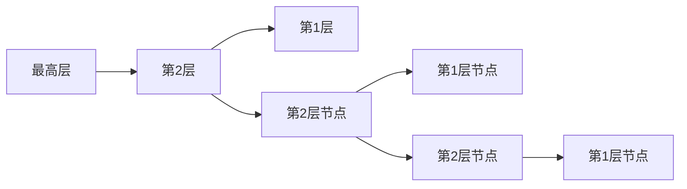

## 学习目标

本文是「Redis 与 MongoDB」模块的第 1 篇，难度定位为入门。重点内容：Redis 8.0概述、字符串SDS、哈希、列表quicklist、集合、有序集合跳表、位图、HyperLogLog、GEO、Stream、Vector Set。

主要章节：

- 1. Redis 8.0 概述
- 2. 字符串（SDS）
- 3. 哈希（Hash）
- 4. 列表（List）
- 5. 集合（Set）
- 6. 有序集合（ZSet）
- ……共 11 个章节

> 选型前先了解版本与许可现状（信息截至 2026-09，最新版本以 redis.io/downloads 为准）。

- 版本：Redis 8.0 于 2025-05 GA，此后 8.x 快速迭代（8.2、8.4、8.8 等均已发布）。8.0 引入了巨大的性能与功能跃迁，是当前升级的首选目标。
- 许可：8.0 起为 RSALv2 / SSPLv1 / AGPLv3 三许可可选（AGPLv3 为 2025-05 新增的 OSI 开源许可选项）；7.4 及之前仅有 RSALv2/SSPLv1（源可用许可），2024-03 的许可收紧催生了 Valkey 分叉（Linux Foundation 托管的 BSD 开源项目，API 兼容 Redis，一句了解即可，本文不展开）。
- 形态：Redis 8 起，原 Redis Stack 的能力（JSON、时间序列、概率结构、查询引擎等）已并入 Redis Open Source 内核，Redis Stack 独立发行版停止更新（官方于 2025-09-15 停止 6.2/7.2/7.4 版本补丁），新项目直接用 Redis 8+。
- 配套工具：Redis Insight 图形化客户端、redis-cli 命令行。


## 1. Redis 8.0 概述

### 1.1 Redis 简介

Redis（Remote Dictionary Server）是开源的**内存键值数据库**，支持丰富的数据结构、持久化、高可用和集群功能。Redis 8.0 引入了 Vector Set 等重要新特性。

### 1.2 Redis 核心特性

| 特性         | 说明                                     |
| :----------- | :--------------------------------------- |
| 内存存储     | 所有数据存储在内存，读写延迟微秒级       |
| 丰富数据结构 | String、Hash、List、Set、ZSet、Stream 等 |
| 持久化       | RDB 快照 + AOF 日志，混合持久化          |
| 高可用       | 主从复制 + Sentinel 哨兵自动故障转移     |
| 集群         | Redis Cluster 无中心分片集群             |
| 内置扩展能力 | 8.0 起内核内置 JSON、时间序列、概率数据结构、查询引擎（原 Stack 能力） |
| 单线程模型   | 命令执行单线程，I/O 多线程（6.0+，8.0 重新实现） |

### 1.3 Redis 8.0 新特性

```
- Vector Set: 原生高维向量近似搜索数据结构（HNSW，8.0 以 beta 引入）
- 查询引擎（Query Engine）: 支持集群横向扩展与垂直扩展，向量检索能力增强
- I/O 线程重新实现: io-threads 参数可显著提升多核吞吐（默认 1）
- 复制机制重构: 双流并行复制，全量同步期间峰值复制缓冲最多降低 35%
- 新增 Hash 命令: HGETDEL / HGETEX / HSETEX（基于 7.4 的字段级过期 HFE）
- ACL 新增类别: @bloom/@cms/@topk/@t-digest/@vector-set 等覆盖新数据结构
```

注意：Redis for AI、Redis Flex 属 Redis 商业产品（Redis Cloud / Redis Software）与
解决方案层面的能力，不是开源内核（Redis Open Source）的配置项，不要在
redis.conf 中寻找对应开关。

## 2. 字符串（SDS）

### 2.1 SDS 结构

Redis 使用 SDS（Simple Dynamic String）替代 C 字符串：

```c
// SDS 结构
struct sdshdr {
    int len;       // 已使用长度
    int free;      // 剩余空间
    char buf[];    // 数据区
};
```

| 特性       | C 字符串 | SDS                          |
| :--------- | :------- | :--------------------------- |
| 获取长度   | O(n)     | O(1)                         |
| 缓冲区溢出 | 可能     | 不会（空间预分配）           |
| 二进制安全 | 否       | 是（len 判断结尾）           |
| 内存重分配 | 每次修改 | 最多 N 次（预分配+惰性释放） |

### 2.2 常用命令

```bash
# 基本操作
SET key value [EX seconds] [PX ms] [NX|XX] [KEEPTTL]
GET key
DEL key [key ...]

# 设置带过期
SET session:abc123 '{"user":"admin"}' EX 3600    # 1小时过期
SET cache:home '<html>...</html>' EX 300          # 5分钟缓存

# NX: 仅键不存在时设置（分布式锁）
SET lock:order:123 "uuid-xxx" NX EX 30

# 批量操作
MSET key1 val1 key2 val2 key3 val3
MGET key1 key2 key3

# 数值操作
SET counter 100
INCR counter           # 101
INCRBY counter 10      # 111
DECRBY counter 5       # 106
INCRBYFLOAT counter 2.5 # 108.5

# 位操作
SETBIT user:active:20240101 100 1    # 第100位设为1
GETBIT user:active:20240101 100      # 返回1
BITCOUNT user:active:20240101         # 统计活跃用户数
BITOP AND result key1 key2            # 位运算
```

## 3. 哈希（Hash）

### 3.1 底层编码

```
Hash 底层编码:
1. listpack（小对象）: field 数量 ≤ hash-max-listpack-entries 且值长度 ≤ hash-max-listpack-value
2. hashtable（大对象）: 超过阈值时转换

hashtable 结构:
  dict → ht[0] + ht[1]（渐进式 rehash）
  每个 ht: 数组 + 哈希函数（SipHash）
```

### 3.2 常用命令

```bash
# 基本操作
HSET user:1001 name "Alice" age 30 email "alice@example.com"
HGET user:1001 name              # "Alice"
HMGET user:1001 name age email   # 批量获取
HGETALL user:1001                 # 获取所有字段
HDEL user:1001 email              # 删除字段
HLEN user:1001                    # 字段数量

# 数值操作
HINCRBY user:1001 age 1           # 年龄+1
HINCRBYFLOAT user:1001 score 0.5  # 浮点数增加

# 条件操作
HSETNX user:1001 email "new@example.com"  # 仅字段不存在时设置

# 判断与遍历
HEXISTS user:1001 name            # 字段是否存在
HKEYS user:1001                   # 所有字段名
HVALS user:1001                   # 所有字段值
HSCAN user:1001 MATCH "na*"       # 模式匹配遍历
```

## 4. 列表（List）

### 4.1 底层编码

```
List 底层编码: quicklist
  quicklist = listpack（压缩列表）+ 双向链表
  每个节点是一个 listpack，中间节点可压缩（LZF 算法）

配置参数:
  list-max-listpack-size: 单个 listpack 大小限制
  list-compress-depth: 压缩深度（0=不压缩，1=首尾不压缩）
```

### 4.2 常用命令

```bash
# 队列操作（FIFO）
LPUSH queue:tasks "task1" "task2"    # 左端入队
RPOP queue:tasks                      # 右端出队

# 栈操作（LIFO）
LPUSH stack:undo "action1"
LPOP stack:undo

# 阻塞操作（消息队列场景）
BLPOP queue:tasks 30    # 阻塞等待30秒
BRPOP queue:tasks 0     # 无限等待

# 查看与裁剪
LLEN queue:tasks                       # 列表长度
LRANGE queue:tasks 0 -1                # 查看所有元素
LRANGE queue:tasks 0 9                 # 前10个
LTRIM queue:tasks 0 99                 # 仅保留前100个

# 指定位置操作
LINDEX queue:tasks 0                   # 按索引获取
LSET queue:tasks 0 "updated_task"      # 按索引设置
LINSERT queue:tasks BEFORE "task2" "task1.5"  # 插入
LREM queue:tasks 2 "task1"             # 删除指定值
```

## 5. 集合（Set）

### 5.1 底层编码

```
Set 底层编码:
1. intset: 所有元素都是整数且数量 ≤ set-max-intset-entries（默认512）
2. hashtable: 元素为哈希表的 key，value 为 NULL
```

### 5.2 常用命令

```bash
# 基本操作
SADD tags:article:1 "redis" "database" "nosql"
SREM tags:article:1 "nosql"
SISMEMBER tags:article:1 "redis"       # 是否存在
SMEMBERS tags:article:1                 # 所有成员
SCARD tags:article:1                    # 成员数量

# 随机操作
SRANDMEMBER tags:article:1 2            # 随机取2个（不删除）
SPOP tags:article:1                     # 随机弹出1个

# 集合运算
SADD set:a 1 2 3 4 5
SADD set:b 3 4 5 6 7

SINTER set:a set:b           # 交集: {3,4,5}
SUNION set:a set:b           # 并集: {1,2,3,4,5,6,7}
SDIFF set:a set:b            # 差集: {1,2}

SINTERSTORE result set:a set:b   # 交集存入 result
SUNIONSTORE result set:a set:b   # 并集存入 result
SDIFFSTORE result set:a set:b    # 差集存入 result

# 遍历
SSCAN tags:article:1 MATCH "re*"
```

## 6. 有序集合（ZSet）

### 6.1 底层编码



平均查询复杂度：O(logN)，空间复杂度：O(N)

### 6.2 常用命令

```bash
# 添加与更新
ZADD leaderboard 100 "Alice" 95 "Bob" 88 "Charlie"
ZADD leaderboard XX 105 "Alice"          # 仅更新已存在成员
ZADD leaderboard NX 92 "David"           # 仅添加新成员
ZADD leaderboard GT 110 "Alice"          # 仅当新分数更大时更新
ZADD leaderboard LT 80 "Bob"             # 仅当新分数更小时更新

# 查询
ZSCORE leaderboard "Alice"               # 获取分数
ZRANK leaderboard "Alice"                # 排名（升序，从0开始）
ZREVRANK leaderboard "Alice"             # 排名（降序）

# 范围查询（按分数）
ZRANGEBYSCORE leaderboard 90 100         # 分数 90~100
ZRANGEBYSCORE leaderboard -inf +inf      # 所有
ZRANGEBYSCORE leaderboard (90 100        # 开区间 >90
ZCOUNT leaderboard 90 100                # 计数

# 范围查询（按排名）
ZRANGE leaderboard 0 9 WITHSCORES        # 前10名（升序）
ZREVRANGE leaderboard 0 9 WITHSCORES     # 前10名（降序）

# 删除
ZREM leaderboard "Charlie"
ZREMRANGEBYRANK leaderboard 0 2          # 删除排名0~2
ZREMRANGEBYSCORE leaderboard -inf 60     # 删除分数≤60

# 聚合操作
ZUNIONSTORE result 2 leaderboard1 leaderboard2 WEIGHTS 1 2 AGGREGATE SUM
ZINTERSTORE result 2 leaderboard1 leaderboard2 AGGREGATE MAX
```

## 7. 位图（Bitmap）

```bash
# 位图操作（基于 String 类型）
SETBIT sign:202401:1001 0 1     # 第1天签到
SETBIT sign:202401:1001 6 1     # 第7天签到
GETBIT sign:202401:1001 0       # 检查第1天是否签到
BITCOUNT sign:202401:1001       # 本月签到次数
BITPOS sign:202401:1001 1       # 第一个签到的天

# 统计活跃用户
SETBIT active:20240101 1001 1   # 用户1001活跃
SETBIT active:20240101 1002 1   # 用户1002活跃
BITCOUNT active:20240101        # 当日活跃用户数

# 连续签到天数
BITFIELD sign:202401:1001 GET u31 0  # 获取31位无符号整数
```

## 8. HyperLogLog

```bash
# 基数估算（0.81% 标准误差，仅 12KB 内存）
PFADD uv:20240101 "user1" "user2" "user3"
PFADD uv:20240101 "user1" "user4"        # 重复不计数
PFCOUNT uv:20240101                       # 估算独立访客数

# 合并
PFADD uv:20240102 "user2" "user3" "user5"
PFMERGE uv:week uv:20240101 uv:20240102
PFCOUNT uv:week                           # 合并后的独立访客数
```

## 9. GEO（地理位置）

```bash
# GEO 基于 ZSet 实现（使用 GeoHash 编码作为分数）

# 添加地理位置
GEOADD locations 116.397 39.908 "北京" 121.474 31.230 "上海" 113.264 23.129 "广州"

# 计算距离
GEODIST locations "北京" "上海" km       # 约 1067.5 km

# 范围查询
GEORADIUS locations 116.397 39.908 500 km WITHDIST WITHCOORD COUNT 10
GEORADIUSBYMEMBER locations "北京" 500 km WITHDIST

# Redis 6.2+ 推荐使用 GEOSEARCH
GEOSEARCH locations FROMMEMBER "北京" BYRADIUS 500 km WITHDIST COUNT 10
GEOSEARCH locations FROMLONLAT 116.397 39.908 BYBOX 500 500 km WITHDIST

# 获取坐标
GEOPOS locations "北京"

# GeoHash 编码
GEOHASH locations "北京"
```

## 10. Stream

### 10.1 Stream 基本操作

```bash
# 添加消息（ID 位置写 * 表示由服务器自动生成）
XADD orders:2024 * name "Alice" product "Book" price 29.9
# 返回: "1704067200000-0"（毫秒时间戳-序号）

# 裁剪：maxlen 是 XADD 的选项，写在 ID 之前
XADD orders:2024 MAXLEN ~ 10000 * name "Bob" product "Pen" price 5.5
# maxlen ~ 10000: 近似裁剪到10000条（允许略超以提升性能）

# 读取消息
XRANGE orders:2024 - +                    # 所有消息
XRANGE orders:2024 - + COUNT 10           # 前10条
XRANGE orders:2024 1704067200000-0 +      # 从指定ID开始
XREVRANGE orders:2024 + - COUNT 5         # 最新5条

# 读取新消息（非阻塞）
XREAD COUNT 10 STREAMS orders:2024 $

# 阻塞读取
XREAD COUNT 10 BLOCK 5000 STREAMS orders:2024 $
```

### 10.2 消费者组

```bash
# 创建消费者组
XGROUP CREATE orders:2024 order-processors $ MKSTREAM
# $ = 从最新消息开始，0 = 从头开始

# 消费者读取
XREADGROUP GROUP order-processors consumer1 COUNT 1 STREAMS orders:2024 >

# 确认消息
XACK orders:2024 order-processors 1704067200000-0

# 查看待处理消息
XPENDING orders:2024 order-processors

# 查看消费者组信息
XINFO GROUPS orders:2024
XINFO CONSUMERS orders:2024 order-processors

# 转移未确认消息给其他消费者
XCLAIM orders:2024 order-processors consumer2 3600 1704067200000-0
```

## 11. Vector Set（Redis 8.0 新增）

### 11.1 Vector Set 概述

Vector Set 是 Redis 8.0 新增的数据结构（以 beta 引入），支持**高维向量近似最近邻搜索（ANN）**，基于 HNSW（Hierarchical Navigable Small World）算法。命令族与 ZSet 相似（V 前缀）：VADD / VSIM / VEMB / VDIM / VCARD / VREM / VSETATTR / VGETATTR / VISMEMBER / VRANDMEMBER / VINFO / VLINKS。

```bash
# 添加向量（VALUES <维度> <值...> <元素名>；默认 int8 量化存储）
VADD products:vec VALUES 8 0.1 0.2 0.3 0.4 0.5 0.6 0.7 0.8 item:1
VADD products:vec VALUES 8 0.2 0.3 0.4 0.5 0.6 0.7 0.8 0.9 item:2
VADD products:vec VALUES 8 0.9 0.8 0.7 0.6 0.5 0.4 0.3 0.2 item:3

# 相似度搜索：VSIM + VALUES（按向量查）或 ELE（按已有元素查）
VSIM products:vec VALUES 8 0.1 0.2 0.3 0.4 0.5 0.6 0.7 0.8 COUNT 5
VSIM products:vec ELE item:1 COUNT 3 WITHSCORES

# 元素属性（JSON 字符串），可配合 FILTER 过滤
VSETATTR products:vec item:1 '{"category":"electronics"}'
VSIM products:vec ELE item:1 COUNT 5 FILTER '.category == "electronics"'

# 取回向量 / 维度 / 删除元素
VEMB products:vec item:1      # 返回量化后的向量值
VDIM products:vec             # 维度
VREM products:vec item:1

# 查看信息
VINFO products:vec
```

注意：不存在 VSET / VSEARCH / VGET / VDEL 命令；添加、检索、删除分别对应
VADD / VSIM / VREM。属性查询语法为 JSON 路径风格（`.category == "..."`）。

### 11.2 Vector Set vs pgvector

| 维度     | Redis Vector Set | pgvector       |
| :------- | :--------------- | :------------- |
| 存储     | 内存             | 磁盘（可缓存） |
| 延迟     | 微秒级           | 毫秒级         |
| 索引算法 | HNSW             | HNSW / IVFFlat |
| 持久化   | RDB/AOF          | 原生持久化     |
| 适用场景 | 实时推荐、缓存   | 大规模向量检索 |
| 数据量   | 受内存限制       | 受磁盘限制     |
