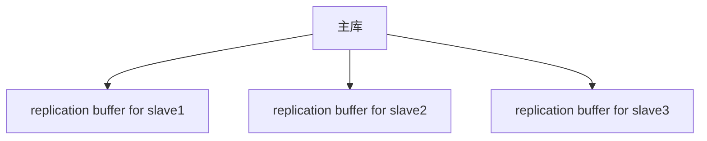

## 1. 复制缓冲区体系

### 1.1 三种复制缓冲区

| 缓冲区              | 位置 | 作用                         | 大小     |
| ------------------- | ---- | ---------------------------- | -------- |
| repl_backlog        | 主库 | 存储最近写命令，支持部分同步 | 默认 1MB |
| replication buffer  | 主库 | 为每个从库维护的输出缓冲区   | 动态增长 |
| replication backlog | 从库 | 接收主库数据的临时缓冲       | 动态     |

### 1.2 数据流

```
主库写入命令 → repl_backlog（环形缓冲）
             → replication buffer（每从库一个）
                 ↓ 网络传输
             从库接收 → 执行命令
```

## 2. repl_backlog 环形缓冲区

### 2.1 结构

```mermaid
flowchart LR
    B[repl_backlog 定长环形缓冲区<br/>[cmd1][cmd2][cmd3]...[cmdN]]
    B --> H[repl_backlog_histlen 有效数据起始]
    B --> I[repl_backlog_idx 写入位置]
```

总大小：repl_backlog_size（默认 1MB）。新数据写入 repl_backlog_idx 位置，写满后环绕到开头覆盖最旧数据

### 2.2 全局偏移量

```
repl_backlog_off: 缓冲区起始位置对应的全局偏移量
master_repl_offset: 主库当前的全局偏移量

有效数据范围: [repl_backlog_off, master_repl_offset]
```

### 2.3 部分同步（PSYNC）

```
从库断线重连时:
1. 发送 PSYNC {runid} {offset}
   - runid: 主库运行ID
   - offset: 从库最后收到的偏移量

2. 主库判断:
   - runid 匹配 且 offset 在 backlog 范围内 → 部分同步
   - 否则 → 全量同步

部分同步:
  主库从 backlog 中提取 [offset, master_repl_offset] 的数据
  发送给从库
```

### 2.4 部分同步判断

```
条件: offset >= repl_backlog_off

如果 offset < repl_backlog_off:
  说明从库缺失的数据已被覆盖 → 全量同步

示例:
  repl_backlog_size = 1MB
  repl_backlog_off = 1000000
  master_repl_offset = 1100000

  从库 offset = 1050000 → 1050000 >= 1000000 → 部分同步
  从库 offset = 900000  → 900000 < 1000000  → 全量同步
```

## 3. replication buffer

### 3.1 作用

主库为每个从库维护一个独立的输出缓冲区，暂存待发送的写命令：



### 3.2 缓冲区溢出

当从库消费速度慢于主库写入速度时，buffer 持续增长：

```
写入速度: 100MB/s
从库消费: 10MB/s
每秒积压: 90MB

1分钟后: 5.4GB → 触发内存限制 → 从库被断开
```

### 3.3 缓冲区限制配置

```redis
# 客户端输出缓冲区限制（包括从库）
# 格式: client-output-buffer-limit <class> <hard> <soft> <soft_seconds>

# 从库缓冲区：硬限制 256MB，软限制 64MB 持续 60秒
client-output-buffer-limit replica 256mb 64mb 60

# 普通客户端
client-output-buffer-limit normal 0 0 0

# Pub/Sub 客户端
client-output-buffer-limit pubsub 32mb 8mb 60
```

**触发断开条件**：

- 缓冲区超过硬限制 → 立即断开
- 缓冲区超过软限制持续 N 秒 → 断开

## 4. 全量同步流程

### 4.1 触发条件

- 从库首次连接主库
- 从库发送的 runid 不匹配
- 从库请求的 offset 已被 backlog 覆盖

### 4.2 全量同步步骤

```
1. 从库发送 PSYNC ? -1（请求全量同步）
2. 主库执行 BGSAVE 生成 RDB
3. 主库将 RDB 发送给从库
4. 主库同时将新写入命令存入 replication buffer
5. 从库接收 RDB 后清空数据并加载
6. 主库发送 replication buffer 中的增量命令
7. 从库执行增量命令，数据一致
```

### 4.3 全量同步开销

```
BGSAVE: fork 子进程，COW 写时复制
RDB 传输: 网络带宽
从库加载: 阻塞服务（加载期间不可用）
增量缓冲: 内存占用
```

## 5. 配置优化

### 5.1 repl_backlog 大小

```redis
# 根据写入速度和断线时间估算
# 假设: 写入速度 10MB/s，最大断线时间 60s
# backlog 大小 >= 10MB/s × 60s = 600MB

repl-backlog-size 600mb
```

**计算公式**：

$$\text{backlog\_size} \geq \text{write\_rate} \times \text{max\_disconnect\_time}$$

### 5.2 关键参数

```redis
# repl_backlog 大小
repl-backlog-size 256mb

# repl_backlog TTL（无从库时多久删除）
repl-backlog-ttl 3600

# 从库发送 PING 的频率
repl-ping-replica-period 10

# 复制超时（包括SYNC、PING）
repl-timeout 60

# 禁用 TCP_NODELAY（启用后延迟更低但带宽更大）
repl-disable-tcp-nodelay no

# 从库优先级（Sentinel 选举用）
replica-priority 100
```

### 5.3 监控命令

```redis
# 主库查看复制信息
INFO replication

# 关键指标:
# repl_backlog_active: 1
# repl_backlog_size: 268435456
# repl_backlog_first_byte_offset: 12345
# repl_backlog_histlen: 268435400
# connected_slaves: 3
# master_repl_offset: 9999999
```
## 主从配置

**基本写法：REPLICAOF 设置从库**
`REPLICAOF <host> <port>`
```redis
-- Redis 5.0+ 用 REPLICAOF（替代旧版 SLAVEOF）
REPLICAOF 192.168.1.10 6379

-- 取消从库身份，升级为主库
REPLICAOF NO ONE

-- 旧版写法（仍兼容但建议用 REPLICAOF）
SLAVEOF 192.168.1.10 6379
SLAVEOF NO ONE
```

---

**基本写法：配置文件持久化**
`replicaof <host> <port>`
```conf
# redis.conf 主从配置
replicaof 192.168.1.10 6379
masterauth <主库密码>          -- 主库有密码时设置
replica-auth-password <密码>   -- Redis 7.0+ 推荐写法

# 只读从库（默认 yes）
replica-read-only yes

# 复制缓冲区大小（应对断线重连）
repl-backlog-size 256mb
repl-backlog-ttl 3600
```

---

## 复制状态查询

**基本写法：INFO replication**
`INFO replication`
```redis
-- 查看复制信息
INFO replication
-- 关键字段：
-- role:master|slave
-- connected_slaves: 从库数量
-- slave0:ip=...,port=...,state=online,offset=...,lag=0
-- master_repl_offset: 主库复制偏移量
-- repl_backlog_size / repl_backlog_first_byte_offset
```

---

**基本写法：ROLE 查看角色**
`ROLE`
```redis
-- 返回当前节点角色信息
ROLE
-- 主库返回：master <offset> <从库列表>
-- 从库返回：slave <主IP> <主端口> <状态> <已复制偏移量>
```

---

## PSYNC 同步机制

**基本写法：PSYNC 部分重同步**
`PSYNC <replicationid> <offset>`
```redis
-- 从库内部调用，通常无需手动执行
-- 首次同步：PSYNC ? -1  触发全量 RDB 同步
-- 断线重连：PSYNC <runid> <offset>  尝试部分重同步

-- 全量同步流程：
-- 1. 从库发送 PSYNC ? -1
-- 2. 主库 BGSAVE 生成 RDB 并发送
-- 3. 主库同时缓存写命令到 backlog
-- 4. RDB 发送完，主库发送缓存的写命令
-- 5. 后续主库写命令实时复制

-- 部分重同步条件：offset 在 backlog 范围内
```

---

## 复制缓冲区

**基本写法：调整 backlog 大小**
`CONFIG SET repl-backlog-size <大小>`
```redis
-- backlog 越大，断线重连时部分重同步成功率越高
CONFIG SET repl-backlog-size 512mb

-- 主库无从库时 backlog 释放时间（秒），0=永不释放
CONFIG SET repl-backlog-ttl 3600

-- 客户端输出缓冲区（从库连接）
CONFIG SET client-output-buffer-limit 'replica 256mb 64mb 60'
```

---

## 级联复制

**基本写法：链式复制**
`REPLICAOF <中间从库> <port>`
```redis
-- 一主多从的级联结构，减轻主库压力
-- master <- slave1 <- slave2
-- slave2 指向 slave1
REPLICAOF 192.168.1.11 6379   -- slave1 的地址

-- slave1 配置允许级联复制（默认允许）
-- replica-serve-stale-data yes
```

---

## 读写分离与一致性

**基本写法：WAIT 等待复制**
`WAIT <numreplicas> <timeout毫秒>`
```redis
-- 等待 N 个从库确认写入，返回确认的从库数
SET key1 value1
WAIT 1 1000    -- 等待 1 个从库确认，最多等 1000ms

-- 注意：WAIT 只等待当前命令的复制，不保证持久化
-- 不影响后续命令，仅返回已确认从库数量
```

---

**基本写法：只读从库配置**
`CONFIG SET replica-read-only yes`
```redis
-- 从库默认只读，禁止写入
CONFIG SET replica-read-only yes

-- 主从延迟导致读到旧数据的应对：
-- 1. 关键读走主库
-- 2. 使用 WAIT 等待复制
-- 3. 读从库后校验 offset
```

---

## 复制故障排查

**基本写法：排查复制中断**
`INFO replication | LATENCY`
```redis
-- 1. 检查从库连接状态
INFO replication
-- state 不为 online 时检查网络/密码

-- 2. 检查 master_link_status
-- master_link_status:down 表示连接断开

-- 3. 检查复制偏移量差距
-- master_repl_offset - slave_repl_offset = 滞后字节数

-- 4. 查看日志
LOG GET 100

-- 5. 强制全量重同步
REPLICAOF NO ONE
REPLICAOF <master_ip> <master_port>
```

---

## 复制过滤

**基本写法：选择性复制**
`replica-serve-stale-data | replica-priority`
```conf
# redis.conf 配置
# 从库与主库断开后是否继续提供旧数据服务
replica-serve-stale-data yes

# 从库优先级（哨兵选主用，0=永不被选为主）
replica-priority 100

# 忽略某些 key 的复制（Redis 7.0+ 已移除，改用 ACL）
# 旧版：replica-ignore-maxmemory no
```
