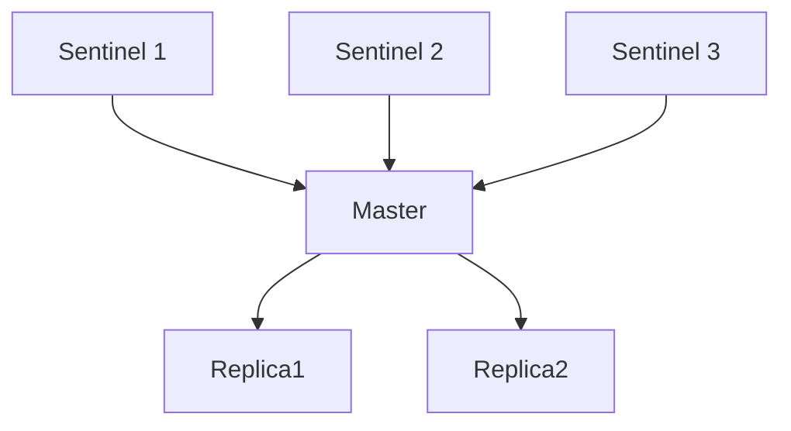

## 1. Sentinel 架构

### 1.1 Sentinel 集群



### 1.2 Sentinel 职责

- **监控**：持续检测主从库是否正常
- **通知**：故障时通知管理员或应用
- **自动故障转移**：主库故障时自动切换
- **配置提供者**：告知客户端当前主库地址

## 2. 下线检测

### 2.1 主观下线（SDOWN）

单个 Sentinel 认为节点不可用：

```
Sentinel 每秒向节点发送 PING
超过 down-after-milliseconds 无有效回复 → 标记为 SDOWN
```

```redis
# 配置
sentinel monitor mymaster 127.0.0.1 6379 2
sentinel down-after-milliseconds mymaster 30000
```

### 2.2 客观下线（ODOWN）

多个 Sentinel 都认为主库不可用：

```
1. Sentinel A 检测到 Master SDOWN
2. Sentinel A 向其他 Sentinel 发送 SENTINEL is-master-down-by-addr
3. 超过 quorum 个 Sentinel 确认 SDOWN → 标记为 ODOWN
4. ODOWN 触发故障转移
```

**quorum**：配置中 `sentinel monitor` 的最后一个参数，表示需要多少个 Sentinel 同意才能判定客观下线。

## 3. Leader 选举（Raft 算法）

### 3.1 为什么需要 Leader

只有被选为 Leader 的 Sentinel 才能执行故障转移，避免多个 Sentinel 同时执行。

### 3.2 Raft 选举流程

```
1. Sentinel 确认 Master ODOWN
2. Sentinel 自增 current_epoch（任期号）
3. 向其他 Sentinel 请求投票（SENTINEL is-master-down-by-addr）
4. 其他 Sentinel 每个任期只投一票（先到先得）
5. 获得多数票（> N/2）的 Sentinel 成为 Leader
6. Leader 执行故障转移
```

### 3.3 选举规则

```
规则1: 先到先得（FIFO）— 每个 epoch 只投一票
规则2: 获得多数票 — > ceil(N/2)，N 为 Sentinel 总数
规则3: epoch 递增 — 新选举的 epoch 必须大于当前值
```

**选举示例**（3个 Sentinel）：

```
Sentinel A: epoch=1, 请求投票 → 获得 A(自投), B → 2票 > 1.5 → 成为 Leader
Sentinel B: epoch=1, 请求投票 → 已投给A → 拒绝
Sentinel C: epoch=1, 请求投票 → 已投给A → 拒绝
```

### 3.4 选举超时与重试

```
如果未获得多数票:
  等待随机时间（避免同时发起选举）
  自增 epoch
  重新请求投票

最大重试次数: 无限制
超时时间: 故障转移超时（failover-timeout）
```

## 4. 故障转移

### 4.1 从库选择规则

Leader Sentinel 按以下规则选择新主库：

```
1. 排除下线或断线的从库
2. 排除最近5秒内未回复 INFO 的从库
3. 排除与旧主库断开时间过长的从库
   (down-after-milliseconds * 10)
4. 按优先级选择（replica-priority 越小越优先）
5. 优先级相同，选择复制偏移量最大的（数据最新）
6. 偏移量相同，选择 runid 最小的
```

### 4.2 故障转移步骤

```
步骤1: 选出新主库
  Leader Sentinel 根据上述规则选出最优从库

步骤2: 升级新主库
  SENTINEL SLAVEOF NO ONE → 新主库停止复制

步骤3: 修改其他从库的复制目标
  其他从库执行 SLAVEOF new_master

步骤4: 更新 Sentinel 配置
  所有 Sentinel 更新 Master 地址

步骤5: 通知客户端
  客户端通过 Sentinel 获取新 Master 地址
```

### 4.3 故障转移时间线

```
T+0s:    Master 下线
T+30s:   Sentinel 检测到 SDOWN（down-after-milliseconds=30s）
T+31s:   确认 ODOWN，发起 Leader 选举
T+32s:   Leader 选举完成
T+33s:   选出新主库，执行 SLAVEOF NO ONE
T+35s:   其他从库开始复制新主库
T+40s:   故障转移完成
```

## 5. Sentinel 配置最佳实践

### 5.1 推荐配置

```redis
# 至少3个 Sentinel（保证多数票）
sentinel monitor mymaster 127.0.0.1 6379 2

# down-after-milliseconds: 根据网络延迟调整
sentinel down-after-milliseconds mymaster 10000

# failover-timeout: 故障转移超时
sentinel failover-timeout mymaster 60000

# parallel-syncs: 故障转移后同时向新主库发起复制的从库数
sentinel parallel-syncs mymaster 1
```

### 5.2 quorum 设置

```
quorum 建议值: ceil(N/2)，N 为 Sentinel 数量

3个 Sentinel: quorum=2
5个 Sentinel: quorum=3

quorum 过低: 可能误判（网络分区时）
quorum 过高: 可能无法触发故障转移
```

### 5.3 客户端连接

```python
# Python 客户端通过 Sentinel 获取 Master
from redis.sentinel import Sentinel

sentinel = Sentinel([
    ('sentinel1', 26379),
    ('sentinel2', 26379),
    ('sentinel3', 26379)
], socket_timeout=0.1)

master = sentinel.master_for('mymaster', password='xxx')
slave = sentinel.slave_for('mymester', password='xxx')
```
## 哨兵配置

**基本写法：sentinel.conf 配置**
`sentinel monitor <主库别名> <host> <port> <quorum>`
```conf
# sentinel.conf 配置文件
port 26379
sentinel monitor mymaster 192.168.1.10 6379 2
sentinel auth-pass mymaster <主库密码>
sentinel down-after-milliseconds mymaster 30000
sentinel parallel-syncs mymaster 1
sentinel failover-timeout mymaster 180000

# quorum=2：2 个哨兵同意才判定主观下线转客观下线
# down-after-milliseconds：30s 无响应判定下线
# parallel-syncs：故障转移时并行同步的从库数
# failover-timeout：故障转移超时
```

---

**基本写法：启动哨兵**
`redis-sentinel <配置文件> | redis-server <配置文件> --sentinel`
```bash
# 方式一：redis-sentinel 专用命令
redis-sentinel /etc/redis/sentinel.conf

# 方式二：redis-server 加 --sentinel 参数
redis-server /etc/redis/sentinel.conf --sentinel

# 集群部署：至少 3 个哨兵节点，分散部署
```

---

## 哨兵查询命令

**基本写法：SENTINEL masters**
`SENTINEL masters | SENTINEL master <主库别名>`
```redis
-- 查看所有被监控的主库
SENTINEL masters

-- 查看指定主库详情
SENTINEL master mymaster
-- 返回：name, ip, port, runid, role-reported, slaves, sentinels,
--       quorum, flags(master), down-after-milliseconds, etc.
```

---

**基本写法：查看从库与哨兵**
`SENTINEL slaves <主库别名> | SENTINEL sentinels <主库别名>`
```redis
-- 查看主库下的从库列表
SENTINEL slaves mymaster

-- 查看监控同一主库的其他哨兵
SENTINEL sentinels mymaster
```

---

**基本写法：获取主库地址**
`SENTINEL get-master-addr-by-name <主库别名>`
```redis
-- 客户端连接哨兵查询当前主库地址
SENTINEL get-master-addr-by-name mymaster
-- 返回：1) "192.168.1.11"  2) "6379"（故障转移后地址会变）
```

---

## 故障转移

**基本写法：手动故障转移**
`SENTINEL failover <主库别名>`
```redis
-- 手动触发故障转移，将从库提升为主库
SENTINEL failover mymaster

-- 故障转移流程：
-- 1. 哨兵标记主库下线
-- 2. 选举领头哨兵
-- 3. 选择最优从库（优先级>偏移量>runid）
-- 4. 从库执行 SLAVEOF NO ONE 升主
-- 5. 其他从库指向新主库
-- 6. 旧主恢复后变为从库
```

---

**基本写法：强制重置**
`SENTINEL reset <pattern>`
```redis
-- 重置匹配 pattern 的主库监控（清空状态重新发现）
SENTINEL reset my*
-- 重置所有
SENTINEL reset *

-- 重置后哨兵会重新发现主从拓扑
```

---

**基本写法：检查仲裁**
`SENTINEL ckquorum <主库别名>`
```redis
-- 检查当前哨兵数是否足够达成仲裁
SENTINEL ckquorum mymaster
-- 返回 OK 表示可用；返回 error 表示哨兵不足
```

---

## 故障转移原理

**基本写法：下线判定与选举**
`<主观下线> -> <客观下线> -> <_leader 选举> -> <选从升主>`
```redis
-- 1. 主观下线（SDOWN）：单个哨兵判定 down
--    条件：down-after-milliseconds 内无响应

-- 2. 客观下线（ODOWN）：quorum 个哨兵同意
--    通过 SENTINEL is-master-down-by-addr 投票

-- 3. Leader 选举：Raft 协议选领头哨兵执行转移

-- 4. 从库选举优先级：
--    a. replica-priority 值小的优先（0 永不升主）
--    b. 复制偏移量大的优先（数据更新）
--    c. runid 字典序小的优先
```

---

## 客户端连接哨兵

**基本写法：客户端订阅切换事件**
`SUBSCRIBE +switch-master | +sdown`
```redis
-- 客户端订阅哨兵频道感知主库切换
SUBSCRIBE +switch-master
-- 故障转移后收到：mymaster 192.168.1.10 6379 192.168.1.11 6379

-- 订阅下线事件
PSUBSCRIBE *

-- 常见事件频道：
-- +switch-master：主库切换
-- +sdown：主观下线
-- +odown：客观下线
-- +failover-state-*：故障转移各阶段
-- +slave-reconf-sent：从库重配置
```

---

## 哨兵运维

**基本写法：动态修改配置**
`SENTINEL set <主库别名> <参数> <值>`
```redis
-- 动态修改哨兵配置（运行时生效）
SENTINEL set mymaster down-after-milliseconds 5000
SENTINEL set mymaster parallel-syncs 3
SENTINEL set mymaster failover-timeout 300000
SENTINEL set mymaster quorum 3

-- 动态添加监控主库
SENTINEL monitor newmaster 192.168.2.10 6379 2
-- 移除监控
SENTINEL remove newmaster
```

---

**基本写法：flushconfig 持久化**
`SENTINEL flushconfig`
```redis
-- 将当前哨兵状态写入配置文件（持久化）
SENTINEL flushconfig
-- 哨兵状态变更（发现新从库/哨兵）后建议执行
```
