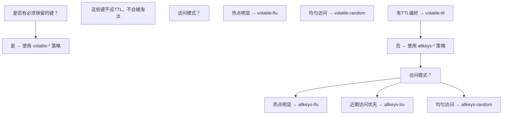

# 内存淘汰策略

---

## 1. 内存淘汰概述

### 1.1 触发条件

当 Redis 使用内存超过 `maxmemory` 配置时，触发淘汰策略：

```redis
# 设置最大内存
CONFIG SET maxmemory 4gb

# 查看当前内存使用
INFO memory
# used_memory: 3.8GB
# maxmemory: 4GB
```

### 1.2 八种淘汰策略

| 策略            | 淘汰范围  | 算法        | 适用场景      |
| --------------- | --------- | ----------- | ------------- |
| noeviction      | 不淘汰    | -           | 数据不能丢失  |
| allkeys-lru     | 所有键    | LRU         | 通用缓存      |
| allkeys-lfu     | 所有键    | LFU         | 热点数据明显  |
| allkeys-random  | 所有键    | 随机        | 无访问偏好    |
| volatile-lru    | 有TTL的键 | LRU         | 混合使用      |
| volatile-lfu    | 有TTL的键 | LFU         | 混合使用      |
| volatile-random | 有TTL的键 | 随机        | 混合使用      |
| volatile-ttl    | 有TTL的键 | 最短TTL优先 | 业务有明确TTL |

## 2. LRU 算法

### 2.1 传统 LRU

传统 LRU 维护一个按访问时间排序的链表：

```
访问顺序: A → B → C → D → E

最近访问的在头部，最久未访问的在尾部
淘汰时删除尾部元素

问题: 需要大量内存维护链表指针
```

### 2.2 Redis 近似 LRU

Redis 使用**采样近似 LRU**，不维护全局链表：

```
1. 随机采样 N 个键（N = maxmemory-samples，默认5）
2. 淘汰其中最久未访问的键
3. 重复直到内存低于阈值
```

### 2.3 LRU 时钟

每个 Redis 对象头包含一个 24 位的 LRU 时钟：

```c
typedef struct redisObject {
    unsigned type:4;
    unsigned encoding:4;
    unsigned lru:24;    // LRU 时间戳（精度约1.5分钟）
    int refcount;
    void *ptr;
} robj;
```

```
LRU 时钟精度: 1000ms / 300 ≈ 3.3秒
24位最大值: 2^24 = 16777216 ≈ 194天循环

计算空闲时间: current_lru - object.lru
```

### 2.4 采样数对效果的影响

```
maxmemory-samples = 3:  接近真实LRU的 80%
maxmemory-samples = 5:  接近真实LRU的 90%  ← 默认
maxmemory-samples = 10: 接近真实LRU的 95%
maxmemory-samples = 20: 接近真实LRU的 98%

采样数越大，越接近真实LRU，但CPU开销也越大
```

## 3. LFU 算法

### 3.1 LFU 原理

LFU（Least Frequently Used）根据**访问频率**淘汰，比 LRU 更适合热点数据场景：

```
LRU: 最近访问的保留 → 偶尔访问的大文件可能挤掉频繁访问的小数据
LFU: 频繁访问的保留 → 真正的热点数据不会被淘汰
```

### 3.2 Redis LFU 实现

Redis 4.0+ 引入 LFU，复用 `lru` 字段的 24 位：

```
24位 lru 字段:
  高16位: 最后衰减时间（分钟级）
  低8位:  对数计数器（logarithmic counter）

计数器范围: 0-255
实际频率范围: 1-约100万次/分钟
```

### 3.3 对数计数器

$$\text{counter} = \lfloor \log_2(\log_2(\text{实际访问次数} + 1)) + \text{初始值} \rfloor$$

```
实际访问次数 → counter 值:
  1次     → 1
  4次     → 2
  16次    → 3
  256次   → 5
  65536次 → 8
  百万次  → 255 (最大值)
```

**更新规则**：

```c
uint8_t LFULogIncr(uint8_t counter) {
    if (counter == 255) return 255;
    double r = (double)rand() / RAND_MAX;
    double baseval = counter - LFU_INIT_VAL;  // LFU_INIT_VAL = 5
    if (baseval < 0) baseval = 0;
    double p = 1.0 / (baseval * 10 + 1);  // 概率递减
    if (r < p) counter++;
    return counter;
}
```

### 3.4 衰减机制

LFU 计数器随时间衰减，避免历史热点永远不被淘汰：

```
衰减规则:
  每经过 lfu-decay-time 分钟，counter 减 1
  lfu-decay-time 默认为 1 分钟

示例:
  counter=10, 5分钟无访问 → counter=5
  counter=10, 持续访问 → counter 保持或增长
```

### 3.5 LFU 配置

```redis
# 淘汰策略
CONFIG SET maxmemory-policy allkeys-lfu

# 衰减时间（分钟）
CONFIG SET lfu-decay-time 1

# 计数器初始值
CONFIG SET lfu-log-factor 10
```

## 4. 策略选择

### 4.1 决策流程



### 4.2 常见场景推荐

| 场景          | 推荐策略     | 理由            |
| ------------- | ------------ | --------------- |
| 纯缓存        | allkeys-lfu  | 热点数据保留    |
| 会话缓存      | allkeys-lru  | 近期活跃保留    |
| 消息队列      | volatile-ttl | 过期自动清理    |
| 持久数据+缓存 | volatile-lru | 持久数据不设TTL |
| 数据不能丢失  | noeviction   | 写入报错不淘汰  |

### 4.3 监控与调优

```redis
# 查看淘汰统计
INFO stats
# evicted_keys: 1234  ← 被淘汰的键数量

# 查看内存使用
INFO memory
# used_memory: 3.8GB
# maxmemory: 4GB
# mem_fragmentation_ratio: 1.2

# 调优建议:
# 1. evicted_keys 持续增长 → 增大 maxmemory 或优化策略
# 2. 缓存命中率低 → 考虑换策略（LRU → LFU）
# 3. 内存碎片率高 → 重启或使用 activedefrag
```
## 触发条件

**基本写法：设置最大内存**
`CONFIG SET maxmemory <bytes>`
```bash
# 设置 Redis 最大内存为 4GB
CONFIG SET maxmemory 4gb
```

**基本写法：查看内存使用**
`INFO memory`
```bash
# 查看当前内存使用情况
INFO memory
```

---

## 淘汰策略配置

**基本写法：不淘汰策略**
`CONFIG SET maxmemory-policy noeviction`
```bash
# 内存不足时拒绝写入，返回错误
CONFIG SET maxmemory-policy noeviction
```

**基本写法：所有键 LRU 策略**
`CONFIG SET maxmemory-policy allkeys-lru`
```bash
# 所有键中淘汰最久未访问的键
CONFIG SET maxmemory-policy allkeys-lru
```

**基本写法：所有键 LFU 策略**
`CONFIG SET maxmemory-policy allkeys-lfu`
```bash
# 所有键中淘汰访问频率最低的键
CONFIG SET maxmemory-policy allkeys-lfu
```

**基本写法：所有键随机策略**
`CONFIG SET maxmemory-policy allkeys-random`
```bash
# 所有键中随机淘汰
CONFIG SET maxmemory-policy allkeys-random
```

**基本写法：有 TTL 的键 LRU 策略**
`CONFIG SET maxmemory-policy volatile-lru`
```bash
# 有过期时间的键中淘汰最久未访问的键
CONFIG SET maxmemory-policy volatile-lru
```

**基本写法：有 TTL 的键 LFU 策略**
`CONFIG SET maxmemory-policy volatile-lfu`
```bash
# 有过期时间的键中淘汰访问频率最低的键
CONFIG SET maxmemory-policy volatile-lfu
```

**基本写法：有 TTL 的键随机策略**
`CONFIG SET maxmemory-policy volatile-random`
```bash
# 有过期时间的键中随机淘汰
CONFIG SET maxmemory-policy volatile-random
```

**基本写法：有 TTL 的键最短 TTL 优先策略**
`CONFIG SET maxmemory-policy volatile-ttl`
```bash
# 有过期时间的键中淘汰 TTL 最短的键
CONFIG SET maxmemory-policy volatile-ttl
```

---

## LRU 算法

**基本写法：设置 LRU 采样数**
`CONFIG SET maxmemory-samples <N>`
```bash
# 设置 LRU 采样数为 5（默认值）
CONFIG SET maxmemory-samples 5
```

**结构定义写法：redisObject LRU 时钟字段**
`struct redisObject { unsigned lru:24; }`
```c
// 每个 Redis 对象头包含一个 24 位的 LRU 时钟
typedef struct redisObject {
    unsigned type:4;
    unsigned encoding:4;
    unsigned lru:24;    // LRU 时间戳（精度约1.5分钟）
    int refcount;
    void *ptr;
} robj;
```

---

## LFU 算法

**基本写法：设置 LFU 衰减时间**
`CONFIG SET lfu-decay-time <minutes>`
```bash
# 设置 LFU 计数器衰减时间为 1 分钟
CONFIG SET lfu-decay-time 1
```

**基本写法：设置 LFU 计数器因子**
`CONFIG SET lfu-log-factor <factor>`
```bash
# 设置 LFU 计数器对数因子为 10
CONFIG SET lfu-log-factor 10
```

**函数源码写法：LFU 对数计数器更新**
`uint8_t LFULogIncr(uint8_t counter)`
```c
// LFU 对数计数器更新函数
uint8_t LFULogIncr(uint8_t counter) {
    if (counter == 255) return 255;
    double r = (double)rand() / RAND_MAX;
    double baseval = counter - LFU_INIT_VAL;  // LFU_INIT_VAL = 5
    if (baseval < 0) baseval = 0;
    double p = 1.0 / (baseval * 10 + 1);  // 概率递减
    if (r < p) counter++;
    return counter;
}
```

---

## 监控与调优

**基本写法：查看淘汰统计**
`INFO stats`
```bash
# 查看键淘汰统计信息
INFO stats
```
