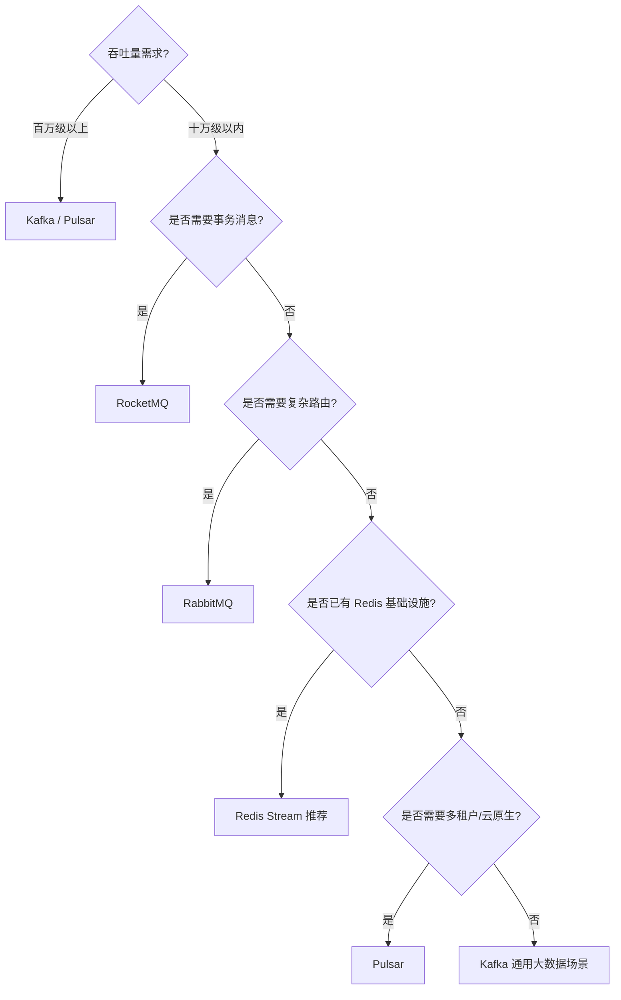
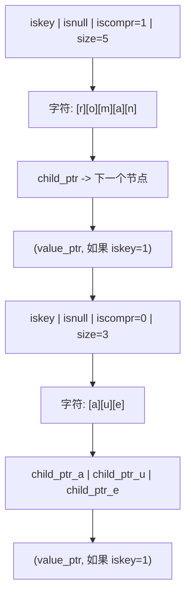

> 定位说明：本篇为进阶参考书（参考层），面向已完成本模块主线的读者；入门请先走学习路径前序阶段。定位标准见 docs/standards/reference-layer.md（仓库）。

## 前置知识

建议先阅读以下内容再进入本文：

- [概述与核心数据结构](/redis/010-OverviewCoreDataStructure)

本篇是 Stream 系列的核心篇，系列共三篇、各自独立成篇：

- [核心篇（本篇）](/redis/090-Stream)：Stream 是什么、解决什么问题、消息 ID 与条目的底层结构、基础读写命令；
- [消费者组篇](/redis/092-StreamConsumerGroups)：XGROUP/XREADGROUP/XACK/XCLAIM、PEL 待确认列表、消息找回与 at-least-once 落地；
- [运维监控篇](/redis/094-StreamOpsAndMonitoring)：MAXLEN/MINID 修剪、XINFO 观测、内存与阻塞诊断、故障排查清单。

## 学习目标

读完本篇，你将能够：

- 解释 Stream 与 Pub/Sub、阻塞 List 在持久化、确认、回溯能力上的差异，并说明什么场景该用 Stream、什么场景该换 Kafka/RabbitMQ；
- 说出 Entry ID 的生成规则（毫秒时间戳-序号、时钟回拨如何处理），以及消息在 Radix Tree + listpack 中的存放方式；
- 使用 XADD/XLEN/XREAD/XRANGE/XREVRANGE/XDEL 完成写入、读取、分页与定点删除，并能预测每条命令的返回值；
- 根据消息大小与数量估算 Stream 的内存占用，为 MAXLEN 类参数给出数量级依据；
- 说出消费者组解决什么问题，并知道到系列另两篇里找什么。
---

## 第 1 章 Stream 是什么，解决什么问题

### 1.1 Stream 是什么

Redis Stream 是 Redis 5.0 版本引入的一种日志型数据结构（Log Data Structure），它在 Redis 内部以追加写入（Append-Only）的方式组织数据，每条消息拥有全局唯一且单调递增的 Entry ID。从抽象层面看，Stream 是一个带索引的、持久化的、有序的消息日志，它同时融合了传统消息队列的核心语义（如消费者组、消息确认、消息重投）与 Redis 原生的高性能内存访问能力。

Stream 的出现使得 Redis 从一个纯粹的内存键值存储系统，演化为一个能够承载轻量级至中量级消息流处理任务的复合型数据平台。与早期的 Pub/Sub 机制相比，Stream 提供了消息持久化、消息回溯、消费者组协作消费等关键能力；与基于 List 实现的 LPUSH/BRPOP 队列相比，Stream 提供了消息确认、消息重分配、范围查询等更完善的可靠性语义。

从数据模型角度，Stream 的每条消息由以下要素组成：

- 一个全局唯一的 Entry ID，格式为 `<毫秒时间戳>-<序号>`，例如 `1718334600000-0`
- 一个或多个字段-值对（field-value pairs），用于承载消息体内容
- 内部维护的元数据，包括消息在 Radix Tree 中的位置、所属的 listpack 节点等

Stream 的核心定位是"持久化的、有序的、支持多消费者协作的消息日志"。它借鉴了 Apache Kafka 的日志抽象理念，同时保留了 Redis 内存数据库的低延迟特性，在轻量级消息队列场景中具有独特优势。

### 1.2 应用场景

Redis Stream 适用于以下典型场景：

1. **任务队列（Task Queue）**：异步任务分发，如订单处理、邮件发送、图片转码等。消费者组允许多个 worker 协作消费，提升并行处理能力。

2. **事件通知（Event Notification）**：系统状态变更通知，如用户上线通知、配置变更广播。多个消费者组可独立消费同一份消息流，实现广播语义。

3. **事件溯源（Event Sourcing）**：将领域事件按发生顺序持久化到 Stream 中，重建系统状态时按 ID 顺序回放。Stream 的不可变日志特性天然契合事件溯源模型。

4. **CQRS 架构（Command Query Responsibility Segregation）**：命令端将变更事件写入 Stream，查询端订阅 Stream 并更新读模型，实现读写分离。

5. **日志聚合（Log Aggregation）**：轻量级日志收集场景，多个服务节点将日志写入 Stream，集中处理或转发。

6. **实时流处理（Real-time Stream Processing）**：与 Flink、Spark Streaming 等流处理引擎配合，作为数据源或中间缓冲层。

7. **IM 消息系统（Instant Messaging）**：聊天消息的有序投递与离线消息补偿，Stream 的消费者组机制可精确追踪每个用户的消费进度。

8. **IoT 设备数据采集**：物联网设备周期性上报数据，Stream 提供有序存储与按时间范围查询能力。先看两个"前 Stream 时代"的方案怎么失败，再对比三代方案的能力差异。

### 1.3 为什么 Pub/Sub 和阻塞 List 不够用

#### 1.3.1 Pub/Sub：发后即忘的广播

Redis 早期提供的 Pub/Sub 机制是最原始的消息广播方案。生产者通过 `PUBLISH` 命令向频道发送消息，订阅者通过 `SUBSCRIBE` 命令订阅频道接收消息。

Pub/Sub 的核心特征与局限：

- **发后即忘（Fire and Forget）**：消息发出后立即丢弃，不进行任何持久化存储
- **无离线消息**：订阅者必须在线才能接收消息，断连期间的消息永久丢失
- **无消息确认机制**：无法知道消费者是否成功处理了消息
- **无消费者组**：每个订阅者收到全量消息，无法实现负载均衡
- **无回溯能力**：无法重新消费历史消息

Pub/Sub 适用于实时广播场景（如实时通知、聊天室），但在需要可靠性保障的任务队列场景中存在根本性缺陷。

#### 1.3.2 阻塞 List：弹出即删

为解决 Pub/Sub 的持久化问题，社区早期采用 List 数据结构实现消息队列：生产者使用 `LPUSH` 将消息推入列表头部，消费者使用 `BRPOP` 阻塞式地从列表尾部弹出消息。

阻塞列表方案的优势：

- **消息持久化**：消息存储在 List 中，消费者断连后消息不丢失
- **负载均衡**：多个消费者竞争消费，每条消息只被一个消费者处理
- **阻塞读取**：BRPOP 支持阻塞等待，减少轮询开销

阻塞列表方案的局限：

- **无消息确认机制**：消费者使用 BRPOP 取出消息后，消息立即从列表删除。若消费者处理失败，消息永久丢失
- **无消费者组**：无法实现"一个消息被多个消费者组各自独立消费"的广播语义
- **无消息回溯**：消息弹出后不可重新消费
- **无消息 ID**：无法按 ID 定位特定消息
- **无范围查询**：无法按时间范围或 ID 范围查询历史消息

#### 1.3.3 三代方案能力对比

Redis 5.0 引入 Stream 数据类型，标志着 Redis 在消息队列能力上的成熟。Stream 吸收了 Kafka 的日志模型理念，同时保留了 Redis 内存数据库的低延迟特性，提供了完整的消息队列语义。

Stream 相对于前两阶段的核心改进：

| 能力维度 | Pub/Sub | 阻塞列表 | Stream |
|---------|---------|---------|--------|
| 消息持久化 | 否 | 是 | 是 |
| 消息确认 | 否 | 否 | 是（XACK） |
| 消费者组 | 否 | 否（仅竞争消费） | 是 |
| 消息回溯 | 否 | 否 | 是（XRANGE/XREAD） |
| 消息重投 | 否 | 否 | 是（XCLAIM/XAUTOCLAIM） |
| 消息 ID | 否 | 否 | 是（自动/手动） |
| 范围查询 | 否 | 否 | 是 |
| 积压监控 | 否 | 仅 LLEN | 是（XINFO/XPENDING） |
| 修剪策略 | 不适用 | LTRIM | MAXLEN/MINID |

补充：Stream 与 Pub/Sub 并不互斥。持久化队列用 Stream，实时广播用 Pub/Sub，很多系统两者并存、各管一段。

### 1.4 Stream 的设计目标

Redis Stream 的设计遵循以下核心目标：

1. **持久化优先**：所有写入的消息默认持久化到内存，并可通过 RDB/AOF 机制持久化到磁盘。消息不会因服务重启而丢失（在配置了持久化的前提下）。

2. **顺序保证**：Stream 中的消息按 Entry ID 单调递增排列，读取时严格按 ID 顺序返回。同一消费者组内的消息按投递顺序处理。

3. **内存效率**：底层采用 Radix Tree + listpack 组合存储，利用消息 ID 的公共前缀压缩与字段名复用机制，在保证有序性的同时最大化内存利用率。

4. **消费者组语义**：支持多个消费者组独立消费同一份消息流，每个组维护独立的消费进度（last_delivered_id）与待确认列表（PEL）。

5. **至少一次投递（At-Least-Once）**：通过 PEL 机制保障消息至少被处理一次。消费者宕机后，其未确认的消息可被其他消费者重新认领并处理。

6. **轻量级运维**：作为 Redis 原生数据类型，无需额外部署独立的消息中间件，降低运维复杂度。

### 1.5 与专业消息中间件的定位差异

Stream 的定位介于"轻量级内存队列"与"重量级分布式消息中间件"之间，其核心定位差异如下：

- **与 Kafka 的差异**：Kafka 定位于超高吞吐量（百万级 msg/s）的大数据流处理场景，依赖磁盘存储与分区副本机制；Stream 定位于低延迟（微秒级）的轻量级消息队列，依赖内存存储，吞吐量在十万级 msg/s 量级。Kafka 适合日志聚合、流处理管道；Stream 适合任务队列、事件通知、小型系统的异步解耦。

- **与 RabbitMQ 的差异**：RabbitMQ 定位于灵活路由与多协议支持（AMQP/MQTT/STOMP），提供丰富的交换器类型与死信队列；Stream 不支持复杂路由，但提供更低的延迟与更简单的部署。RabbitMQ 适合需要复杂路由规则的企业应用集成；Stream 适合对延迟敏感且路由需求简单的场景。

- **与 RocketMQ 的差异**：RocketMQ 定位于金融级可靠消息，原生支持事务消息、定时消息、顺序消息；Stream 不支持事务消息与定时消息，但部署更轻量。RocketMQ 适合对可靠性要求极高的金融场景；Stream 适合对可靠性有基本要求但更看重轻量化的场景。

- **与 Pulsar 的差异**：Pulsar 采用计算与存储分离架构（BookKeeper），支持多租户与跨地域复制；Stream 是 Redis 的内嵌数据类型，架构简单。Pulsar 适合大规模多租户云原生场景；Stream 适合中小规模单体或微服务场景。
Stream 的设计哲学可概括为"简单即高效，够用即最佳"。它不追求 Kafka 级别的极致吞吐量，也不追求 RabbitMQ 级别的路由灵活性，而是在 Redis 内存数据库的框架内，提供了一个足够完善、足够轻量、足够快速的消息队列实现。对于已有 Redis 基础设施且消息量级在十万级以内的场景，Stream 往往是最优选择；对于百万级以上吞吐量或需要复杂路由的场景，仍应选择专业的消息中间件。

### 1.6 选型：与其他消息队列的全面对比

#### 1.6.1 核心维度对比

| 对比维度 | Redis Stream | Kafka | RabbitMQ | RocketMQ | Pulsar |
|---------|-------------|-------|----------|----------|--------|
| 定位 | 轻量级内存队列 | 大数据流处理 | 企业应用集成 | 金融级可靠消息 | 云原生消息平台 |
| 存储引擎 | 内存（RDB/AOF） | 磁盘日志 | 内存+磁盘 | 磁盘日志 | BookKeeper |
| 吞吐量 | 10万-15万/s | 百万级/s | 2万-5万/s | 5万-10万/s | 百万级/s |
| 延迟 | 0.1-0.3ms | 2-10ms | 0.5-2ms | 1-5ms | 2-8ms |
| 消息确认 | XACK | Offset | ACK | ACK | Cursor |
| 消费者组 | 原生支持 | 原生支持 | 队列模型 | 原生支持 | 订阅模式 |
| 消息回溯 | 支持 | 支持 | 不支持 | 支持 | 支持 |
| 事务消息 | 不支持 | 支持 | 不支持 | 原生支持 | 支持 |
| 顺序消息 | 全局有序 | 分区有序 | 不保证 | 分区有序 | 分区有序 |
| 延迟消息 | 不支持 | 不原生 | 插件 | 原生支持 | 不支持 |
| 死信队列 | 需自建 | 需自建 | 原生 | 原生 | 需自建 |
| 多租户 | 不支持 | 不原生 | 支持 | 不原生 | 原生支持 |
| 持久化 | RDB/AOF | 磁盘 | 可选 | 磁盘 | BookKeeper |
| 集群模式 | Redis Cluster | 原生 | 镜像/联邦 | 原生 | 原生 |
| 运维复杂度 | 低 | 高 | 中 | 中 | 高 |
| 协议 | RESP | 自定义 | AMQP/MQTT/STOMP | 自定义 | 自定义 |
| 语言 | C | Scala/Java | Erlang | Java | Java |

#### 1.6.2 选型决策树



#### 1.6.3 适用场景对照

#### 14.3.1 Redis Stream 适用场景

- 已有 Redis 基础设施，不想引入额外中间件
- 消息量级在十万级以内
- 对延迟敏感（要求亚毫秒级）
- 任务队列、事件通知、IM 离线消息
- 事件溯源、CQRS 架构
- 中小型项目快速迭代

#### 14.3.2 Kafka 适用场景

- 大数据流处理（日志聚合、实时数仓）
- 百万级以上吞吐量需求
- 需要与 Spark/Flink 等流处理生态集成
- 长期消息存储与回放
- 事件驱动微服务架构

#### 14.3.3 RabbitMQ 适用场景

- 需要复杂路由规则（Topic/Fanout/Header Exchange）
- 多协议支持（AMQP/MQTT/STOMP）
- 企业应用集成（EAI）
- 需要原生死信队列
- 传统企业系统

#### 14.3.4 RocketMQ 适用场景

- 金融级可靠消息
- 事务消息需求
- 顺序消息需求
- 延迟消息需求
- 国内电商场景（生态成熟）

#### 14.3.5 Pulsar 适用场景

- 云原生多租户场景
- 计算与存储分离架构
- 跨地域复制需求
- 大规模消息平台
- 需要同时支持队列与流模式

#### 1.6.4 迁移考量

从其他 MQ 迁移到 Redis Stream 或反向迁移时需考虑：

| 迁移方向 | 注意事项 |
|---------|---------|
| Kafka → Stream | 吞吐量下降，无分区概念，需重构消费逻辑 |
| Stream → Kafka | 延迟增加，需部署 Kafka 集群，运维复杂度上升 |
| RabbitMQ → Stream | 失去复杂路由能力，需在应用层实现路由 |
| Stream → RabbitMQ | 获得路由能力，但延迟增加，部署复杂度上升 |

---

---

## 第 2 章 消息 ID 与条目的底层结构

核心篇第 1 章说 Stream 是"带索引的日志"，本章拆开看这个日志在内存里长什么样：消息 ID 如何生成与比较、Radix Tree 存什么、listpack 怎么把多条消息打包、删除消息时发生了什么。这些结构直接解释了后面所有命令的行为：为什么 XLEN 是 O(1)、为什么 XDEL 后内存不立刻下降、为什么近似修剪比精确修剪快（修剪的延迟对比见[运维监控篇](/redis/094-StreamOpsAndMonitoring)第 1 章）。

### 2.1 Radix Tree（基数树）原理

Radix Tree 是 Stream 底层存储的核心数据结构，它是前缀树（Trie Tree）的优化变体，也被称为 Patricia Trie（Practical Algorithm To Retrieve Information Coded In Alphanumeric）或压缩前缀树。

#### 2.1.1 前缀树的不足

前缀树将每个 key 拆分成单字符，每个节点保存一个字符。从根节点到某节点的路径拼接即为该节点对应的 key。前缀树通过共享公共前缀来节省内存，但存在一个显著缺陷：当 key 中某段字符串不再被共享时，仍按单字符节点存储，导致节点数量膨胀与查询效率下降。
把每个字符拆成一个节点的前缀树，在消息 ID 这种超长、高度共享前缀的 key 上太浪费。Radix Tree 的解法是路径压缩：

#### 2.1.2 Radix Tree 的改进

Radix Tree 对前缀树进行压缩优化：当一系列单字符节点之间的分支连接是唯一的（即路径上没有分叉）时，将这些单字符合并为一个多字符节点。这样既保留了前缀共享的内存优势，又减少了节点数量与查询路径长度。

```text
// Radix Tree 示例：存储同样的 7 个 key
// 公共前缀被合并为单个节点，无分叉的路径被压缩

           (root)
             |
           (r)
             |
           (om)
           / \
        (an) (ulus)
        /       \
     (us)      [romulus]
      |
   [romanus]
   [romane]  (romane 与 romanus 共享 roman，末尾分叉 e/us)

   另一支：
   (r)-(ub)-(en)        [rubens]
            |
           (er)         [ruber]
            |
           (ic)
           / \
        (on) (undus)
         |      |
      [rubicon] [rubicundus]

  节点数量大幅减少，查询时按字符串段匹配，效率高
```

Radix Tree 的关键特性：

- **前缀压缩**：共享公共前缀的 key 只存储一份前缀，节省内存
- **路径压缩**：无分叉的路径合并为单节点，减少节点数量
- **有序遍历**：按字典序遍历，天然支持范围查询
- **查找效率**：平均 O(k)，其中 k 为 key 长度，与树中节点总数无关

#### 2.1.3 Redis 中的 Radix Tree 实现

Redis 在 `src/rax.c` 和 `src/rax.h` 中实现了自己的 Radix Tree。核心数据结构定义如下：

```c
// Radix Tree 根节点结构
typedef struct rax {
    raxNode *head;       // 指向头节点的指针
    uint64_t numele;     // 树中存储的元素总数
    uint64_t numnodes;   // 树中节点总数
} rax;

// Radix Tree 节点结构
typedef struct raxNode {
    uint32_t iskey:1;      // 该节点是否存储了一个 key（1=是，0=否）
    uint32_t isnull:1;     // 该节点存储的 value 是否为 NULL
    uint32_t iscompr:1;    // 是否为压缩节点（1=压缩节点，0=分叉节点）
    uint32_t size:29;      // 节点中存储的字符数（压缩节点）或子节点数（分叉节点）
    // 节点数据布局：
    // 1. 字符数组（size 个字符）
    // 2. 子节点指针数组（分叉节点）或单个子节点指针（压缩节点）
    // 3. value 指针（如果 iskey=1）
    unsigned char data[];  // 柔性数组，存储实际数据
} raxNode;
```

Radix Tree 节点分为两类：

- **压缩节点（iscompr=1）**：表示一段无分叉的路径，存储多个字符，只有一个子节点。用于路径压缩。
- **分叉节点（iscompr=0）**：表示有多个子节点的分支点，每个字符对应一个子节点。用于前缀共享后的分叉。



### 2.2 Stream 的内部表示

Stream 在 Redis 内部由 `stream` 结构体表示，定义在 `src/stream.h` 中。以下是核心结构（基于 Redis 8.x 源码）：

```c
// Stream ID 结构：128 位，由两个 64 位整数组成
typedef struct streamID {
    uint64_t ms;   // 毫秒时间戳（Unix 时间）
    uint64_t seq;  // 序号（同一毫秒内的递增序号）
} streamID;

// Stream 主结构
typedef struct stream {
    rax *rax;           // 基数树，存储所有消息条目，key 为 Entry ID，value 为 listpack 节点
    uint64_t length;    // 当前 Stream 中的消息总数
    streamID last_id;   // 最后一条消息的 ID（用于自动生成新 ID）
    streamID first_id;  // 第一条非墓碑消息的 ID（用于快速定位头部）
    streamID max_deleted_entry_id;  // 已删除消息中的最大 ID（用于 ID 生成时的边界判断）
    uint64_t entries_added;         // 历史累计添加的消息总数（不因 XDEL/XTRIM 减少）
    size_t alloc_size;              // 此 Stream 分配的总内存（字节）
    rax *cgroups;                   // 消费者组字典：name -> streamCG
    rax *cgroups_ref;               // 索引：消息 ID -> 引用该消息的消费者组（用于 KEEPREF 语义）
    streamID min_cgroup_last_id;    // 所有消费者组中最小的 last_id（用于优化修剪决策）
    unsigned int min_cgroup_last_id_valid:1;  // min_cgroup_last_id 是否有效
    uint64_t idmp_duration;         // IDMP（幂等消息处理）持续时间（秒）
    uint64_t idmp_max_entries;      // IDMP 跟踪的最大 IID 数量
    rax *idmp_producers;            // IDMP 生产者基数树：pid -> idmpProducer
    uint64_t iids_added;            // 历史累计添加的带 IID 的消息数
    uint64_t iids_duplicates;       // 历史累计检测到的重复 IID 数
} stream;
```

#### 2.2.1 Entry ID 机制

Entry ID 是 Stream 中每条消息的全局唯一标识，由两部分组成：

- **毫秒时间戳（ms）**：消息插入时的 Unix 时间戳（毫秒精度）
- **序号（seq）**：同一毫秒内的递增序号

Entry ID 格式为 `<ms>-<seq>`，例如 `1718334600000-0`、`1718334600000-1`、`1718334600001-0`。

Entry ID 的生成规则：

1. 当使用 `XADD key *` 让 Redis 自动生成 ID 时，Redis 取当前服务器时间（毫秒）作为 ms 部分
2. 如果当前时间大于 `last_id.ms`，则 seq 重置为 0
3. 如果当前时间等于 `last_id.ms`，则 seq = `last_id.seq + 1`
4. 如果当前时间小于 `last_id.ms`（时钟回拨），则 ms 取 `last_id.ms`，seq = `last_id.seq + 1`，保证单调递增
5. 如果时钟回拨且 seq 溢出（达到 uint64_t 上限），则 ms 加 1，seq 重置为 0

Entry ID 的比较规则：先比较 ms，ms 相同则比较 seq。这保证了 Entry ID 的全序关系。

```text
// Entry ID 生成流程
//
// 输入：当前服务器时间 current_ms，上一条消息 ID last_id
//
// 伪代码：
// function generateEntryID(current_ms, last_id):
//     if current_ms > last_id.ms:
//         return {ms: current_ms, seq: 0}
//     elif current_ms == last_id.ms:
//         if last_id.seq < UINT64_MAX:
//             return {ms: current_ms, seq: last_id.seq + 1}
//         else:
//             return {ms: current_ms + 1, seq: 0}
//     else:  // 时钟回拨
//         if last_id.seq < UINT64_MAX:
//             return {ms: last_id.ms, seq: last_id.seq + 1}
//         else:
//             return {ms: last_id.ms + 1, seq: 0}
```

#### 2.2.2 Radix Tree 中的 key 编码

Stream 的消息存储在 Radix Tree 中，key 为 Entry ID 的二进制编码。Entry ID 被编码为 16 字节（128 位）的字符串：

- 前 8 字节：ms 的大端编码
- 后 8 字节：seq 的大端编码

由于同一时间段内的消息 ID 具有相同的时间戳前缀，这些 key 在 Radix Tree 中会共享前缀节点，实现内存压缩。例如，同一毫秒内的多条消息，其 key 的前 8 字节完全相同，Radix Tree 只需存储一份。

```text
// Radix Tree key 编码示例
//
// Entry ID: 1718334600000-0
// ms = 1718334600000 = 0x18FE7C4B6C0
// seq = 0
//
// 16 字节 key（大端编码）：
// [00 00 01 8F E7 C4 B6 C0] [00 00 00 00 00 00 00 00]
// |----- ms (8 bytes) -----| |----- seq (8 bytes) ----|
//
// Entry ID: 1718334600000-1
// key: [00 00 01 8F E7 C4 B6 C0] [00 00 00 00 00 00 00 01]
// 前缀 [00 00 01 8F E7 C4 B6 C0] 与上一条相同，Radix Tree 共享
```

### 2.3 listpack 节点结构

Radix Tree 的叶子节点（key 节点）存储的 value 是一个 listpack，其中包含多条消息。listpack 是 Redis 的一种紧凑型列表编码格式，用于在连续内存中存储多个元素。

#### 2.3.1 为什么使用 listpack

Stream 不直接在 Radix Tree 的每个叶子节点存储单条消息，而是将多条消息打包存储在一个 listpack 中。这样设计的原因：

1. **减少 Radix Tree 节点数量**：如果每条消息单独占一个 Radix Tree 节点，节点数量等于消息总数，内存开销大且查询效率低。将多条消息打包存储，可将节点数量减少为消息总数的 1/N（N 为每个 listpack 中的消息数）。

2. **利用局部性原理**：相邻的消息往往具有相似的 ID 前缀与字段结构，打包存储可进一步压缩。

3. **减少指针开销**：Radix Tree 节点间通过指针连接，每条消息单独存储会产生大量指针开销。打包存储将多条消息放入连续内存，指针开销大幅降低。

#### 2.3.2 Master Entry（主条目）

每个 listpack 节点的开头是一个 Master Entry，它存储该节点内所有消息共用的字段名（field names）。其格式为：

```text
// Master Entry 格式
// [count][deleted][num-fields][field_1][field_2]...[field_N][0]
//
// count:        该 listpack 节点中存储的消息总数
// deleted:      已删除消息数（XDEL 后不立即物理删除，标记为 deleted）
// num-fields:   字段数量
// field_1..N:   字段名列表
// 0:            结束标记
```

Master Entry 的字段名列表是该节点内所有消息的字段名并集。如果后续消息的字段名与 Master Entry 完全一致，则该消息使用 `STREAM_ITEM_FLAG_SAMEFIELDS` 标志，只存储字段值，不重复存储字段名，从而节省内存。

#### 2.3.3 消息条目格式

listpack 中的每条消息条目有两种格式，取决于是否设置了 `SAMEFIELDS` 标志：

**格式一：SAMEFIELDS 标志置位（字段名与 Master Entry 相同）**

```text
// [flags][ms-delta][seq-delta][value_1][value_2]...[value_N][lp-count]
//
// flags:     标志位（1 字节），STREAM_ITEM_FLAG_SAMEFIELDS = 2
// ms-delta:  与 Master Entry 的 ms 差值（变长整数）
// seq-delta: 与 Master Entry 的 seq 差值（变长整数）
// value_1..N: 字段值列表（字段名复用 Master Entry）
// lp-count:  listpack 元素计数
```

**格式二：SAMEFIELDS 标志未置位（字段名与 Master Entry 不同）**

```text
// [flags][ms-delta][seq-delta][num-fields][field_1][value_1]...[field_N][value_N][lp-count]
//
// flags:      标志位，SAMEFLAGS 未置位
// ms-delta:   与 Master Entry 的 ms 差值
// seq-delta:  与 Master Entry 的 seq 差值
// num-fields: 字段数量
// field_1..N: 字段名列表
// value_1..N: 字段值列表
// lp-count:   listpack 元素计数
```

通过这种设计，当消息具有相同字段结构时（这是大多数场景），每条消息只需存储字段值与 ID 增量，内存开销极低。

#### 2.3.4 墓碑标记（Tombstone）

当执行 `XDEL` 删除消息时，Redis 不会立即从 listpack 中物理删除该消息，而是将其标记为"已删除"（设置 `STREAM_ITEM_FLAG_DELETED` 标志）。这样可以避免频繁的 listpack 重排，提升删除性能。已删除的消息在遍历时被跳过，但物理空间仍占用。

当 listpack 中所有消息都被删除，或通过 XTRIM 修剪时，整个 listpack 节点才会被物理删除。

### 2.4 MACRO NODE：Radix Tree 与 listpack 的组合

Stream 的 Radix Tree + listpack 组合形成了一种"宏节点"（Macro Node）结构。每个宏节点由一个 Radix Tree 叶子节点与一个 listpack 组成，存储一组相邻的消息。

#### 2.4.1 节点分裂与合并

Redis 通过两个配置参数控制 listpack 节点的大小：

- `stream-node-max-bytes`：单个 listpack 节点的最大字节数，默认 4096（4KB）
- `stream-node-max-entries`：单个 listpack 节点中存储的最大消息数，默认 100

当 listpack 节点的大小或消息数超过阈值时，Redis 会执行节点分裂：

1. 创建一个新的 listpack 节点
2. 将原节点中约一半的消息迁移到新节点
3. 在 Radix Tree 中插入新的叶子节点，key 为新节点中第一条消息的 ID

```text
// 节点分裂示意
//
// 分裂前：
// Radix Tree:
//   [key: ID_1] -> listpack: [master | entry_1 | entry_2 | ... | entry_100]
//                         (100 条消息，达到 stream-node-max-entries 上限)
//
// 分裂后：
// Radix Tree:
//   [key: ID_1]   -> listpack: [master | entry_1 | ... | entry_50]
//   [key: ID_51]  -> listpack: [master | entry_51 | ... | entry_100]
//                         (每个节点约 50 条消息)
```
整体布局：stream 结构体指向一棵 Radix Tree，叶子节点的 key 是该组第一条消息的 ID，value 是一个最多装 stream-node-max-entries（默认 100）条、不超过 stream-node-max-bytes（默认 4KB）的 listpack；listpack 内部按上文 2.3 节的 Master Entry + 条目格式组织。消费者组挂在 stream.cgroups 这棵单独的 Radix Tree 上，key 是组名，value 是 streamCG 结构。

#### 2.4.2 消费者组在 Radix Tree 中的存储

Stream 的消费者组也存储在 Radix Tree 中（`stream.cgroups`），key 为消费者组名称，value 为 `streamCG` 结构。同样，每个消费者组内的消费者也存储在 Radix Tree 中（`streamCG.consumers`），key 为消费者名称，value 为 `streamConsumer` 结构。

```c
// 消费者组结构
typedef struct streamCG {
    streamID last_id;     // 该组最后投递的消息 ID（消费进度游标）
    rax *pel;             // 组级 PEL（Pending Entry List）：消息 ID -> streamNACK
    rax *consumers;       // 消费者字典：name -> streamConsumer
} streamCG;

// 消费者结构
typedef struct streamConsumer {
    mstime_t seen_time;   // 消费者最后一次活跃时间（用于检测超时）
    mstime_t active_time; // 消费者最后一次活跃处理消息的时间
    sds name;             // 消费者名称
    rax *pel;             // 消费者级 PEL：消息 ID -> streamNACK
} streamConsumer;

// 待确认条目（NACK）结构
typedef struct streamNACK {
    mstime_t delivery_time;   // 上次投递时间（毫秒时间戳）
    uint64_t delivery_count;  // 投递次数计数器
    streamConsumer *consumer; // 当前持有该消息的消费者
    // 以下为 Redis 8.4 新增的字段，用于支持 XREADGROUP CLAIM 的高效实现
    // streamNACK *pel_time_prev;  // 时间序双向链表前驱
    // streamNACK *pel_time_next;  // 时间序双向链表后继
} streamNACK;
```

### 2.5 内存效率分析

Stream 的 Radix Tree + listpack 组合存储方案在内存效率上具有显著优势。以下是一个具体的内存占用对比示例：

假设存储 100 万条消息，每条消息包含 3 个字段（field1, field2, field3），每个字段值平均 20 字节，消息 ID 为自动生成的时间戳格式。

**方案一：哈希表存储（每条消息一个 hash key）**

- 每条消息的 key：Entry ID 字符串，约 16 字节
- 每条消息的 value：3 个字段名 + 3 个字段值 = 6 个字符串，约 120 字节
- 哈希表本身的桶指针开销：约 50 字节/条
- 总计约 186 字节/条，100 万条约 186 MB

**方案二：Radix Tree + listpack 存储（Stream 实际方案）**

- Entry ID 作为 Radix Tree key 时使用 16 字节二进制编码，但同一毫秒内的消息共享前缀，平均每条消息的 key 摊销开销约 2-4 字节
- 字段名在 Master Entry 中只存储一次，每条消息只存储字段值，约 60 字节
- ID 增量编码（变长整数），平均 2-4 字节
- listpack 的元数据开销（flags, lp-count 等），约 5 字节
- 总计约 70-75 字节/条，100 万条约 70-75 MB

内存节省约 60%，这得益于 Radix Tree 的前缀压缩与 listpack 的字段名复用机制。

---

## 第 3 章 基础命令：写入、读取与删除

本章覆盖日常使用频率最高的六个命令。所有示例都可以在 redis-cli 里直接执行；每条命令的"内部执行流程"小节描述 Redis 源码层面的行为，第一遍阅读可以跳过。消费者组相关的 XGROUP/XREADGROUP/XACK 等命令见[消费者组篇](/redis/092-StreamConsumerGroups)，XINFO/XTRIM 的运维用法见[运维监控篇](/redis/094-StreamOpsAndMonitoring)。

### 3.1 XADD：追加消息

#### 3.1.1 语法

```redis
XADD key [NOMKSTREAM] [MAXLEN|MINID [=|~] threshold [LIMIT count]]
         [*|id] field value [field value ...]
```

#### 3.1.2 参数说明

| 参数 | 说明 | 必填 |
|------|------|------|
| key | Stream 的键名 | 是 |
| NOMKSTREAM | 如果 key 不存在则不创建新 Stream，返回 nil | 否 |
| MAXLEN | 修剪策略：保留最新的 threshold 条消息 | 否 |
| MINID | 修剪策略：删除 ID 小于 threshold 的消息 | 否 |
| = | 精确修剪（默认） | 否 |
| ~ | 近似修剪，允许少量超出阈值，性能更好 | 否 |
| threshold | 修剪阈值（MAXLEN 为数量，MINID 为 ID） | 与 MAXLEN/MINID 搭配 |
| LIMIT count | 修剪时最多删除的条数 | 否 |
| * | 自动生成 Entry ID | 是（与 id 二选一） |
| id | 手动指定 Entry ID | 是（与 * 二选一） |
| field value | 消息的字段-值对，可多对 | 是 |

#### 3.1.3 返回值

返回新追加消息的 Entry ID（字符串形式，如 `1718334600000-0`）。如果指定了 NOMKSTREAM 且 key 不存在，返回 nil。

#### 3.1.4 示例代码

```redis
// 示例 1：自动生成 ID 追加消息
// 向 mystream 追加一条消息，包含两个字段
XADD mystream * sensor_id 1001 temperature 36.5
// 返回：1718334600000-0
// * 表示让 Redis 自动生成 ID
// sensor_id 和 temperature 是字段名，1001 和 36.5 是对应的值

// 示例 2：手动指定 ID
// 向 mystream 追加一条消息，手动指定 ID 为 1718334600001-0
XADD mystream 1718334600001-0 sensor_id 1002 temperature 36.8
// 返回：1718334600001-0
// 手动指定的 ID 必须大于当前 Stream 的 last_id，否则报错

// 示例 3：限制 Stream 长度（精确修剪）
// 追加消息的同时，将 Stream 长度修剪为最多 1000 条
XADD mystream MAXLEN 1000 * sensor_id 1003 temperature 37.0
// 返回：1718334600002-0
// MAXLEN 1000 表示修剪后 Stream 最多保留 1000 条消息
// 精确修剪（无 ~）会确保长度恰好为 1000

// 示例 4：限制 Stream 长度（近似修剪）
// 追加消息的同时，近似修剪 Stream 长度为 1000 条
XADD mystream MAXLEN ~ 1000 * sensor_id 1004 temperature 37.2
// 返回：1718334600003-0
// ~ 表示近似修剪，Redis 可能保留略多于 1000 条消息
// 近似修剪性能更好，因为不需要精确删除多余消息

// 示例 5：按 ID 修剪
// 追加消息的同时，删除 ID 小于 1718334000000-0 的消息
XADD mystream MINID 1718334000000-0 * sensor_id 1005 temperature 37.5
// 返回：1718334600004-0
// MINID 表示删除所有 ID 小于指定值的消息

// 示例 6：不创建新 Stream
// 如果 mystream 不存在，则不创建，返回 nil
XADD nomkstream_test NOMKSTREAM * field1 value1
// 如果 nomkstream_test 不存在，返回 nil
// 如果存在，则正常追加

// 示例 7：限制修剪数量
// 追加消息的同时修剪，但最多只删除 100 条
XADD mystream MAXLEN ~ 1000 LIMIT 100 * sensor_id 1006 temperature 37.8
// 返回：1718334600005-0
// LIMIT 100 限制单次修剪最多删除 100 条消息
// 防止修剪操作阻塞时间过长
```

#### 3.1.5 内部执行流程

```text
// XADD 命令内部执行流程
//
// 1. 参数解析与校验
//    a. 解析 key、修剪策略、ID、字段值对
//    b. 校验字段值对数量为偶数（field-value 成对）
//    c. 如果指定了手动 ID，校验其格式与单调递增性
//
// 2. 获取或创建 Stream 对象
//    a. 查找 key 对应的数据库对象
//    b. 如果不存在且未指定 NOMKSTREAM，创建新的 stream 结构
//    c. 如果不存在且指定了 NOMKSTREAM，返回 nil
//    d. 如果存在但类型非 Stream，返回类型错误
//
// 3. 生成 Entry ID
//    a. 如果 ID 为 *，调用 streamIncrID() 生成新 ID
//       - 取当前服务器时间作为 ms
//       - 与 last_id 比较，确保新 ID 严格大于 last_id
//       - 处理时钟回拨与 seq 溢出
//    b. 如果 ID 为手动指定，校验其大于 last_id
//
// 4. 执行修剪（如果指定了 MAXLEN/MINID）
//    a. 调用 streamTrim() 或在追加时同步修剪
//    b. 近似修剪（~）：删除整个 listpack 节点，不精确到单条消息
//    c. 精确修剪（=）：逐条删除，确保精确达到阈值
//
// 5. 追加消息到 Radix Tree
//    a. 调用 streamAppendItem() 追加消息
//    b. 查找最后一个 listpack 节点
//    c. 如果最后一个节点未满，追加到该节点
//    d. 如果最后一个节点已满，创建新节点并插入 Radix Tree
//    e. 更新 stream.last_id、stream.length、stream.entries_added
//
// 6. 通知阻塞客户端
//    a. 遍历等待在该 Stream 上的阻塞客户端（XREAD/XREADGROUP BLOCK）
//    b. 将新消息推送给匹配的客户端
//
// 7. 持久化与复制
//    a. 将命令写入 AOF 缓冲区
//    b. 将命令传播给从节点
//
// 8. 返回 Entry ID
```

### 3.2 XLEN：获取消息总数

#### 3.2.1 语法

```redis
XLEN key
```

#### 3.2.2 参数说明

| 参数 | 说明 | 必填 |
|------|------|------|
| key | Stream 的键名 | 是 |

#### 3.2.3 返回值

返回 Stream 中当前的消息总数（整数）。如果 key 不存在，返回 0。

#### 3.2.4 示例代码

```redis
// 获取 mystream 的消息总数
XLEN mystream
// 返回：5
// 表示 mystream 当前有 5 条消息

// 获取不存在的 Stream 的长度
XLEN nonexistent_stream
// 返回：0
// key 不存在时返回 0，不报错
```

#### 3.2.5 内部执行流程

```text
// XLEN 命令内部执行流程
//
// 1. 查找 key 对应的 Stream 对象
//    a. 如果 key 不存在，返回 0
//    b. 如果 key 存在但类型非 Stream，返回类型错误
//
// 2. 返回 stream.length 字段
//    a. stream.length 在每次 XADD 时递增，XDEL 时递减
//    b. 时间复杂度 O(1)，直接读取字段值
//
// 注意：XLEN 返回的是未删除消息数（已 XDEL 的消息不计入）
//       但已标记为墓碑（tombstone）的消息可能仍占用物理内存
```

### 3.3 XREAD：读取消息

#### 3.3.1 语法

```redis
XREAD [COUNT count] [BLOCK milliseconds] STREAMS key [key ...] ID [ID ...]
```

#### 3.3.2 参数说明

| 参数 | 说明 | 必填 |
|------|------|------|
| COUNT count | 每次最多返回的消息数 | 否 |
| BLOCK milliseconds | 阻塞等待毫秒数，0 表示永久阻塞 | 否 |
| STREAMS | 关键字，后接 key 列表与 ID 列表 | 是 |
| key | 要读取的 Stream 键名，可多个 | 是 |
| ID | 起始 ID，$ 表示最新，0 表示从头 | 是 |

#### 3.3.3 返回值

返回数组，每个元素为 `[key, [[id, [field, value, ...]], ...]]` 结构。如果没有新消息且未阻塞，返回 nil。如果阻塞超时且无新消息，返回 nil。

#### 3.3.4 示例代码

```redis
// 示例 1：从指定 ID 开始读取
// 从 mystream 中读取 ID 大于 0-0 的前 10 条消息
XREAD COUNT 10 STREAMS mystream 0
// 0 表示从 Stream 的第一条消息开始读取
// COUNT 10 限制最多返回 10 条

// 示例 2：读取最新消息（非阻塞）
// 从 mystream 中读取 ID 大于当前最新 ID 的消息
XREAD STREAMS mystream $
// $ 表示只读取追加在该命令执行之后的新消息
// 如果当前没有新消息，立即返回 nil

// 示例 3：阻塞读取新消息
// 阻塞等待最多 5000 毫秒，读取 mystream 的新消息
XREAD BLOCK 5000 COUNT 10 STREAMS mystream $
// BLOCK 5000 表示最多阻塞 5 秒
// 如果 5 秒内有新消息，立即返回
// 如果 5 秒后仍无新消息，返回 nil

// 示例 4：永久阻塞读取
// 永久阻塞，直到有新消息
XREAD BLOCK 0 STREAMS mystream $
// BLOCK 0 表示永久阻塞，直到有新消息或客户端断开

// 示例 5：同时读取多个 Stream
// 同时读取 stream1 和 stream2 的新消息
XREAD COUNT 5 STREAMS stream1 stream2 $ $
// 每个 Stream 对应一个 ID，这里都为 $（读取新消息）
// 返回格式：[[stream1, [...]], [stream2, [...]]]

// 示例 6：从指定 ID 开始读取多个 Stream
// 从 stream1 的 1718334600000-0 之后读取
// 从 stream2 的 0-0 之后读取
XREAD STREAMS stream1 stream2 1718334600000-0 0
// 注意：key 列表与 ID 列表必须一一对应
```

#### 3.3.5 内部执行流程

```text
// XREAD 命令内部执行流程
//
// 1. 参数解析
//    a. 解析 COUNT、BLOCK 参数
//    b. 解析 STREAMS 后的 key 列表与 ID 列表
//    c. 校验 key 数量与 ID 数量一致
//
// 2. 非阻塞模式（未指定 BLOCK）
//    a. 遍历每个 key
//    b. 查找 Stream 对象
//    c. 从指定 ID 开始遍历 Radix Tree
//    d. 收集消息，直到达到 COUNT 限制或无更多消息
//    e. 如果所有 key 都无消息，返回 nil
//
// 3. 阻塞模式（指定 BLOCK）
//    a. 首先尝试非阻塞读取
//    b. 如果有消息，立即返回
//    c. 如果无消息，将客户端加入阻塞等待队列
//       - 每个 Stream 维护一个阻塞客户端列表
//       - 记录客户端的读取起始 ID 与 COUNT
//    d. 设置阻塞超时定时器
//    e. 当有 XADD 追加新消息时：
//       - 遍历该 Stream 的阻塞客户端列表
//       - 检查新消息 ID 是否大于客户端的起始 ID
//       - 如果匹配，将消息推送给客户端并解除阻塞
//    f. 超时后仍未收到消息，返回 nil
//
// 4. 返回结果格式化
//    a. 每个有消息的 key 返回 [key, messages] 对
//    b. 每条消息格式为 [id, [field1, value1, field2, value2, ...]]
```

### 3.4 XRANGE：范围读取（正序）

#### 3.4.1 语法

```redis
XRANGE key start end [COUNT count]
```

#### 3.4.2 参数说明

| 参数 | 说明 | 必填 |
|------|------|------|
| key | Stream 的键名 | 是 |
| start | 起始 ID，`-` 表示最旧 | 是 |
| end | 结束 ID，`+` 表示最新 | 是 |
| COUNT count | 最多返回的消息数 | 否 |

#### 3.4.3 返回值

返回消息数组，每条消息格式为 `[id, [field1, value1, ...]]`，按 ID 升序排列。

#### 3.4.4 示例代码

```redis
// 示例 1：读取所有消息
// 读取 mystream 的全部消息（从最旧到最新）
XRANGE mystream - +
// - 表示最旧的 ID，+ 表示最新的 ID
// 返回所有消息，按 ID 升序排列

// 示例 2：读取指定范围
// 读取 ID 在 1718334600000-0 到 1718334700000-0 之间的消息
XRANGE mystream 1718334600000-0 1718334700000-0
// 包含边界值（闭区间）

// 示例 3：限制返回数量
// 读取前 10 条消息
XRANGE mystream - + COUNT 10
// COUNT 10 限制最多返回 10 条

// 示例 4：从指定 ID 开始读取
// 读取 ID 大于 1718334600000-0 的消息
XRANGE mystream (1718334600000-0 +
// ( 表示开区间，不包含 1718334600000-0 本身
// 注意：开区间语法在某些版本中通过 ( 前缀实现

// 示例 5：分页读取
// 第一页：读取前 100 条
XRANGE mystream - + COUNT 100
// 假设最后一条消息 ID 为 1718334600100-0
// 第二页：从 1718334600100-0 之后开始读取
XRANGE mystream (1718334600100-0 + COUNT 100
// 使用开区间 ( 排除上一页的最后一条
```

#### 3.4.5 内部执行流程

```text
// XRANGE 命令内部执行流程
//
// 1. 参数解析
//    a. 解析 start 和 end ID
//    b. 处理特殊值：- 表示最小 ID（0-0），+ 表示最大 ID（UINT64_MAX-UINT64_MAX）
//    c. 解析 COUNT 参数
//
// 2. 在 Radix Tree 中定位起始节点
//    a. 将 start ID 编码为 16 字节二进制 key
//    b. 在 Radix Tree 中查找 >= start ID 的第一个节点
//    c. 使用 raxLowerBound() 或 raxSeek() 定位
//
// 3. 遍历 Radix Tree
//    a. 从起始节点开始，使用 raxNext() 逐节点遍历
//    b. 对每个 listpack 节点，从其中查找满足 ID 范围的消息
//    c. 跳过已删除（墓碑）的消息
//    d. 收集消息，直到达到 COUNT 限制或 ID 超过 end
//
// 4. 返回结果
//    a. 消息按 ID 升序排列
//    b. 每条消息格式化为 [id, [field1, value1, ...]]
```

### 3.5 XREVRANGE：范围读取（倒序）

#### 3.5.1 语法

```redis
XREVRANGE key end start [COUNT count]
```

注意：XREVRANGE 的参数顺序与 XRANGE 相反，先 end 后 start。

#### 3.5.2 参数说明

| 参数 | 说明 | 必填 |
|------|------|------|
| key | Stream 的键名 | 是 |
| end | 结束 ID，`+` 表示最新 | 是 |
| start | 起始 ID，`-` 表示最旧 | 是 |
| COUNT count | 最多返回的消息数 | 否 |

#### 3.5.3 返回值

返回消息数组，按 ID 降序排列。

#### 3.5.4 示例代码

```redis
// 示例 1：读取最新的 10 条消息
// 按 ID 降序读取，最新消息在前
XREVRANGE mystream + - COUNT 10
// + 表示最新，- 表示最旧
// COUNT 10 限制返回 10 条
// 返回结果中最新消息排在第一位

// 示例 2：读取指定范围内的最新消息
// 读取 ID 在 1718334600000-0 到 1718334700000-0 之间的消息，降序排列
XREVRANGE mystream 1718334700000-0 1718334600000-0
// 注意参数顺序：先 end（较大 ID）后 start（较小 ID）

// 示例 3：读取最近的 N 条消息
// 实际应用中常用于"获取最近 N 条日志"
XREVRANGE mystream + - COUNT 50
// 降序读取最近 50 条消息
```

#### 3.5.5 内部执行流程

```text
// XREVRANGE 命令内部执行流程
//
// 1. 参数解析
//    a. 解析 end 和 start ID（注意顺序与 XRANGE 相反）
//    b. 处理特殊值 + 和 -
//    c. 解析 COUNT 参数
//
// 2. 在 Radix Tree 中定位起始节点
//    a. 将 end ID 编码为二进制 key
//    b. 在 Radix Tree 中查找 <= end ID 的最后一个节点
//    c. 使用 raxUpperBound() 定位
//
// 3. 逆向遍历 Radix Tree
//    a. 从起始节点开始，使用 raxPrev() 逆向遍历
//    b. 对每个 listpack 节点，逆向遍历其中的消息
//    c. 跳过已删除消息
//    d. 收集消息，直到达到 COUNT 限制或 ID 小于 start
//
// 4. 返回结果
//    a. 消息按 ID 降序排列
```

### 3.6 XDEL：删除消息

#### 3.6.1 语法

```redis
XDEL key id [id ...]
```

#### 3.6.2 参数说明

| 参数 | 说明 | 必填 |
|------|------|------|
| key | Stream 键名 | 是 |
| id | 要删除的消息 ID | 是 |

#### 3.6.3 返回值

返回实际删除的消息数。如果消息不存在，不计入返回值。

#### 3.6.4 示例代码

```redis
// 示例 1：删除单条消息
XDEL mystream 1718334600000-0
// 返回 1 表示成功删除 1 条
// 返回 0 表示该消息不存在

// 示例 2：批量删除
XDEL mystream 1718334600000-0 1718334600001-0 1718334600002-0
// 返回 3 表示成功删除 3 条
```

#### 3.6.5 内部执行流程

```text
// XDEL 命令内部执行流程
//
// 1. 查找 Stream 对象
//
// 2. 遍历要删除的消息 ID
//    a. 在 Radix Tree 中查找消息所在的 listpack 节点
//    b. 在 listpack 中定位消息
//    c. 如果找到：
//       - 设置 STREAM_ITEM_FLAG_DELETED 标志（墓碑标记）
//       - 递增 listpack 的 deleted 计数
//       - 递减 stream.length
//       - 更新 stream.max_deleted_entry_id
//       - 删除计数器加 1
//    d. 如果 listpack 中所有消息都被删除：
//       - 从 Radix Tree 中移除该节点
//       - 释放 listpack 内存
//
// 3. 返回删除计数
//    a. 时间复杂度 O(1) per ID（Radix Tree 查找 + listpack 线性扫描）
```

---

## 第 4 章 写入端实践

生产者端最容易犯三类错误：手动拼 ID、逐条写、不限长度。本节给出推荐写法与反例；读写命令的吞吐与延迟量级见[运维监控篇](/redis/094-StreamOpsAndMonitoring)第 5 章。

### 4.1 生产者设计要点

生产者需要关注以下要点：

1. **批量写入**：使用 Pipeline 批量 XADD，减少网络往返
2. **ID 策略**：优先使用 `*` 自动生成 ID，避免时钟同步问题
3. **限流控制**：高并发场景使用 `MAXLEN ~` 近似修剪控制内存
4. **错误处理**：捕获连接异常，实现重试与降级

```python
# Python 生产者示例
import redis
import time

class StreamProducer:
    """Redis Stream 生产级生产者封装
    
    设计目标：
    - Pipeline 批量写入提升吞吐量
    - 自动限流防止 Stream 无限增长
    - 错误重试与降级
    """
    
    def __init__(self, redis_url, stream_key, max_len=100000):
        self.client = redis.Redis.from_url(
            redis_url, decode_responses=True
        )
        self.stream_key = stream_key
        self.max_len = max_len
        self.pipeline = self.client.pipeline()
        self.batch_count = 0
    
    def add(self, fields: dict):
        """添加单条消息到 Pipeline
        
        输入参数：
        - fields: 消息字段字典
        """
        # 使用 MAXLEN ~ 近似修剪，避免每次写入都精确修剪
        self.pipeline.xadd(
            self.stream_key,
            fields,
            id='*',
            maxlen=self.max_len,
            approximate=True
        )
        self.batch_count += 1
    
    def flush(self):
        """刷新 Pipeline，将批量消息写入 Redis
        
        返回值：写入的消息 ID 列表
        
        核心流程：
        1. 执行 Pipeline
        2. 重置批量计数
        3. 异常时重试
        """
        if self.batch_count == 0:
            return []
        
        for attempt in range(3):
            try:
                result = self.pipeline.execute()
                self.batch_count = 0
                self.pipeline = self.client.pipeline()
                return result
            except redis.exceptions.ConnectionError as e:
                if attempt < 2:
                    time.sleep(0.5 * (attempt + 1))
                    self.pipeline = self.client.pipeline()
                    # 重新填充 pipeline
                    # 实际生产中应缓存未发送的消息
                else:
                    raise
```

### 4.2 推荐 vs 避免：写入端清单

#### 16.1.1 ID 生成策略

```python
# 推荐：使用自动生成 ID（*）
client.xadd('orders', fields, id='*')

# 避免：手动生成 ID（除非有特殊需求）
# client.xadd('orders', fields, id='1718334600000-0')

# 特殊场景：手动指定 ID 用于幂等性
# 使用业务唯一 ID 转换为 Stream ID
# 但需注意 ID 必须单调递增
```

#### 16.1.2 批量写入

```python
# 推荐：使用 Pipeline 批量写入
pipeline = client.pipeline()
for i in range(100):
    pipeline.xadd('orders', {'idx': str(i)})
pipeline.execute()

# 避免：逐条写入
# for i in range(100):
#     client.xadd('orders', {'idx': str(i)})  # 网络往返开销大
```

#### 16.1.3 内存控制

```python
# 推荐：写入时指定 MAXLEN ~ 近似修剪
client.xadd('orders', fields, maxlen=1000000, approximate=True)

# 避免：不限制长度导致内存爆炸
# client.xadd('orders', fields)

# 避免：使用精确修剪（性能差）
# client.xadd('orders', fields, maxlen=1000000)  # 无 ~ 修饰符
```

---

## 第 5 章 应用场景：订单异步、日志聚合与事件溯源

三个真实场景演示 Stream 的典型用法。提醒：电商订单与 IM 案例的消费端用到了 XREADGROUP/XACK，这里先混个眼熟——它们属于消费者组机制，在[消费者组篇](/redis/092-StreamConsumerGroups)中讲透。

### 5.1 电商订单异步处理（多消费者组协作）

#### 5.1.1 业务背景

电商平台在用户下单后，需要执行一系列异步操作：扣减库存、生成支付单、发送通知、更新积分。这些操作解耦到不同的消费者组中独立处理，提高系统吞吐量与可靠性。

#### 5.1.2 架构设计

```text
// 电商订单异步处理架构
//
// 订单服务 -> XADD -> orders Stream
//                          |
//          +---------------+---------------+
//          |               |               |
//     库存消费组       支付消费组       通知消费组
//     (inventory)     (payment)       (notify)
//          |               |               |
//     扣减库存         生成支付单       发送通知
//          |               |               |
//          v               v               v
//     积分消费组
//     (points)
//          |
//     更新积分

// 消息结构：
// order_id: 订单ID
// user_id: 用户ID
// product_id: 商品ID
// quantity: 数量
// amount: 金额
// timestamp: 下单时间
```

#### 5.1.3 代码实现

```python
# 订单服务：生产者
import redis
import json
import uuid
from datetime import datetime

class OrderService:
    """订单服务：将订单事件写入 Stream
    
    核心流程：
    1. 创建订单记录
    2. 将订单事件写入 orders Stream
    3. 多个消费者组独立消费
    """
    
    def __init__(self, redis_url='redis://localhost:6379/0'):
        self.client = redis.Redis.from_url(redis_url, decode_responses=True)
        # 确保 Stream 存在，限制最大长度为 100 万
        self.stream_key = 'orders'
        self.max_len = 1000000
    
    def create_order(self, user_id: str, product_id: str, 
                     quantity: int, amount: float) -> str:
        """创建订单
        
        输入参数：
        - user_id: 用户ID
        - product_id: 商品ID
        - quantity: 数量
        - amount: 金额
        
        返回值：订单ID
        """
        order_id = str(uuid.uuid4())
        timestamp = datetime.now().isoformat()
        
        # 写入 Stream，多个消费者组将独立消费
        msg_id = self.client.xadd(
            self.stream_key,
            {
                'order_id': order_id,
                'user_id': user_id,
                'product_id': product_id,
                'quantity': str(quantity),
                'amount': str(amount),
                'timestamp': timestamp,
                'status': 'created'
            },
            id='*',
            maxlen=self.max_len,
            approximate=True
        )
        return order_id

# 库存消费组：扣减库存
class InventoryConsumer:
    """库存消费者：处理订单事件，扣减库存"""
    
    def __init__(self, redis_url='redis://localhost:6379/0'):
        self.client = redis.Redis.from_url(redis_url, decode_responses=True)
        self.stream_key = 'orders'
        self.group_name = 'inventory'
        self.consumer_name = 'inventory-worker-1'
        # 确保消费者组存在
        try:
            self.client.xgroup_create(
                self.stream_key, self.group_name, id='$', mkstream=True
            )
        except redis.exceptions.ResponseError:
            pass  # BUSYGROUP，组已存在
    
    def process(self, fields: dict):
        """处理订单消息，扣减库存
        
        核心流程：
        1. 解析订单信息
        2. 检查库存是否充足
        3. 扣减库存
        4. 异常时抛出，触发消息重投
        """
        product_id = fields['product_id']
        quantity = int(fields['quantity'])
        order_id = fields['order_id']
        
        # 使用 Lua 脚本原子性扣减库存
        lua_script = """
        local stock = redis.call('GET', KEYS[1])
        if not stock or tonumber(stock) < tonumber(ARGV[1]) then
            return 0
        end
        redis.call('DECRBY', KEYS[1], ARGV[1])
        return 1
        """
        stock_key = f'stock:{product_id}'
        result = self.client.eval(
            lua_script, 1, stock_key, quantity
        )
        if result == 0:
            raise Exception(f"库存不足: {product_id}")
        print(f"订单 {order_id} 扣减库存 {quantity}")

# 通知消费组：发送通知
class NotifyConsumer:
    """通知消费者：处理订单事件，发送通知"""
    
    def __init__(self, redis_url='redis://localhost:6379/0'):
        self.client = redis.Redis.from_url(redis_url, decode_responses=True)
        self.stream_key = 'orders'
        self.group_name = 'notify'
        self.consumer_name = 'notify-worker-1'
        try:
            self.client.xgroup_create(
                self.stream_key, self.group_name, id='$', mkstream=True
            )
        except redis.exceptions.ResponseError:
            pass
    
    def process(self, fields: dict):
        """处理订单消息，发送通知
        
        核心流程：
        1. 解析订单信息
        2. 发送邮件/短信通知
        3. 记录通知日志
        """
        user_id = fields['user_id']
        order_id = fields['order_id']
        amount = fields['amount']
        
        # 模拟发送通知
        print(f"发送通知给用户 {user_id}：订单 {order_id} 已创建，金额 {amount}")
        # 实际场景：调用邮件/短信服务
```

### 5.2 实时日志收集

#### 5.2.1 业务背景

多个微服务节点将日志写入 Stream，日志处理服务订阅 Stream 进行实时分析与持久化。

#### 5.2.2 架构设计

```text
// 实时日志收集架构
//
// [Service A] --XADD--> logs:service_a Stream
// [Service B] --XADD--> logs:service_b Stream
// [Service C] --XADD--> logs:service_c Stream
//                              |
//                    +---------+---------+
//                    |                   |
//               实时分析消费组        持久化消费组
//               (analyzer)           (persister)
//                    |                   |
//               触发告警/指标        写入 Elasticsearch
```

#### 5.2.3 代码实现

```python
# 日志生产者：各微服务集成
class LogProducer:
    """日志生产者：将日志写入 Stream
    
    设计要点：
    - 每个服务使用独立的 Stream（logs:service_name）
    - 限制 Stream 长度防止内存爆炸
    - 批量写入提升吞吐量
    """
    
    def __init__(self, service_name, redis_url='redis://localhost:6379/0'):
        self.client = redis.Redis.from_url(redis_url, decode_responses=True)
        self.stream_key = f'logs:{service_name}'
        self.max_len = 100000  # 保留最近 10 万条日志
    
    def log(self, level: str, message: str, **extra):
        """写入日志
        
        输入参数：
        - level: 日志级别（INFO/WARN/ERROR）
        - message: 日志内容
        - extra: 额外字段
        """
        import time
        fields = {
            'level': level,
            'message': message,
            'timestamp': str(time.time()),
            **{k: str(v) for k, v in extra.items()}
        }
        self.client.xadd(
            self.stream_key, fields,
            id='*', maxlen=self.max_len, approximate=True
        )

# 实时分析消费者
class LogAnalyzer:
    """日志分析消费者：实时分析日志并触发告警
    
    核心流程：
    1. 读取多个 Stream 的日志
    2. 检测 ERROR 级别日志
    3. 错误率超阈值时触发告警
    """
    
    def __init__(self, service_names, redis_url='redis://localhost:6379/0'):
        self.client = redis.Redis.from_url(redis_url, decode_responses=True)
        self.service_names = service_names
        self.group_name = 'analyzer'
        self.consumer_name = 'analyzer-1'
        # 为每个服务的 Stream 创建消费者组
        for svc in service_names:
            stream_key = f'logs:{svc}'
            try:
                self.client.xgroup_create(
                    stream_key, self.group_name, id='$', mkstream=True
                )
            except redis.exceptions.ResponseError:
                pass
    
    def analyze(self):
        """分析日志，检测异常"""
        while True:
            for svc in self.service_names:
                stream_key = f'logs:{svc}'
                messages = self.client.xreadgroup(
                    self.group_name, self.consumer_name,
                    {stream_key: '>'},
                    count=100, block=1000
                )
                for _stream, msg_list in messages:
                    for msg_id, fields in msg_list:
                        try:
                            self._process_log(svc, fields)
                            self.client.xack(
                                stream_key, self.group_name, msg_id
                            )
                        except Exception as e:
                            print(f"处理日志失败: {e}")
    
    def _process_log(self, service, fields):
        """处理单条日志"""
        level = fields.get('level')
        if level == 'ERROR':
            print(f"[告警] 服务 {service} 发生错误: {fields.get('message')}")
            # 实际场景：触发告警系统
```

### 5.3 IM 离线消息

#### 5.3.1 业务背景

即时通讯系统中，用户离线期间的消息需要存储，用户上线后按顺序投递。Stream 的消费者组机制可精确追踪每个用户的消费进度。

#### 5.3.2 架构设计

```text
// IM 离线消息架构
//
// 发送者 --XADD--> im:messages:{conversation_id} Stream
//                              |
//                    每个用户一个消费者组
//                    (user:{user_id})
//                              |
//                    用户上线后 XREADGROUP 拉取未读消息
//                    处理完成后 XACK 确认

// 消息结构：
// msg_id: 消息ID
// sender: 发送者
// content: 消息内容
// type: 消息类型（text/image/voice）
// timestamp: 发送时间
```

#### 5.3.3 代码实现

```python
class IMMessageService:
    """IM 消息服务：基于 Stream 实现离线消息存储
    
    设计要点：
    - 每个会话一个 Stream：im:messages:{conversation_id}
    - 每个用户一个消费者组：user:{user_id}
    - 用户上线后拉取未读消息
    - 限制 Stream 长度防止内存爆炸
    """
    
    def __init__(self, redis_url='redis://localhost:6379/0'):
        self.client = redis.Redis.from_url(redis_url, decode_responses=True)
    
    def send_message(self, conversation_id: str, sender: str, 
                     content: str, msg_type: str = 'text') -> str:
        """发送消息
        
        输入参数：
        - conversation_id: 会话ID
        - sender: 发送者
        - content: 消息内容
        - msg_type: 消息类型
        
        返回值：消息 Entry ID
        """
        import time
        stream_key = f'im:messages:{conversation_id}'
        msg_id = self.client.xadd(
            stream_key,
            {
                'sender': sender,
                'content': content,
                'type': msg_type,
                'timestamp': str(time.time())
            },
            id='*',
            maxlen=10000,  # 每个会话保留最近 1 万条
            approximate=True
        )
        return msg_id
    
    def get_unread_messages(self, conversation_id: str, 
                            user_id: str) -> list:
        """获取未读消息
        
        输入参数：
        - conversation_id: 会话ID
        - user_id: 用户ID
        
        返回值：未读消息列表
        
        核心流程：
        1. 确保用户消费者组存在
        2. XREADGROUP 拉取未读消息
        3. 不立即 XACK，等客户端确认收到后再 ACK
        """
        stream_key = f'im:messages:{conversation_id}'
        group_name = f'user:{user_id}'
        consumer_name = f'user:{user_id}'
        
        # 确保消费者组存在
        try:
            self.client.xgroup_create(
                stream_key, group_name, id='0', mkstream=True
            )
        except redis.exceptions.ResponseError:
            pass  # 组已存在
        
        # 拉取未读消息
        messages = self.client.xreadgroup(
            group_name, consumer_name,
            {stream_key: '>'},
            count=100, block=0
        )
        return messages
    
    def ack_message(self, conversation_id: str, user_id: str, msg_id: str):
        """确认消息已读
        
        输入参数：
        - conversation_id: 会话ID
        - user_id: 用户ID
        - msg_id: 消息ID
        """
        stream_key = f'im:messages:{conversation_id}'
        group_name = f'user:{user_id}'
        self.client.xack(stream_key, group_name, msg_id)
```

### 5.4 事件溯源

#### 5.4.1 业务背景

事件溯源模式将所有状态变更以事件形式持久化，通过回放事件重建系统状态。Stream 的不可变日志特性天然契合此模式。

#### 5.4.2 架构设计

```text
// 事件溯源架构
//
// 命令端 -> XADD -> events:{aggregate_id} Stream
//                           |
//                    事件回放消费组
//                    (replay)
//                           |
//                    重建聚合根状态
//                           |
//                    写入读模型（查询视图）

// 事件结构：
// event_id: 事件ID
// aggregate_id: 聚合根ID
// event_type: 事件类型
// event_data: 事件数据（JSON）
// version: 版本号
// timestamp: 发生时间
```

#### 5.4.3 代码实现

```python
import json

class EventSourcingService:
    """事件溯源服务：基于 Stream 存储领域事件
    
    设计要点：
    - 每个聚合根一个 Stream：events:{aggregate_type}:{id}
    - 事件按时间顺序写入，不可修改
    - 通过 XRANGE 回放事件重建状态
    """
    
    def __init__(self, redis_url='redis://localhost:6379/0'):
        self.client = redis.Redis.from_url(redis_url, decode_responses=True)
    
    def append_event(self, aggregate_type: str, aggregate_id: str,
                     event_type: str, event_data: dict, 
                     version: int) -> str:
        """追加领域事件
        
        输入参数：
        - aggregate_type: 聚合根类型
        - aggregate_id: 聚合根ID
        - event_type: 事件类型
        - event_data: 事件数据
        - version: 事件版本号
        
        返回值：事件 Entry ID
        """
        import time
        stream_key = f'events:{aggregate_type}:{aggregate_id}'
        msg_id = self.client.xadd(
            stream_key,
            {
                'event_type': event_type,
                'event_data': json.dumps(event_data),
                'version': str(version),
                'timestamp': str(time.time())
            },
            id='*'
            # 事件溯源不修剪，保留全量历史
        )
        return msg_id
    
    def replay_events(self, aggregate_type: str, 
                      aggregate_id: str) -> list:
        """回放事件重建状态
        
        输入参数：
        - aggregate_type: 聚合根类型
        - aggregate_id: 聚合根ID
        
        返回值：事件列表（按时间顺序）
        
        核心流程：
        1. 使用 XRANGE 读取所有事件
        2. 按顺序应用事件重建状态
        """
        stream_key = f'events:{aggregate_type}:{aggregate_id}'
        events = []
        # 分批读取，避免一次性加载过多
        start_id = '-'
        while True:
            batch = self.client.xrange(stream_key, start_id, '+', count=100)
            if not batch:
                break
            events.extend(batch)
            # 下一批从最后一条消息的 ID + 1 开始
            last_id = batch[-1][0]
            ms, seq = last_id.split('-')
            start_id = f"{ms}-{int(seq) + 1}"
            if len(batch) < 100:
                break
        return events

# 用户聚合根示例
class UserAggregate:
    """用户聚合根：基于事件溯源重建状态
    
    核心流程：
    1. 初始状态为空
    2. 按顺序应用事件
    3. 每个事件更新聚合根状态
    """
    
    def __init__(self):
        self.user_id = None
        self.name = None
        self.email = None
        self.status = 'inactive'
    
    def apply_event(self, event_type: str, event_data: dict):
        """应用单个事件，更新状态
        
        核心流程：
        根据事件类型调用对应的状态变更方法
        """
        if event_type == 'UserCreated':
            self.user_id = event_data['user_id']
            self.name = event_data['name']
            self.email = event_data['email']
            self.status = 'active'
        elif event_type == 'EmailChanged':
            self.email = event_data['email']
        elif event_type == 'UserDeactivated':
            self.status = 'inactive'
        elif event_type == 'UserReactivated':
            self.status = 'active'
    
    def rebuild_from_events(self, events: list):
        """从事件列表重建状态"""
        for _msg_id, fields in events:
            event_type = fields['event_type']
            event_data = json.loads(fields['event_data'])
            self.apply_event(event_type, event_data)
```

---

## 第 6 章 下一步与命令速查

本篇是 Stream 系列的入口篇，两条继续深入的路径：

- 要把消息安全地分发给多个消费者、处理失败重投与宕机恢复：进入[消费者组篇](/redis/092-StreamConsumerGroups)；
- 要控制内存、观测积压、排查线上问题：进入[运维监控篇](/redis/094-StreamOpsAndMonitoring)。

先给出本篇命令的速查。

### 6.1 添加消息

**基本写法：自动生成 ID 添加消息**
`XADD <key> * <field> <value>`
```bash
# 添加消息，* 表示自动生成ID
XADD mystream * field1 value1
```

**多字段写法：自动生成 ID 添加多字段消息**
`XADD <key> * <field> <value> [field value ...]`
```bash
# 添加包含多个字段的消息
XADD mystream * field1 value1 field2 value2
```

**基本写法：手动指定消息 ID**
`XADD <key> <id> <field> <value>`
```bash
# 指定ID格式添加消息
XADD mystream 1718334600000-0 field1 value1
```

**基本写法：添加消息并限制 Stream 长度**
`XADD <key> MAXLEN <count> * <field> <value> [field value ...]`
```bash
# 限制Stream长度为1000
XADD mystream MAXLEN 1000 * field1 value1
```

### 6.2 读取消息

**基本写法：从头读取指定数量消息**
`XREAD COUNT <count> STREAMS <key> <id>`
```bash
# 从头读取10条消息
XREAD COUNT 10 STREAMS mystream 0
```

**基本写法：阻塞读取新消息**
`XREAD BLOCK <ms> COUNT <count> STREAMS <key> $`
```bash
# 阻塞读取新消息，最多等待5000ms
XREAD BLOCK 5000 COUNT 10 STREAMS mystream $
```

**基本写法：范围读取所有消息**
`XRANGE <key> - + [COUNT <count>]`
```bash
# 读取所有消息，最多返回10条
XRANGE mystream - + COUNT 10
```

**基本写法：按 ID 范围读取消息**
`XRANGE <key> <start> <end> [COUNT <count>]`
```bash
# 按ID范围读取消息
XRANGE mystream 1718334600000-0 1718334700000-0
```

## 收尾

本篇覆盖了 Stream 作为消息日志的数据模型与基础读写。自我检查三题：

- 能不看资料说出 `1718334600000-3` 这个 ID 里两段的含义，以及时钟回拨时 Redis 怎么保证 ID 单调（第 2 章）；
- 能解释为什么 XDEL 之后 XLEN 变小、内存却不一定立刻下降（墓碑标记，第 2.3 节）；
- 能为一个"保留最近 1 小时日志"的需求写出带修剪的 XADD 命令（MINID 还是 MAXLEN，[运维监控篇](/redis/094-StreamOpsAndMonitoring)第 1 章给答案）。

系列另两篇：[消费者组篇](/redis/092-StreamConsumerGroups)与[运维监控篇](/redis/094-StreamOpsAndMonitoring)。Stream 与整体持久化、集群机制的关系，分别见[持久化模块](/redis/150-RDBSnapshotPersistence)与[集群与高可用](/redis/220-RedisClusterHashSlot)。

官方文档：<https://redis.io/docs/data-types/streams/>；命令参考：<https://redis.io/commands/>。
