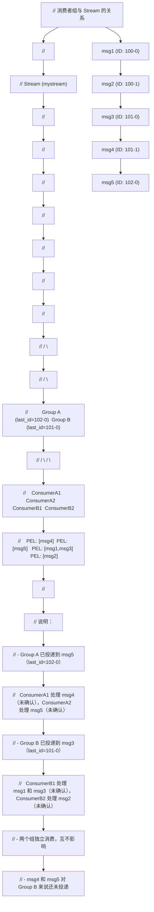

> 定位说明：本篇为进阶参考书（参考层），面向已完成本模块主线的读者；入门请先走学习路径前序阶段。定位标准见 docs/standards/reference-layer.md（仓库）。

## 前置知识

- [Redis Stream 核心篇](/redis/090-Stream)：本篇默认你已掌握 Stream 的消息 ID 规则、XADD/XREAD 基础命令与 Radix Tree 存储。没读过也可以直接开始，遇到底层细节时会标注回核心篇的对应章节。

## 学习目标

读完本篇，你将能够：

- 用 XGROUP/XREADGROUP/XACK 完成消费者组的创建、消费与确认，并解释 `>` 与 `0` 两种读取位置的区别；
- 用 XPENDING 定位滞留消息，用 XCLAIM/XAUTOCLAIM 把宕机消费者的消息找回并重新处理；
- 做一组多消费者负载均衡实验，解释为什么消费者数量超过一定值后吞吐量不再增长；
- 说出 at-least-once 语义下消息会在哪三种场景重复，并为消费者选一种幂等性方案；
- 按本篇参考实现写出带优雅退出、消息找回与监控埋点的生产级消费者。


## 第 1 章 消费者组解决什么问题

核心篇里所有读取命令（XREAD/XRANGE）有一个共同短板：Redis 不知道"谁读到了哪里"。两个消费者同时 XREAD 同一个 Stream，会各自读到全量消息；读出来的消息处理失败，Redis 也不会再给你一次机会。消费者组（Consumer Group）补的就是这两件事：组内负载均衡（一条消息只投递给一个消费者）与投递追踪（没确认的消息可以找回）。

### 1.1 消费者组模型

消费者组（Consumer Group）是 Stream 的核心特性之一，它允许一组消费者协作消费同一个 Stream，实现负载均衡与消息确认语义。

#### 1.1.1 核心概念

消费者组模型涉及以下核心概念：

- **消费者组（Consumer Group）**：一组协作消费同一 Stream 的消费者集合。每个组维护独立的消费进度（last_delivered_id）与待确认列表（PEL）。
- **消费者（Consumer）**：消费者组内的一个成员，负责实际处理消息。每个消费者有独立的 PEL。
- **消费进度（last_delivered_id）**：消费者组最后投递给消费者的消息 ID。新消息从该 ID 之后开始投递。
- **待确认列表（PEL, Pending Entry List）**：已投递但未确认的消息列表。每条消息在 PEL 中对应一个 streamNACK 条目。
- **NACK（Negative Acknowledgment）**：PEL 中的条目，记录消息的投递时间、投递次数、当前持有消费者。

#### 1.1.2 消费者组的语义

消费者组提供以下语义保障：

1. **每条消息只投递给组内一个消费者**：组内的消息按 ID 顺序投递，每条消息只被一个消费者处理（除非被重新认领）。

2. **独立消费进度**：每个消费者组维护独立的 last_delivered_id，不同组之间互不影响。多个组可同时消费同一 Stream，实现广播语义。

3. **至少一次投递（At-Least-Once）**：消息投递后进入 PEL，直到被 XACK 确认才从 PEL 移除。消费者宕机后，其 PEL 中的消息可被其他消费者重新认领。

4. **顺序保证**：组内的消息按 ID 顺序投递。但注意，如果消息被重新认领，可能导致乱序（消费者 A 认领了消息 5，但消费者 B 已在处理消息 6）。

#### 1.1.3 消费者组与 Stream 的关系



---

## 第 2 章 消费者组命令详解

本章是五个命令的参考手册：XGROUP 管组、XREADGROUP 管投递、XACK 管确认、XCLAIM/XAUTOCLAIM 管找回。每个命令都给出语法、参数、返回值、示例与内部执行流程；机制的系统性解读在第 3 章。

### 2.1 XGROUP：消费者组管理

#### 2.1.1 语法

XGROUP 是一个命令组，包含多个子命令：

```redis
XGROUP CREATE key groupname id|$ [MKSTREAM]
XGROUP SETID key groupname id|$
XGROUP DESTROY key groupname
XGROUP CREATECONSUMER key groupname consumername
XGROUP DELCONSUMER key groupname consumername
```

#### 2.1.2 参数说明

**XGROUP CREATE**

| 参数 | 说明 | 必填 |
|------|------|------|
| key | Stream 键名 | 是 |
| groupname | 消费者组名称 | 是 |
| id | 起始消费位置，`$` 表示从最新开始，`0` 表示从头开始 | 是 |
| MKSTREAM | 如果 Stream 不存在则自动创建 | 否 |

**XGROUP SETID**

| 参数 | 说明 | 必填 |
|------|------|------|
| key | Stream 键名 | 是 |
| groupname | 消费者组名称 | 是 |
| id | 新的消费位置 | 是 |

**XGROUP DESTROY**

| 参数 | 说明 | 必填 |
|------|------|------|
| key | Stream 键名 | 是 |
| groupname | 要删除的消费者组名称 | 是 |

**XGROUP CREATECONSUMER**

| 参数 | 说明 | 必填 |
|------|------|------|
| key | Stream 键名 | 是 |
| groupname | 消费者组名称 | 是 |
| consumername | 消费者名称 | 是 |

**XGROUP DELCONSUMER**

| 参数 | 说明 | 必填 |
|------|------|------|
| key | Stream 键名 | 是 |
| groupname | 消费者组名称 | 是 |
| consumername | 要删除的消费者名称 | 是 |

#### 2.1.3 返回值

- CREATE：成功返回 OK，失败返回错误
- SETID：成功返回 OK
- DESTROY：成功返回 1，组不存在返回 0
- CREATECONSUMER：成功返回 1，已存在返回 0
- DELCONSUMER：返回该消费者待确认消息数

#### 2.1.4 示例代码

```redis
// 示例 1：创建消费者组（从最新消息开始）
// 创建组 mygroup，消费位置从当前最新消息开始
XGROUP CREATE mystream mygroup $
// $ 表示组的 last_id 设为当前 Stream 的 last_id
// 组内的消费者只会收到创建组之后追加的新消息
// 如果 mystream 不存在，报错

// 示例 2：创建消费者组（从头开始）
// 创建组 mygroup2，消费位置从 Stream 头部开始
XGROUP CREATE mystream mygroup2 0
// 0 表示组的 last_id 设为 0-0
// 组内的消费者会收到 Stream 中的所有消息

// 示例 3：创建消费者组并自动创建 Stream
// 如果 mystream 不存在，自动创建空 Stream
XGROUP CREATE newstream mygroup $ MKSTREAM
// MKSTREAM 选项允许在 Stream 不存在时自动创建
// 创建后组从最新位置开始消费

// 示例 4：修改消费者组的消费位置
// 将 mygroup 的 last_id 重置为 0-0
XGROUP SETID mystream mygroup 0
// 重置后，组内消费者会从头开始重新消费
// 注意：此操作不影响已有的 PEL 条目

// 示例 5：删除消费者组
XGROUP DESTROY mystream mygroup
// 返回 1 表示删除成功，0 表示组不存在

// 示例 6：显式创建消费者
// 通常消费者在首次 XREADGROUP 时自动创建
// 也可显式创建
XGROUP CREATECONSUMER mystream mygroup consumer1
// 返回 1 表示创建成功，0 表示消费者已存在

// 示例 7：删除消费者
// 删除消费者 consumer1，返回其待确认消息数
XGROUP DELCONSUMER mystream mygroup consumer1
// 返回该消费者在 PEL 中的待确认消息数
// 删除后，这些消息仍留在组级 PEL 中，可被其他消费者认领
```

#### 2.1.5 内部执行流程

```text
// XGROUP CREATE 命令内部执行流程
//
// 1. 查找 Stream 对象
//    a. 如果 key 不存在：
//       - 若指定 MKSTREAM，创建空 Stream
//       - 否则返回错误
//    b. 如果 key 存在但类型非 Stream，返回类型错误
//
// 2. 检查消费者组是否已存在
//    a. 在 stream.cgroups Radix Tree 中查找 groupname
//    b. 如果已存在，返回 BUSYGROUP 错误
//
// 3. 创建消费者组
//    a. 分配 streamCG 结构
//    b. 初始化 last_id：
//       - 如果 id 为 $，设为 stream.last_id
//       - 如果 id 为 0，设为 0-0
//       - 如果为具体 ID，校验格式后设为该值
//    c. 初始化 pel（raxNew()）和 consumers（raxNew()）
//
// 4. 插入到 stream.cgroups Radix Tree
//    a. key 为 groupname，value 为 streamCG 指针
//
// 5. 返回 OK
```

### 2.2 XREADGROUP：消费者组读取

#### 2.2.1 语法

```redis
XREADGROUP GROUP groupname consumer [COUNT count] [BLOCK milliseconds]
           [NOACK] [CLAIM min-idle-time] STREAMS key [key ...] ID [ID ...]
```

#### 2.2.2 参数说明

| 参数 | 说明 | 必填 |
|------|------|------|
| GROUP | 关键字 | 是 |
| groupname | 消费者组名称 | 是 |
| consumer | 消费者名称 | 是 |
| COUNT count | 最多返回的消息数 | 否 |
| BLOCK milliseconds | 阻塞等待毫秒数 | 否 |
| NOACK | 读取后不加入 PEL（用于不需要确认的场景） | 否 |
| CLAIM min-idle-time | 同时认领空闲超过指定毫秒数的待确认消息（Redis 8.4+） | 否 |
| STREAMS | 关键字 | 是 |
| key | Stream 键名 | 是 |
| ID | 起始 ID，`>` 表示新消息，`0` 表示待确认消息 | 是 |

#### 2.2.3 ID 参数的特殊含义

XREADGROUP 中的 ID 参数有两个特殊值：

- `>`：读取从未投递给该消费者组的新消息（最常用）
- `0` 或其他具体 ID：读取该消费者已接收但未确认的待确认消息（历史 PEL 消息）

#### 2.2.4 返回值

返回数组，格式与 XREAD 相同。如果使用了 CLAIM 参数，每个认领的待确认消息会额外返回两个字段：上次投递至今的毫秒数、投递次数。

#### 2.2.5 示例代码

```redis
// 示例 1：读取新消息（最常用）
// 消费者 consumer1 从组 mygroup 读取 1 条新消息
XREADGROUP GROUP mygroup consumer1 COUNT 1 STREAMS mystream >
// > 表示读取从未投递给该组的新消息
// 读取后，消息会被加入 consumer1 的 PEL
// 必须在处理完成后调用 XACK 确认

// 示例 2：阻塞读取新消息
// 阻塞等待最多 5000 毫秒读取新消息
XREADGROUP GROUP mygroup consumer1 BLOCK 5000 COUNT 10 STREAMS mystream >
// 如果 5 秒内有新消息，立即返回
// 如果 5 秒后无新消息，返回 nil

// 示例 3：读取待确认消息
// 读取 consumer1 的待确认消息（PEL 中的消息）
XREADGROUP GROUP mygroup consumer1 COUNT 10 STREAMS mystream 0
// 0 表示读取 consumer1 已接收但未确认的消息
// 用于消费者重启后恢复未完成的处理

// 示例 4：不确认模式
// 读取消息但不加入 PEL（适用于不需要确认的场景）
XREADGROUP GROUP mygroup consumer1 NOACK COUNT 10 STREAMS mystream >
// NOACK 表示读取后不加入 PEL
// 消息读取后即视为"已处理"，不需要 XACK
// 适用于允许消息丢失的场景

// 示例 5：Redis 8.4+ CLAIM 参数
// 读取新消息的同时，认领空闲超过 60 秒的待确认消息
XREADGROUP GROUP mygroup consumer1 CLAIM 60000 COUNT 10 STREAMS mystream >
// CLAIM 60000 表示先认领 PEL 中空闲超过 60 秒的消息
// 然后再读取新消息
// 认领的消息会额外返回空闲时间与投递次数

// 示例 6：同时读取多个 Stream
// consumer1 同时从 stream1 和 stream2 读取新消息
XREADGROUP GROUP mygroup consumer1 COUNT 5 STREAMS stream1 stream2 > >
// 注意：在 Redis Cluster 中，多个 key 必须在同一槽位
```

#### 2.2.6 内部执行流程

```text
// XREADGROUP GROUP 命令内部执行流程
//
// 1. 参数解析
//    a. 解析 groupname、consumer、COUNT、BLOCK、NOACK、CLAIM
//    b. 解析 STREAMS 后的 key 列表与 ID 列表
//
// 2. 查找消费者组
//    a. 遍历每个 key，查找对应的 Stream
//    b. 在 stream.cgroups 中查找 groupname
//    c. 如果组不存在，返回 NOGROUP 错误
//
// 3. 获取或创建消费者
//    a. 在 streamCG.consumers 中查找 consumer
//    b. 如果不存在，自动创建新的 streamConsumer
//    c. 更新 consumer.seen_time 为当前时间
//
// 4. 处理 CLAIM 参数（Redis 8.4+）
//    a. 如果指定了 CLAIM min-idle-time：
//       - 遍历组级 PEL，查找空闲时间 >= min-idle-time 的条目
//       - 将这些条目的 consumer 字段改为当前 consumer
//       - 更新 delivery_time 和 delivery_count
//       - 将条目从原 consumer 的 PEL 移到当前 consumer 的 PEL
//    b. 收集认领的消息
//
// 5. 读取消息
//    a. 如果 ID 为 >：
//       - 从 streamCG.last_id 之后读取新消息
//       - 对每条消息创建 streamNACK 条目
//       - 将 NACK 插入组级 PEL 和 consumer 级 PEL
//       - 更新 streamCG.last_id
//       - 更新 consumer.active_time
//    b. 如果 ID 为 0 或具体 ID：
//       - 从 consumer 的 PEL 中读取待确认消息
//       - 不创建新的 NACK，不更新 last_id
//    c. 如果指定 NOACK，不创建 NACK 条目
//
// 6. 阻塞处理（如果指定 BLOCK 且无消息）
//    a. 将客户端加入阻塞等待队列
//    b. 等待 XADD 触发唤醒
//
// 7. 返回结果
//    a. 格式化消息列表
//    b. 如果有 CLAIM 认领的消息，附加空闲时间与投递次数
```

### 2.3 XACK：确认消息

#### 2.3.1 语法

```redis
XACK key group id [id ...]
```

#### 2.3.2 参数说明

| 参数 | 说明 | 必填 |
|------|------|------|
| key | Stream 键名 | 是 |
| group | 消费者组名称 | 是 |
| id | 要确认的消息 ID，可多个 | 是 |

#### 2.3.3 返回值

返回成功确认的消息数（整数）。如果消息 ID 不在 PEL 中（已确认或从未投递），不计入返回值。

#### 2.3.4 示例代码

```redis
// 示例 1：确认单条消息
// 确认消费者组 mygroup 中的消息 1718334600000-0
XACK mystream mygroup 1718334600000-0
// 返回 1 表示成功确认 1 条
// 返回 0 表示该消息不在 PEL 中（可能已确认或从未投递）

// 示例 2：确认多条消息
// 批量确认多条消息
XACK mystream mygroup 1718334600000-0 1718334600001-0 1718334600002-0
// 返回 3 表示成功确认 3 条
// 批量确认比逐条确认效率更高

// 示例 3：确认不存在的消息
// 确认一个不在 PEL 中的消息
XACK mystream mygroup 9999999999999-0
// 返回 0，表示没有消息被确认
```

#### 2.3.5 内部执行流程

```text
// XACK 命令内部执行流程
//
// 1. 查找 Stream 和消费者组
//    a. 查找 key 对应的 Stream
//    b. 在 stream.cgroups 中查找 group
//    c. 如果组不存在，返回 NOGROUP 错误
//
// 2. 遍历要确认的消息 ID
//    a. 对每个 ID，在组级 PEL（streamCG.pel）中查找
//    b. 如果找到：
//       - 获取对应的 streamNACK
//       - 从组级 PEL 中删除该条目
//       - 从 NACK.consumer 的消费者级 PEL 中删除
//       - 释放 streamNACK 内存
//       - 确认计数器加 1
//    c. 如果未找到，跳过
//
// 3. 返回确认计数
//    a. 时间复杂度 O(1) per ID
```

### 2.4 XCLAIM：认领消息

#### 2.4.1 语法

```redis
XCLAIM key group consumer min-idle-time id [id ...]
        [IDLE ms] [TIME ms-unix-time] [RETRYCOUNT count] [FORCE] [JUSTID]
```

#### 2.4.2 参数说明

| 参数 | 说明 | 必填 |
|------|------|------|
| key | Stream 键名 | 是 |
| group | 消费者组名称 | 是 |
| consumer | 目标消费者名称 | 是 |
| min-idle-time | 最小空闲时间（毫秒），只认领空闲超过此时间的消息 | 是 |
| id | 要认领的消息 ID | 是 |
| IDLE ms | 设置消息的空闲时间为指定值 | 否 |
| TIME ms-unix-time | 设置投递时间为指定 Unix 时间 | 否 |
| RETRYCOUNT count | 设置投递次数 | 否 |
| FORCE | 强制认领，忽略 min-idle-time 检查 | 否 |
| JUSTID | 只返回消息 ID，不返回消息内容 | 否 |

#### 2.4.3 返回值

返回成功认领的消息列表。如果使用 JUSTID，只返回 ID。

#### 2.4.4 示例代码

```redis
// 示例 1：认领空闲超过 60 秒的消息
// consumer2 认领消息 1718334600000-0，前提是该消息空闲超过 60000 毫秒
XCLAIM mystream mygroup consumer2 60000 1718334600000-0
// 60000 是 min-idle-time（60 秒）
// 如果消息的空闲时间 < 60 秒，不会被认领
// 如果消息的空闲时间 >= 60 秒，被 consumer2 认领

// 示例 2：认领多条消息
XCLAIM mystream mygroup consumer2 60000 1718334600000-0 1718334600001-0 1718334600002-0
// 批量认领多条消息

// 示例 3：强制认领
// 忽略 min-idle-time，强制认领消息
XCLAIM mystream mygroup consumer2 0 1718334600000-0 FORCE
// FORCE 选项忽略空闲时间检查
// 即使消息刚被投递，也会被认领

// 示例 4：只返回 ID
XCLAIM mystream mygroup consumer2 60000 1718334600000-0 JUSTID
// JUSTID 只返回认领的消息 ID，不返回消息内容
// 减少网络传输量

// 示例 5：设置投递次数
XCLAIM mystream mygroup consumer2 60000 1718334600000-0 RETRYCOUNT 3
// RETRYCOUNT 设置投递次数为 3
// 用于手动重置投递计数器
```

#### 2.4.5 内部执行流程

```text
// XCLAIM 命令内部执行流程
//
// 1. 查找 Stream 和消费者组
//
// 2. 获取或创建目标 consumer
//
// 3. 遍历要认领的消息 ID
//    a. 在组级 PEL 中查找消息
//    b. 如果未找到且未指定 FORCE，跳过
//    c. 如果找到：
//       - 检查空闲时间（当前时间 - delivery_time >= min-idle-time）
//       - 如果空闲时间不足且未指定 FORCE，跳过
//       - 从原 consumer 的 PEL 中移除
//       - 更新 streamNACK.consumer 为新 consumer
//       - 更新 delivery_time 为当前时间（或 IDLE/TIME 指定的值）
//       - delivery_count 加 1（或设为 RETRYCOUNT 指定的值）
//       - 插入新 consumer 的 PEL
//       - 更新 consumer.seen_time 和 active_time
//
// 4. 返回认领的消息列表
```

### 2.5 XAUTOCLAIM：自动认领

#### 2.5.1 语法

```redis
XAUTOCLAIM key group consumer min-idle-time start [COUNT count] [JUSTID]
```

#### 2.5.2 参数说明

| 参数 | 说明 | 必填 |
|------|------|------|
| key | Stream 键名 | 是 |
| group | 消费者组名称 | 是 |
| consumer | 目标消费者名称 | 是 |
| min-idle-time | 最小空闲时间（毫秒） | 是 |
| start | 扫描起始 ID，通常为 `-` | 是 |
| COUNT count | 每次最多认领的消息数，默认 100 | 否 |
| JUSTID | 只返回消息 ID | 否 |

#### 2.5.3 返回值

返回数组，包含三部分：
1. 下次扫描的起始 ID（用于继续扫描）
2. 认领的消息列表
3. 已从 PEL 中删除的消息 ID 列表（消息已被 XDEL 删除的情况）

#### 2.5.4 示例代码

```redis
// 示例 1：自动认领空闲消息
// consumer2 自动认领组 mygroup 中空闲超过 60 秒的消息
XAUTOCLAIM mystream mygroup consumer2 60000 - COUNT 10
// 60000 是 min-idle-time（60 秒）
// - 表示从 PEL 的起始位置开始扫描
// COUNT 10 限制每次最多认领 10 条
// 返回：[next-start-id, [claimed-messages], [deleted-ids]]

// 示例 2：继续扫描
// 使用上一次返回的 next-start-id 继续扫描
XAUTOCLAIM mystream mygroup consumer2 60000 1718334600005-0 COUNT 10
// 从 1718334600005-0 继续扫描 PEL
// 实现 PEL 的分页扫描

// 示例 3：只返回 ID
XAUTOCLAIM mystream mygroup consumer2 60000 - COUNT 10 JUSTID
// JUSTID 只返回认领的消息 ID
```

#### 2.5.5 内部执行流程

```text
// XAUTOCLAIM 命令内部执行流程
//
// 1. 查找 Stream 和消费者组
//
// 2. 获取或创建目标 consumer
//
// 3. 遍历组级 PEL
//    a. 从 start ID 开始遍历 PEL（Radix Tree 有序）
//    b. 对每个 NACK 条目：
//       - 检查空闲时间（当前时间 - delivery_time >= min-idle-time）
//       - 如果满足条件：
//         * 从原 consumer 的 PEL 移除
//         * 更新 NACK.consumer 为新 consumer
//         * 更新 delivery_time 和 delivery_count
//         * 插入新 consumer 的 PEL
//         * 加入认领列表
//       - 如果不满足，跳过
//    c. 达到 COUNT 限制后停止
//    d. 记录下次扫描的起始 ID（当前遍历位置的下一个 ID）
//
// 4. 检查已删除的消息
//    a. 对认领的消息，检查其是否仍在 Stream 中
//    b. 如果消息已被 XDEL 删除：
//       - 从 PEL 中移除
//       - 加入已删除列表
//
// 5. 返回 [next-start-id, claimed-messages, deleted-ids]
```

---

## 第 3 章 PEL：待确认列表与消息找回

PEL（Pending Entry List，待确认列表）是消费者组可靠性的核心：投递出去但没确认的消息都挂在 PEL 上，消费端宕机、处理失败、需要重投，全部围绕它展开。本章从结构讲到实操：先看 PEL 长什么样，再学 XPENDING 观测与 XCLAIM/XAUTOCLAIM 找回，最后处理 PEL 无限增长与毒消息这个经典故障。消费者宕机的完整处置手册（检测、转移、自动恢复脚本）在[运维监控篇](/redis/094-StreamOpsAndMonitoring)第 8 章。

### 3.1 PEL（Pending Entry List）结构

PEL 是消费者组实现消息可靠性的核心数据结构。PEL 存储已投递但未确认的消息，确保消息不会因消费者宕机而丢失。

#### 3.1.1 PEL 的两级结构

PEL 在 Redis 内部采用两级结构存储：

1. **组级 PEL（streamCG.pel）**：消费者组的全局 PEL，存储该组所有已投递但未确认的消息。key 为消息 ID，value 为 streamNACK。
2. **消费者级 PEL（streamConsumer.pel）**：每个消费者独立的 PEL，存储该消费者持有的待确认消息。key 为消息 ID，value 为 streamNACK。

两级 PEL 的设计目的：

- 组级 PEL 用于快速扫描所有待确认消息（如 XAUTOCLAIM）
- 消费者级 PEL 用于快速查询特定消费者的待确认消息（如 XREADGROUP ID 0）

两级 PEL 中的 streamNACK 是同一个对象（指针相同），不会重复存储。

streamNACK 结构的字段级定义（delivery_time / delivery_count / consumer 指针）在[核心篇](/redis/090-Stream)第 2 章的 streamCG / streamConsumer / streamNACK 结构体中已给出，此处不再重复；组级 PEL 与消费者级 PEL 指向同一份 NACK 对象，不会重复存储。

streamNACK 记录了消息的投递状态：

- `delivery_time`：用于计算空闲时间（当前时间 - delivery_time），判断消息是否需要重新认领
- `delivery_count`：用于检测"毒丸消息"（poison pill），即反复投递但始终无法处理的消息
- `consumer`：指向当前持有该消息的消费者，用于在 XACK 或 XCLAIM 时定位消费者级 PEL

#### 3.1.2 PEL 的生命周期

```text
// PEL 条目的生命周期
//
// 1. 创建（XREADGROUP >）
//    当消费者通过 XREADGROUP > 读取新消息时：
//    a. 创建 streamNACK 条目
//    b. delivery_time = 当前时间
//    c. delivery_count = 1
//    d. consumer = 读取的消费者
//    e. 插入组级 PEL 和消费者级 PEL
//
// 2. 更新（XCLAIM/XAUTOCLAIM）
//    当消息被重新认领时：
//    a. delivery_time = 当前时间
//    b. delivery_count += 1
//    c. consumer = 新的消费者
//    d. 从原消费者 PEL 移除，插入新消费者 PEL
//
// 3. 删除（XACK）
//    当消费者确认消息时：
//    a. 从组级 PEL 移除
//    b. 从消费者级 PEL 移除
//    c. 释放 streamNACK 内存
//
// 4. 删除（XDEL + 清理）
//    当消息被 XDEL 删除时：
//    a. PEL 中的条目不会立即移除
//    b. 在 XAUTOCLAIM 扫描时检测到消息已删除，才从 PEL 移除
```

### 3.2 XPENDING：查看待确认列表

`XPENDING` 用于查看 PEL（待确认消息列表）的详细信息：

```bash
# 查看 PEL 概览
127.0.0.1:6379> XPENDING orders inventory

# 返回结果：
# 1) (integer) 42          - PEL 总数
# 2) "1718334000000-0"     - PEL 中最小 ID
# 3) "1718334600000-15420" - PEL 中最大 ID
# 4) 1) 1) "worker-1"      - 消费者名
#    2) (integer) 15       - 该消费者的 PEL 数量
#    2) 1) "worker-2"
#    2) (integer) 27

# 查看详细 PEL 条目
127.0.0.1:6379> XPENDING orders inventory - + 10

# 返回结果：
# 1) 1) "1718334000000-0"       - 消息 ID
#    2) "worker-1"              - 消费者名
#    3) (integer) 1200000       - 空闲时间（毫秒）
#    4) (integer) 1             - 投递次数
# 2) ...
```

### 3.3 消息确认机制

消息确认（Acknowledgment）是消费者组实现至少一次投递语义的关键机制。

#### 3.3.1 确认流程

```text
// 消息确认的完整流程
//
// 1. 消费者通过 XREADGROUP > 获取消息
//    消息进入 PEL，delivery_count = 1
//
// 2. 消费者处理消息
//    a. 处理成功：调用 XACK 确认，消息从 PEL 移除
//    b. 处理失败：不调用 XACK，消息留在 PEL
//    c. 消费者宕机：不调用 XACK，消息留在 PEL
//
// 3. 消息留在 PEL 的情况
//    a. 其他消费者通过 XCLAIM 或 XAUTOCLAIM 认领该消息
//    b. 认领后 delivery_count 递增
//    c. 新消费者重新处理该消息
//
// 4. 毒丸消息处理
//    a. 如果 delivery_count 超过阈值（如 10 次），判定为毒丸消息
//    b. 将毒丸消息转移到死信队列（需应用层实现）
//    c. 调用 XACK 确认（从 PEL 移除），避免无限重试
```

#### 3.3.2 确认的注意事项

- **必须确认**：消费者处理完成后必须调用 XACK，否则消息永久留在 PEL，占用内存
- **批量确认**：多条消息可一次性 XACK，减少网络往返
- **幂等性**：XACK 已确认的消息返回 0，不会报错
- **不确认已删除消息**：如果消息被 XDEL 删除，XACK 仍可从 PEL 移除（如果 PEL 中存在）

### 3.4 消息重分配

当消费者宕机或处理缓慢时，其 PEL 中的消息需要被重新分配给其他消费者。Stream 提供两种重分配机制：

#### 3.4.1 XCLAIM：手动认领

XCLAIM 用于将指定的消息从原消费者转移给新消费者。需要调用者明确知道要认领哪些消息 ID。

典型使用场景：

```text
// 手动认领流程
//
// 1. 通过 XPENDING 查看待确认消息
//    XPENDING mystream mygroup - + 10
//    返回：[[id, consumer, idle_time, delivery_count], ...]
//
// 2. 找到空闲时间过长的消息
//    例如：[1718334600000-0, consumer1, 120000, 3]
//    表示消息 1718334600000-0 由 consumer1 持有，空闲 120 秒，已投递 3 次
//
// 3. 用 XCLAIM 认领
//    XCLAIM mystream mygroup consumer2 60000 1718334600000-0
//    将消息从 consumer1 转移给 consumer2
//
// 4. consumer2 处理并确认
//    处理完成后 XACK mystream mygroup 1718334600000-0
```

#### 3.4.2 XAUTOCLAIM：自动认领

XAUTOCLAIM 用于自动扫描 PEL 并认领空闲超过指定时间的消息。不需要调用者知道具体的消息 ID。

典型使用场景：

```text
// 自动认领流程
//
// 1. consumer2 定期执行 XAUTOCLAIM
//    XAUTOCLAIM mystream mygroup consumer2 60000 - COUNT 10
//    扫描 PEL，认领空闲超过 60 秒的消息，最多 10 条
//
// 2. 处理认领的消息
//    返回的消息列表即为认领的消息
//
// 3. 继续扫描
//    使用返回的 next-start-id 继续扫描
//    XAUTOCLAIM mystream mygroup consumer2 60000 <next-start-id> COUNT 10
//
// 4. 循环直到 next-start-id 为 0-0（表示扫描完成）
```

#### 3.4.3 Redis 8.4 的 CLAIM 参数

Redis 8.4 引入了 XREADGROUP CLAIM 参数，将新消息读取与空闲消息认领合并为单次命令调用，显著简化了消费者逻辑。

```text
// Redis 8.4 CLAIM 参数的使用
//
// 传统方式（Redis 8.4 之前）：
// loop:
//   1. XPENDING 查找空闲消息
//   2. XCLAIM 认领空闲消息
//   3. XREADGROUP > 读取新消息
//   需要三次命令调用
//
// Redis 8.4 方式：
// loop:
//   XREADGROUP GROUP group consumer CLAIM 60000 COUNT 10 STREAMS mystream >
//   单次调用同时完成认领与读取
//
// 性能提升：
// - 减少网络往返（3 次 -> 1 次）
// - 减少命令解析开销
// - 官方基准测试显示比 XAUTOCLAIM 快达 22.5 倍
```

### 3.5 PEL 无限增长与毒消息

#### 3.5.1 现象

XPENDING 显示 PEL 数量持续增长，永不下降，最终耗尽内存。

#### 3.5.2 常见原因

1. **毒消息（Poison Message）**：某条消息始终处理失败，反复重投仍失败
2. **消费者处理慢**：处理速度低于投递速度
3. **忘记 XACK**：处理成功但未调用 XACK
4. **消费者频繁崩溃**：每次重启都重新投递

#### 3.5.3 解决方案

```python
# 毒消息检测与死信转移
def detect_poison_messages(client, stream_key, group_name,
                           max_delivery_count=5):
    """检测毒消息并转移到死信 Stream
    
    输入参数：
    - client: Redis 客户端
    - stream_key: Stream 键名
    - group_name: 消费者组名
    - max_delivery_count: 最大投递次数阈值
    
    核心流程：
    1. 遍历 PEL 中的消息
    2. 检查 delivery_count 字段
    3. 超过阈值的消息转移到死信 Stream
    4. 从原 PEL 中删除（XACK）
    """
    dead_letter_stream = f'{stream_key}:deadletter'
    
    # 获取 PEL 中的消息详情
    pending_details = client.xpending_range(
        stream_key, group_name, '-', '+', count=1000
    )
    
    for pending in pending_details:
        msg_id = pending['message_id']
        delivery_count = pending['times_delivered']
        
        if delivery_count >= max_delivery_count:
            # 读取消息内容
            messages = client.xrange(stream_key, msg_id, msg_id, count=1)
            if messages:
                _, fields = messages[0]
                # 转移到死信 Stream
                fields['_original_id'] = msg_id
                fields['_delivery_count'] = str(delivery_count)
                fields['_dead_letter_reason'] = 'max_delivery_exceeded'
                client.xadd(dead_letter_stream, fields)
                # 从原 PEL 中确认（删除）
                client.xack(stream_key, group_name, msg_id)
                print(f"毒消息 {msg_id} 转移到死信队列")
```

### 3.6 常见问题 FAQ

#### Q1: XREADGROUP 使用 `>` 与 `0` 的区别？

- `>`：只读取从未投递给任何消费者的新消息（推荐用于正常消费）
- `0`：读取该消费者 PEL 中的待确认消息（用于恢复未完成的消息）

#### Q4: 消费者组删除后 PEL 中的消息如何处理？

- XGROUP DESTROY 会删除消费者组及其所有消费者的 PEL
- PEL 中的消息不会从 Stream 中删除，仍可通过 XRANGE/XREAD 读取
- 但这些消息不再被任何消费者组追踪

其余疑问（MAXLEN/MINID 怎么选、有序性保证范围、与 Pub/Sub 并存）分散在主题所在篇章：修剪与有序性见[运维监控篇](/redis/094-StreamOpsAndMonitoring)第 8 章，Pub/Sub 对比见[核心篇](/redis/090-Stream)第 1 章。消费者宕机的完整处置手册（含自动恢复脚本）见[运维监控篇](/redis/094-StreamOpsAndMonitoring)第 8 章。


---

## 第 4 章 多消费者负载均衡

消费者组最直接的收益是横向扩容：同一组里加消费者，消息自动分摊。先用一组实验建立直觉，再看创建删除的完整命令与扩容的吞吐上限。

### 4.1 实验：两个消费者如何分摊消息

准备一个空环境（或换一个不存在的 key 名），依次执行：

```redis
# 1. 写入 6 条消息
XADD balances * uid u1 amount 10
XADD balances * uid u2 amount 20
XADD balances * uid u3 amount 30
XADD balances * uid u4 amount 40
XADD balances * uid u5 amount 50
XADD balances * uid u6 amount 60

# 2. 创建消费者组，从 0 开始（用 $ 会跳过这 6 条已有消息）
XGROUP CREATE balances pay 0

# 3. 消费者 A 读取 2 条
XREADGROUP GROUP pay consumerA COUNT 2 STREAMS balances >
```

第 3 步的预期输出（ID 的毫秒段随环境不同，这里用示例值）：

```text
1) 1) "balances"
   2) 1) 1) "1718334600000-0"
         2) 1) "uid"
            2) "u1"
            3) "amount"
            4) "10"
      2) 1) "1718334600000-1"
         2) 1) "uid"
            2) "u2"
            3) "amount"
            4) "20"
```

继续执行：

```redis
# 4. 消费者 B 读取 2 条：拿到第 3、4 条，与 A 不重复
XREADGROUP GROUP pay consumerB COUNT 2 STREAMS balances >

# 5. 消费者 A 再读 2 条：拿到最后 2 条
XREADGROUP GROUP pay consumerA COUNT 2 STREAMS balances >

# 6. 验证分配结果
XPENDING balances pay
```

第 6 步的预期输出：

```text
1) (integer) 6
2) "1718334600000-0"
3) "1718334600000-5"
4) 1) 1) "consumerA"
      2) (integer) 4
   2) 1) "consumerB"
      2) (integer) 2
```

两个结论：其一，组内投递是"谁先调用谁先得"，Redis 不会主动平均分配，先调用 XREADGROUP 的消费者拿到先产出的消息；其二，消费者名不需要预先注册，第一次 XREADGROUP 时自动创建。想把滞留消息主动转移给指定消费者，用的是第 2 章的 XCLAIM/XAUTOCLAIM 命令（流程见第 3 章），而不是等 Redis 调度。

### 4.2 消费者组创建与删除

#### 4.2.1 创建消费者组

创建消费者组时，起始 ID 的选择决定了消费者组从哪里开始消费：

- `$`：从当前最新消息开始，只消费创建组之后的新消息
- `0`：从 Stream 头部开始，消费所有历史消息
- 具体 ID：从指定 ID 开始消费

```redis
// 场景 1：新建消费者组，只处理新消息
XGROUP CREATE events new_group $
// 适用于新加入的消费者组，不需要处理历史消息

// 场景 2：新建消费者组，处理所有消息
XGROUP CREATE events archive_group 0
// 适用于数据归档、回溯分析等场景

// 场景 3：从指定时间点开始消费
XGROUP CREATE events recovery_group 1718334000000-0
// 适用于从故障点恢复的场景
```

#### 4.2.2 删除消费者组

```redis
// 删除消费者组
XGROUP DESTROY events old_group
// 删除后，该组的 PEL 也会被清除
// 注意：删除组不影响 Stream 中的消息

// 删除单个消费者
XGROUP DELCONSUMER events active_group slow_consumer
// 返回该消费者的待确认消息数
// 这些消息仍在组级 PEL 中，可被其他消费者认领
```

### 4.3 消费者数量与吞吐量的上限

#### 4.3.1 消费者数量与吞吐量的关系

| 消费者数 | 消费吞吐量 | 说明 |
|---------|-----------|------|
| 1 | 8,000 msg/s | 单消费者瓶颈 |
| 2 | 15,000 msg/s | 接近线性增长 |
| 4 | 28,000 msg/s | 接近线性增长 |
| 8 | 45,000 msg/s | 增长放缓（Redis 单线程瓶颈） |
| 16 | 52,000 msg/s | 接近上限 |
| 32 | 55,000 msg/s | 几乎无提升 |

消费者数量增加时，吞吐量增长放缓的原因：Redis 是单线程模型，所有消费者的 XREADGROUP/XACK 请求都在主线程串行处理。当消费者数超过 CPU 核心数后，瓶颈在 Redis 端而非消费者端。


---

## 第 5 章 at-least-once 与精确一次

先回答一个高频问题：Redis Stream 能不能做到"精确一次"（exactly-once）？单靠 Stream 不能。本章 5.1 节会看到，消息在三种场景下会重复投递（处理成功但确认前宕机、处理超时被认领、确认命令因网络问题未到达），这是 PEL 机制的固有代价。业界共识是：投递语义负责 at-least-once，精确一次由消费端的幂等性或业务侧事务补齐（数据库唯一约束、SETNX 去重标记等）。本章的超时策略、幂等性实现与消费者最佳实践都围绕这条主线展开。另一个前提问题——Redis 自己重启时消息还在不在（AOF/RDB/fsync 取舍）——属于服务端配置，见[运维监控篇](/redis/094-StreamOpsAndMonitoring)第 7 章。

### 5.1 at-least-once 语义

Redis Stream 通过 PEL 机制实现了至少一次投递（at-least-once delivery）语义。这意味着：

- 每条消息至少被投递给消费者一次
- 在故障情况下，消息可能被投递多次
- 消费者必须实现幂等性以处理重复消息

#### 5.1.1 at-least-once 的保障机制

```text
// at-least-once 语义的保障流程
//
// 1. 消息投递
//    XREADGROUP > 将消息投递给消费者，同时加入 PEL
//    -> 消息已持久化在 Stream 中
//    -> 投递状态持久化在 PEL 中
//
// 2. 消费者处理
//    消费者处理消息
//    -> 成功：XACK 确认，消息从 PEL 移除
//    -> 失败：消息留在 PEL，等待重新投递
//    -> 宕机：消息留在 PEL，由其他消费者认领
//
// 3. 故障恢复
//    其他消费者通过 XCLAIM/XAUTOCLAIM 认领 PEL 中的消息
//    -> 消息重新投递给新消费者
//    -> delivery_count 递增
//    -> 新消费者重新处理
//
// 4. 重复投递的场景
//    a. 消费者处理成功但 XACK 前宕机
//       -> 消息被重新认领并重新处理（重复）
//    b. 消费者处理超时被认领
//       -> 原消费者可能仍在处理，新消费者也开始处理（重复）
//    c. 网络分区导致 XACK 未到达 Redis
//       -> 消息被重新认领（重复）
```

#### 5.1.2 幂等性设计

由于 at-least-once 语义可能导致消息重复，消费者必须实现幂等性。常见的幂等性策略：

1. **唯一标识去重**：消息携带唯一 ID（业务 ID，非 Stream ID），消费者维护已处理 ID 集合，重复消息跳过。

2. **状态检查**：消费者处理前检查当前状态，避免重复操作。例如转账前检查账户余额是否已变动。

3. **数据库唯一约束**：利用数据库的唯一索引防止重复插入。

4. **Redis 去重**：使用 Redis 的 SETNX 或 SET NX 实现快速去重。

```python
# Python 幂等性消费者示例
import redis

class IdempotentConsumer:
    def __init__(self, redis_client, stream_key, group, consumer):
        self.redis = redis_client
        self.stream_key = stream_key
        self.group = group
        self.consumer = consumer
        self.dedup_key_prefix = "dedup:"

    def process_message(self, msg_id, fields):
        """处理消息，保证幂等性"""
        # 获取业务唯一 ID
        biz_id = fields.get(b"biz_id")
        if not biz_id:
            return False

        dedup_key = self.dedup_key_prefix + biz_id.decode()

        # 使用 SETNX 实现原子去重
        # 如果已存在，说明消息已处理过，直接确认
        if not self.redis.setnx(dedup_key, msg_id.decode()):
            # 消息已处理过，幂等确认
            self.redis.xack(self.stream_key, self.group, msg_id)
            return True

        # 设置过期时间，避免去重集合无限增长
        self.redis.expire(dedup_key, 86400)  # 24 小时过期

        try:
            # 实际处理消息
            self.do_business_logic(fields)
            # 处理成功，确认消息
            self.redis.xack(self.stream_key, self.group, msg_id)
            return True
        except Exception as e:
            # 处理失败，删除去重标记，允许重试
            self.redis.delete(dedup_key)
            raise e
```

### 5.2 消息确认与超时

#### 5.2.1 空闲时间与超时检测

PEL 中的每条消息都记录了 `delivery_time`（上次投递时间）。通过计算当前时间与 delivery_time 的差值，可以得到消息的空闲时间（idle time）。

空闲时间的用途：

1. **检测消费者故障**：如果消息空闲时间过长（如超过 60 秒），可能消费者已宕机
2. **触发消息重分配**：通过 XCLAIM/XAUTOCLAIM 认领空闲超过阈值的消息
3. **监控积压**：通过 XPENDING 查看空闲时间分布，识别积压情况

#### 5.2.2 超时处理策略

```text
// 超时处理策略建议
//
// 1. 确定超时阈值
//    超时阈值应大于消息的正常处理时间
//    例如：正常处理 5 秒，超时阈值设为 60 秒（12 倍冗余）
//
// 2. 定期扫描 PEL
//    每个消费者定期执行 XAUTOCLAIM，认领空闲消息
//    扫描间隔建议为超时阈值的 1/3 到 1/2
//
// 3. 毒丸消息检测
//    如果 delivery_count 超过阈值（如 10 次），判定为毒丸消息
//    转移到死信队列，避免无限重试
//
// 4. 渐进式退避
//    重复投递时，增加处理间隔，避免雪崩
//    例如：第 1 次重试立即，第 2 次延迟 1 秒，第 3 次延迟 5 秒...
```

### 5.3 宕机恢复

#### 5.3.1 消费者宕机恢复

```text
// 消费者宕机恢复流程
//
// 1. 消费者宕机
//    Consumer1 宕机，其 PEL 中的消息留在 Redis 中
//
// 2. 其他消费者检测
//    Consumer2 定期执行 XAUTOCLAIM：
//    XAUTOCLAIM mystream mygroup consumer2 60000 - COUNT 10
//    认领 Consumer1 的空闲消息
//
// 3. 消息重新处理
//    Consumer2 收到认领的消息，重新处理
//    处理完成后 XACK 确认
//
// 4. Consumer1 恢复
//    Consumer1 恢复后，其 PEL 已被清空（消息被认领）
//    Consumer1 继续通过 XREADGROUP > 读取新消息
```

#### 5.3.2 Redis 宕机恢复

```text
// Redis 宕机恢复流程
//
// 1. Redis 宕机
//    Redis 进程崩溃或服务器宕机
//
// 2. 持久化恢复
//    a. 如果配置了 AOF：
//       - 从 AOF 文件恢复，Stream 数据与 PEL 状态完整保留
//       - 取决于 appendfsync 配置：
//         * always: 最多丢失 1 条命令
//         * everysec: 最多丢失 1 秒数据
//         * no: 最多丢失上次 OS fsync 以来的数据
//    b. 如果仅配置了 RDB：
//       - 从 RDB 快照恢复，可能丢失最后一次快照后的数据
//       - Stream 数据与 PEL 状态恢复到最后一次快照
//    c. 如果同时配置了 AOF 和 RDB：
//       - 优先使用 AOF 恢复（数据更完整）
//
// 3. 消费者重连
//    消费者检测到 Redis 重连后：
//    a. 重新执行 XREADGROUP > 继续读取新消息
//    b. 检查自身 PEL，处理未确认的消息
//       XREADGROUP GROUP mygroup consumer1 COUNT 10 STREAMS mystream 0
//
// 4. 数据一致性
//    a. Stream 中的消息：根据持久化配置，可能丢失部分最新消息
//    b. PEL 中的待确认消息：与 Stream 消息同步恢复
//    c. 消费进度（last_id）：与持久化状态一致
```

### 5.4 消费者最佳实践

#### 5.4.1 处理顺序

```python
# 正确：处理成功后再 XACK
def consume():
    messages = client.xreadgroup(group, consumer, {stream: '>'}, count=10)
    for msg_id, fields in messages[0][1]:
        try:
            process(fields)  # 先处理
            client.xack(stream, group, msg_id)  # 成功后确认
        except Exception:
            pass  # 失败不确认，等待重投

# 错误：先 XACK 后处理
def consume_wrong():
    messages = client.xreadgroup(group, consumer, {stream: '>'}, count=10)
    for msg_id, fields in messages[0][1]:
        client.xack(stream, group, msg_id)  # 先确认
        process(fields)  # 处理失败则消息丢失
```

#### 5.4.2 幂等性保障

由于 Stream 提供 at-least-once 语义，消费者必须实现幂等性：

```python
# 基于消息 ID 的幂等性
processed_ids = set()

def idempotent_process(msg_id, fields):
    """幂等消息处理
    
    核心流程：
    1. 检查消息 ID 是否已处理
    2. 未处理则执行业务逻辑
    3. 记录已处理的消息 ID
    """
    if msg_id in processed_ids:
        return  # 已处理，跳过
    # 执行业务逻辑
    do_business(fields)
    processed_ids.add(msg_id)
```

#### 5.4.3 优雅退出

```python
import signal

running = True

def graceful_shutdown(signum, frame):
    global running
    running = False

signal.signal(signal.SIGTERM, graceful_shutdown)
signal.signal(signal.SIGINT, graceful_shutdown)

while running:
    messages = client.xreadgroup(group, consumer, {stream: '>'}, 
                                 count=10, block=1000)
    # 处理消息...
```

---

## 第 6 章 生产级消费者实现

把前几章的机制组合成一个可以直接抄进项目的消费者：自动建组、阻塞读取、失败不确认、定期找回、优雅退出、监控埋点。Python 版给出完整实现，其他语言给差异要点。

### 6.1 客户端设计原则

生产级 Stream 客户端需要解决以下核心问题：

1. **连接管理**：连接池、自动重连、心跳保活
2. **消费循环**：阻塞读取、超时处理、错误恢复
3. **消息处理**：幂等性保障、超时控制、异常捕获
4. **消费者协调**：消费者注册、宕机检测、消息转移
5. **监控埋点**：消费延迟、积压数量、处理成功率

### 6.2 Python 生产级消费者实现

以下是基于 redis-py 的生产级消费者实现，包含完整的错误处理、重连机制与监控埋点：

```python
import redis
import time
import logging
import signal
import threading
from typing import Callable, Optional

class StreamConsumer:
    """Redis Stream 生产级消费者封装
    
    设计目标：
    - 自动重连：网络异常时指数退避重连
    - 消息重投：处理失败的消息不确认，等待 XCLAIM 重新分配
    - 优雅退出：收到 SIGTERM/SIGINT 后完成当前消息处理再退出
    - 监控埋点：记录消费延迟、处理耗时、错误率
    
    输入参数：
    - redis_url: Redis 连接地址
    - stream_key: Stream 键名
    - group_name: 消费者组名称
    - consumer_name: 当前消费者名称
    - handler: 消息处理回调函数
    - block_ms: 阻塞读取超时（毫秒）
    - count: 每次读取的最大消息数
    """
    
    def __init__(
        self,
        redis_url: str,
        stream_key: str,
        group_name: str,
        consumer_name: str,
        handler: Callable,
        block_ms: int = 5000,
        count: int = 10
    ):
        self.redis_url = redis_url
        self.stream_key = stream_key
        self.group_name = group_name
        self.consumer_name = consumer_name
        self.handler = handler
        self.block_ms = block_ms
        self.count = count
        self.running = False
        self.logger = logging.getLogger(f"consumer.{consumer_name}")
        # 监控指标
        self.metrics = {
            'processed': 0,
            'acked': 0,
            'errors': 0,
            'reconnects': 0
        }
    
    def _create_client(self) -> redis.Redis:
        """创建 Redis 客户端连接
        
        返回值：redis.Redis 实例
        核心流程：
        1. 使用 ConnectionPool 实现连接复用
        2. 设置 socket_timeout 防止请求永久阻塞
        3. 设置 health_check_interval 自动检测连接健康
        """
        return redis.Redis.from_url(
            self.redis_url,
            socket_timeout=5.0,
            socket_connect_timeout=5.0,
            health_check_interval=30,
            decode_responses=True
        )
    
    def _ensure_group(self, client: redis.Redis):
        """确保消费者组存在
        
        核心流程：
        1. 尝试创建消费者组，起始 ID 为 0（消费历史消息）
        2. 若组已存在（BUSYGROUP 错误），忽略该错误
        """
        try:
            client.xgroup_create(
                self.stream_key,
                self.group_name,
                id='0',
                mkstream=True
            )
            self.logger.info(f"消费者组 {self.group_name} 创建成功")
        except redis.exceptions.ResponseError as e:
            if 'BUSYGROUP' in str(e):
                self.logger.info(f"消费者组 {self.group_name} 已存在")
            else:
                raise
    
    def _process_message(self, client: redis.Redis, msg_id: str, fields: dict) -> bool:
        """处理单条消息
        
        输入参数：
        - client: Redis 客户端
        - msg_id: 消息 ID
        - fields: 消息字段
        
        返回值：处理是否成功（True=成功，False=失败）
        
        核心流程：
        1. 调用 handler 处理消息
        2. 处理成功则 XACK 确认
        3. 处理失败则不确认，消息留在 PEL 中等待重投
        """
        try:
            start_time = time.time()
            self.handler(fields)
            # 处理成功，确认消息
            client.xack(self.stream_key, self.group_name, msg_id)
            self.metrics['acked'] += 1
            self.metrics['processed'] += 1
            self.logger.debug(
                f"消息 {msg_id} 处理成功，耗时 {time.time()-start_time:.3f}s"
            )
            return True
        except Exception as e:
            self.metrics['errors'] += 1
            self.logger.error(
                f"消息 {msg_id} 处理失败: {e}", exc_info=True
            )
            return False
    
    def _reclaim_stale_messages(self, client: redis.Redis):
        """认领超时未确认的消息（消息重分配）
        
        核心流程：
        1. 使用 XAUTOCLAIM 认领 PEL 中超过 min_idle_ms 的消息
        2. 将认领到的消息重新处理
        3. 适用于其他消费者宕机后的消息转移场景
        """
        try:
            # 认领空闲超过 60 秒的消息
            result = client.xautoclaim(
                self.stream_key,
                self.group_name,
                self.consumer_name,
                min_idle_time=60000,
                start_id='0-0',
                count=self.count
            )
            # XAUTOCLAIM 返回 (next_start_id, claimed_messages, deleted_ids)
            next_id, claimed, deleted = result
            if claimed:
                self.logger.info(f"认领到 {len(claimed)} 条超时消息")
                for msg_id, fields in claimed:
                    self._process_message(client, msg_id, fields)
        except Exception as e:
            self.logger.error(f"认领消息失败: {e}", exc_info=True)
    
    def start(self):
        """启动消费循环
        
        核心流程：
        1. 创建 Redis 连接与消费者组
        2. 注册信号处理（SIGTERM/SIGINT 优雅退出）
        3. 循环阻塞读取消息并处理
        4. 网络异常时指数退避重连
        """
        self.running = True
        client = self._create_client()
        self._ensure_group(client)
        
        # 注册优雅退出信号
        def shutdown(signum, frame):
            self.logger.info(f"收到信号 {signum}，准备优雅退出...")
            self.running = False
        signal.signal(signal.SIGTERM, shutdown)
        signal.signal(signal.SIGINT, shutdown)
        
        retry_delay = 1
        max_retry_delay = 30
        
        while self.running:
            try:
                # 阻塞读取新消息
                messages = client.xreadgroup(
                    self.group_name,
                    self.consumer_name,
                    {self.stream_key: '>'},
                    count=self.count,
                    block=self.block_ms
                )
                
                if messages:
                    for _stream, msg_list in messages:
                        for msg_id, fields in msg_list:
                            self._process_message(client, msg_id, fields)
                
                # 定期认领超时消息（每 10 次读取执行一次）
                if self.metrics['processed'] % 100 == 0:
                    self._reclaim_stale_messages(client)
                
                # 重置重连延迟
                retry_delay = 1
                
            except redis.exceptions.ConnectionError as e:
                self.metrics['reconnects'] += 1
                self.logger.warning(
                    f"连接异常: {e}，{retry_delay}s 后重连"
                )
                time.sleep(retry_delay)
                retry_delay = min(retry_delay * 2, max_retry_delay)
                client = self._create_client()
            except Exception as e:
                self.logger.error(f"未知异常: {e}", exc_info=True)
                time.sleep(1)
        
        self.logger.info(
            f"消费者退出。统计：处理 {self.metrics['processed']}，"
            f"确认 {self.metrics['acked']}，错误 {self.metrics['errors']}，"
            f"重连 {self.metrics['reconnects']}"
        )
        client.close()

# 使用示例
def order_handler(fields: dict):
    """订单消息处理函数
    
    输入参数：
    - fields: Stream 消息字段，包含 order_id, user_id, amount 等
    
    核心流程：
    1. 解析订单信息
    2. 执行业务逻辑（扣减库存、生成支付单）
    3. 异常时抛出，触发消息重投
    """
    order_id = fields.get('order_id')
    user_id = fields.get('user_id')
    amount = float(fields.get('amount', 0))
    # 执行业务逻辑
    print(f"处理订单 {order_id}：用户 {user_id}，金额 {amount}")

if __name__ == '__main__':
    logging.basicConfig(level=logging.INFO)
    consumer = StreamConsumer(
        redis_url='redis://localhost:6379/0',
        stream_key='orders',
        group_name='order_processors',
        consumer_name='worker-1',
        handler=order_handler
    )
    consumer.start()
```

### 6.3 其他语言实现要点

Java（Lettuce）、Go（go-redis）与 Node.js（ioredis）的实现与 Python 版逻辑完全同构，只保留语言特定的差异点，避免同一份逻辑重复四遍：

- Java（Lettuce）：用 `Runtime.addShutdownHook` 替代信号处理；`xgroupCreate` 抛 `RedisBusyException` 表示组已存在；消费循环用同步接口 `connection.sync()` 即可；
- Go（go-redis）：用 `context.WithCancel` 贯穿优雅退出；`XReadGroup` 返回 `redis.Nil` 表示阻塞超时无消息，属正常路径；`XGroupCreateMkStream` 一步完成建组与建 Stream；
- Node.js（ioredis）：`retryStrategy` 内置指数退避重连；命令参数以字符串逐个传递（`xreadgroup('GROUP', group, consumer, ...)`）；业务回调通过 EventEmitter 的 `message` 事件解耦。

---

## 第 7 章 综合案例

两个综合案例把生产者、消费者组、死信转移串在一起。为控制篇幅，保留业务场景、架构与核心代码；完整可运行版本按第 6 章的骨架自行补齐即可。

### 7.1 综合案例：电商秒杀系统（精简版）

#### 7.1.1 业务场景

电商秒杀活动需要在极短时间内处理大量订单请求，要求：
- 高吞吐量：秒杀瞬间 QPS 可能达到 10 万+
- 防超卖：库存不能为负
- 公平性：先到先得
- 可靠性：订单不丢失

#### 7.1.2 架构设计

```text
// 电商秒杀系统架构
//
// 用户请求 -> API 网关 -> 秒杀服务
//                            |
//                            v
//                     XADD -> seckill:requests Stream
//                            |
//                            v
//                     订单消费组 (order_processor)
//                            |
//                     1. 检查库存（Lua 原子操作）
//                     2. 扣减库存
//                     3. 创建订单
//                     4. XACK 确认
//                            |
//                            v
//                     通知消费组 (notify_processor)
//                            |
//                     发送秒杀成功通知
//
// 容错设计：
// - 库存不足时 XACK 并记录失败
// - 处理失败不 XACK，等待重投
// - 毒消息转移到 seckill:deadletter
```

核心代码节选（省略 `__init__` 与通知消费组，完整骨架见第 6 章）：

```python
class SeckillSystem:
    # Lua 脚本：原子性检查并扣减库存
    STOCK_LUA = """
    local stock_key = KEYS[1]
    local stock = redis.call('GET', stock_key)
    if not stock or tonumber(stock) < tonumber(ARGV[1]) then
        return 0
    end
    redis.call('DECRBY', stock_key, ARGV[1])
    return 1
    """
    # __init__ 与 _ensure_groups 省略：初始化库存并创建消费者组
    def submit_request(self, user_id: str) -> str:
        """提交秒杀请求
        
        输入参数：
        - user_id: 用户ID
        
        返回值：请求 Entry ID
        
        核心流程：
        1. 生成请求 ID
        2. XADD 写入 Stream
        3. 限制 Stream 长度防止内存爆炸
        """
        request_id = str(uuid.uuid4())
        msg_id = self.client.xadd(
            self.stream_key,
            {
                'request_id': request_id,
                'user_id': user_id,
                'product_id': self.product_id,
                'timestamp': str(time.time())
            },
            id='*',
            maxlen=1000000,  # 限制 100 万请求
            approximate=True
        )
        return msg_id
    def process_orders(self, consumer_name='order-worker-1'):
        """处理秒杀订单
        
        核心流程：
        1. XREADGROUP 读取请求
        2. Lua 脚本原子扣减库存
        3. 成功则创建订单并 XACK
        4. 失败（库存不足）则 XACK 并记录
        5. 异常则不 XACK，等待重投
        """
        while True:
            messages = self.client.xreadgroup(
                'order_processor', consumer_name,
                {self.stream_key: '>'},
                count=10, block=5000
            )
            
            for _stream, msg_list in messages:
                for msg_id, fields in msg_list:
                    try:
                        # 原子性扣减库存
                        result = self.client.eval(
                            self.STOCK_LUA, 1,
                            f'stock:{self.product_id}', 1
                        )
                        if result == 1:
                            # 库存充足，创建订单
                            order_id = str(uuid.uuid4())
                            self.client.hset(
                                f'order:{order_id}',
                                mapping={
                                    'order_id': order_id,
                                    'user_id': fields['user_id'],
                                    'product_id': fields['product_id'],
                                    'status': 'created',
                                    'created_at': str(time.time())
                                }
                            )
                            print(f"用户 {fields['user_id']} 秒杀成功，订单 {order_id}")
                        else:
                            # 库存不足，记录失败
                            print(f"用户 {fields['user_id']} 秒杀失败：库存不足")
                        # 无论成功失败都确认（不再重投）
                        self.client.xack(
                            self.stream_key, 'order_processor', msg_id
                        )
                    except Exception as e:
                        # 处理异常，不确认，等待重投
                        print(f"处理异常: {e}，消息 {msg_id} 将重投")
```

### 7.2 综合案例：分布式任务调度（精简版）

#### 7.2.1 业务场景

分布式任务调度系统需要：
- 任务分发：多个 worker 协作消费任务
- 任务重试：失败任务自动重投
- 任务优先级：高优先级任务优先处理
- 任务监控：实时监控任务状态

#### 7.2.2 架构设计

```text
// 分布式任务调度架构
//
// 任务生产者 -> XADD -> tasks:high_priority   (高优先级)
//              XADD -> tasks:normal_priority  (普通优先级)
//              XADD -> tasks:low_priority     (低优先级)
//
// 任务消费者：
//   1. 优先读取高优先级 Stream
//   2. 无任务时读取普通优先级
//   3. 最后读取低优先级
//
// 任务状态流转：
//   pending -> processing -> completed
//                        -> failed -> retry (max 3 times) -> deadletter
```
任务的重试与死信转移逻辑与 3.5 节的毒消息处置一致：失败任务重试最多 3 次，超过后写入 tasks:deadletter 并确认原消息。

---

## 第 8 章 命令速查与总结

### 8.1 消费者组命令速查

**基本写法：从最新消息开始创建消费者组**
`XGROUP CREATE <key> <group> $`
```bash
# 从最新消息开始创建消费者组
XGROUP CREATE mystream mygroup $
```

**基本写法：从头开始创建消费者组**
`XGROUP CREATE <key> <group> 0`
```bash
# 从头开始创建消费者组
XGROUP CREATE mystream mygroup 0
```

**基本写法：消费者读取消息**
`XREADGROUP GROUP <group> <consumer> COUNT <count> STREAMS <key> >`
```bash
# 消费者consumer1读取1条消息
XREADGROUP GROUP mygroup consumer1 COUNT 1 STREAMS mystream >
```

**单消息写法：确认单条消息已处理**
`XACK <key> <group> <id>`
```bash
# 确认单条消息
XACK mystream mygroup 1718334600000-0
```

**多消息写法：确认多条消息已处理**
`XACK <key> <group> <id> [id ...]`
```bash
# 确认多条消息
XACK mystream mygroup 1718334600000-0 1718334600001-0
```

**基本写法：查看待处理消息**
`XPENDING <key> <group>`
```bash
# 查看待处理消息
XPENDING mystream mygroup
```

**单消息写法：认领单条超时消息**
`XCLAIM <key> <group> <consumer> <min-idle-time> <id>`
```bash
# 认领空闲超过3600000ms的单条消息
XCLAIM mystream mygroup consumer1 3600000 1718334600000-0
```

**多消息写法：认领多条超时消息**
`XCLAIM <key> <group> <consumer> <min-idle-time> <id> [id ...]`
```bash
# 认领空闲超过3600000ms的多条消息
XCLAIM mystream mygroup consumer1 3600000 1718334600000-0 1718334600001-0
```

### 8.2 总结与下一步

本篇把消费者组的四个核心机制讲完：投递（XREADGROUP）、确认（XACK）、找回（XPENDING + XCLAIM/XAUTOCLAIM）与服务端持久化的配合（AOF/RDB 配置取舍见[运维监控篇](/redis/094-StreamOpsAndMonitoring)第 7 章）。对照第 5 章的结论再强调一次：Stream 保证的是 at-least-once，精确一次靠你的幂等性设计。

下一步：

- 上线前，用[运维监控篇](/redis/094-StreamOpsAndMonitoring)的监控脚本与告警阈值给消费者组配上观测；
- 需要控制内存与积压时，从[运维监控篇](/redis/094-StreamOpsAndMonitoring)第 1 章的 MAXLEN/MINID 策略开始。
