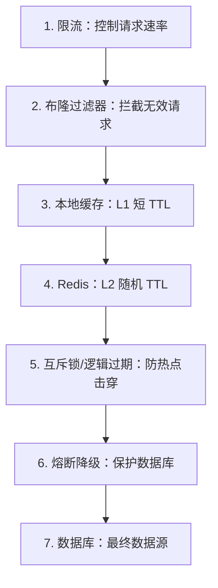

## 知识点地图

- **知识类别**：缓存异常防护——穿透（查不存在的数据）、击穿（热点键过期）、雪崩（成片失效）三类问题的现象、解法与代价。
- **解决什么问题**：缓存 MISS 后流量直达数据库，数据库抗压能力低两三个数量级，三类异常都会把它打垮。本文给每一类可落地的解法与取舍依据。
- **什么时候用到**：缓存上线前的防御性设计；压测与大促前的自查清单（第 5 节）；故障复盘时对号入座。

与《缓存读写模式与数据库一致性》（redis/125-CachePatternsAndDbConsistency）的分工：**本文管「缓存没接住」的异常防护，125 管「缓存与库没对齐」的读写模式与一致性**——两篇合起来才是缓存生产的完整防线。

## 1. 一次促销开场的事故回放

周五晚 8 点，商品详情页做限时秒杀。开场 30 秒后，数据库连接池耗尽，
页面 500。事后复盘发现流量根本不是「太大」，而是走错了路：

- 一批恶意请求在刷不存在的商品 ID：缓存查不到，数据库也查不到，
  每个请求都穿透到底层——这是**穿透**；
- 秒杀商品本身是热点键，TTL 恰好在 8:00:00 过期，1000 个并发同时
  去数据库回源——这是**击穿**；
- 运营批量导入的 10000 个商品预设了同一个 1 小时 TTL，8:00:00 集体
  失效——这是**雪崩**。

三个问题经常一起爆发，因为它们共享同一个放大器：**缓存 MISS 后请求
直达数据库，而数据库的抗压能力比 Redis 低两三个数量级**。本文按
「现象 → 当场能跑的解法 → 为什么有效 → 代价」逐个拆。

准备环境（Redis 8 自带布隆过滤器，无需装任何模块）：

```bash
docker run -d --name redis8 -p 6379:6379 redis:8
docker exec -it redis8 redis-cli
```

## 2. 缓存穿透：查「一定不存在」的数据

### 2.1 现象与判断

```
用户请求: GET /item/999999 (不存在)
  → Redis: MISS    (缓存不存「不存在」)
  → MySQL: MISS    (没有这行)
  → 返回空，什么也不缓存
下一个请求继续打穿……
```

判断特征：**同一批 key 反复 MISS，且数据库也始终为空**。攻击者用
随机 ID 或负数 ID 扫接口时最典型。

### 2.2 解法一：缓存空值（第一道，也是最简单的）

```python
import json, redis

r = redis.Redis(decode_responses=True)
NULL_SENTINEL = "__NULL__"

def get_item(item_id: int):
    key = f"item:{item_id}"
    data = r.get(key)
    if data is not None:
        return None if data == NULL_SENTINEL else json.loads(data)

    db_data = db.query_item(item_id)
    if db_data:
        r.setex(key, 3600, json.dumps(db_data))   # 命中缓存 1 小时
    else:
        r.setex(key, 60, NULL_SENTINEL)           # 空值只缓存 60 秒
    return db_data
```

要点：空值的 TTL 必须**远短于正常值**（数据一旦被创建，不能让用户
看 1 小时的「不存在」）；哨兵值要与合法 JSON 区分。

### 2.3 解法二：布隆过滤器（海量 key 时标配）

空值缓存对「每次都换新随机 ID」的攻击无效（每个 key 只存 60 秒，
攻击面无限大）。这时在缓存前面加一道「这个 key 值得查吗」的闸门：

```bash
# Redis 8 内置布隆过滤器，开箱即用
BF.RESERVE items:bf 0.001 10000000     # 目标误判率 0.1%，预计 1000 万元素
BF.ADD items:bf "item:1001"
BF.EXISTS items:bf "item:1001"         # 1：可能存在
BF.EXISTS items:bf "item:999999"       # 0：一定不存在，请求到此为止
BF.INFO items:bf                       # 查看实际容量与误判率
```

布隆过滤器的回答只有两种：「一定不存在」和「可能存在」。所以它只能
拦请求，不能当存储用：

```
位数组 + k 个哈希函数

添加 x:  h1(x) % m、h2(x) % m、h3(x) % m 三处位置全部置 1
查询 y:  三个位置只要有一个 0 → 一定不存在（无漏报）
         三个位置全 1 → 可能存在（有误判，误判率见下）

误判率: P ≈ (1 - e^(-kn/m))^k
  m: 位数组长度   k: 哈希函数个数   n: 已插入元素数
```

接入业务代码（Python 侧对应 BF.ADD / BF.EXISTS）：

```python
def get_item_v2(item_id: int):
    if not r.bf().exists("items:bf", str(item_id)):
        return None                      # 一定不存在，数据库零压力

    data = r.get(f"item:{item_id}")      # 走正常缓存流程
    if data is not None:
        return None if data == NULL_SENTINEL else json.loads(data)
    db_data = db.query_item(item_id)
    if db_data:
        r.setex(f"item:{item_id}", 3600, json.dumps(db_data))
    return db_data
```

两个方案的取舍：

| 方案       | 优点       | 缺点                                     |
| ---------- | ---------- | ---------------------------------------- |
| 缓存空值   | 简单、通用 | 恶意随机 ID 下内存与键数不可控           |
| 布隆过滤器 | 空间极省   | 有误判率、需预加载、**不支持删除**       |

「不支持删除」的补救：商品下架场景用布谷鸟过滤器（`CF.ADD/CF.DEL`，
Redis 8 同样内置，允许删除但空间略高），或定期全量重建布隆过滤器。
新增元素记得双写（入数据库的同时 BF.ADD），否则新数据会被误拦。

### 2.4 三个场景的防护选型

**场景一：恶意扫描 API 的随机 ID**（攻击者每请求换一个不存在的 ID）——空值缓存的内存与键数不可控（每个 key 只活 60 秒但攻击面无限），必须上布隆过滤器。这是 2.3 节布隆的正解场景：合法 ID 空间可枚举（商品 ID 上限已知），过滤器容量可预估。

**场景二：ID 段本身可校验的内部接口**（订单号规则为日期+序列，非法格式一眼可辨）——连布隆都不用，一层格式/范围校验就是全部防线（2.4 节的「单机版布隆」原则）：过滤器是给「合法 ID 空间稀疏且不可枚举」的场景准备的，能便宜拦截就不要堆组件。

**场景三：UGC 内容的可见性穿透**（内容被删除或审核下架后，缓存里还是旧值，攻击者专扫已删内容）——这是「穿透」的孪生问题：库与缓存都不该有这个值。解法是删除路径**主动失效**（删内容时同步 DEL 缓存键，见 125 篇的失效模式）加短 TTL 空值缓存兜底，而不是靠过滤器——过滤器拦「从未存在」，拦不了「曾经存在」。

三场景的选择树：ID 格式可校验 → 参数校验；ID 从未存在且可枚举 → 布隆过滤器；值曾经存在后被删 → 删除主动失效 + 空值兜底。

### 2.5 顺带一提：缓存击穿防护里的「单机版布隆」

如果只是「判断 ID 段是否合法」（如 ID 必须为正且小于已知最大值），
连布隆过滤器都不用——一行范围校验就能拦掉大多数攻击。过滤器是给
「合法 ID 空间稀疏且不可枚举」的场景准备的，别上来就堆组件。

## 3. 缓存击穿：热点 key 过期的瞬间

### 3.1 现象与判断

```
热点 key: hot:item:1 (TTL=3600s)
T=3600s: key 过期
  1000 个并发同时 MISS
  → 1000 个请求同时回源数据库
```

判断特征：MISS 集中在**个别 key**、且时间点与过期时间对齐。
它与穿透的区别：穿透查的是「不存在」；击穿查的是「存在且很热」。

### 3.2 解法一：互斥锁（只放一个人去回源）

```python
import time

def get_hot(key):
    data = r.get(key)
    if data:
        return json.loads(data)

    lock_key = f"lock:{key}"
    got_lock = r.set(lock_key, "1", nx=True, ex=5)   # 5 秒锁超时兜底
    if got_lock:
        try:
            data = db.query_hot(key)
            r.setex(key, 3600, json.dumps(data))
            return data
        finally:
            r.delete(lock_key)
    # 没抢到锁：稍等片刻再读缓存（回源者马上会写回）
    time.sleep(0.05)
    return get_hot_with_limit(key, depth=3)          # 递归要有层数上限
```

要点：`SET ... NX EX` 一条命令完成「抢锁 + 定时自动释放」，防止持有者
崩溃后死锁；递归重试必须有深度上限，否则锁超时后整条请求链会栈爆炸。

### 3.3 解法二：逻辑过期（不阻塞，返回旧值）

互斥锁的代价是「排队」。对响应时间极敏感的场景改成：key 永不过期，
把过期时间写进值里，过期后异步刷新、先返回旧数据：

```python
import threading, time, json

def get_hot_logical(key):
    raw = r.get(key)
    if raw is None:
        return None                        # 冷启动仍需一次性回源
    obj = json.loads(raw)
    if obj["expire_at"] > time.time():
        return obj["data"]                 # 逻辑未过期，直接用
    # 逻辑过期：抢锁异步刷新，当前请求拿旧值就走
    if r.set(f"lock:{key}", "1", nx=True, ex=10):
        threading.Thread(target=refresh, args=(key,), daemon=True).start()
    return obj["data"]

def refresh(key):
    try:
        data = db.query_hot(key)
        r.set(key, json.dumps({
            "data": data,
            "expire_at": time.time() + 3600,
        }))                                # 注意：不设 TTL
    finally:
        r.delete(f"lock:{key}")
```

两个方案对比：

| 方案     | 一致性   | 可用性           | 复杂度 |
| -------- | -------- | ---------------- | ------ |
| 互斥锁   | 强一致   | 有排队延迟       | 低     |
| 逻辑过期 | 最终一致 | 高（永不阻塞）   | 中     |

补充两个零代码手段：把热点 key 的过期时间错峰（下一节的随机 TTL
同样适用于热点）；运维侧对极少数核心 key 直接「预热 + 不设 TTL +
定时任务刷新」，即方案三「永不过期 + 异步刷新」，适合数据量小、
更新频率固定的场景。

## 4. 缓存雪崩：大量 key 同时失效

### 4.1 现象与判断

```
场景1: 10000 个 key 的 TTL 都是 3600s → 1 小时后集体过期
场景2: Redis 实例宕机 → 全部请求穿透
```

与击穿的区别在「面」：击穿是个别热点，雪崩是成片 key 或缓存整体。

### 4.2 解法一：随机 TTL（一行代码的疫苗）

```python
import random

base_ttl = 3600                       # 基础 1 小时
jitter = random.randint(0, 600)       # 0-10 分钟抖动
r.setex(key, base_ttl + jitter, value)
```

批量导入、定时预热这类「同批同 TTL」的数据，必须加抖动。TTL 分布
摊开后，过期时刻不会形成尖峰。

### 4.3 解法二：多级缓存

```
请求 → 本地缓存 (Caffeine/Guava) → Redis → 数据库
L1 本地: TTL=60s，容量小，挡住热点重复读
L2 Redis: TTL=3600s，容量大
即使 Redis 短暂不可用，L1 仍能挡住部分请求
```

注意 L1 引入的新问题：多实例间 L1 不一致（可接受 60 秒误差才用）、
本地缓存的主动失效广播（Pub/Sub 通知各实例清 L1）。

### 4.4 解法三：熔断降级与高可用

```python
from circuitbreaker import circuit

@circuit(failure_threshold=5, recovery_timeout=30)
def get_data(key):
    data = r.get(key)
    if data:
        return json.loads(data)
    return db.query(key)

def get_data_fallback(key):
    return {"message": "服务繁忙，请稍后重试"}   # 兜底响应，保住可用性
```

熔断解决「Redis 挂了之后数据库跟着挂」的连锁反应；根治靠高可用：
Sentinel 自动故障转移（redis/210）、Cluster 分片 + 副本（redis/220），
重要业务再加跨机房容灾。雪崩预案是「假设缓存会消失」设计系统。

## 5. 综合防护：把四层闸门排成流水线



自检清单（每条都能在压测前验证）：

- 随机抓 100 个缓存 key 的 TTL（`TTL` 命令），确认没有成片的相同值；
- 用一个不存在的 ID 连打 100 次，确认数据库查询次数为 0（空值缓存
  或过滤器生效）；
- 把热点 key 手动 `DEL` 掉，同时压 500 并发，观察数据库 QPS 峰值
  是否超过个位数（互斥锁生效）；
- 停掉 Redis，确认服务返回降级响应而不是 500（熔断生效）。

监控指标基线：缓存命中率 `hits / (hits + misses)` 大于 95%；
穿透率 `misses / total` 小于 5%；数据库 QPS 不超过阈值；Redis 内存
低于 80%（`INFO memory`）；TTL 分布无尖峰。命中率骤降往往是三问题
的前兆，先看趋势再查原因。

## 6. 动手实践

先只读任务与提示，自己写完再展开参考实现。

**自检一：给穿透写完整的「空值缓存 + 过滤器」双层防线。** 要求：`get_item_v3` 先过布隆过滤器（拦截 100% 确定不存在的），未拦截的走空值缓存路径；注意两个边界——新增商品时双写过滤器；商品下架（DB 删除）时缓存怎么处理。

提示：双写发生在「DB 写入成功之后」；下架场景回忆 2.4 节场景三——过滤器拦不了「曾经存在」，下架要走主动失效。

<details>
<summary>自检一参考实现</summary>

```python
def get_item_v3(item_id: int):
    if not r.bf().exists("items:bf", str(item_id)):
        return None                          # 一定不存在：零 DB 压力

    key = f"item:{item_id}"
    data = r.get(key)
    if data is not None:
        return None if data == NULL_SENTINEL else json.loads(data)

    db_data = db.query_item(item_id)
    if db_data:
        r.setex(key, 3600, json.dumps(db_data))
    else:
        r.setex(key, 60, NULL_SENTINEL)      # 曾存在后被删：空值兜底
    return db_data

def create_item(payload):
    item_id = db.insert_item(payload)        # 先落库
    r.bf().add("items:bf", str(item_id))     # 后双写过滤器
    return item_id

def remove_item(item_id: int):
    db.delete_item(item_id)
    r.delete(f"item:{item_id}")              # 主动失效，靠过滤器是拦不住的
```

要点自查：空值 TTL 60 秒与数据 TTL 3600 秒的比例是有意为之（脏「不存在」的代价远小于脏「存在」）；`remove_item` 若漏掉 `r.delete`，用户最多看 1 小时已删内容——把它写成 DB 删除的同一个事务边界（或至少同一个代码路径）是流程保障。
</details>

**自检二：判断下面这段代码的穿透防线哪里坏了。**

```python
def buggy_get(item_id):
    data = r.get(f"item:{item_id}")
    if data:
        return json.loads(data)
    db_data = db.query_item(item_id)
    if db_data:
        r.setex(f"item:{item_id}", 3600, json.dumps(db_data))
    return db_data
```

提示：它在库里查不到时返回了什么？缓存了吗？攻击者拿到什么信号？

<details>
<summary>自检二参考答案</summary>

两个洞：一是查不到时**既不返回哨兵也不写空值缓存**，每次未命中都穿透到底层——这正是 2.1 节现象的原样复刻；二是返回 None 前没有任何过滤器拦截，攻击成本为零。修复路径：套用自检一的双层结构，或至少把 `r.setex(key, 60, NULL_SENTINEL)` 补上。这题的教训：穿透防护的最小单元是「未命中也要有动作」，返回 None 而什么都不缓存等于没有防线。
</details>

**练习**：

1. 本地起 Redis 8，建一个误判率 1% 的布隆过滤器，插入 10 万元素后
   用 `BF.INFO` 对比设计值与实际值；再故意查 1000 个未插入元素，
   统计误判次数，验证量级。
2. 把 2.3 节的 `get_item_v2` 补上「新增商品后 BF.ADD 双写」逻辑，
   思考：漏掉双写会发生什么？多久后用户才能查到新商品？
3. 构造 5000 个同 TTL 的 key，写脚本在过期时刻打点压测；再加随机
   TTL 后重跑，对比数据库 QPS 曲线。

## 7. 下一步

- 《位图》（redis/060-BitMapRedis）：布隆过滤器的位运算亲戚，以及
  「首次出现」类判断的另一种实现；
- 《管道、事务与原子性》（redis/230-PipeTransactionAtomic）与
  《Lua 脚本原子执行》（redis/240-LuaScriptAtomicExecution）：
  本文的互斥锁是 SET NX 单命令版，多步原子操作需要事务/Lua；
- 《内存淘汰策略》（redis/130-MemoryEvictionPolicy）：雪崩之外，
  缓存数据还可能被主动淘汰，理解两者边界。
