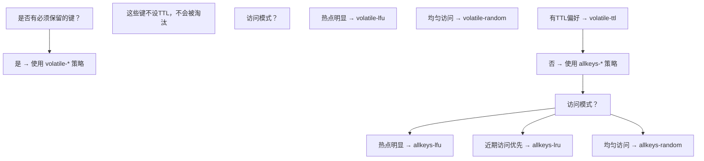

## 知识点地图

- **知识类别**：Redis 内存淘汰（eviction）——maxmemory 触发条件、LRU/LFU/Random/TTL 四类八种策略的原理与配置。
- **解决什么问题**：内存达到上限后「删谁的键」的决策机制；让缓存实例在有限内存下保住最该保住的数据；让 `evicted_keys` 告警有明确的处置路径。
- **什么时候用到**：容量规划、缓存策略选型、内存告警处置；与过期删除（redis/020-KeyManagement）的边界是：过期删「到期的键」，淘汰删「还没到期但内存不够时的键」。

前置：了解键空间与 TTL 基础概念（redis/010-OverviewCoreDataStructure）。

## 1. 内存淘汰概述

### 1.1 触发条件

当 Redis 使用内存超过 `maxmemory` 配置时，触发淘汰策略：

```redis
# 设置最大内存
CONFIG SET maxmemory 4gb

# 查看当前内存使用
INFO memory
# used_memory: 3.8GB
# maxmemory: 4GB
```

### 1.2 八种淘汰策略

| 策略            | 淘汰范围  | 算法        | 适用场景      |
| --------------- | --------- | ----------- | ------------- |
| noeviction      | 不淘汰    | -           | 数据不能丢失  |
| allkeys-lru     | 所有键    | LRU         | 通用缓存      |
| allkeys-lfu     | 所有键    | LFU         | 热点数据明显  |
| allkeys-random  | 所有键    | 随机        | 无访问偏好    |
| volatile-lru    | 有TTL的键 | LRU         | 混合使用      |
| volatile-lfu    | 有TTL的键 | LFU         | 混合使用      |
| volatile-random | 有TTL的键 | 随机        | 混合使用      |
| volatile-ttl    | 有TTL的键 | 最短TTL优先 | 业务有明确TTL |

## 2. LRU 算法

### 2.1 传统 LRU

传统 LRU 维护一个按访问时间排序的链表：

```
访问顺序: A → B → C → D → E

最近访问的在头部，最久未访问的在尾部
淘汰时删除尾部元素

问题: 需要大量内存维护链表指针
```

### 2.2 Redis 近似 LRU

Redis 使用**采样近似 LRU**，不维护全局链表：

```
1. 随机采样 N 个键（N = maxmemory-samples，默认5）
2. 淘汰其中最久未访问的键
3. 重复直到内存低于阈值
```

### 2.3 LRU 时钟

每个 Redis 对象头包含一个 24 位的 LRU 时钟：

```c
typedef struct redisObject {
    unsigned type:4;
    unsigned encoding:4;
    unsigned lru:24;    // LRU 时钟（秒级精度，LFU 模式下复用为 16位时间+8位计数器）
    int refcount;
    void *ptr;
} robj;
```

```
LRU 时钟分辨率: 1000ms（lru 字段以秒为单位累计）
24位最大值: 2^24 = 16777216 秒 ≈ 194 天循环回绕

计算空闲时间: 当前全局时钟 - object.lru（差值取模处理回绕）
```

### 2.4 采样数对效果的影响

```
maxmemory-samples = 3:  接近真实LRU的 80%
maxmemory-samples = 5:  接近真实LRU的 90%  ← 默认
maxmemory-samples = 10: 接近真实LRU的 95%
maxmemory-samples = 20: 接近真实LRU的 98%

采样数越大，越接近真实LRU，但CPU开销也越大
```

## 3. LFU 算法

### 3.1 LFU 原理

LFU（Least Frequently Used）根据**访问频率**淘汰，比 LRU 更适合热点数据场景：

```
LRU: 最近访问的保留 → 偶尔访问的大文件可能挤掉频繁访问的小数据
LFU: 频繁访问的保留 → 真正的热点数据不会被淘汰
```

### 3.2 Redis LFU 实现

Redis 4.0+ 引入 LFU，复用 `lru` 字段的 24 位：

```
24位 lru 字段:
  高16位: 最后衰减时间（分钟级）
  低8位:  对数计数器（logarithmic counter）

计数器范围: 0-255
实际频率范围: 1-约100万次/分钟
```

### 3.3 对数计数器

计数器不是「每访问一次加一」，而是**以递减的概率递增**：counter 越大，
再涨一分越难。8 位（0-255）因此足以表达从个位数到百万级的访问频率。

新对象初始 counter 为 `LFU_INIT_VAL = 5`（避免新建键立刻被当作冷数据淘汰）。

**更新规则**（概率递增）：

```c
uint8_t LFULogIncr(uint8_t counter) {
    if (counter == 255) return 255;          // 已饱和
    double r = (double)rand() / RAND_MAX;    // 0~1 随机数
    double baseval = counter - LFU_INIT_VAL; // LFU_INIT_VAL = 5
    if (baseval < 0) baseval = 0;
    // lfu-log-factor 越大 / counter 越高 → 概率越低，增长越慢
    double p = 1.0 / (baseval * server.lfu_log_factor + 1);
    if (r < p) counter++;
    return counter;
}
```

直观理解（lfu-log-factor=10 时）：counter 从 5 涨到 10 很快（几十次访问），
从 10 涨到 100 则需要数十万次访问——高段位天然代表「极热」。

### 3.4 衰减机制

LFU 计数器随时间衰减，避免历史热点永远不被淘汰：

```
衰减规则:
  每经过 lfu-decay-time 分钟，counter 减 1
  lfu-decay-time 默认为 1 分钟

示例:
  counter=10, 5分钟无访问 → counter=5
  counter=10, 持续访问 → counter 保持或增长
```

### 3.5 LFU 配置

```redis
# 淘汰策略
CONFIG SET maxmemory-policy allkeys-lfu

# 衰减时间（分钟）：每过 N 分钟未访问，counter 减 1
CONFIG SET lfu-decay-time 1

# 对数增长因子：越大 counter 增长越慢（区分度更高）
CONFIG SET lfu-log-factor 10
```

### 3.6 LFU 在线调优实验

两个参数怎么调不能靠拍脑袋，用 `OBJECT FREQ` 在线上直接做实验（Redis 4.0+，前提 `maxmemory-policy` 为 LFU 系）：

```bash
# OBJECT FREQ：查看某键当前的 LFU 计数（0-255 的对数计数器）
OBJECT FREQ hot:key
# (integer) 153

# 实验一：观察 lfu-log-factor 对增长速度的影响
CONFIG SET lfu-log-factor 10    # 默认
SET bench:k1 x
# 用脚本循环 GET bench:k1 共 1 万次，OBJECT FREQ bench:k1 → 记录值
CONFIG SET lfu-log-factor 100   # 十倍
# 新键重跑 1 万次 GET → 记录值，对比两次计数
# 结论预期：factor=10 时 1 万次访问能把 counter 推到 80~120；
#          factor=100 时大概只到 30~50——高段位更难进，区分度更高

# 实验二：观察 lfu-decay-time 对冷化的影响
CONFIG SET lfu-decay-time 1     # 默认：1 分钟减 1
# 停止访问 10 分钟后 OBJECT FREQ → 计数下降约 10
CONFIG SET lfu-decay-time 10
# 同样停 10 分钟 → 计数只降 1
```

调参决策表（结合 `evicted_keys` 增速与缓存命中率）：

| 现象 | 调整方向 | 理由 |
| :--- | :--- | :--- |
| 命中率还行但偶发热键被淘汰 | `lfu-log-factor` 调大 | 拉开冷热键的计数差距，热键更难被超过 |
| 新上线的键很快被淘汰 | `lfu-decay-time` 调大或排查 `LFU_INIT_VAL` | 新键初始 counter=5，衰减太快等不到积累访问 |
| 历史热点下线后长期占内存 | `lfu-decay-time` 调小 | 加速冷化，让「曾经的热」尽快让位 |
| counter 普遍接近 255 | `lfu-log-factor` 调大 | 饱和即失去区分度，等于退化成「大家都热」 |

**易错点**：`OBJECT FREQ` 读的是采样计数，改动 `lfu-log-factor` 后**已有键**的 counter 不会重算（参数只影响后续增长），实验必须用新键做对照；另外 `INFO stats` 的命中率（`keyspace_hits/misses`）是所有策略的裁判，LFU 参数调得好不好最终看它。

## 4. 策略选择

### 4.1 决策流程



### 4.2 常见场景推荐

| 场景          | 推荐策略     | 理由            |
| ------------- | ------------ | --------------- |
| 纯缓存        | allkeys-lfu  | 热点数据保留    |
| 会话缓存      | allkeys-lru  | 近期活跃保留    |
| 消息队列      | volatile-ttl | 过期自动清理    |
| 持久数据+缓存 | volatile-lru | 持久数据不设TTL |
| 数据不能丢失  | noeviction   | 写入报错不淘汰  |

### 4.3 监控与调优

```redis
# 查看淘汰统计
INFO stats
# evicted_keys: 1234  ← 被淘汰的键数量

# 查看内存使用
INFO memory
# used_memory: 3.8GB
# maxmemory: 4GB
# mem_fragmentation_ratio: 1.2

# 调优建议:
# 1. evicted_keys 持续增长 → 增大 maxmemory 或优化策略
# 2. 缓存命中率低 → 考虑换策略（LRU → LFU）
# 3. 内存碎片率高 → 重启或使用 activedefrag
```

## 4A. 动手实践

任务一：验证采样 LRU 的「不精确性」。设 `maxmemory-policy allkeys-lru`、`maxmemory-samples 3`，写入 100 个键后按 1..100 顺序各 GET 一次（构造访问序），再写入 20 个新键触发淘汰，记录被淘汰的键编号分布；改 `maxmemory-samples 10` 重跑对比。

<details>
<summary>任务一参考观察与提示</summary>

预期：samples=3 时被淘汰的键会包含不少「访问序靠后但非最旧」的键（近似 LRU 的误差窗口）；samples=10 后分布明显更贴近真 LRU。观察手段：淘汰前后对比 `DBSIZE` 与键集合差集。实验要控制单键大小让 20 个新键足以触发淘汰。这正是 2.4 节「采样数对效果影响」的可触摸版本。
</details>

任务二：按 3.6 节的实验一流程，实测你所在 Redis 版本在 `lfu-log-factor` 10 与 100 下、1 万次 GET 后新键的 `OBJECT FREQ` 值，并判断你们业务的访问频率分布更适合哪个因子。

<details>
<summary>任务二参考判读</summary>

用 python 脚本循环 GET 1 万次（管道发送更接近真实负载）。factor=10 时 counter 通常落在 80~130，factor=100 时落在 25~55。决策：业务键的访问频次普遍在「每小时几十次」量级 → 用大因子把高频键和低频键拉开；访问频次普遍极高（每秒十次以上）→ 默认 10 即可，再大会让所有键都挤在中段失去区分度。
</details>

## 触发条件

**基本写法：设置最大内存**
`CONFIG SET maxmemory <bytes>`
```bash
# 设置 Redis 最大内存为 4GB
CONFIG SET maxmemory 4gb
```

**基本写法：查看内存使用**
`INFO memory`
```bash
# 查看当前内存使用情况
INFO memory
```

---

## 淘汰策略配置

**基本写法：不淘汰策略**
`CONFIG SET maxmemory-policy noeviction`
```bash
# 内存不足时拒绝写入，返回错误
CONFIG SET maxmemory-policy noeviction
```

**基本写法：所有键 LRU 策略**
`CONFIG SET maxmemory-policy allkeys-lru`
```bash
# 所有键中淘汰最久未访问的键
CONFIG SET maxmemory-policy allkeys-lru
```

**基本写法：所有键 LFU 策略**
`CONFIG SET maxmemory-policy allkeys-lfu`
```bash
# 所有键中淘汰访问频率最低的键
CONFIG SET maxmemory-policy allkeys-lfu
```

**基本写法：所有键随机策略**
`CONFIG SET maxmemory-policy allkeys-random`
```bash
# 所有键中随机淘汰
CONFIG SET maxmemory-policy allkeys-random
```

**基本写法：有 TTL 的键 LRU 策略**
`CONFIG SET maxmemory-policy volatile-lru`
```bash
# 有过期时间的键中淘汰最久未访问的键
CONFIG SET maxmemory-policy volatile-lru
```

**基本写法：有 TTL 的键 LFU 策略**
`CONFIG SET maxmemory-policy volatile-lfu`
```bash
# 有过期时间的键中淘汰访问频率最低的键
CONFIG SET maxmemory-policy volatile-lfu
```

**基本写法：有 TTL 的键随机策略**
`CONFIG SET maxmemory-policy volatile-random`
```bash
# 有过期时间的键中随机淘汰
CONFIG SET maxmemory-policy volatile-random
```

**基本写法：有 TTL 的键最短 TTL 优先策略**
`CONFIG SET maxmemory-policy volatile-ttl`
```bash
# 有过期时间的键中淘汰 TTL 最短的键
CONFIG SET maxmemory-policy volatile-ttl
```

---

## LRU 算法

**基本写法：设置 LRU 采样数**
`CONFIG SET maxmemory-samples <N>`
```bash
# 设置 LRU 采样数为 5（默认值）
CONFIG SET maxmemory-samples 5
```

**结构定义写法：redisObject LRU 时钟字段**
`struct redisObject { unsigned lru:24; }`
```c
// 每个 Redis 对象头包含一个 24 位的 LRU 时钟
typedef struct redisObject {
    unsigned type:4;
    unsigned encoding:4;
    unsigned lru:24;    // LRU 时钟（秒级精度，LFU 模式下复用为 16位时间+8位计数器）
    int refcount;
    void *ptr;
} robj;
```

---

## LFU 算法

**基本写法：设置 LFU 衰减时间**
`CONFIG SET lfu-decay-time <minutes>`
```bash
# 设置 LFU 计数器衰减时间为 1 分钟
CONFIG SET lfu-decay-time 1
```

**基本写法：设置 LFU 计数器因子**
`CONFIG SET lfu-log-factor <factor>`
```bash
# 设置 LFU 计数器对数因子为 10
CONFIG SET lfu-log-factor 10
```

**函数源码写法：LFU 对数计数器更新**
`uint8_t LFULogIncr(uint8_t counter)`
```c
// LFU 对数计数器更新函数
uint8_t LFULogIncr(uint8_t counter) {
    if (counter == 255) return 255;
    double r = (double)rand() / RAND_MAX;
    double baseval = counter - LFU_INIT_VAL;  // LFU_INIT_VAL = 5
    if (baseval < 0) baseval = 0;
    double p = 1.0 / (baseval * 10 + 1);  // 概率递减
    if (r < p) counter++;
    return counter;
}
```

---

## 监控与调优

**基本写法：查看淘汰统计**
`INFO stats`
```bash
# 查看键淘汰统计信息
INFO stats
```
