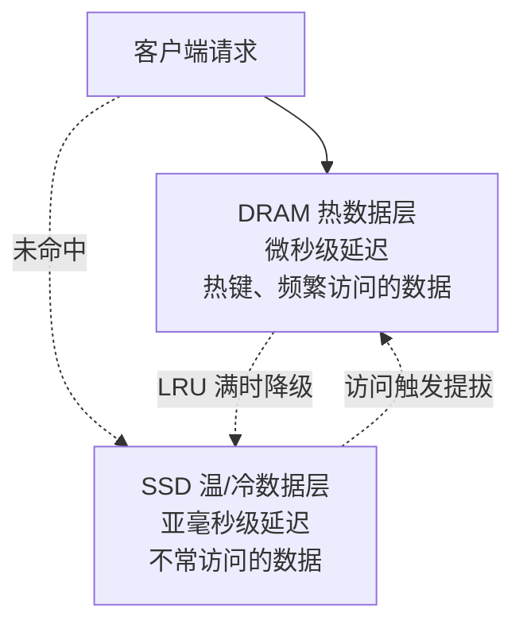

## 知识点地图

- **知识类别**：平台级扩展——Redis Flex 混合存储引擎（DRAM + SSD 自动分层）。
- **解决什么问题**：数据总量超出内存预算，但业务仍然想要 Redis 的数据结构与访问语义。全内存方案为冷数据支付 DRAM 成本；普通淘汰策略则为热数据保留内存、把冷数据直接丢掉。Flex 提供第三条路：**冷数据落 SSD 而不是消失**。
- **什么时候用到**：TB 级数据想保留 Redis 语义（会话历史、用户画像、商品档案）；访问分布有明显热度差（二八定律）；预算敏感但不想引入手工冷热分离的双写一致性成本。

前置：了解内存键值模型（redis/010-OverviewCoreDataStructure）与内存淘汰策略（redis/130-MemoryEvictionPolicy）——Flex 的分层判定与淘汰策略同源，理解「满了怎么办」是理解「往哪放」的前提。

## 1. 问题：内存贵，但淘汰等于丢数据

Redis 的性能前提是「全部数据在内存」（redis/010 第 4 节）。当数据总量逼近内存预算，你只有三个选择：

1. **淘汰**（redis/130）：内存满了按 LRU/LFU 踢掉冷键——缓存场景成立，但会话、画像这类「不能丢」的数据踢掉就是事故；
2. **扩内存 + 分片**：全内存保留一切，成本随数据量线性增长；
3. **Flex 分层**：热数据在 DRAM、温冷数据在 SSD，引擎自动搬运，应用零感知。

三个选择的本质差异是「冷数据的命运」：淘汰是**丢弃**，扩容是**全量最贵介质**，Flex 是**降速不降级**——键永远在，只是取的速度不同。

## 2. 架构与数据流动

### 2.1 双层结构



### 2.2 自动分层：数据温度决定存放位置

分层引擎持续做两件事：

- **降级（demote）**：DRAM 层按 LRU 判定，最久未访问的数据写入 SSD 层并释放内存；
- **提拔（promote）**：访问落在 SSD 上的冷键时，把它读回 DRAM。

对应用完全透明：`GET user:1001:profile` 不管键在哪一层，命令、返回值、过期语义完全一致，唯一的差别是 SSD 命中的那一次延迟高一点（亚毫秒 vs 微秒）。

### 2.3 与「淘汰」共享的判定逻辑

Flex 的温度判定和 redis/130 讲的 LRU 淘汰是同一套思想：**用访问时间近似数据温度**。区别在动作——淘汰是「内存满时把最冷的删掉」，Flex 是「把最冷的搬到慢介质上」。所以理解了 130 篇的 LRU 采样机制，就理解了 Flex 的搬移时机；反过来的推论也成立：访问模式完全均匀（无热点）的负载，分层只剩纯延迟损失，见第 6 节的练习验证。

## 3. 配置详解

### 3.1 核心配置段

```ini
# redis.conf (Redis Flex)
flex-enabled yes
flex-ssd-path /data/redis-ssd
flex-ssd-ratio 0.1              # DRAM:SSD = 1:10
flex-dram-max-memory 4gb        # DRAM 最大使用量
flex-ssd-max-storage 40gb       # SSD 最大使用量
flex-eviction-policy allkeys-lru
```

### 3.2 逐项讲解：为什么这样配

- `flex-enabled yes`：总开关。开着它，实例就有了「内存不够不淘汰、改走 SSD」的行为变化——这是实例语义级的变化，务必在新实例规划期决定，而不是运行中临时打开。
- `flex-ssd-path`：SSD 数据目录。**必须是独立于系统盘的高性能盘**，且与 AOF/RDB 的持久化目录（redis/150、redis/160）分开——持久化是顺序大块写，分层引擎是随机小块写，混盘会互相拖累。
- `flex-ssd-ratio 0.1`：成本旋钮，1:10 意味着 4GB DRAM 撑起 40GB 数据。比例越激进（SSD 越大），命中率曲线越陡——分层引擎的效果取决于**访问分布的长尾形状**，二八定律越明显的负载收益越大。
- `flex-dram-max-memory` / `flex-ssd-max-storage`：两层各自的容量上限。DRAM 上限要留出复制缓冲区、Lua 脚本等系统内存（redis/200 讲的缓冲区体系），别把 `maxmemory` 的思路原样搬过来。
- `flex-eviction-policy`：两层都满时的最终动作。分层不能消灭「数据还在涨」的问题，全满时仍要淘汰——策略选择逻辑同 redis/130。

### 3.3 容量规划的最小算式

```
DRAM 需求 ≈ 热数据峰值 × 副本系数
SSD 需求 ≈ 全量数据 × 1.5（预留写放大与碎片）
预算对比: 全内存成本 = 全量 × DRAM 单价
         Flex 成本  = 热数据 × DRAM 单价 + 全量 × SSD 单价
二八定律明显的负载，Flex 方案的存储成本通常是全内存的 20%~30%
```

换成别的写法会发生什么：如果不用 `flex-ssd-ratio` 而是硬编码两层容量，业务增长后会出现「DRAM 满了但 SSD 还有大量空间」的错配——比例参数让引擎按实际访问分布自适应，这是把「人工预估温度」换成「引擎实测温度」。

## 4. 适用场景判定

### 4.1 对照表

| 场景     | 传统 Redis | Redis Flex |
| :------- | :--------- | :--------- |
| 数据量   | 受内存限制 | 可达 TB 级 |
| 成本     | 高         | 显著降低   |
| 延迟     | < 100μs    | < 500μs    |
| 适用数据 | 热数据     | 全量数据   |
| 典型场景 | 缓存       | 数据库替代 |

### 4.2 判读这张表的正确方式

Flex 不是「更便宜的 Redis 缓存」，而是「速度介于缓存与磁盘数据库之间的存储」。把它当缓存用是亏的（缓存就该全内存，冷数据根本不该进来）；当数据库用才是它的定位——**会话历史、用户画像、商品档案**这类「总量大、单条小、访问有热度差」的数据。

### 4.3 三个场景的选型结论

1. **商品详情页缓存**（读多写少、可丢）：不该用 Flex——缓存允许淘汰，全内存 Redis + 淘汰策略更便宜更快。
2. **用户会话与画像**（不能丢、访问有热度差）：Flex 的正解场景，冷用户降级 SSD，登录活跃用户自动回 DRAM。
3. **纯写入的消息流**（Stream 持续追加）：谨慎——消息流是均匀追加负载，没有「热键提拔」的机会，分层只剩延迟损失，该用 Stream 的裁剪（XTRIM）或落库。

## 5. 工程场景：冷热数据分层省内存

背景：社交 App 的用户动态评论缓存，总量 60GB，访问分布极度头部——7 天内动态占访问量 95%。全内存方案 60GB×3 副本成本过高。

```ini
# Redis Flex 配置
flex-enabled yes
flex-ssd-path /data/redis-ssd
flex-ssd-ratio 0.1
flex-dram-max-memory 6gb      # 6GB DRAM
flex-ssd-max-storage 60gb     # 60GB SSD
flex-eviction-policy allkeys-lru
```

配置逻辑逐行看：总量 60GB 按 1:10 比例配 6GB DRAM，赌的是「95% 访问落在 7 天内动态」这个头部假设——活跃数据集（7 天内动态）估算约 5GB，DRAM 留 6GB 是热数据峰值加两成余量；SSD 上限与总量持平，为写放大留了余量；淘汰策略选 allkeys-lru 而不是 volatile-lru，因为「动态」这类数据没有 TTL 语义，靠分层而不是靠过期管理生命周期。

**落地节奏与验证**：先双写观察（新实例挂 Flex、旧实例照跑，双读对比延迟），确认 P99 从 0.4ms 升到 0.6ms 左右可接受后切流。监控盯两个数：DRAM 命中率（应 >90%，头部数据足够热）与 SSD 队列深度（持续打满说明 SSD 型号不对）。

**与「手工冷热分离」的对比**（热数据 Redis + 冷数据落 MySQL/Mongo，访问时回填）：手工方案省的是 SSD 成本但引入双写一致性与回填逻辑；Flex 的价值是零代码改动、单系统语义。数据访问模式稳定且预算敏感时手工分离更省，长尾模式多变时 Flex 的自动分层更稳。

### 5.1 第二个场景：电商商品档案

商品 SKU 2000 万条，日活跃 SKU 约 50 万（2.5%）。全内存 200GB 不现实，冷 SKU 淘汰又会造成「长尾商品打开报错」。Flex 方案：20GB DRAM + 200GB SSD，大促前用预热脚本批量访问次日活动 SKU（提前提拔回 DRAM）。**易错点**：预热脚本要控制速率（pipeline 每批几百键，间隔执行），一口气扫全量会把 SSD 读队列打满，拖慢在线请求。

### 5.2 第三个场景：游戏玩家数据

玩家存档（等级、背包、好友）总量 3TB，同时在线 10 万人。玩家访问呈现强会话性：在线时段高频、下线后冰冻。Flex 配 300GB DRAM，`flex-eviction-policy` 不重要（分层优先于淘汰），关键是给「活跃会话」建监控——`INFO` 的分层命中率低于 90% 时，说明同时在线的活跃数据集超过 DRAM，要加内存而不是换更快的 SSD。

## 6. 监控与易错点

**易错点：SSD 的写放大与擦写寿命。** Flex 场景要选企业级 SSD（高 DWPD，Drive Writes Per Day），并用 `INFO` 的分层命中率监控「DRAM 命中率」——若长期低于 90%，说明 DRAM 配小了，加内存比换 SSD 便宜。

监控清单：

| 指标 | 健康值 | 异常时动作 |
| :--- | :--- | :--- |
| DRAM 命中率 | > 90% | 低于则加内存或检查访问模式 |
| SSD 队列深度 | 无持续打满 | 打满则换更高 IOPS 盘或降 ratio |
| P99 延迟 | 稳定、无阶梯跳变 | 跳变说明热键在两层间震荡 |
| 两层容量水位 | DRAM < 80%、SSD < 70% | 超限提前扩容，别等淘汰兜底 |

「热键在两层间震荡」是特有的新失败模式：一个键被降级后马上又被访问、提拔，如此往复——通常意味着访问间隔恰好落在降级判定阈值附近。解法是给这类键做应用侧本地缓存（redis/120 第 4 节的多级缓存思路）。

## 7. 动手实践

**任务一**：观察分层对延迟的影响。用 docker 起一个挂载 SSD 目录的 Redis（或在云实例上按官方文档开启 Flex），写入 10 万个键后统计 DRAM 命中率与 P99 延迟随访问模式的变化：先随机访问全部键 1000 次，再集中访问其中 1% 的键 10000 次，对比两阶段的延迟分布。

<details>
<summary>任务一参考观察</summary>

随机访问阶段冷键多，P99 明显抬升（SSD 亚毫秒级）；集中访问阶段热键全部提拔回 DRAM，P99 回落到微秒级。这验证了第 2.3 节的结论：Flex 收益依赖访问分布——均匀随机访问（无热点）的负载不适合 Flex，分层只会带来纯延迟损失。
</details>

**任务二**：容量规划演算。假设你要把一个 80GB 的全内存实例迁到 Flex，已知日访问键去重后约 8GB（活跃数据集），写出你的 `flex-dram-max-memory`、`flex-ssd-max-storage`、`flex-ssd-ratio` 三个值，并给出每个值的依据。

<details>
<summary>任务二参考推演</summary>

活跃数据集 8GB 加两成余量，DRAM 取 10GB；SSD 覆盖全量 80GB 再留 50% 写放大与碎片余量，取 120GB；ratio 即 10/120 ≈ 0.08。三步各有依据：DRAM 由「活跃数据集」决定而不是总量的固定比例，SSD 由「全量加写放大」决定，ratio 是前两者的推导结果而不是输入值——先定两端、后算比例，是容量规划的正确顺序。
</details>

**任务三**：找出你手头项目里「总量大、单条小、访问有热度差」的数据（如用户配置、历史订单摘要），判断它现在被存在哪里、被什么策略管理（TTL？LRU 淘汰？落库回填？），写三句话评估它是否适合 Flex，以及迁移要改哪些代码（理想答案是：零代码改动，只改部署配置）。

## 8. 下一步与延伸阅读

- 《内存淘汰策略》（redis/130-MemoryEvictionPolicy）：分层判定与淘汰策略同源，理解 LRU 采样就理解了搬移时机；
- 《RDB 快照持久化》（redis/150-RDBSnapshotPersistence）与《AOF 日志持久化》（redis/160-AOFLogPersistence）：持久化目录与 SSD 数据目录的隔离规划；
- 《集群代理接入》（redis/185-ClusterProxyAccess）：同属平台级扩展的接入侧能力。

## 参考与致谢

- Redis 官方文档 Redis Flex：<https://redis.io/docs/latest/operate/rs/clusters/configure/flex/>（Redis 文档站按 CC-BY-SA 4.0 授权），分层架构与配置项说明；
- 本篇正文为教学重写；原《集群代理、Flex 混合存储与 Redis for AI》的 Redis Flex 全部小节（架构、配置、适用场景）与工程场景二已整体搬移至本篇 2、3、4、5 节落位。
