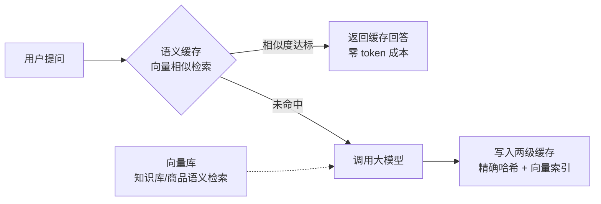

## 知识点地图

- **知识类别**：平台级扩展——Redis for AI 套件（向量库 + 推理缓存 + 语义缓存 + VSS 优化）。
- **解决什么问题**：LLM 应用按 token 计费、推理延迟秒级，大量提问语义相同却各付各的钱、各等各的延迟。套件用「问过的题不再问模型」的缓存思路，把重复与相似提问的成本和延迟降一个量级。
- **什么时候用到**：AI 客服、知识库问答、推荐召回——提问重复度或相似度高的场景；反过来，开放创作类对话命中率趋近于零，不该上这套。

前置：向量集合的完整命令面见《向量集合》（redis/100-VectorSet），本篇只讲套件视角；缓存三大问题的防护思路见《缓存穿透击穿雪崩》（redis/120-CachePenetrationBreakdownAvalanche）——语义缓存的「误答」就是它的一致性风险。

## 1. 套件总览：三类能力一张图

Redis for AI 是围绕「AI 应用与 Redis 交互」的能力打包，三块各管一层：



三块能力的分工：**向量库**是基础设施（存向量、做 KNN 检索）；**推理缓存**与**语义缓存**是两种缓存策略（前者精确匹配、后者相似匹配）；VSS 优化是让前两者跑得省、跑得快的调参层。

## 2. 向量库：语义检索的地基

向量集合（Vector Set）的创建与 KNN 检索命令完整语义、参数与 API 边界统一见《向量集合》（redis/100-VectorSet），此处只给套件语境下的最小骨架：

```bash
# 创建向量集合
VSET products:vec item1 0.1 0.2 ... 0.768
VSET products:vec item2 0.2 0.3 ... 0.768

# KNN 搜索
VSEARCH products:vec 0.1 0.15 ... 0.76 COUNT 10

# 带元数据过滤
VSET products:vec item1 0.1 0.2 ... 0.768 META category "electronics" price 299
VSEARCH products:vec 0.1 0.15 ... 0.76 COUNT 10 FILTER category == "electronics"
```

与独立向量数据库（Milvus、Qdrant）相比，Redis 向量能力的取舍：优势是与业务数据同库同事务、延迟更低、运维面收敛；劣势是数据规模与索引类型的灵活性弱于专业产品。百万级向量以内、且向量与业务键强关联的场景（商品推荐、知识库 chunk 检索）值得首选 Redis。

为什么这样选：语义缓存场景下「向量与业务键强关联」是天然成立的——每个缓存的 prompt 向量都对应一条缓存回答（一个 String 键），拆到独立向量库后每次命中都要跨两个系统对账，一致性成本高于收益。

## 3. 推理缓存与语义缓存：两级缓存的本质区别

### 3.1 推理缓存（精确匹配）

对 prompt 取哈希（如 SHA256）作为键，完全相同的问题直接复用回答：

```bash
# 缓存 prompt → response 映射
SET llm:cache:sha256:abc123 "response text here" EX 3600
```

实现最简单、零误判，但命中率取决于用户提问的重复度——客服场景「怎么退货」命中率高，开放对话几乎为零。

### 3.2 语义缓存（相似匹配）

把 prompt 向量化存入 Vector Set，新提问先做 KNN 检索，相似度超过阈值就复用缓存回答：「如何退货？」与「退货流程是什么？」可以命中同一条缓存。

```bash
# 1. 将 prompt 转为向量
# 2. 在 Vector Set 中搜索相似 prompt
# 3. 相似度超过阈值则返回缓存结果
VSEARCH prompts:vec <prompt_vector> COUNT 1

# 命中缓存则直接返回，否则调用 LLM 并缓存结果
```

### 3.3 两种策略对比与选型

| 维度 | 推理缓存 | 语义缓存 |
| :--- | :--- | :--- |
| 匹配方式 | 哈希完全相等 | 向量相似度超阈值 |
| 误判风险 | 无 | 有（相似不等于同义） |
| 命中率 | 低（依赖字面重复） | 高（措辞不同也能命中） |
| 依赖组件 | String 一个 | embedding 模型 + Vector Set |

选型不是二选一：两级缓存是叠加关系——先查语义索引，命中后按向量对应的哈希键取回答。语义层决定「要不要复用」，精确层决定「复用哪一条」。只有提问字面高度模板化的场景（内部工具的固定查询）才值得只上推理缓存省掉 embedding 成本。

**语义缓存的一致性风险**（与 redis/120 的缓存异常防护同源）：答案错了比没有更糟。阈值放太低会把「退款政策」答成「退货物流」。防线有三：阈值保守起步、答案带 TTL 保鲜、抽检误答率回流调参。

## 4. VSS 优化：让检索又准又省

```
向量相似度搜索(VSS)优化:

1. HNSW 参数调优:
   - M: 连接数（默认16，越大越精确但内存越大）
   - EF_CONSTRUCTION: 构建时搜索宽度（默认200）
   - EF_RUNTIME: 查询时搜索宽度（默认10）

2. 量化优化:
   - FP32 → FP16: 内存减半，精度损失极小
   - INT8 量化: 内存减至1/4，精度有损
   - PQ(Product Quantization): 压缩比更高

3. 分片策略:
   - 按向量 ID 哈希分片
   - 每个分片独立构建 HNSW 索引
   - 查询时并行搜索所有分片，合并结果

4. 批量操作:
   - 批量插入向量（减少索引更新开销）
   - 批量查询（pipeline）
```

这四组的调参优先级：先量化（内存降一个量级，P95 精度损失可控），再 HNSW 三参数（EF_RUNTIME 是延迟与召回的直接旋钮），分片与批量属于工程常规优化。语义缓存场景对精度要求最宽松（缓存错了顶多回答稍偏），可以把量化与 EF 调到激进档。

逐项说明为什么是这个顺序：

- **量化最先行**是因为它作用于存储成本——千万级 768 维 FP32 向量约 30GB，降到 FP16 直接省 15GB，这是「要不要付得起」的问题；
- **EF_RUNTIME 其次**是因为它作用于每次查询的延迟与召回——从 10 提到 100，P99 延迟上升但召回率明显改善，是「答得好不好」的问题；
- **M 与 EF_CONSTRUCTION 建库后不可改**（要重建索引），所以放在规划期而不是调优期考虑——这也是把它们排在后面的原因：日常调优根本动不了它们。

## 5. 工程场景：LLM 语义缓存省 token

背景：AI 客服机器人，日均 5 万次提问，大模型按 token 计费。大量提问语义相同但措辞各异（「退款多久到账」「钱什么时候退回来」）。

```python
import hashlib

def ask_llm_with_cache(prompt):
    prompt_vec = embed(prompt)               # 调 embedding 模型
    hits = r.execute_command(
        "VSEARCH", "prompts:vec", *prompt_vec, "COUNT", "1")
    if hits and cosine_sim(prompt_vec, hits[0].vec) >= 0.95:
        # 语义命中：直接返回缓存回答，token 成本为零
        return r.get(f"llm:cache:sha256:{hits[0].hash}")

    # 未命中：调用大模型并写两级缓存
    answer = call_llm(prompt)
    h = hashlib.sha256(prompt.encode()).hexdigest()
    r.set(f"llm:cache:sha256:{h}", answer, ex=86400)
    r.execute_command("VSET", "prompts:vec", h, *prompt_vec)
    return answer
```

逐段讲为什么这样写：

- **相似度阈值 0.95** 是「宁可少命中不可答非所问」的保守起点，上线后按人工抽检的错答率调低阈值换命中率——阈值是运营参数不是技术常量，它该由错答率的容忍度反推；
- **缓存键用 prompt 的哈希而非自增 ID**，让「精确推理缓存」与「语义索引」共享同一套键：`VSET` 的成员名就是 `llm:cache:sha256:*` 的键名，回滚清理都简单。换成自增 ID 会多出一张「ID 到 prompt」的映射表，两个命名空间要同步清理；
- **`EX 86400` 一天过期**：商品政策类答案有保鲜期，过期后重新生成——AI 缓存的 TTL 要跟「答案的有效期」走，不是跟访问频率走。政策类一天、闲聊类可以更短，按答案类别分 TTL 是进阶做法。

收益估算方法：上线一周统计 `llm:cache:sha256:*` 的命中次数 × 单次回答的平均 token 费用，即节省额；再与 embedding 调用成本相减。客服类场景实测命中率 30%~60%，是这类套件最直接回本的应用。

### 5.1 第二个场景：知识库问答的检索加速

RAG 应用每次提问都要对知识库 chunk 做 KNN 检索，知识库 200 万 chunk。优化路径与本篇第 4 节对应：chunk 向量 FP16 量化（省一半内存）、`EF_RUNTIME` 从默认 10 提到 64（召回率从 0.82 提到 0.93）、批量插入在夜间灌库时执行。**易错点**：知识库更新（chunk 修订）后只改了数据库没动向量集，检索一直返回旧 chunk 的内容——向量与 chunk 内容的版本一致性要靠灌库流程保证，和缓存失效（redis/120 第 2 节）是同一类问题。

### 5.2 第三个场景：推荐召回与会话记忆

短视频 App 的召回层用 Vector Set 存视频 embedding（500 万条，INT8 量化后约 4GB），用户画像向量实时更新，每次刷新请求做一次 KNN 取 200 条候选。这里的 VSS 用法与缓存无关，用的是同一套向量库底座——Redis 单系统同时服务「召回检索」与「语义缓存」两个 AI 负载，运维面收敛是这个选型的决定性理由。

## 6. 动手实践

**任务一**：搭一个最小语义缓存。用任意 embedding API 对 10 个问题向量化写入 Vector Set，再用 3 个「换了措辞的同义问题」与 3 个「无关新问题」做检索，记录各自与最近邻的相似度，验证 0.95 阈值在你的 embedding 模型下是否合理。

<details>
<summary>任务一参考观察</summary>

典型结果：同义改写的相似度集中在 0.92~0.98，无关问题普遍低于 0.85——0.95 落在两类分布之间的间隙里，是可用起点。若两分布有重叠，优先换更强的 embedding 模型而不是硬调阈值；阈值只能切一刀，模型质量决定两团分布是否分得开。
</details>

**任务二**：给第 5 节的 `ask_llm_with_cache` 补「答案保鲜」能力——同一个 prompt 在政策变更后应该拿到新答案而不是旧缓存。提示：答案按类别分 TTL，政策类 1 天、闲聊类 1 小时；再想一层：政策变更时如何主动清掉相关缓存（提示：按政策 ID 组织键，或用发布订阅广播失效，见 redis/115-PubSubAndClientCaching）。

<details>
<summary>任务二参考设计</summary>

键设计改为 `llm:cache:{category}:sha256:{h}`，写入时按 category 选 TTL；主动失效用「政策 ID -> prompt 哈希列表」的反向索引，政策变更时遍历 DEL 并发布 `policy:updated` 频道消息让多实例清理本地 embedding 缓存。要点自查：只有正向索引（哈希到答案）时，你根本不知道哪些缓存该清——反向索引是主动失效的前提，这与数据库缓存失效的模式完全一致。
</details>

**任务三**：做一次量化实验。生成 1000 条随机 768 维向量，分别以 FP32 与 FP16 存入 Vector Set，对比 `MEMORY USAGE` 类指标给出的内存占用，再各做 100 次 KNN 查询对比结果一致性（前 10 名重合几个）。记录你的结论：精度损失在你们的业务里可接受吗？

## 7. 下一步与延伸阅读

- 《向量集合》（redis/100-VectorSet）：本篇指向的完整命令手册（VSET/VSEARCH 全参数）；
- 《发布订阅与客户端缓存》（redis/115-PubSubAndClientCaching）：语义缓存主动失效广播的机制基础；
- 《缓存穿透击穿雪崩》（redis/120-CachePenetrationBreakdownAvalanche）：语义缓存误答风险的防护框架；
- 《Redis Flex 分层存储》（redis/186-RedisFlexTieredStorage）：向量集超内存预算时的平台层方案。

## 参考与致谢

- Redis 官方文档 Redis for AI：<https://redis.io/docs/latest/develop/ai/>（Redis Public Source License / CC-BY-SA 4.0 授权文档），推理缓存与语义缓存章节；
- Redis 官方文档 Vector sets：<https://redis.io/docs/latest/develop/data-types/vector-sets/>（CC-BY-SA 4.0），VSS 索引与参数；
- 本篇正文为教学重写；原《集群代理、Flex 混合存储与 Redis for AI》的 Redis for AI 全部小节（向量库、推理缓存、语义缓存、VSS 优化）与工程场景三已整体搬移至本篇 2、3、4、5 节落位。
