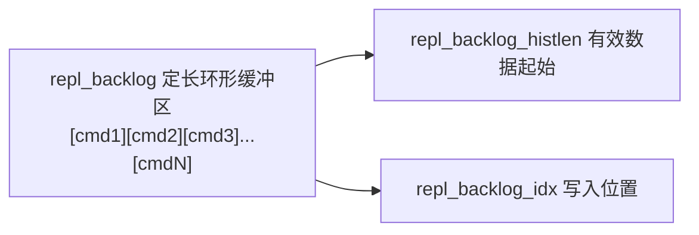
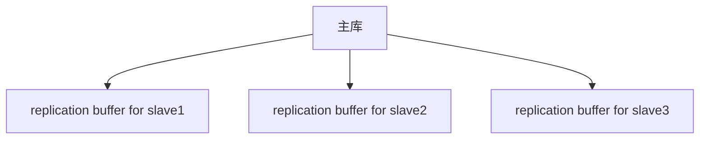

## 知识点地图

- **知识类别**：高可用基础——主从复制的缓冲区体系（repl_backlog、replication buffer、客户端输出缓冲区）与容量调优。
- **解决什么问题**：复制同步流程（见 redis/188）能走「廉价的部分同步」还是退化为「昂贵的全量同步」，由缓冲区装不装得下断线窗口的写入决定；从库消费太慢时，输出缓冲区涨到哪里会触发断开，也由缓冲区配置决定。
- **什么时候用到**：配置复制参数（repl-backlog-size、client-output-buffer-limit）、排查「重连总是全量同步」「从库被主库踢掉」两类故障时，本文是参数与判定的权威出处。

前置：复制的同步流程与 PSYNC 协议（《主从复制基础与同步机制》redis/188-ReplicationBasicsAndPsync）——本文讲「同步背后的内存账本」，两篇分工：188 管机制与运维，本文管缓冲区与调优。

## 1. 复制缓冲区体系

### 1.1 三种复制缓冲区

| 缓冲区              | 位置 | 作用                         | 大小     |
| ------------------- | ---- | ---------------------------- | -------- |
| repl_backlog        | 主库 | 存储最近写命令，支持部分同步 | 默认 1MB |
| replication buffer  | 主库 | 为每个从库维护的输出缓冲区   | 动态增长 |
| replication backlog | 从库 | 接收主库数据的临时缓冲       | 动态     |

三个名字只差一个词，语义完全不同——这是本主题最容易混的知识点。记忆锚点：**backlog 是「写命令的环形历史」，buffer 是「发给某个从库的待发队列」**。前者全局一份、决定重连成本；后者每从库一份、决定从库会不会被踢。

### 1.2 数据流

```
主库写入命令 → repl_backlog（环形缓冲）
             → replication buffer（每从库一个）
                 ↓ 网络传输
             从库接收 → 执行命令
```

每条写命令同时走两条路：进 backlog 留底（给未来可能的断线重连），进各从库的 buffer 排队（给当前的增量传输）。理解了「一份写命令、两类缓冲区」的扇出结构，后面所有溢出问题都能定位到具体哪一路。

## 2. repl_backlog 环形缓冲区

### 2.1 结构



总大小：repl_backlog_size（默认 1MB）。新数据写入 repl_backlog_idx 位置，写满后环绕到开头覆盖最旧数据。

### 2.2 全局偏移量

```
repl_backlog_off: 缓冲区起始位置对应的全局偏移量
master_repl_offset: 主库当前的全局偏移量

有效数据范围: [repl_backlog_off, master_repl_offset]
```

### 2.3 部分同步（PSYNC）

```
从库断线重连时:
1. 发送 PSYNC {runid} {offset}
   - runid: 主库运行ID
   - offset: 从库最后收到的偏移量

2. 主库判断:
   - runid 匹配 且 offset 在 backlog 范围内 → 部分同步
   - 否则 → 全量同步

部分同步:
  主库从 backlog 中提取 [offset, master_repl_offset] 的数据
  发送给从库
```

协议层面的完整流程（PSYNC 命令参数、+CONTINUE/+FULLRESYNC 回复、级联场景）见 redis/188 第 3 节；本文聚焦判定中「backlog 范围」这道数学题。

### 2.4 部分同步判断

```
条件: offset >= repl_backlog_off

如果 offset < repl_backlog_off:
  说明从库缺失的数据已被覆盖 → 全量同步

示例:
  repl_backlog_size = 1MB
  repl_backlog_off = 1000000
  master_repl_offset = 1100000

  从库 offset = 1050000 → 1050000 >= 1000000 → 部分同步
  从库 offset = 900000  → 900000 < 1000000  → 全量同步
```

这个判定的管理含义：backlog 越大，「已被覆盖」的概率越小，重连走部分同步的比例越高。默认 1MB 在写速 10MB/s 的实例上只能覆盖 0.1 秒断线——所以生产实例几乎都要显式调大它，公式见第 5 节。

## 3. replication buffer

### 3.1 作用

主库为每个从库维护一个独立的输出缓冲区，暂存待发送的写命令：



### 3.2 缓冲区溢出

当从库消费速度慢于主库写入速度时，buffer 持续增长：

```
写入速度: 100MB/s
从库消费: 10MB/s
每秒积压: 90MB

1分钟后: 5.4GB → 触发内存限制 → 从库被断开
```

溢出不是「配置失误」而是「能力差距」：从库处理速度跟不上主库写入（CPU 弱、在跑慢命令、网络窄），积压就是物理事实。缓冲区配置决定的是**何时止损**，根治要靠消除从库侧的慢（redis/320 的慢日志定位）或降低主库写速。

### 3.3 缓冲区限制配置

```redis
# 客户端输出缓冲区限制（包括从库）
# 格式: client-output-buffer-limit <class> <hard> <soft> <soft_seconds>

# 从库缓冲区：硬限制 256MB，软限制 64MB 持续 60秒
client-output-buffer-limit replica 256mb 64mb 60

# 普通客户端
client-output-buffer-limit normal 0 0 0

# Pub/Sub 客户端
client-output-buffer-limit pubsub 32mb 8mb 60
```

**触发断开条件**：

- 缓冲区超过硬限制 → 立即断开
- 缓冲区超过软限制持续 N 秒 → 断开

为什么从库与 Pub/Sub 要单独设限而普通客户端默认不限：从库与订阅者的消费节奏不受应用控制（订阅者不读消息，积压就堆在服务端），必须服务端兜底；普通客户端是「问一句答一句」的请求-响应模式，天然有反压。硬限制防「瞬间洪峰」，软限制加持续秒数防「缓慢积压」——两个都配才有完整的止损面。

## 4. 配置优化（缓冲区调优）

（本节是原《主从复制缓冲区》配置内容的缓冲区部分；复制行为参数（repl-ping-replica-period、repl-timeout 等）已归入 redis/188 第 8 节，两文按「缓冲区 vs 机制」分界。）

### 4.1 repl_backlog 大小

```redis
# 根据写入速度和断线时间估算
# 假设: 写入速度 10MB/s，最大断线时间 60s
# backlog 大小 >= 10MB/s × 60s = 600MB

repl-backlog-size 600mb
```

**计算公式**：

$$\text{backlog\_size} \geq \text{write\_rate} \times \text{max\_disconnect\_time}$$

用这条公式前先回答两个问题：你的写入速率是**峰值**不是均值（大促时段的写速才是判定时刻的写速）；你能容忍的最长断线是多久（网络抖动按 30 秒算，跨机房切换按分钟算）。两个输入都取保守值，公式给出的才是真下限。

### 4.2 backlog 专属参数

```redis
# repl_backlog 大小
repl-backlog-size 256mb

# repl_backlog TTL（无从库时多久删除）
repl-backlog-ttl 3600
```

`repl-backlog-ttl` 管的是「最后一个从库断开后，这份环形缓冲区保留多久」——全部分从库都断了还留着 backlog，纯粹占内存；3600 秒意味着 1 小时内从库回来还能部分同步，超过就释放，下次重连必全量。常驻从库拓扑配 3600 够用；「从库每天夜间全量拉一次」的备份型拓扑反而要拉长，因为夜间的断线窗口正是它需要 backlog 的时刻。

### 4.3 监控命令（缓冲区字段）

```redis
# 主库查看复制信息
INFO replication

# 缓冲区相关关键指标:
# repl_backlog_active: 1
# repl_backlog_size: 268435456
# repl_backlog_first_byte_offset: 12345
# repl_backlog_histlen: 268435400
# connected_slaves: 3
# master_repl_offset: 9999999
```

字段解读与运维动作的映射：

- `repl_backlog_histlen` 趋近 `repl_backlog_size`：backlog 快满了，任何从库断线超窗口就全量——按 4.1 公式扩容；
- `master_repl_offset - slaveX.offset`（从库字段里的 offset）：每从库的实时滞后字节数，持续增大是第 3.2 节消费能力不足的信号；
- `repl_backlog_first_byte_offset` 就是判定的 `repl_backlog_off`（第 2.4 节），把它与各从库 offset 对一眼，就能预判「这个从库现在断线重连会走全量还是部分」。

复制状态的完整查询命令（INFO replication 日常用法、ROLE）与故障排查流程见 redis/188 第 6、7 节。

### 4.4 输出缓冲区的动态调整

**基本写法：调整 backlog 与输出缓冲区限制**

```redis
-- backlog 越大，断线重连时部分重同步成功率越高
CONFIG SET repl-backlog-size 512mb

-- 主库无从库时 backlog 释放时间（秒），0=永不释放
CONFIG SET repl-backlog-ttl 3600

-- 客户端输出缓冲区（从库连接）
CONFIG SET client-output-buffer-limit 'replica 256mb 64mb 60'
```

（搬移自原速查系列的复制缓冲区小节——按缓冲区本位保留在本文。）`CONFIG SET` 改的是运行值，重启会回到配置文件值，调整后要同步写进 redis.conf；改大 backlog 立即生效且会重建缓冲区（重连成本一次），建议在低峰执行。

## 5. 工程场景

### 5.1 场景一：重连总是全量同步的根因

一个写密集实例（峰值 40MB/s），从库偶尔因网络抖动断连 5 秒，每次重连都触发全量同步，反过来又压主库带宽制造更多抖动。按 4.1 公式：40MB/s × 30s 容忍窗口 = 1.2GB，原配置 `repl-backlog-size` 默认 1MB——差距三个数量级，这就是「永远全量」的数学解释。把 backlog 调到 1.2GB（内存预算内）后，同样的抖动全部走部分同步，重连开销从「分钟级 + 带宽洪峰」降到「毫秒级」。**教训**：默认 1MB 的 backlog 是给演示用的，写密集生产实例的第一课就是重算这个公式。

### 5.2 场景二：从库被主库踢出的软硬限制演练

大促预演时一个从库因 `KEYS` 类慢命令卡住消费（redis/320 定位），replication buffer 涨到 300MB 触发硬限制被断开——这是配置按预期工作的表现。但同样的实例在断开重连后立刻再涨，循环踢出。处理：先消慢命令（根因），再把 `client-output-buffer-limit replica` 的硬限制从 256mb 提到 1gb 作缓冲垫——注意这只是「让从库多苟一会儿」，缓冲区限制的语义是止损线不是性能旋钮，反复逼近上限就是消费能力不足，回 5.1 的 backlog 与慢命令侧根治。

### 5.3 场景三：低峰缩内存的 backlog 取舍

内存紧张的实例想把 1.2GB 的 backlog 缩下来。评估顺序：先看 `repl_backlog_histlen` 的实际水位——如果长期只有 200MB 的有效历史，说明断线窗口远小于预算值，可以安全缩到 400MB（保留一倍余量）；如果 histlen 长期顶满，说明写速估算偏了，缩它就是把从库推向全量同步。低峰执行 `CONFIG SET` + 同步配置文件，缩完盯一周重连日志确认没有 `Full resync` 出现。

## 6. 动手实践

**任务一**：观测 backlog 的判定线。起主从（redis/188 任务一的拓扑），主库 `CONFIG SET repl-backlog-size 64kb` 后持续写入超过 64kb 的数据，记录此刻 `INFO replication` 的 `repl_backlog_first_byte_offset` 与 `master_repl_offset`；然后模拟从库断线（`CLIENT KILL` 掉复制连接）期间继续写 100kb，重连后看主库日志判定同步方式。

<details>
<summary>任务一参考观察</summary>

断线期间写入 100kb 超过 64kb 的 backlog，从库重连时上报的 offset 小于 repl_backlog_first_byte_offset——主库日志出现 Full resync。把 backlog 调到 1mb 重做，同样断线写入走 Partial resynchronization。自查两个数：判定式 offset >= repl_backlog_first_byte_offset 的两侧各是多少？这验证了 2.4 节的判定就是一行不等式的工程化。
</details>

**任务二**：亲手触发输出缓冲区断开。把 `client-output-buffer-limit replica` 设成极小（`CONFIG SET client-output-buffer-limit 'replica 1mb 512kb 5'`），造一个消费极慢的从库（如 `CLIENT PAUSE` 冻结它的连接，或直接暂停复制线程的实验实例），观察主库什么时候踢掉它、日志里写的是硬限制还是软限制触发。

<details>
<summary>任务二参考观察</summary>

冻结期间积压超过 1mb（硬限制）立即断开，日志出现 `client scheduled to be closed ASAP for overcoming of output buffer hard limit`；若积压爬升缓慢、超过 512kb 且持续 5 秒以上，触发的是软限制（`overcoming of output buffer soft limit ... for 5 seconds`）。两种日志文案的差别让你在故障排查时能直接区分「瞬间洪峰」与「缓慢积压」两类根因。
</details>

**任务三**：为你的生产实例（或实验实例）做一次 backlog 体检：读 `INFO replication` 的写入速率（连续两次 master_repl_offset 差值 ÷ 时间）、`repl_backlog_size` 与 `repl_backlog_histlen` 水位，代入 4.1 公式回答：当前配置能覆盖多长的断线？你愿意容忍多长？差多少？

## 7. 下一步与延伸阅读

- 《主从复制基础与同步机制》（redis/188-ReplicationBasicsAndPsync）：缓冲区服务的同步流程与运维正篇；
- 《无盘复制》（redis/190-DisklessReplication）：全量同步路径上的磁盘替代方案；
- 《哨兵选举》（redis/210-SentinelElection）：failover 后从库重连新主的 PSYNC 行为依赖本文的 backlog；
- 《延迟观测与慢日志》（redis/320-LatencyObservabilityAndSlowlog）：从库消费不足时的根因定位工具。

## 参考与致谢

- Redis 官方文档 Replication：<https://redis.io/docs/latest/operate/oss_and_stack/management/replication/>（CC-BY-SA 4.0），backlog 与输出缓冲区配置说明；
- 本篇正文为教学重写；原《主从复制缓冲区》的缓冲区三节、配置优化中的 backlog 部分与速查系列的「复制缓冲区」小节保留于本文；全量同步流程、非缓冲区参数与其余六个速查小节已搬移至 188 号落位，两文按「缓冲区 vs 机制」分界。
