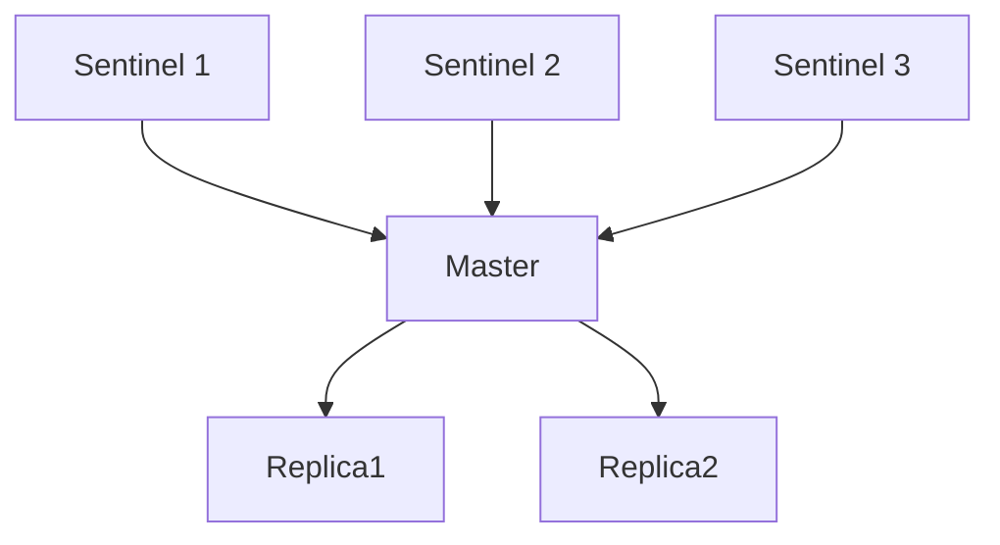

## 知识点地图

- **知识类别**：高可用——Sentinel 哨兵的下线判定（SDOWN/ODOWN）、Leader 选举（类 Raft）与自动故障转移，以及哨兵的命令面与运维。
- **解决什么问题**：主库挂了谁来发现、谁来决定换谁上、客户端怎么知道换了——哨兵把「人肉切换主库」变成自动流程，本文拆开这个流程的每一步判定。
- **什么时候用到**：部署主从 + 哨兵架构时（配置与命令面见 §5-§6）；排查「没触发故障转移」「选出的新主不是预期的」时（判定规则见 §2-§4）。

前置：复制机制（redis/188-ReplicationBasicsAndPsync）——故障转移的本质是「把某个从库提升为主、其余从库改挂它」，不懂复制就看不懂转移的每一步在动什么。

## 1. Sentinel 架构

### 1.1 Sentinel 集群



### 1.2 Sentinel 职责

- **监控**：持续检测主从库是否正常
- **通知**：故障时通知管理员或应用
- **自动故障转移**：主库故障时自动切换
- **配置提供者**：告知客户端当前主库地址

## 2. 下线检测

### 2.1 主观下线（SDOWN）

单个 Sentinel 认为节点不可用：

```
Sentinel 每秒向节点发送 PING
超过 down-after-milliseconds 无有效回复 → 标记为 SDOWN
```

```redis
# 配置
sentinel monitor mymaster 127.0.0.1 6379 2
sentinel down-after-milliseconds mymaster 30000
```

### 2.2 客观下线（ODOWN）

多个 Sentinel 都认为主库不可用：

```
1. Sentinel A 检测到 Master SDOWN
2. Sentinel A 向其他 Sentinel 发送 SENTINEL is-master-down-by-addr
3. 超过 quorum 个 Sentinel 确认 SDOWN → 标记为 ODOWN
4. ODOWN 触发故障转移
```

**quorum**：配置中 `sentinel monitor` 的最后一个参数，表示需要多少个 Sentinel 同意才能判定客观下线。

> 注意区分两个多数：**客观下线（ODOWN）只要求 quorum 个 Sentinel 确认**，
> 而**执行故障转移的 Leader 选举必须获得全体 Sentinel 的多数票（> N/2）**。
> quorum 可以小于多数（如 3 个 Sentinel 配 quorum=2），此时判定下线更快，
> 但 Leader 选举仍需多数 Sentinel 在线，否则故障转移不会发生。
> 另外，SDOWN/ODOWN 只针对主库；从库与 Sentinel 自身的故障只有 SDOWN 状态。

## 3. Leader 选举（类 Raft）

> 准确地说，Sentinel 的 Leader 选举借鉴了 Raft 的「任期 + 多数票」思想，
> 但并不是标准 Raft 实现（无日志复制语义）。官方文档只称其为 leader election。

### 3.1 为什么需要 Leader

只有被选为 Leader 的 Sentinel 才能执行故障转移，避免多个 Sentinel 同时执行。

### 3.2 Raft 选举流程

```
1. Sentinel 确认 Master ODOWN
2. Sentinel 自增 current_epoch（任期号）
3. 向其他 Sentinel 请求投票（SENTINEL is-master-down-by-addr）
4. 其他 Sentinel 每个任期只投一票（先到先得）
5. 获得多数票（> N/2）的 Sentinel 成为 Leader
6. Leader 执行故障转移
```

### 3.3 选举规则

```
规则1: 先到先得（FIFO）— 每个 epoch 只投一票
规则2: 获得多数票 — > ceil(N/2)，N 为 Sentinel 总数
规则3: epoch 递增 — 新选举的 epoch 必须大于当前值
```

**选举示例**（3个 Sentinel）：

```
Sentinel A: epoch=1, 请求投票 → 获得 A(自投), B → 2票 > 1.5 → 成为 Leader
Sentinel B: epoch=1, 请求投票 → 已投给A → 拒绝
Sentinel C: epoch=1, 请求投票 → 已投给A → 拒绝
```

### 3.4 选举超时与重试

```
如果未获得多数票:
  等待随机时间（避免同时发起选举）
  自增 epoch
  重新请求投票

最大重试次数: 无限制
超时时间: 故障转移超时（failover-timeout）
```

## 4. 故障转移

### 4.1 从库选择规则

Leader Sentinel 按以下规则选择新主库：

```
1. 排除下线或断线的从库
2. 排除最近5秒内未回复 INFO 的从库
3. 排除与旧主库断开时间过长的从库
   (down-after-milliseconds * 10)
4. 按优先级选择（replica-priority 越小越优先）
5. 优先级相同，选择复制偏移量最大的（数据最新）
6. 偏移量相同，选择 runid 最小的
```

### 4.2 故障转移步骤

```
步骤1: 选出新主库
  Leader Sentinel 根据上述规则选出最优从库

步骤2: 升级新主库
  向选中的从库发送 SLAVEOF NO ONE（新版语法 REPLICAOF NO ONE），
  停止复制并升为角色 master

步骤3: 修改其他从库的复制目标
  其他从库执行 SLAVEOF new_master

步骤4: 更新 Sentinel 配置
  所有 Sentinel 更新 Master 地址

步骤5: 通知客户端
  客户端通过 Sentinel 获取新 Master 地址
```

### 4.3 故障转移时间线

```
T+0s:    Master 下线
T+30s:   Sentinel 检测到 SDOWN（down-after-milliseconds=30s）
T+31s:   确认 ODOWN，发起 Leader 选举
T+32s:   Leader 选举完成
T+33s:   选出新主库，执行 SLAVEOF NO ONE
T+35s:   其他从库开始复制新主库
T+40s:   故障转移完成
```

## 5. Sentinel 配置最佳实践

### 5.1 推荐配置与启动

```conf
# sentinel.conf 完整配置
port 26379
sentinel monitor mymaster 192.168.1.10 6379 2
sentinel auth-pass mymaster <主库密码>
sentinel down-after-milliseconds mymaster 10000
sentinel parallel-syncs mymaster 1
sentinel failover-timeout mymaster 60000
```

```bash
# 启动方式二选一
redis-sentinel /etc/redis/sentinel.conf
redis-server /etc/redis/sentinel.conf --sentinel

# 集群部署：至少 3 个哨兵节点，分散部署
```

逐项讲解（搬移自原速查系列的哨兵配置小节）：

- `sentinel monitor` 的最后一个参数是 quorum（判定客观下线所需哨兵数），语义见 §2.2；
- `auth-pass` 是哨兵连主库用的口令——主库有 requirepass/ACL 时必配，漏配的表现是哨兵反复报 `-failover-abort-no-good-slave` 或把所有节点判为 SDOWN（它连不上就 PING 不到）；
- `parallel-syncs mymaster 1` 的取值是可用性换速度：1 表示故障转移后从库逐个重挂新主（期间读能力部分下降但新主压力平滑）；设成全部从库数则重挂最快完成、新主瞬时压力最大；
- `failover-timeout` 管整个转移流程的总超时，超时后哨兵会重新发起，生产按「可接受的不可写时长」倒推。

### 5.2 quorum 设置

```
quorum 建议值: ceil(N/2)，N 为 Sentinel 数量

3个 Sentinel: quorum=2
5个 Sentinel: quorum=3

quorum 过低: 可能误判（网络分区时）
quorum 过高: 可能无法触发故障转移
```

### 5.3 客户端连接

```python
# Python 客户端通过 Sentinel 获取 Master
from redis.sentinel import Sentinel

sentinel = Sentinel([
    ('sentinel1', 26379),
    ('sentinel2', 26379),
    ('sentinel3', 26379)
], socket_timeout=0.1)

master = sentinel.master_for('mymaster', password='xxx')
slave = sentinel.slave_for('mymaster', password='xxx')
```

客户端还有一个被动感知切换的通道——订阅哨兵的事件频道（搬移自原速查系列的客户端连接小节）：

```redis
-- 订阅主库切换事件
SUBSCRIBE +switch-master
-- 故障转移后收到：mymaster 192.168.1.10 6379 192.168.1.11 6379

-- 常见事件频道：
-- +switch-master：主库切换
-- +sdown / +odown：主观/客观下线
-- +failover-state-*：故障转移各阶段
-- +slave-reconf-sent：从库重配置
```

主动查询（每次操作前问哨兵要地址）与被动订阅（切换事件来了更新本地缓存）在实践中是**配合关系**：成熟的客户端封装两条都用，订阅只做加速，查询才是权威——订阅通道是发布订阅语义，掉线期间的事件不补发（redis/115）。

> 凭据安全：`password` 对应 Redis 的 requirepass/ACL 口令——生产环境用强随机值并纳入密钥管理，避免明文散落在脚本里；Redis ACL 内部以哈希存储口令，跨公网访问建议启用 TLS。

## 6. 命令面与运维

（整合自原速查系列的哨兵查询、手动故障转移、哨兵运维小节；其中「故障转移原理」一节与正文 §2-§4 完全重复，已去重删除，见批次说明。）

### 6.1 状态查询

```redis
-- 查看所有被监控的主库
SENTINEL masters

-- 查看指定主库详情（含 flags、quorum、down-after-milliseconds 等）
SENTINEL master mymaster

-- 查看主库下的从库列表 / 监控同一主库的其他哨兵
SENTINEL slaves mymaster
SENTINEL sentinels mymaster

-- 客户端连接哨兵查询当前主库地址（故障转移后地址会变）
SENTINEL get-master-addr-by-name mymaster
```

排查「哨兵认为主库是谁」一律从 `SENTINEL get-master-addr-by-name` 开始——它是客户端视角的权威答案；`SENTINEL master` 输出里的 `flags` 字段带 `s_down`/`o_down`/`failover_in_progress` 时，说明该主库正处在对应判定阶段，是判定流程的可视化读数。

### 6.2 手动故障转移与仲裁检查

```redis
-- 手动触发故障转移（计划内换主：硬件更换、版本升级）
SENTINEL failover mymaster

-- 检查当前哨兵数是否足够达成仲裁
SENTINEL ckquorum mymaster
-- 返回 OK 表示可用；返回 error 表示哨兵不足

-- 重置匹配 pattern 的主库监控（清空状态重新发现）
SENTINEL reset my*
```

`SENTINEL failover` 是零停机换主的标准入口：哨兵按 §4.1 的从库选择规则挑一个最优从库提升，全程服务不中断——比「停主库等自动判定」可控得多。日常演练建议每月一次计划内 failover，验证转移流程与客户端重连都真的能跑通；`ckquorum` 部署完必跑一次，它直接告诉你「这套哨兵现在有没有能力执行转移」。

### 6.3 动态配置与持久化

```redis
-- 运行时动态修改哨兵配置（立即生效）
SENTINEL set mymaster down-after-milliseconds 5000
SENTINEL set mymaster parallel-syncs 3
SENTINEL set mymaster quorum 3

-- 动态添加 / 移除监控主库
SENTINEL monitor newmaster 192.168.2.10 6379 2
SENTINEL remove newmaster

-- 将当前哨兵状态写入配置文件（持久化）
SENTINEL flushconfig
```

哨兵有个与其他组件不同的行为：它会把**发现**的从库与其他哨兵自动写回自己的配置文件。因此「改配置文件但不重启」是不生效的——运行中的哨兵以内存配置为准，改动走 `SENTINEL set`；改完想落盘就是 `flushconfig`（哨兵在自动发现后也会自己写一次，所以 sentinel.conf 通常不需要手工维护从库清单）。

## 7. 动手实践

先只读任务与提示，自己操作再展开参考观察。

**任务一：搭三哨兵 + 一主二从的最小拓扑并观察判定链。** 用三个 sentinel.conf（端口 26379/26380/26381，quorum=2）监控同一主库；手动 `kill` 主库进程，依次观察：某个哨兵日志里的 `+sdown`、随后出现的 `+odown`、`+vote-for-leader`、`+switch-master` 事件；转移完成后 `ROLE` 确认新主。

提示：事件出现的顺序就是 §2-§4 的判定链；`+sdown` 与 `+odown` 的时间差反映其他哨兵确认的速度。

<details>
<summary>任务一参考观察</summary>

事件链：`+sdown master mymaster ...`（单哨兵判定）→ `+odown master mymaster #quorum 2/2`（收集到 quorum 票）→ `+new-epoch` 与 `+vote-for-leader`（Leader 选举）→ `+selected-slave`（按 §4.1 规则选从）→ `+switch-master mymaster 旧地址 新地址`。自查：你的 down-after-milliseconds 设了多少秒？`+sdown` 出现的时刻与 kill 时刻的差是否约等于它？这验证了 SDOWN 判定就是「PING 无响应时长超过阈值」的工程化。
</details>

**任务二：验证「两个多数」的区别。** 在任务一拓扑上把 quorum 调成 1（`SENTINEL set mymaster quorum 1`），kill 主库后记录从 `+sdown` 到 `+odown` 的时间；再改回 quorum=2，把三个哨兵停掉一个，kill 主库观察转移是否还能发生。

<details>
<summary>任务二参考观察</summary>

quorum=1 时 `+odown` 几乎与 `+sdown` 同时出现（自己一票就够）——判定更快但也更容易误判（一次网络抖动就触发转移）；停掉一个哨兵后 quorum=2 的拓扑里剩 2 个哨兵，判定可以完成（2 个都同意），但 Leader 选举需要多数票（2/3 的多数是 2），刚好够——再停一个就彻底无法转移。这验证了正文引言的两个多数：ODOWN 只看 quorum，执行转移必须多数哨兵在线，quorum 调低买不来转移能力。
</details>

**任务三：写一份故障转移演练预案。** 给生产（或实验）拓扑回答：计划内换主用什么命令？换主前后客户端怎么感知？如果 `SENTINEL ckquorum` 返回 error，先检查哪三件事？

<details>
<summary>任务三参考设计</summary>

计划内换主：低峰执行 `SENTINEL failover mymaster`，全程零停机（§6.2）；客户端感知靠主动查询（get-master-addr-by-name）或订阅 +switch-master 自动重连（§5.3）。ckquorum 报 error 的三查：哨兵进程是否都在（SENTINEL sentinels mymaster 的列表数）、哨兵之间网络是否互通（它们靠 Pub/Sub 互相发现）、sentinel monitor 指向的主库别名是否一致。这题的要点：预案先于故障写好，演练（任务一）验证过才算数。
</details>

## 参考与致谢

- Redis 官方文档 Sentinel：<https://redis.io/docs/latest/operate/oss_and_stack/management/sentinel/>（CC-BY-SA 4.0），下线判定、Leader 选举与 SENTINEL 命令族说明；
- 本篇正文为教学重写；原速查系列六小节中，哨兵配置并入 §5.1、查询命令/手动故障转移/哨兵运维整合为 §6、客户端事件订阅并入 §5.3；「故障转移原理」一节与正文 §2-§4 完全重复，已去重删除（事实全部保留于正文）。
