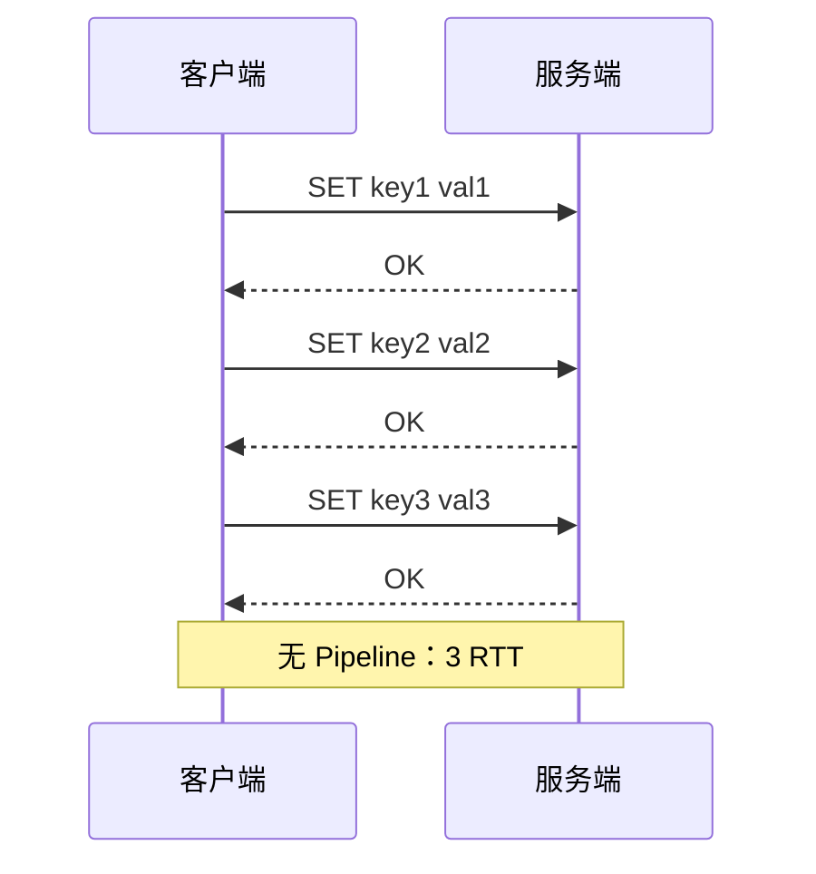

## 知识点地图

- **知识类别**：编程与原子性——Pipeline 管道（省 RTT）、Multi/Exec 事务（批量执行）、WATCH 乐观锁（CAS）三种手段的机制与边界。
- **解决什么问题**：多条命令的执行要么慢（逐条 RTT）、要么不原子（并发穿插）。本文讲清三件事：Pipeline 只省网络不保证原子；事务保证「一起执行」但不支持回滚；真正要「判断 + 执行」原子语义时用 WATCH 或 Lua。
- **什么时候用到**：批量写入（Pipeline）、批量原子执行（事务）、检查后再写（WATCH）、复杂原子逻辑（Lua，redis/240）；第 5 节选型表是拿不准时的决策出口。

**适用边界一句话**：Pipeline 是网络层的优化（不保证原子、不保证隔离）；事务是执行层的打包（不保证回滚）——两者都不提供「逻辑原子性」，需要它的去 redis/240。

## 1. Pipeline 管道

### 1.1 为什么需要 Pipeline

Redis 客户端与服务端通过 TCP 通信，每次命令都有网络往返延迟（RTT）：



有 Pipeline：客户端一次性发送 3 条命令，服务端返回 OK, OK, OK，总计 1 RTT

### 1.2 Pipeline 性能对比

```
10000 次 PING 命令:
  无 Pipeline: ~1s (10000 × 0.1ms RTT)
  有 Pipeline: ~2ms (1 RTT + 处理时间)

提升: ~500倍
```

### 1.3 Pipeline 使用

```python
# Python redis-py
import redis
r = redis.Redis()

# 使用 Pipeline
pipe = r.pipeline()
for i in range(10000):
    pipe.set(f'key:{i}', f'value:{i}')
pipe.execute()  # 一次性发送所有命令
```

### 1.4 Pipeline 注意事项

```
1. Pipeline 不是原子性的
   - 命令之间可能插入其他客户端的命令
   - 部分命令可能失败，其他命令仍执行

2. Pipeline 不是事务
   - 不保证隔离性
   - 不支持回滚

3. 避免超大 Pipeline
   - 一次发送过多命令会阻塞服务端
   - 建议每批 100-1000 条

4. Pipeline 命令数限制
   - Redis 输入缓冲区默认 1GB
   - 超过会被断开连接
```

## 2. 事务（Multi/Exec）

### 2.1 事务基本用法

```redis
MULTI         # 开启事务
SET key1 val1 # 命令入队
SET key2 val2 # 命令入队
INCR counter  # 命令入队
EXEC          # 执行所有命令
```

```
执行流程:
  MULTI → 事务状态
  SET key1 val1 → QUEUED
  SET key2 val2 → QUEUED
  INCR counter  → QUEUED
  EXEC → 1) OK  2) OK  3) 1
```

### 2.2 事务的 ACID 分析

| 特性   | Redis 事务         | 关系数据库事务 |
| ------ | ------------------ | -------------- |
| 原子性 | 部分（不支持回滚） | 完全支持       |
| 一致性 | 单命令一致         | 完全支持       |
| 隔离性 | 无隔离级别         | 多级隔离       |
| 持久性 | 取决于持久化配置   | 完全支持       |

### 2.3 Redis 事务的"原子性"

```
情况1: 命令语法错误 → 整个事务取消
  MULTI
  SET key1 val1
  INVALID_COMMAND   ← 语法错误
  EXEC → 报错，所有命令不执行

情况2: 命令运行时错误 → 仅错误命令失败，其他正常执行
  MULTI
  SET key1 val1
  INCR key1         ← key1 不是整数，运行时报错
  SET key2 val2
  EXEC → 1) OK  2) (error)  3) OK  ← key2 正常设置！

结论: Redis 事务不支持回滚，不保证原子性
```

### 2.4 DISCARD 取消事务

```redis
MULTI
SET key1 val1
DISCARD    # 取消事务，所有命令不执行
```

## 3. WATCH 乐观锁

### 3.1 WATCH 机制

WATCH 实现 CAS（Compare-And-Swap）乐观锁：

```redis
# 监视 key
WATCH counter

# 读取值
GET counter  # 返回 5

# 计算新值（应用层）
new_val = 5 + 1 = 6

# 开启事务
MULTI
SET counter 6
EXEC
```

**如果其他客户端在 WATCH 和 EXEC 之间修改了 counter**：

```redis
# 事务A
WATCH counter
GET counter  # 5
# 此时事务B执行: SET counter 100
MULTI
SET counter 6
EXEC         # 返回 nil（事务取消，因为 counter 被修改）
```

### 3.2 WATCH 实现秒杀

```python
import redis

def seckill(user_id, item_id):
    r = redis.Redis()
    key = f'stock:{item_id}'

    while True:
        try:
            r.watch(key)
            stock = int(r.get(key) or 0)
            if stock <= 0:
                r.unwatch()
                return False  # 库存不足

            pipe = r.pipeline()
            pipe.multi()
            pipe.decr(key)
            pipe.sadd(f'users:{item_id}', user_id)
            pipe.execute()
            return True
        except redis.WatchError:
            continue  # 重试
```

### 3.3 WATCH 的限制

```
1. WATCH 只能检测键是否被修改，不能检测具体修改内容
2. WATCH 是乐观锁，高并发下重试开销大
3. WATCH 在 EXEC 后自动取消
4. WATCH 不支持条件表达式（只能监视整个键）
```

## 4. Pipeline + 事务

### 4.1 组合使用

```python
# Pipeline 中使用事务
pipe = r.pipeline()
pipe.multi()           # 开启事务
pipe.set('key1', 'v1')
pipe.set('key2', 'v2')
pipe.incr('counter')
pipe.execute()         # 提交事务

# 等价于
pipe = r.pipeline(True)  # transaction=True
pipe.set('key1', 'v1')
pipe.set('key2', 'v2')
pipe.incr('counter')
pipe.execute()
```

### 4.2 性能对比

```
10000 次 SET 操作:

1. 逐条执行:     ~1s     (10000 RTT)
2. Pipeline:     ~2ms    (1 RTT)
3. Multi/Exec:   ~1s     (10000 RTT + 事务开销)
4. Pipeline+事务: ~3ms    (1 RTT + 事务开销)

结论: Pipeline+事务 兼顾性能与原子性
```

## 5. 替代方案

### 5.1 Lua 脚本

需要真正原子性时，使用 Lua 脚本：

```redis
-- 原子性秒杀
local stock = tonumber(redis.call('GET', KEYS[1]))
if stock and stock > 0 then
    redis.call('DECR', KEYS[1])
    redis.call('SADD', KEYS[2], ARGV[1])
    return 1
end
return 0
```

### 5.2 方案选择（与 Lua/Functions 的互链选型表）

| 场景                 | 推荐方案       | 为什么 / 深入阅读 |
| -------------------- | -------------- | ------------------ |
| 批量写入，无需原子性 | Pipeline       | 只要省 RTT，本文 §1 |
| 多命令需原子执行     | Multi/Exec     | 打包执行即可，本文 §2（注意不回滚） |
| 条件更新（CAS）      | WATCH + Multi  | 检查后写、冲突重试，本文 §3 |
| 复杂原子操作         | Lua 脚本       | 「判断 + 执行」原子化，见《Lua 脚本原子执行》redis/240 |
| 高并发 CAS           | 分布式锁 + Lua | 锁的语义与续期，见 redis/250；脚本函数化管理见《Redis Functions》redis/245 |

选型再压缩成一句：**不要求原子选 Pipeline；要求「一起执行」选事务；要求「条件执行」选 WATCH；要求「逻辑原子」选 Lua——Lua 的版本化管理就是 redis/245 的 Functions。**

## 参考与致谢

- Redis 官方文档 Pipelining 与 Transactions：<https://redis.io/docs/latest/develop/use/pipelining/> 与 <https://redis.io/docs/latest/develop/interact/transactions/>（CC-BY-SA 4.0）；
- 原文末「命令速查」附录五节（Pipeline 管道、事务基本用法、WATCH 乐观锁、Pipeline + 事务、Lua 脚本替代方案）经逐节比对与正文 §1-§5 完全重复，已整体去重删除，命令示例全部保留于正文对应小节（登记于批次 summary）。
