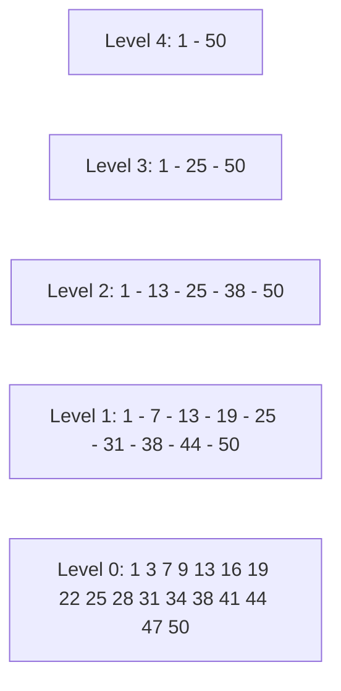
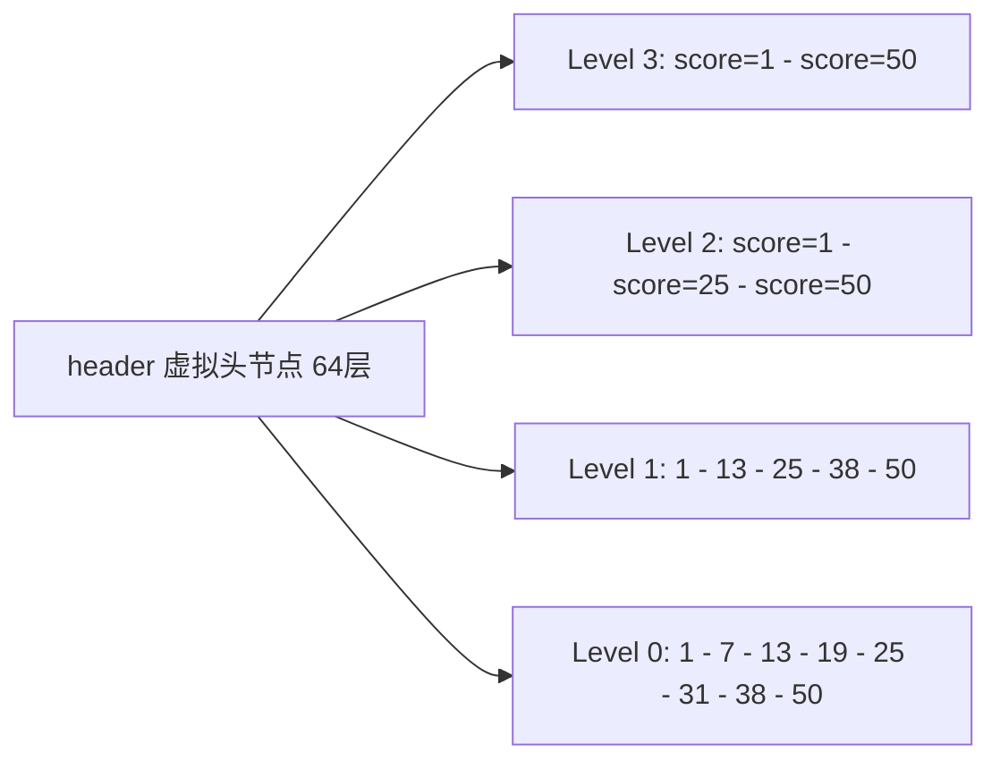

## 1. 跳表原理

### 1.1 从链表到跳表

跳表（Skip List）是对有序链表的多层索引扩展，实现 $O(\log n)$ 查找：



**查找过程**（查找 31）：

```
Level 4: 1 → 50 (31 < 50, 下降)
Level 3: 1 → 25 (31 > 25, 继续) → 50 (31 < 50, 下降)
Level 2: 25 → 38 (31 < 38, 下降)
Level 1: 25 → 31 (找到!)
```

### 1.2 跳表 vs 平衡树

| 维度       | 跳表             | 红黑树      | B+树        |
| ---------- | ---------------- | ----------- | ----------- |
| 查找       | $O(\log n)$      | $O(\log n)$ | $O(\log n)$ |
| 插入       | $O(\log n)$      | $O(\log n)$ | $O(\log n)$ |
| 范围查询   | 简单（链表遍历） | 复杂        | 简单        |
| 实现复杂度 | 简单             | 复杂        | 中等        |
| 并发友好   | 好（局部锁）     | 差（旋转）  | 中等        |
| 内存开销   | 多层指针         | 3指针/节点  | 页对齐      |

## 2. Redis 跳表实现

### 2.1 数据结构

```c
// 跳表节点
typedef struct zskiplistNode {
    sds ele;                          // 成员对象
    double score;                     // 分值
    struct zskiplistNode *backward;   // 后退指针（Level 0）
    struct zskiplistLevel {
        struct zskiplistNode *forward;  // 前进指针
        unsigned long span;             // 跨度（到下一节点的距离）
    } level[];                        // 层数组（柔性数组）
} zskiplistNode;

// 跳表
typedef struct zskiplist {
    struct zskiplistNode *header, *tail;
    unsigned long length;             // 节点数量
    int level;                        // 最大层数
} zskiplist;
```

### 2.2 层级结构



每个节点的 level 数量随机生成（1-32 层），span 记录到下一节点的跳过节点数，用于计算排名

### 2.3 随机层数生成

```c
#define ZSKIPLIST_MAXLEVEL 32
#define ZSKIPLIST_P 0.25  // 晋升概率 1/4

int zslRandomLevel(void) {
    int level = 1;
    while ((random() & 0xFFFF) < (ZSKIPLIST_P * 0xFFFF))
        level += 1;
    return (level < ZSKIPLIST_MAXLEVEL) ? level : ZSKIPLIST_MAXLEVEL;
}
```

**各层概率**：

$$P(level = k) = (1/4)^{k-1} \times 3/4$$

| 层数 | 概率   | 1百万节点中约 |
| ---- | ------ | ------------- |
| 1    | 75%    | 750,000       |
| 2    | 18.75% | 187,500       |
| 3    | 4.69%  | 46,875        |
| 4    | 1.17%  | 11,719        |
| ...  | ...    | ...           |
| 32   | 极小   | ~0            |

## 3. 有序集合（ZSET）

### 3.1 ZSET 底层结构

Redis 有序集合使用**跳表 + 哈希表**双重结构：

```c
typedef struct zset {
    dict *dict;              // 哈希表：member → score（O(1) 查找分数）
    zskiplist *zsl;          // 跳表：score 排序（O(log n) 范围查询）
} zset;
```

```
哈希表: {"alice" → 85, "bob" → 92, "charlie" → 78}
跳表:   [78:charlie] → [85:alice] → [92:bob]
```

### 3.2 编码选择

```
元素数 <= 128 且所有元素长度 <= 64 字节 → ziplist（Redis 7.0 前）/ listpack（7.0+）
否则 → skiplist + dict
```

```sql
-- 查看编码
OBJECT ENCODING myzset
-- "ziplist" 或 "skiplist"
```

### 3.3 为什么同时需要两个结构

| 操作   | 仅哈希表 | 仅跳表          | 哈希表+跳表     |
| ------ | -------- | --------------- | --------------- |
| ZSCORE | $O(1)$   | $O(\log n)$     | $O(1)$          |
| ZRANGE | $O(n)$   | $O(\log n + m)$ | $O(\log n + m)$ |
| ZRANK  | $O(n)$   | $O(\log n)$     | $O(\log n)$     |
| ZADD   | $O(1)$   | $O(\log n)$     | $O(\log n)$     |

## 4. 核心操作

### 4.1 插入节点

```
1. 在哈希表中查找 member，存在则更新 score
2. 在跳表中查找插入位置（记录每层的前驱节点）
3. 随机生成层数
4. 创建节点并插入各层链表
5. 更新 span 值
6. 在哈希表中添加 member → score
```

### 4.2 范围查询

```redis
# 按 score 范围查询
ZRANGEBYSCORE myzset 80 100

# 按排名范围查询
ZRANGE myzset 0 9

# 带分数返回
ZRANGE myzset 0 9 WITHSCORES
```

**ZRANGEBYSCORE 执行流程**：

```
1. 从跳表 Level 0 查找第一个 score >= min 的节点
2. 沿 Level 0 链表遍历，直到 score > max
3. 收集所有满足条件的节点
4. 时间复杂度: O(log n + m)，m 为结果数量
```

### 4.3 排名计算

```redis
# 查询 member 的排名
ZRANK myzset alice
```

**排名计算利用 span**：

```
从最高层开始，累加 span 直到找到目标节点
rank = Σ span（沿路径经过的所有 span 之和）
时间复杂度: O(log n)
```

## 5. 跳表性能分析

### 5.1 时间复杂度

| 操作     | 平均            | 最坏   |
| -------- | --------------- | ------ |
| 查找     | $O(\log n)$     | $O(n)$ |
| 插入     | $O(\log n)$     | $O(n)$ |
| 删除     | $O(\log n)$     | $O(n)$ |
| 范围查询 | $O(\log n + m)$ | $O(n)$ |
| 排名     | $O(\log n)$     | $O(n)$ |

### 5.2 空间复杂度

$$E(\text{总指针数}) = n \times \sum_{k=1}^{\infty} \frac{1}{4^{k-1}} = n \times \frac{4}{3} \approx 1.33n$$

每个节点平均 1.33 个前进指针，加上 span 和 backward，空间开销约为纯链表的 2-3 倍。

## 6. 命令补充：条件写入、聚合与按排名删除

上文聚焦底层结构，这里补齐日常真正高频的命令面，可在 redis-cli 直接验证。

```redis
# 添加与更新（ZADD 的条件选项 6.2+）
ZADD leaderboard 100 "Alice" 95 "Bob" 88 "Charlie"
ZADD leaderboard XX 105 "Alice"     # 仅更新已存在成员，不新增
ZADD leaderboard NX 92 "David"      # 仅添加新成员，不更新已有
ZADD leaderboard GT 110 "Alice"     # 仅当新分数更大时才更新（打点类场景防回退）
ZADD leaderboard LT 80 "Bob"        # 仅当新分数更小时才更新

# 排名与分数
ZSCORE leaderboard "Alice"          # 分数
ZRANK leaderboard "Alice"           # 升序排名（从 0 开始）
ZREVRANK leaderboard "Alice"        # 降序排名（排行榜第 N 名就是它）

# 范围查询：分数区间与排名区间两套口径
ZRANGEBYSCORE leaderboard 90 100 WITHSCORES   # 分数 90~100
ZRANGEBYSCORE leaderboard (90 +inf            # ( 前缀表示开区间，>90
ZCOUNT leaderboard 90 100
ZRANGE leaderboard 0 9 WITHSCORES             # 按排名取前 10（升序）
ZREVRANGE leaderboard 0 9 WITHSCORES          # 降序前 10（排行榜惯用）

# 删除的三种口径
ZREM leaderboard "Charlie"
ZREMRANGEBYRANK leaderboard 0 2               # 按排名区间删
ZREMRANGEBYSCORE leaderboard -inf 60          # 按分数区间删（清理低分）

# 多集合聚合：权重与聚合方式
ZUNIONSTORE result 2 zset1 zset2 WEIGHTS 1 2 AGGREGATE SUM
ZINTERSTORE result 2 zset1 zset2 AGGREGATE MAX
```

两个易错点：

- `ZRANGEBYSCORE` 的开区间写法是 `(90`（括号贴着数值），不是数学里的
  `>90`；闭区间直接写 `90`。
- `ZADD GT/LT` 只影响「是否更新分数」，成员不存在时仍然会新增——
  「只在更优时更新，且绝不新增」需要 GT/LT 再配合 XX 一起用。

