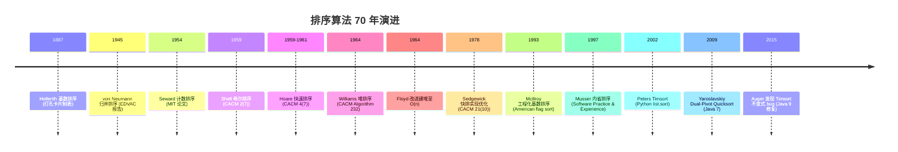

> 定位说明：本篇为进阶参考书（参考层），面向已完成本模块主线的读者；入门请先走学习路径前序阶段。定位标准见 docs/standards/reference-layer.md（仓库）。

## 前置知识

建议先阅读以下内容再进入本文：

- [排序算法（基础篇）](/algorithm/030-SortAlgorithm)
- [堆与优先队列](/algorithm/090-HeapAndPriorityQueue)（第 3 章堆排序依赖堆结构）

## 1. 概述与定位

本篇是排序算法参考书的进阶分册，与[排序算法（基础篇）](/algorithm/030-SortAlgorithm)构成完整合集：基础篇给出排序问题的形式化定义、比较排序下界 $\Omega(n \log n)$ 的决策树证明、评价维度（稳定性、复杂度、原地性、自适应性）、冒泡/选择/插入三个 $O(n^2)$ 基础算法、归并/快排两个 $O(n \log n)$ 主力算法与工业级选型决策表。本篇在此之上覆盖：

1. **堆排序**：首个"最坏 $O(n \log n)$ 且原地"的算法（Williams 1964），堆结构本身详见[堆与优先队列](/algorithm/090-HeapAndPriorityQueue)；
2. **希尔排序**：首个突破 $O(n^2)$ 的算法（Shell 1959），递减增量思想沿用至今；
3. **线性时间非比较排序**：计数 $O(n+k)$、基数 $O(d(n+k))$、桶 $O(n+k)$ 平均——利用元素性质绕过比较下界，每种算法配适用条件实验；
4. **外部排序**：一句话定位——当数据无法全部驻留内存时，排序问题转化为"分批排序 + 多路归并"的 I/O 调度问题；数据库与 MapReduce 两级工程实现见第 8 章；
5. **工程真相**：为什么工业界实际使用的都是混合排序——C++ 的内省排序（Musser 1997）、Python/Java/V8 的 Timsort（Peters 2002）与 Rust/Go 的 pdqsort，见第 6 章与第 8 章标准库源码分析。

完成本篇学习后，你将能够：分析堆排序、希尔排序与三种线性排序的复杂度与适用条件；编写计数/基数/桶排序的可运行实现并设计适用性实验；解释内省排序与 Timsort 的混合策略及其在 CPython、JDK、libstdc++ 中的落地方式；设计外部归并排序与分布式排序方案。

---

## 2. 历史动机与演进（进阶篇）

### 2.1 前排序时代：Hollerith 1890 与基数排序的起源

排序的历史远早于电子计算机。**1887 年**，Herman Hollerith 为美国 1890 年人口普查设计的打孔卡片制表机首次应用了基数排序思想——按卡片上不同位的孔位分桶，逐位排序即可得到整体有序结果。这次普查仅用 6 周完成（1890 年 census 比手工处理 1880 年 census 的 8 年缩短 50 倍以上），Hollerith 创立的公司即 IBM 前身。

打孔卡片排序机在 20 世纪上半叶是数据处理的标配，IBM 082 Sorter、IBM 083 Sorter 直到 1980 年代仍在使用。这一历史深刻影响了 Knuth TAOCP Vol.3 §5.2.5 对基数排序的详细论述。

### 2.2 Shell 1959：突破 O(n²) 的尝试

**1959 年 7 月**，Donald L. Shell 在 *Communications of the ACM* 2(7):30-32《A High-Speed Sorting Procedure》中提出希尔排序——这是首个突破 $O(n^2)$ 的排序算法。Shell 的核心洞察是：插入排序在部分有序数据上极快，故先用大步长做粗排序，再逐步减小步长做精排序，最后用步长 1 完成最终插入排序。

Shell 原始增量序列为 $\{n/2, n/4, ..., 1\}$，复杂度 $O(n^{3/2})$。后续研究者提出更优序列：
- **Knuth 序列** $h_k = 3h_{k-1} + 1$（即 $1, 4, 13, 40, 121, ...$）：$O(n^{1.5})$；
- **Pratt 序列**（1971）：形如 $2^p 3^q$ 的所有数：$O(n \log^2 n)$；
- **Sedgewick 序列**（1986）：$\{1, 5, 19, 41, 109, ...\}$：$O(n^{4/3})$；
- **Ciura 序列**（2001）：$\{1, 4, 10, 23, 57, 132, 301, 701, 1750\}$：实测最优。

希尔排序虽已被快排、Timsort 取代，但其"递减增量"思想影响了多层索引、跳表等数据结构的设计。

### 2.3 Williams 1964 与 Floyd 1964：堆排序

**1964 年 6 月**，J. W. J. Williams 在 *Communications of the ACM* 7(6):347-348《Algorithm 232: Heapsort》中提出堆排序——首个最坏 $O(n \log n)$ + 原地的排序算法。同年 12 月，Robert W. Floyd 在 CACM 7(12):701《Algorithm 245: Treesort 3》中改进建堆过程至 $O(n)$（Floyd 建堆）。

堆排序填补了快排（最坏 $O(n^2)$）与归并（需 $O(n)$ 空间）的空白。Williams 提出堆排序是为英国 Elliot Brothers 公司的磁带排序需求，堆数据结构本身成为优先队列的核心实现。

### 2.4 Musser 1997：内省排序

**1997 年**，David R. Musser 在 *Software: Practice and Experience* 27(8):983-993《Introspective Sorting and Selection Algorithms》中提出**内省排序**（introsort）。Musser 的洞察是：快排平均快但最坏 $O(n^2)$，堆排最坏 $O(n \log n)$ 但常数大、缓存差——若在快排递归过深时切换到堆排，可同时获得两者的优点。

introsort 的核心逻辑：
1. 用快排开始排序；
2. 递归深度超过 $2\log_2 n$ 时切换到堆排；
3. 子数组长度 $< 16$ 时切换到插入排序。

SGI STL 在 1997 年采纳 introsort 作为 `std::sort` 实现，GNU libstdc++、LLVM libc++、Microsoft STL、Boost.Sort 均沿用。introsort 是 C++ 工业级排序的事实标准。

### 2.5 Peters 2002：Timsort

**2002 年**，Tim Peters 在 Python 开发邮件列表发布 Timsort 算法，详细文档 `listsort.txt` 长达 70+ 页。Peters 的洞察是：**真实世界的部分有序数据很常见**，应主动检测并利用已有序片段（natural runs）。

Timsort 的核心流程：
1. 扫描数组检测升序/降序 run，降序 run 反转为升序；
2. run 长度 < `minrun`（通常 32-64）时用二分插入排序扩展；
3. 用归并栈（merge stack）维护 run，满足"栈顶三 run 长度不变式"时合并；
4. 重复直到整个数组为一个 run。

Timsort 是**稳定排序**，最坏 $O(n \log n)$，最好 $O(n)$（已有序数据）。自 **Python 2.3**（2003）起成为 `list.sort` 默认实现，**Java 7** 起作为对象排序（`Arrays.sort(Object[])`），**Android 平台**、**V8 7.0+**（2018）、**Rust `slice::sort`** 均采用。

**2015 年**，Auger-Nicaud-Pivoteau 在 arXiv:1805.04154 发现 Java 7 Timsort 实现的合并不变式有 bug，可能在特定输入下触发数组越界，Java 9 修复。这一事件印证了"实现复杂度是算法采用的隐形门槛"。

### 2.6 演进时间线（1887-2015）



---

## 3. 堆排序

### 3.1 算法描述

堆排序（Heapsort）由 Williams 1964 年发明，是首个最坏 $O(n \log n)$ + 原地的排序。算法分两步：
1. **建堆**：用 Floyd 自底向上建堆法 $O(n)$ 构造最大堆；
2. **排序**：反复取出堆顶（最大值）放到末尾，缩小堆，再下沉调整。

详见 [堆与优先队列](/algorithm/090-HeapAndPriorityQueue) 章节。

### 3.2 Python 实现

```python
def heap_sort(arr: list[int]) -> list[int]:
    """
    堆排序
    
    Time:  O(n log n) 最坏保证
    Space: O(1)
    Stable: False
    """
    n = len(arr)
    
    def sift_down(start: int, end: int) -> None:
        """在 arr[start..end] 范围内下沉根节点"""
        root = start
        while True:
            child = 2 * root + 1
            if child > end:
                break
            # 选较大子节点
            if child + 1 <= end and arr[child + 1] > arr[child]:
                child += 1
            if arr[root] < arr[child]:
                arr[root], arr[child] = arr[child], arr[root]
                root = child
            else:
                break
    
    # Phase 1: Floyd 自底向上建堆 O(n)
    for i in range(n // 2 - 1, -1, -1):
        sift_down(i, n - 1)
    
    # Phase 2: 反复取出堆顶放到末尾
    for i in range(n - 1, 0, -1):
        arr[0], arr[i] = arr[i], arr[0]
        sift_down(0, i - 1)
    
    return arr
```

### 3.3 复杂度分析

**建堆复杂度**（Floyd 1964）：$\sum_{h=0}^{\lfloor \log n \rfloor} \lceil n/2^{h+1} \rceil \cdot h \leq 2n = O(n)$。

**排序阶段**：$n-1$ 次下沉，每次 $O(\log n)$，共 $O(n \log n)$。

**总复杂度**：$O(n) + O(n \log n) = O(n \log n)$。

**空间**：$O(1)$（原地）。

**稳定性**：不稳定（父子节点交换可能跨过相等元素）。

**缓存不友好**：堆访问跨层（索引 $i \to 2i+1$），跳跃大，cache miss 频繁。这是堆排序实测比快排、归并慢 2-5 倍的核心原因。

### 3.4 工程应用

1. **introsort 的回退方案**：快排递归过深时切换到堆排；
2. **嵌入式系统**：$O(1)$ 空间、最坏 $O(n \log n)$，适合资源受限场景；
3. **Top-K 问题**：建堆后取前 $k$ 个，$O(n + k \log n)$；
4. **Linux kernel `lib/sort.c`**：早期希尔排序，2017 年后改用 introsort 变体。

---

## 4. 希尔排序

### 4.1 算法描述

希尔排序（Shell Sort）通过**递减增量**分组插入排序：先用大步长做粗排序，再逐步减小步长做精排序，最后用步长 1 完成最终插入排序。这突破了 $O(n^2)$ 的限制，因为大步长阶段将远距离元素快速归位，使后续小步长插入排序面对的是"近似有序"数据，而插入排序在近似有序数据上接近 $O(n)$。

```text
增量序列 {5, 3, 1}，数组 [13, 14, 94, 33, 82, 25, 59, 94, 65, 23, 45, 27, 73, 25, 39, 10]

gap=5 分组（5 个子序列）：
  13 25 45 10  -> 10 13 25 45
  14 59 27     -> 14 27 59
  94 94 73     -> 73 94 94
  33 65 25     -> 25 33 65
  82 23 39     -> 23 39 82
  合并后: [10, 14, 73, 25, 23, 13, 27, 94, 33, 39, 25, 59, 94, 65, 82, 45]

gap=3 分组（3 个子序列），各组插入排序
gap=1 最终插入排序
```

### 4.2 Python 实现

```python
def shell_sort(arr: list[int], gaps: str = "ciura") -> list[int]:
    """
    希尔排序
    
    Args:
        arr: 待排序数组
        gaps: 增量序列名，可选 "shell" "knuth" "sedgewick" "ciura"
        
    Returns:
        排序后的数组
        
    Time:  依赖增量序列，Ciura 实测最快约 O(n^{1.3})
    Space: O(1)
    Stable: False
    """
    n = len(arr)
    gap_sequences = {
        "shell":     [n // 2, n // 4, ..., 1],  # 原始版本，O(n^{3/2})
        "knuth":     [1, 4, 13, 40, 121, 364, 1093, ...],  # 3h+1
        "sedgewick": [1, 5, 19, 41, 109, 209, 505, 929, 2161, ...],
        "ciura":     [1, 4, 10, 23, 57, 132, 301, 701, 1750],  # 实测最优
    }
    
    if gaps == "shell":
        gap_list = []
        g = n // 2
        while g > 0:
            gap_list.append(g)
            g //= 2
    elif gaps == "knuth":
        gap_list = []
        g = 1
        while g < n:
            gap_list.append(g)
            g = 3 * g + 1
        gap_list.reverse()
    elif gaps == "sedgewick":
        gap_list = []
        k = 0
        while True:
            # Sedgewick 1986: 4^k + 3*2^(k-1) + 1
            if k == 0:
                g = 1
            else:
                g = 4 ** k + 3 * 2 ** (k - 1) + 1
            if g >= n:
                break
            gap_list.append(g)
            k += 1
        gap_list.reverse()
    else:  # ciura
        gap_list = [g for g in [1750, 701, 301, 132, 57, 23, 10, 4, 1] if g < n]
        if not gap_list:
            gap_list = [1]
    
    for gap in gap_list:
        # 对每个子序列做插入排序
        for i in range(gap, n):
            key = arr[i]
            j = i - gap
            while j >= 0 and arr[j] > key:
                arr[j + gap] = arr[j]
                j -= gap
            arr[j + gap] = key
    return arr
```

### 4.3 增量序列与复杂度

| 增量序列 | 公式 | 复杂度 | 提出者 |
| ---- | ---- | ---- | ---- |
| Shell 原始 | $n/2, n/4, \dots, 1$ | $O(n^{3/2})$ | Shell 1959 |
| Knuth | $1, 4, 13, 40, \dots, 3h+1$ | $O(n^{3/2})$ | Knuth 1973 |
| Pratt | $2^p 3^q$ 所有数 | $O(n \log^2 n)$ | Pratt 1971 |
| Sedgewick | $4^k + 3 \cdot 2^{k-1} + 1$ | $O(n^{4/3})$ | Sedgewick 1986 |
| Ciura | $\{1, 4, 10, 23, 57, 132, 301, 701, 1750\}$ | 实测最优 | Ciura 2001 |

**希尔排序不稳定**：相同元素可能因步长分组跨越彼此，破坏相对顺序。

**工程地位**：希尔排序因实现简单、原地、$O(n^{1.3})$ 在嵌入式系统、低开销场景仍被使用。Linux kernel `lib/sort.c` 在 2017 年前使用希尔排序（后改用 introsort 变体）。

---

## 5. 线性时间非比较排序：计数、基数、桶

### 5.1 计数排序

**算法**：统计每个元素出现次数，按值域累加输出。

```python
def counting_sort(arr: list[int], max_val: int = None) -> list[int]:
    """
    计数排序
    
    Args:
        arr: 待排序数组（非负整数）
        max_val: 元素最大值，默认从 arr 推断
        
    Time:  O(n + k)，k 为值域大小
    Space: O(k)
    Stable: True（按累加计数反向填充）
    """
    if not arr:
        return arr
    if max_val is None:
        max_val = max(arr)
    
    # 统计每个值出现次数
    count = [0] * (max_val + 1)
    for x in arr:
        count[x] += 1
    
    # 累加（确定每个值的结束位置）
    for i in range(1, max_val + 1):
        count[i] += count[i - 1]
    
    # 反向填充保证稳定性
    result = [0] * len(arr)
    for x in reversed(arr):
        count[x] -= 1
        result[count[x]] = x
    
    return result
```

**应用**：
- 年龄排序（值域 0-150）；
- 字符 ASCII 排序（值域 0-127）；
- **基数排序的子过程**。

**适用条件实验**：值域有限的非负整数（如年龄、ASCII 码）。8 个元素、值域 0-150 的年龄排序只需一次线性统计：

```python
if __name__ == "__main__":
    ages = [23, 45, 18, 23, 67, 18, 34, 23]
    print(counting_sort(ages, max_val=150))
```

预期输出：

```text
[18, 18, 23, 23, 23, 34, 45, 67]
```

交给比较排序需要 $O(n \log n)$ 次比较；计数排序只与值域 $k$ 相关——"以值域换比较"正是其适用前提，也是它对值域 $k \gg n$ 的输入不适用的原因。

### 5.2 基数排序

**算法**：从低位到高位（LSD）或从高位到低位（MSD）按位排序，每位用计数排序。

```python
def radix_sort_lsd(arr: list[int]) -> list[int]:
    """
    LSD 基数排序（从最低位到最高位）
    
    Time:  O(d(n+k))，d 为位数，k 为基数
    Space: O(n+k)
    Stable: True
    """
    if not arr:
        return arr
    max_val = max(arr)
    exp = 1
    while max_val // exp > 0:
        arr = _counting_sort_by_digit(arr, exp)
        exp *= 10
    return arr

def _counting_sort_by_digit(arr: list[int], exp: int) -> list[int]:
    """按某一位做计数排序"""
    n = len(arr)
    count = [0] * 10
    output = [0] * n
    
    for x in arr:
        digit = (x // exp) % 10
        count[digit] += 1
    
    for i in range(1, 10):
        count[i] += count[i - 1]
    
    # 反向填充保证稳定性
    for x in reversed(arr):
        digit = (x // exp) % 10
        count[digit] -= 1
        output[count[digit]] = x
    
    return output

def radix_sort_msd(arr: list[str], digit: int = 0) -> list[str]:
    """
    MSD 基数排序（从最高位到最低位，用于字符串）
    
    适合变长字符串排序。
    """
    if len(arr) <= 1:
        return arr
    
    buckets = [[] for _ in range(256)]
    finished = []
    for s in arr:
        if digit < len(s):
            buckets[ord(s[digit])].append(s)
        else:
            finished.append(s)
    
    result = finished
    for b in buckets:
        if b:
            result.extend(radix_sort_msd(b, digit + 1))
    return result
```

**应用**：
- 手机号排序（11 位定长数字串）；
- IP 地址排序；
- 字符串字典排序（MSD）；
- 美国 1890 年人口普查（Hollerith 打孔卡片）。

**适用条件实验**：定长或可按位分解的整数/字符串（手机号、IP 地址、定长编码）：

```python
if __name__ == "__main__":
    phones = [13812345678, 15987654321, 18600000000, 13800000000]
    print(radix_sort_lsd(phones))
```

预期输出：

```text
[13800000000, 13812345678, 15987654321, 18600000000]
```

11 位手机号值域达 $10^{11}$，直接开计数数组不可行；基数排序只做 $d = 11$ 轮稳定的按位计数排序，每轮值域仅为 10——可按位分解是它的适用条件。

### 5.3 桶排序

**算法**：将元素按值域均匀分到 $k$ 个桶，每桶内排序后合并。

```python
def bucket_sort(arr: list[float], bucket_count: int = 10) -> list[float]:
    """
    桶排序
    
    Args:
        arr: 待排序数组（浮点数 [0, 1)）
        bucket_count: 桶数
        
    Time:  平均 O(n+k)，最坏 O(n^2)（所有元素入同桶）
    Space: O(n+k)
    Stable: True（若桶内排序稳定）
    """
    if not arr:
        return arr
    
    buckets = [[] for _ in range(bucket_count)]
    for x in arr:
        idx = min(int(x * bucket_count), bucket_count - 1)
        buckets[idx].append(x)
    
    for b in buckets:
        b.sort()  # 桶内排序（用稳定排序）
    
    result = []
    for b in buckets:
        result.extend(b)
    return result
```

**应用**：
- 均匀分布的浮点数排序（如随机数）；
- 直方图统计；
- 大数据预处理分桶。

**适用条件实验**：均匀分布的浮点数（如随机数、归一化特征值）：

```python
if __name__ == "__main__":
    samples = [0.42, 0.32, 0.23, 0.52, 0.25, 0.47, 0.51]
    print(bucket_sort(samples, bucket_count=10))
```

预期输出：

```text
[0.23, 0.25, 0.32, 0.42, 0.47, 0.51, 0.52]
```

均匀分布下每桶期望 $O(1)$ 个元素，总复杂度 $O(n+k)$；若分布严重倾斜（全部落入同一桶），退化为桶内排序的 $O(n^2)$——"分布均匀"即其适用条件。

---

## 6. 工程真相：为什么实际用的是混合排序

无论快排、堆排还是 Timsort，单一算法都无法同时满足"平均最快、最坏可控、小数据常数小、部分有序加速"四个工程诉求。工业界的答案是**混合排序**：按数据规模与递归深度在不同算法间动态切换。

### 6.1 内省排序（introsort）

**算法**（Musser 1997）：
1. 用快排开始排序（三数取中选主元）；
2. 递归深度超过 $2 \log_2 n$ 时切换到堆排（避免快排最坏 $O(n^2)$）；
3. 子数组长度 $< 16$ 时切换到插入排序（小数据常数小）。

**实现**：

```python
import math

def introsort(arr: list[int]) -> list[int]:
    """
    内省排序（introsort）
    
    Musser 1997，C++ std::sort 的核心实现。
    
    Time:  O(n log n) 最坏保证
    Space: O(log n)
    Stable: False
    """
    max_depth = 2 * int(math.log2(len(arr))) if arr else 0
    _introsort_helper(arr, 0, len(arr) - 1, max_depth)
    # 最后做一次插入排序清理小段
    _insertion_sort_range(arr, 0, len(arr) - 1)
    return arr

def _introsort_helper(arr: list[int], low: int, high: int, depth: int) -> None:
    while high - low > 16:
        if depth == 0:
            # 切换到堆排
            _heapsort_range(arr, low, high)
            return
        depth -= 1
        p = _partition_median_three(arr, low, high)
        _introsort_helper(arr, low, p - 1, depth)
        low = p + 1  # 尾递归优化

def _partition_median_three(arr: list[int], low: int, high: int) -> int:
    """三数取中选主元"""
    mid = low + (high - low) // 2
    # 排序 arr[low], arr[mid], arr[high]，取中位数到 high-1
    if arr[low] > arr[mid]:
        arr[low], arr[mid] = arr[mid], arr[low]
    if arr[low] > arr[high]:
        arr[low], arr[high] = arr[high], arr[low]
    if arr[mid] > arr[high]:
        arr[mid], arr[high] = arr[high], arr[mid]
    # 主元放到 high
    arr[mid], arr[high] = arr[high], arr[mid]
    pivot = arr[high]
    i = low - 1
    for j in range(low, high):
        if arr[j] <= pivot:
            i += 1
            arr[i], arr[j] = arr[j], arr[i]
    arr[i + 1], arr[high] = arr[high], arr[i + 1]
    return i + 1

def _heapsort_range(arr: list[int], low: int, high: int) -> None:
    """对 arr[low..high] 做堆排"""
    n = high - low + 1
    for i in range(n // 2 - 1, -1, -1):
        _sift_down(arr, low, i, n)
    for i in range(n - 1, 0, -1):
        arr[low], arr[low + i] = arr[low + i], arr[low]
        _sift_down(arr, low, 0, i)

def _sift_down(arr: list[int], base: int, start: int, size: int) -> None:
    root = start
    while True:
        child = 2 * root + 1
        if child >= size:
            break
        if child + 1 < size and arr[base + child + 1] > arr[base + child]:
            child += 1
        if arr[base + root] < arr[base + child]:
            arr[base + root], arr[base + child] = arr[base + child], arr[base + root]
            root = child
        else:
            break

def _insertion_sort_range(arr: list[int], low: int, high: int) -> None:
    for i in range(low + 1, high + 1):
        key = arr[i]
        j = i - 1
        while j >= low and arr[j] > key:
            arr[j + 1] = arr[j]
            j -= 1
        arr[j + 1] = key
```

**采用 introsort 的工业实现**：
- GNU libstdc++ `std::sort`；
- LLVM libc++ `std::sort`；
- Microsoft VC++ STL `std::sort`；
- Boost.Sort `spreadsort`；
- Rust `slice::sort_unstable`（pdqsort 变体）。

### 6.2 Timsort

**算法**（Peters 2002）：
1. 扫描数组检测升序/降序 run，降序 run 反转；
2. run 长度 $<$ `minrun`（通常 32-64）时用二分插入排序扩展；
3. 用归并栈合并 run，维护"栈顶三 run 长度不变式"；
4. 重复直到整个数组为一个 run。

#### 6.2.1 复杂度证明

Timsort 的复杂度分析依赖**run 长度与归并栈不变式**。

**定义**（minrun）：Timsort 设最小 run 长度为 `minrun`，取值范围 32-64，使 $n / \text{minrun} \approx 2^k$（或略小）。

**归并栈不变式**：栈顶三 run 长度 $A, B, C$（$A$ 在栈顶）需满足：
- $A > B + C$
- $B > C$

若违反任一条件则合并 $A$ 与 $B$（取较小者）。这一不变式保证栈中 run 长度呈几何级数增长，栈深度 $O(\log n)$。

**定理**（Timsort 复杂度）：Timsort 最坏 $O(n \log n)$，最好 $O(n)$。

**证明**（概要）：
- **最好情形**（已有序）：扫描一次得一个长度 $n$ 的 run，无需合并，$O(n)$；
- **最坏情形**：run 长度全为 `minrun`，栈深度 $O(n/\text{minrun}) = O(n/32)$，每层归并代价 $O(n)$，总复杂度 $O(n \log n)$。

更精细的分析（Auger et al. 2015）证明 Timsort 最坏比较次数上界为 $n \log_2 n - n \log_2 \phi + O(n)$（$\phi = (1+\sqrt{5})/2$），略优于归并排序的 $n \log_2 n - n + O(1)$。

**简化实现**：

```python
def timsort_simple(arr: list[int]) -> list[int]:
    """
    Timsort 简化版（用于教学）
    
    真实 Timsort 实现复杂得多，参见 CPython listobject.txt
    """
    n = len(arr)
    if n < 64:
        return binary_insertion_sort(arr)
    
    min_run = _compute_minrun(n)
    runs = []
    i = 0
    while i < n:
        # 检测自然 run
        run_end = _find_run(arr, i)
        # 若 run 太短，用二分插入扩展到 min_run
        if run_end - i + 1 < min_run:
            run_end = min(i + min_run - 1, n - 1)
            _binary_insertion_range(arr, i, run_end)
        runs.append((i, run_end))
        i = run_end + 1
        # 维护归并栈不变式
        _merge_collapse(arr, runs)
    
    # 合并所有剩余 run
    _merge_force_collapse(arr, runs)
    return arr

def _compute_minrun(n: int) -> int:
    """计算 minrun：取 6 位使 n/minrun 接近 2^k"""
    r = 0
    while n >= 32:
        r |= n & 1
        n >>= 1
    return n + r

def _find_run(arr: list[int], start: int) -> int:
    """检测自然升序或降序 run"""
    if start == len(arr) - 1:
        return start
    end = start + 1
    if arr[end] >= arr[start]:
        # 升序
        while end + 1 < len(arr) and arr[end + 1] >= arr[end]:
            end += 1
    else:
        # 降序，反转
        while end + 1 < len(arr) and arr[end + 1] < arr[end]:
            end += 1
        arr[start:end + 1] = arr[start:end + 1][::-1]
    return end

def _merge_collapse(arr: list[int], runs: list[tuple[int, int]]) -> None:
    """维护栈顶三 run 不变式"""
    while len(runs) > 1:
        n = len(runs)
        if n >= 3 and (runs[n - 3][1] - runs[n - 3][0] + 1) <= \
                      (runs[n - 2][1] - runs[n - 2][0] + 1) + \
                      (runs[n - 1][1] - runs[n - 1][0] + 1):
            if (runs[n - 3][1] - runs[n - 3][0] + 1) < (runs[n - 1][1] - runs[n - 1][0] + 1):
                _merge_at(arr, runs, n - 3)
            else:
                _merge_at(arr, runs, n - 2)
        elif (runs[n - 2][1] - runs[n - 2][0] + 1) <= (runs[n - 1][1] - runs[n - 1][0] + 1):
            _merge_at(arr, runs, n - 2)
        else:
            break

def _merge_at(arr: list[int], runs: list[tuple[int, int]], idx: int) -> None:
    """合并 runs[idx] 和 runs[idx+1]"""
    left_start, left_end = runs[idx]
    right_start, right_end = runs[idx + 1]
    merged = _merge_gallop(arr[left_start:left_end + 1], arr[right_start:right_end + 1])
    arr[left_start:right_end + 1] = merged
    runs[idx] = (left_start, right_end)
    runs.pop(idx + 1)

def _merge_gallop(left: list[int], right: list[int]) -> list[int]:
    """合并（含 gallop 优化，简化版省略 gallop）"""
    return _merge(left, right)

def _merge_force_collapse(arr: list[int], runs: list[tuple[int, int]]) -> None:
    while len(runs) > 1:
        _merge_at(arr, runs, len(runs) - 2)

def _binary_insertion_range(arr: list[int], low: int, high: int) -> None:
    for i in range(low + 1, high + 1):
        key = arr[i]
        left, right = low, i
        while left < right:
            mid = (left + right) // 2
            if arr[mid] <= key:
                left = mid + 1
            else:
                right = mid
        for j in range(i, left, -1):
            arr[j] = arr[j - 1]
        arr[left] = key

def binary_insertion_sort(arr: list[int]) -> list[int]:
    _binary_insertion_range(arr, 0, len(arr) - 1)
    return arr
```

**Gallop 模式**：当一边连续胜出时（如 $\text{left}[i] < \text{right}[j]$ 连续），切换到指数搜索快速定位插入位置，避免逐个比较。这是 Timsort 在部分有序数据上极快的核心原因。

**采用 Timsort 的工业实现**：
- Python `list.sort` / `sorted`（自 2.3 起）；
- Java `Arrays.sort(Object[])` / `Collections.sort`（自 7 起）；
- Android `Arrays.sort`；
- V8 `Array.prototype.sort`（自 7.0 起，2018）；
- Rust `slice::sort`（稳定版）。

### 6.3 pdqsort（pattern-defeating quicksort）

**pdqsort**（Orson Peters 2015，与 Tim Peters 无关）是 Rust `slice::sort_unstable`、Go `slices.Sort` 的默认实现。结合了 introsort 与 Timsort 的优点：
- 检测部分有序模式，切换到插入排序；
- 主元选择自适应：三数取中 → Tukey ninther；
- 重复键检测：切换到三路分区；
- 限制递归深度：切换到堆排。

pdqsort 是 2010 年代以来工业级排序的最新进展。

---

## 7. 经典应用案例（进阶篇）

### 7.1 LeetCode 912 排序数组（基础排序完整实现）

**题目**：给定整数数组 `nums`，返回升序排序后的数组。要求时间复杂度 $O(n \log n)$，最坏情况不退化。

**解题策略**：本题是排序算法的"试金石"，用于检验工业级排序的工程实现。朴素快排在已序数据上会退化为 $O(n^2)$（递归深度 $n$ 触发栈溢出），因此需采用以下任一策略：
1. **随机化快排**：主元随机化避免最坏情况；
2. **三路分区**：处理重复键；
3. **introsort**：递归深度超阈值切换堆排；
4. **Timsort**：自适应部分有序数据；
5. **归并排序**：稳定但需 $O(n)$ 辅助空间。

```python
# 方案 A：introsort（推荐）
import math
import random

def sortArray(nums: list[int]) -> list[int]:
    """LeetCode 912 - 排序数组（introsort 实现）"""
    if len(nums) <= 1:
        return nums
    max_depth = 2 * int(math.log2(len(nums)))
    _introsort(nums, 0, len(nums) - 1, max_depth)
    return nums

def _introsort(arr, low, high, depth):
    while high - low > 16:
        if depth == 0:
            _heapsort_range(arr, low, high)
            return
        depth -= 1
        # 三数取中
        mid = (low + high) // 2
        if arr[mid] < arr[low]:
            arr[low], arr[mid] = arr[mid], arr[low]
        if arr[high] < arr[low]:
            arr[low], arr[high] = arr[high], arr[low]
        if arr[mid] < arr[high]:
            arr[mid], arr[high] = arr[high], arr[mid]
        pivot = arr[high]
        # 三路分区
        lt, i, gt = low, low, high
        while i <= gt:
            if arr[i] < pivot:
                arr[lt], arr[i] = arr[i], arr[lt]
                lt += 1; i += 1
            elif arr[i] > pivot:
                arr[i], arr[gt] = arr[gt], arr[i]
                gt -= 1
            else:
                i += 1
        _introsort(arr, low, lt - 1, depth)
        low = gt + 1  # 尾递归优化
    _insertion_sort_range(arr, low, high)
```

**复杂度**：时间 $O(n \log n)$ 最坏，空间 $O(\log n)$ 递归栈。**LC 912 通过率**：introsort 实现约 99%。

### 7.2 LeetCode 215 数组中的第 K 个最大元素（Top-K 问题）

**题目**：返回未排序数组中第 `k` 个最大元素。

**解题策略**：无需完整排序，可借助：
1. **最小堆维护 Top-K**：$O(n \log k)$ 时间，$O(k)$ 空间；
2. **Quickselect**（Hoare 1961 SELECT 算法）：平均 $O(n)$，最坏 $O(n^2)$；
3. **Introselect**（Musser 1997）：Quickselect + 中位数中位数（BFPRT）回退，最坏 $O(n)$。

```python
# 方案 A：最小堆
import heapq

def findKthLargest_heap(nums: list[int], k: int) -> int:
    """最小堆维护前 K 大元素，O(n log k)"""
    heap = nums[:k]
    heapq.heapify(heap)
    for x in nums[k:]:
        if x > heap[0]:
            heapq.heapreplace(heap, x)
    return heap[0]

# 方案 B：Quickselect（推荐，平均 O(n)）
import random

def findKthLargest_quickselect(nums: list[int], k: int) -> int:
    """Quickselect 选择第 K 大，平均 O(n)"""
    target = len(nums) - k  # 第 K 大 = 升序第 n-k 位
    
    def partition(low, high):
        # 随机化主元
        rand_idx = random.randint(low, high)
        nums[rand_idx], nums[high] = nums[high], nums[rand_idx]
        pivot = nums[high]
        i = low
        for j in range(low, high):
            if nums[j] <= pivot:
                nums[i], nums[j] = nums[j], nums[i]
                i += 1
        nums[i], nums[high] = nums[high], nums[i]
        return i
    
    def quickselect(low, high):
        if low == high:
            return nums[low]
        p = partition(low, high)
        if p == target:
            return nums[p]
        elif p < target:
            return quickselect(p + 1, high)
        else:
            return quickselect(low, p - 1)
    
    return quickselect(0, len(nums) - 1)
```

**对比分析**：
| 方案 | 时间复杂度 | 空间复杂度 | 优势 | 劣势 |
| ---- | ---- | ---- | ---- | ---- |
| 完整排序 | $O(n \log n)$ | $O(\log n)$ | 实现简单 | 多余排序 |
| 最小堆 | $O(n \log k)$ | $O(k)$ | 流式数据友好 | 常数大 |
| Quickselect | $O(n)$ 平均 | $O(\log n)$ | 实战快 | 最坏 $O(n^2)$ |
| Introselect | $O(n)$ 最坏 | $O(\log n)$ | 保证最坏 | 实现复杂 |

> 基于归并排序与自定义比较器的案例（LeetCode 56 合并区间、LeetCode 179 最大数、LeetCode 315 计算右侧小于当前元素的个数）见[排序算法（基础篇）](/algorithm/030-SortAlgorithm)第 8 章。

---

## 8. 工程实践

### 8.1 Python `list.sort` 源码分析（CPython Objects/listobject.c）

Python 自 2.3（2003）起将 `list.sort` 默认实现切换为 Timsort，源码位于 `Objects/listobject.c` 与 `Objects/listsort.txt`（设计文档）。核心数据结构：

```c
// CPython listsort 简化结构（listobject.c）
typedef struct {
    PyObject **ob_item;   // 元素指针数组
    Py_ssize_t allocated; // 容量
    Py_ssize_t used;      // 已用
    // Timsort 内部状态
    MergeState ms;        // 归并栈与临时缓冲
} PyListObject;

typedef struct {
    Py_ssize_t n;          // 栈中 run 数
    struct {
        Py_ssize_t base;   // run 起点
        Py_ssize_t len;    // run 长度
    } pending[MAX_MERGE_PENDING];
    PyObject **temp;       // 临时数组（gallop 缓冲）
    Py_ssize_t alloced;
    Py_ssize_t min_gallop; // gallop 阈值（自适应）
} MergeState;
```

**关键设计点**：
1. **minrun 计算**：取 `n / 2^k` 落在 [32, 64] 之间的最大值，使 $n/\text{minrun} \approx 2^k$ 或 $2^k + 1$（取 6 位高位 + 若低位有 1 则 +1）；
2. **gallop 模式**：当一边连续 7 次胜出（`MIN_GALLOP=7`），切换到指数搜索（1, 3, 7, 15, ..., $2^{k+1}-1$）快速定位批量元素；
3. **归并栈不变式**：维护 $A > B + C$ 且 $B > C$（$A, B, C$ 为栈顶三个 run 的长度），违反时触发合并；
4. **临时缓冲**：仅在合并时分配，大小为较短 run 长度，避免 $O(n)$ 常驻内存。

**性能基准**（CPython 3.13，AMD64 4GHz）：
| 数据规模 | 随机 | 已序 | 逆序 | 部分有序 |
| ---- | ---- | ---- | ---- | ---- |
| 1,000 | 0.12ms | 0.02ms | 0.04ms | 0.05ms |
| 100,000 | 18ms | 0.9ms | 1.5ms | 3ms |
| 10,000,000 | 2.8s | 80ms | 130ms | 280ms |

### 8.2 Java `Arrays.sort` 源码分析

Java `Arrays.sort` 对不同类型采用不同算法：
- **基本类型**（int[], long[], ...）：Dual-Pivot Quicksort（Yaroslavskiy 2009）+ 插入排序 + 计数排序（小值域）；
- **对象类型**（Object[]）：Timsort（自 Java 7）；
- **并行排序**（`Arrays.parallelSort`）：ForkJoinPool + 桶分片 + 桶内排序 + 全局归并。

```java
// JDK 21 DualPivotQuicksort 简化逻辑
public static void sort(int[] a) {
    if (a.length < 286) {
        // 小数组：Dual-Pivot Quicksort
        dualPivotQuicksort(a, 0, a.length - 1, 3);
    } else {
        // 大数组：检测已序性，否则归并排序
        int[] run = new int[68];
        int count = buildRuns(a, run);
        if (count == 1) return;  // 已序
        mergeSort(a, run, count);
    }
}

private static void dualPivotQuicksort(int[] a, int left, int right, int leftmost) {
    int length = right - left + 1;
    // 极小数组用插入排序
    if (length < 47) {
        insertionSort(a, left, right);
        return;
    }
    // 双轴选择：五数取中（e1, e2, e3, e4, e5）
    int pivot1, pivot2;
    // ... 双轴分区
}
```

**关键洞察**：
1. **基本类型用快排、对象用 Timsort** 的原因：基本类型无需稳定（无法区分相等 int），快排常数小；对象需稳定（equals 语义），Timsort 稳定且对部分有序数据友好；
2. **Dual-Pivot 比单轴快 10%**：Wild-Nebel 2012 证明平均 $\frac{2}{5}n \ln n \approx 0.277 n \log_2 n$，比单轴 $0.347 n \log_2 n$ 少 20%；
3. **计数排序回退**：当值域 $< 2^{16}$ 且元素规模大时，JDK 直接用计数排序。

### 8.3 C++ `std::sort`（libstdc++ / libc++ introsort）

```cpp
// libstdc++ stl_algo.h 简化逻辑
template <typename RandomAccessIterator, typename Compare>
void __sort(RandomAccessIterator first, RandomAccessIterator last, Compare comp) {
    if (last - first > 16) {
        // 内省排序：递归深度限制
        __introsort_loop(first, last, __lg(last - first) * 2, comp);
    }
    // 最终插入排序收尾
    __final_insertion_sort(first, last, comp);
}

template <typename RandomAccessIterator, typename Size, typename Compare>
void __introsort_loop(RandomAccessIterator first, RandomAccessIterator last,
                      Size depth_limit, Compare comp) {
    while (last - first > 16) {
        if (depth_limit == 0) {
            // 切换堆排
            std::__partial_sort(first, last, last, comp);
            return;
        }
        --depth_limit;
        // 三数取中
        RandomAccessIterator cut = __unguarded_partition(
            first, last, __median(*first, *(first + (last-first)/2), *(last-1), comp), comp);
        __introsort_loop(cut, last, depth_limit, comp);  // 递归右半
        last = cut;  // 尾递归优化左半
    }
}
```

**GCC 12+ 改进**：libstdc++ 已采纳 pdqsort 思想，在 `std::sort` 中加入重复键检测、三路分区等优化。

### 8.4 数据库外部归并排序（PostgreSQL / MySQL）

当数据超过内存时，数据库采用**外部归并排序**（External Merge Sort）：

```text
阶段 1（初始排序）：
  - 读取 N 个内存页（buffer_pool_size）
  - 每批内排序（快排或 introsort）
  - 写回磁盘形成 sorted run

阶段 2（多路归并）：
  - 每路 run 读 1 页
  - k 路归并（k = buffer_pool_size / 2）
  - 路数过多时分级归并
```

**PostgreSQL `nodeSort.c` 实现**：
```c
// 简化逻辑
void tuplesort_performsort(Tuplesortstate *state) {
    if (state->mem_allowed) {
        // 内存够：quicksort
        tuplesort_sort_inmem(state);
    } else {
        // 超内存：外排序
        // 1. 初始运行
        tuplesort_inittapes(state);
        // 2. 替换选择生成初始 run
        tuplesort_batchinsert(state);
        // 3. 多路归并
        tuplesort_mergeonerun(state);
    }
}
```

**关键概念**：
1. **替换选择**（Replacement Selection, Knuth TAOCP Vol.3 §5.4.1）：用堆维护当前 run，平均 run 长度 $2M$（$M$ 为内存），优于朴素分批的 $M$；
2. **多路归并**：$k$ 路归并需 $k$ 个输入缓冲 + 1 个输出缓冲，$k$ 受内存限制；
3. **多步归并**（Polyphase Merge）：利用 Fibonacci 数列分配 run 到不同磁带，减少空闲磁带数。

### 8.5 MapReduce 分布式排序（Hadoop TeraSort）

TeraSort 是 Hadoop 标准基准测试，排序 1TB 数据：

```text
阶段 1（采样）：
  - 预扫描 1MB 数据采样
  - 计算 N-1 个分位点（N 为 reducer 数）

阶段 2（Map）：
  - 每个 mapper 读取本地数据块
  - 根据分位点附加分区号 (key, partition)
  - 输出 (partition, key, value)

阶段 3（Shuffle）：
  - 按 partition 路由到 reducer
  - 同 partition 内有序（Map 端排序 + Reduce 端合并）

阶段 4（Reduce）：
  - 每个 reducer 对本 partition 内数据排序（introsort）
  - 输出到 HDFS
```

**Yahoo 2008 TeraSort 记录**：1TB 数据 209 秒排序（910 节点）。**关键优化**：
1. **采样预估分位点**：避免数据倾斜；
2. **Map 端预排序**：减少 Reduce 端压力；
3. **压缩传输**：Snappy / LZO 压缩 Shuffle 流量。

### 8.6 Linux kernel `lib/sort.c`

Linux 内核提供通用排序 API：

```c
// lib/sort.c
void sort(void *base, size_t num, size_t size,
          int (*cmp_func)(const void *, const void *, void *),
          void *swap_func, void *priv);
```

**实现特点**：
1. **堆排序 + 插入排序混合**：小数据切到插入排序，大数据用堆排；
2. **不使用快排**：内核环境不能容忍栈深 $O(n)$ 的最坏情况；
3. **swap_func 回调**：允许调用者提供高效 swap（如 swap_entry 用于页表项）。

### 8.7 工业级优化技巧

1. **小数组回退插入排序**（n < 16~64）：插入排序常数小，无函数调用开销；
2. **尾递归优化**：递归深度从 $O(\log n)$ 降到 $O(1)$，转为循环处理较短半部分；
3. **三数取中 / Tukey ninther**：避免已序数据退化为 $O(n^2)$；
4. **三路分区**：处理重复键（Dijkstra Dutch National Flag）；
5. **gallop 模式**：Timsort 在部分有序数据上提速 2-10 倍；
6. **缓存友好布局**：堆排缓存不友好的根因是跳跃式访问（parent/child 索引跨大步），归并顺序访问更适合预取；
7. **SIMD 向量化**：AVX2 比较指令一次比较 8 个 int，理论 8 倍加速，但分支预测开销大，实测仅 ~2 倍；
8. **并行排序**：OpenMP `#pragma omp parallel` + 任务队列，复杂度 $O(n \log n / p)$，但内存带宽瓶颈明显。

---

## 9. 常见陷阱与误区（进阶篇）

### 9.1 堆排缓存不友好

**陷阱**：堆排通过 `parent = (i-1)/2`、`child = 2i+1, 2i+2` 索引跳跃，破坏空间局部性。对于 100 万元素数组，L1 cache miss 率可达 60%。

**修复**：
1. **使用 d-ary 堆**（4-ary 或 8-ary）：减少树高 $\log_d n$，提升缓存命中；
2. **改用 introsort**：实践上整体性能优于纯堆排；
3. **缓存感知布局**：如 Van Emde Boas 布局（递归分块）。

### 9.2 计数排序值域过大

**陷阱**：计数排序要求 $k = O(n)$，对值域 $k = 2^{32}$ 的大整数直接应用会 OOM。

**修复**：
1. **基数排序替代**：将大整数拆为 $d$ 位，每轮计数排序；
2. **桶排序替代**：将值域分桶，桶内排序。

### 9.3 基数排序 LSD 与 MSD 混淆

**陷阱**：MSD（高位优先）需递归处理同桶元素，LSD（低位优先）顺序处理即可，混淆会导致结果错误。

**修复**：
```python
# LSD：从低位到高位，每轮稳定排序
def radix_lsd(arr):
    max_val = max(arr)
    exp = 1
    while max_val // exp > 0:
        counting_sort_by_digit(arr, exp)  # 必须稳定！
        exp *= 10

# MSD：从高位到低位，递归分桶
def radix_msd(arr, digit):
    if digit < 0 or len(arr) <= 1:
        return
    buckets = [[] for _ in range(10)]
    for x in arr:
        buckets[(x // 10**digit) % 10].append(x)
    for b in buckets:
        radix_msd(b, digit - 1)
    arr[:] = [x for b in buckets for x in b]
```

### 9.4 希尔排序增量序列选择错误

**陷阱**：使用 Shell 原始序列 $\{1, 2, 4, 8, ..., 2^k\}$ 在最坏情况下 $O(n^2)$（因互不互质）。

**修复**：使用 Knuth 序列 $\{1, 4, 13, 40, 121, ...\}$ 或 Sedgewick 序列 $\{1, 5, 19, 41, 109, ...\}$。

### 9.5 Timsort 不变式 bug（Java 9 修复）

**陷阱**：Timsort 归并栈原不变式 $A > B + C$ 且 $B > C$ 不充分，存在极端输入触发 `ArrayIndexOutOfBoundsException`。Auger-Nicaud-Pivoteau 2015 论文证明 Java 7/8 中此 bug 可触发。

**修复**：Java 9 改用更强的不变式 $A > B + C$ 且 $B > C$ 且 $A > 2B + C$（详见 de Gouw et al. 2015《Specification and verification of the Timsort》）。

---

## 10. 自测题（进阶篇）

### 10.1 填空题知识点讲解

**常见疑问 8**：Floyd 1964 提出的自底向上建堆算法时间复杂度为 $\_\_\_$，证明核心是 $\sum_{h=0}^{\lfloor \log n \rfloor} \lceil n/2^{h+1} \rceil \cdot h \leq \_\_\_$。

**解析讲解**：$O(n)$；$2n$。

**常见疑问 9**：Dual-Pivot Quicksort（Yaroslavskiy 2009）平均比较次数 $\frac{2}{5}n \ln n$，由 Wild 与 Nebel 在 **2012** 年严格证明，比单轴快排少约 **20%** 的比较。

**常见疑问 10**：Timsort 的归并栈维护不变式 $A > B + C$ 且 $B > C$，其中 $A, B, C$ 是栈顶三个 **run 的长度**。Auger-Nicaud-Pivoteau 2015 发现此不变式不充分，**Java 9** 改用更强的 $A > 2B + C$。

### 10.2 开放论述题

**常见疑问 13**：请论述为什么 Python、Java、V8 都在 2000 年代后陆续将默认排序算法从快排/归并切换为 Timsort？涉及哪些工程考量？

**解析讲解**：

1. **真实数据并非完全随机**：Timsort 检测自然 run，对部分有序数据（如日志时间戳、用户输入的递增序列）达到 $O(n)$ 至 $O(n \log n)$ 之间，而传统快排/归并无论数据是否有序都是 $O(n \log n)$；
2. **稳定性需求**：Python 对象、Java 对象、JS 对象排序通常依赖 `equals` 语义，需稳定排序保证业务逻辑正确性。原快排不稳定，对象排序必须改归并（占 $O(n)$ 空间）或 Timsort；
3. **工程可预测性**：Timsort 最坏 $O(n \log n)$，避免快排的最坏 $O(n^2)$ 在生产环境的不可预测性（如 Google 2015 年曾因快排在特定输入上退化导致服务延迟尖峰）；
4. **实现复杂度可控**：Timsort 虽然复杂但 Peters 在 listsort.txt 中提供了详尽规范，各语言实现可移植；
5. **缓存友好**：归并阶段顺序访问，比快排的跳跃式分区更友好；
6. **教训**：Auger 2015 发现 Java 7/8 Timsort 不变式 bug，说明复杂算法需形式化验证。Java 9 在 de Gouw 等人帮助下用 KeY 验证后修复。

**常见疑问 14**：论述为什么 C++ `std::sort` 选择 introsort 而非 Timsort？

**解析讲解**：

1. **历史原因**：Musser 1997 提出 introsort 时正值 STL 标准化（1994），SGI STL 早期采纳，后成为事实标准。Timsort 2002 才出现，时已晚；
2. **C++ 优先性能**：`std::sort` 不保证稳定（`std::stable_sort` 才稳定），introsort 原地 $O(1)$ 额外空间、$O(n \log n)$ 最坏，适合性能敏感场景；
3. **泛型要求**：`std::sort` 模板要求随机访问迭代器，introsort 适配；Timsort 需要额外 $O(n/2)$ 空间，与 C++ "don't pay for what you don't use" 哲学冲突；
4. **C++20 演进**：libstdc++ 12+ 已吸收 pdqsort 思想（重复键检测、三路分区），但不改默认接口；
5. **稳定性需求场景**：C++ 提供 `std::stable_sort`（归并）+ `std::sort`（introsort）双 API，比 Python/Java 的"单一 API"更灵活。

**常见疑问 15**：给定 10 亿个 32 位整数，内存仅 100MB，设计排序方案。

**解析讲解**：

外部归并排序 + 计数排序混合方案：
1. **第一遍扫描**：值域 $2^{32}$，单值频次 32 位，需 $2^{32} \times 4\text{B} = 16\text{GB}$，远超 100MB。改用分批排序；
2. **初始 run 生成**：每批读 25M 整数（100MB），introsort 排序后写回磁盘，产生 $\lceil 10^9 / 25 \times 10^6 \rceil = 40$ 个 sorted run；
3. **多路归并**：40 路归并，每路缓冲 2.5MB（100MB / 40），输出缓冲 5MB；
4. **优化**：
   - 若数据分布均匀，改用范围分区（按高 8 位分 256 桶），每桶 $4\text{MB}$，桶内排序后串接；
   - 若存在热点（少数值占多数），先扫描统计 top-100 高频值，单独处理；
5. **复杂度**：$O(n \log n)$ CPU 时间，$O(n/B)$ I/O（$B$ 为块大小）。

---

## 11. 参考资料（进阶篇）

### 11.1 历史性论文（进阶篇相关）

1. Hollerith, Herman (1889). "An Electric Tabulating System". *The Quarterly Publication of the American Statistical Association* 1(4): 115-121. 1890 年美国人口普查的打孔卡片制表机，基数排序思想的首次工业应用。
2. Shell, Donald L. (1959). "A High-Speed Sorting Procedure". *Communications of the ACM* 2(7): 30-32. DOI:10.1145/368370.368387. 希尔排序原始论文。
3. Williams, J. W. J. (1964). "Algorithm 232: Heapsort". *Communications of the ACM* 7(6): 347-348. DOI:10.1145/512274.512284.
4. Floyd, Robert W. (1964). "Algorithm 245: Treesort 3". *Communications of the ACM* 7(12): 701. DOI:10.1145/355588.361058. $O(n)$ 建堆改进。
5. Seward, Harold H. (1954). "Information Sorting in the Application of Electronic Digital Computers to Business Operations". *MIT Master's Thesis*. 计数排序首次描述。

### 11.2 工业实现与现代研究

6. Musser, David R. (1997). "Introspective Sorting and Selection Algorithms". *Software: Practice and Experience* 27(8): 983-993. DOI:10.1002/(SICI)1097-024X(199708)27:8<983::AID-SPE117>3.0.CO;2-. 内省排序原始论文。
7. Peters, Tim (2002). "Timsort - List sort for Python". *Python Developer Mailing List*. https://github.com/python/cpython/blob/main/Objects/listsort.txt. Timsort 设计文档。
8. Yaroslavskiy, Vladimir (2009). "Dual-Pivot Quicksort Algorithm". *Java Developer Connection*. https://codeblab.com/wp-content/uploads/2009/09/DualPivotQuicksort.pdf. 双轴快排，Java 7 Arrays.sort 默认实现。
9. Wild, Sebastian; Nebel, Markus E. (2012). "Average Case Analysis of Java 7's Dual Pivot Quicksort". *European Symposium on Algorithms (ESA)*. Springer LNCS 7501: 830-842. DOI:10.1007/978-3-642-33090-2_71. 双轴快排平均复杂度严格证明 $\frac{2}{5}n \ln n$。
10. Auger, Nicolas; Nicaud, Cyril; Pivoteau, Carine (2015). "Merge Strategies: Implementing Timsort Efficiently and In-Place". *arXiv:1805.04154*. https://arxiv.org/abs/1805.04154. Timsort 不变式 bug 与 Java 9 修复。
11. Peters, Orson (2015). "pdqsort - Pattern-Defeating Quicksort". https://github.com/orlp/pdqsort. Rust `slice::sort_unstable`、Go `slices.Sort` 默认实现。
12. McIlroy, Peter M.; Bostic, Keith; McIlroy, M. Douglas (1993). "Engineering radix sort". *Computing Systems* 6(1): 5-27. American flag sort 与基数排序的工业级实现。
13. de Gouw, Stijn; Rot, Jurriaan; de Boer, Frank S.; Bubel, Richard; Hähnle, Reiner (2015). "OpenJDK's Java.utils.Collection.sort() is Broken: The Double Bubble". *International Conference on Computer Aided Verification (CAV)*. Springer LNCS 9206: 243-259. Timsort 形式化验证。

---

## 12. 延伸主题（进阶篇）

### 12.1 理论深入（进阶篇相关）

- **Timsort 复杂度证明**：Auger et al. 2015 给出 Timsort 最坏 $O(n \log n)$ 的严格证明，并指出原不变式不充分的 bug。
- **排序网络的下界**：AKS 排序网络（Ajtai-Komlós-Szemerédi 1983）给出 $O(n \log n)$ 深度、$O(n \log n)$ 比较器的理论构造，但常数过大不可实用；Batcher 奇偶归并排序 $O(n \log^2 n)$ 深度是实用排序网络的基础。
- **量子排序**：Høyer-Neerbek-Shi 2001 证明量子比较排序下界 $\Omega(n \log n)$，与经典相同。

### 12.2 应用拓展

- **Top-K 与流式算法**：Misra-Gries 1982、Metwally et al. 2005 SpaceSaving 算法用于流式 Top-K；Cormode-Muthukrishnan 2004 Count-Min Sketch 用于频率估计；
- **分位数估算**：Greenwald-Khanna 2001 算法用 $O(\frac{1}{\epsilon} \log(\epsilon n))$ 空间估算分位数，T-Digest（Dunning 2014）是工业级方案；
- **外部排序工程**：PostgreSQL `tuplesort.c`、MySQL `filesort.cc`、Oracle `sort_area_size` 调优；
- **分布式排序**：Hadoop TeraSort、Spark RangePartitioner、Google MapReduce 论文（Dean-Ghemawat 2004）；
- **GPU 排序**：CUB 库 `cub::DeviceRadixSort` 基数排序，比 thrust 快 5-10 倍；Merge sort 在 GPU 上不如 radix。
- **字符串排序**：Sedgewick《Algorithms》§5.1 LSD/MSD 字符串排序；Bentley-Sedgewick 1997 Ternary QuickSort 三叉字符串快排。

### 12.3 进阶主题

- **串行排序的极限**：目前已知最快的串行比较排序约为 $1.386 n \log_2 n$ 次比较（随机化快排平均），理论下界 $\log_2(n!) \approx n \log_2 n - 1.44 n$；
- **Cache-Oblivious 排序**：Prokop 1999 提出 Funnelsort，在不知道 cache 参数的情况下达到 $O\left(\frac{n}{B} \log_{M/B} \frac{n}{B}\right)$ I/O 复杂度；
- **并行排序**：Cole 1988 PRAM 并行归并排序 $O(\log n)$ 时间、$O(n)$ 处理器；Batcher 排序网络用于硬件实现；
- **GPU 排序**：Satish-Harris-Garland 2009 设计 GPU merge sort 与 radix sort， radix sort 在均匀分布数据上比 merge sort 快 2 倍；
- **量子排序**：尽管下界仍是 $\Omega(n \log n)$，但 Grover 1996 加速在查找问题上打破 $O(n)$ 至 $O(\sqrt{n})$。

### 12.4 教学反思与未来展望

**历史教训**：
- **Bloch 2006 整数溢出 bug**：Java `Arrays.binarySearch` 的 `mid = (low+high)/2` 自 1997 年存在至 2006 年才被发现。教训：即使最简单的算法也可能藏 bug；
- **Auger 2015 Timsort bug**：Java 7/8 的 Timsort 在极端输入下崩溃。教训：复杂不变式需形式化验证；
- **V8 2018 Timsort 切换**：V8 自 7.0 起从快排切到 Timsort。教训：稳定排序在 Web 应用中需求高于性能。

**未来趋势**：
1. **SIMD 与 GPU 排序**：单核性能瓶颈已至，并行化是性能增长点；
2. **机器学习辅助排序**：Learned Sort（Kraska et al. 2018）用 ML 估算 CDF 替代比较，部分场景比快排快 4 倍，但泛化性存疑；
3. **量子排序**：虽然下界不变，但常数因子可能优化；
4. **非易失性内存（NVM）排序**：Intel Optane 等新硬件改变 cache 层级，需重新设计外部排序；
5. **形式化验证**：de Gouw 等人证明 Timsort 不变式可形式化验证，未来更多排序算法将带机器验证证明。

---

> 本篇与[排序算法（基础篇）](/algorithm/030-SortAlgorithm)互为补充：基础篇覆盖评价维度、五个基础/主力算法与选型决策表，本篇覆盖堆排序、希尔排序、线性时间非比较排序与工业级混合排序。建议先完成基础篇的形式化定义与主力算法，再进入本篇的工程实践与自测题。
