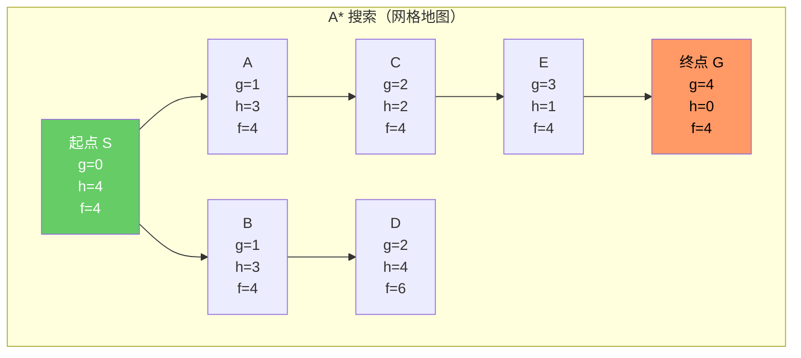
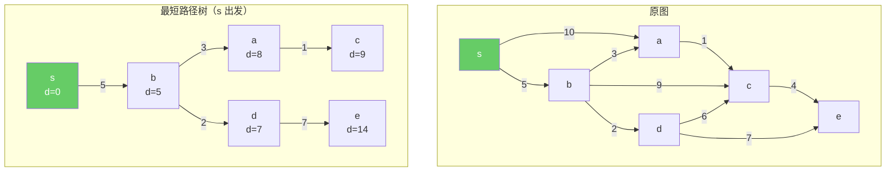
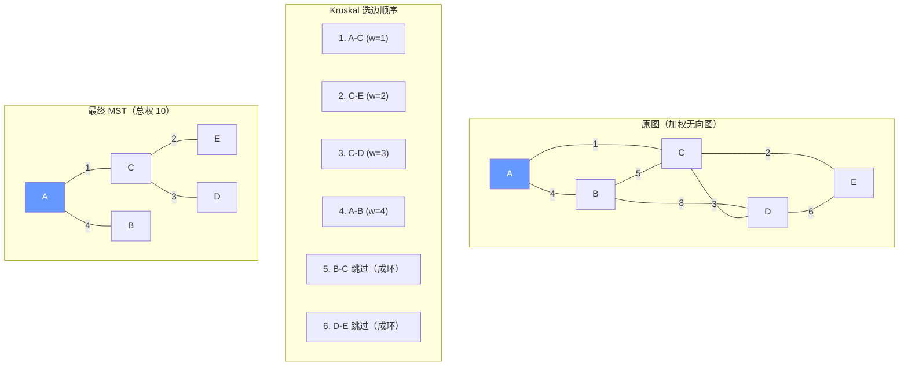

> 使用方式：本篇是图论主题的参考深水篇（最短路与最小生成树册），适合带着具体问题来查；遍历基础请先读[图算法：表示与遍历](/algorithm/110-GraphAlgorithms)。

地图 App 告诉你最快的回家路线，网络运维要给若干机房布最省钱的网线——前者是最短路径，后者是最小生成树，图上最经典的两类优化问题。它们共享一个核心动作：最短路靠「松弛」不断收紧距离估计，MST 靠「Cut 性质」不断安全地加边。本篇横向对照最短路三族（Dijkstra、Bellman-Ford/SPFA、Floyd-Warshall，外加启发式的 A*）与 MST 双算法（Kruskal、Prim），读完后你能回答最实用的问题：什么图该用哪个算法，负权边会破坏哪个算法的哪条假设。

## 前置知识

建议先阅读以下内容再进入本文：

- [图算法：表示与遍历](/algorithm/110-GraphAlgorithms)
- [贪心算法](/algorithm/130-GreedyAlgorithm)（贪心选择性质与 Cut 性质的直觉基础）
- [堆与优先队列](/algorithm/090-HeapAndPriorityQueue)（堆优化 Dijkstra 与 Prim 的数据结构基础）

Floyd-Warshall 与 Kruskal 另有单算法深水篇：[Floyd-Warshall 算法](/algorithm/250-FloydWarshall)、[Kruskal 算法](/algorithm/260-KruskalAlgorithm)。本篇负责最短路三算法与 MST 双算法的横向对照与选型，深水篇负责单算法纵向深挖，二者互为表里。

## 第 1 章 导论与本文分工

### 1.1 本篇覆盖什么

本篇是图算法两册中的第二册（最短路与最小生成树篇），承接[图算法：表示与遍历](/algorithm/110-GraphAlgorithms)的形式化定义、四种表示方法与 BFS/DFS 遍历框架，聚焦图上两类最经典的优化问题：

- **最短路径**：单源（Dijkstra、Bellman-Ford、SPFA）、全源（Floyd-Warshall）与启发式（A*）三族算法的完整实现、正确性证明与负权行为对照；
- **最小生成树**：Kruskal 与 Prim 双算法基于同一 Cut 性质的两种实现路线，以及 Boruvka 简介。

### 1.2 与深水篇的分工

| 主题 | 本篇（横向对照） | 纵向深水篇 |
| :--- | :--------------- | :--------- |
| Floyd-Warshall | 第 5 章：DP 状态、转移方程与证明概要 | [Floyd-Warshall 算法](/algorithm/250-FloydWarshall)：路径重建、位运算优化、与 Dijkstra/Bellman-Ford/Johnson 的详细对比 |
| Kruskal / MST | 第 7 章：Cut 性质、双算法对照 | [Kruskal 算法](/algorithm/260-KruskalAlgorithm)：次小生成树、TSP 2-近似、工业级实现 |
| 拓扑排序 | 姊妹篇 110 第 6 章（概念级） | [拓扑排序](/algorithm/270-TopologicalSorting)：正确性证明、CPM/PERT、依赖解析深水 |

原则：本篇给出"何时用哪个"的决策视野，深水篇给出"这一个算法还能怎么压榨"的纵向深度。

### 1.3 学习目标

1. **记忆（Remember）**：复述松弛操作的数学形式与三种最短路算法的复杂度、负权支持情况。
2. **理解（Understand）**：解释 Dijkstra 贪心选择性质为何依赖非负权，Bellman-Ford 为何 $V - 1$ 轮足够。
3. **应用（Apply）**：在稠密图、稀疏图、负权图、多源查询四类场景中选出正确算法并完成实现。
4. **分析（Analyze）**：用最优子结构与 Cut 性质分析 Dijkstra、Bellman-Ford、Floyd、Prim、Kruskal 的正确性。
5. **评估（Evaluate）**：依据第 8.5 节选型决策表评估给定图规模与权值特征下的实现代价。
6. **创造（Create）**：将路由、导航、聚类（MST）等工程问题映射到恰当的最短路或 MST 模型。

### 1.4 阅读建议

- 只关心"怎么选"的读者：直接读第 2 章松弛操作与第 8 章对比分析和选型决策表；
- 需要完整证明的读者：按第 3、4、5、7 章顺序精读各定理证明；
- 追求单算法极限性能的读者：读毕本篇对应章节后转入 250/260 深水篇。

## 第 2 章 问题定义与松弛操作

### 2.1 问题定义

**单源最短路径（SSSP）问题**：给定加权有向图 $G = (V, E, w)$ 与源点 $s \in V$，求 $s$ 到所有 $v \in V$ 的最短路径长度 $\delta(s, v) = \min_{p: s \to v} \sum_{e \in p} w(e)$。

**全源最短路径（APSP）问题**：对所有顶点对 $(u, v)$ 求 $\delta(u, v)$。

**最优子结构**：若 $s \to v$ 的最短路径为 $s \to u \to v$，则 $s \to u$ 也是最短路径。这是 Dijkstra 与 Bellman-Ford 共同的基础。

### 2.2 松弛操作

所有最短路径算法的核心都是**松弛**（relaxation）操作：

$$\text{Relax}(u, v, w): \quad \text{if } \text{dist}[u] + w(u, v) < \text{dist}[v] \text{ then } \text{dist}[v] \leftarrow \text{dist}[u] + w(u, v)$$

```python
def relax(dist, prev, u, v, w):
    """松弛边 (u, v, w)，返回是否成功松弛"""
    if dist[u] + w < dist[v]:
        dist[v] = dist[u] + w
        prev[v] = u
        return True
    return False
```

**收敛性质**：若 $u$ 的最短路已确定（`dist[u] = δ(s, u)`），且 $(u, v) \in E$，则松弛 $(u, v)$ 后 `dist[v] = δ(s, v)`（或更早达到）。

## 第 3 章 Dijkstra 算法

### 3.1 Dijkstra 算法

Dijkstra 算法基于贪心策略，要求所有边权非负。

**算法 6.1（Dijkstra 朴素实现）**：

```python
def dijkstra_naive(n, graph, start):
    """Dijkstra 朴素实现（邻接矩阵）

    时间复杂度：O(V^2)
    适用：稠密图、V 较小
    """
    INF = float('inf')
    dist = [INF] * n
    prev = [-1] * n
    visited = [False] * n
    dist[start] = 0
    for _ in range(n):
        # 选 dist 最小的未访问顶点
        u = -1
        for i in range(n):
            if not visited[i] and (u == -1 or dist[i] < dist[u]):
                u = i
        if u == -1 or dist[u] == INF:
            break
        visited[u] = True
        for v, w in graph[u]:
            if not visited[v] and dist[u] + w < dist[v]:
                dist[v] = dist[u] + w
                prev[v] = u
    return dist, prev
```

**算法 6.2（Dijkstra 堆优化）**：

```python
import heapq

def dijkstra_heap(n, graph, start):
    """Dijkstra 堆优化实现（邻接表 + 二叉堆）

    时间复杂度：O((V + E) log V)
    适用：稀疏图、大规模图
    关键：lazy deletion 模式跳过过期堆条目
    """
    INF = float('inf')
    dist = [INF] * n
    prev = [-1] * n
    dist[start] = 0
    pq = [(0, start)]              # (距离, 顶点)
    while pq:
        d, u = heapq.heappop(pq)
        if d > dist[u]:            # lazy deletion：跳过过期条目
            continue
        for v, w in graph[u]:
            nd = d + w
            if nd < dist[v]:
                dist[v] = nd
                prev[v] = u
                heapq.heappush(pq, (nd, v))
    return dist, prev
```

```cpp
#include <vector>
#include <queue>
#include <climits>
// Dijkstra 堆优化实现（C++）
std::vector<long long> dijkstra(int n, std::vector<std::vector<std::pair<int,int>>>& graph, int start) {
    const long long INF = LLONG_MAX / 4;
    std::vector<long long> dist(n, INF);
    std::vector<int> prev(n, -1);
    dist[start] = 0;
    // 优先队列：(距离, 顶点)，小根堆
    std::priority_queue<std::pair<long long,int>,
                        std::vector<std::pair<long long,int>>,
                        std::greater<>> pq;
    pq.push({0, start});
    while (!pq.empty()) {
        auto [d, u] = pq.top(); pq.pop();
        if (d > dist[u]) continue;          // lazy deletion
        for (auto& [v, w] : graph[u]) {
            long long nd = d + w;
            if (nd < dist[v]) {
                dist[v] = nd;
                prev[v] = u;
                pq.push({nd, v});
            }
        }
    }
    return dist;
}
```

```java
// Dijkstra 堆优化实现（Java）
import java.util.*;

public class Dijkstra {
    public static long[] dijkstra(int n, List<List<int[]>> graph, int start) {
        final long INF = Long.MAX_VALUE / 4;
        long[] dist = new long[n];
        int[] prev = new int[n];
        Arrays.fill(dist, INF);
        Arrays.fill(prev, -1);
        dist[start] = 0;
        // 小根堆：(距离, 顶点)
        PriorityQueue<long[]> pq = new PriorityQueue<>((a, b) -> Long.compare(a[0], b[0]));
        pq.offer(new long[]{0, start});
        while (!pq.isEmpty()) {
            long[] top = pq.poll();
            long d = top[0];
            int u = (int) top[1];
            if (d > dist[u]) continue;       // lazy deletion
            for (int[] e : graph.get(u)) {
                int v = e[0], w = e[1];
                long nd = d + w;
                if (nd < dist[v]) {
                    dist[v] = nd;
                    prev[v] = u;
                    pq.offer(new long[]{nd, v});
                }
            }
        }
        return dist;
    }
}
```

### 3.2 Dijkstra 正确性证明（贪心选择性质）

**定理 6.1（Dijkstra 贪心选择性质）**：设所有边权非负，当顶点 $u$ 被从优先队列中取出时，`dist[u] = δ(s, u)`。

**证明**（反证法）：设 $u$ 是第一个被取出但 `dist[u] > δ(s, u)` 的顶点。设 $s \to u$ 的真实最短路径为 $s = v_0 \to v_1 \to \dots \to v_k = u$。沿该路径存在第一个"未访问"顶点 $v_i$（$v_0 = s$ 已访问），则 $v_{i-1}$ 已访问，`dist[v_{i-1}] = δ(s, v_{i-1})`（因 $u$ 是第一个违反性质的顶点）。

松弛 $(v_{i-1}, v_i)$ 后 `dist[v_i] = δ(s, v_{i-1}) + w(v_{i-1}, v_i) = δ(s, v_i)`。又因边权非负，$\delta(s, v_i) \leq \delta(s, u) < \text{dist}[u]$（最后一步用 $u$ 违反性质）。但 $v_i$ 在 $u$ 之前应被取出（`dist[v_i] < dist[u]`），与 $u$ 被先取出矛盾。

**推论 6.1**：Dijkstra 算法终止时，对所有 $v \in V$，`dist[v] = δ(s, v)`。

### 3.3 为何 Dijkstra 不能处理负权边

```python
# Dijkstra 负权失效反例
# 顶点：A=0, B=1, C=2
# 边：A->B(1), A->C(4), B->C(-3)
# 正确答案：dist[A]=0, dist[B]=1, dist[C]=-2
# Dijkstra 输出：dist[A]=0, dist[B]=1, dist[C]=4（错误）

graph = [[(1, 1), (2, 4)], [(2, -3)], []]
dist, _ = dijkstra_heap(3, graph, 0)
# dist = [0, 1, 4]，但正确答案是 [0, 1, -2]
```

**失效机制**：Dijkstra 取出 $C$ 时（`dist[C] = 4`）将其标记"已访问"，但 $B$ 到 $C$ 的负权边本可使 `dist[C] = 1 + (-3) = -2 < 4`。负权边破坏了"已访问顶点不会被后续松弛"的贪心选择性质。

含负权边时的正确工具是第 4 章的 Bellman-Ford（4.1 节）与 SPFA（4.3 节）；全源场景可用第 5 章的 Floyd-Warshall。

## 第 4 章 Bellman-Ford 与负权

### 4.1 Bellman-Ford 算法

Bellman-Ford 通过对所有边执行 $V - 1$ 轮松弛，支持负权边与负环检测。

**算法 6.3（Bellman-Ford）**：

```python
def bellman_ford(n, edges, start):
    """Bellman-Ford 算法

    输入：顶点数 n、边列表 [(u, v, w)]、源点 start
    输出：(dist 数组, 是否存在负环)
    时间复杂度：O(V * E)
    空间复杂度：O(V)
    """
    INF = float('inf')
    dist = [INF] * n
    prev = [-1] * n
    dist[start] = 0
    # 第 k 轮松弛后，dist[v] = 至多经过 k 条边的最短路径长度
    for _ in range(n - 1):
        updated = False
        for u, v, w in edges:
            if dist[u] != INF and dist[u] + w < dist[v]:
                dist[v] = dist[u] + w
                prev[v] = u
                updated = True
        if not updated:             # 提前终止优化
            break
    # 第 V 轮：若仍能松弛，则存在负环
    has_neg_cycle = False
    for u, v, w in edges:
        if dist[u] != INF and dist[u] + w < dist[v]:
            has_neg_cycle = True
            break
    return dist, has_neg_cycle
```

```cpp
#include <vector>
#include <tuple>
// Bellman-Ford（C++）
std::pair<std::vector<long long>, bool> bellmanFord(
    int n, std::vector<std::tuple<int,int,int>>& edges, int start) {
    const long long INF = LLONG_MAX / 4;
    std::vector<long long> dist(n, INF);
    std::vector<int> prev(n, -1);
    dist[start] = 0;
    for (int i = 0; i < n - 1; i++) {
        bool updated = false;
        for (auto& [u, v, w] : edges) {
            if (dist[u] != INF && dist[u] + w < dist[v]) {
                dist[v] = dist[u] + w;
                prev[v] = u;
                updated = true;
            }
        }
        if (!updated) break;
    }
    bool hasNegCycle = false;
    for (auto& [u, v, w] : edges) {
        if (dist[u] != INF && dist[u] + w < dist[v]) {
            hasNegCycle = true;
            break;
        }
    }
    return {dist, hasNegCycle};
}
```

### 4.2 Bellman-Ford 正确性证明

**定理 6.2（Bellman-Ford 正确性）**：若图中无负环，则 $V - 1$ 轮松弛后 `dist[v] = δ(s, v)` 对所有从 $s$ 可达的 $v$ 成立。

**证明**（基于路径长度归纳）：

**不变式**：第 $k$ 轮松弛后，`dist[v]` 等于从 $s$ 到 $v$ 最多经过 $k$ 条边的最短路径长度。

**归纳基础**：$k = 0$ 时 `dist[s] = 0`、其余为 $\infty$，对应"0 条边路径"。

**归纳步骤**：设第 $k - 1$ 轮已得到所有"最多 $k - 1$ 条边"的最短路。对每条边 $(u, v)$ 松弛时，若 $u$ 的最短路已确定（至多 $k - 1$ 条边），则 `dist[v] = min(dist[v], dist[u] + w(u, v))` 即为"至多 $k$ 条边"的最短路（最后一条边是 $(u, v)$）。

**上界**：无负环时，最短路径是简单路径（无重复顶点），最多 $V - 1$ 条边，故 $V - 1$ 轮足够。

**负环检测**：若第 $V$ 轮仍能松弛，则存在长度 $\geq V$ 的更短路径，必含重复顶点，即负环。

### 4.3 SPFA（队列优化 Bellman-Ford）

SPFA（Shortest Path Faster Algorithm）只对发生松弛的顶点的出边进行松弛，平均性能优于 Bellman-Ford。

```python
from collections import deque

def spfa(n, graph, start):
    """SPFA 算法（队列优化 Bellman-Ford）

    时间复杂度：平均 O(E)，最坏 O(V * E)
    负环检测：维护 cnt[v] = s 到 v 的最短路边数，cnt[v] >= V 时存在负环
    """
    INF = float('inf')
    dist = [INF] * n
    in_queue = [False] * n
    cnt = [0] * n              # 记录最短路边数
    dist[start] = 0
    in_queue[start] = True
    q = deque([start])
    has_neg_cycle = False
    while q and not has_neg_cycle:
        u = q.popleft()
        in_queue[u] = False
        for v, w in graph[u]:
            if dist[u] + w < dist[v]:
                dist[v] = dist[u] + w
                cnt[v] = cnt[u] + 1
                if cnt[v] >= n:                 # 边数 >= V，存在负环
                    has_neg_cycle = True
                    break
                if not in_queue[v]:
                    q.append(v)
                    in_queue[v] = True
    return dist, has_neg_cycle
```

## 第 5 章 Floyd-Warshall 全源最短路径

Floyd-Warshall 以 $O(V^3)$ 时间、$O(V^2)$ 空间一次求出所有顶点对的最短路径，支持负权边并可检测负环。本节给出 DP 状态设计、转移方程与正确性证明概要；路径重建、位运算优化、与 Dijkstra/Bellman-Ford/Johnson 的详细对比及工程实践，见深水篇[Floyd-Warshall 算法](/algorithm/250-FloydWarshall)。

### 5.1 Floyd-Warshall 全源最短路径

**算法 6.4（Floyd-Warshall）**：

**DP 状态**：$d^{(k)}[i][j]$ = 从 $i$ 到 $j$ 仅经过中间顶点 $\{0, 1, \dots, k-1\}$ 的最短路径长度。

**转移方程**：

$$d^{(k)}[i][j] = \min\left( d^{(k-1)}[i][j],\ d^{(k-1)}[i][k] + d^{(k-1)}[k][j] \right)$$

**空间优化**：因 $d^{(k)}$ 仅依赖 $d^{(k-1)}$，可用二维数组滚动，甚至原地更新（注意 $k$ 必须是最外层循环）。

```python
def floyd_warshall(n, graph):
    """Floyd-Warshall 全源最短路径

    时间复杂度：O(V^3)
    空间复杂度：O(V^2)
    支持负权边，可检测负环（对角线 < 0）
    """
    INF = float('inf')
    dist = [[INF] * n for _ in range(n)]
    for i in range(n):
        dist[i][i] = 0
    for u in range(n):
        for v, w in graph[u]:
            dist[u][v] = min(dist[u][v], w)
    for k in range(n):
        for i in range(n):
            for j in range(n):
                if dist[i][k] + dist[k][j] < dist[i][j]:
                    dist[i][j] = dist[i][k] + dist[k][j]
    # 负环检测：若 dist[i][i] < 0 则存在经过 i 的负环
    has_neg_cycle = any(dist[i][i] < 0 for i in range(n))
    return dist, has_neg_cycle
```

```cpp
#include <vector>
// Floyd-Warshall（C++）
std::pair<std::vector<std::vector<long long>>, bool> floydWarshall(
    int n, std::vector<std::vector<std::pair<int,int>>>& graph) {
    const long long INF = LLONG_MAX / 4;
    std::vector<std::vector<long long>> dist(n, std::vector<long long>(n, INF));
    for (int i = 0; i < n; i++) dist[i][i] = 0;
    for (int u = 0; u < n; u++) {
        for (auto& [v, w] : graph[u]) {
            dist[u][v] = std::min(dist[u][v], (long long)w);
        }
    }
    for (int k = 0; k < n; k++) {
        for (int i = 0; i < n; i++) {
            for (int j = 0; j < n; j++) {
                if (dist[i][k] + dist[k][j] < dist[i][j]) {
                    dist[i][j] = dist[i][k] + dist[k][j];
                }
            }
        }
    }
    bool hasNegCycle = false;
    for (int i = 0; i < n; i++) {
        if (dist[i][i] < 0) { hasNegCycle = true; break; }
    }
    return {dist, hasNegCycle};
}
```

### 5.2 Floyd-Warshall 正确性证明

**定理 6.3（Floyd-Warshall 正确性）**：算法终止时 `dist[i][j] = δ(i, j)`（若无负环）。

**证明**（基于 $d^{(k)}$ 的归纳定义）：

**归纳基础**：$d^{(0)}[i][j] = w(i, j)$（直接边权，无边时为 $\infty$）。

**归纳步骤**：设 $d^{(k-1)}[i][j]$ 已正确表示"仅经过 $\{0, \dots, k-2\}$"的最短路。考虑 $d^{(k)}[i][j]$：

- 若 $i \to j$ 的最短路（限定中间顶点 $\subseteq \{0, \dots, k-1\}$）不经过 $k$，则 $d^{(k)}[i][j] = d^{(k-1)}[i][j]$。
- 若经过 $k$，则路径可分解为 $i \to k \to j$，两段均仅经过 $\{0, \dots, k-2\}$（因 $k$ 在两段之间只出现一次，否则可去除环路），故 $d^{(k)}[i][j] = d^{(k-1)}[i][k] + d^{(k-1)}[k][j]$。
- 取两者较小值，即转移方程。

**终止**：$k = V$ 时 $d^{(V)}[i][j]$ = 任意中间顶点的最短路 = 真实最短路。

## 第 6 章 A* 启发式最短路径

A* 在 Dijkstra 的松弛框架上叠加启发式估计 $f(n) = g(n) + h(n)$，在地图导航与游戏寻路中以远少于 Dijkstra 的节点展开数逼近最优路径，前提是 $h$ 可采纳（不高估真实代价）。

### 6.1 A* 算法

A* 是带启发式的最短路径算法，在路径搜索（地图导航、游戏 AI）中广泛应用。

**评估函数**：$f(n) = g(n) + h(n)$，其中 $g(n)$ 是从源点到 $n$ 的实际代价，$h(n)$ 是从 $n$ 到目标的启发式估计。

**可采纳性**：当 $h(n) \leq h^*(n)$（$h^*$ 是真实最短代价）时，A* 保证最优性。

```python
import heapq

def astar(n, graph, start, goal, heuristic):
    """A* 算法

    输入：顶点数 n、邻接表 graph、起点 start、终点 goal、启发式函数 heuristic
    输出：(最短距离, 路径)
    要求：heuristic 必须可采纳（不高估真实代价）才能保证最优性
    """
    INF = float('inf')
    g = [INF] * n              # g[v] = start 到 v 的实际最短代价
    prev = [-1] * n
    g[start] = 0
    pq = [(heuristic(start), 0, start)]   # (f, g, 顶点)
    while pq:
        f, gu, u = heapq.heappop(pq)
        if u == goal:                       # 到达目标
            # 重建路径
            path = []
            v = goal
            while v != -1:
                path.append(v)
                v = prev[v]
            return gu, path[::-1]
        if gu > g[u]:                        # lazy deletion
            continue
        for v, w in graph[u]:
            gv = gu + w
            if gv < g[v]:
                g[v] = gv
                prev[v] = u
                heapq.heappush(pq, (gv + heuristic(v), gv, v))
    return INF, []
```

### 6.2 A* 搜索过程可视化



### 6.3 最短路径树可视化

下图展示从源点 $s$ 出发的最短路径树（SPT）结构：



## 第 7 章 最小生成树

Kruskal 与 Prim 是同一 Cut 性质的两种实现路线：前者全局按边权排序加边（并查集判环），后者从单点出发局部扩展跨切边（优先队列）。本节给出双算法完整实现与正确性证明对照；次小生成树、TSP 2-近似、Boruvka 分布式细节与工业库实现，见深水篇[Kruskal 算法](/algorithm/260-KruskalAlgorithm)。

### 7.1 Cut 性质

**定义 7.1（割）**：图 $G = (V, E)$ 的**割**（cut）是顶点集的一个划分 $(S, V \setminus S)$，其中 $S \subseteq V$、$S \neq \emptyset$、$S \neq V$。横切该割的边集为 $\delta(S) = \{ (u, v) \in E \mid u \in S, v \notin S \}$。

**定理 7.1（Cut 性质）**：对任意割 $(S, V \setminus S)$，若横切边 $e$ 是 $\delta(S)$ 中权值最小的边，且所有横切边权值互不相同，则 $e$ 必属于 $G$ 的任意一棵 MST。

**证明**：设 $T$ 是一棵不含 $e$ 的 MST。则 $T \cup \{e\}$ 含环 $C$，$C$ 必含另一横切边 $e'$（环穿过割的次数为偶数）。因 $w(e) < w(e')$，用 $e$ 替换 $e'$ 得到 $T' = T - \{e'\} + \{e\}$，$w(T') < w(T)$，与 $T$ 是 MST 矛盾。

Cut 性质是 Kruskal 与 Prim 算法的共同基础。

### 7.2 Kruskal 算法

Kruskal 算法按边权递增顺序逐步加入不形成环的边，依赖并查集高效判环。

**算法 7.1（Kruskal）**：

```python
class UnionFind:
    """并查集（Union-Find）实现

    支持 path compression 与 union by rank 优化
    单次操作均摊复杂度 O(alpha(V))，其中 alpha 是反 Ackermann 函数
    """
    def __init__(self, n):
        self.parent = list(range(n))
        self.rank = [0] * n

    def find(self, x):
        # 路径压缩
        if self.parent[x] != x:
            self.parent[x] = self.find(self.parent[x])
        return self.parent[x]

    def union(self, x, y):
        """合并 x、y 所在集合，返回是否成功（成功=True，已在同集合=False）"""
        px, py = self.find(x), self.find(y)
        if px == py:
            return False
        # union by rank
        if self.rank[px] < self.rank[py]:
            px, py = py, px
        self.parent[py] = px
        if self.rank[px] == self.rank[py]:
            self.rank[px] += 1
        return True

def kruskal(n, edges):
    """Kruskal 最小生成树算法

    输入：顶点数 n、边列表 [(u, v, w)]
    输出：(MST 总权值, MST 边列表)
    时间复杂度：O(E log E)，主导项为排序
    """
    edges_sorted = sorted(edges, key=lambda e: e[2])
    uf = UnionFind(n)
    mst_weight = 0
    mst_edges = []
    for u, v, w in edges_sorted:
        if uf.union(u, v):
            mst_weight += w
            mst_edges.append((u, v, w))
            if len(mst_edges) == n - 1:
                break
    return mst_weight, mst_edges
```

```cpp
#include <vector>
#include <algorithm>
// Kruskal（C++）
struct DSU {
    std::vector<int> parent, rank_;
    DSU(int n) : parent(n), rank_(n, 0) {
        for (int i = 0; i < n; i++) parent[i] = i;
    }
    int find(int x) {
        return parent[x] == x ? x : parent[x] = find(parent[x]);
    }
    bool unite(int x, int y) {
        int px = find(x), py = find(y);
        if (px == py) return false;
        if (rank_[px] < rank_[py]) std::swap(px, py);
        parent[py] = px;
        if (rank_[px] == rank_[py]) rank_[px]++;
        return true;
    }
};

long long kruskal(int n, std::vector<std::tuple<int,int,int>>& edges) {
    std::sort(edges.begin(), edges.end(),
              [](const auto& a, const auto& b) { return std::get<2>(a) < std::get<2>(b); });
    DSU dsu(n);
    long long total = 0;
    int cnt = 0;
    for (auto& [u, v, w] : edges) {
        if (dsu.unite(u, v)) {
            total += w;
            if (++cnt == n - 1) break;
        }
    }
    return total;
}
```

### 7.3 Kruskal 正确性证明

**定理 7.2（Kruskal 正确性）**：Kruskal 算法终止时输出的边集构成一棵 MST。

**证明**（基于 Cut 性质归纳）：

设 Kruskal 依次加入边 $e_1, e_2, \dots, e_{n-1}$。维护不变式：第 $k$ 步后，已加入边集 $T_k = \{e_1, \dots, e_k\}$ 是某棵 MST 的子集。

**基础**：$T_0 = \emptyset$ 是任意 MST 的子集。

**归纳**：设 $T_{k-1}$ 是某 MST $T^*$ 的子集。考虑 $e_k = (u, v)$，加入时 $u, v$ 在 $T_{k-1}$ 中不连通。设 $S$ 为 $u$ 在 $T_{k-1}$ 中的连通分量，则 $e_k$ 横切割 $(S, V \setminus S)$。Kruskal 按 weight 递增选择，故 $e_k$ 是 $\delta(S)$ 中尚未被考虑的边里权值最小的。

需证 $e_k \in T^*$：若 $e_k \notin T^*$，由 Cut 性质（边权互异假设下），$T^*$ 中应含 $\delta(S)$ 的最小横切边 $e'$，且 $w(e') \leq w(e_k)$。但 $e'$ 必然在 $e_k$ 之前被 Kruskal 考虑过，且 $e'$ 加入时其两端不连通（否则 $T_{k-1}$ 中已有 $S$ 外的连通分量，矛盾），故 Kruskal 应已加入 $e'$ 而非 $e_k$，矛盾。

### 7.4 Prim 算法

Prim 算法从一个顶点出发逐步扩展 MST，依赖优先队列维护跨切边。

**算法 7.2（Prim 堆优化）**：

```python
import heapq

def prim(n, graph, start=0):
    """Prim 最小生成树算法（堆优化）

    输入：顶点数 n、邻接表 graph、起始顶点 start
    输出：(MST 总权值, MST 边列表)
    时间复杂度：O(E log V)
    """
    INF = float('inf')
    in_mst = [False] * n
    min_edge = [INF] * n          # min_edge[v] = 跨切集中到 v 的最小权
    min_edge[start] = 0
    prev = [-1] * n
    pq = [(0, start)]              # (权值, 顶点)
    mst_weight = 0
    mst_edges = []
    while pq:
        w, u = heapq.heappop(pq)
        if in_mst[u]:
            continue
        in_mst[u] = True
        mst_weight += w
        if prev[u] != -1:
            mst_edges.append((prev[u], u, w))
        for v, wuv in graph[u]:
            if not in_mst[v] and wuv < min_edge[v]:
                min_edge[v] = wuv
                prev[v] = u
                heapq.heappush(pq, (wuv, v))
    return mst_weight, mst_edges
```

```cpp
#include <vector>
#include <queue>
// Prim 算法（C++）
long long prim(int n, std::vector<std::vector<std::pair<int,int>>>& graph, int start = 0) {
    std::vector<bool> inMst(n, false);
    std::vector<long long> minEdge(n, LLONG_MAX / 4);
    minEdge[start] = 0;
    std::priority_queue<std::pair<long long,int>,
                        std::vector<std::pair<long long,int>>,
                        std::greater<>> pq;
    pq.push({0, start});
    long long total = 0;
    while (!pq.empty()) {
        auto [w, u] = pq.top(); pq.pop();
        if (inMst[u]) continue;
        inMst[u] = true;
        total += w;
        for (auto& [v, wuv] : graph[u]) {
            if (!inMst[v] && (long long)wuv < minEdge[v]) {
                minEdge[v] = wuv;
                pq.push({wuv, v});
            }
        }
    }
    return total;
}
```

### 7.5 Prim 正确性证明

**定理 7.3（Prim 正确性）**：Prim 算法终止时输出的边集构成一棵 MST。

**证明**（基于 Cut 性质）：

维护不变式：第 $k$ 步后，已加入边集 $T_k$ 是一棵树，且是某棵 MST 的子集。

设当前 $T_k$ 覆盖的顶点集为 $S$。Prim 选择横切割 $(S, V \setminus S)$ 的最小权边 $e$。由 Cut 性质，$e$ 属于任意 MST。故 $T_{k+1} = T_k \cup \{e\}$ 仍是某 MST 的子集，且仍为树（加入横切边不形成环）。

终止时 $T_{n-1}$ 含 $n - 1$ 条边且为树，必为 MST。

### 7.6 Boruvka 算法（简介）

Boruvka (1926) 是最早的 MST 算法，比 Kruskal 早 30 年。每轮每个连通分量同时选择其最小跨切边，加入并合并。时间 $O(E \log V)$，适合分布式计算。

### 7.7 MST 算法对比

| 算法                 | 时间复杂度                  | 数据结构      | 适用场景     |
| :------------------- | :-------------------------- | :------------ | :----------- |
| Kruskal              | $O(E \log E) = O(E \log V)$ | 排序 + 并查集 | 稀疏图       |
| Prim（朴素）         | $O(V^2)$                    | 数组          | 稠密图       |
| Prim（堆）           | $O(E \log V)$               | 优先队列      | 稀疏图、通用 |
| Prim（Fibonacci 堆） | $O(E + V \log V)$           | Fibonacci 堆  | 理论最优     |
| Boruvka              | $O(E \log V)$               | 并查集        | 分布式       |

### 7.8 MST 可视化



## 第 8 章 对比分析与选型决策

### 8.1 最短路径算法对比

| 算法                     | 时间复杂度                 | 空间     | 负权边 | 负环检测 | 适用场景       |
| :----------------------- | :------------------------- | :------- | :----- | :------- | :------------- |
| Dijkstra（朴素）         | $O(V^2)$                   | $O(V)$   | 否     | 否       | 稠密图         |
| Dijkstra（堆）           | $O((V+E) \log V)$          | $O(V+E)$ | 否     | 否       | 稀疏图、非负权 |
| Dijkstra（Fibonacci 堆） | $O(V \log V + E)$          | $O(V+E)$ | 否     | 否       | 理论最优       |
| Bellman-Ford             | $O(V E)$                   | $O(V)$   | 是     | 是       | 含负权         |
| SPFA                     | 平均 $O(E)$，最坏 $O(V E)$ | $O(V)$   | 是     | 是       | 随机数据       |
| Floyd-Warshall           | $O(V^3)$                   | $O(V^2)$ | 是     | 是       | 全源、$V$ 较小 |

### 8.2 Dijkstra vs Bellman-Ford vs SPFA

| 维度       | Dijkstra          | Bellman-Ford | SPFA                       |
| :--------- | :---------------- | :----------- | :------------------------- |
| 时间复杂度 | $O((V+E) \log V)$ | $O(V E)$     | 平均 $O(E)$，最坏 $O(V E)$ |
| 负权边     | 不支持            | 支持         | 支持                       |
| 负环检测   | 不支持            | 支持         | 支持                       |
| 数据结构   | 优先队列          | 边列表       | 队列                       |
| 实现复杂度 | 中等              | 简单         | 较简单                     |
| 稳定性     | 稳定              | 稳定         | 易被构造数据卡             |
| 工程首选   | 是（非负权）      | 是（含负权） | 谨慎使用                   |

### 8.3 Kruskal vs Prim

| 维度       | Kruskal            | Prim           |
| :--------- | :----------------- | :------------- |
| 策略       | 全局按边权排序     | 局部扩展跨切边 |
| 数据结构   | 排序 + 并查集      | 优先队列       |
| 时间复杂度 | $O(E \log V)$      | $O(E \log V)$  |
| 空间复杂度 | $O(E)$             | $O(V + E)$     |
| 稀疏图优势 | 是                 | 否             |
| 稠密图优势 | 否                 | 是             |
| 适合分布式 | 是（Boruvka 更优） | 否             |
| 实现难度   | 中等               | 中等           |

### 8.4 单源 vs 全源最短路径

| 维度                 | 单源（Dijkstra）    | 全源（Floyd-Warshall） |
| :------------------- | :------------------ | :--------------------- |
| 时间复杂度           | $O((V + E) \log V)$ | $O(V^3)$               |
| 调用 $V$ 次单源      | $O(V E \log V)$     | —                      |
| $V$ 小（$\leq 500$） | 不一定优            | 推荐                   |
| $V$ 大、$E$ 小       | 推荐                | 不可行                 |
| 实现复杂度           | 中等                | 极简                   |
| 支持负权             | 否（Dijkstra）      | 是                     |

### 8.5 场景选型决策表

| 场景特征 | 推荐算法 | 理由 | 本文章节 |
| :--- | :--- | :--- | :--- |
| 稠密图（$E = \Theta(V^2)$）、非负权、单源 | Dijkstra 朴素 $O(V^2)$ | 邻接矩阵 + 数组扫描，常数小、无需堆 | 3.1 |
| 稀疏图（$E = O(V)$）、非负权、单源 | Dijkstra 堆优化 $O((V + E) \log V)$ | 主流选择，配邻接表 | 3.1 |
| 含负权边（无负环）、单源 | Bellman-Ford 或 SPFA | Dijkstra 贪心前提被破坏 | 4.1、4.3 |
| 需检测负环 | Bellman-Ford 第 V 轮判定 / SPFA 边数计数 | 松弛不止即负环 | 4.1、4.3 |
| 全源、$V$ 较小（约 $\leq 500$） | Floyd-Warshall $O(V^3)$ | 实现极简、一次算完、支持负权 | 5.1 |
| 全源、稀疏大图 | $V$ 次 Dijkstra 堆优化 | $O(V E \log V)$ 优于 $O(V^3)$ | 8.4 |
| 点对点查询且启发可采纳（欧氏距离等） | A* | 展开节点数远少于 Dijkstra | 6.1 |
| MST、稀疏图或边集已给定 | Kruskal $O(E \log E)$ | 排序 + 并查集，实现直接 | 7.2 |
| MST、稠密图 | Prim 朴素 $O(V^2)$ | 无需对全边排序 | 7.4 |
| DAG 上的单源最短路 | 拓扑序一趟松弛 $O(V + E)$ | 无环图无需堆，天然支持负权 | 姊妹篇第 6 章 |

决策顺序建议：先判负权（有负权进第 4、5 章，无负权继续）；再判源数（全源进第 5 章或 V 次单源，单源与点对点继续）；最后判稠密稀疏（稠密用朴素 Dijkstra 与朴素 Prim，稀疏用堆优化 Dijkstra 与 Kruskal）。

## 第 9 章 常见陷阱

本章收录最短路与 MST 实现中的高频错误；表示与遍历类陷阱（不连通图、内存超限、递归栈溢出、拓扑排序漏检环）见姊妹篇第 10 章。

### 9.1 负权边处理

:::danger 错误示例

```python
# 在含负权边的图上使用 Dijkstra
graph = [[(1, 1), (2, 4)], [(2, -3)], []]
dist, _ = dijkstra_heap(3, graph, 0)
# 期望：[0, 1, -2]
# 实际：[0, 1, 4]（错误）
```

**原因**：Dijkstra 的贪心选择性质要求"已访问顶点不会被后续松弛"，负权边破坏该前提。
:::

**修正方案**：含负权边时改用 Bellman-Ford 或 SPFA。

### 9.2 重边与自环

:::danger 错误示例

```python
# 未处理重边：邻接表中保留所有重边，导致 Dijkstra 多次松弛浪费
graph[0].append((1, 5))
graph[0].append((1, 3))      # 重边，应取最小权
```

**原因**：邻接表不自动去重，重边会延长遍历时间。
:::

**修正方案**：

```python
# 方案 1：构建图时取最小权（邻接矩阵天然处理）
def add_edge_unique(graph, u, v, w):
    for i, (vv, ww) in enumerate(graph[u]):
        if vv == v:
            graph[u][i] = (v, min(ww, w))
            return
    graph[u].append((v, w))

# 方案 2：保留重边但 Dijkstra 中 lazy deletion 自动处理
# （会浪费常数时间，但结果正确）

# 自环处理：MST 算法自动忽略（不成环）；最短路径需特殊处理（自环权为正可忽略）
```

### 9.3 堆中过期条目

:::danger 错误示例

```python
def dijkstra_bad(n, graph, start):
    dist = [float('inf')] * n
    dist[start] = 0
    pq = [(0, start)]
    while pq:
        d, u = heapq.heappop(pq)
        # 未跳过过期条目，会基于陈旧距离松弛
        for v, w in graph[u]:
            if dist[u] + w < dist[v]:       # dist[u] 可能已被更新
                dist[v] = dist[u] + w
                heapq.heappush(pq, (dist[v], v))
```

**原因**：Python `heapq` 不支持 decrease-key，堆中可能有同一顶点的多个条目。
:::

**修正方案**：见习题 `ex-graph-cf-01` 的修正版本。

### 9.4 Bellman-Ford 负环检测遗漏

:::danger 错误示例

```python
# 从单源点松弛，若负环不与源点连通则检测不到
def bad_neg_cycle(n, edges, start=0):
    dist = [float('inf')] * n
    dist[start] = 0
    # ... V-1 轮松弛 ...
    # 第 V 轮检测：仅能检测源点可达的负环
```

**原因**：Bellman-Ford 仅松弛源点可达的边。
:::

**修正方案**：将所有顶点距离初始化为 0（虚拟源点技巧），见习题 `ex-graph-cf-02`。

### 9.5 优先队列比较器错误

:::danger 错误示例

```cpp
// C++ 中使用大根堆而非小根堆
std::priority_queue<std::pair<int,int>> pq;   // 默认大根堆，Dijkstra 应使用小根堆
```

**原因**：C++ `priority_queue` 默认是 `std::less` 即大根堆。
:::

**修正方案**：

```cpp
#include <queue>
#include <vector>
// 小根堆：greater 比较
std::priority_queue<std::pair<long long,int>,
                    std::vector<std::pair<long long,int>>,
                    std::greater<>> pq;
```

### 9.6 并查集未路径压缩

:::danger 错误示例

```python
class BadUF:
    def __init__(self, n):
        self.parent = list(range(n))
    def find(self, x):
        # 未路径压缩，find 最坏 O(n)
        while self.parent[x] != x:
            x = self.parent[x]
        return x
```

**原因**：未做路径压缩与 union by rank，复杂度退化为 $O(n)$。
:::

**修正方案**：使用路径压缩 + union by rank（见 7.2 节）。

## 第 10 章 工程实践

本章选取最短路工程化的两个代表场景：互联网路由协议（Dijkstra 与 Bellman-Ford 的协议化）与地图导航（A* 与分层道路网）。社交网络、推荐系统、依赖解析与数据库查询优化的图遍历工程实践见姊妹篇第 11 章。

### 10.1 路由算法与网络协议

互联网路由协议本质上是最短路径算法的工程化实现：

- **OSPF（Open Shortest Path First）**：基于 Dijkstra 算法，每台路由器维护完整的链路状态数据库（LSDB），独立计算以自身为源的最短路径树；
- **RIP（Routing Information Protocol）**：基于 Bellman-Ford 思想，距离向量算法，最大跳数 15 防止计数到无穷；
- **BGP（Border Gateway Protocol）**：基于路径向量（Path Vector）算法，避免 Bellman-Ford 的计数到无穷问题，通过 AS_PATH 属性检测环路。

```python
import heapq
def ospf_routing(routers, links, source):
    """OSPF 协议核心：Dijkstra 计算最短路径树

    参数:
        routers: 路由器 ID 列表
        links: 链路字典 {(u, v): cost}
        source: 源路由器 ID

    返回:
        dict: 每个目的路由器的 (距离, 下一跳)
    """
    # 构建邻接表
    adj = {r: [] for r in routers}
    for (u, v), cost in links.items():
        adj[u].append((v, cost))
        adj[v].append((u, cost))

    dist = {r: float('inf') for r in routers}
    next_hop = {r: None for r in routers}
    dist[source] = 0
    pq = [(0, source, None)]
    while pq:
        d, u, nh = heapq.heappop(pq)
        if d > dist[u]:
            continue
        for v, w in adj[u]:
            # 下一跳判定：源直连则下一跳为 v，否则继承父节点下一跳
            new_nh = v if u == source else nh
            if dist[u] + w < dist[v]:
                dist[v] = dist[u] + w
                next_hop[v] = new_nh
                heapq.heappush(pq, (dist[v], v, new_nh))
    return {r: (dist[r], next_hop[r]) for r in routers if r != source}
```

### 10.2 地图导航与物流路径规划

Google Maps、高德地图等导航应用的核心是 A* 算法 + 分层道路网：

- **道路网分层**：高速公路层、主干道层、支路层分别建图，跨层时使用骨架图（Contracted Graph）加速；
- _*A* 启发函数_*：欧氏距离 / 曼哈顿距离 / 球面大圆距离作为下界，保证 admissible；
- **Contraction Hierarchies（CH）**：预处理阶段对顶点按重要性排序并添加 shortcut 边，查询阶段双向 Dijkstra 在 CH 上加速至毫秒级；
- **车辆路径问题（VRP）**：结合 MST + 局部搜索（2-opt、Or-opt）求解带容量约束的多车配送。

```python
import heapq
import math
def astar_grid(grid, start, goal):
    """A* 算法在二维网格地图上的实现（4 连通）

    参数:
        grid: 二维数组，0 表示可通行，1 表示障碍
        start, goal: (row, col) 元组

    返回:
        list or None: 路径坐标列表，无可达路径返回 None
    """
    rows, cols = len(grid), len(grid[0])

    def heuristic(a, b):
        return abs(a[0] - b[0]) + abs(a[1] - b[1])

    g_score = {start: 0}
    f_score = {start: heuristic(start, goal)}
    pq = [(f_score[start], start)]
    came_from = {}

    while pq:
        _, current = heapq.heappop(pq)
        if current == goal:
            path = [current]
            while current in came_from:
                current = came_from[current]
                path.append(current)
            return list(reversed(path))
        for dr, dc in [(-1, 0), (1, 0), (0, -1), (0, 1)]:
            nr, nc = current[0] + dr, current[1] + dc
            neighbor = (nr, nc)
            if not (0 <= nr < rows and 0 <= nc < cols):
                continue
            if grid[nr][nc] == 1:
                continue
            tentative = g_score[current] + 1
            if tentative < g_score.get(neighbor, float('inf')):
                came_from[neighbor] = current
                g_score[neighbor] = tentative
                f_score[neighbor] = tentative + heuristic(neighbor, goal)
                heapq.heappush(pq, (f_score[neighbor], neighbor))
    return None
```

## 第 11 章 习题与自测

### 11.1 填空题知识点讲解

**习题 2（ex-graph-fb-02，理解）**：Dijkstra 算法在含 $V$ 个顶点、$E$ 条边的稀疏图上使用二叉堆实现时，时间复杂度为 ____。

**解析讲解**：$O((V + E) \log V)$

**解析讲解**：每个顶点至多入堆一次，每次出堆 $O(\log V)$，共 $V$ 次；每条边 $(u, v)$ 触发松弛时若成功则入堆，每次入堆 $O(\log V)$，共至多 $E$ 次松弛。总时间 $O(V \log V + E \log V) = O((V + E) \log V)$。若使用 Fibonacci 堆可降至 $O(V \log V + E)$。

### 11.2 代码修正题

**习题 7（ex-graph-cf-01，应用）**：以下 Dijkstra 实现存在 Bug，请指出并修正。

```python
import heapq
def dijkstra(n, graph, start):
    dist = [float('inf')] * n
    dist[start] = 0
    pq = [(0, start)]
    while pq:
        d, u = heapq.heappop(pq)
        for v, w in graph[u]:
            if dist[u] + w < dist[v]:
                dist[v] = dist[u] + w
                heapq.heappush(pq, (dist[v], v))
    return dist
```

**Bug**：弹出顶点时未判断 `d > dist[u]`，导致同一顶点的过期堆条目被重复处理，时间复杂度退化为 $O(E \log E)$（堆中可能堆积大量过期条目）。

**修正**：

```python
import heapq
def dijkstra_fixed(n, graph, start):
    dist = [float('inf')] * n
    dist[start] = 0
    pq = [(0, start)]
    while pq:
        d, u = heapq.heappop(pq)
        if d > dist[u]:          # 关键修复：跳过过期条目
            continue
        for v, w in graph[u]:
            if dist[u] + w < dist[v]:
                dist[v] = dist[u] + w
                heapq.heappush(pq, (dist[v], v))
    return dist
```

---

**习题 8（ex-graph-cf-02，分析）**：以下 Kruskal 实现存在 Bug，请指出并修正。

```python
def kruskal(n, edges):
    edges.sort(key=lambda e: e[2])
    parent = list(range(n))
    mst = []
    def find(x):
        while parent[x] != x:
            x = parent[x]
        return x
    for u, v, w in edges:
        if find(u) != find(v):
            mst.append((u, v, w))
            parent[v] = u          # Bug 在此
    return mst
```

**Bug**：`parent[v] = u` 直接修改了 `v` 的父指针，但 `v` 可能是某连通分量的根，导致其子树与 `v` 脱离。应使用 `union` 操作合并两个根，且应按秩或按大小合并以保证 $O(\alpha(V))$ 均摊复杂度。

**修正**：

```python
def kruskal_fixed(n, edges):
    edges.sort(key=lambda e: e[2])
    parent = list(range(n))
    rank = [0] * n
    mst = []

    def find(x):
        # 路径压缩
        while parent[x] != x:
            parent[x] = parent[parent[x]]
            x = parent[x]
        return x

    def union(x, y):
        rx, ry = find(x), find(y)
        if rx == ry:
            return False
        # 按秩合并
        if rank[rx] < rank[ry]:
            rx, ry = ry, rx
        parent[ry] = rx
        if rank[rx] == rank[ry]:
            rank[rx] += 1
        return True

    for u, v, w in edges:
        if union(u, v):
            mst.append((u, v, w))
    return mst
```

## 第 12 章 参考文献

1. **Cormen, T. H., Leiserson, C. E., Rivest, R. L., & Stein, C.** (2022). _Introduction to Algorithms_ (4th ed.). MIT Press.  
   — 简称 CLRS 4th，本领域权威教材，覆盖图算法全部核心内容，第 20-26 章详述 BFS/DFS/MST/单源/全源最短路/最大流。

2. **Dijkstra, E. W.** (1959). A note on two problems in connexion with graphs. _Numerische Mathematik_, 1(1), 269-271. https://doi.org/10.1007/BF01386390  
   — Dijkstra 算法原始文献，20 世纪最具影响力算法之一。

3. **Kruskal, J. B.** (1956). On the shortest spanning subtree of a graph and the traveling salesman problem. _Proceedings of the American Mathematical Society_, 7(1), 48-50.  
   — Kruskal 算法原始文献，贪心策略求 MST。

4. **Prim, R. C.** (1957). Shortest connection networks and some generalizations. _Bell System Technical Journal_, 36(6), 1389-1401.  
   — Prim 算法原始文献，源自电话网络优化工程。

5. **Bellman, R.** (1958). On a routing problem. _Quarterly of Applied Mathematics_, 16(1), 87-90.  
   — Bellman-Ford 算法原始文献，动态规划思想在最短路径中的应用。

6. **Floyd, R. W.** (1962). Algorithm 97: Shortest path. _Communications of the ACM_, 5(6), 345. https://doi.org/10.1145/367766.368168  
    — Floyd-Warshall 算法原始文献，全源最短路径 DP。

7. **Warshall, S.** (1962). A theorem on boolean matrices. _Journal of the ACM_, 9(1), 11-12.  
    — 传递闭包算法，与 Floyd 算法形式相同。

8. **CP-Algorithms Contributors.** (2024). _Graph Algorithms — CP-Algorithms_. Retrieved December 1, 2024, from https://cp-algorithms.com/graph/  
    — 竞赛算法社区维护的图算法参考，包含工程实现细节与边界条件处理。

注：图论教材（Bondy & Murty、West 等）、遍历与 SCC 相关文献（Euler 1741、Knuth TAOCP、Tarjan 1972、Kosaraju 1978、Page et al. 1999、Sedgewick、Kleinberg & Tardos、Dasgupta 等）见[图算法：表示与遍历](/algorithm/110-GraphAlgorithms)第 14 章。

## 第 13 章 延伸阅读

### 13.1 关联文档与模块

- [图算法：表示与遍历](/algorithm/110-GraphAlgorithms)：表示方法、BFS/DFS、连通性与拓扑排序概念；
- [Floyd-Warshall 算法](/algorithm/250-FloydWarshall)：全源最短路深水篇（路径重建、位运算优化、与 Johnson 的对比）；
- [Kruskal 算法](/algorithm/260-KruskalAlgorithm)：MST 深水篇（次小生成树、TSP 2-近似）；
- [贪心算法](/algorithm/130-GreedyAlgorithm)：贪心选择性质与交换论证的一般方法论；
- [动态规划](/algorithm/160-DynamicProgramming)：Bellman-Ford 迭代松弛与 Floyd-Warshall 中转点枚举的 DP 视角；
- [并查集](/algorithm/180-UnionFind)：Kruskal 判环数据结构的完整专题；
- [网络流](/algorithm/290-NetworkFlow)：最短路的对偶主题（最小费用最大流）。

### 13.2 进阶主题

- **Johnson 算法**：稀疏图全源最短路，Bellman-Ford 重标权后跑 V 次 Dijkstra；
- **Contraction Hierarchies 与 ALT**：道路网毫秒级查询的工程加速（见 10.2 节）；
- **动态最短路与动态 MST**：边权更新后的增量维护；
- **最小树形图（Edmonds 算法）**：有向图上的最小生成树；
- **Karger 最小割**：随机化收缩与 MST 的联系。

算法竞赛训练、学术会议与社区资源（Codeforces 图论专题、SODA/STOC、CP-Algorithms 等）的完整清单见[图算法：表示与遍历](/algorithm/110-GraphAlgorithms)第 15 章。

## 读完自检

- Dijkstra 为什么不能处理负权边？负权该换谁？（贪心选择性质被破坏：已确定的最短距离可能被负边更新；换 Bellman-Ford/SPFA）
- 松弛操作的形式是什么？Bellman-Ford 为什么 V-1 轮就够？（dist[v] = min(dist[v], dist[u]+w(u,v))；最短路径至多 V-1 条边，每轮至少固定一条）
- 无负权的稀疏图与稠密图各选什么最短路算法？（稀疏：堆优化 Dijkstra O((V+E)logV)；稠密：朴素 Dijkstra O(V^2)）
- Kruskal 与 Prim 各自依赖什么数据结构？分别适合什么图？（并查集判环 + 边排序，稀疏图；堆，稠密图）
- Floyd-Warshall 的状态与转移方程能默写吗？（dp[k][i][j] = min(dp[k-1][i][j], dp[k-1][i][k]+dp[k-1][k][j])）
- 判断题：MST 的总权唯一时，树本身也唯一吗？（不一定，等权边可产生不同树但总权相同）
