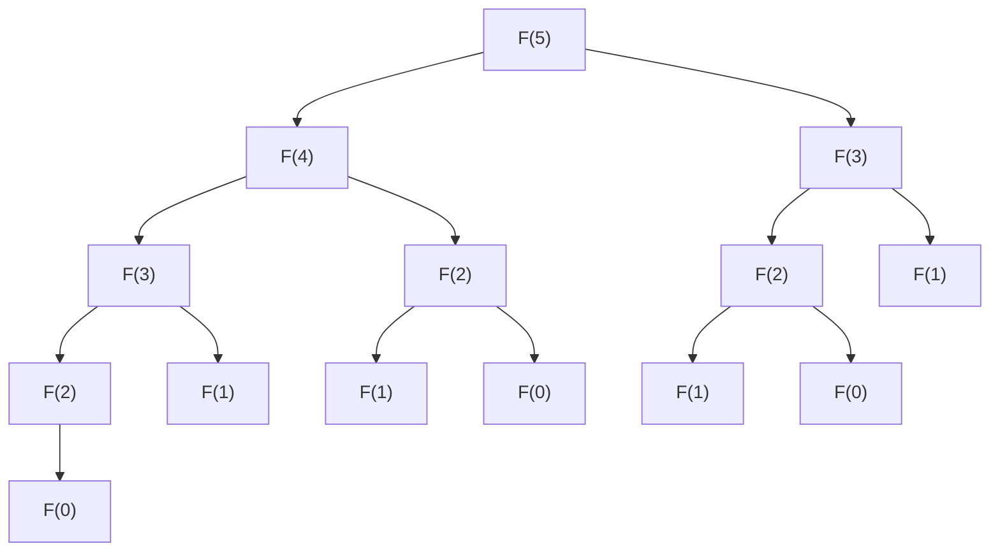

> 使用方式：本篇是动态规划的参考深水篇（方法论与线性 DP 册），适合系统梳理与回查；DP 入门的动手路径请配合主线篇目（递归与回溯 140）使用。

从一道题开始：爬 n 阶楼梯，每次走 1 或 2 阶，共有几种走法？暴力递归会成千上万次重复计算同一个子问题，而把答案记下来、再按依赖顺序递推，复杂度就从指数级掉到线性——这就是动态规划的全部直觉。本篇给出可复用的方法论闭环：先建模状态、再推导转移、后优化实现；状态、转移、初始化三要素贯穿始终。读完后你能独立完成「定义状态、写出转移方程、确定遍历顺序」的全流程，并知道什么时候该把递归改成递推。经典模型家族（背包、区间、树形、状压、数位）在姊妹篇展开。

## 前置知识

建议先阅读以下内容再进入本文：

- [算法分析基础与学习路线](/algorithm/010-AlgorithmAnalysisBasics)
- [递归与回溯](/algorithm/140-RecursionAndBacktracking)
- [离散数学](/cs-fundamentals/540-DiscreteMathematics)

## 第 1 章 学习目标与导论

### 1.1 本章在算法知识体系中的位置

动态规划（dynamic programming，由 Richard Bellman 于 1950 年代在 RAND Corporation 提出，"dynamic" 借用其"时变、多阶段"含义，"programming" 在 1940s-1950s 数学规划语境中指"最优表格化方案"，并非"编写程序"）是算法设计四大范式（分治、贪心、DP、回溯）中最具普适性也最难掌握的一种。它位于算法知识体系的"设计范式层"，向上承接 `algorithm/算法分析基础与学习路线` 与 `algorithm/递归与回溯`，向下衔接 `algorithm/贪心算法`、`algorithm/分治算法`、`algorithm/动态规划状态压缩`、`algorithm/Floyd-Warshall算法` 等具体应用。

学习本章前，读者应当已经掌握：

- `algorithm/算法分析基础与学习路线`：渐近复杂度、递归式主定理
- `algorithm/递归与回溯`：递归树分析、子问题图
- `cs-fundamentals/离散数学`：集合、关系、归纳法

掌握本章后，读者将进入本模块的 [DP 经典模型进阶](/algorithm/165-DPAdvancedPatterns)（背包、区间、树形、状压、数位与优化技术），并为后续学习 `algorithm/动态规划状态压缩`、`algorithm/Floyd-Warshall算法`、`algorithm/网络流` 等高级主题奠定坚实基础。

### 1.2 学习目标

本章遵循 Bloom 分类法，按认知层级递进组织学习目标：

1. **记忆（Remember）**：复述 Bellman 最优性原理的数学表述，识别动态规划的三大要素（最优子结构、重叠子问题、无后效性）。
2. **理解（Understand）**：解释动态规划从最优控制理论到计算机科学的演进脉络，说明"动态规划"命名的工程动机。
3. **应用（Apply）**：使用状态定义四步法推导一维、二维、区间、树形、状压、数位 DP 的状态转移方程。
4. **分析（Analyze）**：对比 DP 与分治、贪心、回溯的本质差异，论证给定问题是否具备最优子结构与重叠子问题性质。
5. **评估（Evaluate）**：评估滚动数组、单调队列、斜率优化、四边形不等式等优化技术的时间空间复杂度改进，选择合适的优化路径。
6. **创造（Create）**：设计面向生物信息学、NLP 分词、金融定价、推荐系统等工程场景的 DP 模型与实现。

### 1.3 阅读建议

- **零基础读者**：先通读第 5 章从暴力递归到 DP 的演进，建立直观认识后回看第 2、3、4 章理论与形式化定义；
- **有算法基础读者**：完成本篇线性 DP 部分后，进入 [DP 经典模型进阶](/algorithm/165-DPAdvancedPatterns) 学习背包、区间、树形、状压、数位 DP 与优化技术；
- **进阶读者**：直接研读进阶篇第 9、10 章的工程实践与开源项目案例研究。

---

## 第 2 章 历史动机与演进

### 2.1 1940s-1950s：运筹学与最优控制的诞生

动态规划的诞生与第二次世界大战后兴起的运筹学（Operations Research, OR）密切相关。1947 年 George Dantzig 在美国空军提出单纯形法（Simplex Method）求解线性规划（Linear Programming），"programming"一词从此在数学规划语境中表示"在约束下求最优的表格化方案"。这一术语被 Bellman 沿用。

1948 年美国空军资助成立 RAND Corporation（Research and Development Corporation），成为冷战时期运筹学与应用数学的核心研究机构。Richard Bellman 于 1952 年加入 RAND，致力于多阶段决策过程（multistage decision process）的研究，包括：

- 库存控制（inventory control）
- 资源分配（resource allocation）
- 最优控制（optimal control）
- 博弈论（game theory）

### 2.2 1952：Bellman 的奠基性论文

1952 年 8 月，Bellman 在 _Proceedings of the National Academy of Sciences_ 第 38 卷第 8 期发表《On the Theory of Dynamic Programming》，首次系统化提出动态规划的概念框架。该论文给出了著名的 **Bellman 方程**（Bellman equation）原型：

$$V(s) = \max_{a \in A(s)} \left\{ r(s, a) + \beta \sum_{s'} P(s' \mid s, a) V(s') \right\}$$

其中 $s$ 为状态，$a$ 为动作，$r$ 为即时回报，$\beta \in [0,1)$ 为折扣因子，$P$ 为状态转移概率。这一方程描述了多阶段决策问题中相邻状态最优值函数的递归关系，奠定了后续强化学习（Reinforcement Learning）与马尔可夫决策过程（MDP）的理论基础。

### 2.3 1957：专著《Dynamic Programming》

1957 年 Bellman 出版专著《Dynamic Programming》（Princeton University Press），系统阐述最优性原理（Principle of Optimality）：

> An optimal policy has the property that whatever the initial state and initial decision are, the remaining decisions must constitute an optimal policy with regard to the state resulting from the first decision.

即：最优策略的任意子策略也是最优的。这一原理等价于 CLRS 后提炼的"最优子结构"性质。

### 2.4 1960s-1970s：从最优控制到计算机科学

1960s 起动态规划被广泛引入计算机科学：

- **1962**：Bellman 与 Held、Karp 合作发表《A Dynamic Programming Approach to Sequencing Problems》，将 DP 应用于旅行商问题（TSP），即著名的 Held-Karp 算法，复杂度 $O(2^n \cdot n^2)$。
- **1966**：Stanley Gill 在《Numerical Analysis》中讨论 DP 的实现细节。
- **1968**：Donald Michie 提出"memo functions"概念，即现代术语的 **memoization**（记忆化），源自拉丁语 _memorandum_（应被记住的事物）。
- **1970**：Needleman 与 Wunsch 在 _Journal of Molecular Biology_ 发表蛋白质序列比对的 DP 算法，开创生物信息学先河。
- **1974**：Alfred Aho、John Hopcroft、Jeffrey Ullman 出版《The Design and Analysis of Computer Algorithms》，将 DP 列为五大算法设计技术之一。
- **1981**：Smith 与 Waterman 发表 _Identification of common molecular subsequences_，提出局部序列比对算法，沿用 DP 框架。

### 2.5 1989-2022：CLRS 的标准化与教学普及

1989 年 Cormen、Leiserson、Rivest 出版《Introduction to Algorithms》（第 1 版，即 CLRS 前身 CLR），将 DP 作为独立章节系统化教学，明确给出"最优子结构 + 重叠子问题"的两要素判定准则，并区分"自顶向下记忆化"与"自底向上递推"两种实现策略。

2022 年第 4 版（CLRS 4th）进一步补充：

- 强化学习与 MDP 的章节（第 33 章），与 Bellman 原始方程对接
- 在线算法与流算法中的 DP 思想
- 随机化 DP 与近似 DP

### 2.6 命名轶事：为何叫"Dynamic Programming"

Bellman 在自传《Eye of the Hurricane: An Autobiography》（1984）中坦言：

> "I spent the 1950s at RAND. My first task was to find a name for multistage decision processes. ... The word 'programming' was in vogue ... I wanted to get across the idea that this was dynamic, this was multistage, this was time-varying. ... I thought, let's kill two birds with one stone. Let's take a word that has an absolutely precise meaning, namely 'dynamic' ... Also, it is impossible to use the word 'dynamic' in a pejorative sense. ... The word 'research' was anathema to Wilson (RAND's then-president Charles Wilson). ... Hence, 'dynamic programming'."

可见该命名既反映了多阶段决策的时变本质，也包含规避管理层对"research"反感的工程考量。

---

## 第 3 章 形式化定义

### 3.1 多阶段决策过程

为了消除自然语言歧义，本节以数学形式化方式定义动态规划的语义。该形式化对应 Bellman 1957 专著与 CLRS 4th 第 14 章的定义。

设 $S$ 为状态空间，$A(s) \subseteq A$ 为状态 $s$ 下可行动作集合，$T: S \times A \to S$ 为状态转移函数（确定性情形），$r: S \times A \to \mathbb{R}$ 为即时回报函数，$\beta \in [0,1)$ 为折扣因子（无限阶段问题），$N \in \mathbb{N}^+$ 为阶段总数（有限阶段问题）。

**定义 3.1（策略，policy）**：策略 $\pi = (\pi_1, \pi_2, \dots, \pi_N)$ 是从状态到动作的映射序列，$\pi_k: S \to A$ 满足 $\pi_k(s) \in A(s)$。

**定义 3.2（值函数，value function）**：从初始状态 $s_0$ 出发，在策略 $\pi$ 下的累计回报为：

$$V^\pi(s_0) = \sum_{k=0}^{N-1} r(s_k, \pi_{k+1}(s_k)), \quad s_{k+1} = T(s_k, \pi_{k+1}(s_k))$$

**定义 3.3（最优值函数）**：

$$V^*(s) = \max_\pi V^\pi(s)$$

### 3.2 Bellman 方程

**定理 3.1（Bellman 最优性方程，确定性有限阶段）**：最优值函数满足递归关系：

$$V_k(s) = \max_{a \in A(s)} \left\{ r(s, a) + V_{k+1}(T(s, a)) \right\}, \quad k = 0, 1, \dots, N-1$$

边界条件 $V_N(s) = 0$（终点回报为 0）。该方程即为 **Bellman 方程**（Bellman, 1957）。

对于无限阶段折扣问题，方程变为：

$$V^*(s) = \max_{a \in A(s)} \left\{ r(s, a) + \beta \cdot V^*(T(s, a)) \right\}$$

### 3.3 最优子结构

**定义 3.4（最优子结构，optimal substructure）**：一个问题具有最优子结构性质，当且仅当其最优解可以由其子问题的最优解组合而成。形式化地，设 $\text{OPT}(P)$ 为问题 $P$ 的最优解，若 $P$ 可分解为子问题 $P_1, P_2, \dots, P_m$，则：

$$\text{OPT}(P) = \text{combine}\big( \text{OPT}(P_1), \text{OPT}(P_2), \dots, \text{OPT}(P_m) \big)$$

其中 $\text{combine}$ 为某种组合算子（如 $\max$、$+$、$\min$）。

**Bellman 最优性原理**（等价表述）：最优策略的任意子策略也是（从对应子状态出发的）最优策略。

### 3.4 重叠子问题

**定义 3.5（重叠子问题，overlapping subproblems）**：在递归求解过程中，若同一子问题被反复求解而非独立出现，则称该问题具有重叠子问题性质。形式化地，设 $S(P)$ 为求解 $P$ 时产生的子问题集合，若 $|S(P)| \ll |\text{recursion tree}(P)|$，即子问题总数远小于递归调用次数，则问题具有重叠子问题性质。

以斐波那契数列 $F(n) = F(n-1) + F(n-2)$ 为例，递归树规模为 $\Theta(\varphi^n)$（$\varphi = \frac{1+\sqrt{5}}{2}$），但实际不同的子问题仅有 $n+1$ 个：$F(0), F(1), \dots, F(n)$。

### 3.5 无后效性

**定义 3.6（无后效性，Markov property）**：状态 $s$ 确定后，其后续演化仅依赖 $s$ 本身，不依赖到达 $s$ 的历史路径。即：

$$\Pr(s_{k+1} \mid s_0, s_1, \dots, s_k, a_k) = \Pr(s_{k+1} \mid s_k, a_k)$$

无后效性是 DP 状态合法性的必要条件。若状态不满足无后效性，需扩展状态维度（如增加"已访问集合"）以恢复该性质，详见 [DP 经典模型进阶](/algorithm/165-DPAdvancedPatterns) 第 5 章与深水专题 [动态规划状态压缩](/algorithm/240-BitmaskDynamicProgramming)。

### 3.6 状态转移方程

**定义 3.7（状态转移方程，state transition equation）**：DP 的状态转移方程是 Bellman 方程在具体问题上的实例化，形式为：

$$\text{dp}[s] = \underset{\text{transition} \in \mathcal{T}(s)}{\text{combine}} \left\{ \text{cost}(\text{transition}) \oplus \text{dp}[s'] \right\}$$

其中 $\mathcal{T}(s)$ 为状态 $s$ 的所有可能转移集合，$s'$ 为转移后的新状态，$\text{combine}$ 通常为 $\max$ 或 $\min$，$\oplus$ 通常为 $+$。

例如 0-1 背包问题中：

$$\text{dp}[i][w] = \max\big( \text{dp}[i-1][w], \ \text{dp}[i-1][w - w_i] + v_i \big)$$

边界条件 $\text{dp}[0][w] = 0$，$\text{dp}[i][w] = -\infty$ 当 $w < 0$。

---

## 第 4 章 理论推导

### 4.1 最优子结构引理

**引理 4.1（最优子结构引理）**：设问题 $P$ 可分解为子问题 $P_1, P_2, \dots, P_m$，且 $P$ 的任一解可表示为 $(x_1, x_2, \dots, x_m)$，其中 $x_i$ 为 $P_i$ 的解。若 $P$ 满足最优子结构，则其最优解 $(x_1^*, x_2^*, \dots, x_m^*)$ 满足：对任意 $i$，$x_i^*$ 是 $P_i$ 在给定其他分量的最优解下的最优解。

**证明**（反证法）：

假设存在 $i$ 使得 $x_i^*$ 不是 $P_i$（在 $x_1^*, \dots, x_{i-1}^*, x_{i+1}^*, \dots, x_m^*$ 固定下）的最优解。即存在 $x_i'$ 使得总目标值更优：

$$\text{obj}(x_1^*, \dots, x_i', \dots, x_m^*) > \text{obj}(x_1^*, \dots, x_i^*, \dots, x_m^*)$$

但这与 $(x_1^*, \dots, x_m^*)$ 是 $P$ 的最优解矛盾。$\square$

### 4.2 重叠子问题定理

**定理 4.2（重叠子问题定理）**：设递归算法求解问题 $P$ 时产生的递归树为 $T$，不同子问题总数为 $|S|$，则：

- 纯递归算法的时间复杂度为 $\Omega(\text{leaf count of } T)$
- 记忆化递归（memoization）的时间复杂度为 $O(|S| \cdot \text{transition cost})$
- 自底向上递推的时间复杂度同为 $O(|S| \cdot \text{transition cost})$

**证明**：

记忆化保证每个子问题仅计算一次，每次计算的代价由其转移代价 $\text{transition cost}$ 决定（包含遍历所有可行动作）。总代价即为 $|S| \cdot \text{transition cost}$。

自底向上递推按拓扑顺序填充状态表，每个状态仅访问一次，代价同上。$\square$

### 4.3 时间复杂度公式

DP 的总时间复杂度可表示为：

$$T_{\text{DP}} = \Theta(|\text{state space}| \times |\text{transitions per state}|)$$

**状态数 × 转移数** 是 DP 复杂度分析的核心公式。常见示例如下：

| 问题        | 状态空间              | 每状态转移数 | 总复杂度                |
| :---------- | :-------------------- | :----------- | :---------------------- |
| 斐波那契    | $\Theta(n)$           | $\Theta(1)$  | $\Theta(n)$             |
| LCS         | $\Theta(mn)$          | $\Theta(1)$  | $\Theta(mn)$            |
| 0-1 背包    | $\Theta(nW)$          | $\Theta(1)$  | $\Theta(nW)$            |
| 矩阵链乘法  | $\Theta(n^2)$         | $\Theta(n)$  | $\Theta(n^3)$           |
| TSP（状压） | $\Theta(2^n \cdot n)$ | $\Theta(n)$  | $\Theta(2^n \cdot n^2)$ |

### 4.4 空间复杂度与滚动数组优化

**定理 4.3（滚动数组优化）**：若 DP 状态 $\text{dp}[i][j]$ 的转移仅依赖 $\text{dp}[i-1][\cdot]$（前一阶段），则可将空间复杂度从 $O(|S|)$ 优化至 $O(\text{sizeof single stage})$。

**证明**：

设阶段 $i$ 的状态集合为 $S_i = \{ \text{dp}[i][j] : j \in J_i \}$。若转移关系为：

$$\text{dp}[i][j] = f\big( \text{dp}[i-1][j'], \dots \big)$$

即不依赖 $\text{dp}[i-2][\cdot]$ 及更早阶段，则可在阶段 $i$ 计算完成后丢弃 $\text{dp}[i-2][\cdot]$ 的存储。最简实现为两个一维数组交替使用，空间降至 $O(\max_i |S_i|)$。

进一步地，若转移仅依赖 $j' \leq j$（或 $j' \geq j$），可使用单一一维数组并按相应方向遍历，空间降至 $O(|J_i|)$。$\square$

**例 4.1**：0-1 背包中 $\text{dp}[i][w] = \max(\text{dp}[i-1][w], \text{dp}[i-1][w - w_i] + v_i)$，第二项依赖更小的 $w$，故使用单一一维数组时 $w$ 必须从大到小遍历，否则 $\text{dp}[w - w_i]$ 已被本阶段更新，相当于物品被重复选取。0-1 背包的完整实现与四类背包的选型对比见 [DP 经典模型进阶](/algorithm/165-DPAdvancedPatterns) 第 2 章。

### 4.5 正确性论证：循环不变式

DP 算法的正确性证明通常基于**循环不变式**（loop invariant）。以 0-1 背包为例：

**不变式**：在第 $i$ 次外层循环开始前，对任意 $w \in [0, W]$，$\text{dp}[w]$ 等于"从前 $i-1$ 个物品中选取、总重量不超过 $w$ 时的最大价值"。

**初始化**：$i = 0$ 时 $\text{dp}[w] = 0$ 对所有 $w$ 成立（空物品集只有 0 价值解）。

**保持**：假设 $i = k$ 时不变式成立。第 $k$ 次迭代中，更新 $\text{dp}[w]$ 为：

$$\text{dp}[w] = \max(\text{dp}[w], \text{dp}[w - w_k] + v_k)$$

由 $w$ 从大到小遍历，$\text{dp}[w - w_k]$ 仍为阶段 $k-1$ 的值。新 $\text{dp}[w]$ 即"从前 $k$ 个物品中选取、总重量不超过 $w$ 时的最大价值"。不变式保持。

**终止**：$i = n$ 时不变式给出 $\text{dp}[W]$ 即所求。$\square$

### 4.6 伪多项式复杂度的严格定义

**定义 4.1（伪多项式时间，pseudo-polynomial time）**：算法 $A$ 的运行时间为 $O(p(n, V))$，其中 $n$ 为输入规模，$V$ 为输入数值的最大值。若 $V$ 随 $n$ 指数增长（即 $V = \Theta(2^n)$），则 $A$ 实际是指数时间。

0-1 背包的 $O(nW)$ 中，$W$ 以二进制编码需要 $\log W$ 位，故严格意义下输入规模为 $n + \log W$，$O(nW)$ 是指数级。这从理论上解释了为何 0-1 背包是 NP 完全问题。

---

## 第 5 章 从暴力递归到动态规划

### 5.1 三阶段演进路径

动态规划的演进路径可概括为：**暴力递归 → 记忆化搜索 → 自底向上递推**。下面以斐波那契数列 $F(n) = F(n-1) + F(n-2), F(0) = 0, F(1) = 1$ 为例展示三种写法的本质差异。

### 5.2 阶段 1：暴力递归

暴力递归直接翻译递推式，时间复杂度 $O(\varphi^n)$（$\varphi = \frac{1+\sqrt{5}}{2} \approx 1.618$），空间 $O(n)$（递归栈）。

```python
def fib_recursive(n: int) -> int:
    """暴力递归求斐波那契数。时间 O(phi^n)，空间 O(n)。"""
    if n <= 1:
        return n
    return fib_recursive(n - 1) + fib_recursive(n - 2)

# 测试
print(fib_recursive(10))   # 输出: 55
print(fib_recursive(20))   # 输出: 6765
```

**递归树展示重叠子问题**（以 $F(5)$ 为例）：



可见 $F(3)$ 被计算 2 次，$F(2)$ 被计算 3 次，$F(1)$ 被计算 5 次。递归树规模 $\Theta(\varphi^n)$，但不同子问题仅 $n+1$ 个。

### 5.3 阶段 2：记忆化搜索

记忆化搜索（memoization，Donald Michie 于 1968 年提出，源自拉丁语 _memorandum_ "应被记住的事物"）通过缓存已计算结果，将时间复杂度降至 $O(n)$。

```python
def fib_memo(n: int, memo: dict = None) -> int:
    """记忆化搜索求斐波那契数。时间 O(n)，空间 O(n)。"""
    if memo is None:
        memo = {}
    if n in memo:
        return memo[n]
    if n <= 1:
        return n
    memo[n] = fib_memo(n - 1, memo) + fib_memo(n - 2, memo)
    return memo[n]

# 测试
print(fib_memo(100))   # 输出: 354224848179261915075
```

```java
import java.util.HashMap;
import java.util.Map;

public class FibonacciMemo {
    /** 记忆化搜索求斐波那契数。 */
    public static long fibMemo(int n) {
        return fibMemo(n, new HashMap<>());
    }

    private static long fibMemo(int n, Map<Integer, Long> memo) {
        if (n <= 1) return n;
        if (memo.containsKey(n)) return memo.get(n);
        long result = fibMemo(n - 1, memo) + fibMemo(n - 2, memo);
        memo.put(n, result);
        return result;
    }

    public static void main(String[] args) {
        System.out.println(fibMemo(50));   // 输出: 12586269025
    }
}
```

### 5.4 阶段 3：自底向上递推

自底向上递推按依赖顺序填表，消除递归开销。时间 $O(n)$，空间可优化至 $O(1)$。

```python
def fib_dp_array(n: int) -> int:
    """自底向上递推求斐波那契数。时间 O(n)，空间 O(n)。"""
    if n <= 1:
        return n
    dp = [0] * (n + 1)
    dp[1] = 1
    for i in range(2, n + 1):
        dp[i] = dp[i - 1] + dp[i - 2]
    return dp[n]

def fib_dp_optimized(n: int) -> int:
    """滚动数组优化求斐波那契数。时间 O(n)，空间 O(1)。"""
    if n <= 1:
        return n
    prev, curr = 0, 1
    for _ in range(2, n + 1):
        prev, curr = curr, prev + curr
    return curr

# 测试
print(fib_dp_array(10))     # 输出: 55
print(fib_dp_optimized(100))  # 输出: 354224848179261915075
```

```cpp
#include <cstdint>
#include <iostream>

// 自底向上递推求斐波那契数。时间 O(n)，空间 O(1)。
int64_t fibDP(int n) {
    if (n <= 1) return n;
    int64_t prev = 0, curr = 1;
    for (int i = 2; i <= n; i++) {
        int64_t next = prev + curr;
        prev = curr;
        curr = next;
    }
    return curr;
}

int main() {
    std::cout << fibDP(50) << "\n";   // 输出: 12586269025
    return 0;
}
```

### 5.5 三种实现对比

| 实现方式     | 时间           | 空间          | 优点                   | 缺点                   |
| :----------- | :------------- | :------------ | :--------------------- | :--------------------- |
| 暴力递归     | $O(\varphi^n)$ | $O(n)$        | 直观、易写             | 重复计算、栈溢出       |
| 记忆化搜索   | $O(n)$         | $O(n)$        | 仅计算实际状态、易扩展 | 递归栈开销、可能溢出   |
| 自底向上递推 | $O(n)$         | $O(n)$→$O(1)$ | 常数因子小、易优化     | 需预先确定状态依赖顺序 |

### 5.6 DP 的核心价值

DP 的核心价值在于：**用空间换时间，将指数级的搜索空间压缩为多项式级**。设递归树规模为 $R$，不同子问题数为 $S$，则：

$$\text{DP 时间} = O(S \cdot T_{\text{transition}}), \quad \text{递归时间} = \Theta(R), \quad \text{当 } R \gg S \text{ 时收益巨大}$$

> 跨模块引用：DP 与贪心、分治的本质区别参见 [算法分析基础](/algorithm/010-AlgorithmAnalysisBasics) 中的范式对比。

---

## 第 6 章 一维 DP

### 6.1 爬楼梯

**问题**：有 $n$ 阶楼梯，每次可跨 1 或 2 阶，问有多少种爬法？

**状态定义**：$\text{dp}[i]$ = 爬到第 $i$ 阶的方法数。

**转移方程**：

$$\text{dp}[i] = \text{dp}[i-1] + \text{dp}[i-2], \quad \text{dp}[0] = 1, \ \text{dp}[1] = 1$$

```python
def climb_stairs(n: int) -> int:
    """爬楼梯方法数。时间 O(n)，空间 O(1)。"""
    if n <= 1:
        return 1
    prev, curr = 1, 1
    for _ in range(2, n + 1):
        prev, curr = curr, prev + curr
    return curr

# 测试
print(climb_stairs(5))   # 输出: 8
print(climb_stairs(10))  # 输出: 89
```

```cpp
#include <iostream>

// 爬楼梯方法数。时间 O(n)，空间 O(1)。
int climbStairs(int n) {
    if (n <= 1) return 1;
    int prev = 1, curr = 1;
    for (int i = 2; i <= n; i++) {
        int next = prev + curr;
        prev = curr;
        curr = next;
    }
    return curr;
}

int main() {
    std::cout << climbStairs(5) << "\n";   // 输出: 8
    return 0;
}
```

### 6.2 打家劫舍

**问题**：沿街排列 $n$ 个房子，第 $i$ 个房子有价值 $v[i]$，不能偷相邻两间，求最大收益。

**状态定义**：$\text{dp}[i]$ = 考虑前 $i$ 个房子的最大收益。

**转移方程**：

$$\text{dp}[i] = \max(\text{dp}[i-1], \ \text{dp}[i-2] + v[i])$$

```python
def rob(nums: list[int]) -> int:
    """打家劫舍。时间 O(n)，空间 O(1)。"""
    if not nums:
        return 0
    if len(nums) == 1:
        return nums[0]
    prev, curr = 0, nums[0]
    for i in range(1, len(nums)):
        prev, curr = curr, max(curr, prev + nums[i])
    return curr

# 测试
print(rob([1, 2, 3, 1]))    # 输出: 4
print(rob([2, 7, 9, 3, 1]))  # 输出: 12
```

```java
public class HouseRobber {
    /** 打家劫舍。时间 O(n)，空间 O(1)。 */
    public static int rob(int[] nums) {
        if (nums == null || nums.length == 0) return 0;
        if (nums.length == 1) return nums[0];
        int prev = 0, curr = nums[0];
        for (int i = 1; i < nums.length; i++) {
            int next = Math.max(curr, prev + nums[i]);
            prev = curr;
            curr = next;
        }
        return curr;
    }

    public static void main(String[] args) {
        System.out.println(rob(new int[]{1, 2, 3, 1}));   // 输出: 4
    }
}
```

### 6.3 股票买卖 I：单次交易

**问题**：给定股价数组，仅允许买卖一次，求最大利润。

**状态定义**：$\text{dp}[i]$ = 第 $i$ 天卖出时的最大利润。

$$\text{dp}[i] = \text{prices}[i] - \min_{j < i} \text{prices}[j]$$

```python
def max_profit_one_transaction(prices: list[int]) -> int:
    """单次交易最大利润。时间 O(n)，空间 O(1)。"""
    if not prices:
        return 0
    min_price = prices[0]
    max_profit = 0
    for p in prices[1:]:
        max_profit = max(max_profit, p - min_price)
        min_price = min(min_price, p)
    return max_profit

# 测试
print(max_profit_one_transaction([7, 1, 5, 3, 6, 4]))  # 输出: 5
```

### 6.4 股票买卖 II：任意次交易

**问题**：允许多次买卖，但同一时刻只能持有一股。

**状态定义**：

- $\text{dp}[i][0]$ = 第 $i$ 天结束时不持有股票的最大利润
- $\text{dp}[i][1]$ = 第 $i$ 天结束时持有股票的最大利润

**转移方程**：

$$\text{dp}[i][0] = \max(\text{dp}[i-1][0], \ \text{dp}[i-1][1] + \text{prices}[i])$$
$$\text{dp}[i][1] = \max(\text{dp}[i-1][1], \ \text{dp}[i-1][0] - \text{prices}[i])$$

```python
def max_profit_unlimited(prices: list[int]) -> int:
    """任意次交易最大利润。时间 O(n)，空间 O(1)。"""
    if not prices:
        return 0
    cash, hold = 0, -prices[0]
    for p in prices[1:]:
        cash, hold = max(cash, hold + p), max(hold, cash - p)
    return cash

# 测试
print(max_profit_unlimited([7, 1, 5, 3, 6, 4]))  # 输出: 7
```

### 6.5 股票买卖 III：含手续费与冷却期

**含手续费**：每次卖出支付 fee。

```python
def max_profit_with_fee(prices: list[int], fee: int) -> int:
    """含手续费的任意次交易。"""
    cash, hold = 0, -prices[0]
    for p in prices[1:]:
        cash = max(cash, hold + p - fee)
        hold = max(hold, cash - p)
    return cash

# 测试
print(max_profit_with_fee([1, 3, 2, 8, 4, 9], 2))  # 输出: 8
```

**含冷却期**：卖出后第二天不能买入。

```python
def max_profit_with_cooldown(prices: list[int]) -> int:
    """含冷却期的任意次交易。"""
    if not prices:
        return 0
    # 三状态：持有 / 不持有且冻结 / 不持有且不冻结
    hold, freeze, unfreeze = -prices[0], 0, 0
    for p in prices[1:]:
        prev_hold, prev_freeze, prev_unfreeze = hold, freeze, unfreeze
        hold = max(prev_hold, prev_unfreeze - p)
        freeze = prev_hold + p
        unfreeze = max(prev_unfreeze, prev_freeze)
    return max(freeze, unfreeze)

# 测试
print(max_profit_with_cooldown([1, 2, 3, 0, 2]))  # 输出: 3
```

### 6.6 最大子数组和（Kadane 算法）

**问题**：给定整数数组，求连续子数组的最大和。

**状态定义**：$\text{dp}[i]$ = 以 $\text{nums}[i]$ 结尾的最大子数组和。

$$\text{dp}[i] = \max(\text{nums}[i], \ \text{dp}[i-1] + \text{nums}[i])$$

```python
def max_subarray(nums: list[int]) -> int:
    """最大子数组和（Kadane 算法）。时间 O(n)，空间 O(1)。"""
    if not nums:
        return 0
    max_sum = curr_sum = nums[0]
    for x in nums[1:]:
        curr_sum = max(x, curr_sum + x)
        max_sum = max(max_sum, curr_sum)
    return max_sum

# 测试
print(max_subarray([-2, 1, -3, 4, -1, 2, 1, -5, 4]))  # 输出: 6
```

```cpp
#include <algorithm>
#include <iostream>
#include <vector>

// 最大子数组和。时间 O(n)，空间 O(1)。
int maxSubarray(const std::vector<int>& nums) {
    int maxSum = nums[0], currSum = nums[0];
    for (size_t i = 1; i < nums.size(); i++) {
        currSum = std::max(nums[i], currSum + nums[i]);
        maxSum = std::max(maxSum, currSum);
    }
    return maxSum;
}

int main() {
    std::cout << maxSubarray({-2, 1, -3, 4, -1, 2, 1, -5, 4}) << "\n";  // 输出: 6
    return 0;
}
```

### 6.7 零钱兑换

**问题**：给定硬币面额数组与金额 amount，求凑成 amount 的最少硬币数。

**状态定义**：$\text{dp}[a]$ = 凑成金额 $a$ 的最少硬币数。

$$\text{dp}[a] = \min_{c \in \text{coins}, c \leq a} \big( \text{dp}[a - c] + 1 \big)$$

```python
def coin_change(coins: list[int], amount: int) -> int:
    """零钱兑换：最少硬币数。时间 O(n*amount)，空间 O(amount)。"""
    INF = float('inf')
    dp = [0] + [INF] * amount
    for a in range(1, amount + 1):
        for c in coins:
            if c <= a:
                dp[a] = min(dp[a], dp[a - c] + 1)
    return dp[amount] if dp[amount] != INF else -1

# 测试
print(coin_change([1, 2, 5], 11))   # 输出: 3
print(coin_change([2], 3))          # 输出: -1
```

```java
public class CoinChange {
    public static int coinChange(int[] coins, int amount) {
        int INF = amount + 1;
        int[] dp = new int[amount + 1];
        java.util.Arrays.fill(dp, INF);
        dp[0] = 0;
        for (int a = 1; a <= amount; a++) {
            for (int c : coins) {
                if (c <= a) dp[a] = Math.min(dp[a], dp[a - c] + 1);
            }
        }
        return dp[amount] == INF ? -1 : dp[amount];
    }

    public static void main(String[] args) {
        System.out.println(coinChange(new int[]{1, 2, 5}, 11));   // 输出: 3
    }
}
```

### 6.8 零钱兑换 II：组合数

**问题**：求凑成 amount 的方案数（不同顺序视为同一种）。

```python
def coin_change_ways(coins: list[int], amount: int) -> int:
    """零钱兑换：组合数。外层物品、内层容量。"""
    dp = [0] * (amount + 1)
    dp[0] = 1
    for c in coins:
        for a in range(c, amount + 1):
            dp[a] += dp[a - c]
    return dp[amount]

# 测试
print(coin_change_ways([1, 2, 5], 5))   # 输出: 4
```

> 注：「外层物品、内层容量」的循环顺序即完全背包的一维写法，背包家族完整推导见 [DP 经典模型进阶](/algorithm/165-DPAdvancedPatterns) 第 2 章。

### 6.9 整数拆分

**问题**：将整数 $n$ 拆分为若干正整数之和，使乘积最大。

```python
def integer_break(n: int) -> int:
    """整数拆分最大乘积。时间 O(n^2)，空间 O(n)。"""
    dp = [0] * (n + 1)
    dp[1] = 1
    for i in range(2, n + 1):
        for j in range(1, i):
            dp[i] = max(dp[i], j * (i - j), j * dp[i - j])
    return dp[n]

# 测试
print(integer_break(10))  # 输出: 36
```

### 6.10 解码方法

**问题**：字母 'A'→1, ..., 'Z'→26，给定数字串，求解码方法数。

```python
def num_decodings(s: str) -> int:
    """解码方法数。"""
    if not s or s[0] == '0':
        return 0
    n = len(s)
    dp = [0] * (n + 1)
    dp[0] = dp[1] = 1
    for i in range(2, n + 1):
        if s[i - 1] != '0':
            dp[i] += dp[i - 1]
        two = int(s[i - 2:i])
        if 10 <= two <= 26:
            dp[i] += dp[i - 2]
    return dp[n]

# 测试
print(num_decodings("226"))   # 输出: 3
print(num_decodings("12"))    # 输出: 2
```

---

## 第 7 章 二维 DP 与序列问题

### 7.1 最长公共子序列（LCS）

**问题**：给定两个序列 $X$ 与 $Y$，求它们的最长公共子序列的长度（子序列不要求连续）。

**状态定义**：$\text{dp}[i][j]$ = $X[0..i-1]$ 与 $Y[0..j-1]$ 的 LCS 长度。

**转移方程**：

$$\text{dp}[i][j] = \begin{cases} \text{dp}[i-1][j-1] + 1 & \text{if } X[i-1] = Y[j-1] \\ \max(\text{dp}[i-1][j], \text{dp}[i][j-1]) & \text{otherwise} \end{cases}$$

**填表可视化**（$X$="ABCBDAB", $Y$="BDCABA"）：

```text
      ""  B  D  C  A  B  A
  ""   0  0  0  0  0  0  0
  A    0  0  0  0  1  1  1
  B    0  1  1  1  1  2  2
  C    0  1  1  2  2  2  2
  B    0  1  1  2  2  3  3
  D    0  1  2  2  2  3  3
  A    0  1  2  2  3  3  4
  B    0  1  2  2  3  4  4

LCS 长度 = 4, LCS = "BCBA" 或 "BDAB"
```

```python
def lcs_length(text1: str, text2: str) -> int:
    """最长公共子序列长度。时间 O(mn)，空间 O(mn)。"""
    m, n = len(text1), len(text2)
    dp = [[0] * (n + 1) for _ in range(m + 1)]
    for i in range(1, m + 1):
        for j in range(1, n + 1):
            if text1[i - 1] == text2[j - 1]:
                dp[i][j] = dp[i - 1][j - 1] + 1
            else:
                dp[i][j] = max(dp[i - 1][j], dp[i][j - 1])
    return dp[m][n]

def lcs_string(text1: str, text2: str) -> str:
    """还原 LCS 字符串。"""
    m, n = len(text1), len(text2)
    dp = [[0] * (n + 1) for _ in range(m + 1)]
    for i in range(1, m + 1):
        for j in range(1, n + 1):
            if text1[i - 1] == text2[j - 1]:
                dp[i][j] = dp[i - 1][j - 1] + 1
            else:
                dp[i][j] = max(dp[i - 1][j], dp[i][j - 1])
    # 回溯
    result = []
    i, j = m, n
    while i > 0 and j > 0:
        if text1[i - 1] == text2[j - 1]:
            result.append(text1[i - 1])
            i -= 1
            j -= 1
        elif dp[i - 1][j] > dp[i][j - 1]:
            i -= 1
        else:
            j -= 1
    return ''.join(reversed(result))

# 测试
print(lcs_length("ABCBDAB", "BDCABA"))   # 输出: 4
print(lcs_string("ABCBDAB", "BDCABA"))   # 输出: BDAB
```

```cpp
#include <algorithm>
#include <string>
#include <vector>

// LCS 长度。时间 O(mn)，空间 O(mn)。
int lcsLength(const std::string& text1, const std::string& text2) {
    int m = text1.size(), n = text2.size();
    std::vector<std::vector<int>> dp(m + 1, std::vector<int>(n + 1, 0));
    for (int i = 1; i <= m; i++) {
        for (int j = 1; j <= n; j++) {
            if (text1[i - 1] == text2[j - 1]) {
                dp[i][j] = dp[i - 1][j - 1] + 1;
            } else {
                dp[i][j] = std::max(dp[i - 1][j], dp[i][j - 1]);
            }
        }
    }
    return dp[m][n];
}
```

### 7.2 最长公共子串

**问题**：求两个字符串的最长连续公共子串。

**状态定义**：$\text{dp}[i][j]$ = 以 $X[i-1]$ 与 $Y[j-1]$ 结尾的最长公共子串长度。

$$\text{dp}[i][j] = \begin{cases} \text{dp}[i-1][j-1] + 1 & \text{if } X[i-1] = Y[j-1] \\ 0 & \text{otherwise} \end{cases}$$

```python
def longest_common_substring(s1: str, s2: str) -> str:
    """最长公共子串。时间 O(mn)，空间 O(mn)。"""
    m, n = len(s1), len(s2)
    dp = [[0] * (n + 1) for _ in range(m + 1)]
    max_len, end_i = 0, 0
    for i in range(1, m + 1):
        for j in range(1, n + 1):
            if s1[i - 1] == s2[j - 1]:
                dp[i][j] = dp[i - 1][j - 1] + 1
                if dp[i][j] > max_len:
                    max_len, end_i = dp[i][j], i
    return s1[end_i - max_len:end_i]

# 测试
print(longest_common_substring("abcdef", "zcdem"))   # 输出: cde
```

### 7.3 编辑距离（Levenshtein 距离）

**问题**：给定两个字符串 word1 与 word2，允许三种操作（插入、删除、替换），求将 word1 转换为 word2 的最少操作次数。

**状态定义**：$\text{dp}[i][j]$ = word1[0..i-1] 转换为 word2[0..j-1] 的最少操作数。

**转移方程**：

$$\text{dp}[i][j] = \begin{cases} \text{dp}[i-1][j-1] & \text{if } \text{word1}[i-1] = \text{word2}[j-1] \\ 1 + \min \big( \text{dp}[i-1][j], \text{dp}[i][j-1], \text{dp}[i-1][j-1] \big) & \text{otherwise} \end{cases}$$

边界条件 $\text{dp}[i][0] = i$, $\text{dp}[0][j] = j$。

```python
def edit_distance(word1: str, word2: str) -> int:
    """编辑距离。时间 O(mn)，空间 O(mn)。"""
    m, n = len(word1), len(word2)
    dp = [[0] * (n + 1) for _ in range(m + 1)]
    for i in range(m + 1):
        dp[i][0] = i
    for j in range(n + 1):
        dp[0][j] = j
    for i in range(1, m + 1):
        for j in range(1, n + 1):
            if word1[i - 1] == word2[j - 1]:
                dp[i][j] = dp[i - 1][j - 1]
            else:
                dp[i][j] = min(dp[i - 1][j], dp[i][j - 1], dp[i - 1][j - 1]) + 1
    return dp[m][n]

def edit_distance_optimized(word1: str, word2: str) -> int:
    """滚动数组优化版。空间 O(min(m, n))。"""
    if len(word1) < len(word2):
        word1, word2 = word2, word1
    m, n = len(word1), len(word2)
    prev = list(range(n + 1))
    for i in range(1, m + 1):
        curr = [i] + [0] * n
        for j in range(1, n + 1):
            if word1[i - 1] == word2[j - 1]:
                curr[j] = prev[j - 1]
            else:
                curr[j] = min(prev[j], curr[j - 1], prev[j - 1]) + 1
        prev = curr
    return prev[n]

# 测试
print(edit_distance("horse", "ros"))           # 输出: 3
print(edit_distance_optimized("intention", "execution"))  # 输出: 5
```

```java
public class EditDistance {
    public static int editDistance(String word1, String word2) {
        int m = word1.length(), n = word2.length();
        int[][] dp = new int[m + 1][n + 1];
        for (int i = 0; i <= m; i++) dp[i][0] = i;
        for (int j = 0; j <= n; j++) dp[0][j] = j;
        for (int i = 1; i <= m; i++) {
            for (int j = 1; j <= n; j++) {
                if (word1.charAt(i - 1) == word2.charAt(j - 1)) {
                    dp[i][j] = dp[i - 1][j - 1];
                } else {
                    dp[i][j] = 1 + Math.min(
                        Math.min(dp[i - 1][j], dp[i][j - 1]),
                        dp[i - 1][j - 1]
                    );
                }
            }
        }
        return dp[m][n];
    }

    public static void main(String[] args) {
        System.out.println(editDistance("horse", "ros"));   // 输出: 3
    }
}
```

### 7.4 最长递增子序列（LIS）

**问题**：给定整数数组，找到最长严格递增子序列的长度。

#### 7.4.1 O(n²) DP 解法

**状态定义**：$\text{dp}[i]$ = 以 $\text{nums}[i]$ 结尾的 LIS 长度。

$$\text{dp}[i] = \max_{j < i, \text{nums}[j] < \text{nums}[i]} \big( \text{dp}[j] + 1 \big), \quad \text{dp}[i] = 1 \text{ if no such } j$$

```python
def lis_dp(nums: list[int]) -> int:
    """LIS O(n^2) DP。空间 O(n)。"""
    if not nums:
        return 0
    n = len(nums)
    dp = [1] * n
    for i in range(1, n):
        for j in range(i):
            if nums[j] < nums[i]:
                dp[i] = max(dp[i], dp[j] + 1)
    return max(dp)

# 测试
print(lis_dp([10, 9, 2, 5, 3, 7, 101, 18]))  # 输出: 4
```

```cpp
#include <algorithm>
#include <vector>

// LIS O(n^2) DP。
int lisDP(const std::vector<int>& nums) {
    if (nums.empty()) return 0;
    int n = nums.size();
    std::vector<int> dp(n, 1);
    for (int i = 1; i < n; i++) {
        for (int j = 0; j < i; j++) {
            if (nums[j] < nums[i]) {
                dp[i] = std::max(dp[i], dp[j] + 1);
            }
        }
    }
    return *std::max_element(dp.begin(), dp.end());
}
```

#### 7.4.2 O(n log n) 贪心 + 二分解法

维护数组 `tails`，`tails[i]` 表示长度为 $i+1$ 的递增子序列的最小末尾元素。对每个元素，用二分查找确定其在 `tails` 中的位置。

```python
import bisect

def lis_binary(nums: list[int]) -> int:
    """LIS O(n log n) 贪心+二分。空间 O(n)。"""
    tails = []
    for x in nums:
        pos = bisect.bisect_left(tails, x)
        if pos == len(tails):
            tails.append(x)
        else:
            tails[pos] = x
    return len(tails)

# 测试
print(lis_binary([10, 9, 2, 5, 3, 7, 101, 18]))  # 输出: 4
```

```cpp
#include <algorithm>
#include <vector>

// LIS O(n log n)。
int lisBinary(const std::vector<int>& nums) {
    std::vector<int> tails;
    for (int x : nums) {
        auto it = std::lower_bound(tails.begin(), tails.end(), x);
        if (it == tails.end()) tails.push_back(x);
        else *it = x;
    }
    return tails.size();
}
```

**等价性证明**：`tails` 数组始终递增。当新元素 $x$ 大于 `tails` 末尾时，可以扩展最长子序列；否则用 $x$ 替换 `tails` 中第一个 $\geq x$ 的元素，保证了未来能接上更小的元素，从而获得更长的递增子序列。

### 7.5 最长回文子序列

**状态定义**：$\text{dp}[i][j]$ = $s[i..j]$ 中最长回文子序列的长度。

$$\text{dp}[i][j] = \begin{cases} \text{dp}[i+1][j-1] + 2 & \text{if } s[i] = s[j] \\ \max(\text{dp}[i+1][j], \text{dp}[i][j-1]) & \text{otherwise} \end{cases}$$

边界条件 $\text{dp}[i][i] = 1$。

```python
def longest_palindrome_subseq(s: str) -> int:
    """最长回文子序列长度。区间 DP。"""
    n = len(s)
    if n == 0:
        return 0
    dp = [[0] * n for _ in range(n)]
    for i in range(n):
        dp[i][i] = 1
    # 按长度递增枚举
    for length in range(2, n + 1):
        for i in range(n - length + 1):
            j = i + length - 1
            if s[i] == s[j]:
                dp[i][j] = (dp[i + 1][j - 1] if length > 2 else 0) + 2
            else:
                dp[i][j] = max(dp[i + 1][j], dp[i][j - 1])
    return dp[0][n - 1]

# 测试
print(longest_palindrome_subseq("bbbab"))  # 输出: 4
```

> 本例即「按区间长度枚举」的区间 DP 框架，该框架的系统讲解与更多例题见 [DP 经典模型进阶](/algorithm/165-DPAdvancedPatterns) 第 3 章。

### 7.6 最长回文子串

**中心扩展法**：$O(n^2)$ 时间，$O(1)$ 空间。

```python
def longest_palindrome_substring(s: str) -> str:
    """最长回文子串。中心扩展法。"""
    if not s:
        return ""

    def expand(l: int, r: int) -> int:
        while l >= 0 and r < len(s) and s[l] == s[r]:
            l -= 1
            r += 1
        return r - l - 1

    start, max_len = 0, 0
    for i in range(len(s)):
        len1 = expand(i, i)
        len2 = expand(i, i + 1)
        curr = max(len1, len2)
        if curr > max_len:
            max_len = curr
            start = i - (curr - 1) // 2
    return s[start:start + max_len]

# 测试
print(longest_palindrome_substring("babad"))  # 输出: bab
```

### 7.7 子序列 vs 子串：状态定义差异

| 问题 | 子序列（不连续）                                | 子串（连续）           |
| :--- | :---------------------------------------------- | :--------------------- |
| LCS  | $\text{dp}[i][j]$ 从 $\text{dp}[i-1][j-1]$ 转移 | 最长公共子串需连续匹配 |
| 回文 | $\text{dp}[i][j]$ 从 $\text{dp}[i+1][j-1]$ 转移 | 中心扩展法             |
| 递增 | $\text{dp}[i]$ 从所有 $j<i$ 转移                | 需要连续递增条件       |

---

## 第 8 章 对比分析

### 8.1 DP 与分治

| 维度       | 分治               | DP                      |
| :--------- | :----------------- | :---------------------- |
| 子问题关系 | 独立               | 重叠                    |
| 存储方式   | 无需缓存           | 必须缓存                |
| 典型问题   | 归并排序、快速排序 | 斐波那契、背包          |
| 时间复杂度 | $\Theta(n \log n)$ | $\Theta(\|S\| \cdot T)$ |

**关键差异**：分治的子问题相互独立，无需缓存；DP 的子问题重叠，缓存是性能关键。

### 8.2 DP 与贪心

| 维度       | 贪心                         | DP                       |
| :--------- | :--------------------------- | :----------------------- |
| 决策方式   | 局部最优                     | 全局最优                 |
| 必要性质   | 最优子结构 + 贪心选择性质    | 最优子结构 + 重叠子问题  |
| 时间复杂度 | 通常 $O(n \log n)$           | $O(\|S\| \cdot T)$       |
| 典型问题   | 活动选择、Huffman 编码       | 0-1 背包、LCS            |
| 失败场景   | 0-1 背包（贪心选择不可撤销） | 子问题不重叠时退化为分治 |

**判定准则**：贪心适用需证明"贪心选择性质"——通过交换论证（Exchange Argument）证明最优解可被替换为贪心选择而不变差。

### 8.3 DP 与回溯

| 维度       | 回溯            | DP                       |
| :--------- | :-------------- | :----------------------- |
| 搜索方式   | 深度优先 + 剪枝 | 状态空间填表             |
| 解空间     | 全部解（枚举）  | 最优值（聚合）           |
| 时间复杂度 | 指数级          | 多项式级（状态数有限时） |
| 典型问题   | N 皇后、全排列  | 背包、LCS                |

**关系**：DP 可视为"带记忆化的回溯"，仅适用于求最优值或计数；回溯可输出所有具体解。

### 8.4 DP 与 BFS/DFS

BFS/DFS 用于图搜索，DP 用于状态空间搜索。两者关系：

- BFS 的最短路算法（Dijkstra、Bellman-Ford）本质是 DP 在图上的实例化
- Floyd-Warshall 全源最短路是典型的区间 DP
- DP 的状态空间可视为 DAG，自底向上递推即拓扑序遍历

### 8.5 DP 与最优控制理论

动态规划起源于 Bellman 的最优控制研究，二者关系：

- **最优控制**：连续状态空间 + 微分方程 + Hamilton-Jacobi-Bellman (HJB) 方程
- **DP（CS 语境）**：离散状态空间 + 状态转移方程 + Bellman 方程

HJB 方程是 Bellman 方程在连续时间下的极限形式：

$$-\frac{\partial V}{\partial t} = \max_a \big\{ r(s, a) + \nabla V \cdot f(s, a) \big\}$$

### 8.6 DP 与强化学习

强化学习（Reinforcement Learning, RL）是 DP 在未知环境下的扩展：

| 维度   | DP               | RL                     |
| :----- | :--------------- | :--------------------- |
| 模型   | 已知（$P$, $r$） | 未知（通过交互学习）   |
| 核心   | Bellman 方程求解 | Bellman 方程采样估计   |
| 算法   | 值迭代、策略迭代 | Q-learning、SARSA、DQN |
| 收敛性 | 严格保证         | 依赖探索与样本         |

> 跨模块引用：DP 在图算法中的应用（如 Floyd-Warshall）参见 [Floyd-Warshall 算法](/algorithm/250-FloydWarshall)。DP 与贪心的边界讨论参见 [贪心算法](/algorithm/130-GreedyAlgorithm)。

---

## 第 9 章 常见陷阱

本章汇总方法论与线性 DP 阶段最常见的实现错误。与具体模型强相关的陷阱（背包的边界与遍历顺序、区间 DP 枚举顺序、多重背包拆分、状压 DP 状态规模、伪多项式复杂度）见 [DP 经典模型进阶](/algorithm/165-DPAdvancedPatterns) 第 8 章。

### 9.1 陷阱 1：状态定义错误

::::danger 错误示例

```python
# 求最长递增子序列，错误定义为"前 i 个数的 LIS"
def lis_wrong(nums):
    dp = [1] * len(nums)
    for i in range(1, len(nums)):
        if nums[i] > nums[i - 1]:
            dp[i] = dp[i - 1] + 1
    return max(dp)
```

::::

**原因**：状态定义为"前 $i$ 个数的 LIS"时，转移无法判断 $\text{nums}[i]$ 是否能接在以 $\text{nums}[j]$ 结尾的子序列后，因 $j$ 未知。

**修正**：状态必须为"以 $\text{nums}[i]$ 结尾的 LIS"，遍历所有 $j < i$。

### 9.2 陷阱 2：初始化错误

::::danger 错误示例

```python
# 编辑距离未初始化边界
def edit_distance_wrong(w1, w2):
    m, n = len(w1), len(w2)
    dp = [[0] * (n + 1) for _ in range(m + 1)]
    # 未设置 dp[i][0] = i, dp[0][j] = j
    for i in range(1, m + 1):
        for j in range(1, n + 1):
            ...
    return dp[m][n]  # 错误：空串到非空串的转换未考虑
```

::::

**修正**：DP 的初始化代表"最小子问题"的解，必须显式设置 $\text{dp}[i][0]$、$\text{dp}[0][j]$。

### 9.3 陷阱 3：无后效性破坏

::::danger 错误示例

```python
# 棋盘路径计数，要求"不能经过已走过的格子"
# 仅用 dp[i][j] 表示到达 (i, j) 的方法数 —— 错误
# 因为未来决策依赖历史路径，无后效性被破坏
```

::::

**修正**：扩展状态维度，加入"已访问集合"（位掩码），如 TSP 的 $\text{dp}[\text{mask}][u]$（完整推导见 [DP 经典模型进阶](/algorithm/165-DPAdvancedPatterns) 第 5 章）。

### 9.4 陷阱 4：负权边处理错误

::::danger 错误示例

```python
# 用 Dijkstra 处理含负权边的最短路 —— 错误
# Dijkstra 的贪心选择要求"已确定最短路的节点不会被更新"，负权边违反
```

::::

**修正**：含负权边应用 Bellman-Ford 或 SPFA，本质均为 DP 在图上的实例化。

### 9.5 陷阱 5：浮点数精度问题

::::danger 错误示例

```python
# 概率 DP 直接累乘浮点数，下溢
dp = [0.0] * (n + 1)
dp[0] = 1.0
for i in range(1, n + 1):
    dp[i] = dp[i - 1] * 1e-10  # n=1000 时下溢为 0
```

::::

**修正**：使用对数累加 $\log \text{dp}[i] = \log \text{dp}[i-1] + \log p$，或用 `decimal.Decimal`。

### 9.6 陷阱 6：记忆化搜索的 cache key 选择

::::danger 错误示例

```python
from functools import lru_cache

@lru_cache(maxsize=None)
def dfs(state: list) -> int:  # list 不可哈希，报错
    ...
```

::::

**修正**：将可变状态转为不可变类型（tuple、frozenset、字符串）。

---

## 第 10 章 参考文献

### 10.1 教科书与专著

1. **Cormen, T. H., Leiserson, C. E., Rivest, R. L., & Stein, C.** (2022). _Introduction to Algorithms_ (4th ed.). MIT Press. ISBN 978-0262046305.
   - 简称 CLRS 4th，本文档章节划分、习题风格、定理表述均以此为基准。第 14 章 Dynamic Programming 为 DP 教学经典。

2. **Bellman, R.** (1957). _Dynamic Programming_. Princeton University Press. ISBN 978-0691079516.
   - DP 理论的奠基专著，Bellman 在本书中首次系统化提出最优性原理与多阶段决策框架。

3. **Bertsekas, D. P.** (2017). _Dynamic Programming and Optimal Control_ (4th ed.). Athena Scientific. ISBN 978-1886529267.
   - 从最优控制理论视角阐述 DP，是连接计算机科学 DP 与控制理论 DP 的桥梁。

4. **Kleinberg, J., & Tardos, É.** (2006). _Algorithm Design_. Pearson. ISBN 978-0321295354.
   - 第 6 章 Dynamic Programming 给出大量现代算法设计案例，加权区间调度等题目灵感来源。

5. **Dasgupta, S., Papadimitriou, C., & Vazirani, U.** (2006). _Algorithms_. McGraw-Hill. ISBN 978-0073523408.
   - Berkeley 与 UCSD 教材，篇幅精炼，DP 章节聚焦于思路启发而非穷尽列举。

6. **Knuth, D. E.** (1997). _The Art of Computer Programming, Volume 1: Fundamental Algorithms_ (3rd ed.). Addison-Wesley Professional. ISBN 978-0201896831.
   - TAOCP 第 1 卷，包含 DP 早期形式化与 memoization 的历史考据。

7. **Russell, S., & Norvig, P.** (2021). _Artificial Intelligence: A Modern Approach_ (4th ed.). Pearson. ISBN 978-0134610993.
   - 第 17 章 Sequential Decision Problems 将 DP 与强化学习（RL）统一在 Bellman 方程下。

### 10.2 期刊与会议论文

8. **Bellman, R.** (1952). On the Theory of Dynamic Programming. _Proceedings of the National Academy of Sciences_, 38(8), 716-719. DOI: [10.1073/pnas.38.8.716](https://doi.org/10.1073/pnas.38.8.716).
    - DP 理论的首篇公开论文，提出 Bellman 递归方程。

---

## 第 11 章 延伸阅读

本篇为方法论与线性 DP 篇，延伸资源按跨模块横向扩展与进阶论文、开放课程两个维度组织；模块内纵向深化（背包、区间、树形、状压、数位与工程案例）见 [DP 经典模型进阶](/algorithm/165-DPAdvancedPatterns) 第 12 章。

### 11.1 跨模块横向扩展

DP 的数学基础与工程应用涉及多个学科，以下关联模块提供必要的横向知识：

- cs-fundamentals/离散数学 — 归纳法、递归关系、组合数学的形式化基础，DP 正确性证明的数学工具
- math/离散数学 — 离散数学的另一入口，含生成函数与递推关系的高级技巧
- math/概率论与数理统计 — 随机 DP、马尔可夫决策过程（MDP）的理论基础
- cs-fundamentals/算法导论精读 — CLRS 教材的逐章精读笔记，可与本文档交叉学习
- ai/强化学习基础 — Bellman 方程在 RL 中的泛化，Q-Learning 与 Policy Gradient 的起点
- ai/马尔可夫决策过程 — MDP 的形式化定义与求解，理解 DP 在 AI 中的核心地位
- bioinformatics/序列比对 — Smith-Waterman 与 Needleman-Wunsch 的生物学背景与扩展算法
- finance/量化交易基础 — DP 在期权定价、最优停止问题中的金融应用深化

### 11.2 进阶论文与开放课程

- **Bellman 最优性原理原始论文**（Bellman 1952, PNAS）— DP 理论的起点，1 页篇幅可读性极强
- **CLRS 4th 第 14 章**（Cormen et al. 2022）— DP 教学章节的标准范本
- **MIT 6.006 Introduction to Algorithms**（开放课程）— DP 单元的视频讲解与习题
- **Stanford CS161 Design and Analysis of Algorithms**（开放课程）— Kleinberg-Tardos 风格的 DP 讲义

---

> **审阅信息**：本文档最后审阅于 2026-07-18，由 FANDEX Content Engineering 审阅；2026-09-27 依据参考层定位约定拆分为「方法论与线性 DP」（本篇）与「DP 经典模型进阶」两篇。预估阅读时长 90 分钟（含代码示例）。如发现错误或建议改进，请通过项目 Issue 反馈。
>
> **本篇结语**：动态规划是连接数学归纳法、最优化理论与软件工程的桥梁。本篇完成了「先建模状态、再推导转移、后优化实现」的方法论闭环，并以线性 DP 经典问题收束。背包、区间、树形、状压、数位等经典模型、优化技术与工程案例，请继续阅读 [DP 经典模型进阶](/algorithm/165-DPAdvancedPatterns)；状压方向的深水专题见 [动态规划状态压缩](/algorithm/240-BitmaskDynamicProgramming)。

## 读完自检

- DP 问题成立的两条前提是什么？（最优子结构与重叠子问题；无后效性保证状态定义自洽）
- 记忆化搜索与自底向上递推各适合什么场景？（记忆化：状态稀疏、转移难枚举方向；递推：状态稠密、依赖顺序清晰、便于滚动数组优化）
- 定义状态的口诀是什么？（状态要能唯一决定「后续的最优解怎么算」——问什么就把什么放进状态）
- 一道题写出两个都对但复杂度不同的状态定义时，怎么选？（状态数 × 每状态转移数 = 总复杂度，选总账更小的）
- 能把爬楼梯、最大子数组和、最长递增子序列三题的状态、转移、初始化三要素独立默写出来。
