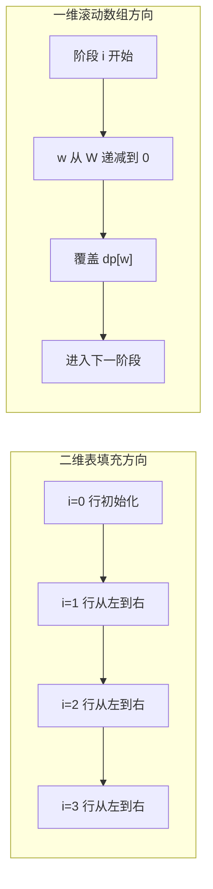
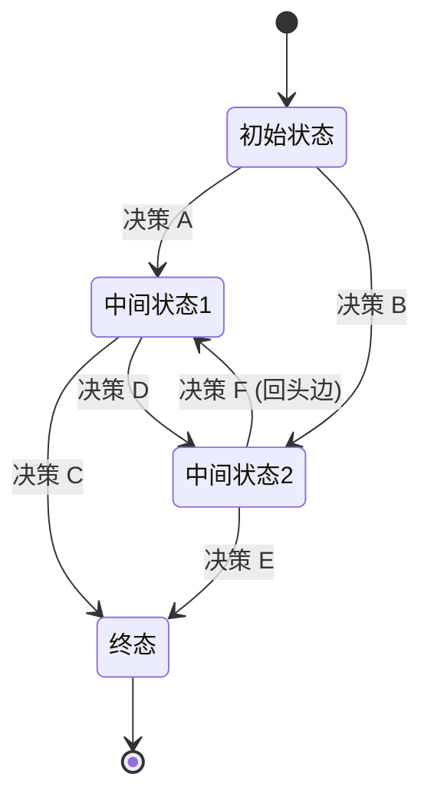
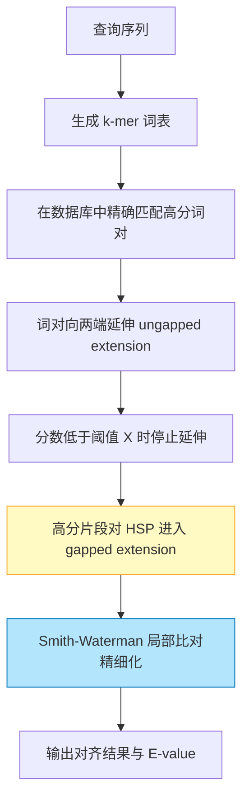

> 使用方式：本篇是动态规划的参考深水篇（经典模型册），与[方法论与线性 DP](/algorithm/160-DynamicProgramming) 互为姊妹篇，适合按模型来查。

学完 DP 方法论，面对新问题依然常常无从下手——因为「状态该长什么样」取决于问题属于哪个模型家族：带容量约束下的选取是背包，合并对象是区间是区间 DP，约束发生在父子节点间是树形 DP，状态里含集合且元素不超过 20 个是状压，按数位统计是数位。本篇就是这张模型地图加模板库：每族模型给出适用信号、通用框架与代表题。读完后你能做到「识别模型、套用框架、按需优化」三步走，而不是从零硬想状态。

## 前置知识

建议先阅读以下内容再进入本文：

- [动态规划（方法论与线性 DP）](/algorithm/160-DynamicProgramming)
- [算法分析基础与学习路线](/algorithm/010-AlgorithmAnalysisBasics)

## 第 1 章 导论：本篇定位与模型地图

### 1.1 本篇在模块中的位置

本篇是 [动态规划（方法论与线性 DP）](/algorithm/160-DynamicProgramming) 的姊妹篇，同属参考层。方法论篇解决「如何想」——状态、转移、初始化三要素，以及从暴力递归、记忆化搜索到自底向上递推的完整推演；本篇解决「如何建」——把具体问题映射到经典 DP 模型家族，并给出可直接复用的实现与选型判断。状压方向的深水专题是 [动态规划状态压缩](/algorithm/240-BitmaskDynamicProgramming)，本篇第 5 章仅作概念级衔接。

### 1.2 模型地图

| 模型 | 适用信号 | 所在章节 | 代表问题 |
| :--- | :--- | :--- | :--- |
| 背包 | 容量约束下的选取决策 | 第 2 章 | 0-1 背包、完全背包、多重背包、分组背包 |
| 区间 DP | 区间合并与分界点决策 | 第 3 章 | 合并石子、矩阵链乘法、戳气球 |
| 树形 DP | 树上父子约束的组合优化 | 第 4 章 | 没有上司的舞会、打家劫舍 III |
| 状态压缩 DP | 状态含集合信息且元素数较小 | 第 5 章 | 旅行商问题 TSP |
| 数位 DP | 区间内按数位计数与统计 | 第 6 章 | 不含连续 1 的整数、数字 1 的个数 |

### 1.3 优化方向预告

模型选对、状态定型之后，优化的对象是转移效率，第一性思路是消除重复转移：

- **前缀和**：区间和查询 O(1) 化，第 3 章合并石子已直接使用；
- **单调队列**：滑动窗口最值转移由 O(n) 降至均摊 O(1)，见第 7.2 节；
- **斜率优化**：决策点构成凸包时进一步均摊，见第 7.3 节；
- **四边形不等式**：利用决策单调性把区间 DP 的 O(n^3) 降至 O(n^2)，见第 7.4 节。

逐项实现与适用条件见第 7 章；工程实践与开源案例见第 9、10 章。

---

## 第 2 章 背包问题家族

背包是「容量约束下的选取」模型族，也是 0-1 决策 DP 的原型。方法论篇第 4 章已以 0-1 背包演示过循环不变式与滚动数组方向的推导，本章给出四类背包的完整实现与选型对比。

### 2.1 0-1 背包

**问题**：给定 $n$ 个物品，每个物品有重量 $w[i]$ 与价值 $v[i]$，背包容量为 $W$。每个物品只能选 0 或 1 个，求最大总价值。

**状态定义**：$\text{dp}[i][w]$ = 从前 $i$ 个物品中选取、总重量不超过 $w$ 时的最大价值。

**转移方程**：

$$\text{dp}[i][w] = \max\big( \text{dp}[i-1][w], \ \text{dp}[i-1][w - w_i] + v_i \big) \quad (w \geq w_i)$$

**填表可视化**（3 个物品，$W=5$，物品 $(w=2,v=3), (w=3,v=4), (w=4,v=5)$）：

```text
dp[i][w]:
     w=0  w=1  w=2  w=3  w=4  w=5
i=0 |  0    0    0    0    0    0
i=1 |  0    0    3    3    3    3
i=2 |  0    0    3    4    4    7
i=3 |  0    0    3    4    5    7
```



```python
def knapsack_01(weights: list[int], values: list[int], capacity: int) -> int:
    """0-1 背包二维实现。时间 O(nW)，空间 O(nW)。"""
    n = len(weights)
    dp = [[0] * (capacity + 1) for _ in range(n + 1)]
    for i in range(1, n + 1):
        for w in range(capacity + 1):
            dp[i][w] = dp[i - 1][w]
            if w >= weights[i - 1]:
                dp[i][w] = max(dp[i][w], dp[i - 1][w - weights[i - 1]] + values[i - 1])
    return dp[n][capacity]

def knapsack_01_optimized(weights: list[int], values: list[int], capacity: int) -> int:
    """0-1 背包一维实现。空间 O(W)。"""
    n = len(weights)
    dp = [0] * (capacity + 1)
    for i in range(n):
        # 关键：w 递减，保证 dp[w - weights[i]] 仍是上一阶段值
        for w in range(capacity, weights[i] - 1, -1):
            dp[w] = max(dp[w], dp[w - weights[i]] + values[i])
    return dp[capacity]

# 测试
print(knapsack_01([2, 3, 4], [3, 4, 5], 5))           # 输出: 7
print(knapsack_01_optimized([2, 3, 4], [3, 4, 5], 5)) # 输出: 7
```

```cpp
#include <algorithm>
#include <vector>

// 0-1 背包二维实现。
int knapsack01(const std::vector<int>& weights,
               const std::vector<int>& values,
               int capacity) {
    int n = weights.size();
    std::vector<std::vector<int>> dp(n + 1, std::vector<int>(capacity + 1, 0));
    for (int i = 1; i <= n; i++) {
        for (int w = 0; w <= capacity; w++) {
            dp[i][w] = dp[i - 1][w];
            if (w >= weights[i - 1]) {
                dp[i][w] = std::max(dp[i][w],
                                    dp[i - 1][w - weights[i - 1]] + values[i - 1]);
            }
        }
    }
    return dp[n][capacity];
}

// 0-1 背包一维优化。
int knapsack01Optimized(const std::vector<int>& weights,
                        const std::vector<int>& values,
                        int capacity) {
    int n = weights.size();
    std::vector<int> dp(capacity + 1, 0);
    for (int i = 0; i < n; i++) {
        for (int w = capacity; w >= weights[i]; w--) {
            dp[w] = std::max(dp[w], dp[w - weights[i]] + values[i]);
        }
    }
    return dp[capacity];
}
```

> 正确性证明（循环不变式）与一维遍历方向的推导见 [动态规划（方法论与线性 DP）](/algorithm/160-DynamicProgramming) 第 4 章。

### 2.2 完全背包

物品可无限次选取。转移方程与 0-1 背包类似，但遍历顺序不同：

```python
def knapsack_complete(weights: list[int], values: list[int], capacity: int) -> int:
    """完全背包。内层 w 递增。"""
    dp = [0] * (capacity + 1)
    for i in range(len(weights)):
        for w in range(weights[i], capacity + 1):
            dp[w] = max(dp[w], dp[w - weights[i]] + values[i])
    return dp[capacity]

# 测试
print(knapsack_complete([2, 3, 4], [3, 4, 5], 5))  # 输出: 7
```

```cpp
int knapsackComplete(const std::vector<int>& weights,
                     const std::vector<int>& values,
                     int capacity) {
    int n = weights.size();
    std::vector<int> dp(capacity + 1, 0);
    for (int i = 0; i < n; i++) {
        for (int w = weights[i]; w <= capacity; w++) {
            dp[w] = std::max(dp[w], dp[w - weights[i]] + values[i]);
        }
    }
    return dp[capacity];
}
```

**关键区别**：0-1 背包内层循环从大到小（保证每个物品只用一次），完全背包内层循环从小到大（允许重复选取）。

### 2.3 多重背包

第 $i$ 个物品有 $s[i]$ 个可用。朴素做法是展开为 0-1 背包，复杂度 $O(nW \cdot \max s_i)$。**二进制拆分优化**将 $s_i$ 拆为 $1, 2, 4, \dots, 2^k, r$（$r = s_i - 2^{k+1} + 1$），将 $O(s_i)$ 降为 $O(\log s_i)$。

```python
def knapsack_multiple(weights: list[int], values: list[int],
                      counts: list[int], capacity: int) -> int:
    """多重背包二进制拆分优化。"""
    items = []
    for i in range(len(weights)):
        cnt, k = counts[i], 1
        while cnt > 0:
            take = min(k, cnt)
            items.append((weights[i] * take, values[i] * take))
            cnt -= take
            k *= 2
    dp = [0] * (capacity + 1)
    for w, v in items:
        for j in range(capacity, w - 1, -1):
            dp[j] = max(dp[j], dp[j - w] + v)
    return dp[capacity]

# 测试
print(knapsack_multiple([2, 3, 4], [3, 4, 5], [2, 3, 1], 10))  # 输出: 14
```

```cpp
int knapsackMultiple(std::vector<int>& weights,
                     std::vector<int>& values,
                     std::vector<int>& counts,
                     int capacity) {
    std::vector<std::pair<int, int>> items;
    for (int i = 0; i < (int)weights.size(); i++) {
        int cnt = counts[i], k = 1;
        while (cnt > 0) {
            int take = std::min(k, cnt);
            items.push_back({weights[i] * take, values[i] * take});
            cnt -= take;
            k *= 2;
        }
    }
    std::vector<int> dp(capacity + 1, 0);
    for (auto& [w, v] : items) {
        for (int j = capacity; j >= w; j--) {
            dp[j] = std::max(dp[j], dp[j - w] + v);
        }
    }
    return dp[capacity];
}
```

### 2.4 分组背包

每组内最多选 1 个物品。

```python
def knapsack_grouped(groups: list[list[tuple[int, int]]], capacity: int) -> int:
    """分组背包。groups[i] 是第 i 组的 (w, v) 列表。"""
    dp = [0] * (capacity + 1)
    for group in groups:
        # 每组内只能选 1 个，w 递减避免同组多次选取
        for w in range(capacity, -1, -1):
            for gw, gv in group:
                if w >= gw:
                    dp[w] = max(dp[w], dp[w - gw] + gv)
    return dp[capacity]

# 测试
groups = [[(2, 3), (3, 4)], [(4, 5), (5, 6)]]
print(knapsack_grouped(groups, 7))  # 输出: 9
```

### 2.5 背包选型对比

| 类型     | 物品数量  | 内层遍历方向          | 时间复杂度     |
| :------- | :-------- | :-------------------- | :------------- |
| 0-1 背包 | 1 个      | 从大到小              | $O(nW)$        |
| 完全背包 | 无限      | 从小到大              | $O(nW)$        |
| 多重背包 | $s[i]$ 个 | 二进制拆分 + 从大到小 | $O(nW \log S)$ |
| 分组背包 | 每组 1 个 | 组内枚举 + 从大到小   | $O(\sum_i \|g_i\| \cdot W)$ |

---

## 第 3 章 区间 DP

区间 DP 处理「在区间上合并或切分」的决策结构，核心是枚举分界点并按长度递增填表。方法论篇第 7 章的最长回文子序列已预演过该填表顺序。

### 3.1 区间 DP 的通用框架

区间 DP 的状态定义为 $\text{dp}[i][j]$ 表示区间 $[i, j]$ 上的最优值，转移通过枚举"分界点 $k$"完成：

$$\text{dp}[i][j] = \underset{i \leq k < j}{\text{combine}} \big( \text{dp}[i][k], \text{dp}[k+1][j] \big) + \text{cost}(i, j)$$

**关键**：必须按区间长度 `length` 递增枚举，保证计算 $\text{dp}[i][j]$ 时其子区间 $\text{dp}[i][k]$ 与 $\text{dp}[k+1][j]$ 已就绪。

### 3.2 矩阵链乘法

**问题**：给定 $n$ 个矩阵的维度 $p_0 \times p_1, p_1 \times p_2, \dots, p_{n-1} \times p_n$，求最少乘法次数的合并顺序。

矩阵 $A_{i..j}$ 的乘法次数为：

$$M(i, j) = \min_{i \leq k < j} \big( M(i, k) + M(k+1, j) + p_{i-1} p_k p_j \big)$$

边界条件 $M(i, i) = 0$。

```python
def matrix_chain_order(p: list[int]) -> int:
    """矩阵链乘法最少乘法次数。时间 O(n^3)，空间 O(n^2)。"""
    n = len(p) - 1
    if n <= 0:
        return 0
    dp = [[0] * n for _ in range(n)]
    for length in range(2, n + 1):
        for i in range(n - length + 1):
            j = i + length - 1
            dp[i][j] = float('inf')
            for k in range(i, j):
                cost = dp[i][k] + dp[k + 1][j] + p[i] * p[k + 1] * p[j + 1]
                dp[i][j] = min(dp[i][j], cost)
    return dp[0][n - 1]

# 测试：3 个矩阵 10x100, 100x5, 5x50，最优为 7500
print(matrix_chain_order([10, 100, 5, 50]))  # 输出: 7500
```

```cpp
#include <climits>
#include <vector>

// 矩阵链乘法最少乘法次数。
int matrixChainOrder(const std::vector<int>& p) {
    int n = (int)p.size() - 1;
    if (n <= 0) return 0;
    std::vector<std::vector<int>> dp(n, std::vector<int>(n, 0));
    for (int length = 2; length <= n; length++) {
        for (int i = 0; i <= n - length; i++) {
            int j = i + length - 1;
            dp[i][j] = INT_MAX;
            for (int k = i; k < j; k++) {
                int cost = dp[i][k] + dp[k + 1][j] +
                           p[i] * p[k + 1] * p[j + 1];
                if (cost < dp[i][j]) dp[i][j] = cost;
            }
        }
    }
    return dp[0][n - 1];
}
```

### 3.3 戳气球（LeetCode 312）

**问题**：$n$ 个气球排成一行，戳破气球 $i$ 得到 $\text{nums}[i-1] \cdot \text{nums}[i] \cdot \text{nums}[i+1]$ 硬币，边界外视为 1。求最大硬币数。

**逆向思维**：不戳破，改为"最后戳破"。设 $\text{dp}[i][j]$ 为开区间 $(i, j)$ 内全部戳破的最大收益：

$$\text{dp}[i][j] = \max_{i < k < j} \big( \text{dp}[i][k] + \text{dp}[k][j] + \text{nums}[i] \cdot \text{nums}[k] \cdot \text{nums}[j] \big)$$

```python
def max_coins(nums: list[int]) -> int:
    """戳气球。时间 O(n^3)，空间 O(n^2)。"""
    # 添加虚拟边界
    vals = [1] + nums + [1]
    n = len(vals)
    dp = [[0] * n for _ in range(n)]
    for length in range(2, n):
        for i in range(n - length):
            j = i + length
            for k in range(i + 1, j):
                dp[i][j] = max(dp[i][j],
                               dp[i][k] + dp[k][j] +
                               vals[i] * vals[k] * vals[j])
    return dp[0][n - 1]

# 测试
print(max_coins([3, 1, 5, 8]))  # 输出: 167
```

### 3.4 合并石子

**问题**：$n$ 堆石子排成一行，每次合并相邻两堆，代价为两堆之和，求最小总代价。

**前缀和优化**：$\text{sum}(i, j) = \text{prefix}[j+1] - \text{prefix}[i]$

```python
def merge_stones(stones: list[int]) -> int:
    """合并石子最小代价。时间 O(n^3)，空间 O(n^2)。"""
    n = len(stones)
    if n == 0:
        return 0
    prefix = [0] * (n + 1)
    for i in range(n):
        prefix[i + 1] = prefix[i] + stones[i]
    dp = [[0] * n for _ in range(n)]
    for length in range(2, n + 1):
        for i in range(n - length + 1):
            j = i + length - 1
            dp[i][j] = float('inf')
            for k in range(i, j):
                dp[i][j] = min(dp[i][j],
                               dp[i][k] + dp[k + 1][j])
            dp[i][j] += prefix[j + 1] - prefix[i]
    return dp[0][n - 1]

# 测试
print(merge_stones([3, 1, 4, 1, 5]))  # 输出: 32
```

---

## 第 4 章 树形 DP

树形 DP 把状态挂在树节点上，沿后序遍历自叶向根转移；父子互斥约束是最典型的建模场景。

### 4.1 树形 DP 的通用框架

树形 DP 在树结构上进行状态转移，通常采用后序遍历（DFS）：

1. 递归处理每个子节点
2. 用子节点的 DP 值更新当前节点的 DP 值

### 4.2 打家劫舍 III（树形版）

**问题**：房子排成二叉树，不能偷相邻两间。

**状态定义**：

- $\text{dp}[u][0]$ = 不偷节点 $u$ 时子树 $u$ 的最大收益
- $\text{dp}[u][1]$ = 偷节点 $u$ 时子树 $u$ 的最大收益

**转移方程**：

$$\text{dp}[u][0] = \max(\text{dp}[l][0], \text{dp}[l][1]) + \max(\text{dp}[r][0], \text{dp}[r][1])$$
$$\text{dp}[u][1] = u.\text{val} + \text{dp}[l][0] + \text{dp}[r][0]$$

```python
from typing import Optional

class TreeNode:
    def __init__(self, val=0, left=None, right=None):
        self.val = val
        self.left = left
        self.right = right

def rob_tree(root: Optional[TreeNode]) -> int:
    """打家劫舍 III。后序遍历。"""
    def dfs(node: Optional[TreeNode]) -> tuple[int, int]:
        if not node:
            return (0, 0)
        left = dfs(node.left)
        right = dfs(node.right)
        # (不偷当前, 偷当前)
        not_rob = max(left) + max(right)
        rob = node.val + left[0] + right[0]
        return (not_rob, rob)
    return max(dfs(root))

# 测试：树 [3,2,3,null,3,null,1]
root = TreeNode(3,
                TreeNode(2, None, TreeNode(3)),
                TreeNode(3, None, TreeNode(1)))
print(rob_tree(root))  # 输出: 7
```

### 4.3 二叉树最大路径和

**问题**：二叉树中任意路径（不一定要经过根）的最大节点值之和。

```python
def max_path_sum(root: Optional[TreeNode]) -> int:
    """二叉树最大路径和。"""
    result = [float('-inf')]

    def dfs(node: Optional[TreeNode]) -> int:
        if not node:
            return 0
        left = max(dfs(node.left), 0)
        right = max(dfs(node.right), 0)
        # 经过当前节点的路径和
        result[0] = max(result[0], node.val + left + right)
        # 只能选一侧向上返回
        return node.val + max(left, right)

    dfs(root)
    return int(result[0])

# 测试：树 [-10,9,20,null,null,15,7]
root = TreeNode(-10,
                TreeNode(9),
                TreeNode(20, TreeNode(15), TreeNode(7)))
print(max_path_sum(root))  # 输出: 42
```

### 4.4 树的最长直径

```python
def diameter_of_binary_tree(root: Optional[TreeNode]) -> int:
    """二叉树直径。"""
    result = [0]

    def dfs(node: Optional[TreeNode]) -> int:
        if not node:
            return 0
        left = dfs(node.left)
        right = dfs(node.right)
        result[0] = max(result[0], left + right)
        return 1 + max(left, right)

    dfs(root)
    return result[0]
```

### 4.5 没有上司的舞会（最大独立集）

**问题**：树形结构，每个节点有权值，不能同时选父子节点，求最大权值和。

```python
def party_no_boss(n: int, happy: list[int], edges: list[tuple[int, int]]) -> int:
    """没有上司的舞会。"""
    from collections import defaultdict
    graph = defaultdict(list)
    has_parent = [False] * n
    for u, v in edges:
        graph[u].append(v)
        has_parent[v] = True
    root = next(i for i in range(n) if not has_parent[i])

    def dfs(u: int) -> tuple[int, int]:
        attend, not_attend = happy[u], 0
        for v in graph[u]:
            a, na = dfs(v)
            attend += na  # 上司出席则下属不出席
            not_attend += max(a, na)
        return (attend, not_attend)

    return max(dfs(root))

# 测试：5 个节点
print(party_no_boss(5, [3, 2, 1, 10, 4],
                    [(0, 1), (0, 2), (1, 3), (1, 4)]))  # 输出: 17
```

---

## 第 5 章 状态压缩 DP（概念级）

本节仅作概念级入门：建立「集合即二进制位」的状态压缩视角，并以 TSP 一例展示完整实现。棋盘覆盖、SOS DP、排列型计数等深水内容见专题篇 [动态规划状态压缩](/algorithm/240-BitmaskDynamicProgramming)。

### 5.1 位运算状态压缩原理

当状态中包含**集合**信息时，用二进制位表示集合元素的存在与否：

- 集合 $\{0, 2, 4\}$ → 二进制 $10101$ → 十进制 $21$
- 位 $i = 1$ → 元素 $i$ 在集合中
- 位 $i = 0$ → 元素 $i$ 不在集合中
- $n$ 个元素的子集数：$2^n$

**位运算操作**：

```python
# 添加元素 i
S | (1 << i)
# 删除元素 i
S & ~(1 << i)
# 检查元素 i 是否在集合中
(S >> i) & 1
# 集合大小（1 的个数）
bin(S).count('1')
# 枚举 S 的所有非空子集
sub = S
while sub > 0:
    # 处理 sub
    sub = (sub - 1) & S
```

### 5.2 旅行商问题（TSP）

**问题**：给定 $n$ 个城市的完全图距离矩阵，求从城市 0 出发、经过所有城市恰好一次、回到 0 的最短路径。

**状态定义**：$\text{dp}[\text{mask}][u]$ = 已访问集合为 $\text{mask}$、当前在城市 $u$ 时的最短路径。

**转移方程**：

$$\text{dp}[\text{mask} \cup \{v\}][v] = \min\big( \text{dp}[\text{mask} \cup \{v\}][v], \ \text{dp}[\text{mask}][u] + \text{dist}[u][v] \big)$$

```python
def tsp(dist: list[list[int]]) -> int:
    """旅行商问题。时间 O(2^n * n^2)，空间 O(2^n * n)。"""
    n = len(dist)
    INF = float('inf')
    dp = [[INF] * n for _ in range(1 << n)]
    dp[1][0] = 0  # 起点：只访问城市 0
    for mask in range(1, 1 << n):
        for u in range(n):
            if not (mask & (1 << u)):
                continue
            for v in range(n):
                if mask & (1 << v):
                    continue
                new_mask = mask | (1 << v)
                dp[new_mask][v] = min(dp[new_mask][v],
                                      dp[mask][u] + dist[u][v])
    full_mask = (1 << n) - 1
    return min(dp[full_mask][u] + dist[u][0] for u in range(1, n))

# 测试：4 个城市
dist = [
    [0, 10, 15, 20],
    [10, 0, 35, 25],
    [15, 35, 0, 30],
    [20, 25, 30, 0],
]
print(tsp(dist))  # 输出: 80
```

```cpp
#include <climits>
#include <vector>

// TSP 状压 DP。
int tsp(const std::vector<std::vector<int>>& dist) {
    int n = (int)dist.size();
    int fullMask = (1 << n) - 1;
    std::vector<std::vector<int>> dp(1 << n, std::vector<int>(n, INT_MAX / 2));
    dp[1][0] = 0;
    for (int mask = 1; mask < (1 << n); mask++) {
        for (int u = 0; u < n; u++) {
            if (!(mask & (1 << u))) continue;
            for (int v = 0; v < n; v++) {
                if (mask & (1 << v)) continue;
                int newMask = mask | (1 << v);
                dp[newMask][v] = std::min(dp[newMask][v],
                                          dp[mask][u] + dist[u][v]);
            }
        }
    }
    int result = INT_MAX;
    for (int u = 1; u < n; u++) {
        result = std::min(result, dp[fullMask][u] + dist[u][0]);
    }
    return result;
}
```

**复杂度**：$O(2^n \cdot n^2)$，空间 $O(2^n \cdot n)$。

> 状态压缩 DP 的更多案例（棋盘覆盖、哈密顿路径计数、连通性 DP）参见深水专题 [动态规划状态压缩](/algorithm/240-BitmaskDynamicProgramming)。

### 5.3 小 Hamming 距离问题

枚举 $n$ 位二进制所有子集的 DP：可用 `dp[mask]` 表示"以 mask 为终点的最优值"。

```python
def sum_over_subsets(arr: list[int]) -> list[int]:
    """Sum Over Subsets (SOS) DP。时间 O(n * 2^n)。"""
    n = len(arr).bit_length() - 1
    dp = arr[:]
    for i in range(n):
        for mask in range(1 << n):
            if mask & (1 << i):
                dp[mask] += dp[mask ^ (1 << i)]
    return dp

# 测试
print(sum_over_subsets([1, 2, 4, 8]))  # 输出: [1, 3, 5, 15]
```

---

## 第 6 章 数位 DP

数位 DP 处理「区间内按数位计数」类问题：以 tight（是否贴上界）标志控制枚举自由度，用记忆化搜索按数位递推。

### 6.1 数位 DP 的基本思想

数位 DP 用于解决"在 $[L, R]$ 范围内满足某条件的数的个数"类问题。核心思想：

1. 将数字按数位拆分
2. 用 $\text{dp}[\text{pos}][\text{state}][\text{tight}]$ 记忆化搜索
3. 用"前缀和"思想：$\text{count}(R) - \text{count}(L-1)$

### 6.2 不含连续 1 的非负整数

**问题**：给定 $n$，求 $[0, n]$ 中二进制表示不含连续 1 的整数个数。

```python
def find_integers(n: int) -> int:
    """不含连续 1 的整数个数。数位 DP。"""
    s = bin(n)[2:]
    length = len(s)

    from functools import lru_cache

    @lru_cache(maxsize=None)
    def dfs(pos: int, prev: int, tight: bool) -> int:
        if pos == length:
            return 1
        limit = int(s[pos]) if tight else 1
        total = 0
        for d in range(0, limit + 1):
            new_tight = tight and (d == limit)
            if d == 1 and prev == 1:
                continue  # 不能连续 1
            total += dfs(pos + 1, d, new_tight)
        return total

    return dfs(0, 0, True)

# 测试
print(find_integers(5))   # 输出: 5  (0, 1, 10, 100, 101)
print(find_integers(10))  # 输出: 8
```

### 6.3 数字 1 的个数

**问题**：给定 $n$，求 $[0, n]$ 中所有数字的数位 1 出现总次数。

```python
def count_digit_one(n: int) -> int:
    """数位 1 出现总次数。"""
    s = str(n)
    length = len(s)

    from functools import lru_cache

    @lru_cache(maxsize=None)
    def dfs(pos: int, cnt: int, tight: bool) -> int:
        if pos == length:
            return cnt
        limit = int(s[pos]) if tight else 9
        total = 0
        for d in range(0, limit + 1):
            new_tight = tight and (d == limit)
            total += dfs(pos + 1, cnt + (1 if d == 1 else 0), new_tight)
        return total

    return dfs(0, 0, True)

# 测试
print(count_digit_one(13))  # 输出: 6
```

### 6.4 各位数字之和

**问题**：求 $[1, n]$ 中各位数字之和不超过 $k$ 的数的个数。

```python
def count_with_digit_sum(n: int, k: int) -> int:
    """各位数字之和不超过 k 的数。"""
    s = str(n)
    length = len(s)

    from functools import lru_cache

    @lru_cache(maxsize=None)
    def dfs(pos: int, sum_so_far: int, tight: bool) -> int:
        if sum_so_far > k:
            return 0
        if pos == length:
            return 1
        limit = int(s[pos]) if tight else 9
        total = 0
        for d in range(0, limit + 1):
            new_tight = tight and (d == limit)
            total += dfs(pos + 1, sum_so_far + d, new_tight)
        return total

    return dfs(0, 0, True) - 1  # 减去 0

# 测试
print(count_with_digit_sum(20, 5))  # 输出: 11
```

---

## 第 7 章 优化技术

模型与状态设计定型后，优化的对象是转移效率：第 1.3 节预告的前缀和、单调队列、斜率优化、四边形不等式四个方向在本章逐一给出实现与适用条件。

### 7.1 滚动数组优化

如第 2 章 0-1 背包所示，若 DP 转移仅依赖前一阶段，可将二维数组压缩为一维。**关键约束**：遍历方向必须保证被依赖项仍是上一阶段的值。

```python
# 二维 LCS 压缩为两行
def lcs_rolling(text1: str, text2: str) -> int:
    m, n = len(text1), len(text2)
    prev = [0] * (n + 1)
    for i in range(1, m + 1):
        curr = [0] * (n + 1)
        for j in range(1, n + 1):
            if text1[i - 1] == text2[j - 1]:
                curr[j] = prev[j - 1] + 1
            else:
                curr[j] = max(prev[j], curr[j - 1])
        prev = curr
    return prev[n]

print(lcs_rolling("abcde", "ace"))  # 输出: 3
```

> 上例的 LCS 问题定义与二维解法见 [动态规划（方法论与线性 DP）](/algorithm/160-DynamicProgramming) 第 7 章。

### 7.2 单调队列优化

适用于形如 $\text{dp}[i] = \min/\max(\text{dp}[j] + \text{cost}(j, i))$ 的转移，其中 $\text{cost}$ 满足单调性。

**滑动窗口最大值**：

```python
from collections import deque

def sliding_window_max(nums: list[int], k: int) -> list[int]:
    """滑动窗口最大值。时间 O(n)，空间 O(k)。"""
    dq = deque()
    result = []
    for i, x in enumerate(nums):
        # 维护单调递减队列
        while dq and nums[dq[-1]] <= x:
            dq.pop()
        dq.append(i)
        # 移除超出窗口的元素
        if dq[0] <= i - k:
            dq.popleft()
        if i >= k - 1:
            result.append(nums[dq[0]])
    return result

# 测试
print(sliding_window_max([1, 3, -1, -3, 5, 3, 6, 7], 3))
# 输出: [3, 3, 5, 5, 6, 7]
```

### 7.3 斜率优化

当转移方程可写为 $\text{dp}[i] = \min(\text{dp}[j] + a[i] \cdot b[j] + c[i] + d[j])$ 时，可通过凸包维护将 $O(n^2)$ 优化为 $O(n \log n)$ 或 $O(n)$。

**例**：$\text{dp}[i] = \min_{j < i} \big( \text{dp}[j] + (i - j)^2 \big)$，将 $j$ 视为决策点，可证明决策点在 $(j, \text{dp}[j] + j^2)$ 平面上构成下凸包。

```python
from collections import deque

def slope_dp(n: int) -> int:
    """斜率优化 DP 示例：dp[i] = min_{j<i} (dp[j] + (i-j)^2)。"""
    dp = [0] * (n + 1)
    dq = deque([0])  # 决策点队列
    for i in range(1, n + 1):
        # 队首弹出非最优决策
        while len(dq) >= 2:
            j1, j2 = dq[0], dq[1]
            if dp[j1] + (i - j1) ** 2 >= dp[j2] + (i - j2) ** 2:
                dq.popleft()
            else:
                break
        j = dq[0]
        dp[i] = dp[j] + (i - j) ** 2
        # 维护下凸包：弹出不满足凸性的队尾
        while len(dq) >= 2:
            j1, j2 = dq[-2], dq[-1]
            # 斜率比较：(dp[j2]-dp[j1])/(j2-j1) >= (dp[i]-dp[j2])/(i-j2)
            # 化为整数乘法避免浮点
            if (dp[j2] - dp[j1]) * (i - j2) >= (dp[i] - dp[j2]) * (j2 - j1):
                dq.pop()
            else:
                break
        dq.append(i)
    return dp[n]

# 测试
print(slope_dp(10))  # 输出: 10 (i^2 当 j=0 时最小)
```

### 7.4 四边形不等式优化

区间 DP 中若 $\text{cost}(i, j)$ 满足四边形不等式：

$$\text{cost}(a, c) + \text{cost}(b, d) \leq \text{cost}(a, d) + \text{cost}(b, c), \quad a \leq b \leq c \leq d$$

则最优决策点 $k(i, j)$ 满足 $k(i, j-1) \leq k(i, j) \leq k(i+1, j)$，可将 $O(n^3)$ 优化为 $O(n^2)$。

### 7.5 优化前后复杂度对比

| 优化技术     | 适用场景      | 优化前           | 优化后                  |
| :----------- | :------------ | :--------------- | :---------------------- |
| 滚动数组     | 依赖前一行/列 | $O(mn)$ 空间     | $O(n)$ 空间             |
| 位压缩       | 集合状态      | $O(2^n \cdot n)$ | $O(2^n)$ 空间           |
| 单调队列     | 窗口最值转移  | $O(n^2)$         | $O(n)$                  |
| 斜率优化     | 凸包转移      | $O(n^2)$         | $O(n \log n)$ 或 $O(n)$ |
| 四边形不等式 | 区间 DP       | $O(n^3)$         | $O(n^2)$                |

### 7.6 状态转移状态机可视化



---

## 第 8 章 常见陷阱（经典模型）

本章汇总经典模型实现中最常见的错误。方法论与线性 DP 阶段的陷阱（状态定义、初始化、无后效性、浮点精度等）见 [动态规划（方法论与线性 DP）](/algorithm/160-DynamicProgramming) 第 9 章。

### 8.1 陷阱 1：转移方程遗漏边界

::::danger 错误示例

```python
# 0-1 背包遗漏 w >= w_i 判断
for i in range(1, n + 1):
    for w in range(capacity + 1):
        # 未判断 w >= weights[i-1]，导致越界
        dp[i][w] = max(dp[i-1][w], dp[i-1][w - weights[i-1]] + values[i-1])
```

::::

**修正**：必须显式判断 $w \geq w_i$，或调整内层循环范围。

### 8.2 陷阱 2：遍历顺序错误

::::danger 错误示例

```python
# 0-1 背包一维数组 w 递增遍历（退化为完全背包）
for i in range(n):
    for w in range(weights[i], capacity + 1):  # 错误：递增
        dp[w] = max(dp[w], dp[w - weights[i]] + values[i])
```

::::

**修正**：0-1 背包一维实现时 $w$ 必须递减，保证 $\text{dp}[w - w_i]$ 仍是上一阶段值。

### 8.3 陷阱 3：区间 DP 未按长度枚举

::::danger 错误示例

```python
# 最长回文子序列错误按 i 递减、j 递增双循环
for i in range(n - 1, -1, -1):
    for j in range(i + 1, n):
        # length=2 时 dp[i+1][j-1] = dp[j][i] 为 0（恰好正确）
        # 但 length=3 时 dp[i+1][j-1] = dp[i+1][i+1] 应为 1
        # 而双循环顺序可能尚未计算
        ...
```

::::

**修正**：区间 DP 必须按区间长度 `length` 递增枚举。正确写法可参照 [动态规划（方法论与线性 DP）](/algorithm/160-DynamicProgramming) 第 7 章最长回文子序列的实现。

### 8.4 陷阱 4：空间优化破坏正确性

::::danger 错误示例

```python
# 多重背包未做二进制拆分，直接展开导致 TLE
for i in range(n):
    for _ in range(counts[i]):
        for w in range(capacity, weights[i] - 1, -1):
            dp[w] = max(dp[w], dp[w - weights[i]] + values[i])
# 当 counts[i] 很大时复杂度爆炸
```

::::

**修正**：多重背包应使用二进制拆分优化。

### 8.5 陷阱 5：状压 DP 状态数过大

::::danger 错误示例

```python
# n=30 时直接枚举 2^30 ≈ 10^9 个状态 —— 内存与时间均爆炸
dp = [[0] * 30 for _ in range(1 << 30)]
```

::::

**修正**：状压 DP 一般适用于 $n \leq 20$。更大规模需考虑：

- 对称性剪枝
- Meet in the Middle（$O(2^{n/2})$）
- 启发式搜索

### 8.6 陷阱 6：忽略伪多项式复杂度

::::danger 错误示例

```
# 0-1 背包问题在 W=10^9 时直接套用 O(nW) —— TLE
# 该复杂度是伪多项式，严格意义下为指数级
```

::::

**修正**：评估输入规模时区分 $n$ 与 $\log W$。伪多项式的严格定义见 [动态规划（方法论与线性 DP）](/algorithm/160-DynamicProgramming) 第 4 章；当 $W$ 极大时改用分支限界或近似算法。

---

---

## 第 9 章 工程实践

本章选取四个工业领域，演示 DP 在真实业务中的建模方式：生物信息学序列比对、自然语言处理的 Viterbi 解码、金融工程的定价与套利检测、推荐系统的序列建模。

### 9.1 生物信息学：序列比对

Needleman-Wunsch（全局比对）与 Smith-Waterman（局部比对）是 DP 在生物信息学中最经典的应用。

**Smith-Waterman 算法**（局部比对）：

$$H_{i,j} = \max \begin{cases} 0 \\ H_{i-1, j-1} + s(a_i, b_j) \\ H_{i-1, j} - d \\ H_{i, j-1} - d \end{cases}$$

其中 $s(a, b)$ 为替换得分（如 PAM/BLOSUM 矩阵），$d$ 为空位罚分。

```python
def smith_waterman(seq1: str, seq2: str,
                   match: int = 2, mismatch: int = -1, gap: int = -1) -> int:
    """Smith-Waterman 局部序列比对。

    输入参数:
        seq1, seq2: 待比对的两条序列（DNA/蛋白质/字符串）
        match: 相同字符的得分
        mismatch: 不同字符的罚分
        gap: 空位罚分

    返回值:
        最优局部比对的最大得分

    核心流程:
        1. 构造 (m+1) × (n+1) 的得分矩阵 dp
        2. 对每个单元按 Bellman 方程递推
        3. 跟踪全局最大值（局部比对的关键：允许从 0 重启）
    """
    m, n = len(seq1), len(seq2)
    # dp[i][j] 表示以 seq1[i-1] 与 seq2[j-1] 结尾的最优局部比对得分
    dp = [[0] * (n + 1) for _ in range(m + 1)]
    max_score = 0
    for i in range(1, m + 1):
        for j in range(1, n + 1):
            score = match if seq1[i - 1] == seq2[j - 1] else mismatch
            # 局部比对核心：取 0 表示在此处重新开始比对
            dp[i][j] = max(0,
                           dp[i - 1][j - 1] + score,
                           dp[i - 1][j] + gap,
                           dp[i][j - 1] + gap)
            max_score = max(max_score, dp[i][j])
    return max_score

# 预期输出: 13
# 示例: seq1="ACGTACGT", seq2="AGTACGT"
# 局部最优对齐:
#   ACGTACGT
#   A-GTACGT  (一个 gap：7 个 match * 2 - 1 个 gap * 1 = 14 - 1 = 13)
print(smith_waterman("ACGTACGT", "AGTACGT"))
```

```cpp
#include <algorithm>
#include <string>
#include <vector>

// Smith-Waterman 局部序列比对（C++ 实现）
int smithWaterman(const std::string& seq1, const std::string& seq2,
                  int match = 2, int mismatch = -1, int gap = -1) {
    const int m = seq1.size();
    const int n = seq2.size();
    std::vector<std::vector<int>> dp(m + 1, std::vector<int>(n + 1, 0));
    int maxScore = 0;
    for (int i = 1; i <= m; ++i) {
        for (int j = 1; j <= n; ++j) {
            int score = (seq1[i - 1] == seq2[j - 1]) ? match : mismatch;
            dp[i][j] = std::max({0,
                                 dp[i - 1][j - 1] + score,
                                 dp[i - 1][j] + gap,
                                 dp[i][j - 1] + gap});
            maxScore = std::max(maxScore, dp[i][j]);
        }
    }
    return maxScore;
}
// 预期输出: 13（与 Python 实现一致，参数 match=2, gap=-1）
```

```java
public final class SmithWaterman {
    private SmithWaterman() {}

    /** Smith-Waterman 局部序列比对（Java 实现）。 */
    public static int align(String seq1, String seq2,
                            int match, int mismatch, int gap) {
        int m = seq1.length();
        int n = seq2.length();
        int[][] dp = new int[m + 1][n + 1];
        int maxScore = 0;
        for (int i = 1; i <= m; i++) {
            for (int j = 1; j <= n; j++) {
                int score = seq1.charAt(i - 1) == seq2.charAt(j - 1) ? match : mismatch;
                dp[i][j] = Math.max(0,
                          Math.max(dp[i - 1][j - 1] + score,
                          Math.max(dp[i - 1][j] + gap,
                                   dp[i][j - 1] + gap)));
                maxScore = Math.max(maxScore, dp[i][j]);
            }
        }
        return maxScore;
    }
}
// 预期输出: 13
```

**Needleman-Wunsch 全局比对**仅将 `max(0, ...)` 中的 0 去掉，强制从两端对齐：

$$F_{i,j} = \max \begin{cases} F_{i-1, j-1} + s(a_i, b_j) \\ F_{i-1, j} - d \\ F_{i, j-1} - d \end{cases}$$

**工程要点**：

- 真实生物信息学场景使用 **BLOSUM62 / PAM250** 替换矩阵而非简单 match/mismatch
- BLAST（Basic Local Alignment Search Tool）基于 Smith-Waterman 的启发式加速版本，将 $O(mn)$ 降至亚线性期望时间
- 仿射空位罚分（affine gap penalty）$G(l) = \alpha + \beta l$ 需用三维 DP（match/insert/delete 状态机），NCBI BLAST 与 Gapped-BLAST 均采用此模型

### 9.2 自然语言处理：分词与 Viterbi 解码

中文分词、词性标注、语音识别均依赖**隐马尔可夫模型（HMM）**的 Viterbi 解码，其本质是在状态格（trellis）上求最大概率路径的 DP。

**Viterbi 算法**：

$$\delta_t(s) = \max_{s'} \left[ \delta_{t-1}(s') \cdot P(s \mid s') \right] \cdot P(o_t \mid s)$$

其中 $\delta_t(s)$ 为时刻 $t$ 处于状态 $s$ 的最大概率，$P(s \mid s')$ 为状态转移概率，$P(o_t \mid s)$ 为发射概率。

```python
from typing import Sequence

def viterbi(observations: Sequence[str],
            states: Sequence[str],
            start_p: dict[str, float],
            trans_p: dict[str, dict[str, float]],
            emit_p: dict[str, dict[str, float]]) -> list[str]:
    """Viterbi 算法求 HMM 最优状态路径。

    输入参数:
        observations: 观测序列（如分词后的字符序列）
        states: 所有可能的隐状态集合
        start_p: 初始状态概率
        trans_p: 状态转移概率
        emit_p: 发射概率

    返回值:
        最优状态序列
    """
    # V[t][s] = 时刻 t 处于状态 s 的最大概率
    V = [{}]
    # path[s] = 到达状态 s 的最优路径
    path = {}

    # 初始化（t = 0）
    for s in states:
        V[0][s] = start_p.get(s, 0.0) * emit_p.get(s, {}).get(observations[0], 0.0)
        path[s] = [s]

    # 递推（t > 0）
    for t in range(1, len(observations)):
        V.append({})
        new_path = {}
        for curr in states:
            # 在所有前驱状态中选择使概率最大的
            best_prev, best_prob = max(
                ((prev, V[t - 1][prev] * trans_p.get(prev, {}).get(curr, 0.0))
                 for prev in states),
                key=lambda x: x[1]
            )
            V[t][curr] = best_prob * emit_p.get(curr, {}).get(observations[t], 0.0)
            new_path[curr] = path[best_prev] + [curr]
        path = new_path

    # 终止：选择最后一个时刻概率最大的状态
    best_final = max(states, key=lambda s: V[-1].get(s, 0.0))
    return path[best_final]

# 预期输出: ['SUNNY', 'SUNNY', 'RAINY']
# 示例: 海藻湿度观测序列 ['dry', 'damp', 'soggy']，根据 HMM 推断最可能的天气
```

**工程要点**：

- 工业级分词器（如 jieba、HanLP）在 Viterbi 之上叠加 HMM/CRF 处理未登录词
- 大词汇量连续语音识别（LVCSR）中，Viterbi 在加权有限状态机（WFST）上运行，单次解码可能涉及百万级状态
- 概率取对数后乘法变加法，避免浮点下溢：$\log \delta_t(s) = \max_{s'} [\log \delta_{t-1}(s') + \log P(s \mid s')] + \log P(o_t \mid s)$

### 9.3 金融工程：期权定价与最短路径套利

金融工程中两类经典 DP 应用：**美式期权定价**与**汇率套利最短路径**。

**美式期权定价（二叉树模型）**：

美式期权可在到期前任意时刻行权，定价本质是一个最优停止问题，通过后向归纳（backward induction）求解：

$$V_n(S) = \max\left\{ h(S),\ e^{-r\Delta t} \left[ p V_{n+1}(uS) + (1-p) V_{n+1}(dS) \right] \right\}$$

其中 $h(S)$ 为内在价值（call: $\max(S-K, 0)$），$p$ 为风险中性上涨概率，$u, d$ 为上涨/下跌因子。

```python
def american_option_price(S0: float, K: float, r: float, sigma: float,
                          T: float, steps: int, is_call: bool = True) -> float:
    """Cox-Ross-Rubinstein 二叉树模型为美式期权定价。

    输入参数:
        S0: 标的资产现价
        K: 行权价
        r: 无风险利率（年化）
        sigma: 波动率（年化）
        T: 到期时间（年）
        steps: 二叉树步数
        is_call: True 为看涨期权，False 为看跌期权

    返回值:
        美式期权现价
    """
    import math
    dt = T / steps
    u = math.exp(sigma * math.sqrt(dt))      # 上涨因子
    d = 1 / u                                 # 下跌因子
    p = (math.exp(r * dt) - d) / (u - d)     # 风险中性概率
    discount = math.exp(-r * dt)

    # 内在价值函数
    def payoff(price: float) -> float:
        return max(price - K, 0.0) if is_call else max(K - price, 0.0)

    # 叶子节点（到期时刻）的期权价值
    prices = [S0 * (u ** (steps - i)) * (d ** i) for i in range(steps + 1)]
    values = [payoff(p) for p in prices]

    # 后向归纳
    for n in range(steps - 1, -1, -1):
        for i in range(n + 1):
            price = S0 * (u ** (n - i)) * (d ** i)
            hold = discount * (p * values[i] + (1 - p) * values[i + 1])
            # 美式期权关键：随时可提前行权
            values[i] = max(payoff(price), hold)
        # 最后一层需要截断到 n+1 个元素
        values = values[:n + 1]

    return values[0]

# 预期输出: 约 10.45（参数 S0=100, K=100, r=0.05, sigma=0.2, T=1, steps=100, is_call=True）
```

**汇率套利最短路径**：

Bellman-Ford 算法本质是对"边松弛"的 DP：$dp^{(k)}[v] = \min_u \{ dp^{(k-1)}[u] + w(u, v) \}$。负环检测对应套利机会。

```python
def detect_arbitrage(rates: dict[str, dict[str, float]]) -> bool:
    """检测汇率市场是否存在套利机会（负环）。

    输入参数:
        rates: 嵌套字典，rates[u][v] 表示 1 单位 u 兑换多少 v

    返回值:
        True 表示存在套利机会
    """
    currencies = list(rates.keys())
    # 取对数将乘法转化为加法，套利条件 "乘积 > 1" 变为 "和 < 0"
    dist = {c: 0.0 for c in currencies}  # 从虚拟源点出发，初始全 0

    n = len(currencies)
    for k in range(n):
        updated = False
        for u in currencies:
            for v in currencies:
                if u == v or v not in rates.get(u, {}):
                    continue
                w = -__import__('math').log(rates[u][v])
                if dist[u] + w < dist[v] - 1e-12:
                    dist[v] = dist[u] + w
                    updated = True
        # 第 n 轮仍能松弛，则存在负环
        if k == n - 1:
            return updated
        if not updated:
            return False
    return False

# 预期输出: True
# 示例: rates = {'USD': {'EUR': 0.9}, 'EUR': {'CNY': 8}, 'CNY': {'USD': 0.15}}
# USD -> EUR -> CNY -> USD = 0.9 * 8 * 0.15 = 1.08 > 1，存在套利
```

**工程要点**：

- 实际期权定价采用 Monte Carlo 或有限差分法（FDM），二叉树模型仅作教学示范
- 高频套利系统将 Bellman-Ford 优化至微秒级，使用稀疏图与并行松弛
- 风险中性概率 $p = (e^{r\Delta t} - d) / (u - d)$ 来自无套利原理，与真实概率无关

### 9.4 推荐系统：序列推荐与强化学习

现代推荐系统从静态协同过滤演进至**序列推荐（Sequential Recommendation）**，其核心是在用户行为序列上建模 next-item 概率分布，本质是一个带隐状态的 DP。

**简化版序列推荐模型（基于马尔假设）**：

$$P(i_t = i \mid \mathcal{H}_t) \approx P(i_t = i \mid i_{t-1}, \ldots, i_{t-K})$$

将用户最近 $K$ 个交互视为状态，next-item 选择视为决策，则推荐收益最大化：

$$V(\mathbf{s}_t) = \max_{i} \left[ r(\mathbf{s}_t, i) + \gamma \cdot V(\mathbf{s}_{t+1}) \right]$$

这是 Bellman 方程的直接应用，推荐系统中的**强化学习推荐器（RL Recommender）**即以此为理论基础。

```python
from typing import Sequence

def sequential_recommendation_dp(user_history: Sequence[int],
                                 item_count: int,
                                 reward_matrix: list[list[float]],
                                 gamma: float = 0.9,
                                 top_k: int = 5) -> list[int]:
    """基于 DP 的简化序列推荐（Top-K next-item）。

    输入参数:
        user_history: 用户历史交互的物品 ID 序列
        item_count: 物品总数
        reward_matrix: 物品对之间的转移奖励矩阵
        gamma: 折扣因子
        top_k: 返回推荐数

    返回值:
        Top-K 推荐物品 ID 列表
    """
    if not user_history:
        return list(range(min(top_k, item_count)))

    last_item = user_history[-1]
    # 计算每个候选物品的未来累积奖励（horizon=1 的简化版）
    future_values = []
    for next_item in range(item_count):
        if next_item == last_item:
            future_values.append((next_item, -1.0))  # 避免重复推荐
            continue
        immediate = reward_matrix[last_item][next_item]
        # 展望一步：下一个物品的未来收益期望
        future_max = max(reward_matrix[next_item][k] for k in range(item_count))
        cumulative = immediate + gamma * future_max
        future_values.append((next_item, cumulative))

    # 按累积奖励降序取 Top-K
    future_values.sort(key=lambda x: x[1], reverse=True)
    return [item for item, _ in future_values[:top_k]]

# 预期输出: 形如 [3, 7, 1, 5, 2]
# 示例: user_history=[0, 2], item_count=8, reward_matrix 为 8×8 矩阵
```

**工程要点**：

- 工业级系统（YouTube DSSM、淘宝 BST、PinSage）用 Transformer 替代简化 DP，但 Bellman 思想贯穿始终
- Netflix Prize 冠军算法 SVD++ 中"用户隐式反馈累积"也是一种 DP 形式
- Offline RL 推荐（如 Conservative Q-Learning）直接将 Bellman 方程用于推荐策略学习
- 长尾物品冷启动场景下，DP 状态空间需引入内容特征（embedding）做维度压缩

---

## 第 10 章 案例研究

本章选取 4 个真实工程系统，剖析 DP 在工业级代码库中的落地形态，覆盖编译器优化、数据库查询、生物信息学、版本控制四大领域。

### 10.1 LLVM 后端：寄存器分配的 PBQP

LLVM 后端使用 **Partitioned Boolean Quadratic Problem（PBQP）** 求解寄存器分配。PBQP 是图着色的一般化形式，其求解过程包含一个标准的 DP 阶段。

**问题建模**：

- 变量集合 $V = \{v_1, \ldots, v_n\}$，每个变量 $v_i$ 的可选寄存器集 $R_i \subseteq \{r_1, \ldots, r_k\}$
- 同一变量选不同寄存器代价不同（如某些寄存器需插入 move 指令）
- 同时活跃的两个变量 $(v_i, v_j)$ 选寄存器对的冲突代价矩阵 $C_{ij}$
- 目标：$\min \sum_i c_i(r_i) + \sum_{(i,j)} c_{ij}(r_i, r_j)$

**求解流程**（LLVM `PBQP` 模块）：

1. 构建干涉图，节点为变量，边为同时活跃关系
2. 通过消元规则化简图结构，每一步消去一个度为 1 或 2 的节点，将该节点的最优选择通过 DP 计算
3. 对剩余节点求解 ILP，再回填被消元节点

**LLVM 源码定位**（`llvm/lib/CodeGen/PBQP/`）：

```cpp
// 简化版 PBQP 节点消元 DP（基于 LLVM RegAllocPBQP）
// 完整实现见 llvm/lib/CodeGen/PBQPRAConstraint.cpp
class PBQPGraph {
public:
    // 对度为 1 的节点应用 Backpropagation：
    // 设节点 v 只与 u 相连，则 v 选寄存器 r 的代价 = 自身代价 + min_s C_vu(r, s)
    void applyReductionRule1(unsigned nodeId) {
        PBQPNode &v = nodes[nodeId];
        unsigned adj = *v.adjacent.begin();
        PBQPNode &u = nodes[adj];
        // 对 v 的每个候选寄存器 r，求解 min over u 的候选 s
        for (unsigned r = 0; r < v.costs.size(); ++r) {
            unsigned minCost = UINT_MAX;
            for (unsigned s = 0; s < u.costs.size(); ++s) {
                unsigned cost = v.costs[r] + edgeCost(v, u, r, s);
                minCost = std::min(minCost, cost);
            }
            v.reducedCosts[r] = minCost;
        }
        // 标记 v 已消元，递归处理剩余图
        v.eliminated = true;
        propagateCostsToNeighbor(v, u);
    }
};
```

**工程启示**：

- 工业级编译器将 NP-hard 的图着色问题通过"消元 + DP"的组合策略在多项式时间内得到高质量近似解
- PBQP 的 DP 部分严格遵循 Bellman 最优性：消元节点的最优解依赖于邻居最优解
- LLVM 的实现通过启发式选择消元顺序，将复杂度控制在 $O(n \cdot k^3)$ 内

### 10.2 PostgreSQL：动态规划查询优化器

PostgreSQL 的查询优化器使用 **System R 风格的 DP** 求解多表 join 的最优执行计划，是数据库教科书级的 DP 落地。

**问题建模**：

给定 $n$ 张表的 join 查询，求 join 顺序与算法使总代价最小：

$$dp[S] = \min_{S' \subset S} \left[ dp[S'] + dp[S \setminus S'] + \text{cost}(join(S', S \setminus S')) \right]$$

其中 $S$ 为表的子集，$dp[S]$ 为 join 子集 $S$ 中所有表的最小代价。

**PostgreSQL 源码定位**（`src/backend/optimizer/path/allpaths.c` 与 `src/backend/optimizer/geqo/geqo.c`）：

- 表数 $\le 12$ 时使用纯 DP（`standard_join_search`），复杂度 $O(3^n)$
- 表数 $> 12$ 时切换至 GEQO（Genetic Query Optimization），因 DP 状态空间爆炸
- 每个子集枚举所有二分方式 $S' \cup (S \setminus S')$，对应 DP 的"决策"步骤

**简化伪代码**：

```c
// PostgreSQL standard_join_search 简化版
// 完整实现见 src/backend/optimizer/path/allpaths.c:make_one_rel_by_joins
void standard_join_search(PlannerInfo *root, int levels_needed, List *initial_rels) {
    // levels[k] 保存所有大小为 k 的子集的最优计划
    List **levels = palloc0(sizeof(List *) * (levels_needed + 1));
    levels[1] = initial_rels;

    // DP 主循环：从小子集到大子集
    for (int level = 2; level <= levels_needed; level++) {
        // 枚举所有大小为 level 的子集 S
        for (each subset S of size level) {
            // 枚举 S 的所有二分方式 (S1, S2)
            for (each split (S1, S2) of S with |S1| < |S2|) {
                RelOptInfo *rel1 = find_rel(levels, S1);
                RelOptInfo *rel2 = find_rel(levels, S2);
                // 尝试所有 join 方法（nestloop / merge / hash）
                make_join_rel(root, rel1, rel2);
            }
        }
    }
}
```

**工程启示**：

- 数据库优化器是 DP 在工业级系统中规模最大的应用之一，单查询可能枚举数百万子集
- DP 的子问题复用特性使得指数级枚举可被压缩至 $O(3^n)$（所有子集的所有二分方式总数）
- 当 $n$ 较大时退化至启发式（GEQO 遗传算法），是 DP 与启发式混合策略的典型范例

### 10.3 BLAST：生物信息学流水线中的 DP

NCBI BLAST 是被引用最多的生物信息学软件之一（Altschul et al. 1990），其核心流水线在 Smith-Waterman 之上引入启发式加速，但最终精细比对阶段仍回到标准 DP。

**BLAST 流水线**：



**关键 DP 阶段**：

1. **Ungapped extension**：双指针从种子向两端滑动，累积匹配分；分数下降 $X$ 阈值即停。这是带"重启阈值"的简化 DP
2. **Gapped extension**：基于 X-drop 算法的 DP，状态为 $(i, j)$，分数下降 $X$ 时剪枝
3. **Final refinement**：对最高分 HSP 调用完整 Smith-Waterman，确保对齐最优

**源码定位**（NCBI C Toolkit `algo/blast/core/`）：

- `blast_extender.c` 实现 X-drop ungapped extension
- `blast_gapalign.c` 实现 gapped extension 的 DP
- `blast_karlin.c` 计算 Karlin-Altschul 极值分布，将 DP 分数转换为 E-value

**工程启示**：

- BLAST 的核心创新是"用启发式找候选 + 用 DP 精细化"，是混合策略的典范
- 同样模式广泛出现在拼写纠错（BK-Tree + DP）、Web 搜索（倒排索引 + DP 排序）等系统中
- BLAST 单次查询可能调用 DP 数百万次，常数因子优化（SIMD、多线程）至关重要

### 10.4 Git：最长公共子序列差异比对

Git 的 `diff` 命令底层使用 **Myers 算法**（Myers 1986），这是对 LCS 问题的 $O(ND)$ DP 优化，其中 $N$ 为序列长度、$D$ 为编辑距离。对大部分实际文件（$D \ll N$），Myers 算法显著快于经典 DP。

**Myers 算法核心 DP**：

$$D_k = \max \begin{cases} D_{k-1} + 1 & \text{向下（删除）} \\ D_{k+1} & \text{向右（插入）} \\ D_k + \text{snake} & \text{斜向（匹配）} \end{cases}$$

其中 $k$ 为对角线编号，$D_k$ 表示在该对角线上到达最远点所需的最少编辑操作数。

**Git 源码定位**（`xdiff/xdiffi.c`）：

```c
// 简化版 Myers DP（Git xdiff 实现）
// 完整实现见 https://github.com/git/git/blob/master/xdiff/xdiffi.c
int xdl_do_diff(mmfile_t *mf1, mmfile_t *mf2, xpparam_t const *xpp,
                xdfenv_t *env) {
    /* 经典 Myers: V[k] = 在对角线 k 上最远到达的 x 坐标 */
    long *vd, *vd_orig;
    /* 主循环: D = 0, 1, 2, ... 直至 snake 终止 */
    for (int d = 0; d <= max_d; d++) {
        for (int k = -d; k <= d; k += 2) {
            /* 选择前驱: 来自 D-1 的 (k-1) 向下, 或 (k+1) 向右 */
            long x = (k == -d || (k != d && vd[k - 1] < vd[k + 1]))
                     ? vd[k + 1] : vd[k - 1] + 1;
            /* 沿 snake（匹配段）尽可能延伸 */
            long y = x - k;
            while (x < n && y < m && mf1->ptr[x] == mf2->ptr[y]) {
                x++; y++;
            }
            vd[k] = x;
            if (x >= n && y >= m) goto done;
        }
    }
done:
    return 0;
}
```

**工程启示**：

- DP 优化的方向之一是"按输出敏感度"复杂度分析：Myers 从 $O(N^2)$ 降至 $O(ND)$，对小 diff 极快
- Git 还引入"中间切分"启发式（`XDF_NEED_MINIMAL`），对超长文件分而治之，避免单次 DP 内存爆炸
- 该算法启发了 Google Diff-Patch-Match、VS Code diff 等大量工具

---

## 第 11 章 参考文献

### 11.1 教科书与专著

1. **Sedgewick, R., & Wayne, K.** (2011). _Algorithms_ (4th ed.). Addison-Wesley Professional. ISBN 978-0321573513.
   - Java 实现风格的算法教材，对背包问题与字符串 DP 的可视化讲解尤为清晰。

2. **Skiena, S. S.** (2020). _The Algorithm Design Manual_ (3rd ed.). Springer. ISBN 978-3030542559.
   - 工程导向，包含大量真实系统中的 DP 落地案例（如 BLAST、Diffie-Hellman）。

### 11.2 期刊与会议论文

3. **Smith, T. F., & Waterman, M. S.** (1981). Identification of common molecular subsequences. _Journal of Molecular Biology_, 147(1), 195-197. DOI: [10.1016/0022-2836(81)90087-5](<https://doi.org/10.1016/0022-2836(81)90087-5>).
    - Smith-Waterman 局部序列比对算法的原始论文，本篇第 9.1 节核心引用。

4. **Needleman, S. B., & Wunsch, C. D.** (1970). A general method applicable to the search for similarities in the amino acid sequence of two proteins. _Journal of Molecular Biology_, 48(3), 443-453. DOI: [10.1016/0022-2836(70)90057-4](<https://doi.org/10.1016/0022-2836(70)90057-4>).
    - Needleman-Wunsch 全局序列比对算法的原始论文。

5. **Viterbi, A. J.** (1967). Error bounds for convolutional codes and an asymptotically optimum decoding algorithm. _IEEE Transactions on Information Theory_, 13(2), 260-269. DOI: [10.1109/TIT.1967.1054010](https://doi.org/10.1109/TIT.1967.1054010).
    - Viterbi 算法的原始出处，本篇第 9.2 节 NLP 与语音识别应用的理论根基。

### 11.3 标准与在线资源

6. **Myers, E. W.** (1986). An $O(ND)$ difference algorithm and its variations. _Algorithmica_, 1(2), 251-266. DOI: [10.1007/BF01840446](https://doi.org/10.1007/BF01840446).
    - Git diff 底层使用的 Myers 算法原始论文，本篇第 10.4 节引用。

7. **Altschul, S. F., Gish, W., Miller, W., Myers, E. W., & Lipman, D. J.** (1990). Basic local alignment search tool. _Journal of Molecular Biology_, 215(3), 403-410. DOI: [10.1016/S0022-2836(05)80360-2](<https://doi.org/10.1016/S0022-2836(05)80360-2>).
    - BLAST 的原始论文，本篇第 10.3 节核心引用。

> **引用规范说明**：上述条目原收录于《动态规划》合篇参考文献，按主题拆分后归入本篇；所有 DOI 与 ISBN 均可点击跳转至官方资源。

---

## 第 12 章 延伸阅读

### 12.1 模块内纵向深化

以下文档属于 algorithm 模块，与本篇构成知识序列：

- algorithm/动态规划状态压缩 — 状压 DP 的专题深化，覆盖 TSP、棋盘覆盖、SOS DP、排列型 DP
- algorithm/递归与回溯 — DP 的上游思维方法，理解"暴力递归 → 记忆化 → 递推"的演进基础
- algorithm/贪心算法 — 与 DP 互为对照，理解贪心选择性质与最优子结构的分界
- algorithm/分治算法 — DP 的"姐妹范式"，理解子问题独立性与重叠性的本质差异
- algorithm/图算法 — Floyd-Warshall、Bellman-Ford 等基于 DP 的图算法专题
- algorithm/Floyd-Warshall算法 — 经典多源最短路径 DP，《动态规划（方法论与线性 DP）》第 8 章对比分析的延伸
- algorithm/算法分析基础与学习路线 — 复杂度分析的预备知识，理解伪多项式时间等概念
- algorithm/字符串算法 — KMP、Trie、AC 自动机与字符串 DP 的协同应用
- algorithm/数组与动态数组 — 一维 DP 的底层数据结构
- algorithm/栈与队列 — 单调队列优化 DP 的基础数据结构

### 12.2 进阶论文与开放课程

- **Viterbi 算法原始论文**（Viterbi 1967, IEEE TIT）— 信息论与 DP 交叉的经典
- **Myers 差分算法**（Myers 1986, Algorithmica）— Git diff 底层算法的数学美感来源
- **CMU 15-440 Distributed Systems**（开放课程）— DP 在分布式系统中的应用案例
- **UC Berkeley CS 170 Efficient Algorithms and Intractable Problems**（开放课程）— 高阶 DP 与近似算法

### 12.3 工程实践延伸

- **LLVM PBQP 寄存器分配**（[llvm.org/docs/CodeGenerator.html#pbqp](https://llvm.org/docs/CodeGenerator.html)）— 工业级编译器中的 DP 应用
- **PostgreSQL 查询优化器源码**（[postgresql.org/docs/current/geqo.html](https://www.postgresql.org/docs/current/geqo.html)）— DP 与遗传算法在数据库中的混合策略
- **NCBI BLAST 源码与文档**（[blast.ncbi.nlm.nih.gov](https://blast.ncbi.nlm.nih.gov)）— 生物信息学流水线中的 DP 实战
- **Git xdiff 源码**（[github.com/git/git/blob/master/xdiff](https://github.com/git/git/blob/master/xdiff)）— Myers 算法的工业级实现

---

> **审阅信息**：本文档由 FANDEX Content Engineering 维护；2026-09-27 依据参考层定位约定自《动态规划》拆分独立成篇，与 [动态规划（方法论与线性 DP）](/algorithm/160-DynamicProgramming) 互为姊妹篇。预估阅读时长 90 分钟（含代码示例）。如发现错误或建议改进，请通过项目 Issue 反馈。
>
> **本篇结语**：经典模型的价值在于「识别、推导、实现」三步：先判断问题属于哪个模型家族，再按方法论篇的三要素完成状态设计，最后按需引入优化技术。状态压缩方向的深水内容（棋盘覆盖、排列型 DP、SOS DP）请继续前往 [动态规划状态压缩](/algorithm/240-BitmaskDynamicProgramming)。

## 读完自检

- 0-1 背包与完全背包的循环顺序差别是什么？为什么？（0-1 背包容量逆序防重复选取；完全背包正序允许重复选取）
- 区间 DP 的第一层循环为什么按区间长度而不是左端点？（转移依赖更短的区间，必须先算完短区间）
- 树形 DP 的通用骨架是什么？（DFS 后序遍历，子节点状态先算完再合并到父节点）
- 什么信号提示该用状压 DP？复杂度是什么量级？（n 不超过 20 且状态含集合信息；O(2^n) 或 O(2^n · n^2)）
- 拿到新题，能先写「模型识别」再动笔：容量约束、区间合并、树上父子、集合状态、数位统计，五选一或组合。
