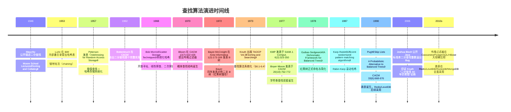

## 知识点地图

- **知识类别**：二分查找家族——标准二分与它的全部重要变体（边界查找、旋转数组、二分答案、浮点二分、插值查找、斐波那契查找）。本文是搜索知识的「纵向深水」姊妹篇：**050-SearchAlgorithm 讲搜索的通用地图（含二分的入门位置），本文专门把二分一族挖透**，两篇文首互相指路。
- **解决什么问题**：在有序结构上把 O(n) 查询降到 O(log n)；更进一步——「答案随某个量单调变化」的优化问题也能二分（二分答案）。
- **什么时候用到**：排序数组的精确/边界查找；LeetCode 33/35/410 这类变体题；数值求解（平方根）；游戏与业务里「找第一个满足条件的配置」。

## 1. 标准二分：闭区间模板

二分查找要求数组**有序**且**支持随机访问**，每次把查找区间减半：

```text
在 [1, 3, 5, 7, 9, 11, 13, 15] 中查找 11（下标从 0 开始）：

第1轮: left=0, right=7, mid=(0+7)//2=3, arr[3]=7  < 11 → 右半，left=4
第2轮: left=4, right=7, mid=(4+7)//2=5, arr[5]=11 = 11 → 找到!
```

```python
def binary_search(arr: list[int], target: int) -> int:
    """标准二分查找（闭区间 [left, right]）

    Args:
        arr: 有序数组（升序）
        target: 目标值

    Returns:
        int: target 的索引，不存在返回 -1
    """
    left, right = 0, len(arr) - 1
    while left <= right:
        # 防止整数溢出：用减法而非加法
        mid = left + (right - left) // 2
        if arr[mid] == target:
            return mid
        elif arr[mid] < target:
            left = mid + 1
        else:
            right = mid - 1
    return -1
```

逐行拆解这段「看似人人会写、实际千万人写错过」的代码：

- **`while left <= right`（等号不能丢）**：闭区间语义下，`left == right` 时区间还有一个元素没检查。写成 `<` 会漏查单元素区间的目标——数组只有一个元素时直接返回 -1；
- **`mid = left + (right - left) // 2`**：见下节，防溢出是它存在的全部理由；
- **`left = mid + 1` / `right = mid - 1`（加减一不能丢）**：mid 已检查过且不是答案，必须把它排除出区间。写 `left = mid` 在「`arr[mid] < target`」分支里会死循环（区间不再缩小）；
- **返回 -1**：调用方需要能区分「找到下标 0」与「没找到」——返回 `None`/`0` 都会埋雷。

### 1.1 mid 溢出：软件史上最著名的 Bug 之一

计算 `mid` 时，`(left + right) / 2` 在 `left + right` 超过 `Integer.MAX_VALUE`（$2^{31}-1$）时会溢出为负数，导致数组越界：

```java
//  危险：当 left + right > Integer.MAX_VALUE 时溢出
int mid = (left + right) / 2;

//  正确写法 1：减法（Python 无溢出问题，但养成习惯）
int mid = left + (right - left) / 2;

//  正确写法 2：无符号右移（Java/C++）
int mid = (left + right) >>> 1;  // Java，自动处理溢出

//  正确写法 3：长整型
int mid = (int) ((long) left + (long) right) / 2;
```

**Bug 历史**：Jon Bentley 1986《Programming Pearls》中的二分查找实现包含此 Bug，Joshua Bloch 2006 年发现 Java 标准库 `Arrays.binarySearch` 也继承了它（JDK 5 及更早），JDK 6 才修复。数组要够大（约 $10^9$ 元素级别）才触发，所以潜伏了二十年。

### 1.2 复杂度

$$T(n) = T(n/2) + O(1) \implies O(\log n)$$

| $n$ | 最多比较次数 |
| ---- | ---- |
| 10 | 4 |
| 100 | 7 |
| 1,000,000 | 20 |
| $10^{18}$ | 60 |

十亿级数据 30 次比较、$10^{18}$ 也只要 60 次——对数级的威力。空间 $O(1)$（迭代）；递归版 $O(\log n)$ 栈深。

## 2. 边界变体：lower_bound 与 upper_bound

有重复元素时「找到 target」不够用——要找**第一个**或**最后一个**。这套变体统一用半开区间 `[left, right)` 模板：

```python
def lower_bound(arr: list[int], target: int) -> int:
    """返回第一个 >= target 的位置（半开区间 [left, right)）"""
    left, right = 0, len(arr)
    while left < right:
        mid = left + (right - left) // 2
        if arr[mid] < target:
            left = mid + 1
        else:
            right = mid  # arr[mid] >= target，收缩右边界
    return left  # left 是第一个 >= target 的位置

def upper_bound(arr: list[int], target: int) -> int:
    """返回第一个 > target 的位置"""
    left, right = 0, len(arr)
    while left < right:
        mid = left + (right - left) // 2
        if arr[mid] <= target:
            left = mid + 1
        else:
            right = mid
    return left
```

**为什么这里 `right = mid` 不减一**：半开区间里 mid 可能正是答案（第一个 >= target 的位置），不能排除它——这与闭区间模板「mid 已检查故排除」恰好相反。两套模板混用是二分变体最大的错误源：**先定区间语义，再定循环条件与边界步进**。

```python
import bisect

arr = [1, 2, 2, 2, 3, 4, 5]
bisect.bisect_left(arr, 2)   # 1  第一个 2
bisect.bisect_right(arr, 2)  # 4  最后一个 2 的下一格
# target 出现次数 = bisect_right - bisect_left = 3
```

C++ 的 STL 直接提供 `std::lower_bound` / `std::upper_bound`；Java 标准库没有，需手写。查找插入位置（LeetCode 35）就是 `lower_bound` 本身：

```python
def search_insert(nums: list[int], target: int) -> int:
    left, right = 0, len(nums)
    while left < right:
        mid = left + (right - left) // 2
        if nums[mid] < target:
            left = mid + 1
        else:
            right = mid
    return left
```

## 3. 旋转数组查找

旋转排序数组如 `[4, 5, 6, 7, 0, 1, 2]`（原 `[0, 1, 2, 4, 5, 6, 7]` 在索引 3 处旋转）。整体不再有序，但**任意 mid 切开，两半必有一半有序**——每次判断哪半有序、target 是否落在有序半边内，就能安全丢掉一半：

```python
def search_rotated(nums: list[int], target: int) -> int:
    """旋转排序数组查找（LeetCode 33）"""
    left, right = 0, len(nums) - 1
    while left <= right:
        mid = left + (right - left) // 2
        if nums[mid] == target:
            return mid

        # 判断哪半边有序
        if nums[left] <= nums[mid]:  # 左半边有序
            if nums[left] <= target < nums[mid]:
                right = mid - 1
            else:
                left = mid + 1
        else:  # 右半边有序
            if nums[mid] < target <= nums[right]:
                left = mid + 1
            else:
                right = mid - 1
    return -1
```

逐段看：`nums[left] <= nums[mid]` 用 `<=` 而非 `<`——区间只剩两个元素时 `left == mid`，不取等号会误判「左半无序」；判断 target 在有序半边内的双条件 `<= target <` 的开闭必须与边界含义严格对应，写反一个符号，特定输入立即出错。这类题的正确性靠**手工枚举边界用例**（单元素、两元素、target 在旋转点）验证，不靠直觉。

## 4. 二分答案：对答案空间二分

当问题满足**单调性**——答案越大越容易（或越难）满足条件——可以不查数组、直接对答案空间二分：

```python
def split_array(nums: list[int], m: int) -> int:
    """分割数组的最大值（LeetCode 410）

    将数组分成 m 个连续子数组，最小化最大子数组和
    单调性：max_sum 越大，所需分组数越少
    """
    def can_split(max_sum: int) -> bool:
        count, current = 1, 0
        for num in nums:
            if current + num > max_sum:
                count += 1
                current = num
            else:
                current += num
        return count <= m

    left, right = max(nums), sum(nums)
    while left < right:
        mid = left + (right - left) // 2
        if can_split(mid):
            right = mid  # 答案可行，尝试更小
        else:
            left = mid + 1  # 答案不可行，必须更大
    return left
```

`check` 函数 `can_split` 贪心数分组数——它是关于 max_sum 的单调函数，整个问题从「优化」塌缩成「二分找第一个可行的值」。

```python
def binary_search_answer():
    left, right = lower_bound, upper_bound
    while left < right:
        mid = left + (right - left) // 2
        if check(mid):  # check 单调：x 越大越容易满足
            right = mid  # 或 left = mid（取决于单调方向）
        else:
            left = mid + 1
    return left
```

### 4.1 浮点数二分

```python
def my_sqrt(x: float, epsilon: float = 1e-7) -> float:
    """浮点数二分求平方根"""
    if x < 0:
        raise ValueError("Cannot compute square root of negative number")
    if x == 0:
        return 0.0
    left, right = 0.0, max(1.0, x)
    while right - left > epsilon:
        mid = (left + right) / 2
        if mid * mid < x:
            left = mid
        else:
            right = mid
    return (left + right) / 2

# 固定迭代次数版本（避免浮点精度导致的死循环）
def my_sqrt_iter(x: float, iterations: int = 100) -> float:
    left, right = 0.0, max(1.0, x)
    for _ in range(iterations):
        mid = (left + right) / 2
        if mid * mid < x:
            left = mid
        else:
            right = mid
    return (left + right) / 2
```

**浮点二分为什么用「区间宽度」或「固定迭代次数」做终止条件**：`left <= right` 的整数循环条件在浮点下可能永远不满足——`mid` 恰好等于 `left` 时区间不再收缩，死循环。`right - left > epsilon` 与固定 100 次迭代（每次区间折半，100 次后精度远超 double 极限）都是安全出口。

### 4.2 两套模板总结

**模板一：闭区间 [left, right]**（精确查找，见第 1 节）；**模板二：半开区间 [left, right)**（边界与答案查找，见第 2 节）。

| 需求 | 推荐模板 | 返回值含义 |
| ---- | ---- | ---- |
| 精确查找目标值 | 模板一 | 索引或 -1 |
| 查找第一个 $\geq$ target | 模板二 | lower_bound |
| 查找第一个 $>$ target | 模板二变体 | upper_bound |
| 二分答案 | 模板二 | 最优解 |
| 查找最后一个 $\leq$ target | 模板一变体 | upper_bound - 1 |

## 5. 插值查找

二分每次固定取中点，但数据**均匀分布**时，可以按目标值大小估算位置：

$$\text{mid} = \text{left} + \frac{(\text{target} - A[\text{left}]) \times (\text{right} - \text{left})}{A[\text{right}] - A[\text{left}]}$$

**类比查字典**：找 "apple" 翻前面，找 "zoo" 翻后面，而不是每次翻中间——按词的字母序估计它在书里的比例位置。

```python
def interpolation_search(arr: list[int], target: int) -> int:
    """插值查找：适用于均匀分布的有序数据

    平均复杂度 O(log log n)，最坏 O(n)
    """
    left, right = 0, len(arr) - 1

    while left <= right and arr[left] <= target <= arr[right]:
        # 防止除零
        if arr[left] == arr[right]:
            return left if arr[left] == target else -1

        # 插值公式
        mid = left + (target - arr[left]) * (right - left) // (arr[right] - arr[left])

        # 边界检查（防止 mid 越界）
        if mid < left or mid > right:
            break

        if arr[mid] == target:
            return mid
        elif arr[mid] < target:
            left = mid + 1
        else:
            right = mid - 1

    return -1
```

```java
public static int interpolationSearch(int[] arr, int target) {
    int left = 0, right = arr.length - 1;
    while (left <= right && target >= arr[left] && target <= arr[right]) {
        if (arr[left] == arr[right]) {
            return arr[left] == target ? left : -1;
        }
        int mid = left + (target - arr[left]) * (right - left) / (arr[right] - arr[left]);
        if (mid < left || mid > right) break;
        if (arr[mid] == target) return mid;
        else if (arr[mid] < target) left = mid + 1;
        else right = mid - 1;
    }
    return -1;
}
```

复杂度对照：

| 数据分布 | 时间复杂度 | 说明 |
| ---- | ---- | ---- |
| 均匀分布 | $O(\log \log n)$ | 远优于二分查找 |
| 非均匀分布 | $O(n)$ 最坏 | 退化为顺序查找 |
| 极端分布 | $O(n)$ | 如 `[1, 2, 3, ..., 999, 1000000]` |

$O(\log \log n)$ 的直觉（Peterson 1957）：均匀分布下每次插值后区间期望缩到 $\sqrt{n}$，即 $T(n) \approx T(\sqrt{n}) + O(1)$，迭代 $k$ 次后 $n$ 归 1，故 $O(\log \log n)$。**工程警告**：插值公式里的乘法在 Java/C++ 下 `(target - arr[left]) * (right - left)` 可能溢出 int，长整型是必选项；分布不均匀时性能反而不如老实二分——先确认数据分布再选它。

## 6. 斐波那契查找

斐波那契查找用 Fibonacci 数列做**黄金分割**，与二分的等分（1:1）不同：

```text
Fibonacci 数列: 1, 1, 2, 3, 5, 8, 13, 21, 34, 55, 89, ...

核心分割：
长度 F[k]-1 的数组分为：
  左子数组: F[k-1]-1 个元素
  中间元素: 1 个
  右子数组: F[k-2]-1 个元素
  满足恒等式: F[k]-1 = (F[k-1]-1) + 1 + (F[k-2]-1)
```

```python
def fibonacci_search(arr: list[int], target: int) -> int:
    """斐波那契查找：用黄金分割替代等分"""
    n = len(arr)
    if n == 0:
        return -1

    # 生成 Fibonacci 数列：必须找到最小的 k 使 F[k] - 1 >= n，
    # 否则填充后 temp 长度不足 F[k]-1，向右收缩（k -= 2）时 mid 可能越界
    fib = [1, 1]
    while fib[-1] < n + 1:
        fib.append(fib[-1] + fib[-2])

    k = len(fib) - 1

    # 扩展数组到 F[k]-1 长度，用末尾元素填充
    temp = arr + [arr[-1]] * (fib[k] - 1 - n)

    left, right = 0, n - 1
    while left <= right:
        mid = left + fib[k - 1] - 1
        if temp[mid] == target:
            return min(mid, n - 1)  # 处理填充位置
        elif temp[mid] < target:
            left = mid + 1
            k -= 2  # 右子数组长度为 F[k-2]-1
        else:
            right = mid - 1
            k -= 1  # 左子数组长度为 F[k-1]-1

    return -1
```

逐段看两个精妙处：`temp` 用末尾元素填充到 $F[k]-1$ 长度——填充段都是同一个最大值，对查找结果无扰动（查到填充段等价于「target >= 最大值」的情形）；返回 `min(mid, n-1)` 防止命中填充位置返回越界下标。

| 特性 | 二分查找 | 斐波那契查找 |
| ---- | ---- | ---- |
| 时间复杂度 | $O(\log n)$ | $O(\log n)$ |
| 分割比例 | 等分 1:1 | 黄金分割 $\approx 0.618:0.382$ |
| 运算 | 加法 + 除法 | 仅加减法 |
| 平均比较次数 | $\log_2 n$ | $\approx 1.44 \log_2 n$（略多） |
| 缓存友好性 | 较好 | 略差（跳跃不规律） |

**实际工程定位**：它的历史价值在「除法慢于加减法」的硬件（嵌入式、早期 CPU）；现代 CPU 除法 3-20 周期，黄金分割的收益不再成立，工程中很少使用——它是「理解分割策略可以多样化」的教学样本。

## 7. 不同场景下的例子

**例一：旋转数组找目标（真实工程场景）**。监控系统把昨天的指标曲线按小时存储后「按当天 8 点为界轮转」——数组 `[8h, 9h, ..., 23h, 0h, ..., 7h]` 是旋转有序的。查「14 点的指标」不能用普通二分（整体无序），用第 3 节的旋转查找 O(log n) 命中。

**例二：单调票价表找首个可接受价**。航班票价按提前天数递增、按舱位档位递增，定价表按价格排序后「找第一个不低于预算下限的舱位」是 `lower_bound(arr, budget)` 一行；「该价位还剩几个座位」用 `upper_bound - lower_bound` 秒出。比线性扫描快在十万级 SKU 列表上可感知。

**例三：等概率插值查字典序**。维护一个按字典序排序的十亿级用户名表，用户名长度分布均匀、首字母分布接近均匀——插值查找按「目标词在字母表的比例位置」估计下标，平均 $\log\log n$ 次比较；但若表里全是 `aaa`、`aab` 这类聚集前缀，分布假设破产，退化 O(n)——先抽样验证分布再选插值。

**例四：二分答案定服务器扩容阈值**。「每秒最多多少请求时，当前集群的 P99 延迟仍达标」——QPS 越高越难达标是天然单调性，把 QPS 空间二分、每次用压测当 check 函数，10 次压测就能定容量水位，比线性扫 QPS 省一个数量级的压测成本。

## 动手实践

**练习 1（边界变体）**：实现 `count_occurrences(arr, target)`——有序数组中 target 出现的次数，只准调用自己实现的 lower_bound/upper_bound，禁止用 bisect。

**提示**：出现次数 = upper_bound(target) - lower_bound(target)；两个函数只差一个比较符号。

**练习 2（旋转数组）**：实现旋转数组的最小值查找（LeetCode 153）：`[4,5,6,7,0,1,2]` 返回 0。先想清楚「最小值在无序的那一半」这一单调判据，再套半开区间模板。

**提示**：`nums[mid] > nums[right]` 说明最小值在 mid 右侧；否则在 mid 及其左侧（mid 本身可能是最小值，不能排除）。

**练习 3（二分答案）**：用二分答案实现「运送包裹 D 天内送达的最低运力」（LeetCode 1011）：weights 与 days 给定，运力 W 时贪心模拟装箱判断是否 D 天内完成。

**提示**：下界 = max(weights)（最重的必须单独一船装下），上界 = sum(weights)；check 用贪心累加，超 W 就开新船。

<details>
<summary>参考实现（先自己动手，再看这里）</summary>

```python
# 练习 1
def count_occurrences(arr: list[int], target: int) -> int:
    def lb(a, t):
        lo, hi = 0, len(a)
        while lo < hi:
            m = (lo + hi) // 2
            if a[m] < t: lo = m + 1
            else: hi = m
        return lo
    def ub(a, t):
        lo, hi = 0, len(a)
        while lo < hi:
            m = (lo + hi) // 2
            if a[m] <= t: lo = m + 1
            else: hi = m
        return lo
    return ub(arr, target) - lb(arr, target)

assert count_occurrences([1,2,2,2,3], 2) == 3
assert count_occurrences([1,2,3], 9) == 0

# 练习 2
def find_min(nums: list[int]) -> int:
    lo, hi = 0, len(nums) - 1
    while lo < hi:
        mid = (lo + hi) // 2
        if nums[mid] > nums[hi]:
            lo = mid + 1          # 最小值在右侧
        else:
            hi = mid              # mid 可能就是最小值
    return nums[lo]

assert find_min([4,5,6,7,0,1,2]) == 0
assert find_min([2,1]) == 1

# 练习 3
def ship_within_days(weights: list[int], days: int) -> int:
    def can_ship(cap: int) -> bool:
        need, cur = 1, 0
        for w in weights:
            if cur + w > cap:
                need += 1
                cur = w
            else:
                cur += w
        return need <= days
    lo, hi = max(weights), sum(weights)
    while lo < hi:
        mid = (lo + hi) // 2
        if can_ship(mid):
            hi = mid
        else:
            lo = mid + 1
    return lo

assert ship_within_days([1,2,3,4,5,6,7,8,9,10], 5) == 15
```

</details>

## 历史动机与演进

<!-- 来源: cnt-content/full/020-algorithm/170-BinarySearchAlgorithms.md 小节「2. 历史动机与演进」 -->

### 2.1 前查找时代：从纸质索引到内存查找

19 世纪末，图书馆学与统计学已发展出大量"索引"技术：图书目录卡、人口普查穿孔卡片、电话簿。这些物理索引的关键问题是：**给定一个关键字，如何在大量数据中快速定位？**

1928 年*Mechanical World*首次记载了用机器辅助查找穿孔卡片的方法，但仅限于顺序查找。直到 1946 年，二分查找的思想才在计算机科学文献中正式出现。

### 2.2 Mauchly 1946：二分查找的诞生

1946 年，**John Mauchly**（ENIAC 联合设计者）在 Moore School Lectures《Sorting and Collating》中首次公开描述二分查找算法：

> 给定一个有序数组 $A[1..n]$，将目标 $x$ 与中间元素 $A[\lfloor n/2 \rfloor]$ 比较；若相等则返回，若 $x$ 较小则递归在左半查找，否则在右半查找。

但 Mauchly 的描述并不完整，未明确边界处理。1962 年**Hermann Bottenbruch**在*Communications of the ACM*给出首个被广泛认可的完整实现。Knuth 在 TAOCP Vol.3 §6.2.1 考据后写道：

> "Although the basic idea of binary search is comparatively straightforward, the details can be surprisingly tricky, and many programmers have gotten it wrong over the years."

这一预言在 2006 年被 Joshua Bloch 印证。

### 2.3 Joshua Bloch 2006：二分查找的"千年 Bug"

2006 年，Google 研究员 **Joshua Bloch**（前 Sun Microsystems Java 标准库首席工程师）在博客发表《Extra, Extra - Read All About It: Nearly All Binary Searches and Mergesorts are Broken》，公开指出 Java 标准库 `java.util.Arrays.binarySearch` 存在整数溢出 Bug：

```java
// Bug 版本（Java 标准库至 JDK 5）
int mid = (low + high) / 2;   // 当 low + high > Integer.MAX_VALUE 时溢出为负数
```

Bug 追溯到 Jon Bentley 1986 年《Programming Pearls》中的二分查找实现——Bentley 在书中将该实现作为"经过验证的正确代码"展示，但 2006 年 Bloch 的发现证明该代码在 $n > 2^{30}$ 时会崩溃。修复方案：

```java
int mid = low + (high - low) / 2;       // 加法改为减法避免溢出
// 或
int mid = (low + high) >>> 1;           // 无符号右移
```

这一事件成为软件工程史上的经典案例，证明"简单的算法不一定容易实现正确"。

### 2.4 Luhn 1953：哈希表的诞生

1953 年 1 月，IBM 的 **Hans Peter Luhn** 在内部备忘录中首次提出"哈希函数 + 链地址法"的查找方案。Luhn 当时研究 IBM 701 计算机的快速检索问题，提出：

- 用哈希函数 $h(k)$ 将键 $k$ 映射到数组下标；
- 冲突时用链表链接（**链地址法**，chaining）。

这是链式线性表首次应用。Luhn 因此获 1956 年 IBM Outstanding Contribution Award。

1968 年，**Bob Morris** 在*Communications of the ACM* 11(1):38-43《Scatter Storage Techniques》系统化哈希理论，引入**开放寻址法**（open addressing）、**线性探查**（linear probing）、**二次探查**（quadratic probing）等冲突解决技术。Knuth TAOCP Vol.3 §6.4（1973）给出权威论述与对比分析。

### 2.5 Bloom 1970：布隆过滤器

1970 年，**Burton Howard Bloom** 在*Communications of the ACM* 13(7):422-426《Space/Time Trade-offs in Hash Coding with Allowable Errors》中提出布隆过滤器。Bloom 当时在 Computer Usage Corporation 研究海量数据的快速去重问题，提出：

- 用 $m$ 位位数组 + $k$ 个独立哈希函数；
- 插入：将 $k$ 个哈希位置全部置 1；
- 查询：若 $k$ 个位置全为 1，则元素**可能**存在；若有任何 0，则元素**一定**不存在；
- 误判率约 $(1 - e^{-kn/m})^k$。

布隆过滤器以 $O(m \text{ bits})$ 空间高效著称，是大数据时代缓存穿透防护、URL 去重、Cassandra HINT、PostgreSQL bloom 索引的核心。

### 2.6 Bayer-McCreight 1972：B 树与磁盘索引

1970 年，Boeing Scientific Research Labs 的 **Rudolf Bayer** 与 **Edward M. McCreight** 在研究大型磁盘文件的索引时，发现二叉树高度过大、磁盘 IO 次数过多。1972 年他们在*Acta Informatica* 1(3):173-189 发表《Organization and Maintenance of Large Ordered Indices》，提出 **B 树**：

- 每节点最多 $2t-1$ 个关键字、$2t$ 个子节点（$t$ 为最小度数）；
- 根节点到叶节点等长（**完美平衡**）；
- 查找、插入、删除均 $O(\log_t n)$；
- 通过增大 $t$（典型 50-500），树高通常 3-4 即可表示数十亿关键字。

B 树是 MySQL InnoDB、PostgreSQL、Oracle、SQL Server、SQLite 等所有关系数据库索引的基石。B+ 树（Bayer 1972 后续工作）将数据仅存叶节点，叶节点用链表连接，使范围查询 $O(\log_t n + k)$。

McCreight 在 2010 年 PODS 大会访谈中曾回忆："B-tree 是 Bayer-B-tree 也是 Boeing-B-tree 也是 Balanced-B-tree 也可能是 Broad-B-tree，但我们从未在论文中明确解释 B 的含义。"

### 2.7 Bayer 1972 / Guibas-Sedgewick 1978：红黑树

1972 年，**Rudolf Bayer** 在*Acta Informatica* 1(4):290-306 发表《Symmetric binary B-trees: Data structure and maintenance algorithms》，提出**对称二叉 B 树**（symmetric binary B-tree, SB-tree）——用颜色标记模拟 B 树的二叉结构。这是红黑树的雏形。

1978 年，**Leonidas J. Guibas** 与 **Robert Sedgewick** 在 FOCS 论文《A Dichromatic Framework for Balanced Trees》中重新形式化 SB-tree，正式命名**红黑树**（red-black tree），并简化插入删除的旋转操作。Sedgewick 在 Xerox PARC 的彩色显示器上选择"红色"作为视觉最易辨识的颜色（PARC 当时是少数有彩色显示器的实验室）。

红黑树的 5 条性质保证高度 $\leq 2\log(n+1)$，使所有操作 $O(\log n)$ 最坏。红黑树被广泛采用：C++ STL `std::map`/`std::set`、Java `TreeMap`/`TreeSet`、Linux kernel CFS 调度器、Linux VMA 内存管理、Nginx timer、epoll 内部。

### 2.8 Knuth-Morris-Pratt 1977 与 Boyer-Moore 1977：字符串查找双星

1977 年是字符串查找算法的"奇迹年"。当年同时发表两篇里程碑论文：

**KMP 算法**（Knuth-Morris-Pratt）：
- Donald Knuth（斯坦福）、James H. Morris（CMU，研究字符串匹配硬件）、Vaughan Pratt（MIT）三人独立发现；
- 1977 年联合发表于 *SIAM Journal on Computing* 6(2):323-350《Fast Pattern Matching in Strings》；
- 核心思想：预处理模式串构造 `next` 数组（部分匹配表），使匹配失败时不回退文本指针；
- 复杂度：$O(n+m)$ 时间、$O(m)$ 空间，最坏线性。

**Boyer-Moore 算法**：
- Robert S. Boyer 与 J. Strother Moore 在 SRI International 研究定理证明器时提出；
- 1977 年发表于 *Communications of the ACM* 20(10):762-772《A Fast String Searching Algorithm》；
- 核心思想：从模式串右端开始匹配，结合**坏字符规则**与**好后缀规则**使模式串能跳跃式前进；
- 平均复杂度 $O(n/m)$（亚线性！），最坏 $O(nm)$（启发式无 worst-case 保证）；
- 实践中 Boyer-Moore 通常是字符串查找最快的算法，被 grep、PostgreSQL、各种文本编辑器 Ctrl+F 采用。

1987 年 **Karp-Rabin** 在 *IBM Journal of Research and Development* 31(2):249-260《Efficient randomized pattern-matching algorithms》提出**Rabin-Karp 算法**，用滚动哈希实现 $O(n+m)$ 平均、$O(nm)$ 最坏的字符串查找，是后续 Rabin-Karp 指纹、二维模式匹配的基础。

### 2.9 Pugh 1990：跳表

1990 年，马里兰大学 **William Pugh** 在 *Communications of the ACM* 33(6):668-676 发表《Skip Lists: A Probabilistic Alternative to Balanced Trees》，提出**跳表**（Skip List）：

- 在有序链表上随机添加多层索引；
- 第 $i$ 层节点以概率 $p$（通常 0.5 或 0.25）出现在第 $i+1$ 层；
- 查找：从最高层开始，每层线性前进，遇大则下降一层；
- 期望查找 $O(\log n)$、期望插入 $O(\log n)$、期望删除 $O(\log n)$；
- 实现远比红黑树简单（约 100 行 C 代码 vs 红黑树 500+ 行）。

Pugh 在论文中写道："Skip lists are a probabilistic alternative to balanced trees. They are easy to implement and are at least as efficient as balanced trees."

跳表被广泛采用：Redis zset（zskiplist）、LevelDB/RocksDB MemTable、MongoDB WiredTiger、MemSQL、skiplist-based LRU。Redis 作者 antirez 在博客中明确表示："Skip lists are a data structure that I have always found fascinating. They are simple, elegant, and they work."

### 2.10 查找算法演进时间线



### 2.11 关键设计决策

| 年份 | 决策 | 决策者 | 动机 |
| ---- | ---- | ---- | ---- |
| 1946 | 用"减半"而非"线性"查找有序数据 | Mauchly | 利用有序性将 $O(n)$ 降为 $O(\log n)$ |
| 1953 | 用哈希函数直接寻址 | Luhn | 跳过比较，直接定位 |
| 1970 | 允许误判换取空间效率 | Bloom | 海量数据去重，少量误判可接受 |
| 1972 | 多路分支降低树高 | Bayer-McCreight | 磁盘 IO 次数 = 树高，需降低树高 |
| 1972 | 用颜色模拟 B 树的合并分裂 | Bayer | 二叉树结构 + B 树平衡性 |
| 1977 | 预处理模式串避免文本回退 | KMP | 最坏线性保证 |
| 1977 | 从右向左匹配 + 启发式跳跃 | Boyer-Moore | 实践中亚线性 $O(n/m)$ |
| 1978 | 颜色替代 SB-tree 复杂标记 | Guibas-Sedgewick | 简化插入删除 |
| 1990 | 用概率均衡替代严格均衡 | Pugh | 实现简单 + 性能相当 |

---

## 二分查找的形式化定义与正确性证明

<!-- 来源: cnt-content/full/020-algorithm/170-BinarySearchAlgorithms.md 小节「3.2 二分查找的形式化定义」 -->

**前提条件**：数组 $A[0..n-1]$ 满足**有序性**（monotonicity）：$\forall i < j, A[i] \leq A[j]$（升序）。

**循环不变式**（Loop Invariant）：在二分查找循环的每次迭代开始时，若 $x \in A$，则 $x \in A[\text{left}..\text{right}]$。

**正确性证明**：
1. **初始化**：$\text{left} = 0, \text{right} = n - 1$，$x \in A[0..n-1]$ 显然成立；
2. **保持**：每次迭代计算 $\text{mid} = \lfloor (\text{left} + \text{right}) / 2 \rfloor$：
   - 若 $A[\text{mid}] = x$，返回 $\text{mid}$，循环结束；
   - 若 $A[\text{mid}] < x$，则 $x \notin A[\text{left}..\text{mid}]$（由有序性），故 $x \in A[\text{mid}+1..\text{right}]$，令 $\text{left} = \text{mid} + 1$；
   - 若 $A[\text{mid}] > x$，类似地令 $\text{right} = \text{mid} - 1$；
   不变式保持；
3. **终止**：当 $\text{left} > \text{right}$ 时循环终止，此时区间为空，故 $x \notin A$。

## 寻找两个正序数组的中位数（LeetCode 4）

<!-- 来源: cnt-content/full/020-algorithm/170-BinarySearchAlgorithms.md 小节「14.7 LeetCode 4：寻找两个正序数组的中位数」 -->

```python
def find_min(nums: list[int]) -> int:
    """旋转排序数组找最小值：O(log n)"""
    left, right = 0, len(nums) - 1
    while left < right:
        mid = left + (right - left) // 2
        if nums[mid] > nums[right]:
            left = mid + 1  # 最小值在右半
        else:
            right = mid  # 最小值在左半（含 mid）
    return nums[left]
```

### 14.7 LeetCode 4：寻找两个正序数组的中位数

```python
def find_median_sorted_arrays(nums1: list[int], nums2: list[int]) -> float:
    """二分查找：O(log(min(m,n)))"""
    if len(nums1) > len(nums2):
        nums1, nums2 = nums2, nums1
    m, n = len(nums1), len(nums2)
    left, right = 0, m
    while left <= right:
        i = (left + right) // 2  # nums1 的分割点
        j = (m + n + 1) // 2 - i  # nums2 的分割点
        nums1_left_max = float('-inf') if i == 0 else nums1[i - 1]
        nums1_right_min = float('inf') if i == m else nums1[i]
        nums2_left_max = float('-inf') if j == 0 else nums2[j - 1]
        nums2_right_min = float('inf') if j == n else nums2[j]
        if nums1_left_max <= nums2_right_min and nums2_left_max <= nums1_right_min:
            if (m + n) % 2:
                return max(nums1_left_max, nums2_left_max)
            return (max(nums1_left_max, nums2_left_max) + min(nums1_right_min, nums2_right_min)) / 2
        elif nums1_left_max > nums2_right_min:
            right = i - 1
        else:
            left = i + 1
    raise ValueError("Invalid input")
```

## 参考与致谢

- Knuth, TAOCP Vol.3 §6.2.1「Searching an Ordered Table」（二分与斐波那契查找的原始出处，学术引用）
- Jon Bentley《Programming Pearls》与 Joshua Bloch 的 mid 溢出 Bug 考证文章（Extra, Extra - Read All About It: Nearly All Binary Searches and Mergesorts are Broken）
- Python bisect 模块文档：<https://docs.python.org/3/library/bisect.html>（PSF 许可）
- 本文 §5-8 内容承接本仓库原「查找算法」篇既有材料（仓库内部素材），重组为教学体。
