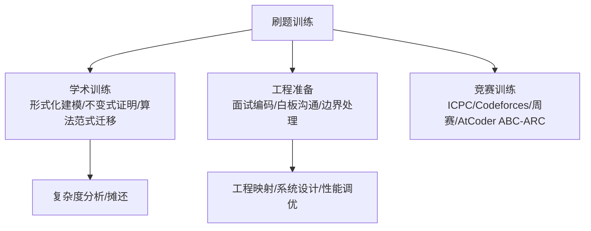
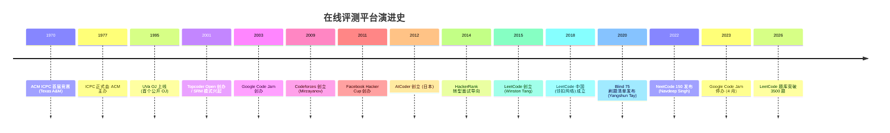
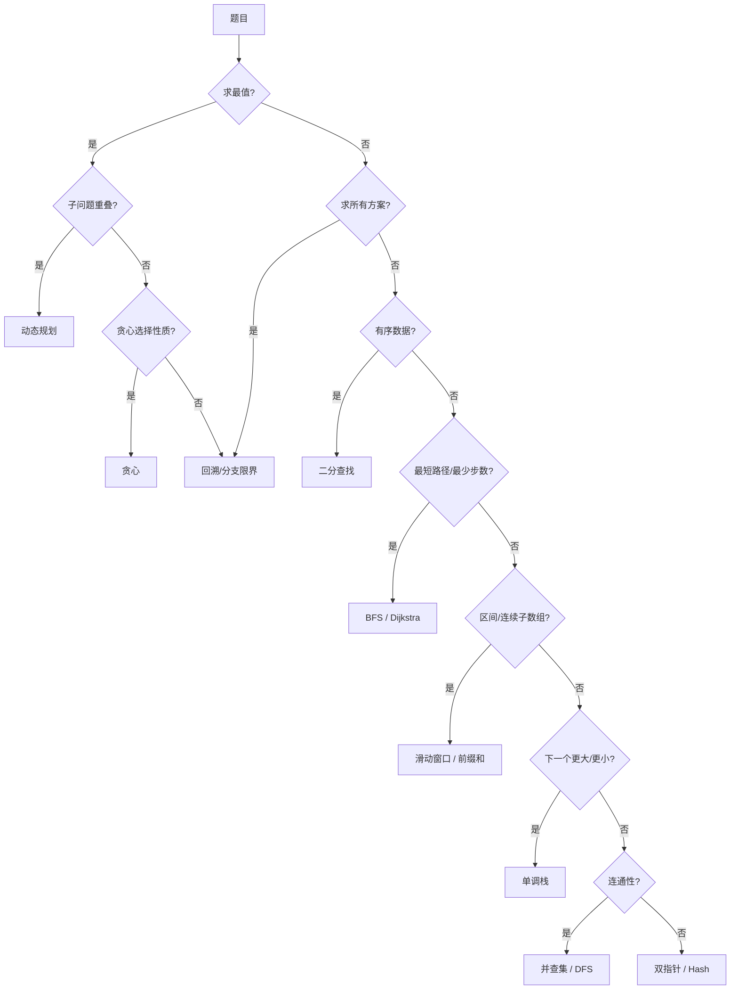
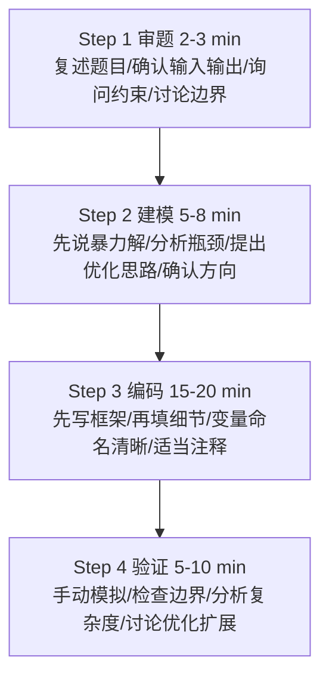

> 定位说明：本篇为进阶参考书（参考层），面向已完成本模块主线的读者；入门请先走学习路径前序阶段。定位标准见 docs/standards/reference-layer.md（仓库）。

> 姊妹篇：题型识别信号、解题模板与代表题（含预期输出）见 [LeetCode 分类题型手册](/algorithm/305-LeetCodeTopicPlaybook)。本篇回答"怎么练、按什么顺序练、面试怎么考"，手册回答"每类题怎么解"。

## 前置知识

建议先阅读以下内容再进入本文：

- [算法分析基础与学习路线](/algorithm/010-AlgorithmAnalysisBasics)
- [递归与回溯](/algorithm/140-RecursionAndBacktracking)

## 1. 概述与学习目标

### 1.1 什么是 LeetCode 刷题

**LeetCode 刷题**（LeetCode Grinding）指在 LeetCode 在线评测系统（Online Judge, OJ）上系统性地反复解答算法题目，以训练算法思维、备战技术面试或参与算法竞赛的学习实践。该实践脱胎于 1970 年代 ACM ICPC 校园竞赛文化，在 2015 年 LeetCode 平台创立后逐渐成为全球软件工程师面试准备的事实标准（de facto standard）。

刷题活动包含三层递进目标：

| 层级 | 目标 | 对应 Bloom 层级 | 典型题目量 |
| ---- | ---- | --------------- | ---------- |
| L1 入门 | 熟悉数据结构与算法基础概念 | Remember / Understand | 50-100 题 |
| L2 进阶 | 掌握解题模式、形成条件反射 | Apply / Analyze | 200-400 题 |
| L3 精通 | 一题多解、复杂问题建模、跨题型迁移 | Evaluate / Create | 500+ 题 |

刷题并非简单"题海战术"。MIT 6.006《Introduction to Algorithms》课程负责人 Srini Devadas 在 2020 年公开课中强调："Algorithms are not memorized—they are derived."（算法不是被记忆的，而是被推导的）。刷题的核心价值在于通过反复训练建立"问题—算法"的条件反射（pattern matching），而非死记题解。

### 1.2 刷题的工程与学术双重价值



**学术训练维度**：形式化建模（自然语言到图、树、序列、集合等数学结构）、复杂度分析（时间、空间、摊还代价）、不变式证明（loop invariant）、算法范式迁移（分治、贪心、DP、回溯、分支限界的适用场景）。

**工程准备维度**：面试编码（30-45 分钟白板或在线编码）、边界处理（空输入、单元素、极大输入、负数、溢出）、性能调优（从暴力解到最优解的逐步优化）、工程映射（LRU Cache → Redis、并查集 → K8s 网络、滑动窗口 → Prometheus）。

### 1.3 学习目标

完成本篇学习后，读者应能够：

| 层级 | 目标 |
| ---- | ---- |
| 记忆/理解 | LeetCode 平台发展脉络、十大题型分类、三遍刷题法与四步解题法的步骤、Hot 100/Top Interview 150/Grind 75/NeetCode 150 清单设计动机 |
| 应用 | 使用复杂度反推规则从 $n$ 的范围圈定可行算法类别；按本篇第 3.3 节总路线安排个人刷题顺序 |
| 分析 | 各面试平台、清单、语言的优劣与适用场景；从约束反推算法的完整推理链 |
| 评估/对比 | FAANG 与国内大厂面试风格、考察重点、评分标准；面试各阶段的沟通策略 |
| 创造 | 设计个人刷题计划（清单选择、节奏安排、遗忘曲线复习表、效果评估指标） |

> 跨模块引用：刷题所需的算法理论基础知识参见 [算法分析基础与学习路线](/algorithm/010-AlgorithmAnalysisBasics)，递归与回溯的深入讨论参见 [递归与回溯](/algorithm/140-RecursionAndBacktracking)。

---

## 2. 历史动机与演进

### 2.1 算法竞赛的起源：ACM ICPC（1970）

**国际大学生程序设计竞赛**（International Collegiate Programming Contest, ICPC）是算法竞赛的鼻祖，历史可追溯至 1970 年德克萨斯 A&M 大学举办的首届竞赛（当时称 ACM-TCSCC Programming Contest）。1977 年该竞赛正式由 ACM 主办并更名为 ICPC，逐步发展为全球最大规模的大学生程序设计竞赛。

ICPC 的核心特征：

- **团队赛制**：每队 3 人共用 1 台电脑，5 小时内求解 10-15 道算法题
- **多层级晋级**：Local Contest → Regional Contest → World Finals
- **即时反馈**：提交后系统立即返回 Accepted / Wrong Answer / Time Limit Exceeded 等结果
- **气球文化**：每解出一题，志愿者会在该队桌上升起对应颜色的气球，作为可视化进度

ICPC 培养了大批顶尖算法工程师与计算机科学家，如 6 次 ICPC 世界冠军（2013-2019）Gennady Korotkevich（tourist）。其"实时评测+排名"模式直接催生了在线评测系统（OJ）的概念：1995 年西班牙 Valladolid 大学（UVa）上线全球首个面向公众的 OJ，由 Miguel A. Revilla 维护，收录 3000+ 经典题目。

### 2.2 Google Code Jam（2003-2023）

**Google Code Jam** 是 Google 主办的年度算法编程竞赛，2003 年首次举办，2023 年 4 月宣布停办，共举办 21 届。

| 年份 | 里程碑 |
| ---- | ---- |
| 2003 | 首届 Google Code Jam，奖金 $10,000，吸引 1.1 万人参与 |
| 2008 | 引入 Round 1/2/3 多轮晋级赛制 |
| 2015 | 改为 Online Round + World Finals 模式 |
| 2019 | 总参赛人数突破 60,000 人 |
| 2020-2022 | 因 COVID-19 转为纯线上举办 |
| 2023 | 4 月宣布永久停办，最后一届 World Finals 在 Toronto 举办 |

Code Jam 的特点：个人赛（与 ICPC 团队赛不同）、多轮晋级（Qualification Round → Round 1 (A/B/C) → Round 2 → Round 3 → World Finals）、部分交互式题目（下载输入文件、本地计算后上传输出）、高奖金（World Finals 冠军 $15,000）。tourist 曾 6 次夺冠（2014, 2016-2020），史上最多。

Code Jam 停办标志着算法竞赛黄金时代的一个转折点：Google 在停办声明中表示将精力转向其他形式的技术人才培养，但未明确替代方案；社区普遍认为这与 Google 裁员潮、AI 编程工具兴起有关。

### 2.3 Topcoder Open（2001）

**Topcoder Open（TCO）** 由 Topcoder 公司（Jack Hughes 1999 年创立，最初定位"通过竞赛众包软件开发"）于 2001 年创办，是早期最具影响力的商业算法竞赛之一。核心创新：

- **SRM（Single Round Match）**：每周多次的 75 分钟在线算法竞赛
- **Rating 系统**：借鉴国际象棋 Elo 评分，红黄蓝绿四色段位
- **题目质量**：以题目设计精巧著称，problem setters 通常是顶级选手
- **金钱奖励**：SRM 前几名有现金奖励，年度 TCO 总决赛奖金 $20,000+

知名冠军包括 tomek（Tomasz Czajka，3 次 TCO 冠军）、Petr（Petr Mitrichev，Google 工程师）、ACRush（楼天城，中国第一代竞赛选手代表）。2010 年代后随着 Codeforces 崛起，SRM 参与度逐渐下降；2017 年 Topcoder 被收购后业务重心转向企业众包。但其 Rating 系统设计被 Codeforces、AtCoder 等后续平台广泛借鉴。

### 2.4 Meta Hacker Cup（2011-）

**Meta Hacker Cup**（原名 Facebook Hacker Cup）是 Meta 主办的年度算法竞赛，2011 年首次举办。特点：年度单次赛事（Qualification → Round 1/2/3 → Finals）、线下决赛（World Finals 通常在 Meta 总部 Menlo Park）、高额奖金（冠军 $20,000）、题目偏数学与组合博弈（与 Code Jam 风格互补）。tourist 曾 2014-2017 四连冠。Hacker Cup 至今仍在举办，是少数延续的全球性算法竞赛之一。

### 2.5 Codeforces（2009）

**Codeforces** 由莫斯科理工大学教授 Mikhail Mirzayanov 于 2009 年创立，是当今全球最活跃的算法竞赛平台。关键创新：每周 2-4 场 Rated Contest（远超 Topcoder 的高频节奏）；基于 Elo 改进、引入 volatility（波动率）参数的评分系统；题目 A-H 难度递增（A 题适合入门，H 题接近 ICPC World Finals 水平）；Div 1/2/3/4 分组按 Rating 自动分流，避免新手被高难题打击；每月 1-2 场按知识点分类的 Educational Rounds 教学赛；Gym 支持上传 ICPC 历史题目进行团队训练。

Codeforces 评分系统是算法竞赛界的"事实标准"：

| 段位 | Rating 区间 | 占比 |
| ---- | ---------- | ---- |
| Newbie | < 1200 | 约 35% |
| Pupil | 1200-1399 | 约 25% |
| Specialist | 1400-1599 | 约 15% |
| Expert | 1600-1899 | 约 12% |
| Candidate Master | 1900-2099 | 约 7% |
| Master | 2100-2299 | 约 3% |
| International Master | 2300-2399 | 约 1.5% |
| Grandmaster | 2400-2599 | 约 1% |
| International Grandmaster | 2600-2999 | 约 0.3% |
| Legendary Grandmaster | 3000+ | 约 20 人 |

Legendary Grandmaster 包括 tourist、Petr、Benq、Um_nik、neal、Radewoosh、jiangly 等，其中 tourist 长期保持 Rating 第一（约 3800-4000）。Google、Meta、Jane Street、Hudson River Trading 等公司常年赞助 Codeforces，并直接从 Grandmaster+ 段位招聘。

### 2.6 AtCoder（2012）

**AtCoder** 由日本 AtCoder 公司（CEO Takuya Akatsu）于 2012 年创立，是亚洲第二大算法竞赛平台。特点：

- **ABC/ARC/AGC 三档赛事**：ABC（AtCoder Beginner Contest）每周日举办，A-F 六题，A-C 适合新手；ARC（Regular Contest）每月 1-2 次，难度居中；AGC（Grand Contest）每年 4-6 次，H 题接近 ICPC World Finals 水平
- **题目质量**：题目设计精巧、数学味浓郁，描述简洁、测试数据严谨、评测稳定
- **AtCoder Library（ACL）**：官方 C++ 算法库，含并查集、线段树、卷积等

评分段位从 Gray（0-399）到 Red（2800+）共 8 档，Red 段位选手约 100 人。

### 2.7 LeetCode 的诞生（2015）

**LeetCode** 由 Winston Tang（唐炜森）2015 年在美国创立。Winston Tang 毕业于复旦大学计算机系，后赴美工作，曾在 Google、Uber 等公司任职。创立初衷源于其自身的面试准备经历：

> "在准备 FAANG 面试时，我发现当时的在线评测平台（HackerRank、CodeWars）要么偏向竞赛风格、要么偏向语法练习，缺乏专门针对面试的题目集。LeetCode 的目标是覆盖面试高频考点，提供接近真实面试的题目与评测体验。" —— Winston Tang（2017 年采访）

LeetCode 的关键设计决策：

| 决策 | 动机 | 影响 |
| ---- | ---- | ---- |
| 题目按面试频率排序 | 帮助求职者优先准备高频题 | 形成 "Hot 100" 等清单文化 |
| 多语言支持 | 适应不同语言背景的求职者 | 支持 Python/Java/C++/Go/Rust/JS 等 14 种语言 |
| 题解社区 | 通过 UGC 积累题解 | 每题平均 50+ 题解，覆盖多种解法 |
| 周赛/双周赛 | 提供竞技训练 | 形成 Rating 系统，吸引竞赛选手 |
| 公司标签 | 按公司分类题目 | 求职者可针对性准备 |

### 2.8 LeetCode 中国扩展（2018）

2018 年 4 月，**领扣网络（上海）有限公司**成立，标志着 LeetCode 正式进入中国市场。LeetCode China（leetcode.cn）作为独立运营的本地化平台，提供：中文题目描述（部分题目）、中国大厂面试高频题专项（字节跳动、腾讯、阿里巴巴、百度、美团等公司标签）、剑指 Offer 题集（与何海涛《剑指 Offer》同步）、程序员面试金典题集（与 Gayle McDowell《CTCI》同步）、中文社区与题解、春招/秋招专项活动。

本地化策略有效推动了中国开发者刷题文化的兴起。截至 2026 年，LeetCode China 注册用户超过 800 万，月活超过 100 万，成为中文开发者面试准备的首选平台。

### 2.9 在线评测平台演进时间线



### 2.10 刷题文化的兴起

刷题文化的兴起与四个因素密切相关：

**1. FAANG 面试标准化（2010 年代）**：算法面试成为技术筛选的标准环节——客观可量化（明确的 Accepted/Wrong 答案）、候选人规模大（每年数百万简历需要高效筛选）、算法能力被视为工程能力的代理指标。

**2. 在线评测平台普及**：LeetCode、HackerRank、CodeSignal 等平台使任何人都能在浏览器中练习真实面试题，降低了面试准备门槛。

**3. 社区内容生态**：Blind（匿名职场社交平台，FAANG 员工分享面试经验）、Reddit r/cscareerquestions、一亩三分地（北美华人求职论坛）、牛客网（中国求职社区，含面经与题库）、知乎"算法"话题。

**4. 高质量刷题清单**：2018 年 Yangshun Tay 在 Blind 论坛发布 Blind 75（最小题量覆盖最高频考点），2022 年升级为可自定义难度与时间的 Grind 75；同年 Navdeep Singh 发布附 Python 视频讲解的 NeetCode 150；LeetCode 官方亦推出 Hot 100、Top Interview 150、LeetCode 75；中文侧有何海涛《剑指 Offer》与 Gayle McDowell《程序员面试金典（CTCI）》。各清单的详细对比见第 6.2 节。

### 2.11 关键设计决策

在线评测平台演进中沉淀了八项关键设计决策，按时间顺序为：即时反馈机制（UVa OJ 1995 首创，提交后立即返回 Accepted/Wrong）→ 多语言支持（LeetCode 2015 普及）→ 题目分级与 Div 分组（Codeforces 2009）→ Rating 系统三代演进（Topcoder Elo 2001 → Codeforces 改进 2009 → AtCoder 2012）→ 公司标签（LeetCode 2015）→ UGC 题解（LeetCode 2015）→ 周赛/双周赛（LeetCode 2016/2020）→ 题目分类清单（Blind 75 2018 → NeetCode 150 2022）。这些决策共同构成现代刷题体验的基座。

### 2.12 趋势：从纯算法到综合评估（2020-）

2020 年后，技术面试出现以下趋势：

- **系统设计题占比上升**：Senior+ 职位算法题减少，系统设计题增加
- **行为面试（Behavioral）强化**：Amazon LP（Leadership Principles）模式被广泛模仿
- **AI 编程工具兴起**：GitHub Copilot、ChatGPT、Claude 等工具降低编码门槛，但算法思维价值反而上升
- **部分公司取消 LeetCode 式面试**：2024 年 Snapchat 宣布取消 LeetCode 风格算法面试，转向"更实际的技术筛选"
- **LeetCode Hard 题量下降**：FAANG 面试中 Hard 题占比从 2015 年的 20% 降至 2025 年的 10% 以下

尽管存在争议，LeetCode 刷题仍是 2026 年 FAANG 与国内大厂面试准备的主流方式。其核心价值不在于题目本身，而在于通过系统化训练建立的算法思维与编码习惯。

---

## 3. 刷题总路线与读题方法

### 3.1 刷题过程的形式化定义

**定义 3.1**（刷题过程）：刷题过程可形式化为六元组 $\mathcal{L} = (P, S, A, \tau, \rho, \sigma)$，其中：

- $P = \{p_1, p_2, \ldots, p_n\}$ 为题目集合，每题 $p_i = (d_i, c_i, \text{tags}_i, \text{diff}_i)$ 含题面、约束、标签、难度
- $S$ 为解题者状态空间，$s \in S$ 表示解题者当前的知识图谱（已掌握题型、解题模板、错题集）
- $A$ 为算法动作空间，$a \in A$ 表示具体算法（如双指针、DP、回溯）
- $\tau: P \times S \to A$ 为题目到算法的映射策略
- $\rho: P \times A \to \{0, 1\}$ 为评测函数（0=Wrong，1=Accepted）
- $\sigma: S \times P \times A \to S$ 为状态更新函数（学习反馈）

**目标**：最大化 $\mathbb{E}\left[\frac{1}{|P_{\text{test}}|}\sum_{p \in P_{\text{test}}} \rho(p, \tau^*(p, s))\right]$，即在测试题集上的期望通过率。这一形式化说明了"按类型刷题"的合理性：$\tau$ 是模式匹配函数，按类型分组训练能最快收敛 $\tau$ 的参数。

### 3.2 如何读题与复杂度预估

**定理 3.1**（复杂度反推定理）：设现代 CPU 每秒执行 $C \approx 10^8$ 次基本运算，LeetCode 默认时间限制 $T = 2$ 秒，则对输入规模 $n$，可行算法的时间复杂度上界为

$$T(n) \leq C \cdot T = 2 \times 10^8$$

由此可反推：

| 输入规模 $n$ | 可行复杂度上界 | 典型算法类别 | LeetCode 示例 |
| ----------- | ------------- | ----------- | ------------ |
| $n \leq 10$ | $O(n!)$ | 全排列、暴力枚举 | 51 N-Queens |
| $n \leq 20$ | $O(2^n)$ 或 $O(n^2 \cdot 2^n)$ | 状态压缩 DP、子集枚举 | 526 Beautiful Arrangement |
| $n \leq 100$ | $O(n^3)$ | Floyd、区间 DP | 312 Burst Balloons |
| $n \leq 10^3$ | $O(n^2)$ | 二维 DP、邻接矩阵图算法 | 5 Longest Palindromic Substring |
| $n \leq 10^4$ | $O(n \sqrt{n})$ | 分块、Mo 算法 | 1548 Similar String Groups |
| $n \leq 10^5$ | $O(n \log n)$ | 排序、分治、二分 + 贪心 | 56 Merge Intervals |
| $n \leq 10^6$ | $O(n)$ 或 $O(n \log n)$ | 线性扫描、单调栈/队列、Hash | 1 Two Sum |
| $n \leq 10^9$ | $O(\log n)$ 或 $O(1)$ | 二分查找、快速幂 | 50 Pow(x, n) |

**证明**：以 $n = 10^5$ 为例。若算法为 $O(n^2)$，则 $T(n) = 10^{10}$ 次运算，远超 $2 \times 10^8$ 上限，必 TLE。若算法为 $O(n \log n)$，则 $T(n) \approx 10^5 \times 17 \approx 1.7 \times 10^6$，远低于上限，可行。若算法为 $O(n)$，则 $T(n) = 10^5$，远低于上限。$\blacksquare$

**推论 3.1**（$n = 20$ 启发式）：当 $n \leq 20$ 时，$2^{20} = 1,048,576 \approx 10^6$，故 $O(2^n)$ 可行。这正是状态压缩 DP（bitmask DP）的常见信号。LeetCode 526（Beautiful Arrangement）、1125（Smallest Sufficient Team）、1655（Distribute Repeating Integers）均属此类。

**推论 3.2**（$n = 100$ 启发式）：当 $n \leq 100$ 时，$n^3 = 10^6$，故 $O(n^3)$ 可行。区间 DP（Interval DP）的 $O(n^3)$ 复杂度正符合此约束。LeetCode 312（Burst Balloons）、664（Strange Printer）、1000（Minimum Cost to Merge Stones）均属此类。

**读题清单**（建议每题开始前过一遍）：

1. **先读约束，再读题面**：Constraints 中的 $n$ 范围、值域（正负、是否可能溢出）、是否有序/无重复，直接圈定可行复杂度（见定理 3.1）
2. **复述输入与输出**：输入的结构（数组/字符串/树/图/矩阵）、输出的形态（值/索引/方案列表/布尔）
3. **手动模拟样例**：用官方样例人脑执行一遍，确认对题意的理解与评测一致
4. **枚举边界**：空输入、单元素、全相同、极大值、负数（详见第 5.3 节测试用例习惯）
5. **从暴力解出发**：先说清暴力解与复杂度，再用复杂度差距反推需要的算法类别（对比目标复杂度）

### 3.3 刷题总路线：按类型顺序而非题号

刷题最常见的低效方式是"按题号从第 1 题刷到第 500 题"：题目类型随机跳变，模式无法沉淀。高效路线是**按题型分组、按依赖排序**——每个题型集中刷 10-20 题，形成条件反射后再进入下一类型；后序类型依赖前序类型的模板（例如 DP 入门依赖前缀和与哈希的直觉，图遍历依赖递归）。

结合本模块文档的依赖关系，推荐总路线如下（题型详解与模板见 [LeetCode 分类题型手册](/algorithm/305-LeetCodeTopicPlaybook)）：

| 顺序 | 题型 | 先修模块文档 | 建议题量 | 通过标准 |
| ---- | ---- | ------------ | -------- | -------- |
| 1 | 哈希与双指针 | [哈希表](/algorithm/070-HashTable)、[排序算法](/algorithm/030-SortAlgorithm) | 25 | 20 分钟内独立完成 LC-1/167/242 同型题 |
| 2 | 链表操作 | [链表](/algorithm/060-LinkedList) | 20 | 徒手写出反转、快慢指针判圈 |
| 3 | 栈与单调栈 | [栈与队列](/algorithm/040-StackAndQueue) | 12 | 能识别"下一个更大元素"信号 |
| 4 | 二分查找 | [查找算法](/algorithm/050-SearchAlgorithm)、[二分查找体系](/algorithm/170-BinarySearchAlgorithms) | 15 | 三种二分模板不查资料手写正确 |
| 5 | 滑动窗口与前缀和 | [哈希表](/algorithm/070-HashTable) | 24 | 能区分"定长/变长窗口"与"区间和"信号 |
| 6 | 二叉树递归 | [树](/algorithm/080-Tree) | 25 | 递归三问（ base case、左右子树语义、合并方式）成反射 |
| 7 | BFS 与 DFS | [图算法](/algorithm/110-GraphAlgorithms) | 20 | 层序模板、拓扑排序、visited 时机无误 |
| 8 | 回溯 | [递归与回溯](/algorithm/140-RecursionAndBacktracking) | 15 | 排列/组合/子集三型共享模板，含去重 |
| 9 | 动态规划入门到进阶 | [动态规划](/algorithm/160-DynamicProgramming)、[动态规划状态压缩](/algorithm/240-BitmaskDynamicProgramming) | 30 | 能独立完成状态定义、转移方程、边界初始化 |
| 10 | 贪心与图综合 | [贪心算法](/algorithm/130-GreedyAlgorithm)、[图算法](/algorithm/110-GraphAlgorithms) | 20 | 区间调度、Dijkstra、并查集综合应用 |

三点说明：其一，顺序依据是递归依赖——前 5 步覆盖线性结构的"识别—匹配模板"训练，最容易通过模板获得正反馈；第 6-8 步训练递归思维；第 9 步 DP 依赖此前所有直觉；第 10 步综合题需要最完整的工具箱。其二，与刷题清单配合：按本路线推进时，用第 6.2 节的清单（如 NeetCode 150）作为每类型的题源筛选器，而不是按清单题号顺序刷。其三，每个类型的收尾动作：用第 4.1 节三遍刷题法的第三遍归纳该类型的识别信号与模板变形，写入错题本（第 4.3 节）。

### 3.4 算法选择决策树



### 3.5 四步解题法

**四步解题法**（Four-Step Problem Solving）源自 Gayle McDowell《Cracking the Coding Interview》第 6 版（2015）的"5-Step Process"，经社区简化为四步：



面试场景下每一步对应的沟通话术见第 5.2 节。

---

## 4. 刷题节奏与遗忘曲线应对

### 4.1 三遍刷题法

**三遍刷题法**（Three-Pass Problem Solving）是 LeetCode 中国社区 2017-2019 年间总结的系统化刷题方法论，对应 Bloom 分类法的 Remember→Apply→Analyze 三阶段。

**第一遍：理解（Remember / Understand）**

| 维度 | 要求 |
| ---- | ---- |
| 时间限制 | 20 分钟思考，无思路则看解答 |
| 学习目标 | 理解标准解法、识别算法类别 |
| 操作要点 | 手动模拟执行过程、独立复现代码 |
| 完成标准 | 通过所有测试用例 |

**第二遍：应用（Apply）**

| 维度 | 要求 |
| ---- | ---- |
| 间隔 | 1-2 天后重做 |
| 学习目标 | 不看解答独立完成、追求最优解 |
| 操作要点 | 先写暴力解→逐步优化→分析复杂度 |
| 完成标准 | 复杂度达题目要求、一题多解 |

**第三遍：分析（Analyze / Evaluate）**

| 维度 | 要求 |
| ---- | ---- |
| 间隔 | 1 周后归纳 |
| 学习目标 | 提炼解题模式、跨题迁移 |
| 操作要点 | 总结模板、对比同类题、写一句话笔记 |
| 完成标准 | 能识别变形题、能讲解给他人 |

### 4.2 遗忘曲线与间隔重复

三遍刷题法的间隔设计（1-2 天、1 周）暗合记忆研究的两个经典结论：

- **遗忘曲线**：Ebbinghaus（1885）的测量表明，无复习条件下记忆保留率在 24 小时内降至约 1/3，一周后降至约 1/4；每次成功回忆都会显著压平遗忘曲线
- **间隔效应**（spacing effect）：将相同总时长的复习拆分为多次间隔呈现，长期保留率优于集中复习（Cepeda et al. 2006 的元分析覆盖 254 项研究）

将两者转化为可执行的复习表：

| 复习轮次 | 时点 | 动作 | 通过标准 |
| -------- | ---- | ---- | -------- |
| R1 | 当天 | 收获解法后合上题解独立复现 | 一次通过 |
| R2 | 第 2 天 | 第二遍刷题法：不看解答重做 | 最优复杂度 |
| R3 | 第 7 天 | 第三遍刷题法：归纳模板、对比同类题 | 能讲出识别信号 |
| R4 | 第 15 天 | 只看题名口述"识别信号 → 模板 → 复杂度" | 30 秒内答全 |
| R5 | 第 30 天（可选） | 周赛/随机乱序重做 | 时间不超过 25 分钟 |

实操建议：

1. **复习动作必须是"重做"，不是"重看"**：重读题解产生的熟悉感是流利度错觉（fluency illusion），只有提取练习（retrieval practice）能巩固记忆
2. **卡壳即重置**：任一轮复习卡壳超过 5 分钟，当场看解答，然后把下一轮复习时点减半（如第 7 天卡壳则第 10 天再排一次）
3. **乱序自测**：每周末从错题本随机抽 5 题限时重做，模拟面试中"不知道这题属于哪类"的真实条件

### 4.3 错题本与复盘指标

错题本是遗忘曲线复习表的载体。建议字段（每题一行，保持一句话粒度）：

| 字段 | 示例 |
| ---- | ---- |
| 题号与题名 | LC-560 Subarray Sum Equals K |
| 首次结果 | 40 分钟看解答（前缀和 + 哈希） |
| 卡点根因 | 没想到"前缀和之差等于 k"的等价转换 |
| 识别信号 | 连续子数组 + 和等于定值 + $n \leq 2 \times 10^4$（需 $O(n)$） |
| 模板出处 | 分类题型手册第 5 章（前缀和） |
| 复习计划 | R2 第 2 天 / R3 第 7 天 / R4 第 15 天 |

复盘阶段建议追踪三个指标（每周统计一次）：

- **独立求解率**：不看解答 20 分钟内做出的比例；L1 阶段 30% 属正常，L2 阶段应达 60%+
- **平均耗时**：Medium 题 25 分钟内、Easy 题 10 分钟内为面试达标线
- **模板命中率**：做错的题中，"识别错类型"与"模板写错"的比例；前者说明需要回到识别信号训练，后者说明需要重写模板

### 4.4 周赛/双周赛训练策略

LeetCode 周赛（每周日 10:30 北京时间）与双周赛（每周六 22:30）是重要的竞技训练场。

**周赛策略**：

| 时间 | 任务 | 目标 |
| ---- | ---- | ---- |
| 0:00-0:05 | 读题 1-3 题，确定顺序 | 识别送分题 |
| 0:05-0:20 | 解决 Q1（Easy） | 保证 AC |
| 0:20-0:50 | 解决 Q2（Medium） | AC 或接近 AC |
| 0:50-1:20 | 解决 Q3（Medium/Hard） | 拿部分分 |
| 1:20-1:30 | 检查已 AC 题 | 避免被 hack |
| 1:30-2:00 | 冲刺 Q4（Hard） | 拿部分分 |

**Rating 提升**：

- 周赛 Rating 1800+ 可视为入门完成
- 周赛 Rating 2200+ 可冲击 FAANG 算法面
- 周赛 Rating 2400+ 可考虑转型竞赛选手

---

## 5. 面试流程与沟通话术

### 5.1 通用面试流程

中外大厂的算法面试流程高度趋同，典型链路如下：

| 阶段 | 形式 | 时长 | 考察内容 | 常用平台 |
| ---- | ---- | ---- | -------- | -------- |
| 简历筛选 | 人工 + 关键词 | - | 项目与岗位匹配 | - |
| 在线测评（OA） | 2-4 道编程题 | 60-120 分钟 | 代码正确性、速度 | CodeSignal、HackerRank、牛客 |
| 初筛/电面 | 1-2 道算法题 | 45-60 分钟 | 编码 + 沟通 | CodePair、LeetCode 面试版 |
| 现场轮/虚拟现场 | 3-5 轮，每轮 1 题 | 45-60 分钟/轮 | 算法、系统设计、行为 | 白板 / Google Doc / 协同编辑器 |
| HR/行为面 | 问答 | 30-45 分钟 | 文化匹配、稳定性 | - |

两个务实推论：

1. **OA 是"纯速度关"**：没有面试官互动，正确性与完成题数是唯一信号，用周赛节奏训练最有效（第 4.4 节）
2. **现场轮是"编码 + 沟通双通道"**：面试官同时给两条信号打分——解题进展与协作体验，后者正是下一节话术训练的目标

### 5.2 四步法沟通话术

第 3.5 节四步解题法在面试中的可复用话术如下（照搬即可起步，逐步内化）：

| 步骤 | 目标 | 话术示例 |
| ---- | ---- | -------- |
| 审题 | 消除歧义、展示严谨 | "我复述一下题目：输入是……输出是……两个确认：数组是否可能为空？元素范围是多少，会不会溢出 int？" |
| 建模 | 先给暴力解再优化，让面试官看到推理链 | "最直接的做法是枚举所有数对，复杂度 $O(n^2)$。瓶颈在重复查找，如果用哈希表把查找降到 $O(1)$，整体就是 $O(n)$、空间 $O(n)$，可以接受吗？" |
| 编码 | 边写边说，保持同步 | "我先写主循环框架……这里用 left 指向窗口左端，不变式是窗口内无重复字符。" |
| 验证 | 主动用样例与边界验证 | "我用样例走一遍：……再检查边界：空数组直接返回 -1；单元素；全相同元素。" |

被卡住时的话术（比沉默更加分）：

- "这个方向我推不下去了。我目前的暴力解是 $O(n^2)$，卡在……能给一点提示吗？"
- "我想对比一个类似题的思路：它和 X 问题的共同点是……不同点是……"

收尾必做的三件事：主动声明时间/空间复杂度；主动列出测试用例（见第 5.3 节）；主动讨论扩展（"如果数据量到 $10^9$，内存放不下，可以用……"）。反问环节可问团队的技术挑战、入职后的成长路径，避免只问薪资与加班。

### 5.3 工业级代码风格要求

LeetCode 题解与工业代码存在显著差异。面试中应展示工业级代码风格：

**1. 命名规范**：

```python
# 反例：单字母命名
def two_sum(a, t):
    s = {}
    for i, n in enumerate(a):
        if t - n in s:
            return [s[t - n], i]
        s[n] = i

# 正例：业务命名
def find_two_sum_indices(nums: list[int], target: int) -> list[int]:
    """在 nums 中找到和为 target 的两个元素的索引；若无解返回空列表"""
    seen = {}  # value -> index
    for i, num in enumerate(nums):
        complement = target - num
        if complement in seen:
            return [seen[complement], i]
        seen[num] = i
    return []
```

**2. 类型注解**：Python 3.5+ 应使用 type hints。

**3. 异常处理与防御性编程**：入口处检查空输入等边界（如在有序数组查找函数开头判断 `if not nums: return -1`），完整写法见分类题型手册第 4 章二分模板。

**4. 复杂度声明**：函数文档中应注明时间/空间复杂度。

**5. 测试用例**：面试中应主动提出测试用例：

```text
# 测试用例应覆盖：
# - 正常情况：nums=[2,7,11,15], target=9 → [0,1]
# - 边界情况：nums=[1], target=1 → []（单元素）
# - 重复元素：nums=[3,3], target=6 → [0,1]
# - 负数：nums=[-1,-2,-3], target=-5 → [1,2]
# - 极大值：nums=[2**31-1, 1], target=2**31 → []（溢出测试）
```

### 5.4 FAANG 与国内大厂面试风格对比

#### 5.4.1 FAANG 面试风格

| 公司 | 算法题风格 | Hard 题占比 | 考察重点 | 面试流程 |
| ---- | ---------- | ----------- | -------- | -------- |
| Google | DP/图/数学 | 20% | 复杂度分析、最优解 | 4 轮技术 + 1 轮 lunch |
| Meta | 双指针/BFS/树 | 15% | 代码速度、Bug Free | 4 轮技术（含 1 轮 Behavioral） |
| Amazon | 数组/树/设计 | 10% | Leadership Principles | 4 轮（含系统设计） |
| Microsoft | 字符串/模拟/边界 | 10% | 工程严谨度 | 4-5 轮 |
| Apple | 算法+系统设计 | 15% | 深度技术理解 | 5-7 轮（含团队匹配） |
| Netflix | 系统设计为主 | 5% | Senior+ 文化匹配 | 4-6 轮 |
| Tesla | 算法+工程 | 10% | 实战工程能力 | 4-6 轮 |

**Google 面试特点**：题目偏原创（少有 LeetCode 原题，多为变形题）、复杂度要求高（必须给出最优解并证明）、沟通占比高（思路讲解占面试时间 40%+）、onsite 编码通常用 Google Doc 或白板。

**Meta 面试特点**：速度优先（45 分钟内通常需完成 2 题）、Bug Free 要求（写完即可运行）、题目偏中高频（双指针、BFS、树遍历为主）、不要求最优解但代码必须正确。

**Amazon 面试特点**：Leadership Principles 权重高（16 条 LP 占面试评估 50%+）、算法题以 Medium 为主、系统设计权重高（Senior+ 几乎必有）、Bar Raiser 制度（跨部门面试官有否决权）。

#### 5.4.2 国内大厂面试风格

| 公司 | 算法题风格 | Hard 题占比 | 考察重点 | 面试流程 |
| ---- | ---------- | ----------- | -------- | -------- |
| 字节跳动 | DP/图/贪心/手撕 | 30% | 难度+手写+八股 | 3-4 轮技术 + HR |
| 腾讯 | 链表/树/排序/基础 | 15% | 基础扎实+变通 | 3 轮技术 + HR |
| 阿里巴巴 | 中等难度+场景题 | 20% | 工程理解+业务 | 4 轮（含交叉面） |
| 百度 | 字符串/树/DP | 15% | 基础+大数据 | 3-4 轮 |
| 美团 | 中等+场景设计 | 15% | 业务+工程 | 3-4 轮 |
| 拼多多 | 高难度+手撕 | 30% | 算法难度+加班文化 | 3-4 轮 |
| 字节 TikTok | DP+图+数学 | 30% | 同字节+英语 | 4-5 轮（含英语） |

**字节跳动面试特点**：题目难度高（Hard 占比高于 FAANG 平均）、手撕代码（白板或纸上完整写出）、八股文密集（操作系统、网络、数据库深度提问）、流程紧凑（通常 1 周内完成全部面试）。

**腾讯面试特点**：基础优先（链表、树、排序等经典题型为主）、变形题多（标准题改条件）、重视八股、部门差异大（WXG > IEG > CSIG）。

**阿里巴巴面试特点**：场景题多（结合淘宝/支付宝业务场景）、考察工程理解（分布式、中间件）、交叉面（跨部门面试官评估）、HRBP 面权重高（价值观匹配重要）。

### 5.5 Python vs C++ vs Java 面试语言选择

| 维度 | Python | C++ | Java |
| ---- | ------ | --- | ---- |
| 编码速度 | 最快 | 中 | 慢 |
| 表达力 | 强 | 中 | 弱 |
| 内存控制 | 弱 | 强 | 中 |
| STL/标准库 | 丰富 | 强 | 强 |
| 大厂接受度 | 高 | 高 | 高 |
| 系统设计题 | 不适用 | 适用 | 适用 |
| 性能敏感题 | TLE 风险 | 最优 | 中等 |
| 学习成本 | 低 | 高 | 中 |

**选择建议**：

- **面试新手**：Python（编码快，思路优先）
- **C++ 背景**：C++（性能优势，竞赛季）
- **Java 背景**：Java（企业级，阿里/字节偏好）
- **多语言策略**：Python 为主，C++ 为辅（应对 Hard 题）

---

## 6. 平台与刷题清单对比

### 6.1 在线评测平台对比

#### 6.1.1 面试导向平台对比

| 平台 | 创立 | 题量 | 语言支持 | 公司标签 | 评测速度 | 社区生态 | 面试价值 |
| ---- | ---- | ---- | -------- | -------- | -------- | -------- | -------- |
| LeetCode | 2015 | 3500+ | 14 种 | 强（FAANG/中国大厂） | 快 | 强（题解+讨论） | 极高 |
| LeetCode China | 2018 | 同步 | 14 种 | 强（中国大厂） | 快 | 强（中文社区） | 极高（中国） |
| HackerRank | 2007 | 2000+ | 40+ | 中（北美） | 中 | 中 | 高（北美） |
| CodeSignal | 2015 | 800+ | 30+ | 弱 | 快 | 弱 | 中（北美） |
| LintCode | 2017 | 3000+ | 8 种 | 强（中国大厂） | 中 | 中 | 高（中国） |
| 牛客网 | 2014 | 5000+ | 10+ | 强（中国大厂） | 中 | 强（面经+笔经） | 极高（中国） |
| Codewars | 2012 | 8000+ | 50+ | 弱 | 中 | 中 | 低（趣味导向） |

**LeetCode 的核心优势**：题库覆盖完整（3500+ 题覆盖所有面试高频考点，官方题解 + 社区题解）；公司标签精准（可按 FAANG 与国内大厂筛选）；多语言一致（14 种语言的题目描述与测试用例一致）；周赛/双周赛（每周日 10:30、双周六 22:30，北京时间）；官方系统化清单（LeetCode 75 / Hot 100 / Top Interview 150）。

**其他平台的差异**：

- **HackerRank**：偏向企业招聘（与 3000+ 企业合作提供 HackerRank for Work）；题目含 SQL、Shell、函数式编程等非算法题；评测严格度略低；缺少 FAANG 真实面试题标签
- **CodeSignal**：通用能力评估（GCA）模式，4 题 70 分钟含 Quiz + Bug Fix + Coding；作为 Asana、Dropbox、Reddit 等公司的初筛工具；题目偏工程化，题库较小（800+）
- **牛客网**：中国市场最大，含字节、腾讯、阿里秋招笔试真题并可参加企业官方笔试模拟；面经社区丰富；算法题质量参差

**第三方面试题情报资源**：

- **[PracHub](https://prachub.com/questions)**：可按公司、岗位、轮次、主题和难度筛选的候选人报告编程面试题。与 OJ 平台互补——刷题清单解决「练什么」，情报工具帮助了解「目标公司近期在考什么」，适合在完成系统化刷题后按目标公司定向冲刺。

> 外部资源免责声明：本文提及的第三方平台与工具（包括但不限于 PracHub）仅为信息索引，其内容的准确性、时效性、合法性与可用性由相应运营方负责；题目回忆类信息可能存在偏差，请以目标公司实际面试为准。仓库维护者不对使用者使用该等外部资源所产生的各类问题承担责任。

#### 6.1.2 竞赛导向平台对比

| 平台 | 创立 | 比赛频率 | 难度范围 | Rating 系统 | 语言支持 | 题目质量 |
| ---- | ---- | -------- | -------- | ----------- | -------- | -------- |
| Codeforces | 2009 | 每周 2-4 场 | A-H（800-3500） | Elo+volatility | 50+ | 极高 |
| AtCoder | 2012 | 每周 1-2 场 | A-F（100-3500） | Elo | 30+ | 极高 |
| Topcoder | 2001 | 每月 1-2 场 SRM | Easy/Hard | Elo | 5+ | 高（已衰退） |
| Meta Hacker Cup | 2011 | 每年 1 届 | Qualification-Finals | 无 | 15+ | 极高 |
| ICPC Gym | 1970 | 持续可练 | 历届真题 | 无 | 15+ | 极高 |
| UVa OJ | 1995 | 无比赛 | 入门到极难 | 无 | 15+ | 高（经典） |
| SPOJ | 2009 | 无比赛 | 入门到极难 | 无 | 45+ | 高（综合） |

**Codeforces vs AtCoder**：二者评分系统同源（Elo 系），核心差异在节奏与风格——Codeforces 每周 2-4 场、单场 2 小时 5-8 题、算法+数据结构+数学混合、社区以英语+俄语为主；AtCoder 每周一场 ABC、单场 100 分钟固定 6 题（A-F）、数学味更浓、测试数据以严谨著称。两平台均提供 Editorial 与用户题解生态。

**Codeforces 评分段位对应能力**：

- **1200 以下（Newbie）**：刚入门，能做 A 题
- **1400-1599（Specialist）**：能稳定做出 B-C 题
- **1600-1899（Expert）**：能稳定做出 C-D 题
- **1900-2099（Candidate Master）**：能稳定做出 D-E 题，相当于 LeetCode Hard
- **2100-2299（Master）**：能做出 E-F 题，接近 ICPC 区域赛水平
- **2400-2599（Grandmaster）**：能做出 F-G 题，ICPC World Finals 选手水平
- **2600+（International Grandmaster）**：全球顶尖选手，Code Jam/Hacker Cup 常客

### 6.2 刷题清单对比

| 清单 | 题量 | 设计哲学 | 适用阶段 | 起源 |
| ---- | ---- | -------- | -------- | ---- |
| Blind 75 | 75 | 最小题量覆盖最高频考点 | L1 入门 | Yangshun Tay 2018 |
| Grind 75 | 75-300 | 可自定义难度与时间 | L1-L2 | Yangshun Tay 2022 |
| NeetCode 150 | 150 | Blind 75 扩展+视频讲解 | L2 进阶 | Navdeep Singh 2022 |
| LeetCode Hot 100 | 100 | 基于"喜欢数"排序 | L1-L2 | LeetCode 官方 |
| Top Interview 150 | 150 | 面试高频题扩展版 | L2-L3 | LeetCode 官方 |
| LeetCode 75 | 75 | 按主题分类入门路径 | L1 入门 | LeetCode 官方 |
| 剑指 Offer | 75 | 中文面试经典 | L1-L2 | 何海涛 2022 |
| 程序员面试金典 | 75+ | 英文面试经典 | L1-L2 | Gayle McDowell CTCI |
| AlgoExpert | 160 | 视频讲解+企业分类 | L1-L2 | Clement Mihailescu |
| Structy | 160 | 教学视频+图解 | L1 入门 | Alvin Zelinsky |

**选择建议**：

- **0-50 题（入门）**：LeetCode 75 → Blind 75 → 剑指 Offer
- **50-150 题（进阶）**：NeetCode 150 → Top Interview 150
- **150-300 题（精通）**：Grind 300 → LeetCode Hot 100 → 公司标签专项
- **300+ 题（竞赛级）**：Codeforces Div2/Div1 → AtCoder ABC/ARC → ICPC Gym

清单解决"练什么"，题型模板解决"怎么解"——每道清单题目的识别信号与解题模板参见 [LeetCode 分类题型手册](/algorithm/305-LeetCodeTopicPlaybook)。

---

## 7. 自我检测（方法论与路线）

以下习题检验本篇的方法论内容；题型模板类习题（代码修正、工程映射）见 [LeetCode 分类题型手册](/algorithm/305-LeetCodeTopicPlaybook) 练习章。

### 7.1 填空题

**题 7.1.1**（难度：easy）

LeetCode 题目约束为 $n \leq 10^5$，时间限制 1 秒，则可行的最高时间复杂度为 $O(\text{____________})$，对应的典型算法类别包括 ____________ 与 ____________。（参考第 3.2 节定理 3.1）

**题 7.1.2**（难度：easy）

Grind 75 由前 Meta 工程师 ____________ 于 2022 年在 Blind 75 基础上升级，NeetCode 150 由 ____________ 于 2022 年创建，二者均以 Blind 75（发布者 ____________，2018 年）为源头。（参考第 2.10 节）

### 7.2 开放论述题（open-ended）

**题 7.2.1**（难度：medium）

假设你是 2026 年一位即将面试 FAANG（Google / Meta / Amazon）的应届生，仅有 3 个月、每天 2 小时的刷题时间（共计约 180 小时）。请基于本篇的总路线与节奏安排，设计一份系统化刷题计划：

1. 选择刷题清单（Blind 75 / Grind 75 / NeetCode 150 / Top Interview 150 中的一项），并说明选择理由
2. 按月份拆分学习目标（第 1 月、第 2 月、第 3 月），每阶段覆盖的题型与题目数
3. 每道题采用何种解题流程（参考第 3.5 节四步解题法）
4. 如何结合周赛/双周赛进行实战训练（参考第 4.4 节）
5. 如何安排遗忘曲线复习（参考第 4.2 节）并评估刷题效果（参考第 4.3 节指标）

**要求**：总字数不少于 400 字，需引用至少 3 处本篇的具体章节或表格。

**题 7.2.2**（难度：medium）

2024 年 Snapchat 宣布取消 LeetCode 风格的算法面试，Google、Meta 等公司也在逐步调整面试形式（增加系统设计、debugging、pair programming 环节）。请结合第 2 章的历史脉络与第 5、6 章的对比分析，回答：

1. LeetCode 风格算法面试兴起的根本原因是什么？（从信号理论、面试成本、候选人筛选效率角度分析）
2. 为什么 2024 年后部分公司开始调整？算法面试的局限性体现在哪些方面？
3. 在算法面试权重下降的趋势下，刷题是否仍然有价值？请给出你的论点与至少 3 条论据
4. 如果你是一名技术招聘负责人，你会如何设计一个兼顾"算法基础 + 工程能力 + 系统设计"的面试流程？

**要求**：每个小问回答不少于 100 字，整体字数不少于 500 字，论据需引用至少 2 篇第 8 章所列参考文献。

---

## 8. 参考资料

### 8.1 教材与专著

[1] Cormen, T. H., Leiserson, C. E., Rivest, R. L., and Stein, C. 2022. *Introduction to Algorithms* (4th ed.). MIT Press. ISBN 978-0262046305. Chapter 1 (The Role of Algorithms), Chapter 4 (Divide-and-Conquer), Chapter 15 (Dynamic Programming), Chapter 22 (Elementary Graph Algorithms).

[2] Skiena, S. S. 2020. *The Algorithm Design Manual* (3rd ed.). Springer. ISBN 978-3030542556. Chapter 1 (Introduction to Algorithm Design), Chapter 2 (Algorithm Analysis), Chapter 3 (Data Structures), Chapter 12 (P, NP, and NP-Completeness).

[3] Sedgewick, R. and Wayne, K. 2011. *Algorithms* (4th ed.). Addison-Wesley Professional. ISBN 978-0321573513. Chapter 1 (Fundamentals), Chapter 2 (Sorting), Chapter 3 (Searching), Chapter 4 (Graphs), Chapter 5 (Strings).

[4] 何海涛. 2022. 剑指 Offer：名企面试官精讲典型编程题（第 2 版）. 电子工业出版社. ISBN 978-7121440263. 第 1-9 章覆盖数据结构、算法、面试软技能.

[5] McDowell, G. L. 2015. *Cracking the Coding Interview: 189 Programming Questions and Solutions* (6th ed.). CareerCup. ISBN 978-0984782857. Chapter 1 (Arrays and Strings), Chapter 2 (Linked Lists), Chapter 4 (Trees and Graphs), Chapter 8 (Recursion and Dynamic Programming).

[6] Aziz, A., Lee, T.-H., and Prakash, A. 2019. *Elements of Programming Interviews* (Java version, 2nd ed.). EPI. ISBN 978-1537713946. 300+ problems with detailed solutions covering arrays, linked lists, trees, graphs, DP, greedy, and system design.

[7] Halim, S. and Halim, F. 2020. *Competitive Programming 4* (Book 1, Chapters 1-5). Lulu Press. ISBN 978-1718035558. Comprehensive guide for competitive programming with ICPC/IOI focus.

### 8.2 期刊论文

[8] Knuth, D. E. 1974. Computer programming as an art. *Communications of the ACM* 17, 12 (Dec.), 667-673. DOI: 10.1145/361604.361612. Turing Award lecture discussing programming as both science and art, foundational for algorithmic problem-solving mindset.

[9] Sleator, D. D. and Tarjan, R. E. 1985. Amortized efficiency of list update and paging rules. *Communications of the ACM* 28, 2 (Feb.), 202-208. DOI: 10.1145/2786.2793. Foundational for LRU Cache (LeetCode 146). Introduced the potential method of amortized analysis and competitive analysis for online algorithms.

[10] Tarjan, R. E. 1975. Efficiency of a good but not linear set union algorithm. *Journal of the ACM* 22, 2 (April), 215-225. DOI: 10.1145/321879.321884. Foundational for Union-Find (LeetCode 547, 684). Introduced the inverse-Ackermann near-constant time analysis.

[11] Boyer, R. S. and Moore, J. S. 1977. A fast string searching algorithm. *Communications of the ACM* 20, 10 (Oct.), 762-772. DOI: 10.1145/359842.359859. Foundational for string matching algorithms covered in LeetCode 28 (Find the Index of the First Occurrence in a String).

[12] Knuth, D. E., Morris, J. H., and Pratt, V. R. 1977. Fast pattern matching in strings. *SIAM Journal on Computing* 6, 2 (June), 323-350. DOI: 10.1137/0206024. KMP algorithm, linear-time string matching. Foundation for LeetCode 28, 214, 459.

[13] Dijkstra, E. W. 1959. A note on two problems in connexion with graphs. *Numerische Mathematik* 1, 1 (Dec.), 269-271. DOI: 10.1007/BF01386390. Dijkstra shortest-path algorithm, foundation for LeetCode 743 (Network Delay Time), 1631 (Path With Minimum Effort).

[14] Bellman, R. 1952. On the theory of dynamic programming. *Proceedings of the National Academy of Sciences* 38, 8 (Aug.), 716-719. DOI: 10.1073/pnas.38.8.716. Foundational paper for dynamic programming. LeetCode 70 (Climbing Stairs), 198 (House Robber), 322 (Coin Change), 72 (Edit Distance) all build on this paradigm.

[15] Bellman, R. 1958. On a routing problem. *Quarterly of Applied Mathematics* 16, 1, 87-90. DOI: 10.1090/qam/102435. Bellman-Ford algorithm for single-source shortest paths with negative weights. Foundation for LeetCode 787 (Cheapest Flights Within K Stops).

### 8.3 在线平台与工具

[16] LeetCode. 2026. LeetCode Official Platform. LeetCode Inc. https://leetcode.com/ (accessed July 20, 2026). Founded 2015 by Winston Tang. Online judge with 3000+ algorithmic problems, weekly contests, and interview preparation tracks including Hot 100, Top Interview 150, and LeetCode 75.

[17] LeetCode China. 2026. 力扣（LeetCode 中国版）. 领扣网络（上海）有限公司. https://leetcode.cn/ (accessed July 20, 2026). Founded April 2018. LeetCode China subsidiary focusing on Chinese-speaking developers, with localized problem sets, 剑指 Offer, and 程序员面试金典 tracks.

[18] NeetCode. 2026. NeetCode 150 - Comprehensive LeetCode Practice Tracker. NeetCode.io. https://neetcode.io/ (accessed July 20, 2026). Curated 150-problem list expanding the Blind 75. Organized by topic with video solutions in Python. Created by Navdeep Singh in 2022.

[19] Tay, Y. (Tech Interview Handbook). 2026. Grind 75 - LeetCode Practice Tracker. https://www.techinterviewhandbook.org/grind75 (accessed July 20, 2026). Successor to Blind 75 with 75-300 questions configurable by difficulty and time commitment. Created by Yangshun Tay (ex-Meta engineer).

[20] Google LLC. 2023. Google Code Jam Archive (2003-2023). https://codingcompetitions.withgoogle.com/codejam (accessed July 20, 2026). Google premier algorithmic programming competition ran 2003-2023. Discontinued April 2023 after 21 editions. Featured 25,000+ participants annually in final years.

[21] ICPC Foundation. 2026. International Collegiate Programming Contest (ICPC). https://icpc.global/ (accessed July 20, 2026). Oldest algorithmic contest, originated 1970 at Texas A&M. Multi-tier (Local→Regional→World Finals). Teams of 3 solve 10-15 problems in 5 hours using single computer.

### 8.4 引用说明

- 所有 DOI 均可通过 https://doi.org/{doi} 解析至原文
- 书籍 ISBN 可通过 https://www.isbnsearch.org/isbn/{isbn} 查询出版信息
- 在线平台条目的 `accessedDate` 字段记录访问日期，便于后续核查内容时效性

---

## 9. 扩展阅读与关联文档

### 9.1 理论深入

教材书目与论文出处见第 8 章参考资料；这里补充阅读方法（按难度递增）：

- **入门衔接**：Sedgewick-Wayne《Algorithms》第 4 版配套 Java 实现与可视化，Chapter 2-3 对排序与查找题型有直接指导；UC Berkeley CS 61B 可作为配套公开课
- **系统学习**：CLRS《Introduction to Algorithms》第 4 版为 MIT 标准教材，重点 Chapter 4 (Divide-and-Conquer)、Chapter 15 (Dynamic Programming)、Chapter 22-26 (Graph Algorithms)；配套 MIT 6.006 公开课
- **设计思维**：Kleinberg-Tardos《Algorithm Design》（Cornell）比 CLRS 更注重建模，Chapter 6 对 LeetCode 70/198/300/322 等 DP 题型有深入指导；Skiena《The Algorithm Design Manual》以"算法设计模式"分类见长，与题型手册的题型分类互补，Chapter 12 讲 NP 完全性
- **严格定义**：Knuth《TAOP》Vol.1 Section 1.2.10 对渐近记号的严格定义是本篇第 3.1 节形式化的依据；TAOP 建议作为字典查阅而非通读
- **论文深入**：Sleator-Tarjan 1985（LRU 摊还分析的势能法证明，对应题型手册 LRU 案例）、Bellman 1952（DP 奠基）、Dijkstra 1959（最短路原论文）

### 9.2 应用拓展

**算法可视化平台**：

- **VisuAlgo**（https://visualgo.net/）：新加坡国立大学 Steven Halim 创建，覆盖 50+ 算法的交互式可视化，与题型手册的模板代码一一对应
- **Algorithm Visualizer**（https://algorithm-visualizer.org/）：开源可视化平台，支持 JavaScript/Python 代码实时执行与动画
- **USFCA Data Structure Visualizations**（https://www.cs.usfca.edu/~galles/visualization/）：旧金山大学 David Galles 制作，覆盖经典数据结构（链表/树/图/堆）的操作过程

**刷题追踪与计划工具**：

- **NeetCode 150 Tracker**（https://neetcode.io/）：第 6.2 节重点推荐的刷题清单，支持进度追踪与视频讲解
- **Grind 75**（https://www.techinterviewhandbook.org/grind75）：可自定义难度与题量的刷题计划生成器
- **LeetCode Stats**（https://leetcode.com/profile/）：LeetCode 官方统计面板，可查看解题数、提交数、周赛 rating 趋势

### 9.3 教学视频与公开课

- **MIT 6.006 Introduction to Algorithms**（https://ocw.mit.edu/courses/6-006-introduction-to-algorithms-spring-2020/）：Erik Demaine 等主讲，Spring 2020 完整视频与习题
- **Stanford CS161**（https://web.stanford.edu/class/cs161/）：Tim Roughgarden 主讲，侧重算法设计与分析
- **Princeton Algorithms Part I & II**（https://www.coursera.org/learn/algorithms-part1）：Sedgewick 主讲，配套 Java 实现
- **UC Berkeley CS 61B**（https://cs61b.org/）：Josh Hug 主讲，Java 数据结构最佳入门课
- **NeetCode YouTube**（https://www.youtube.com/@NeetCode）：NeetCode 150 配套视频，每题 10-20 分钟讲解
- **Back To Back SWE**（https://www.youtube.com/@BackToBackSWE）：FAANG 工程师视角，侧重"为什么这样解"
- **WilliamFiset**（https://www.youtube.com/@WilliamFiset-videos）：Google 工程师，图论与数据结构系列

### 9.4 进阶主题

**计算复杂性理论**：

- **P vs NP 与 NP 完全性**：建议阅读 Garey-Johnson 1979《Computers and Intractability》与 Papadimitriou 1994《Computational Complexity》。理解 NP 完全性有助于识别"不可解"问题，避免在面试中陷入指数时间陷阱
- **近似算法**：对于 NP-Hard 问题（如 TSP、Set Cover），近似算法是工业实践的主流方案。Vazirani《Approximation Algorithms》是标准教材
- **随机化算法**：Motwani-Raghavan《Randomized Algorithms》覆盖 Miller-Rabin 素性测试、随机化 QuickSelect 等，题型手册 QuickSelect 案例的平均 $O(n)$ 分析即基于随机化

**高级数据结构**：

- **线段树与树状数组**：题型手册未深入展开，建议阅读 CP4 Chapter 2.4 与 Codeforces 博客教程。对应 LeetCode 307 (Range Sum Query - Mutable)、315 (Count of Smaller Numbers After Self)
- **后缀自动机与后缀数组**：字符串进阶数据结构，对应 LeetCode 1044 (Longest Duplicate Substring)、1032 (Stream of Characters)
- **Link-Cut Tree 与 Euler Tour Tree**：动态树数据结构，超出 LeetCode 范围但属于竞赛进阶

**竞赛专项**：

- **CP4 (Competitive Programming 4)**：Halim 兄弟编著，ICPC 选手必读。Book 1 覆盖基础数据结构与算法，Book 2 覆盖图论与数学
- **Codeforces Blog**（https://codeforces.com/blog/entry/1）：顶级选手（tourist, Errichto, Benq 等）的技巧分享，第 3.2 节复杂度反推即源自此类社区经验
- **AtCoder Educational DP Contest**（https://atcoder.jp/contests/dp）：26 道 DP 专项题，从背包问题到区间 DP 全覆盖，是题型手册 DP 模板的最佳练习场

### 9.5 学习路径建议

**面向面试（3-6 个月）**：

1. 通读本篇第 1-6 章，建立路线、节奏与面试流程的 mental model；题型模板逐章学习《分类题型手册》
2. 按第 3.3 节总路线推进，每题遵循第 3.5 节四步解题法与第 4.2 节复习表
3. 第 4 周起参加 LeetCode 周赛，参考第 4.4 节周赛策略
4. 第 8 周起结合题型手册的工程映射，理解每道题的真实工程场景
5. 第 12 周起进行模拟面试（Pramp、interviewing.io），训练第 5.2 节的沟通话术

**面向竞赛（6-12 个月）**：

1. 完成上述面试路径的前 8 周
2. 转向 Codeforces Div.2，目标 rating 1900+（Candidate Master）
3. 阅读 CP4 Book 1-2，覆盖竞赛专属数据结构（线段树、后缀数组、FFT 等）
4. 参加 AtCoder Beginner/Regular Contest，训练数学与构造题
5. 组队参加 ICPC Regional，体验 3 人 1 机 5 小时的协作模式

**面向科研（长期）**：

1. 在上述基础上阅读 CLRS 第 4 版全本
2. 选读 Sleator-Tarjan、Bellman、Dijkstra 等经典论文
3. 关注 STOC、FOCS、SODA 会议最新成果
4. 尝试在 LeetCode Discuss 或个人博客撰写算法分析文章，沉淀思考

### 9.6 本模块关联文档映射

本篇为 FANDEX 项目"算法"模块的实践总纲，题型模板与代表题见《分类题型手册》，各题型对应的模块教学文档如下：

| 题型 / 主题 | 模块文档 | 手册对应章节 |
| ------------ | -------- | ------------ |
| 复杂度分析 | [算法分析基础与学习路线](/algorithm/010-AlgorithmAnalysisBasics) | 每章识别信号的数据范围栏 |
| 排序与查找 | [排序算法](/algorithm/030-SortAlgorithm)、[搜索算法](/algorithm/050-SearchAlgorithm)、[查找算法](/algorithm/170-BinarySearchAlgorithms) | 第 4 章二分查找 |
| 线性结构 | [数组与动态数组](/algorithm/020-ArrayAndDynamicArray)、[链表](/algorithm/060-LinkedList)、[栈与队列](/algorithm/040-StackAndQueue) | 第 2 章双指针、第 3 章滑动窗口、第 6 章栈与单调栈、第 8 章链表操作 |
| 哈希与树 | [哈希表](/algorithm/070-HashTable)、[树](/algorithm/080-Tree)、[堆与优先队列](/algorithm/090-HeapAndPriorityQueue) | 第 7 章哈希表、第 9 章二叉树递归 |
| 图与回溯 | [图算法](/algorithm/110-GraphAlgorithms)、[递归与回溯](/algorithm/140-RecursionAndBacktracking) | 第 10 章 BFS 与 DFS、第 12 章回溯补充 |
| 动态规划 | [动态规划](/algorithm/160-DynamicProgramming)、[动态规划状态压缩](/algorithm/240-BitmaskDynamicProgramming) | 第 11 章 DP 入门 |
| 并查集与线段树 | [并查集](/algorithm/180-UnionFind)、[线段树](/algorithm/190-SegmentTree)、[树状数组](/algorithm/200-FenwickTree) | 第 13 章工程案例（并查集与 K8s/Git） |
| 理论与网络流 | [算法理论知识点](/algorithm/280-AlgorithmTheory)、[网络流](/algorithm/290-NetworkFlow) | -（竞赛级进阶，见第 9.4 节） |

建议读者按"算法分析基础 → 本篇总路线 → 《分类题型手册》逐类型突破 → 各专题文档深入"的顺序学习，形成从路线到模板再到理论深潜的完整知识闭环。

---

*文档完*
