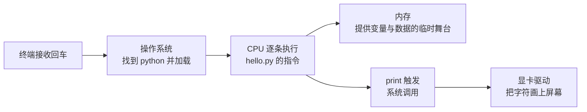

## 前置知识

- 无硬性前置。建议先读 [编程起步指南](/start/010-ProgrammingStartGuide) 与 [零基础计算机常识](/start/020-ComputerBasicsForBeginners)：前者教你写代码，本模块回答「代码凭什么能运行」。

## 学习目标

读完本文你将能够：

1. 顺着「按下回车之后发生了什么」的旅程，说出 CPU、内存、存储、操作系统各自在哪一步登场；
2. 用「刚才那一步用的是哪个部件」的问法，把日常卡顿问题归到大致的类别；
3. 说出本模块四条主线（组成原理 → 操作系统 → 网络 → 软件工程）分别回答什么问题。

预计 30 到 45 分钟。

## 1. 你现在要解决什么问题

你已经会写几行代码了（或者正准备写）。但有一层窗户纸没捅破：**代码是文本，屏幕是像素——中间隔着什么？** 这层窗户纸不捅破，后面所有「性能」「内存」「并发」「网络」的讨论都是咒语。本文用一次最小的旅程把它们串起来。

## 2. 旅程：按下回车之后发生了什么

在终端里敲下 `python hello.py` 并回车。接下来的 0.1 秒内，你的机器上演了一出五幕剧：

逐幕拆解：

- **第一幕（终端）**：终端本身也是个程序，它把你的按键收集成一行文本，交给操作系统；
- **第二幕（操作系统）**：操作系统（Windows/Linux/macOS）是「管理一切资源的大管家」——它从磁盘找到 python.exe（或 python 可执行文件），把代码与数据从**存储**（硬盘/SSD，容量大但慢）搬进**内存**（RAM，断电即失但快），再给 CPU 下达「从这里开始执行」的指令；
- **第三幕（CPU）**：中央处理器是真正「算」的部件——取一条指令、执行、取下一条，每秒数十亿次。你写的每一行代码最终都变成了它执行的机器指令；
- **第四幕（内存）**：`score = 100` 里的 100 此刻就躺在内存的某个位置——快，但程序结束就没了；能长期保存的东西都在存储里；
- **第五幕（输出）**：`print` 不是直接画屏幕，而是发起一次「系统调用」——把任务交还操作系统，由驱动与显卡完成最后的绘制。

**操作系统**贯穿全程：它决定谁能用 CPU、谁分多少内存、谁先访问磁盘。这就是为什么本模块要单独学它（150 篇起）。

## 3. 核心概念：三层抽象与一个分界

计算机科学最强大的思想是**分层**——每一层只跟相邻层打交道：

| 层 | 回答的问题 | 本模块对应篇目 |
| --- | --- | --- |
| 硬件层 | 电信号怎么变成计算 | 组成原理（080-140） |
| 操作系统层 | 谁在什么时候能用硬件 | 操作系统（150-260） |
| 软件层 | 问题怎么变成程序 | 编程基础与范式（020-040） |

而贯穿三层的分界线是**指令集**（CPU 听得懂的指令清单）：编译器把高级语言翻译成它，操作系统用它调度进程，性能问题的根源常常藏在它。现在只需要记住这个词，140 篇会展开。

## 4. 修改实验：把抽象部件对应到眼前数字

打开任务管理器（Windows：Ctrl+Shift+Esc；macOS：活动监视器），做三件事：

1. 找到 CPU 利用率——它就是第三幕的「忙闲表」；
2. 找到内存占用——第二幕搬进舞台的东西正住在这里；
3. 开一个新浏览器标签页再回来看：哪个数字动了？

预期观察：内存占用上升了几百 MB（新程序住进来了），CPU 有一根小波动（加载过程的瞬时计算）。再制造一次 CPU 峰值：打开计算器做一次大数连乘，或运行你写过的最重的脚本，观察利用率曲线的尖峰。**抽象部件从此有了对应的活数字。**

## 5. 常见困惑

**「内存 16G 够吗？」**——先看「住客」：操作系统与常驻程序约占 4-8G，剩下的给当前工作负载；浏览器多开、虚拟机、大型 IDE 都是内存大户。这个问题的完整分析框架在存储系统篇（120），先用任务管理器建立直觉。

**「CPU 利用率 100% 就是病毒吗？」**——100% 只说明 CPU 在满负荷，好坏取决于在算什么：渲染视频时是正常，待机时是异常。归因的方法在操作系统篇的进程管理部分。

**「代码和数据的界限在哪？」**——在存储里都是文件；被加载进内存、被 CPU 执行的那份叫代码，被读写的叫数据。现代安全机制（如 DEP）正是强制这条界限。

## 6. 小练习

预测题：把一个 10GB 的文件夹从机械硬盘复制到同一块盘的另一个目录，最吃紧的是哪个部件——CPU、内存还是磁盘 IO？先写答案，再做一次真实复制观察任务管理器。

修改题：用任务管理器「结束任务」一个你不再需要的后台程序，记录释放的内存量；再打开它，观察加载曲线。

挑战题（不看提示）：画出「双击一个 .txt 文件到记事本显示内容」的五幕剧流程图，标注每幕的主角部件。能画对「文件从哪来、内容到哪去」即通过。

## 7. 什么时候应该深挖这一层

应该：程序出现无法解释的卡顿、内存暴涨、诡异崩溃时——归因能力来自本模块；准备学习性能调优、嵌入式、系统编程时。

不应该：初次接触编程就试图背下全部硬件参数——先建立「旅程地图」，细节随用随查；把本模块当成面试八股来背（它在面试里考的是理解，不是词条）。

## 8. 与之前和之后的知识的关系

- 往前：start 模块让你「会用电脑」，本文是「理解电脑」的第一页——两者的关系就是用户与工程师的分界；
- 往后：020/030 讲程序如何组织，[组成原理](/cs-fundamentals/080-ComputerArchitectureBasics) 从 CPU 内部重新走一遍旅程，[操作系统](/cs-fundamentals/150-OperatingSystem) 专门讲第二幕的大管家，[网络](/cs-fundamentals/270-ComputerNetwork) 把旅程延伸到「别人的电脑」。

## 9. 官方与延伸资料

- 《深入理解计算机系统》（CSAPP）第 1 章——本文旅程的学术版（进阶再读）；
- How does a computer work（CrashCourse Computer Science 视频，可视化补足）：https://www.youtube.com/playlist?list=PL8dPuuaLjXtNlUrpyHNeVQhsFiMkisaVw

## 10. 自我检查

- 能不看资料复述五幕剧并标注每幕的部件；
- 能用任务管理器把「卡」归因到 CPU / 内存 / 磁盘三类之一；
- 能说出分层思想与本模块四条主线的对应。

## 本章总结

代码不是魔法：它被操作系统加载进内存、由 CPU 执行、经系统调用走出屏幕。分层是这一切的秩序来源，任务管理器是你手里第一台「抽象透视镜」。带着这张地图，本模块的每一条主线都会让旅程的某一幕变得完全透明。

## 下一步

进入 [编程基础](/cs-fundamentals/020-ProgrammingBasics)：先站在软件层，看「问题怎么变成程序」。
