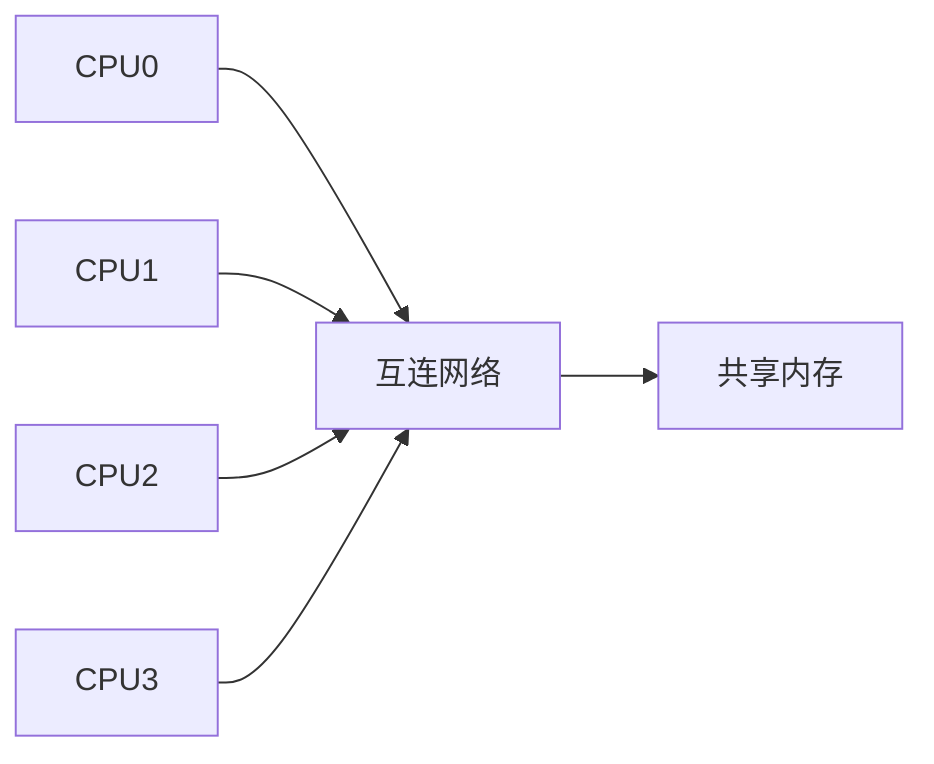
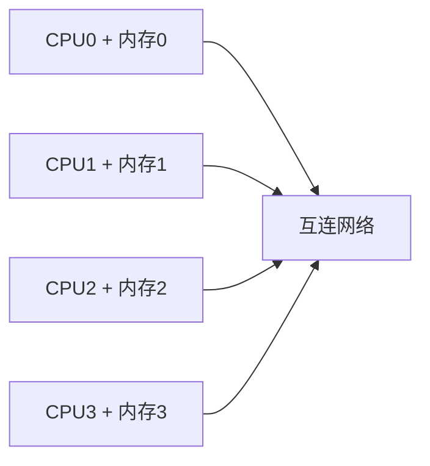
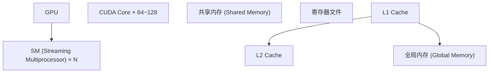

## 知识点地图

- **知识类别**：并行计算——把一个计算拆到多个处理单元上的理论与
  性能模型（Flynn 分类、Amdahl/Gustafson、GPU 架构）。
- **解决什么问题**：单核频率到顶之后，性能只能靠并行度换；但拆分
  本身有代价（通信、同步、串行部分），需要模型预判收益上限。
- **什么时候用到**：评估多线程/多进程改造值不值得、读 GPU 编程材料前
  建立架构心智图、理解 015-go 并发模块与 140-ParallelComputing 的
  分工（并发是结构、并行是执行）。

## 1. 并行计算概述

### 1.1 为什么需要并行计算

单核性能增长放缓（功耗墙、频率墙），并行计算成为提升性能的主要途径：

$$\text{性能} = \frac{\text{工作总量}}{\text{执行时间}} = \frac{N}{T}$$

并行化目标：

$$T_{parallel} = \frac{T_{serial}}{P}$$

其中 $P$ 为处理器数量（理想情况）。

### 1.2 Flynn 分类法

| 类型 | 指令流 | 数据流 | 示例             |
| ---- | ------ | ------ | ---------------- |
| SISD | 单     | 单     | 传统单处理器     |
| SIMD | 单     | 多     | 向量处理器、GPU  |
| MISD | 多     | 单     | 容错系统（少见） |
| MIMD | 多     | 多     | 多核、多处理器   |

## 2. Amdahl 定律与 Gustafson 定律

### 2.1 Amdahl 定律

设程序中可并行化比例为 $f$，处理器数为 $P$：

$$S(P) = \frac{1}{(1-f) + \frac{f}{P}}$$

当 $P \to \infty$：

$$S_{\max} = \frac{1}{1-f}$$

**含义**：串行部分决定了加速比上限。若串行比例为 5%，最大加速比为 20 倍。

### 2.2 Gustafson 定律

Amdahl 定律假设问题规模不变，Gustafson 定律假设问题规模随处理器数增加：

$$S(P) = P - \alpha \times (P - 1)$$

其中 $\alpha$ 为串行比例。

**含义**：随着问题规模增大，串行比例通常减小，加速比可以接近线性。

### 2.3 加速比效率

$$E(P) = \frac{S(P)}{P} = \frac{\text{实际加速比}}{\text{理想加速比}}$$

超线性加速：当并行化带来的 Cache 效应使每个处理器的 Cache 命中率提高时，可能出现 $S(P) > P$。

## 3. 多处理器架构

### 3.1 共享内存多处理器（SMP）

所有处理器共享同一地址空间：



**UMA（Uniform Memory Access）**：所有处理器访问内存的延迟相同。

**NUMA（Non-Uniform Memory Access）**：每个处理器有本地内存，访问本地内存更快。

$$t_{local} \ll t_{remote}$$

### 3.2 分布式内存多处理器

每个处理器有私有内存，通过消息传递通信：



**MPI（Message Passing Interface）**是分布式内存编程的标准接口。

### 3.3 互连网络

| 拓扑     | 直径                  | 对分带宽   | 链路数         |
| -------- | --------------------- | ---------- | -------------- |
| 环形     | $\lfloor N/2 \rfloor$ | 2          | N              |
| 网格     | $2(\sqrt{N}-1)$       | $\sqrt{N}$ | $2N-2\sqrt{N}$ |
| 超立方体 | $\log N$              | $N/2$      | $N\log N/2$    |
| 胖树     | $\log N$              | $N/2$      | $O(N\log N)$   |

## 4. 并行算法

### 4.1 并行前缀和

串行：$O(n)$

并行（2路）：$O(\log n)$ 时间，$O(n)$ 处理器

```
Step 0: [1, 2, 3, 4, 5, 6, 7, 8]
Step 1: [1, 3, 5, 7, 9, 11, 13, 15]   (相邻求和)
Step 2: [1, 3, 6, 10, 15, 21, 28, 36]  (间隔2求和)
Step 3: [1, 3, 6, 10, 15, 21, 28, 36]  (间隔4求和)
```

### 4.2 并行归约

求 $n$ 个数的和/最大值/最小值：

$$T_{parallel} = O(\log n)$$

$$W_{total} = O(n)$$

### 4.3 并行排序

| 算法         | 时间复杂度    | 空间           | 稳定性 |
| ------------ | ------------- | -------------- | ------ |
| 奇偶排序     | $O(n)$        | $O(1)$         | 稳定   |
| 双调排序     | $O(\log^2 n)$ | $O(n\log^2 n)$ | 不稳定 |
| 并行归并排序 | $O(\log n)$   | $O(n)$         | 稳定   |
| 样本排序     | $O(\log n)$   | $O(n)$         | 不稳定 |

### 4.4 并行矩阵乘法

$$C_{ij} = \sum_{k=1}^{n} A_{ik} \times B_{kj}$$

**行划分**：每个处理器计算 $C$ 的若干行。

**块划分（Cannon算法）**：将矩阵划分为 $P$ 个子块，$P$ 个处理器各自计算一个子块。

$$T_{Cannon} = O\left(\frac{n^3}{P} + \sqrt{P} \times n^2\right)$$

## 5. GPU 计算

### 5.1 GPU 架构

GPU 采用 SIMT（Single Instruction Multiple Threads）模型：



### 5.2 CUDA 编程模型

```
Grid → Block → Thread

Grid: (gridDim.x, gridDim.y, gridDim.z)
Block: (blockDim.x, blockDim.y, blockDim.z)
Thread: (threadIdx.x, threadIdx.y, threadIdx.z)
```

**线程层次**：

- Grid：一个 kernel 的所有线程
- Block：可共享共享内存、可同步
- Thread：最小执行单元

### 5.3 GPU 内存层次

| 内存类型 | 位置   | 延迟      | 带宽 | 作用域   |
| -------- | ------ | --------- | ---- | -------- |
| 寄存器   | 芯片内 | 1 周期    | 极高 | 单线程   |
| 共享内存 | 芯片内 | ~5 周期   | 高   | 单 Block |
| L1 Cache | 芯片内 | ~30 周期  | 中   | 单 SM    |
| L2 Cache | 芯片内 | ~100 周期 | 中   | 全局     |
| 全局内存 | 显存   | ~400 周期 | 低   | 全局     |

### 5.4 GPU 性能优化

**合并访存（Coalesced Access）**：相邻线程访问相邻地址。

**共享内存分块（Tiling）**：将数据分块加载到共享内存，减少全局内存访问。

**线程束（Warp）**：32 个线程同时执行相同指令，分支分化导致性能下降。

**占用率（Occupancy）**：

$$\text{Occupancy} = \frac{\text{活跃 Warp 数}}{\text{最大 Warp 数}}$$

受寄存器使用量和共享内存使用量限制。

## 6. 并行编程模型

### 6.1 共享内存编程

**OpenMP**：基于编译制导的共享内存并行编程：

```c
#pragma omp parallel for reduction(+:sum)
for (int i = 0; i < N; i++) {
    sum += a[i];
}
```

**Pthreads**：POSIX 线程库，提供更细粒度的控制。

### 6.2 消息传递编程

**MPI**：

```c
MPI_Init(&argc, &argv);
MPI_Comm_rank(MPI_COMM_WORLD, &rank);
MPI_Comm_size(MPI_COMM_WORLD, &size);

// 发送和接收
MPI_Send(data, count, MPI_INT, dest, tag, MPI_COMM_WORLD);
MPI_Recv(data, count, MPI_INT, src, tag, MPI_COMM_WORLD, &status);

MPI_Finalize();
```

### 6.3 编程模型对比

| 模型     | 地址空间 | 通信方式         | 同步方式        | 适用架构 |
| -------- | -------- | ---------------- | --------------- | -------- |
| OpenMP   | 共享     | 隐式（共享变量） | 编译制导        | SMP      |
| Pthreads | 共享     | 隐式             | 互斥锁/条件变量 | SMP      |
| MPI      | 分布     | 显式（消息）     | 屏障/消息       | 集群     |
| CUDA     | 分层     | 显式（拷贝）     | 同步函数        | GPU      |

## 动手实践

**任务**：在本机实测 Amdahl 定律——把一个可并行的数组求和拆成
串行部分（10% 模拟）与并行部分（90%），测 1/2/4/8 线程的加速比，
并与 Amdahl 公式预测值对比。

1. 用 Python（`concurrent.futures`）或任何熟悉语言实现：串行段
   （简单累加 10% 数据）+ 并行段（其余 90% 数据按块分线程求和再合并）；
2. 每种线程数跑 5 次取中位数，计算实测加速比 `T(1)/T(n)`；
3. 代入 Amdahl 公式 $S(n) = 1 / ((1-p) + p/n)$，p 取 0.9，算预测值；
4. 把串行比例改成 30% 再测一轮，观察加速比上限骤降到约 3.3。

**提示**：Python 受 GIL 限制，CPU 密集任务要用 `ProcessPoolExecutor`
而不是 `ThreadPoolExecutor`（GIL 与线程模型的细节见 180-CoroutinesAndConcurrencyModels
与 015-go 并发篇的对照阅读）；计时用 `time.perf_counter()`，别用 `time.time()`。

<details>
<summary>参考实现（先自己写，再展开对照）</summary>

```python
# amdahl_lab.py —— 实测加速比对照 Amdahl 预测
import time, statistics
from concurrent.futures import ProcessPoolExecutor

def serial_sum(data):                    # 串行段：10% 数据
    return sum(data[: len(data) // 10])

def chunk_sum(chunk):                    # 并行段的工作单元
    return sum(chunk)

def run(data, workers):
    t0 = time.perf_counter()
    s = serial_sum(data)
    cut = len(data) // 10
    chunks = [data[cut + i * (len(data)-cut)//workers :
                    cut + (i+1) * (len(data)-cut)//workers]
              for i in range(workers)]
    with ProcessPoolExecutor(workers) as ex:
        s += sum(ex.map(chunk_sum, chunks))
    return time.perf_counter() - t0, s

data = list(range(20_000_000))
base = statistics.median(run(data, 1)[0] for _ in range(5))
for w in (1, 2, 4, 8):
    t = statistics.median(run(data, w)[0] for _ in range(5))
    predicted = 1 / (0.1 + 0.9 / w)      # Amdahl，p = 0.9
    print(f"w={w} 实测加速比 {base/t:.2f}  预测 {predicted:.2f}")
# 预期：w=8 时实测明显低于预测 4.7 —— 差值就是进程创建与数据搬运开销
```

**逐段讲解**：串行段固定读 10% 数据，是公式里的 `(1-p)` 项；`ex.map`
把并行段切成 workers 块分发给进程池；实测曲线低于预测的部分不是公式
错了，而是公式没建模的项——进程启动、结果合并、内存带宽饱和
（第 3 节多处理器架构的共享总线就是瓶颈来源）。把串行比例改 30% 后
你会看到 w=8 的加速比被 `(1-p)` 项钉死在 3 附近——
**串行份额是并行的硬顶**，这就是 Amdahl 定律的全部意义。

</details>
