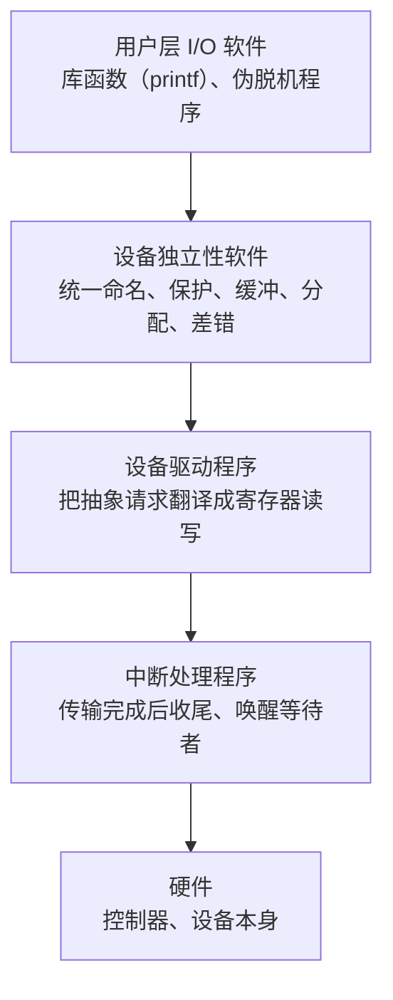

## 前置知识

- 中断的基本流程：设备发出信号 -> CPU 保存现场 -> 执行中断处理程序 -> 恢复现场（见 [中断与系统调用](/cs-fundamentals/190-InterruptAndSystemCall)）；
- 知道 CPU 与内存是纳秒级、磁盘是毫秒级，存在五六个数量级的速度鸿沟；
- 用过 `ls /dev` 或在任务管理器里见过"磁盘 I/O"字样即可。

## 学习目标

- 说出 CPU 与外设速度差的量级，理解 I/O 管理要同时解决"速度匹配"与"设备繁杂"两个问题；
- 按演进顺序讲清四种 I/O 控制方式（轮询、中断驱动、DMA、I/O 通道），并能指出每种方式里 CPU 何时介入；
- 画出 I/O 软件的层次结构，解释"设备独立性"靠哪一层保证；
- 推演单缓冲与双缓冲下每块数据的处理耗时，说出缓冲存在的四个理由；
- 解释 SPOOLing 如何把打印机这类独占设备改造成"逻辑上的共享设备"。

预计 40 到 55 分钟。

## 1. 概念引入：钢琴家为什么要翻谱员

一个类比：钢琴家（CPU）一秒钟弹几十个音，而谱源（磁盘、键盘、网卡）有的慢得像手抄本，一页要翻好几秒。如果钢琴家亲自翻谱，演奏就停了；如果完全不参与，谱子又到不了琴上。解决方案是一整套"后台班子"：

- 有人在谱到位时**轻拍一下**钢琴家（中断）；
- 有专人**整段搬运**谱纸，搬完才通知（DMA）；
- 还有一个**小团队**能自己读懂搬运清单，成批处理（I/O 通道）；
- 谱台上的**双份谱架**让翻谱与演奏重叠进行（缓冲）。

I/O 管理这门课的全部内容，就是这套后台班子的组织学。

## 2. 问题的两端：速度鸿沟与设备多样性

I/O 管理要同时对付两件事：

**速度鸿沟**（数量级为约数，用于建立直觉）：

| 部件 | 典型一次访问耗时 |
| ---- | ---- |
| CPU 寄存器 | 亚纳秒级 |
| 内存 | 约百纳秒 |
| SSD 随机读 | 约数十微秒 |
| 机械硬盘随机读 | 约数毫秒 |
| 网络往返 | 约零点几毫秒起 |

CPU 等"最慢的一环"等一个周期，能执行几十万条指令。所以 I/O 设计的第一原则是：**让 CPU 尽量不等**——这是下面四种控制方式一以贯之的进化方向。

**设备多样性**：键盘要一个字节一个字节地收，磁盘按块（扇区）读写，网卡收发不定长的帧，显卡要高速吞吐。如果每个应用都要懂这些细节，操作系统的可移植性与应用的可写性都不复存在。所以第二原则是：**把差异压进低层，向上提供统一接口**——这是第 4 节层次结构的由来。

## 3. I/O 控制方式的四级演进

### 3.1 轮询（程序直接控制方式）

CPU 反复读设备状态寄存器，直到"就绪"标志出现才传输一个字节。

```text
loop:
    读状态寄存器      <- 忙等：绝大多数循环里设备都没就绪
    若未就绪 goto loop
    读/写一个字节
```

CPU 利用率接近零地烧在等待上，只适合秒级以下延迟的简单场景（如早期单片机点灯）。它是后面一切方案用来对比的"原点"。

### 3.2 中断驱动

CPU 发出读命令后去干别的；设备就绪时发一个中断，CPU 在中断处理程序里把**一个字节（或一个字）**搬走。等待期间 CPU 不再空转（中断机制详见 [中断与系统调用](/cs-fundamentals/190-InterruptAndSystemCall)）。

代价：每传一个字节就要打断 CPU 一次。传 1KB 就是上千次"保存现场-执行-恢复现场"，中断本身的开销反客为主。适合键盘、鼠标这类天然低速、按字节到达的设备——它们的速率下中断开销可以忽略。

### 3.3 DMA（直接内存访问）

在设备与内存之间架一个专职搬运工：CPU 只需设置一次"源地址、目的地址、长度"，DMA 控制器（DMAC）独立搬完整块数据，**结束后只发一次中断**。传输期间 CPU 可以执行别的进程（总线在数据传输的瞬间可能被 DMA 占用，CPU 偶尔要等总线周期，但远好于逐字节打断）。

| 维度 | 轮询 | 中断驱动 | DMA |
| ---- | ---- | ---- | ---- |
| CPU 介入时机 | 全程忙等 | 每字节一次 | 每块两次（发起、结束） |
| 数据通路 | 设备 -> CPU 寄存器 -> 内存 | 同左 | 设备 <-> 内存直达 |
| 适用设备 | 极简单/低速 | 键盘、串口 | 磁盘、网卡、声卡 |

[零拷贝](/cs-fundamentals/250-ZeroCopy) 里的 SG-DMA（分散-聚集 DMA）是这一步的延伸：设备间直接搬运，CPU 连一次字节的复制都不参与——控制方式的演进与"减少拷贝"是同一条主线。

### 3.4 I/O 通道

DMA 之上再抽象：通道是一种能执行**通道程序**的简易处理器，CPU 把"读哪个文件的哪些块、写到哪"编成程序交给通道，通道自主处理一批设备的整组 I/O，完成后才中断 CPU。CPU 的介入从"每块两次"降到"每批两次"。大型机与高端存储控制器沿这条路线演进；通用 PC 上该角色由智能设备控制器（如 NVMe 控制器内部的多队列）承担，思想一脉相承。

一句话记忆这条演进线：**CPU 介入的粒度从"每个字节"到"每块"再到"每批"，介入越晚，CPU 越自由。**

## 4. I/O 软件的层次结构

控制方式解决"谁来搬"，层次结构解决"谁来管"。经典四层模型自上而下：



每层只回答一个问题：

- **用户层软件**：把应用意图变成标准调用（`printf` 最终落到 `write`）；
- **设备独立性软件**：核心承诺是**设备独立性（设备无关性）**——应用用统一的名字（Linux 里是 `/dev/sda`、`/dev/tty`）与统一的接口（read/write/ioctl）访问任何设备；缓冲、分配、差错管理也在这层。换一块硬盘不改一行应用代码，靠的就是它；
- **设备驱动程序**：唯一"认识"具体设备的一层，把"读 100 号扇区"翻译成"向这几个端口/寄存器写这些命令字"，并处理设备私有的怪癖。驱动的质量直接决定整机稳定性——这也是内核崩溃十有八九指向驱动的原因；
- **中断处理程序**：I/O 完成后的收尾（搬运剩余状态、唤醒等待进程）。Linux 把它拆成"上半部紧急响应、下半部慢慢处理"，正是为了缩短中断关闭窗口。

自上而下看是"请求逐层翻译"，自下而上看是"事件逐层上报"：硬件中断 -> 驱动确认状态 -> 独立性软件完成缓冲与唤醒 -> 用户层拿到结果。

## 5. 缓冲管理：用一块小内存抹平速度差

### 5.1 为什么需要缓冲

四个理由，前两个最常考：

1. **缓和速度矛盾**：CPU 消费一块数据的速度与设备产出一块的速度不匹配，缓冲让双方各按各的节奏走；
2. **减少中断频率**：设备先填满缓冲再一次性中断，而不是每个字节中断一次；
3. **协调数据粒度**：应用按"行/记录"产出，设备按"块"传输，缓冲负责两种粒度的转换；
4. **解耦与异步**：请求先进缓冲队列，应用不必同步等待设备完成。

### 5.2 单缓冲与双缓冲的耗时推演

408 教材的经典考点。设：设备把一块数据输入缓冲区耗时 T，缓冲区把数据移到工作区耗时 M，CPU 处理（计算）一块耗时 C。稳态下连续处理 N 块，**每块平均耗时**：

- **单缓冲**：设备输入与 CPU 处理可以重叠，但"缓冲 -> 工作区"的搬运 M 与两者都互斥（缓冲只有一份，要么在装，要么在倒）：

```text
每块耗时 = max(C, T) + M
```

- **双缓冲**：设备往 A 缓冲写时，CPU 可消费 B 缓冲的内容，两个环节完全重叠：

```text
每块耗时 = max(C + M, T)
```

数值验证：取 T = 100、M = 10、C = 50（单位随意）。

```text
单缓冲：max(50, 100) + 10 = 110
双缓冲：max(50 + 10, 100) = 100
```

双缓冲赢在"搬运 M 被藏进了重叠里"。注意两个推论的适用前提是"稳态流水"（处理很多块），只处理一两块时公式退化为串行和；不同教材对 M 的归属约定略有差异，考试先确认约定再套公式（与 [磁盘调度](/cs-fundamentals/240-DiskScheduling) 的推演约定同理）。

缓冲再多走一步就是**循环缓冲**（多个缓冲组成环，输入输出指针追逐）与**缓冲池**（全系统共享的空缓冲池，按需借还），后者是现代操作系统页缓存的思想雏形——[零拷贝](/cs-fundamentals/250-ZeroCopy) 省掉的正是"设备 -> 页缓存 -> 用户缓冲"里多余的搬运。

## 6. 设备分配与 SPOOLing（假脱机）

打印机是**独占设备**：两个进程的字节流交织打印必然乱套。但让每个用户独占一台物理打印机又太浪费。SPOOLing（Simultaneous Peripheral Operations On-Line，假脱机）用磁盘改写了这道题：

```text
应用"打印"        -> 作业排进磁盘上的输出井（文件）
SPOOLing 守护进程  -> 从队列逐个取出，独占地喂给物理打印机
应用"看进度"      -> 队列状态即时可查、可取消
```

对应用而言，它"拥有"一台随叫随到的逻辑打印机；对物理设备而言，它始终只服务一个守护进程。**独占设备经由"磁盘缓冲 + 单一守护进程"变成了逻辑共享设备**——今天的打印队列、批量任务转码、审计日志落盘，都是同一模式。SPOOLing 的成立条件值得推敲：磁盘必须是可共享的块设备，且井空间要管起来（磁盘满了打印队列会拒绝新作业）。

设备分配的另一条主线是**安全**：设备是资源，分配要经过"申请-分配-使用-回收"的完整生命周期，系统要防两个进程同时拿到同一设备（独占类）的竞争——机制上与进程同步（信号量）一脉相承。

## 7. 完整示例：在 Linux 里验证这些概念

Linux 把前四节全部落地成"一切皆文件"：设备是 `/dev` 下的文件，驱动向内核注册统一的 `file_operations`（open/read/write/ioctl），上层四层结构与第 4 节完全对应。

```bash
# 1. 设备分类：ls -l 第一个字符 b=块设备 c=字符设备
ls -l /dev | grep -E "^b|^c" | head -5
# brw-rw---- 1 root disk      8,  0 sda      <- 块设备：按块寻址、可随机访问
# crw-rw-rw- 1 root tty      5,  0 tty      <- 字符设备：按字节流、顺序访问

# 2. 观察中断驱动：保持本命令运行，另开终端敲键盘
watch -n1 'grep -E "i8042|xhci" /proc/interrupts'
# 每敲一个键，i8042（键盘控制器）一列的计数 +1 —— 第 3.2 节的现场版

# 3. 观察 DMA 时代的块设备：/sys 暴露了驱动与队列信息
cat /sys/block/sda/queue/scheduler   # 当前 I/O 调度器（连接磁盘调度篇）
ls /sys/class/block/                 # 内核眼中的块设备清单
```

三个命令分别对应本篇三块知识：设备分类（块/字符）、中断按设备计数、驱动与队列暴露在 sysfs。它们在 macOS/Windows 上不可直接复用（macOS 用 `ioreg`，Windows 用设备管理器），概念对应关系不变。

## 8. 常见陷阱与调试

- **"用了 DMA，CPU 完全空闲"**：CPU 不搬运字节是对的；但 DMA 占用内存总线时 CPU 访存要等总线周期，且发起与结束仍需 CPU 介入。"完全不管"的是通道级别的事情。
- **缓冲不是越大越好**：缓冲换吞吐的代价是延迟（数据先排队）与一致性（写缓冲后掉电丢数据）。数据库领域"先写日志、何时 fsync"正是缓冲与持久性的权衡，`fsync` 每笔都调则慢、从不调则掉电丢事务——没有免费午餐。
- **"写文件返回成功 = 数据已落盘"**：返回成功通常只表示进了页缓存（内核缓冲）。断电保护要靠 `fsync` 或文件系统日志，这是缓冲管理四层结构里"设备独立性软件"层的真实行为。
- **中断风暴**：设备故障时中断可能每秒数十万次，CPU 全耗在中断上。内核有中断线程化与自动关闭等防护，排障时 `/proc/interrupts` 计数异常飙高的那行就是嫌疑人。
- **考试推演不确认约定**：单/双缓冲公式、SCAN 折返点、通道中断时机，不同教材约定有差。先写约定再推演，答案分歧多半是约定分歧。

## 9. 实战场景

- **数据库与存储引擎**：WAL（预写日志）直接绕过应用层缓冲、按策略 `fsync`，就是在页缓存这一层做显式的持久性取舍；理解 I/O 分层才能读懂"commit 延迟"类参数。
- **打印/批处理服务**：SPOOLing 模式的现代版——任何"独占资源 + 队列化"的服务（打印、串口采集、3D 打印机）都值得套这个结构。
- **性能排障**：`iostat -x` 的 await 异常先想磁盘调度与队列深度；`pidstat` 显示 sys 占比异常高先想系统调用与中断次数——本篇的层次结构就是排障的"定位地图"。
- **嵌入式与驱动入门**：四层模型是读懂任何内核驱动框架（Linux 的字符设备驱动、RT-Thread 的设备框架）的入口：先找 file_operations，再看它落到哪些寄存器操作。

## 小结

初学者要点：

- I/O 管理解决速度鸿沟与设备多样两件事；控制方式的演进是 CPU 介入粒度从字节到块再到批：轮询 -> 中断驱动 -> DMA -> I/O 通道。
- I/O 软件四层：用户层 -> 设备独立性软件（统一命名、缓冲、分配）-> 驱动程序（翻译成寄存器操作）-> 中断处理 -> 硬件；设备独立性由第二层保证。
- 单缓冲每块耗时 max(C, T) + M，双缓冲 max(C + M, T)；缓冲的四个理由是速度匹配、减少中断、粒度转换、异步解耦。
- SPOOLing 用"磁盘井 + 单一守护进程"把打印机这类独占设备改造成逻辑共享设备。

进阶注意：

- "写成功"不等于"落盘"，页缓存行为决定持久性；DMA 省 CPU 但不省总线；中断风暴是驱动的经典事故。
- Linux 的 /dev、sysfs 与 file_operations 是四层模型的真实落地，观察工具：`ls -l /dev`、`/proc/interrupts`、`/sys/block`。
- 推演类考点先确认教材约定（缓冲公式、调度折返点），再动笔。

## 动手与自检

练习一（观察）：运行第 7 节的三个命令。任务：敲 10 个键后记录键盘控制器中断列的增量，回答"每键一次中断"是否符合 3.2 节的预期；再用鼠标滚轮滚动，找出对应设备的中断计数变化。

练习二（推演）：设备输入一块 T = 80、缓冲到工作区 M = 20、CPU 处理 C = 120。先笔算单缓冲与双缓冲的每块耗时，再解释"当 C 明显大于 T 时，双缓冲相对单缓冲的收益趋近于多少"。写完再核对：

```text
单缓冲：max(120, 80) + 20 = 140
双缓冲：max(120 + 20, 80) = 140
```

结论：C 是瓶颈时两者都压在 C 上，双缓冲收益趋近于零——缓冲只救"设备快、CPU 慢"之外的速度错配，救不了 CPU 本身慢。

练习三（对照）：找一个你常用的软件功能（如"保存文档"），沿四层模型写出它的完整链路：应用 API -> 库函数 -> 系统调用 -> 独立性软件（页缓存）-> 驱动 -> 设备。写出每一层"负责什么、坏了会表现为什么"。

自检——能不看文档回答吗：

1. 四种 I/O 控制方式中，CPU 分别在什么时机介入？
2. 设备独立性由哪一层保证？举一个"换设备不改应用"的具体例子。
3. 为什么键盘用中断驱动、磁盘用 DMA？判断标准是什么？
4. 单缓冲与双缓冲公式各是什么？各自的成立前提？
5. SPOOLing 把独占设备改造成共享设备，靠的是哪两个资源？
6. "write 返回成功"与"数据已持久"的区别出在哪一层？

## 下一步

- I/O 的调度端：请求排队后磁盘端如何重排——[磁盘调度](/cs-fundamentals/240-DiskScheduling)；
- 搬运次数的极致优化：当"设备 -> 页缓存 -> 用户缓冲"都想省掉——[零拷贝](/cs-fundamentals/250-ZeroCopy)；
- 中断机制的完整流程与系统调用的关系：[中断与系统调用](/cs-fundamentals/190-InterruptAndSystemCall)。
