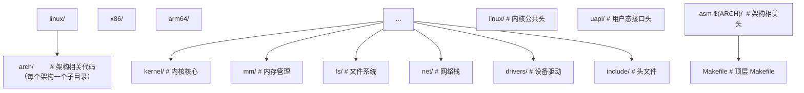
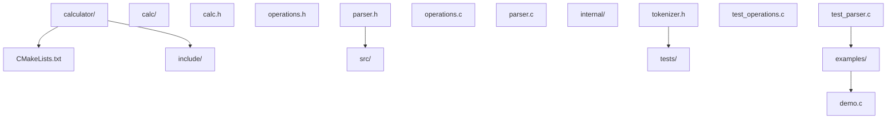
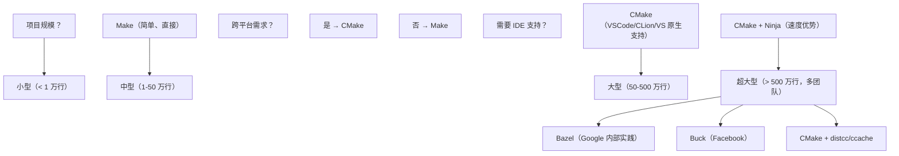

# 多文件编译

## 1. 历史动机与演进

### 1.1 早期 Unix 的多文件编译（1969-1973）

Dennis Ritchie 在 1972 年设计 C 语言时，PDP-11 的内存仅有 64KB，无法一次装入完整编译器。这一硬件约束直接催生了 C 语言的"分离编译"设计哲学：

- **编译器分阶段**：编译器本身被拆分为 c0、c1、c2 三个 pass，各自从中间文件读写
- **程序分模块**：用户程序也被拆分为多个 `.c` 文件，独立编译为 `.o` 目标文件
- **链接器组装**：Unix `ld` 链接器将多个 `.o` 文件合并为可执行文件 `a.out`（assembler output 的缩写）

1979 年贝尔实验室发布的第 7 版 Unix 引入了 `make` 工具，自动追踪文件依赖关系，只重新编译发生变化的目标文件。这是构建系统的开山之作，至今 Make 仍是 Unix 世界的标配。

### 1.2 C89 标准化（1989）

ANSI X3.159-1989（即 C89）首次将"翻译单元"（translation unit）作为标准术语引入：

> A translation unit is the basic unit of compilation in C. It consists of a source file together with any header files and source files included via the `#include` directive, less any source lines skipped by conditional inclusion preprocessor directives.

C89 同时定义了三类链接性（linkage）：external、internal、no linkage，以及两阶段翻译模型（翻译 → 链接）。

### 1.3 C99/C11 的演进

- **C99** 引入 `inline` 函数（§6.7.4），扩展了 ODR 规则，允许 inline 函数在多个翻译单元中定义
- **C11** 引入 `_Thread_local`（线程局部存储）与 `_Generic`，对链接性模型做出扩展
- **C11** 同时引入了原子操作（`<stdatomic.h>`）与线程支持（`<threads.h>`），影响符号可见性

### 1.4 C17/C23/C2y 的现代化

- **C17**（ISO/IEC 9899:2018）：缺陷修复版本，未引入新特性
- **C23**（ISO/IEC 9899:2024）：引入 `constexpr`、`nullptr`、`#embed`、`__attribute__` 标准化、`thread_local` 关键字（替代 `_Thread_local`）、`auto` 类型推断等
- **C2y**（草案）：计划引入模块化机制（借鉴 C++20 modules），可能彻底改变 C 的翻译单元模型

### 1.5 现代构建系统演进

| 年份 | 工具 | 主要创新 |
|------|------|----------|
| 1977 | Make | 依赖追踪与增量构建 |
| 2000 | SCons | Python 脚本构建 |
| 2003 | CMake | 跨平台生成器，元构建系统 |
| 2010 | Ninja | 高速底层构建工具 |
| 2013 | Meson | 极简声明式 DSL |
| 2015 | Bazel | 谷歌开源，支持大规模分布式构建 |
| 2018 | Meson + WrapDB | 原生依赖管理 |

## 2. 翻译单元与翻译阶段

### 2.1 C 标准定义的 8 个翻译阶段

ISO/IEC 9899:2024 §5.1.1.2 定义了 C 程序从源文件到可执行文件的 8 个翻译阶段（translation phases）。理解这 8 个阶段是掌握多文件编译的理论基础。

#### 阶段 1：物理字符映射

将源文件中的物理字符（可能为多字节编码如 UTF-8）映射为源字符集（source character set），同时处理行尾符（CRLF/CR/LF 统一为 LF）。三联符（trigraph，如 `??=` 替换为 `#`）在此阶段处理，但 C23 已移除三联符支持。

```c
// 阶段 1 输入：UTF-8 编码的源文件
// 阶段 1 输出：源字符集（通常为 ASCII + 扩展字符）
```

#### 阶段 2：行拼接

将以反斜杠 `\` 结尾的行与下一行合并为单个逻辑行。同时处理"空源文件"边界条件。

```c
// 源代码
int x = 1 + \
        2 + \
        3;

// 阶段 2 输出
int x = 1 + 2 + 3;
```

#### 阶段 3：词法分析

将源代码切分为预处理记号（preprocessing token）与空白符（包括注释替换为空格）。注释 `/* ... */` 与 `// ...` 在此阶段被替换为单个空格。

```c
// 源代码
int /* comment */ x; // inline comment

// 阶段 3 输出（记号流）
int x;
```

#### 阶段 4：预处理

执行预处理指令：`#include`、`#define`、`#if`、`#ifdef`、`#pragma` 等。宏展开发生在此阶段。`#include` 指令将指定头文件内容**递归地**插入到当前位置，形成完整的翻译单元。

```c
// 源代码 file.c
#include <stdio.h>
#include "utils.h"
int main(void) { return add(1, 2); }

// 阶段 4 输出（翻译单元）
// <stdio.h 的全部内容>
// <utils.h 的全部内容>
int main(void) { return add(1, 2); }
```

#### 阶段 5：字符常量转换

将字符常量与字符串字面量中的字符转换为执行字符集（execution character set）。例如源文件中的 UTF-8 字符可能转换为 UTF-8、GBK 等执行字符集编码。转义序列（`\n`、`\t`、`\x41` 等）在此阶段求值。

#### 阶段 6：字符串字面量拼接

相邻的字符串字面量被拼接为单个字符串。

```c
// 源代码
printf("Hello, " "world!\n");

// 阶段 6 输出
printf("Hello, world!\n");
```

#### 阶段 7：编译

真正的"编译"发生在此阶段。将预处理后的翻译单元转换为汇编代码，再汇编为目标文件（`.o` / `.obj`）。语法分析、语义分析、优化、代码生成均在此阶段完成。

```
翻译单元 → [词法/语法/语义分析] → [优化] → [代码生成] → 目标文件
```

#### 阶段 8：链接

将多个目标文件（包括库文件）合并为单个可执行文件或库。符号解析（symbol resolution）与重定位（relocation）在此阶段完成。链接分为静态链接（static linking）与动态链接（dynamic linking）。

```
目标文件1.o + 目标文件2.o + 库.a/.so → 可执行文件
```

### 2.2 翻译单元的形式化定义

一个翻译单元由以下部分组成：

```
<translation-unit> ::= <external-declaration>*
<external-declaration> ::= <function-definition>
                        | <declaration>
```

翻译单元是 C 编译器的最小独立处理单位。一个 `.c` 文件加上它直接或间接包含的所有头文件，构成一个完整的翻译单元。

### 2.3 单一定义规则（ODR）

C 标准 §6.9p5 规定：

> If an identifier declared with external linkage is used in an expression (other than as part of the operand of a sizeof operator whose result is an integer constant), somewhere in the entire program there shall be exactly one external definition for the identifier.

即：**具有外部链接的标识符，在整个程序中必须且只能有一个定义**。这是 ODR 的核心内容。

#### 2.3.1 声明 vs 定义

理解 ODR 的关键是区分声明（declaration）与定义（definition）：

```c
// 声明（declaration）：告诉编译器标识符的类型与存在
extern int counter;          // 变量声明
int add(int, int);           // 函数声明（原型）
struct Node;                 // 结构体不完整声明

// 定义（definition）：分配存储空间或实现函数体
int counter = 0;             // 变量定义（分配存储）
int add(int a, int b) {      // 函数定义（实现）
    return a + b;
}
struct Node {                // 结构体完整定义
    int data;
    struct Node *next;
};
```

| 特征 | 声明 | 定义 |
|------|------|------|
| 是否分配存储 | 否 | 是 |
| 是否实现函数体 | 否 | 是 |
| 可出现次数 | 多次 | 仅一次（外部链接） |
| 语法形式 | `extern T name;` / `T name(params);` | `T name = value;` / `T name(params) { ... }` |

#### 2.3.2 ODR 合规示例

```c
// counter.h（头文件，只放声明）
#ifndef COUNTER_H
#define COUNTER_H
extern int counter;          // 声明：可被多个 .c 包含
void counter_inc(void);      // 声明
int counter_get(void);       // 声明
#endif

// counter.c（实现文件，放定义）
#include "counter.h"
int counter = 0;             // 定义：全程序唯一
void counter_inc(void) { counter++; }
int counter_get(void) { return counter; }

// main.c
#include "counter.h"
int main(void) {
    counter_inc();
    return counter_get();
}
```

#### 2.3.3 ODR 违规示例

```c
// 错误示例 1：头文件中定义变量
// header.h
int counter = 0;             // 错误：这是定义！
// 被 file1.c 和 file2.c 同时包含后，链接器报错：
// multiple definition of `counter'

// 错误示例 2：多个 .c 文件定义同名外部函数
// file1.c
int helper(void) { return 1; }
// file2.c
int helper(void) { return 2; }  // 错误：multiple definition

// 错误示例 3：缺少定义
// file.c
extern int magic;            // 声明
void use(void) { return magic; }  // 链接时：undefined reference to `magic'
```

### 2.4 内联函数的 ODR 例外

C99 引入的 `inline` 函数对 ODR 有特殊规则。C 语言（与 C++ 不同）的 inline 语义复杂，存在三种形式：

```c
// 形式 1：inline（无 extern，需要外部定义）
// header.h
inline int square(int x) { return x * x; }   // 内联定义，可多处
// 必须在某 .c 中提供外部定义：
int square(int x);

// 形式 2：extern inline（强制外部链接）
// header.h
inline int square(int x);   // 声明
// file.c
extern inline int square(int x) { return x * x; }  // 提供外部定义

// 形式 3：static inline（推荐用法，无 ODR 顾虑）
// header.h
static inline int square(int x) { return x * x; }  // 每个翻译单元独立副本
```

**工程实践**：在 C 项目中，优先使用 `static inline`，它既有内联的性能优势，又避免了 ODR 复杂性，是头文件中定义小函数的标准模式。

## 3. 链接性（Linkage）

链接性（linkage）描述一个标识符在不同翻译单元间是否可见。C 标准定义了三种链接性。

### 3.2 内部链接（Internal Linkage）

具有内部链接的标识符仅在当前翻译单元内可见。使用 `static` 关键字（用于变量或函数）或匿名命名空间（C++ 特性，C 不支持）实现。

```c
// file1.c
static int internal_var = 0;       // 内部链接
static int helper(void) {          // 内部链接
    return internal_var++;
}

// file2.c
extern int internal_var;           // 链接器报错：undefined reference
// 即使 file2.c 中也定义 internal_var，两个变量互不影响
```

#### 3.2.1 static 关键字的多重含义

`static` 在 C 中有三种不同含义，取决于上下文：

| 上下文 | 含义 | 示例 |
|--------|------|------|
| 文件作用域变量 | 内部链接 | `static int x;` |
| 文件作用域函数 | 内部链接 | `static void f(void);` |
| 块作用域变量 | 静态存储期 | `void f() { static int x = 0; }` |

C23 引入 `constexpr` 与 `thread_local` 后，社区开始反思 `static` 的多重语义问题。部分代码规范（如 Google C++ Style Guide）建议在文件作用域使用匿名命名空间（C++）或显式 `static`（C）。

#### 3.2.2 内部链接的工程价值

```c
// file.c
// 内部辅助函数：不污染全局符号表，便于链接器优化
static int validate_input(int x) {
    return x >= 0 && x <= 100;
}

// 公开 API：通过头文件暴露
int process(int input) {
    if (!validate_input(input)) return -1;
    return input * 2;
}
```

内部链接的工程价值：

1. **封装**：隐藏实现细节，仅暴露 API
2. **优化**：编译器可见整个定义，可内联或删除未使用代码
3. **避免冲突**：不同翻译单元可定义同名内部函数
4. **减少符号表**：链接器符号表更小，链接更快

### 3.3 无链接（No Linkage）

具有无链接的标识符仅在定义它的块作用域或函数原型内可见。包括：

- 局部变量（块作用域变量）
- 函数形参
- 结构体/联合体/枚举标签（在块作用域内）
- `typedef` 名称（在块作用域内）

```c
void f(int param) {            // param 无链接
    int local = 0;             // local 无链接
    struct Local { int x; };   // Local 标签无链接
    typedef int Int;           // Int 无链接
}
```

### 3.4 链接性决策表

| 声明位置 | 是否 static | 链接性 | 存储期 |
|----------|-------------|--------|--------|
| 文件作用域变量 | 否 | external | static |
| 文件作用域变量 | 是 | internal | static |
| 文件作用域函数 | 否 | external | - |
| 文件作用域函数 | 是 | internal | - |
| 块作用域变量 | 否 | no | automatic |
| 块作用域变量 | 是 | no | static |
| 块作用域变量 | `_Thread_local` | no | thread |

### 3.5 C23 的链接性新特性

C23 引入以下与链接性相关的特性：

- `thread_local` 关键字（替代 `_Thread_local`）
- `constexpr` 变量（隐式 internal linkage，类似 C++ 的 `constexpr`
- 标准化的 `__attribute__` 语法（如 `[[gnu::visibility("hidden")]]`）

## 4. 存储期（Storage Duration）

存储期与链接性相关但不同，描述对象的生命周期。

### 4.1 四种存储期

C 标准定义四种存储期：

| 存储期 | 关键字 | 生命周期 | 默认初值 |
|--------|--------|----------|----------|
| 静态存储期 | (文件作用域或 static) | 整个程序运行期 | 0 |
| 自动存储期 | (块作用域，无 static) | 函数调用期间 | 不确定 |
| 线程存储期 | `_Thread_local` / `thread_local` | 线程运行期 | 0 |
| 动态存储期 | malloc/calloc/realloc | 直到 free | calloc 为 0，其他不确定 |

### 4.2 多文件中的静态存储期变量

```c
// config.c
static int debug_level = 0;       // 内部链接 + 静态存储期
int g_threshold = 100;            // 外部链接 + 静态存储期

// config.h
extern int g_threshold;           // 声明：外部链接
void set_debug(int level);        // 声明：外部链接
int get_debug(void);              // 声明：外部链接

// config.c (continued)
void set_debug(int level) {
    debug_level = level;          // 修改内部变量
}
int get_debug(void) {
    return debug_level;
}
```

### 4.3 线程局部存储（C11）

```c
// thread_pool.h
#include <threads.h>
extern thread_local int worker_id;    // 每个线程独立副本

// thread_pool.c
thread_local int worker_id = -1;

// worker.c
void worker_main(int id) {
    worker_id = id;                    // 仅当前线程可见
    printf("Worker %d started\n", worker_id);
}
```

## 5. 头文件组织

头文件（header file）是 C 多文件编译的核心机制，用于在多个翻译单元间共享声明。

### 5.1 头文件的标准结构

一个规范的 C 头文件应包含以下结构：

```c
// module.h
#ifndef MODULE_H          // 1. include guard 开始
#define MODULE_H

/* 2. 文件头注释：版权、作者、用途 */

/**
 * @file module.h
 * @brief 模块功能描述
 * @author fanquanpp
 * @date 2026-07-20
 * @copyright FANDEX
 */

/* 3. 系统头文件包含（保证先包含） */
#include <stdio.h>
#include <stdint.h>

/* 4. 其他模块头文件 */
#include "config.h"

/* 5. 宏定义 */
#define MODULE_VERSION_MAJOR 1
#define MODULE_VERSION_MINOR 0
#define MODULE_MAX_SIZE 1024

/* 6. 类型定义 */
typedef enum {
    MODULE_OK = 0,
    MODULE_ERROR_INVALID = -1,
    MODULE_ERROR_NOMEM = -2,
} ModuleStatus;

typedef struct Module Module;   /* 不完整类型，隐藏实现 */

/* 7. 函数声明（API） */
Module *module_create(size_t size);
void module_destroy(Module *m);
ModuleStatus module_process(Module *m, const void *input, size_t len);

/* 8. 内联函数（static inline） */
static inline int module_version(void) {
    return (MODULE_VERSION_MAJOR << 8) | MODULE_VERSION_MINOR;
}

#endif /* MODULE_H */      /* 9. include guard 结束 */
```

### 5.2 Include Guard（包含保护）

Include guard 防止头文件被同一翻译单元多次包含导致重复定义。

```c
#ifndef MODULE_H
#define MODULE_H
// ... 头文件内容 ...
#endif /* MODULE_H */
```

工作原理：第一次包含时 `MODULE_H` 未定义，进入 `#ifndef` 块并定义 `MODULE_H`；后续包含时 `MODULE_H` 已定义，跳过整个块。

#### 5.2.1 Include Guard 命名规范

- 使用 `大写_项目_模块_H` 格式，如 `FANDEX_UTILS_HASHMAP_H`
- 避免与系统头文件冲突（不要使用 `_MODULE_H`，下划线开头被保留）
- 全项目唯一，建议加入项目前缀

#### 5.2.2 #pragma once

大多数现代编译器（GCC、Clang、MSVC）支持非标准但事实标准的 `#pragma once`：

```c
#pragma once
// ... 头文件内容 ...
```

优点：

- 更简洁，无需命名宏
- 不会因宏名冲突而出错
- 编译速度更快（编译器记录文件 inode，无需预处理）

缺点：

- 非标准（但被主流编译器广泛支持）
- 在某些边缘场景（如符号链接、网络文件系统）可能出错

工程实践：可同时使用两种机制获取双重保护：

```c
#pragma once
#ifndef MODULE_H
#define MODULE_H
// ...
#endif
```

### 5.3 头文件包含顺序

Google C++ Style Guide 推荐的包含顺序：

1. 对应的 `.h` 文件（如 `foo.c` 先包含 `foo.h`）
2. C 标准库 `<...>`
3. C 系统库 `<...>`
4. 其他库 `...`
5. 本项目头文件 `"...""`

```c
// foo.c
#include "foo.h"          // 1. 对应头文件

#include <stdio.h>         // 2. C 标准库
#include <stdint.h>

#include <openssl/ssl.h>   // 3. 第三方库

#include "utils/hashmap.h" // 4. 项目内其他模块
#include "config.h"
```

这种顺序的好处：`foo.h` 先包含可以及早暴露 `foo.h` 缺失的 include 依赖（如 `foo.h` 使用了 `size_t` 但未包含 `<stddef.h>`，那么 `foo.c` 编译时会因 `foo.h` 在前而失败，提示修复 `foo.h` 而非依赖 `foo.c` 间接包含）。

### 5.4 前向声明（Forward Declaration）

前向声明用于减少头文件依赖，加快编译速度。

```c
// renderer.h
#ifndef RENDERER_H
#define RENDERER_H

// 前向声明，无需包含 scene.h
struct Scene;
struct Camera;

typedef struct Renderer Renderer;
Renderer *renderer_create(struct Scene *scene, struct Camera *cam);
void renderer_render(Renderer *r);

#endif

// renderer.c
#include "renderer.h"
#include "scene.h"      // 实现时才包含完整定义
#include "camera.h"
```

前向声明的限制：

- 只能使用指针或引用，不能直接使用对象（因为编译器不知道大小）
- 不能访问成员
- 不能调用方法

### 5.5 不完整类型（Opaque Type）

不完整类型是实现信息隐藏的关键技术：

```c
// hashmap.h
typedef struct HashMap HashMap;   // 不完整类型声明
HashMap *hashmap_create(size_t initial_size);
void hashmap_destroy(HashMap *m);
int hashmap_put(HashMap *m, const char *key, void *value);
void *hashmap_get(HashMap *m, const char *key);

// hashmap.c
#include "hashmap.h"
#include <stdlib.h>
#include <string.h>

struct HashMap {                // 完整定义，仅 .c 可见
    size_t capacity;
    size_t size;
    struct Entry *buckets;
};
// ...
```

外部代码无法直接访问 `HashMap` 的成员，必须通过 API 操作。这是 C 实现"封装"的标准模式，被 SQLite、libuv、Redis 等项目广泛使用。

### 5.6 头文件循环依赖

头文件循环依赖是 C 项目的常见问题：

```c
// a.h
#ifndef A_H
#define A_H
#include "b.h"          // A 依赖 B
typedef struct A {
    B *b;
} A;
#endif

// b.h
#ifndef B_H
#define B_H
#include "a.h"          // B 依赖 A —— 循环！
typedef struct B {
    A *a;
} B;
#endif
```

解决方案：使用前向声明打破循环

```c
// a.h
#ifndef A_H
#define A_H
struct B;               // 前向声明 B
typedef struct A {
    struct B *b;        // 使用 struct B * 而非 B *
} A;
#endif

// b.h
#ifndef B_H
#define B_H
struct A;               // 前向声明 A
typedef struct B {
    struct A *a;
} B;
#endif
```

## 6. 预处理器深度

### 6.1 #include 的两种形式

```c
#include <stdio.h>      // 系统头文件：在系统目录搜索
#include "myfile.h"     // 用户头文件：先在当前目录搜索，找不到再搜索系统目录
#include "../include/myfile.h"  // 相对路径（不推荐）
#include "/usr/local/include/special.h"  // 绝对路径（强烈不推荐）
```

搜索路径顺序（GCC 默认）：

1. `#include "..."` 时：当前源文件所在目录
2. `-I` 选项指定的目录（按命令行顺序）
3. 系统标准目录（如 `/usr/include`、`/usr/local/include`）

### 6.2 条件编译

```c
#ifdef DEBUG
    printf("Debug: x=%d\n", x);
#endif

#if defined(__linux__) && defined(__x86_64__)
    // Linux x86-64 特定代码
#elif defined(_WIN32)
    // Windows 特定代码
#else
    #error "Unsupported platform"
#endif

#if __STDC_VERSION__ >= 201112L
    // C11 及以上
    #include <threads.h>
#elif __STDC_VERSION__ >= 199901L
    // C99
#else
    // C89
#endif
```

### 6.3 平台与编译器检测

常用预定义宏：

```c
// 编译器
#if defined(__GNUC__)
    // GCC 或 Clang（Clang 也定义 __GNUC__）
    #define COMPILER_GCC 1
#elif defined(_MSC_VER)
    // MSVC
    #define COMPILER_MSVC 1
#elif defined(__clang__)
    // Clang
    #define COMPILER_CLANG 1
#endif

// 平台
#if defined(_WIN32) || defined(_WIN64)
    #define PLATFORM_WINDOWS 1
#elif defined(__linux__)
    #define PLATFORM_LINUX 1
#elif defined(__APPLE__) && defined(__MACH__)
    #define PLATFORM_MACOS 1
#elif defined(__FreeBSD__)
    #define PLATFORM_FREEBSD 1
#endif

// 架构
#if defined(__x86_64__) || defined(_M_X64)
    #define ARCH_X86_64 1
#elif defined(__aarch64__)
    #define ARCH_ARM64 1
#elif defined(__arm__) || defined(_M_ARM)
    #define ARCH_ARM32 1
#endif

// C 标准版本
#if defined(__STDC_VERSION__)
    #if __STDC_VERSION__ >= 202311L
        #define C_VERSION 23
    #elif __STDC_VERSION__ >= 201710L
        #define C_VERSION 17
    #elif __STDC_VERSION__ >= 201112L
        #define C_VERSION 11
    #elif __STDC_VERSION__ >= 199901L
        #define C_VERSION 99
    #else
        #define C_VERSION 89
    #endif
#endif
```

### 6.4 编译器特性检测

```c
// C23 特性检测
#if defined(__has_attribute)
    #if __has_attribute(fallthrough)
        #define FALLTHROUGH __attribute__((fallthrough))
    #else
        #define FALLTHROUGH ((void)0)
    #endif
#else
    #define FALLTHROUGH ((void)0)
#endif

// 内联关键字
#if defined(__STDC_VERSION__) && __STDC_VERSION__ >= 199901L
    #define INLINE inline
#elif defined(__GNUC__)
    #define INLINE __inline__
#elif defined(_MSC_VER)
    #define INLINE __inline
#else
    #define INLINE
#endif
```

## 7. 符号与链接器

### 7.1 目标文件结构

编译器生成的目标文件（`.o` / `.obj`）遵循特定的二进制格式：

- **Linux/ELF**：Executable and Linkable Format
- **Windows/PE**：Portable Executable
- **macOS/Mach-O**：Mach Object

ELF 目标文件包含以下关键段（section）：

| 段名 | 内容 |
|------|------|
| `.text` | 代码（机器指令） |
| `.data` | 已初始化的全局变量 |
| `.bss` | 未初始化的全局变量（仅记录大小） |
| `.rodata` | 只读数据（字符串字面量、const 变量） |
| `.symtab` | 符号表 |
| `.strtab` | 字符串表（符号名） |
| `.rela.text` | 代码段重定位信息 |
| `.rela.data` | 数据段重定位信息 |

### 7.2 符号表

使用 `nm` 命令查看目标文件的符号表：

```bash
$ nm main.o
0000000000000000 T main
                 U printf
0000000000000010 T add
```

符号类型：

- `T` / `t`：代码段符号（大写为外部链接，小写为内部链接）
- `D` / `d`：数据段符号
- `B` / `b`：BSS 段符号
- `U`：未定义符号（需要链接器解析）
- `W`：弱符号
- `R` / `r`：只读数据段

### 7.3 符号解析

链接器的核心任务之一是符号解析（symbol resolution）：对于每个翻译单元中引用但未定义的符号（`U` 类型），在其他目标文件或库中查找定义。

```
main.o:                utils.o:
  T main                 T add
  U add                  T helper (static)
  U printf               U malloc
                         U free

链接器扫描所有 .o，建立全局符号表：
  main    -> main.o:0x0
  add     -> utils.o:0x0
  printf  -> libc.a:printf.o:0x0
  malloc  -> libc.a:malloc.o:0x0
  ...

未解析符号：无（全部找到定义）
```

### 7.4 重定位

链接器的第二项任务是重定位（relocation）：合并各目标文件的段，调整符号地址。

```text
链接前：
  main.o:  .text 起始地址 0x0，main 在 0x0，调用 add 在 0x10（占位）
  utils.o: .text 起始地址 0x0，add 在 0x0

链接后（假设 main 在前）：
  可执行文件 .text：
    0x0000: main (来自 main.o)
    0x0010: call <placeholder for add>     ← 需要重定位
    0x0020: ret
    0x0030: add  (来自 utils.o)
    0x0050: ret

重定位：将 0x0010 处的调用地址改为 0x0030
最终：  call 0x0030
```

### 7.5 静态链接 vs 动态链接

| 特性 | 静态链接 | 动态链接 |
|------|----------|----------|
| 链接时机 | 编译时 | 运行时（或加载时） |
| 输出 | 自包含可执行文件 | 依赖 .so/.dll 的可执行文件 |
| 体积 | 大 | 小 |
| 启动速度 | 快 | 略慢（需加载共享库） |
| 升级 | 需重新链接 | 替换 .so/.dll 即可 |
| 安全 | 依赖固定 | 可能被替换（LD_PRELOAD 攻击） |
| 内存 | 每进程一份 | 多进程共享 |
| ABI | 不需要 ABI 稳定 | 需要 ABI 稳定 |

#### 7.5.1 静态库创建

```bash
# 创建静态库 libutils.a
gcc -c utils.c -o utils.o
gcc -c logger.c -o logger.o
ar rcs libutils.a utils.o logger.o

# 使用静态库
gcc main.c -L. -lutils -o program
```

`ar` 命令选项：

- `r`：插入/替换成员
- `c`：创建归档
- `s`：写入索引（相当于 ranlib）

#### 7.5.2 动态库创建

```bash
# Linux 创建动态库 libutils.so
gcc -fPIC -shared utils.c logger.c -o libutils.so

# 使用动态库
gcc main.c -L. -lutils -o program
./program  # 需要 libutils.so 在搜索路径中

# 设置运行时搜索路径
export LD_LIBRARY_PATH=.:$LD_LIBRARY_PATH
./program

# 或在链接时指定 RPATH
gcc main.c -L. -lutils -Wl,-rpath,. -o program
```

```c
// Windows 创建 DLL（需 __declspec(dllexport) 标记导出）
// utils.h
#ifdef _WIN32
    #ifdef UTILS_EXPORTS
        #define UTILS_API __declspec(dllexport)
    #else
        #define UTILS_API __declspec(dllimport)
    #endif
#else
    #define UTILS_API __attribute__((visibility("default")))
#endif

UTILS_API int add(int, int);
```

#### 7.5.3 符号可见性控制

Linux 下使用 `__attribute__((visibility("default")))` 与 `-fvisibility=hidden` 控制符号导出：

```bash
# 默认隐藏所有符号，仅显式标记的导出
gcc -fvisibility=hidden -shared utils.c -o libutils.so
```

```c
// utils.c
__attribute__((visibility("default")))
int add(int a, int b) { return a + b; }

static int helper(void) { ... }   // 即使无 static 也不会导出
```

这种"默认隐藏 + 显式导出"的模式是工业级 C 项目（如 libvpx、FFmpeg）的标准做法，相比默认导出所有符号有显著优势：

1. 链接速度更快
2. 不会意外暴露内部 API
3. ABI 更稳定
4. 二进制更小

## 8. ABI（应用二进制接口）

ABI 定义了编译后的代码在二进制层面的接口约定，包括：

- 数据类型的大小与对齐
- 函数调用约定（参数传递、返回值、栈帧布局）
- 名称修饰（name mangling）
- 异常处理机制
- 虚函数表布局（C++）

### 8.1 ABI 与 API 的区别

- **API**（Application Programming Interface）：源代码层面的接口
- **ABI**（Application Binary Interface）：二进制层面的接口

API 兼容不等于 ABI 兼容。例如：

```c
// v1.0
struct Point {
    int x;
    int y;
};

// v1.1：API 兼容（仍可访问 x、y），但 ABI 不兼容（结构体大小变了）
struct Point {
    int x;
    int y;
    int z;   // 新增字段
};
```

重新编译调用方代码可以适配新 ABI，但已编译的二进制无法适配。

### 8.2 C 的名称修饰

C 语言本身不做名称修饰，函数 `int add(int, int)` 在符号表中就是 `add`。这是 C ABI 稳定的基础。

```bash
$ nm utils.o | grep add
0000000000000000 T add
```

对比 C++：

```bash
$ nm utils.o | grep add   # C++ 编译
0000000000000000 T _Z3addii
```

`_Z3addii` 是 C++ 修饰后的名称：`_Z` + 函数名长度 `3` + 函数名 `add` + 参数类型 `ii`（int, int）。

### 8.3 extern "C"

C++ 中使用 `extern "C"` 告诉编译器按 C 规则处理符号（不修饰），实现 C/C++ 互操作：

```cpp
// C++ 代码调用 C 函数
extern "C" {
#include "c_utils.h"
}

// C++ 代码导出 C 接口
extern "C" int add(int a, int b);   // 符号表中为 add，而非 _Z3addii
```

头文件通常使用以下模式实现 C/C++ 双兼容：

```c
// utils.h
#ifdef __cplusplus
extern "C" {
#endif

int add(int a, int b);
void log_msg(const char *msg);

#ifdef __cplusplus
}
#endif
```

### 8.4 ABI 稳定性的工程实践

1. **不透明指针**：暴露 `typedef struct Foo Foo;`，隐藏 `struct Foo` 的成员
2. **版本号字段**：结构体首字段为 `size_t size`，调用方填充 `sizeof(struct)`，被调方根据 size 判断版本
3. **新增字段放末尾**：扩展结构体时只追加，不修改已有字段顺序
4. **避免内联**：内联函数的修改会破坏 ABI
5. **不改变函数签名**：参数类型、返回类型、调用约定的变化都破坏 ABI

```c
// 稳定 ABI 的结构体设计
typedef struct {
    size_t size;             // 版本检测字段
    int version;
    // ... 其他字段，新增的追加到末尾
} ConfigV1;

// 工厂函数
ConfigV1 *config_create_v1(void) {
    ConfigV1 *c = malloc(sizeof(ConfigV1));
    c->size = sizeof(ConfigV1);
    c->version = 1;
    return c;
}
```

## 9. Makefile 详解

### 9.1 Makefile 基本语法

```makefile
# Makefile
target: prerequisites
	command

# 示例
program: main.o utils.o
	gcc -o program main.o utils.o

main.o: main.c utils.h
	gcc -c main.c

utils.o: utils.c utils.h
	gcc -c utils.c

clean:
	rm -f *.o program
```

规则：

- 目标（target）: 依赖（prerequisites）
- 命令必须以 Tab 开头（不是空格！）
- Make 比较目标与依赖的修改时间，仅当依赖比目标新时才执行命令

### 9.2 变量

```makefile
CC = gcc
CFLAGS = -Wall -Wextra -std=c17 -O2
LDFLAGS = -lm

# 使用变量
program: main.o utils.o
	$(CC) $(CFLAGS) -o $@ $^ $(LDFLAGS)

# 自动变量
# $@  目标名
# $<  第一个依赖
# $^  所有依赖
# $?  比目标新的依赖
# $*  匹配 % 的部分
```

### 9.3 隐式规则与模式规则

```makefile
# Make 内置隐式规则：%.o: %.c
# 等价于：gcc -c main.c -o main.o

# 自定义模式规则
%.o: %.c
	$(CC) $(CFLAGS) -c -o $@ $<

# 调用规则
main.o: main.c    # 自动应用模式规则
utils.o: utils.c
```

### 9.4 完整的中型项目 Makefile

```makefile
# 项目结构
# project/
# ├── include/      (公共头文件)
# ├── src/          (源文件)
# ├── tests/        (测试)
# └── Makefile

# === 变量定义 ===
CC := gcc
AR := ar
CFLAGS := -Wall -Wextra -Werror -std=c17 -O2 -Iinclude
LDFLAGS :=
LDLIBS :=

# 目录
SRC_DIR := src
OBJ_DIR := build
INC_DIR := include
TEST_DIR := tests

# 文件列表
SRCS := $(wildcard $(SRC_DIR)/*.c)
OBJS := $(patsubst $(SRC_DIR)/%.c,$(OBJ_DIR)/%.o,$(SRCS))
TEST_SRCS := $(wildcard $(TEST_DIR)/*.c)
TEST_BINS := $(patsubst $(TEST_DIR)/%.c,$(OBJ_DIR)/test_%,$(TEST_SRCS))

# 目标
TARGET := libproject.a
TEST_TARGET := run_tests

# === 默认目标 ===
.PHONY: all clean test install

all: $(TARGET)

# === 静态库 ===
$(TARGET): $(OBJS)
	$(AR) rcs $@ $^

# === 编译规则 ===
$(OBJ_DIR)/%.o: $(SRC_DIR)/%.c | $(OBJ_DIR)
	$(CC) $(CFLAGS) -c -o $@ $<

$(OBJ_DIR):
	mkdir -p $@

# === 测试 ===
test: $(TEST_TARGET)

$(TEST_TARGET): $(TEST_BINS) | $(OBJ_DIR)
	@for t in $^; do \
		echo "Running $$t..."; \
		./$$t || exit 1; \
	done

$(OBJ_DIR)/test_%: $(TEST_DIR)/%.c $(TARGET) | $(OBJ_DIR)
	$(CC) $(CFLAGS) -o $@ $< -L. -lproject

# === 安装 ===
install: $(TARGET)
	install -d $(DESTDIR)/usr/lib
	install -m 644 $< $(DESTDIR)/usr/lib/
	install -d $(DESTDIR)/usr/include
	install -m 644 $(INC_DIR)/*.h $(DESTDIR)/usr/include/

# === 清理 ===
clean:
	rm -rf $(OBJ_DIR) $(TARGET)
```

### 9.5 依赖自动生成

头文件修改后，依赖它的 `.c` 文件应重新编译。手工维护依赖关系繁琐且易错，GCC 提供 `-MMD` 选项自动生成依赖：

```makefile
DEPS := $(OBJS:.o=.d)

CFLAGS += -MMD -MP

%.o: %.c
	$(CC) $(CFLAGS) -c -o $@ $<

-include $(DEPS)
```

`-MMD` 生成 `.d` 文件，内容形如：

```
build/main.o: src/main.c include/utils.h include/config.h
```

`-include` 将其包含进 Makefile，让 Make 知道 `main.o` 还依赖 `utils.h` 等头文件。

### 9.6 增量构建原理

Make 通过比较文件的修改时间（mtime）决定是否重新构建：

1. 读取所有规则，构建依赖图
2. 对每个目标，递归检查依赖
3. 若依赖比目标新，或目标不存在，执行命令
4. 否则跳过

```
main.o: main.c utils.h config.h

若 utils.h 修改：
  utils.h 比 main.o 新 → 重新编译 main.o
  main.o 比 program 新 → 重新链接 program
```

### 9.7 常见 Makefile 陷阱

#### 9.7.1 Tab vs 空格

```makefile
# 错误：命令行用空格缩进
target:
    command

# 正确：命令行用 Tab 缩进
target:
	command
```

#### 9.7.2 PHONY 目标

```makefile
# 若目录中存在名为 clean 的文件，下面的规则不会执行
clean:
	rm -f *.o

# 正确：声明为 phony
.PHONY: clean
clean:
	rm -f *.o
```

#### 9.7.3 变量展开时机

```makefile
# = 递归展开（延迟求值）
A = $(B)
B = later
# $(A) → later

# := 简单展开（立即求值）
A := $(B)
B = later
# $(A) → （空，因为 B 在 := 时尚未定义）

# ?= 仅在未定义时赋值
CC ?= gcc

# += 追加
CFLAGS += -O2
```

## 10. CMake 详解

CMake 是"元构建系统"（meta-build-system）：它不直接构建项目，而是根据 `CMakeLists.txt` 生成 Makefile、Ninja、Visual Studio 工程等。

### 10.1 最简 CMakeLists.txt

```cmake
cmake_minimum_required(VERSION 3.20)
project(MyProject VERSION 1.0 LANGUAGES C)

set(CMAKE_C_STANDARD 17)
set(CMAKE_C_STANDARD_REQUIRED ON)
set(CMAKE_C_EXTENSIONS OFF)

add_executable(program main.c utils.c)
```

### 10.2 中型项目 CMakeLists.txt

```cmake
cmake_minimum_required(VERSION 3.20)
project(FandexUtils
    VERSION 1.2.0
    DESCRIPTION "FANDEX C utility library"
    LANGUAGES C)

# === C 标准 ===
set(CMAKE_C_STANDARD 17)
set(CMAKE_C_STANDARD_REQUIRED ON)
set(CMAKE_C_EXTENSIONS OFF)

# === 编译选项 ===
option(BUILD_SHARED_LIBS "Build shared library" OFF)
option(BUILD_TESTS "Build unit tests" ON)
option(ENABLE_LTO "Enable link-time optimization" OFF)

# === 编译器警告 ===
if(MSVC)
    add_compile_options(/W4 /WX /permissive-)
else()
    add_compile_options(
        -Wall -Wextra -Wpedantic -Werror
        -Wconversion -Wshadow -Wdouble-promotion
    )
endif()

# === 库目标 ===
add_library(fandex_utils
    src/hashmap.c
    src/logger.c
    src/string_utils.c
)

target_include_directories(fandex_utils
    PUBLIC
        $<BUILD_INTERFACE:${CMAKE_CURRENT_SOURCE_DIR}/include>
        $<INSTALL_INTERFACE:include>
    PRIVATE
        ${CMAKE_CURRENT_SOURCE_DIR}/src
)

target_compile_features(fandex_utils PUBLIC c_std_17)

# === 可执行文件 ===
add_executable(demo examples/demo.c)
target_link_libraries(demo PRIVATE fandex_utils)

# === 测试 ===
if(BUILD_TESTS)
    enable_testing()
    add_subdirectory(tests)
endif()

# === 安装 ===
include(GNUInstallDirs)
install(TARGETS fandex_utils
    EXPORT FandexUtilsTargets
    LIBRARY DESTINATION ${CMAKE_INSTALL_LIBDIR}
    ARCHIVE DESTINATION ${CMAKE_INSTALL_LIBDIR}
    RUNTIME DESTINATION ${CMAKE_INSTALL_BINDIR}
    INCLUDES DESTINATION ${CMAKE_INSTALL_INCLUDEDIR}
)
install(DIRECTORY include/ DESTINATION ${CMAKE_INSTALL_INCLUDEDIR})

# === LTO ===
if(ENABLE_LTO)
    include(CheckIPOSupported)
    check_ipo_supported(RESULT lto_supported OUTPUT lto_error)
    if(lto_supported)
        set_target_properties(fandex_utils PROPERTIES INTERPROCEDURAL_OPTIMIZATION TRUE)
    else()
        message(WARNING "LTO not supported: ${lto_error}")
    endif()
endif()
```

### 10.3 target_link_libraries 的三种作用域

```cmake
add_library(A ...)
target_link_libraries(A
    PUBLIC B       # A 和依赖 A 的目标都会链接 B
    PRIVATE C      # 仅 A 链接 C
    INTERFACE D    # 仅依赖 A 的目标链接 D（A 本身不链接）
)
```

- **PUBLIC**：依赖传播到使用者和实现
- **PRIVATE**：仅在实现中使用
- **INTERFACE**：仅在传播给使用者

### 10.4 现代化 CMake 特性

```cmake
# Generator expressions（生成器表达式）
target_compile_options(fandex_utils PRIVATE
    $<$<C_COMPILER_ID:GNU>:-Werror>
    $<$<C_COMPILER_ID:MSVC>:/W4>
    $<$<CONFIG:Debug>:-O0 -g>
    $<$<CONFIG:Release>:-O3>
)

# IMPORTED 目标（导入第三方库）
find_package(OpenSSL REQUIRED)
target_link_libraries(my_app PRIVATE OpenSSL::SSL OpenSSL::Crypto)

# FetchContent（CMake 3.11+，依赖管理）
include(FetchContent)
FetchContent_Declare(
    cJSON
    GIT_REPOSITORY https://github.com/DaveGamble/cJSON.git
    GIT_TAG v1.7.18
)
FetchContent_MakeAvailable(cJSON)
target_link_libraries(my_app PRIVATE cJSON::cJSON)
```

### 10.5 构建命令

```bash
# 配置（生成构建文件）
cmake -B build -DCMAKE_BUILD_TYPE=Release -DBUILD_SHARED_LIBS=ON

# 构建
cmake --build build -j

# 安装
cmake --install build --prefix /usr/local

# 测试
ctest --test-dir build --output-on-failure
```

## 11. Ninja 与其他构建系统

### 11.1 Ninja

Ninja 是为速度而生的底层构建工具，专注于"尽可能快地执行构建"。其语法极简：

```ninja
# build.ninja
cc = gcc
cflags = -Wall -O2

rule cc
  command = $cc $cflags -c $in -o $out
  description = CC $out

rule link
  command = $cc $in -o $out

build main.o: cc main.c
build utils.o: cc utils.c
build program: link main.o utils.o

default program
```

CMake 可生成 Ninja 构建文件：

```bash
cmake -G Ninja -B build
cmake --build build
```

Ninja 的优势：

- 增量构建极快（启动开销低）
- 并行执行默认开启
- 依赖图紧凑，加载快

### 11.2 Meson

Meson 是极简的构建系统，使用 Python-like DSL：

```meson
# meson.build
project('myproject', 'c',
    version: '1.0.0',
    default_options: ['c_std=c17', 'warning_level=3', 'werror=true'])

srcs = ['src/main.c', 'src/utils.c']
deps = dependency('openssl')

executable('myproject', srcs,
    dependencies: deps,
    include_directories: 'include')
```

### 11.3 构建系统对比

| 系统 | 优势 | 劣势 | 适用场景 |
|------|------|------|----------|
| Make | 通用、轻量、Unix 标配 | 语法古老、跨平台弱 | 中小型 C 项目 |
| CMake | 跨平台、生态丰富、IDE 支持 | 语法复杂、调试困难 | 中大型跨平台项目 |
| Ninja | 极速 | 不能手写，需生成器 | CMake/Meson 后端 |
| Meson | 简洁、速度快 | 生态较小 | 现代 C 项目 |
| Bazel | 大规模、可重现 | 学习曲线陡 | 超大型项目 |
| SCons | Python 灵活 | 慢 | 嵌入式项目 |

## 12. 工业级工程实践

### 12.1 项目目录结构

推荐的中型 C 项目结构：

```mermaid
flowchart TD
    T0["myproject/"]
    T1["CMakeLists.txt"]
    T2["README.md"]
    T3["LICENSE"]
    T4["include/                  # 公共头文件（外部可见）"]
    T5["myproject/"]
    T6["hashmap.h"]
    T7["logger.h"]
    T8["version.h"]
    T9["src/                      # 源文件（内部）"]
    T10["internal/             # 内部头文件"]
    T11["hashmap_internal.h"]
    T12["hashmap.c"]
    T13["logger.c"]
    T14["examples/                 # 示例"]
    T15["demo.c"]
    T16["tests/                    # 测试"]
    T17["test_hashmap.c"]
    T18["test_logger.c"]
    T19["benchmarks/               # 性能基准"]
    T20["bench_hashmap.c"]
    T21["docs/                     # 文档"]
    T22["scripts/                  # 辅助脚本"]
    T23["build.sh"]
    T24["release.sh"]
    T25["cmake/                    # CMake 模块"]
    T26["FindMyProject.cmake"]
    T27["third_party/              # 第三方依赖"]
    T28["..."]
    T0 --> T1
    T0 --> T2
    T0 --> T3
    T0 --> T4
    T8 --> T9
    T13 --> T14
    T15 --> T16
    T18 --> T19
    T20 --> T21
    T20 --> T22
    T24 --> T25
    T26 --> T27
    T27 --> T28
```



### 12.2 版本号管理

```c
// include/myproject/version.h
#pragma once

#define MYPROJECT_VERSION_MAJOR 1
#define MYPROJECT_VERSION_MINOR 2
#define MYPROJECT_VERSION_PATCH 3
#define MYPROJECT_VERSION_STRING "1.2.3"
#define MYPROJECT_VERSION_NUM ((1 << 16) | (2 << 8) | 3)

// 运行时 API
const char *myproject_version(void);
int myproject_version_check(int major, int minor, int patch);
```

```cmake
# CMakeLists.txt
project(MyProject VERSION 1.2.3)

configure_file(
    ${CMAKE_CURRENT_SOURCE_DIR}/include/myproject/version.h.in
    ${CMAKE_CURRENT_BINARY_DIR}/include/myproject/version.h
    @ONLY
)
```

```c
// version.h.in
#pragma once
#define MYPROJECT_VERSION_MAJOR @MyProject_VERSION_MAJOR@
#define MYPROJECT_VERSION_MINOR @MyProject_VERSION_MINOR@
#define MYPROJECT_VERSION_PATCH @MyProject_VERSION_PATCH@
#define MYPROJECT_VERSION_STRING "@MyProject_VERSION@"
```

### 12.3 配置头文件

```cmake
# CMakeLists.txt
option(ENABLE_SSL "Enable SSL support" ON)
option(ENABLE_THREADING "Enable threading" ON)

configure_file(config.h.in config.h)
```

```c
// config.h.in
#pragma once

#cmakedefine ENABLE_SSL
#cmakedefine ENABLE_THREADING

#ifdef ENABLE_SSL
#include <openssl/ssl.h>
#endif
```

```c
// main.c
#include "config.h"

#ifdef ENABLE_SSL
void init_ssl(void) { /* ... */ }
#endif
```

### 12.4 编译器警告

工业级项目的警告配置：

```cmake
# CMakeLists.txt
if(MSVC)
    add_compile_options(/W4 /WX /permissive- /utf-8)
    add_compile_options(
        /w14242  # int->char 转换
        /w14254  # 运算符转换
        /w14263  # 虚函数覆盖
        /w14265  # 类有虚函数但析构非虚
        /w14287  # 无符号 int 比较
        /w14296  # 表达式始终为 false
        /w14311  # 指针到 bool 转换
        /w14545  # 表达式无法计算
        /w14546  # 函数调用前缺少括号
        /w14547  # 在 operator 后
        /w14549  # 在 operator 后
        /w14555  # 表达式无效
        /w14619  # pragma warning
        /w14640  # 线程不安全 API
        /w14826  # 转换有符号/无符号
        /w14905  # 字符串字面量到 wchar_t
        /w14906  # 字符串字面量转换
        /w14928  # 异常规范
    )
else()
    add_compile_options(
        -Wall -Wextra -Wpedantic -Werror
        -Wconversion -Wshadow -Wdouble-promotion
        -Wformat=2 -Wformat-overflow -Wformat-truncation
        -Wnull-dereference -Wimplicit-fallthrough
        -Wstack-usage=8192 -Walloc-size-larger-than=1073741824
        -Wno-unused-parameter
    )
endif()
```

### 12.5 静态分析集成

```cmake
# 启用 Clang 静态分析
option(ENABLE_STATIC_ANALYSIS "Enable Clang static analyzer" OFF)
if(ENABLE_STATIC_ANALYSIS AND CMAKE_C_COMPILER_ID MATCHES "Clang")
    set(CMAKE_C_FLAGS "${CMAKE_C_FLAGS} --analyze")
endif()

# 启用 ASan/UBSan/TSan
option(ENABLE_ASAN "Enable AddressSanitizer" OFF)
if(ENABLE_ASAN)
    add_compile_options(-fsanitize=address -fno-omit-frame-pointer -g)
    add_link_options(-fsanitize=address)
endif()

option(ENABLE_UBSAN "Enable UndefinedBehaviorSanitizer" OFF)
if(ENABLE_UBSAN)
    add_compile_options(-fsanitize=undefined -fno-omit-frame-pointer -g)
    add_link_options(-fsanitize=undefined)
endif()

option(ENABLE_TSAN "Enable ThreadSanitizer" OFF)
if(ENABLE_TSAN)
    add_compile_options(-fsanitize=thread -fno-omit-frame-pointer -g)
    add_link_options(-fsanitize=thread)
endif()
```

### 12.6 跨平台抽象

```c
// compat.h
#pragma once

// 平台检测
#if defined(_WIN32)
    #define FANDEX_PLATFORM_WINDOWS 1
    #if defined(_WIN64)
        #define FANDEX_PLATFORM_WINDOWS64 1
    #else
        #define FANDEX_PLATFORM_WINDOWS32 1
    #endif
#elif defined(__linux__)
    #define FANDEX_PLATFORM_LINUX 1
#elif defined(__APPLE__)
    #define FANDEX_PLATFORM_MACOS 1
#endif

// 调用约定
#if defined(FANDEX_PLATFORM_WINDOWS)
    #define FANDEX_CALL __stdcall
#else
    #define FANDEX_CALL
#endif

// 符号导出
#if defined(FANDEX_PLATFORM_WINDOWS)
    #if defined(FANDEX_EXPORTS)
        #define FANDEX_API __declspec(dllexport)
    #else
        #define FANDEX_API __declspec(dllimport)
    #endif
#else
    #if defined(FANDEX_EXPORTS)
        #define FANDEX_API __attribute__((visibility("default")))
    #else
        #define FANDEX_API
    #endif
#endif

// 内联
#if defined(FANDEX_PLATFORM_WINDOWS)
    #define FANDEX_INLINE __forceinline
#else
    #define FANDEX_INLINE static inline __attribute__((always_inline))
#endif

// 线程局部
#if defined(__STDC_VERSION__) && __STDC_VERSION__ >= 201112L
    #define FANDEX_THREAD_LOCAL thread_local
#elif defined(FANDEX_PLATFORM_WINDOWS)
    #define FANDEX_THREAD_LOCAL __declspec(thread)
#elif defined(__GNUC__)
    #define FANDEX_THREAD_LOCAL __thread
#endif

// 不支持 C11 的对齐
#if defined(__STDC_VERSION__) && __STDC_VERSION__ >= 201112L
    #define FANDEX_ALIGNAS(x) _Alignas(x)
#elif defined(FANDEX_PLATFORM_WINDOWS)
    #define FANDEX_ALIGNAS(x) __declspec(align(x))
#elif defined(__GNUC__)
    #define FANDEX_ALIGNAS(x) __attribute__((aligned(x)))
#endif
```

## 13. 真实项目案例研究

### 13.1 Linux 内核的多文件组织

Linux 内核约 3000 万行 C 代码，是多文件编译的极致案例。

#### 13.1.1 目录结构



#### 13.1.2 Kbuild 系统

Linux 内核使用自研的 Kbuild（基于 Make）：

```makefile
# 单个目录的 Makefile（如 mm/Makefile）
obj-y := memory.o fault.o page_alloc.o slab.o
obj-$(CONFIG_NUMA) += numa.o
obj-$(CONFIG_TRANSPARENT_HUGEPAGE) += huge_memory.o
```

`obj-y` 表示始终编译，`obj-$(CONFIG_XXX)` 根据 Kconfig 配置决定。

#### 13.1.3 内核的 EXPORT_SYMBOL

内核模块（可加载模块）需要引用内核主程序的符号，使用 `EXPORT_SYMBOL` 显式导出：

```c
// kernel/sched/core.c
int sched_setscheduler(struct task_struct *p, int policy,
                       struct sched_param *param) {
    // ...
}
EXPORT_SYMBOL_GPL(sched_setscheduler);
```

### 13.2 SQLite 的单文件分发

SQLite 采用截然不同的策略：将所有源文件合并为单个 `sqlite3.c`（amalgamation），便于分发和嵌入。

#### 13.2.1 合并构建

```bash
# SQLite 的合并构建过程
# 1. 各 .c 文件单独开发
# 2. 脚本将所有 .c 合并为 sqlite3.c（约 25 万行）
# 3. 用户只需编译 sqlite3.c 即可
gcc -O2 sqlite3.c -c -o sqlite3.o
gcc app.c sqlite3.o -o app -lpthread -ldl
```

#### 13.2.2 合并的优劣

优点：

- 极致编译速度优化（编译器可见全部代码，可跨函数优化）
- 单文件分发，用户集成简单
- 内部函数自动成为内部链接

缺点：

- 完整编译时间长（约 30 秒）
- 调试困难（无法单独修改某模块）
- 增量开发不友好

### 13.3 Redis 的模块化

Redis 是中等规模 C 项目（约 15 万行）的代表。

#### 13.3.1 目录结构

```mermaid
flowchart TD
    T0["redis/"]
    T1["src/"]
    T2["server.c           # 主程序"]
    T3["networking.c       # 网络层"]
    T4["db.c               # 数据库层"]
    T5["object.c           # 对象系统"]
    T6["t_string.c         # 字符串类型实现"]
    T7["t_list.c           # 列表类型实现"]
    T8["t_hash.c           # 哈希类型实现"]
    T9["t_set.c            # 集合类型实现"]
    T10["t_zset.c           # 有序集合类型实现"]
    T11["modules/           # 模块系统"]
    T12["deps/                  # 第三方依赖"]
    T13["hiredis/"]
    T14["jemalloc/"]
    T15["linenoise/"]
    T16["tests/                 # 测试"]
    T17["Makefile               # 构建文件"]
    T0 --> T1
    T11 --> T12
    T15 --> T16
    T15 --> T17
```



#### 13.3.2 Makefile 简化版

```makefile
# Redis Makefile（简化）
make_version=$(shell git rev-parse --short HEAD 2>/dev/null)
STD=-std=c11 -pedantic -DREDIS_STATIC=''
WARN=-Wall -Wextra -Wno-missing-field-initializers
OPT=-O2

REDIS_CC=$(CC) $(STD) $(WARN) $(OPT) $(DEBUG) $(CFLAGS)
REDIS_LD=$(CC) $(DEBUG) $(LDFLAGS)

REDIS_SERVER_NAME=redis-server
REDIS_CLI_NAME=redis-cli

# 源文件列表
REDIS_SERVER_OBJ=adlist.o quicklist.o ae.o anet.o dict.o server.o sds.o \
    zmalloc.o lzf_c.o lzf_d.o pqsort.o zipmap.o sha1.o ziplist.o release.o \
    networking.o util.o object.o db.o replication.o rdb.o t_string.o \
    t_list.o t_set.o t_zset.o t_hash.o config.o aof.o pubsub.o multi.o \
    debug.o sort.o intset.o syncio.o cluster.o crc16.o endianconv.o \
    slowlog.o scripting.o bio.o rio.o rand.o memtest.o crc64.o bitops.o \
    sentinel.o notify.o bipbuffer.o version.o

all: $(REDIS_SERVER_NAME) $(REDIS_CLI_NAME)

$(REDIS_SERVER_NAME): $(REDIS_SERVER_OBJ)
    $(REDIS_LD) -o $@ $^ ../deps/hiredis/libhiredis.a \
        ../deps/jemalloc/lib/libjemalloc.a -ldl -lm -lpthread

%.o: %.c
    $(REDIS_CC) -c $<
```

### 13.4 glibc 的复杂构建

glibc 是 C 标准库实现，构建系统极其复杂，支持 30+ 架构。

```bash
# glibc 构建流程
mkdir build && cd build
../configure \
    --prefix=/usr \
    --enable-kernel=3.2 \
    --enable-stack-protector=strong \
    --with-headers=/usr/include \
    --enable-bind-now \
    --disable-werror
make -j$(nproc)
make install
```

glibc 使用 autoconf/automake，配合大量自研脚本处理跨架构差异。

## 14. 跨语言对比

### 14.1 C++ 的多文件编译

C++ 与 C 共享相同的翻译单元与链接模型，但有显著扩展：

```cpp
// C++ 模板必须在头文件中定义（实例化要求）
// template.h
template <typename T>
T add(T a, T b) { return a + b; }   // 必须在头文件

// C++ inline 变量（C++17）
inline int counter = 0;   // 可在头文件，多 TU 包含不违反 ODR

// C++ 模块（C++20）
export module math;
export int add(int, int);
```

C++ 与 C 多文件编译的关键差异：

| 特性 | C | C++ |
|------|---|-----|
| 名称修饰 | 无 | 有（mangling） |
| 模板 | 不支持 | 头文件定义或 extern template |
| ODR | 严格 | 严格，但有 inline 例外 |
| 模块 | 无 | C++20 引入 |
| 异常 | 不支持 | try/catch 影响 ABI |

### 14.2 Rust 的模块系统

Rust 摒弃了 C 的头文件机制，使用 `mod` 与 `use`：

```rust
// src/lib.rs
pub mod math;
pub mod io;

// src/math.rs
pub fn add(a: i32, b: i32) -> i32 { a + b }

// main.rs
use mycrate::math::add;
fn main() { println!("{}", add(1, 2)); }
```

Rust 的优势：

- 无需头文件，无 ODR 顾虑
- 编译器自动管理依赖
- 宏在编译期展开，无预处理器
- cargo 提供完整构建与依赖管理

劣势：

- 编译速度较慢（类型推导、借用检查）
- 与 C 互操作需 FFI（Foreign Function Interface）
- 增量编译在大型项目仍有限

### 14.3 Go 的包系统

Go 使用 `package` 与 `import`：

```go
// math/add.go
package math

func Add(a, b int) int { return a + b }

// main.go
package main
import "myproject/math"
func main() { println(math.Add(1, 2)) }
```

Go 的特点：

- 包级封装，首字母大写为公开
- 编译极快（无复杂类型系统、无宏）
- 静态链接默认（单文件可执行）
- 不支持动态库（1.8 之前）

### 14.4 Zig 的现代化设计

Zig 直接替代 C，无预处理器，无头文件包含：

```zig
// math.zig
pub fn add(a: i32, b: i32) i32 { return a + b; }

// main.zig
const math = @import("math.zig");
pub fn main() void {
    _ = math.add(1, 2);
}
```

Zig 还可作 C 编译器：`zig cc` 替代 gcc/clang，自动管理 C 依赖。

## 15. 常见陷阱与反模式

### 15.1 头文件中定义变量

```c
// 错误：header.h
int counter = 0;        // 这是定义，不是声明！
// 多个 .c 包含后链接器报错：multiple definition

// 正确：header.h
extern int counter;     // 声明
// 在某个 .c 中：
int counter = 0;        // 定义
```

### 15.2 头文件循环

```c
// 错误：a.h <-> b.h 循环
// a.h
#include "b.h"

// b.h
#include "a.h"
// 即使有 include guard，仍可能因前向声明缺失导致编译错误

// 正确：使用前向声明
// a.h
struct B;               // 前向声明
typedef struct A { struct B *b; } A;

// b.h
struct A;               // 前向声明
typedef struct B { struct A *a; } B;
```

### 15.3 extern 声明与定义不匹配

```c
// file1.c
int counter = 42;       // int 类型

// file2.c
extern long counter;    // 错误：类型不匹配！
// 行为未定义，可能正常工作也可能崩溃
```

### 15.4 static 函数在头文件中

```c
// 错误：header.h
static void helper(void) { ... }   // 每个包含的 .c 都有副本，代码膨胀

// 正确：仅在 .c 中定义 static 函数
// file.c
static void helper(void) { ... }
```

例外：`static inline` 函数可放头文件（编译器会优化）。

### 15.5 缺少头文件包含

```c
// file.c
size_t get_size(void) { return 0; }   // 错误：size_t 未定义
// 需包含 <stddef.h> 或 <stdint.h>

// 隐式声明陷阱
int main(void) {
    return strlen("hello");   // 错误：未包含 <string.h>
    // C89 允许隐式声明，C99 起为错误
}
```

### 15.6 重定义宏

```c
// header1.h
#define MAX_SIZE 100

// header2.h
#define MAX_SIZE 200

// file.c
#include "header1.h"
#include "header2.h"   // 警告：MAX_SIZE 重定义
// 最终值为 200
```

### 15.7 未使用的全局函数

```c
// file.c
int unused_func(void) { return 0; }   // 链接到二进制，但从未被调用
// 浪费空间，应改用 static 让编译器删除
static int unused_func(void) { return 0; }   // 编译器可优化掉
```

### 15.8 不同翻译单元中宏定义不一致

```c
// file1.c
#define DEBUG 1
#include "shared.h"   // shared.h 内部使用 #ifdef DEBUG

// file2.c
// 未定义 DEBUG
#include "shared.h"   // 编译结果不同！
// 翻译单元间 ABI 可能不一致
```

### 15.9 名称冲突

```c
// file1.c
int helper(void) { return 1; }   // 外部链接

// file2.c
int helper(void) { return 2; }   // 错误：multiple definition
// 修复：至少一个改为 static
```

### 15.10 滥用全局变量

```c
// 反模式：用全局变量传递函数间数据
int g_state;

void set_state(int s) { g_state = s; }
int get_state(void) { return g_state; }
// 问题：线程不安全、难以测试、耦合度高

// 改进：使用上下文结构体
typedef struct {
    int state;
    // ... 其他状态
} Context;

void set_state(Context *ctx, int s) { ctx->state = s; }
int get_state(const Context *ctx) { return ctx->state; }
```

## 16. 综合实战示例

### 16.1 完整的小型项目

以下是一个完整的小型 C 项目，演示多文件编译的最佳实践。

#### 16.1.1 项目结构



#### 16.1.2 头文件

```c
// include/calc/calc.h
#pragma once
#ifndef CALC_CALC_H
#define CALC_CALC_H

#ifdef __cplusplus
extern "C" {
#endif

typedef enum {
    CALC_OK = 0,
    CALC_ERROR_SYNTAX = -1,
    CALC_ERROR_DIV_ZERO = -2,
    CALC_ERROR_OVERFLOW = -3,
} CalcStatus;

typedef struct Calc Calc;   // 不完整类型

Calc *calc_create(void);
void calc_destroy(Calc *c);
CalcStatus calc_eval(Calc *c, const char *expr, double *result);

#ifdef __cplusplus
}
#endif

#endif /* CALC_CALC_H */
```

```c
// include/calc/operations.h
#pragma once
#ifndef CALC_OPERATIONS_H
#define CALC_OPERATIONS_H

#include <stdint.h>

typedef enum {
    OP_ADD,
    OP_SUB,
    OP_MUL,
    OP_DIV,
    OP_POW,
} OpType;

double op_apply(OpType op, double a, double b);
const char *op_symbol(OpType op);

#endif
```

```c
// include/calc/parser.h
#pragma once
#ifndef CALC_PARSER_H
#define CALC_PARSER_H

#include "calc/operations.h"
#include "calc/calc.h"

typedef struct {
    OpType op;
    double left;
    double right;
} BinaryExpr;

CalcStatus parser_parse(const char *expr, BinaryExpr *out);

#endif
```

#### 16.1.3 源文件

```c
// src/operations.c
#include "calc/operations.h"

double op_apply(OpType op, double a, double b) {
    switch (op) {
        case OP_ADD: return a + b;
        case OP_SUB: return a - b;
        case OP_MUL: return a * b;
        case OP_DIV: return b == 0 ? 0 : a / b;
        case OP_POW: {
            double result = 1;
            for (int i = 0; i < (int)b; i++) result *= a;
            return result;
        }
        default: return 0;
    }
}

const char *op_symbol(OpType op) {
    static const char *symbols[] = {"+", "-", "*", "/", "^"};
    if (op >= OP_ADD && op <= OP_POW) return symbols[op];
    return "?";
}
```

```c
// src/parser.c
#include "calc/parser.h"
#include "internal/tokenizer.h"
#include <string.h>
#include <stdlib.h>
#include <ctype.h>

CalcStatus parser_parse(const char *expr, BinaryExpr *out) {
    if (!expr || !out) return CALC_ERROR_SYNTAX;

    // 简化的解析逻辑（实际项目应使用递归下降或 Pratt parser）
    char *copy = strdup(expr);
    if (!copy) return CALC_ERROR_SYNTAX;

    char *p = copy;
    while (*p && isspace((unsigned char)*p)) p++;

    char *endp;
    double left = strtod(p, &endp);
    if (endp == p) {
        free(copy);
        return CALC_ERROR_SYNTAX;
    }
    p = endp;
    while (*p && isspace((unsigned char)*p)) p++;

    OpType op;
    switch (*p) {
        case '+': op = OP_ADD; break;
        case '-': op = OP_SUB; break;
        case '*': op = OP_MUL; break;
        case '/': op = OP_DIV; break;
        case '^': op = OP_POW; break;
        default: free(copy); return CALC_ERROR_SYNTAX;
    }
    p++;
    while (*p && isspace((unsigned char)*p)) p++;

    double right = strtod(p, &endp);
    if (endp == p) {
        free(copy);
        return CALC_ERROR_SYNTAX;
    }

    if (op == OP_DIV && right == 0) {
        free(copy);
        return CALC_ERROR_DIV_ZERO;
    }

    out->op = op;
    out->left = left;
    out->right = right;
    free(copy);
    return CALC_OK;
}
```

```c
// src/internal/tokenizer.h
#pragma once
#ifndef CALC_INTERNAL_TOKENIZER_H
#define CALC_INTERNAL_TOKENIZER_H

// 内部头文件，不对外暴露
typedef enum {
    TOK_NUMBER,
    TOK_OPERATOR,
    TOK_LPAREN,
    TOK_RPAREN,
    TOK_EOF,
} TokenType;

typedef struct {
    TokenType type;
    double value;
    char op;
} Token;

#endif
```

```c
// src/calc.c
#include "calc/calc.h"
#include "calc/parser.h"
#include "calc/operations.h"
#include <stdlib.h>

struct Calc {
    int error_count;
};

Calc *calc_create(void) {
    Calc *c = malloc(sizeof(Calc));
    if (c) c->error_count = 0;
    return c;
}

void calc_destroy(Calc *c) {
    free(c);
}

CalcStatus calc_eval(Calc *c, const char *expr, double *result) {
    if (!c || !expr || !result) return CALC_ERROR_SYNTAX;

    BinaryExpr expr_bin;
    CalcStatus status = parser_parse(expr, &expr_bin);
    if (status != CALC_OK) {
        c->error_count++;
        return status;
    }

    *result = op_apply(expr_bin.op, expr_bin.left, expr_bin.right);
    return CALC_OK;
}
```

#### 16.1.4 测试

```c
// tests/test_operations.c
#include "calc/operations.h"
#include <assert.h>
#include <stdio.h>

int main(void) {
    assert(op_apply(OP_ADD, 2, 3) == 5);
    assert(op_apply(OP_SUB, 10, 4) == 6);
    assert(op_apply(OP_MUL, 3, 4) == 12);
    assert(op_apply(OP_DIV, 10, 2) == 5);
    assert(op_apply(OP_POW, 2, 10) == 1024);

    printf("test_operations: all tests passed\n");
    return 0;
}
```

```c
// tests/test_parser.c
#include "calc/parser.h"
#include <assert.h>
#include <stdio.h>

int main(void) {
    BinaryExpr expr;
    assert(parser_parse("2 + 3", &expr) == CALC_OK);
    assert(expr.op == OP_ADD);
    assert(expr.left == 2);
    assert(expr.right == 3);

    assert(parser_parse("10 / 0", &expr) == CALC_ERROR_DIV_ZERO);
    assert(parser_parse("invalid", &expr) == CALC_ERROR_SYNTAX);

    printf("test_parser: all tests passed\n");
    return 0;
}
```

#### 16.1.5 CMakeLists.txt

```cmake
cmake_minimum_required(VERSION 3.20)
project(Calculator VERSION 1.0.0 LANGUAGES C)

set(CMAKE_C_STANDARD 17)
set(CMAKE_C_STANDARD_REQUIRED ON)
set(CMAKE_C_EXTENSIONS OFF)

if(MSVC)
    add_compile_options(/W4 /WX)
else()
    add_compile_options(-Wall -Wextra -Wpedantic -Werror)
endif()

# 库
add_library(calc STATIC
    src/operations.c
    src/parser.c
    src/calc.c
)

target_include_directories(calc PUBLIC include)
target_include_directories(calc PRIVATE src)

# 示例
add_executable(demo examples/demo.c)
target_link_libraries(demo PRIVATE calc)

# 测试
enable_testing()
add_executable(test_operations tests/test_operations.c)
target_link_libraries(test_operations PRIVATE calc)
add_test(NAME test_operations COMMAND test_operations)

add_executable(test_parser tests/test_parser.c)
target_link_libraries(test_parser PRIVATE calc)
add_test(NAME test_parser COMMAND test_parser)
```

#### 16.1.6 构建与运行

```bash
$ mkdir build && cd build
$ cmake ..
$ cmake --build .
$ ctest
Test project build
    Start 1: test_operations
1/2 Test #1: test_operations ...   Passed   0.00 sec
    Start 2: test_parser
2/2 Test #2: test_parser ...       Passed   0.00 sec

100% tests passed, 2 tests passed
```

### 19.1 标准与规范

- ISO/IEC 9899:2024（C23 标准）§5.1.1.2 翻译阶段、§6.2.2 链接性、§6.9 外部定义
- ISO/IEC 9899:2018（C17 标准）
- System V Application Binary Interface（AMD64 架构 ABI 标准）
- Itanium C++ ABI（C++ ABI 标准，包含名称修饰规则）

### 19.2 经典书籍

- *Linkers and Loaders* by John R. Levine（链接器经典）
- *Computer Systems: A Programmer's Perspective* by Bryant & O'Hallaron（包含链接章节）
- *Advanced C and C++ Compiling* by Milan Stevanovic（多文件编译与链接深入）

### 19.4 经典论文

- Feldman, S. I. "Make—A Program for Maintaining Computer Programs." *Software: Practice and Experience*, 9(4):255-265, 1979.
- Cox, B. J. *Object Oriented Programming: An Evolutionary Approach*. Addison-Wesley, 1986.（讨论分离编译与封装）
- Stroustrup, B. "The Design and Evolution of C++." Addison-Wesley, 1994.（C++ 名称修饰的起源）

### 19.5 开源项目源码

- Linux 内核：https://github.com/torvalds/linux（Kbuild 系统）
- SQLite：https://www.sqlite.org/amalgamation.html（amalgamation 模式）
- Redis：https://github.com/redis/redis（中型项目 Makefile）
- glibc：https://www.gnu.org/software/libc/（autoconf 复杂构建）
- libuv：https://github.com/libuv/libuv（跨平台 CMake）
- curl：https://github.com/curl/curl（CMake + autotools 双构建系统）

## 附录 A：翻译阶段速查表

| 阶段 | 任务 | 输入 | 输出 |
|------|------|------|------|
| 1 | 物理字符映射 | 源文件字节 | 源字符集 |
| 2 | 行拼接 | 多行源代码 | 逻辑行序列 |
| 3 | 词法分析与注释移除 | 源代码 | 预处理记号流 |
| 4 | 预处理 | 记号流 + 头文件 | 翻译单元 |
| 5 | 字符常量转换 | 翻译单元 | 字符串已编码的翻译单元 |
| 6 | 字符串拼接 | 相邻字符串 | 拼接后的字符串 |
| 7 | 编译 | 翻译单元 | 目标文件 |
| 8 | 链接 | 多个目标文件 | 可执行文件/库 |

## 附录 B：链接性决策表

```
声明位置        static  链接性        存储期        示例
─────────────────────────────────────────────────────────────
文件作用域       否     external      static        int g;
文件作用域       是     internal      static        static int g;
文件作用域函数   否     external      -             void f(void);
文件作用域函数   是     internal      -             static void f(void);
块作用域         否     no            automatic     int x;
块作用域         是     no            static        static int x;
块作用域 thread  -      no            thread        thread_local int x;
```

## 附录 C：常见链接器错误

| 错误信息 | 原因 | 解决方案 |
|---------|------|---------|
| `undefined reference to 'X'` | X 被引用但未定义 | 提供定义，或链接包含定义的库 |
| `multiple definition of 'X'` | X 被定义多次 | 改用 `extern` 声明 + 单一定义 |
| `cannot find -lfoo` | 找不到 libfoo | 检查库路径 `-L` 或安装库 |
| `relocation R_X86_64_32 against '.rodata' can not be used when making a PIE object` | 静态数据相对寻址错误 | 加 `-fPIC` 重编译 |
| `ld: symbol _main already defined` | main 函数被定义多次 | 检查是否多次包含 main |
| `undefined symbol: _Z3addii` | C++ 修饰名未匹配 | 使用 `extern "C"` 或检查库 |

## 附录 D：Makefile 自动变量速查

| 变量 | 含义 | 示例 |
|------|------|------|
| `$@` | 目标名 | `program: ...` 中 `$@` 为 `program` |
| `$<` | 第一个依赖 | `program: main.o utils.o` 中 `$<` 为 `main.o` |
| `$^` | 所有依赖 | `program: main.o utils.o` 中 `$^` 为 `main.o utils.o` |
| `$?` | 比目标新的依赖 | 上次构建后修改的依赖 |
| `$*` | 匹配 `%` 的部分 | `%.o: %.c` 中 `$*` 为文件名（无扩展名） |
| `$+` | 所有依赖（含重复） | 与 `$^` 类似但保留重复 |
| `$|` | order-only 依赖 | 仅作为顺序约束的依赖 |

## 附录 E：CMake 常用命令速查

```cmake
# 项目配置
project(Name VERSION 1.0 LANGUAGES C CXX)
set(CMAKE_C_STANDARD 17)

# 目标
add_library(name STATIC|SHARED|MODULE src1.c src2.c)
add_executable(name src1.c)

# 包含目录
target_include_directories(name PUBLIC|PRIVATE|INTERFACE dir)

# 链接库
target_link_libraries(name PUBLIC|PRIVATE|INTERFACE lib)

# 编译选项
target_compile_options(name PRIVATE -Wall -Wextra)

# 编译特性
target_compile_features(name PUBLIC c_std_17)

# 安装
install(TARGETS name DESTINATION lib)
install(FILES header.h DESTINATION include)

# 子目录
add_subdirectory(subdir)

# 配置文件生成
configure_file(config.h.in config.h @ONLY)

# 选项
option(NAME "Description" ON|OFF)

# 条件
if(CONDITION)
    ...
elseif(CONDITION2)
    ...
else()
    ...
endif()

# 循环
foreach(item IN LISTS list)
    ...
endforeach()

# 查找包
find_package(PkgConfig REQUIRED)
pkg_check_modules(OPENSSL REQUIRED openssl)
```

## 附录 F：构建系统选择决策树



## 附录 G：术语对照表

| 中文 | 英文 | 缩写 |
|------|------|------|
| 翻译单元 | translation unit | TU |
| 单一定义规则 | One Definition Rule | ODR |
| 应用二进制接口 | Application Binary Interface | ABI |
| 应用程序接口 | Application Programming Interface | API |
| 应用程序二进制接口 | Application Binary Interface | ABI |
| 静态链接库 | static library | - |
| 动态链接库 | dynamic-link library | DLL（Windows） |
| 共享对象 | shared object | SO（Unix） |
| 目标文件 | object file | - |
| 符号表 | symbol table | - |
| 重定位 | relocation | - |
| 内联 | inline | - |
| 不完整类型 | incomplete type | - |
| 前向声明 | forward declaration | - |
| 包含保护 | include guard | - |
| 名称修饰 | name mangling | - |
| 链接性 | linkage | - |
| 存储期 | storage duration | - |
| 自动存储期 | automatic storage duration | - |
| 静态存储期 | static storage duration | - |
| 线程存储期 | thread storage duration | - |
| 动态存储期 | dynamic storage duration | - |
| 外部链接 | external linkage | - |
| 内部链接 | internal linkage | - |
| 无链接 | no linkage | - |
| 预处理器 | preprocessor | - |
| 条件编译 | conditional compilation | - |
| 元构建系统 | meta-build-system | - |
| 增量构建 | incremental build | - |
| 编译缓存 | compiler cache | ccache |
| 统一构建 | unity build | - |
