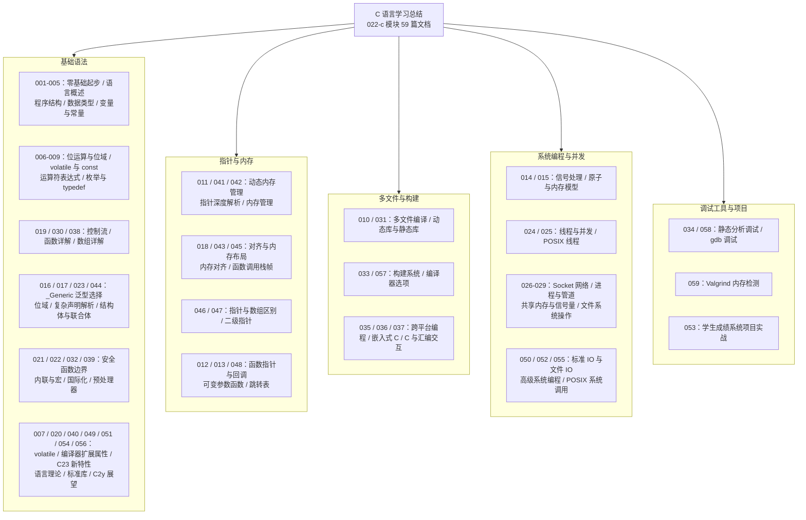

C 模块从零基础起步一路讲到 POSIX 系统调用与 Valgrind 内存检测。这篇总结把 59 篇文档收拢为一张知识地图，并用"虚拟歌手音乐平台"这一贯穿性领域重写核心示例：P 主发布歌曲、歌姬开演唱会、粉丝团统计票房——每一行 C 代码背后都是真实的内存语义。读完本文，你应该能独立回答"这段 C 代码在内存里到底发生了什么"。

## 前置知识

- [C 语言零基础起步](/c/001-CZeroBasisStart)：编译环境搭建、Hello World 逐行拆解、从源代码到可执行文件的五阶段流程。
- [程序结构与基本语法](/c/003-ProgramStructureBasicSyntax)：翻译单元、入口函数、语句与注释的最小闭环。
- [数据类型详解](/c/004-DataTypeDetailed)：基本类型、类型宽度与有符号性，是理解内存布局的地基。

## 学习目标

1. 口述 `gcc` 从预处理、编译、汇编到链接的完整流水线，并说明每个阶段的产物与典型报错。
2. 对任意结构体能算出字段偏移与 `sizeof`，解释内存对齐为什么"浪费"字节。
3. 用指针语义改写数组代码，说清 `sizeof` 在两种上下文中的差异。
4. 按配对原则写完 `malloc/realloc/free` 全流程，并用 Valgrind 验证零泄漏。
5. 用 C11 `<threads.h>` 写出有锁的并发计数，解释数据竞争为什么是未定义行为。

## 知识地图



## 核心概念回顾

### 1. 编译模型：从源代码到演唱会开场

C 是"分离编译、统一链接"的语言：每个 `.c` 文件是一个翻译单元，独立走完预处理、编译、汇编四阶段生成目标文件，最后由链接器把符号拼成可执行程序。这个模型解释了绝大多数初学者的报错：头文件找不到是预处理阶段的问题，类型不匹配是编译阶段的问题，"undefined reference" 则是链接阶段找不到符号实现。理解阶段归属，排错就不再靠猜。

```c
#include <stdio.h>   /* 1. 预处理阶段展开：printf 的声明来自标准库头文件 */

#define MIN_DURATION 30   /* 2. 对象宏在预处理期做纯文本替换 */

/* 3. 结构体把歌名与时长打包成一个逻辑整体 */
struct Song {
    char title[64];      /* 字符数组存储歌名，注意为结尾的 \0 预留空间 */
    int  duration;       /* 时长，单位秒 */
};

/* 4. main 是程序入口，返回值会成为进程退出码 */
int main(void) {
    struct Song song = {"Melt", 253};          /* 栈上聚合初始化一首歌 */
    if (song.duration < MIN_DURATION) {        /* 控制流：太短的 demo 拒绝投稿 */
        printf("%s 时长不足，暂不收录\n", song.title);
        return 1;                              /* 非 0 返回码表示失败 */
    }
    printf("歌曲 %s 已上架，时长 %d 秒\n", song.title, song.duration);
    return 0;
}
```

### 2. 类型系统与结构体布局

C 没有运行时类型信息，类型只存在于编译期，而结构体是组织数据的核心手段。编译器会在字段之间插入填充字节以满足对齐要求，于是"逻辑上相邻"的字段在物理内存中可能并不相邻。用 `offsetof` 与 `sizeof` 把布局打印出来，是理解对齐规则最直观的方式，也是阅读网络协议、文件格式等二进制结构的前提。

```c
#include <stdio.h>
#include <stddef.h>   /* 1. offsetof 宏在此定义，用于查看字段偏移 */

/* 2. 结构体描述一位歌姬的基础档案 */
struct VSinger {
    char  name[32];      /* 歌姬名 */
    short fans_rank;     /* 人气排名，2 字节 */
    int   song_count;    /* 已发布曲目数，4 字节 */
};

int main(void) {
    /* 3. short 之后的 int 需要按 4 字节对齐，中间可能有填充 */
    printf("name   偏移 %zu\n", offsetof(struct VSinger, name));
    printf("rank   偏移 %zu\n", offsetof(struct VSinger, fans_rank));
    printf("count  偏移 %zu\n", offsetof(struct VSinger, song_count));
    printf("结构体总大小 %zu 字节\n", sizeof(struct VSinger));
    return 0;
}
```

### 3. 指针与数组：一张门票的两种身份

数组是一块连续内存，指针是保存地址的变量。两者最重要的交集是"退化"规则：数组名在绝大多数表达式中退化为指向首元素的指针，于是指针算术可以像下标一样遍历数组。但退化不是等价——`sizeof` 对数组给出整块内存的大小，对指针只给出指针变量自身的大小；`&arr` 与 `arr` 数值相同、类型不同。这一组差异是模块 046 篇反复强调的重点。

```c
#include <stdio.h>

/* 1. 演唱会歌单：字符串指针数组，数组名会退化为首元素指针 */
static const char *setlist[] = {"Melt", "World is Mine", "Senbonzakura"};

/* 2. 用指针遍历代替下标遍历，语义完全等价 */
void print_setlist(const char **list, int count) {
    for (const char **p = list; p < list + count; p++) {
        printf("第 %d 首：%s\n", (int)(p - list) + 1, *p);  /* 指针差值即元素下标 */
    }
}

int main(void) {
    /* 3. sizeof 作用在数组名上，得到整个数组的字节数 */
    printf("歌单占 %zu 字节（3 个指针）\n", sizeof(setlist));
    print_setlist(setlist, 3);
    return 0;
}
```

### 4. 动态内存管理：手动配对的艺术

`malloc/calloc/realloc/free` 四个函数构成 C 的堆内存接口。手动管理的代价是四类经典错误：内存泄漏（忘 `free`）、悬空指针（`free` 后继续用）、双重释放、缓冲区越界。工程上的铁律只有一条：每一条成功路径和失败路径上的分配，都必须恰好配对一次释放；`realloc` 失败时旧内存仍然有效，所以必须用新变量接住返回值，不能直接覆盖原指针。

```c
#include <stdio.h>
#include <stdlib.h>
#include <string.h>

int main(void) {
    /* 1. malloc 在堆上申请 32 字节存放歌名，必须检查 NULL */
    char *title = malloc(32);
    if (title == NULL) {
        return 1;
    }
    strcpy(title, "Tell Your World");   /* 2. 写入内容，长度必须小于 32 含 \0 */

    /* 3. realloc 扩容：用新指针接住，失败时旧内存仍要自己释放 */
    char *grown = realloc(title, 64);
    if (grown != NULL) {
        title = grown;
        strcat(title, " (Live)");       /* 扩容后追加巡演标记 */
    }
    printf("当前曲目：%s\n", title);

    free(title);                        /* 4. 每次成功分配恰好配对一次释放 */
    title = NULL;                       /* 5. 置空指针，杜绝悬空指针被复用 */
    return 0;
}
```

### 5. 函数指针与回调：把策略当参数传递

函数指针让 C 具备了"高阶函数"的能力：排序比较器、跳转表、线程入口、信号处理器，底层都是同一个机制。`typedef` 先给函数指针类型起名，再把它作为参数传入高阶函数，调用方在运行期切换策略——这就是 C 风格的回调。理解它之后，`qsort` 的第四个参数、`thrd_create` 的第三个参数都不再神秘。

```c
#include <stdio.h>

/* 1. typedef 简化函数指针类型：输入歌曲时长，返回是否入选 */
typedef int (*SongFilter)(int duration);

/* 2. 两个具体策略：长歌版与短歌版，签名与 SongFilter 完全一致 */
int filter_long(int d)  { return d >= 240; }
int filter_short(int d) { return d <  240; }

/* 3. 高阶函数：遍历歌单，通过函数指针调用调用方选择的策略 */
void select_songs(const int *durations, int n, SongFilter filter) {
    for (int i = 0; i < n; i++) {
        if (filter(durations[i])) {     /* 运行期决定调用哪个筛选函数 */
            printf("入选：时长 %d 秒\n", durations[i]);
        }
    }
}

int main(void) {
    int durations[] = {253, 180, 305};
    select_songs(durations, 3, filter_long);   /* 4. 换一个实参即换一套规则 */
    return 0;
}
```

### 6. 多文件编译与链接

模块第 010 篇从 Unix 历史（1972 年 64KB 内存的 PDP-11）讲到 C23 的模块化草案。工程要点是：头文件放类型定义与 `extern` 函数声明，配头文件守卫防止重复包含；实现放 `.c` 文件；构建交给 Makefile 或 CMake 增量编译。链接器只认符号——声明（头文件）解决编译期"认识"，定义（目标文件）解决链接期"存在"。

```c
/* ---- song.h ---- */
#ifndef SONG_H          /* 1. 头文件守卫：防止同一翻译单元重复包含 */
#define SONG_H

struct Song {           /* 2. 类型定义放在头文件，供多个 .c 共享 */
    char title[64];
    int  duration;
};

/* 3. extern 声明：实现位于 song.c，链接期才解析这个符号 */
extern int total_duration(const struct Song *songs, int n);

#endif

/* ---- song.c ---- */
#include "song.h"

/* 4. 定义：编译 song.c 时不需要知道谁会调用它 */
int total_duration(const struct Song *songs, int n) {
    int total = 0;
    for (int i = 0; i < n; i++) {
        total += songs[i].duration;     /* 指针按数组语义访问，等价写法 */
    }
    return total;
}
/* 5. 构建命令：gcc -Wall -Wextra main.c song.c -o platform */
```

### 7. 线程与并发：共享票房的正确姿势

C11 首次把线程纳入标准库（`<threads.h>`），POSIX 世界则使用 `<pthread.h>`，语义几乎一一对应。并发正确性的核心是：两个线程并发访问同一内存且至少一个是写操作，必须通过互斥量建立同步关系，否则就是数据竞争——C 标准将其定义为未定义行为，而不是"偶尔算错"。`++` 这类复合操作在机器层面是读-改-写三步，无锁时更新会互相覆盖。

```c
#include <stdio.h>
#include <threads.h>

mtx_t lock;                     /* 1. 互斥锁保护共享的票房计数 */
long tickets_sold = 0;

/* 2. C11 线程入口的固定签名：int (*)(void *) */
int sell_ticket(void *arg) {
    (void)arg;
    for (int i = 0; i < 1000; i++) {
        mtx_lock(&lock);        /* 3. 进入临界区前加锁 */
        tickets_sold++;         /* 读-改-写三步在锁保护下才安全 */
        mtx_unlock(&lock);      /* 4. 临界区要短，用完立即解锁 */
    }
    return 0;
}

int main(void) {
    mtx_init(&lock, mtx_plain);
    thrd_t t1, t2;
    thrd_create(&t1, sell_ticket, NULL);   /* 5. 两个售票窗口并发开卖 */
    thrd_create(&t2, sell_ticket, NULL);
    thrd_join(t1, NULL);                   /* 6. join 等线程结束后再读结果 */
    thrd_join(t2, NULL);
    printf("共售出 %ld 张演唱会门票\n", tickets_sold);
    mtx_destroy(&lock);
    return 0;
}
```

### 8. 调试与内存检测：让工具替你盯内存

gdb 与 Valgrind 是 C 工程师的两件标配武器：gdb 按行单步、查看变量、分析 core 文件，回答"程序为什么会崩"；Valgrind 的 memcheck 跟踪每一次堆分配与访问，回答"内存哪里泄漏、哪里越界"。两者都要求编译时带 `-g` 保留调试信息。下面的例子故意越界写一个元素，用于演示检测工具的输出方式。

```c
#include <stdio.h>
#include <stdlib.h>

/* 1. 编译必须带 -g：gcc -g -Wall app.c -o app */
int main(void) {
    int *fans = malloc(4 * sizeof(int));    /* 2. 堆上登记 4 个粉丝团编号 */
    if (fans == NULL) {
        return 1;
    }
    for (int i = 0; i < 4; i++) {           /* 3. 严谨写法：严格小于数组长度 */
        fans[i] = i + 1;
    }
    for (int i = 0; i < 4; i++) {
        printf("粉丝团 %d 号的应援色已登记\n", fans[i]);
    }
    free(fans);   /* 4. valgrind --leak-check=full ./app 应报告 0 泄漏 */
    return 0;
}
```

### 9. C23：老语言的新装备

C23（ISO/IEC 9899:2024）是近二十年最大的一次现代化：`bool/true/false` 直接可用，`nullptr` 取代易混淆的 `NULL` 字面量，`constexpr` 支持编译期常量对象，`#embed` 把二进制资源编进程序，属性语法 `[[noreturn]]`、`[[maybe_unused]]` 也被标准化。新代码应在 `-std=c23` 下享受这些能力，老代码迁移的主要工作量在宏与隐式声明的清理。

```c
#include <stdio.h>
#include <stdbool.h>   /* 1. C23 中 bool/true/false 已是标准关键字 */

/* 2. constexpr 声明编译期常量，类型安全且可参与静态初始化 */
constexpr int MAX_TICKETS = 5000;

/* 3. 返回 bool 表达状态，语义比返回 int 清晰 */
bool is_sold_out(int remaining) {
    return remaining <= 0;
}

int main(void) {
    int remaining = MAX_TICKETS - 4999;
    printf("演唱会门票%s\n", is_sold_out(remaining) ? "已售罄" : "有票");
    return 0;
}
```

## 易混淆概念对比

### 数组 vs 指针

| 维度 | 数组 | 指针 |
| --- | --- | --- |
| 本质 | 一段连续内存的聚合类型 | 保存地址的标量变量 |
| `sizeof` | 整个数组的字节数 | 指针变量自身的大小（如 8 字节） |
| 赋值 | 数组名不可整体重新赋值 | 可以随时指向别的地址 |
| 退化行为 | 表达式中退化为首元素指针 | 始终是指针，不退化 |
| `&` 的含义 | 指向整个数组的指针（类型不同） | 指向指针变量的二级指针 |
| 参数传递 | 退化为指针，长度信息丢失 | 原样传递，常需额外长度参数 |
| 生命周期 | 随作用域（栈或静态区） | 指向的对象决定其有效性 |

### struct vs union

| 维度 | struct | union |
| --- | --- | --- |
| 存储布局 | 所有字段依次排列，字段间可能有填充 | 所有字段共享同一起始地址 |
| 大小 | 各字段大小之和（含对齐填充） | 最大成员的大小（含对齐） |
| 同时使用 | 各字段相互独立，可同时读写 | 同一时刻只有一个成员有效 |
| 典型用途 | 歌曲档案、链表节点等数据记录 | 节省内存的变体、寄存器/字节视图 |
| 初始化 | 按字段顺序初始化 | 只初始化第一个成员 |
| 改一个字段 | 不影响其他字段 | 改写会覆盖之前成员的解释 |

## 常见误区与排查

### 误区 1：返回局部变量的地址

```c
/* 错误：栈帧随函数返回而销毁，指针立即悬空 */
char *make_title(void) {
    char title[64] = "Melt";
    return title;              /* 返回后指向已失效的栈内存 */
}
```

```c
/* 修正：用静态存储、调用方缓冲或堆分配承载返回值 */
void make_title(char *out, int size) {
    snprintf(out, size, "%s", "Melt");   /* 由调用方提供并保证容量 */
}
```

### 误区 2：realloc 直接覆盖原指针

```c
/* 错误：realloc 失败返回 NULL，原内存泄漏且再也无法释放 */
char *title = malloc(32);
title = realloc(title, 64);          /* 失败时 title 变 NULL */
```

```c
/* 修正：临时变量接住返回值，失败路径仍可安全释放旧内存 */
char *grown = realloc(title, 64);
if (grown != NULL) {
    title = grown;                   /* 成功才更新指针 */
}
```

### 误区 3：对数组参数使用 sizeof 求长度

```c
/* 错误：形参是退化的指针，sizeof 得到的是指针大小 */
int song_count(const int *list) {
    return sizeof(list) / sizeof(list[0]);   /* 结果恒为 2 或 1，与长度无关 */
}
```

```c
/* 修正：数组退化为指针后长度信息丢失，必须显式传入 */
int sum_plays(const int *plays, int n) {
    int total = 0;
    for (int i = 0; i < n; i++) {
        total += plays[i];
    }
    return total;                    /* 长度 n 由调用方负责提供 */
}
```

### 误区 4：strcpy 写入超出目标容量的内容

```c
/* 错误：目标只有 16 字节，长歌名造成缓冲区溢出 */
char name[16];
strcpy(name, "Senbonzakura (Live Ver.)");   /* 越界写，破坏相邻内存 */
```

```c
/* 修正：用带界的 snprintf，由编译期或运行期保证容量 */
char name[16];
snprintf(name, sizeof(name), "%s", "Senbonzakura (Live Ver.)");
/* 超长部分被安全截断，且保证结尾的 \0 存在 */
```

### 误区 5：free 之后继续使用指针

```c
/* 错误：释放后指针悬空，读取是未定义行为，二次释放更会破坏堆 */
free(ticket);
printf("%d\n", *ticket);   /* use-after-free */
free(ticket);              /* double free */
```

```c
/* 修正：释放后立刻置空，用 NULL 检查拦截误用 */
free(ticket);
ticket = NULL;             /* 后续误用会因判空而暴露 */
```

### 误区 6：认为未初始化变量是零

```c
/* 错误：局部变量未初始化，读到的栈上垃圾值不可预测 */
int total_plays;
printf("%d\n", total_plays);   /* 值不确定 */
```

```c
/* 修正：声明即初始化，杜绝读取未定义值 */
int total_plays = 0;
```

## 自检清单

- [ ] 能说出 gcc 预处理、编译、汇编、链接四个阶段各自的产物与典型报错
- [ ] 能手算一个结构体的字段偏移与总大小，并解释对齐填充
- [ ] 能区分 `sizeof(数组)` 与 `sizeof(指针)`，并解释数组名退化规则
- [ ] 能写出 `malloc/realloc/free` 的配对流程，说明 realloc 必须用临时变量接住返回值的原因
- [ ] 能用 `typedef` 定义函数指针类型并实现一个回调式高阶函数
- [ ] 能解释头文件守卫、`extern` 声明与链接期符号解析三者如何协作
- [ ] 能用 C11 `<threads.h>` 写出互斥锁保护共享计数的程序
- [ ] 能用 `valgrind --leak-check=full` 验证程序零泄漏，并读懂泄漏报告
- [ ] 能用 gdb 设置断点、单步执行、打印指针指向的内容
- [ ] 至少说出 C23 的三个新特性（`constexpr`、`nullptr`、`#embed` 等）及其用途

## 后续学习路径

1. 重读 [多文件编译](/c/010-MultiFileCompilation)，把项目从单文件重构为头文件加实现文件加 CMake 的标准布局。
2. 精读 [动态内存管理](/c/011-DynamicMemoryManagement) 第 5 章起的内容，理解 ptmalloc/jemalloc 的分配器原理。
3. 进入 [POSIX 线程](/c/025-POSIXThread) 与 [共享内存与信号量](/c/028-SharedMemorySemaphore)，从线程走向进程间协作。
4. 用 [Socket 网络编程](/c/026-SocketNetworkProgramming) 给音乐平台写一个最小的歌曲查询服务。
5. 通过 [C 项目示例：学生成绩系统](/c/053-CProjectExampleStudentGradeSystem) 完整演练一次模块化开发，再用 [Valgrind](/c/059-CValgrind) 做发布前的内存体检。
