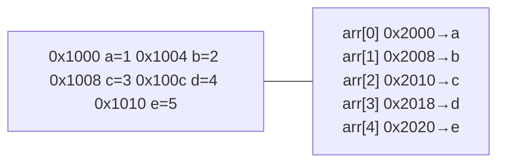

# 二级指针与指针数组

## 知识点地图

- **知识类别**：指针体系深水篇——多级间接寻址（pointer to pointer）的形式化定义、内存模型与工程模式。
- **解决什么问题**：一级指针解决「改变量的值」，二级指针解决「改指针变量本身」——函数内为调用方分配内存、修改链表头、安全释放并置空，全靠多一层间接。本篇把 `T **` 的类型派生、内存布局、`const char **` 的兼容性边界讲透，并给出工程上反复出现的四个模式。
- **什么时候用到**：
  - 输出参数：函数要在内部 malloc 并把结果交给调用方（`sqlite3_open(char *path, sqlite3 **ppdb)`）；
  - 修改头指针/挂载点：链表插删免特判（详解在 [C 链表与节点式数据结构](/c/165-CLinkedListImplementation)）；
  - 指针数组与字符串矩阵：`char **argv`、动态 `char **` 表；
  - 阅读 Linux 内核、SQLite、Redis 等大型 C 项目的代码。
- **与相邻篇目的分工**：指针与数组的边界（退化、`int *p[10]` 对 `int (*p)[10]`）在 [指针与数组的区别](/c/150-PointerArrayDifference)；链表/树的节点式实现完整走查在 [C 链表与节点式数据结构](/c/165-CLinkedListImplementation)；字符串与 `string.h` 在 [C 字符串处理](/c/125-CStringsHandling)；复杂声明（`int (*(*f)(void))[10]`）的通用读法在 [复杂声明解析](/c/190-ComplexDeclarationParsing)；函数指针与跳转表在 [函数指针与回调](/c/170-FunctionPointerCallback) 与 [函数指针数组与跳转表](/c/180-FunctionPointerCallbackJumpTable)。本篇只讲二级指针本体。

## 学习目标

- 掌握「1. 历史动机与演进」的核心机制、典型用法与常见陷阱
- 掌握「2. 形式化定义与内存模型」的核心机制、典型用法与常见陷阱
- 掌握「3. 二级指针的工程模式」「4. 深入内存安全」的核心机制、典型用法与常见陷阱
- 掌握「5. 工程案例研究」「6. 常见陷阱与反模式」的核心机制、典型用法与常见陷阱
- 掌握「7. 调试技巧」「8. 性能考量」的核心机制、典型用法与常见陷阱

## 前置知识

- [指针与数组的区别](/c/150-PointerArrayDifference)：建议先完成前一篇的学习

## 1. 历史动机与演进

### 1.1 K&R 时代的多级间接寻址（1978-1988）

Brian Kernighan 与 Dennis Ritchie 在《The C Programming Language》第一版（1978）中尚未正式使用"pointer to pointer"这一术语，但通过 `char **argv` 处理命令行参数的设计已经体现了多级间接寻址的核心思想。在第二版（1988）第 5.6 节"Pointer Arrays; Pointers to Pointers"中，作者正式引入了二级指针概念，并以排序月份名称为例：

```c
/* K&R 第二版第 5.6 节示例 */
char *month[] = {
    "illegal month",
    "January", "February", "March",
    "April", "May", "June",
    "July", "August", "September",
    "October", "November", "December"
};
```

这里 `month` 是"指针数组"（array of pointers），每个元素是一个 `char *`，指向字符串字面量。这种设计避免了用二维字符数组 `char month[13][10]` 浪费空间的问题——不同月份名长度不同，二维数组必须按最长名称分配。

### 1.2 C89 标准化（1989）

ANSI X3.159-1989（C89）在 §6.5.4.1 派生类型（derived types）中正式定义了多级指针的语义：

> A pointer type may be derived from a function type, an object type, or an incomplete type, called the referenced type. A pointer type describes an object whose value provides a reference to an entity of the referenced type. ... A pointer to pointer can be derived by repeatedly applying the pointer derivation rule.

C89 同时定义了类型限定符（const、volatile）的组合规则，为后续 `const char *const *argv` 这类复杂声明的语义奠定了基础。

### 1.3 C99 与指针算术的精确化（1999）

C99 在 §6.5.6 指针算术中明确：指针加减整数运算的步长为 `sizeof(referenced type)`。对于 `int **pp`：

```c
int x = 10;
int *p = &x;
int **pp = &p;

pp + 1;   /* 步长为 sizeof(int *)，即指针大小 */
```

C99 同时引入变长数组（VLA），使 `int (*arr)[n]` 中的 n 可以是运行时值，扩展了数组指针的应用场景。

### 1.4 C11/C17 的稳定化（2011-2018）

C11 引入 `_Generic`、`_Alignas`、`_Thread_local` 等特性，与指针类型组合产生新的应用模式（如泛型选择器与指针类型分支）。C17 为缺陷修复版本，未引入新特性。

### 1.5 C23/C2y 的现代化（2024+）

C23（ISO/IEC 9899:2024）引入以下与指针相关的改进：

- `nullptr` 关键字：替代 `NULL` 宏，提供类型安全的空指针常量
- `auto` 类型推断：`auto pp = &p;` 自动推导为 `int **`
- `[[nodiscard]]`、`[[maybe_unused]]`、`[[deprecated]]` 标准属性
- `#embed` 指令：嵌入二进制资源，配合 `unsigned char *` 处理

C2y 草案讨论中的模块化（modules）特性可能改变头文件中指针类型的可见性模型，但二级指针的核心语义预计保持稳定。

### 1.6 Linux 内核与"二级指针游走"技巧

Linus Torvalds 在 2016 年的一次访谈中提到，他判断一个人是否真正理解指针，关键看其能否用"二级指针游走"（pointer-to-pointer traversal）技巧简化链表删除：

```c
/* 传统写法：需要特判头节点 */
void list_remove_traditional(Node **head, int val) {
    Node *cur = *head, *prev = NULL;
    while (cur && cur->val != val) {
        prev = cur;
        cur = cur->next;
    }
    if (!cur) return;
    if (prev) prev->next = cur->next;
    else      *head = cur->next;
    free(cur);
}

/* 二级指针游走写法：无需特判头节点 */
void list_remove_elegant(Node **head, int val) {
    Node **indirect = head;
    while (*indirect && (*indirect)->val != val)
        indirect = &(*indirect)->next;
    if (*indirect) {
        Node *to_delete = *indirect;
        *indirect = to_delete->next;
        free(to_delete);
    }
}
```

第二种写法用 `Node **indirect` 始终指向"指向当前节点的指针"，无论是 `*head` 还是某个 `prev->next`，统一处理。这一技巧在 Linux 内核 `include/linux/list.h`、SQLite、Redis 等大型项目中被广泛采用。（示例中 `Node` 类型的定义与逐行讲解见 [C 链表与节点式数据结构](/c/165-CLinkedListImplementation)，本篇先记住「多一层间接消灭特判」的直觉。）

## 2. 形式化定义与内存模型

### 2.1 指针类型的派生规则

ISO/IEC 9899:2024 §6.7.6.1 定义了指针类型的派生规则。给定任意类型 T，可以派生出 `T *`（指向 T 的指针）。这一规则可以递归应用：

```
T            : 基础类型（如 int）
T *          : 指向 T 的指针（如 int *）
T **         : 指向 T * 的指针（如 int **）
T ***        : 指向 T ** 的指针（如 int ***）
...          : 理论上无限递归
```

每个 `*` 增加一级间接寻址（indirection level）。实践中超过三级（`T ***`）的指针极为罕见，可读性急剧下降，通常应通过 typedef 简化：

```c
/* 反例：四级指针难以维护 */
void ****table;   /* 几乎肯定是一个糟糕的设计 */

/* 正例：用 typedef 消除可读性陷阱 */
typedef char **StringList;       /* 字符串列表 */
typedef StringList *StringListPtr;  /* 字符串列表的指针 */
StringListPtr ptr;               /* 等价于 char *** */
```

### 2.2 二级指针的声明与初始化

#### 2.2.1 声明语法

```c
int **pp;        /* pp 是指向 int * 的指针 */
char **argv;     /* argv 是指向 char * 的指针（典型命令行参数） */
double **matrix; /* matrix 是指向 double * 的指针（动态二维数组） */
```

注意：每个 `*` 都是独立的声明修饰符。在单条语句中声明多个指针时，每个指针变量前都必须有 `*`：

```c
int *p1, *p2;       /* p1 和 p2 都是 int * */
int *p3, p4;        /* p3 是 int *，p4 是 int！常见陷阱 */
int **pp1, **pp2;   /* pp1 和 pp2 都是 int ** */
```

#### 2.2.2 初始化

```c
int x = 42;
int *p = &x;          /* 一级指针：指向 int */
int **pp = &p;        /* 二级指针：指向 int * */
int ***ppp = &pp;     /* 三级指针：指向 int ** */

/* 解引用层级 */
**pp;                 /* 等价于 *p，即 x，值为 42 */
***ppp;               /* 等价于 **pp，即 x，值为 42 */
```

#### 2.2.3 类型推导图



### 2.3 内存布局图示

理解二级指针的关键是绘制内存布局图。以如下代码为例：

```c
int x = 42;
int *p = &x;
int **pp = &p;
```

假设 64 位系统，`int` 占 4 字节，指针占 8 字节，内存布局如下：

```
地址          内容           变量
────────────────────────────────────
0x7fff0000    42             x       (int, 4 bytes)
0x7fff0010    0x7fff0000     p       (int *, 8 bytes)  指向 x
0x7fff0020    0x7fff0010     pp      (int **, 8 bytes) 指向 p
```

操作语义：

| 表达式 | 类型 | 值 | 含义 |
|--------|------|-----|------|
| `x` | `int` | 42 | 直接访问变量 x |
| `&x` | `int *` | 0x7fff0000 | x 的地址 |
| `p` | `int *` | 0x7fff0000 | p 存储的地址 |
| `*p` | `int` | 42 | 解引用 p，得到 x 的值 |
| `&p` | `int **` | 0x7fff0010 | p 的地址 |
| `pp` | `int **` | 0x7fff0010 | pp 存储的地址 |
| `*pp` | `int *` | 0x7fff0000 | 解引用 pp，得到 p 的值（即 &x） |
| `**pp` | `int` | 42 | 双重解引用，得到 x 的值 |
| `&pp` | `int ***` | 0x7fff0020 | pp 的地址 |

### 2.4 三次解引用的形式化

对于 `T **pp`，解引用操作的形式化语义：

```
*pp  : T *     （第一次解引用，得到 T * 类型的值）
**pp : T       （第二次解引用，得到 T 类型的值）
```

每次解引用等价于读取指针变量所指向地址处的值。从汇编层面看：

```asm
; 假设 pp 存储在寄存器 rax 中
mov rax, [pp]      ; rax = *pp  = &p
mov eax, [rax]     ; eax = **pp = x  (假设 int 为 32 位)
```

### 2.5 sizeof 与指针层级

不同层级的指针在 64 位系统上占用相同字节数（通常为 8），但指向的类型不同：

```c
printf("%zu\n", sizeof(int));     /* 4 */
printf("%zu\n", sizeof(int *));   /* 8 (64-bit) */
printf("%zu\n", sizeof(int **));  /* 8 (64-bit) */
printf("%zu\n", sizeof(int ***)); /* 8 (64-bit) */
```

所有指针类型在 64 位平台上通常都是 8 字节，但**类型不同导致运算语义不同**：

```c
int x = 10;
int *p = &x;
int **pp = &p;

p + 1;    /* 步长 sizeof(int) = 4 字节，指向下一个 int */
pp + 1;   /* 步长 sizeof(int *) = 8 字节，指向下一个 int * */
```

## 3. 二级指针的工程模式

### 3.1 模式一：输出参数（Output Parameter）

最常见的二级指针用途——在函数内为调用者的指针分配内存：

```c
#include <stdio.h>
#include <stdlib.h>

/* 在函数内分配 n 个 int 的数组，通过输出参数返回 */
int array_alloc(int **out, size_t n) {
    if (!out) return -1;             /* 参数校验 */
    int *arr = malloc(n * sizeof(int));
    if (!arr) return -1;             /* 分配失败 */
    for (size_t i = 0; i < n; i++) arr[i] = (int)i;
    *out = arr;                       /* 写入调用者的指针 */
    return 0;
}

int main(void) {
    int *arr = NULL;
    if (array_alloc(&arr, 10) == 0) {
        for (size_t i = 0; i < 10; i++) {
            printf("%d ", arr[i]);
        }
        printf("\n");
        free(arr);
    }
    return 0;
}
```

#### 3.1.1 替代方案对比

| 方案 | 优点 | 缺点 |
|------|------|------|
| 二级指针输出参数 | C 风格统一，错误码与返回值分离 | 调用需 `&`，可读性略差 |
| 直接返回指针 | 调用简洁 | 失败返回 NULL，无法区分错误类型 |
| 返回结构体（含指针+状态） | 表达力强 | C 风格不一致 |
| 句柄 opaque 设计 | 封装性好，扩展性强 | 实现复杂 |

### 3.2 模式二：二级指针游走（Linus 风格）

Linus Torvalds 推崇的链表删除技巧，消除头节点特判（第 1.6 节已给出与传统写法的对比）：

```c
/* 删除链表中第一个值为 val 的节点 */
void list_remove(Node **head, int val) {
    Node **indirect = head;
    while (*indirect && (*indirect)->val != val) {
        indirect = &(*indirect)->next;
    }
    if (*indirect) {
        Node *to_delete = *indirect;
        *indirect = to_delete->next;   /* 统一处理头节点和中间节点 */
        free(to_delete);
    }
}
```

#### 3.2.1 原理分析

`indirect` 始终指向"指向当前节点的指针"：
- 初始时 `indirect = head`，即指向头指针本身
- 若 `*indirect` 是头节点，则 `*indirect = (*indirect)->next` 修改的是 `head`
- 若 `*indirect` 是中间节点，则 `*indirect = (*indirect)->next` 修改的是前驱节点的 `next`

无论删除头节点还是中间节点，代码路径完全相同，无需特判。

#### 3.2.2 对比传统写法

```c
/* 传统写法：需要特判头节点 */
void list_remove_traditional(Node **head, int val) {
    Node *cur = *head, *prev = NULL;
    while (cur && cur->val != val) {
        prev = cur;
        cur = cur->next;
    }
    if (!cur) return;               /* 未找到 */
    if (prev) prev->next = cur->next;
    else      *head = cur->next;    /* 特判：删除头节点 */
    free(cur);
}
```

传统写法有 4 个分支：未找到 / 删除头节点 / 删除中间节点 / 删除尾节点。二级指针游走写法只有 2 个分支：未找到 / 找到并删除。代码更简洁，bug 更少。该技巧在链表上的完整走查（含头插尾插、反转与内存图）集中在 [C 链表与节点式数据结构](/c/165-CLinkedListImplementation)。

### 3.3 模式三：动态字符串矩阵

实现一个二维字符串矩阵，每行长度可独立变化：

```c
#include <stdio.h>
#include <stdlib.h>
#include <string.h>

char **strmat_alloc(int rows) {
    char **mat = calloc(rows, sizeof(char *));   /* 初始化为 NULL */
    return mat;
}

int strmat_set(char **mat, int row, const char *str) {
    if (!mat || !str) return -1;
    char *copy = strdup(str);                    /* C23 标准，POSIX 早已支持 */
    if (!copy) return -1;
    free(mat[row]);                              /* 释放旧值 */
    mat[row] = copy;
    return 0;
}

const char *strmat_get(char **mat, int row) {
    return mat ? mat[row] : NULL;
}

void strmat_free(char **mat, int rows) {
    if (!mat) return;
    for (int i = 0; i < rows; i++) free(mat[i]);
    free(mat);
}

int main(void) {
    char **mat = strmat_alloc(3);
    strmat_set(mat, 0, "Hello");
    strmat_set(mat, 1, "World");
    strmat_set(mat, 2, "C Programming");

    for (int i = 0; i < 3; i++) {
        printf("[%d] %s\n", i, strmat_get(mat, i));
    }

    strmat_free(mat, 3);
    return 0;
}
```

`strdup` 与 `strmat` 里用到的字符串函数，逐个带例子的详解在 [C 字符串处理](/c/125-CStringsHandling)。

### 3.4 模式四：错误处理与资源清理

二级指针在资源清理代码中可以让"释放并置空"一次完成：

```c
void safe_free(void **pp) {
    if (pp && *pp) {
        free(*pp);
        *pp = NULL;
    }
}

int main(void) {
    int *arr = malloc(10 * sizeof(int));
    /* ... 使用 arr ... */
    safe_free((void **)&arr);   /* 释放并置 NULL */
    return 0;
}
```

注意：将 `int **` 强转为 `void **` 在技术上违反严格别名（strict aliasing）规则，更安全的写法是使用宏：

```c
#define SAFE_FREE(ptr) do { free(ptr); (ptr) = NULL; } while (0)

int main(void) {
    int *arr = malloc(10 * sizeof(int));
    /* ... */
    SAFE_FREE(arr);   /* 类型安全 */
    return 0;
}
```

## 4. 深入内存安全

### 4.1 未定义行为陷阱

#### 4.1.1 解引用未初始化的二级指针

```c
int **pp;          /* 未初始化，值不确定 */
*pp = NULL;        /* 未定义行为：写入随机地址 */
```

修复：始终初始化为 NULL 或有效地址。

#### 4.1.2 返回局部变量的地址

```c
int **bad_func(void) {
    int x = 42;
    int *p = &x;
    int **pp = &p;
    return pp;        /* 未定义行为：返回局部变量地址 */
}
```

函数返回后栈帧销毁，pp 与 p 都成为悬垂指针。

#### 4.1.3 类型不匹配

```c
int x = 42;
int *p = &x;
char **cp = (char **)&p;   /* 严格别名违规 */
**cp;                       /* 未定义行为 */
```

不同类型的指针不能通过强转相互访问（除非通过 `char *`）。

### 4.2 严格别名规则

ISO/IEC 9899:2024 §6.5p7 规定，对象只能通过以下类型的左值访问：

1. 与对象兼容的类型
2. 与对象兼容类型的限定版本（const/volatile）
3. 与对象兼容类型的有符号/无符号版本
4. 上述类型的聚合类型（struct/array）
5. `char *`、`signed char *`、`unsigned char *`（字符类型，可访问任何对象）

违反严格别名规则是未定义行为，编译器优化可能导致意外结果。

### 4.3 const 与二级指针

`const` 修饰符的位置决定不可变性层级：

```c
int x = 42;
const int *p1 = &x;          /* 不能通过 p1 修改 *p1 */
int *const p2 = &x;          /* p2 本身不可修改 */
const int *const p3 = &x;    /* 两者都不可修改 */

const int cx = 100;
const int *const *const pp = &p1;   /* 三重 const：pp、*pp、**pp 都不可修改 */
```

`const char **` 与 `char **` 不兼容（C 标准 §6.5.16.1）：

```c
char *arr[] = {"a", "b"};
const char **cpp = arr;   /* 约束违规：类型不兼容，编译器必须给出诊断 */
                          /* GCC 14 起默认按错误处理；加 cast 只是压制警告，访问时仍可能出问题 */
```

原因：如果允许把 `char **` 隐式当作 `const char **`，就能先往中间插入一层"指向 const 的指针"，再经由非 const 的原始指针改写 const 数据，绕过 const 保护。这是 C 类型系统有意禁止的经典漏洞场景。

### 4.4 内存泄漏检测

二级指针链式分配的内存泄漏是常见问题。推荐使用 AddressSanitizer 或 Valgrind 检测：

```bash
# GCC/Clang 编译时加入 ASan
gcc -fsanitize=address -g -O0 source.c -o program
./program

# Valgrind 检测
valgrind --leak-check=full --show-leak-kinds=all ./program
```

工具链的完整梯度（警告 → 静态分析 → Sanitizer → CI 门禁）在 [静态分析与 Sanitizers](/c/485-StaticAnalysisAndSanitizers)；Valgrind 的专项用法在 [Valgrind 内存调试](/c/510-CValgrind)。

### 4.5 防御性编程清单

1. **初始化**：所有指针声明时立即初始化为 NULL 或有效地址
2. **校验**：函数入口校验指针参数是否为 NULL
3. **置空**：free 后立即置 NULL
4. **封装**：复杂操作封装为函数，避免裸指针操作
5. **RAII 风格**：在 C 中用 `goto cleanup` 模拟 RAII
6. **静态分析**：开启 `-Wall -Wextra -Werror` 与 clang-tidy
7. **动态检测**：开发期使用 ASan/UBSan/Valgrind

## 5. 工程案例研究

### 5.1 案例一：Unix `main` 函数签名

`int main(int argc, char **argv)` 是指针数组的经典应用。POSIX 标准规定 `argv` 是指针数组，每个元素指向以 null 结尾的字符串，最后一个元素为 NULL。

```c
#include <stdio.h>

int main(int argc, char **argv) {
    printf("argc = %d\n", argc);
    for (int i = 0; i < argc; i++) {
        printf("argv[%d] = %p -> \"%s\"\n", i, (void *)argv[i], argv[i]);
    }
    printf("argv[argc] = %p (should be NULL)\n", (void *)argv[argc]);
    return 0;
}
```

执行 `./prog arg1 arg2` 输出：

```
argc = 3
argv[0] = 0x7ffe1234 -> "./prog"
argv[1] = 0x7ffe1250 -> "arg1"
argv[2] = 0x7ffe1260 -> "arg2"
argv[3] = (nil) (should be NULL)
```

把 `argv` 按分隔符重新分词、自己构造一个 `argv` 数组交给子进程使用的完整案例，见 [C 字符串处理](/c/125-CStringsHandling) 的 strtok 与 argv 分词一节。

### 5.2 案例二：SQLite 的句柄设计

SQLite 使用 opaque 句柄模式，隐藏实现细节：

```c
/* sqlite3.h */
typedef struct sqlite3 sqlite3;

int sqlite3_open(const char *filename, sqlite3 **ppdb);
int sqlite3_close(sqlite3 *db);

/* 用户代码 */
sqlite3 *db = NULL;
if (sqlite3_open("test.db", &db) == SQLITE_OK) {
    /* 使用 db */
    sqlite3_close(db);
    db = NULL;
}
```

`sqlite3_open` 通过二级指针 `sqlite3 **ppdb` 返回新分配的句柄。这种模式：
- 隐藏 `sqlite3` 结构体细节（不透明类型）
- 返回值用于错误码
- 资源管理清晰（配对 `open`/`close`）

### 5.3 案例三：Redis 的字符串矩阵

Redis 在处理命令行参数与配置文件时大量使用 `char **` 指针数组：

```c
/* sds.h（简化） */
typedef char *sds;

sds *sdssplitlen(const char *s, ssize_t len, const char *sep, int seplen, int *count);
void sdsfreesplitres(sds *tokens, int count);
```

`sdssplitlen` 返回 `sds *`（即 `char **`），是动态分配的指针数组，每个元素指向一个 sds 字符串。调用者负责通过 `sdsfreesplitres` 释放。

## 6. 常见陷阱与反模式

### 6.1 陷阱一：参数按值传递

```c
void allocate_wrong(int *p) {
    p = malloc(sizeof(int));   /* 只修改副本 */
}

void allocate_right(int **pp) {
    *pp = malloc(sizeof(int));
}
```

**规则**：要修改类型 T 的变量，参数类型必须是 `T *`。要修改 `int *` 变量，参数必须是 `int **`。

### 6.2 陷阱二：混淆 `int **` 与 `int (*)[N]`

```c
int grid[3][4];

/* 错误：int ** 与 int (*)[4] 类型不兼容 */
void process_wrong(int **grid) { /* ... */ }
process_wrong(grid);   /* 未定义行为 */

/* 正确 */
void process_right(int (*grid)[4]) { /* ... */ }
process_right(grid);
```

两者的内存布局与寻址差异在 [指针与数组的区别](/c/150-PointerArrayDifference) 有逐行事故复盘。

### 6.3 陷阱三：返回局部变量地址

```c
int **bad_func(void) {
    int x = 42;
    int *p = &x;
    int **pp = &p;
    return pp;   /* 悬垂指针 */
}
```

修复：使用 `static`、动态分配或通过输出参数。

### 6.4 陷阱四：忘记释放中间层

```c
int **matrix = malloc(rows * sizeof(int *));
for (int i = 0; i < rows; i++) {
    matrix[i] = malloc(cols * sizeof(int));
}

/* 错误：只释放了第一层 */
free(matrix);   /* 内存泄漏：rows 个内层指针未释放 */

/* 正确：从内到外释放 */
for (int i = 0; i < rows; i++) free(matrix[i]);
free(matrix);
```

### 6.5 陷阱五：`int *p1, p2` 的声明陷阱

```c
int *p1, p2;   /* p1 是 int*，p2 是 int！ */
```

建议：一行只声明一个变量，或使用 typedef：

```c
int *p1;
int *p2;

/* 或 */
typedef int *IntPtr;
IntPtr p1, p2;   /* 两者都是 int* */
```

### 6.6 陷阱六：const 修饰符位置

```c
const int *p;       /* 指向 const int 的指针 */
int const *p;       /* 同上 */
int *const p;       /* const 指针，指向 int */
const int *const p; /* const 指针，指向 const int */

const char **cpp;   /* 指向 const char* 的指针 */
char **const cpp;   /* const 指针，指向 char* */
```

### 6.7 陷阱七：数组退化为指针丢失大小

```c
void func(int arr[10]) {
    sizeof(arr);   /* 不是 40，而是 sizeof(int *) = 8 */
}

/* 必须显式传长度 */
void func(int *arr, size_t n) { /* ... */ }
```

### 6.8 陷阱八：`sizeof(指针数组)` 的计算

```c
int *arr[5];
sizeof(arr);          /* 40（5 * 8） */
sizeof(arr[0]);       /* 8 */
sizeof(arr) / sizeof(arr[0]);   /* 5，正确 */

int **p = arr;
sizeof(p);            /* 8，不是 40！ */
sizeof(p) / sizeof(p[0]);   /* 1，错误！ */
```

数组退化为指针后 `sizeof` 失效。

### 6.9 陷阱九：空指针解引用

```c
int **pp = NULL;
*pp;       /* 未定义行为：解引用 NULL */
```

修复：使用前校验：

```c
if (pp && *pp) {
    **pp;
}
```

### 6.10 陷阱十：类型转换绕过 const

```c
const int x = 42;
const int *cp = &x;
int *p = (int *)cp;   /* 危险：绕过 const */
*p = 100;             /* 未定义行为：修改 const 对象 */
```

## 7. 调试技巧

### 7.1 GDB 调试二级指针

```bash
gdb ./program
(gdb) break main
(gdb) run
(gdb) print pp              # 打印 pp 的值（地址）
(gdb) print *pp             # 打印 *pp 的值（下一层地址）
(gdb) print **pp            # 打印 **pp 的值（最终值）
(gdb) print &pp             # 打印 pp 本身的地址
(gdb) x/gx pp               # 以 8 字节十六进制查看 pp 指向的内存
(gdb) x/gx *pp              # 查看 *pp 指向的内存
```

### 7.2 LLDB 调试

```bash
lldb ./program
(lldb) breakpoint set --name main
(lldb) run
(lldb) frame variable pp
(lldb) frame variable *pp
(lldb) frame variable **pp
(lldb) memory read --size 8 --count 1 --format x pp
```

### 7.3 打印指针树

```c
void debug_pp_int(int **pp, const char *name) {
    fprintf(stderr, "%s = %p\n", name, (void *)pp);
    if (pp) {
        fprintf(stderr, "*%s = %p\n", name, (void *)*pp);
        if (*pp) {
            fprintf(stderr, "**%s = %d\n", name, **pp);
        }
    }
}

int main(void) {
    int x = 42;
    int *p = &x;
    int **pp = &p;
    debug_pp_int(pp, "pp");
    return 0;
}
```

### 7.4 内存可视化工具

- **GDB `x` 命令**：`x/Nfx addr` 查看 N 个 fmt 格式的内存
- **Valgrind `--tool=memcheck`**：检测内存泄漏与越界
- **AddressSanitizer**：`-fsanitize=address`，运行时检测
- **Visual Studio 内存视图**：调试 > 窗口 > 内存
- **rr (Record and Replay)**：可逆向调试的 GDB 增强工具

GDB 的完整工作流（断点、监视点、core dump 回放）在 [GDB 动态调试](/c/495-DynamicDebuggingGDB) 展开。

## 8. 性能考量

### 8.1 缓存友好性

二级指针访问涉及多次内存解引用，缓存命中率较差：

```c
int **matrix_pp;       /* 指针数组方式：每行独立分配 */
/* 访问 matrix_pp[i][j] 需要：
   1. 读取 matrix_pp[i]（可能 cache miss）
   2. 读取 *(matrix_pp[i] + j)（可能再次 cache miss） */

int *matrix_flat;      /* 一维数组方式：连续分配 */
/* 访问 matrix_flat[i * cols + j] 只需一次内存读取 */
```

对性能敏感的场景（如矩阵运算、图像处理），优先使用连续内存布局。两种动态二维数组实现的完整代码与对比表在 [指针与数组的区别](/c/150-PointerArrayDifference)。

### 8.2 分支预测

二级指针游走的 `while` 循环通常有良好的分支预测（90%+ 命中率），但深度遍历时缓存可能成为瓶颈。

### 8.3 编译器优化

`-O2`/`-O3` 优化下，编译器会：
- 内联简单的指针解引用
- 常量折叠已知的指针值
- 死代码消除
- 循环不变量外提

但跨函数调用的二级指针操作通常难以优化（可能存在别名）。

### 8.4 优化建议

1. **热路径**：避免在性能关键循环中使用二级指针
2. **批量处理**：先收集到一维数组，再批量处理
3. **限制间接层级**：超过二级的指针考虑用结构体封装
4. **const 提示**：使用 `const` 帮助编译器优化
5. **restrict 关键字**：声明无别名，允许激进优化

```c
void add_arrays(const int *restrict a, const int *restrict b, int *restrict c, size_t n) {
    for (size_t i = 0; i < n; i++) c[i] = a[i] + b[i];
}
```

## 9. 最佳实践总结

### 9.1 命名规范

- 二级指针变量建议以 `pp` 前缀：`pp_head`、`pp_matrix`
- 输出参数建议以 `out_` 前缀：`out_arr`、`out_count`
- 链表头指针变量建议命名为 `head`，函数参数为 `Node **head`

### 9.2 函数设计

- **单一职责**：一个函数只做一件事
- **错误返回**：返回 int 错误码，资源通过输出参数返回
- **参数顺序**：输出参数放在最后
- **参数校验**：入口校验所有指针参数是否为 NULL
- **资源配对**：每个 alloc 函数必须有对应的 free 函数

### 9.3 内存管理

- **谁分配谁释放**：分配和释放在同一层级
- **立即置空**：free 后立即置 NULL
- **错误回滚**：分配失败时回滚已分配资源
- **使用 ASan**：开发期开启 AddressSanitizer
- **避免悬垂**：返回动态分配的指针时文档明确所有权

### 9.4 类型安全

- **避免强转**：除非必要，不要强转指针类型
- **const 修饰**：不修改的参数加 const
- **typedef 简化**：复杂类型用 typedef 提高可读性
- **避免三重以上**：超过 `T ***` 的指针考虑重构

### 9.5 文档与注释

- **函数注释**：说明参数语义、返回值、副作用
- **所有权标注**：注明谁负责释放返回的指针
- **复杂逻辑**：二级指针游走等技巧需配图注释
- **示例代码**：提供典型用例

## 10. 附录

### 10.1 附录 A：C 标准相关条款索引

- **§6.2.5 Types**：派生类型定义
- **§6.3.2.1 Lvalues, arrays, and function designators**：数组衰减规则
- **§6.5.6 Additive operators**：指针算术
- **§6.7.6.1 Pointer declarators**：指针声明语法
- **§6.7.6.2 Array declarators**：数组声明语法
- **§6.7.6.3 Function declarators**：函数声明语法
- **§5.1.2.2.1 Program startup**：main 函数签名与 argv 语义
- **§6.5.16.1 Simple assignment**：const 与指针赋值约束

### 10.2 附录 B：常见函数指针 typedef

```c
/* 比较函数（qsort 用） */
typedef int (*CompareFn)(const void *, const void *);

/* 释放函数 */
typedef void (*DestroyFn)(void *);

/* 遍历回调 */
typedef void (*VisitFn)(void *data, void *ctx);

/* 哈希函数 */
typedef unsigned long (*HashFn)(const void *key);

/* 谓词函数 */
typedef int (*PredicateFn)(const void *data);
```

（typedef 三步法与回调语法在 [函数指针与回调](/c/170-FunctionPointerCallback) 展开。）

### 10.3 附录 C：复杂声明解析速查

| 声明 | 含义 |
|------|------|
| `int *p` | p 是指向 int 的指针 |
| `int **pp` | pp 是指向 int* 的指针 |
| `int *arr[N]` | arr 是 N 个 int* 的数组 |
| `int (*ptr)[N]` | ptr 是指向 int[N] 的指针 |
| `int *f()` | f 是返回 int* 的函数 |
| `int (*f)()` | f 是指向返回 int 的函数的指针 |
| `int (*arr[N])()` | arr 是 N 个"指向返回 int 的函数的指针"的数组 |
| `int *(*f)()` | f 是指向返回 int* 的函数的指针 |
| `void (*signal(int, void (*)(int)))(int)` | signal 是函数，接收 int 和函数指针，返回函数指针 |

### 10.4 附录 D：编译器警告推荐

```bash
# GCC/Clang 推荐警告选项
gcc -Wall -Wextra -Wpedantic -Wconversion -Wshadow \
    -Wpointer-arith -Wstrict-prototypes -Wmissing-prototypes \
    -Wformat=2 -Wundef -Wcast-align -Wwrite-strings \
    -Wno-unused-parameter \
    -std=c23 -O2 -g3 \
    source.c -o program

# clang 静态分析
clang --analyze -Xanalyzer -analyzer-output=html source.c

# clang-tidy
clang-tidy -checks='*' source.c -- -std=c23
```

### 10.5 附录 E：推荐阅读

1. **Kernighan & Ritchie, The C Programming Language, 2nd Edition**：第 5.6 节"Pointer Arrays; Pointers to Pointers"
2. **Peter van der Linden, Expert C Programming: Deep C Secrets**：第 3、4 章
3. **Robert Seacord, Effective C**：第 5、6 章
4. **Steve Summit, C Programming FAQs**：指针与数组相关章节
5. **Andrew Koening, C Traps and Pitfalls**：指针陷阱专题
6. **Linux 内核源码 `include/linux/list.h`**：侵入式链表最佳实践
7. **SQLite 源码 `src/sqlite.h.in`**：opaque 句柄设计
8. **Redis 源码 `src/sds.c`**：动态字符串与指针数组

## 11. 参考与延伸阅读

### 11.1 标准文档

- ISO/IEC 9899:2024（C23 标准）
- ISO/IEC 9899:2018（C17 标准）
- ANSI X3.159-1989（C89 标准，原始文档）
- POSIX.1-2017（IEEE Std 1003.1）

### 11.2 经典书籍

- Kernighan, B. W., & Ritchie, D. M. (1988). *The C Programming Language* (2nd ed.). Prentice Hall.
- van der Linden, P. (1994). *Expert C Programming: Deep C Secrets*. SunSoft Press.
- Prinz, P., & Crawford, T. (2020). *C in a Nutshell* (2nd ed.). O'Reilly Media.
- Seacord, R. C. (2020). *Effective C: An Introduction to Professional C Programming*. No Starch Press.
- Koening, A. (1989). *C Traps and Pitfalls*. Addison-Wesley.
- Summit, S. (1995). *C Programming FAQs: Frequently Asked Questions*. Addison-Wesley.

### 11.3 相关论文

- Hanson, D. R. (1996). *C Interfaces and Implementations: Techniques for Creating Reusable Software*. Addison-Wesley.
- Jones, N. D., & Muchnick, S. S. (1981). *Flow analysis and optimization of Lisp-like structures*. In *Program Flow Analysis: Theory and Applications*.
- Torvalds, L. (2016). *Interview on Linux kernel linked-list implementation*. Linux Foundation.

### 11.4 后续学习方向

完成本文档学习后，建议继续学习：

1. **链表与节点式数据结构**：[C 链表与节点式数据结构](/c/165-CLinkedListImplementation) 把本文的游走技巧落到完整实现
2. **函数指针与回调机制**：深入理解 `qsort`、`signal` 等标准库的设计
3. **动态内存管理**：`malloc`/`free` 实现原理、内存分配器设计
4. **内存对齐与布局**：`struct` 内存布局、`#pragma pack`、位域
5. **编译器扩展**：`__attribute__`、`__builtin_expect`、`asm`
6. **构建系统**：Makefile、CMake、Ninja 实战
7. **并发编程**：`pthread`、原子操作、内存屏障
8. **C++ 对比**：RAII、智能指针、引用语义
9. **现代 C 演进**：C23/C2y 新特性、模块化提案

## 12. 跨语言对比（收尾）

### 12.1 C++ 中的二级指针

C++ 保留了 C 的二级指针语义，但推荐使用引用（reference）替代输出参数：

```cpp
// C 风格：二级指针输出参数
void allocate(int **pp) {
    *pp = new int(42);
}

// C++ 风格：引用输出参数
void allocate(int *&ref) {
    ref = new int(42);
}

// C++ 现代风格：返回智能指针
std::unique_ptr<int> allocate() {
    return std::make_unique<int>(42);
}
```

C++ 智能指针（`unique_ptr`、`shared_ptr`）可多层嵌套：

```cpp
std::unique_ptr<std::unique_ptr<int>[]> matrix;
```

但通常应避免，改用 `std::vector<std::vector<int>>` 或线性化的 `std::vector<int>` 配合手动计算。

### 12.2 Go 中的指针

Go 保留了指针但移除了指针算术。Go 的多级指针罕见，因为：
- 函数可以多返回值（无需输出参数）
- 切片（slice）封装了"指针+长度+容量"
- 接口（interface）替代函数指针

```go
func allocate() (*int, error) {
    p := new(int)
    *p = 42
    return p, nil
}
```

### 12.3 Rust 中的指针

Rust 区分引用（`&T`、`&mut T`）与裸指针（`*const T`、`*mut T`）：

```rust
fn allocate() -> Box<i32> {
    Box::new(42)
}

// 裸指针（unsafe 块中才能解引用）
let x: i32 = 42;
let p: *const i32 = &x;
let pp: *const *const i32 = &p;
```

Rust 的所有权系统使二级指针几乎不需要：函数返回值、`Box`、`Rc`/`Arc` 已覆盖所有合理用例。

### 12.4 Java 中的引用

Java 只有引用（reference），没有显式指针。Java 的"对象变量"本质是指针，但不能取地址、不能算术运算：

```java
int[] arr = new int[10];      // arr 是引用
int[][] matrix = new int[3][]; // matrix 是引用数组
```

Java 的"二级引用"通过对象数组实现，但无需 `&` 运算符。

### 12.5 跨语言对比表

| 语言 | 多级指针 | 输出参数 | 内存管理 | 函数指针 |
|------|----------|----------|----------|----------|
| C | 原生支持 | 二级指针 | 手动 malloc/free | 函数指针 |
| C++ | 原生支持 | 引用/指针 | 手动/RBII/智能指针 | 函数指针/functor/lambda |
| Go | 支持但罕见 | 多返回值 | GC | 函数值 |
| Rust | unsafe 才能解引用 | 多返回值/`&mut` | 所有权系统 | 函数指针/closure |
| Java | 无显式指针 | 多返回值/包装类 | GC | 函数式接口 |
| Python | 无指针 | 多返回值/元组 | GC/引用计数 | 函数对象 |

## 13. 总结

二级指针与指针数组是 C 语言工程化的核心技能。掌握它们意味着：

1. **理解间接寻址**：能够在脑海中清晰绘制多级指针的内存布局
2. **正确组织代码**：使用二级指针实现输出参数、游走修改等模式
3. **避免内存陷阱**：识别悬垂指针、内存泄漏、类型不匹配等常见 bug
4. **阅读大型项目**：理解 Linux 内核、SQLite、Redis 等 C 项目的代码风格
5. **设计 C API**：基于二级指针设计清晰的接口契约与所有权语义

C 语言的指针机制看似原始，实则提供了精确控制内存的能力。在现代高级语言纷纷用引用、智能指针、GC 隐藏指针细节的背景下，理解 C 的二级指针不仅是为了编写 C 代码，更是为了深刻理解所有编程语言的内存模型。

本文结合 ISO/IEC 9899:2024（C23）最新标准与 Linux 内核、SQLite、Redis 等工业级项目的工程实践，系统讲解了二级指针与指针数组的形式化定义、内存模型、工程模式、内存安全、陷阱分析与跨语言对比。与本文配套的三篇：指针数组与数组指针的边界、动态二维数组实现在 [指针与数组的区别](/c/150-PointerArrayDifference)；链表与节点式结构在 [C 链表与节点式数据结构](/c/165-CLinkedListImplementation)；字符串与 `argv` 分词在 [C 字符串处理](/c/125-CStringsHandling)。

学习建议：
- **理论结合实践**：每读完一节，立即动手编写代码验证
- **绘制内存图**：遇到复杂指针操作时，画出内存布局图
- **使用调试器**：用 GDB/LLDB 单步执行，观察指针值变化
- **开启 ASan**：开发期始终开启 AddressSanitizer 检测内存错误
- **阅读源码**：研究 Linux 内核 `list.h`、SQLite API 等优秀实现

完成本文档全部内容后，你将具备在 C 项目中正确、安全、高效地使用二级指针与指针数组的能力，能够阅读与贡献大型 C 开源项目，并具备设计工业级 C API 的工程素养。
