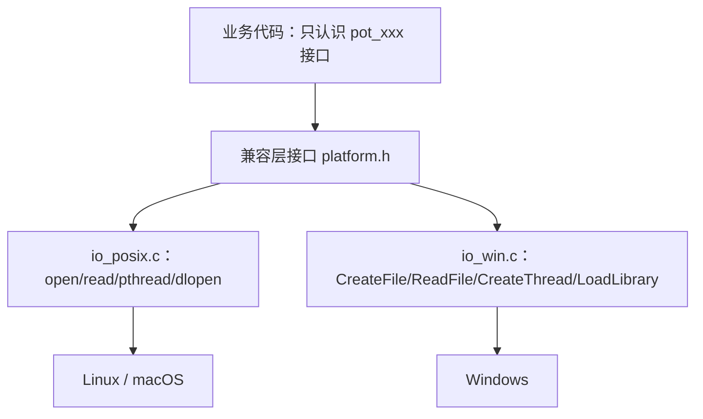

## 前置知识

- 已完成 [文件系统操作](/c/400-FileSystemOperation)：亲手用过 open/read/write/stat 这套 POSIX 接口——本篇反复拿它们与 Windows 对照；
- 已完成 [进程与管道](/c/330-ProcessAndPipe)：知道 fork/exec 是什么——330 篇末尾留下的 Windows 问题在本篇收口。

对预处理器只要求用过 `#include` 与 `#ifdef`，条件编译的组织策略正文会从头讲。

> 分工说明：本模块从 320 到 390 讲的都是 POSIX 侧的机制，涉及 Windows 时纷纷留下一句「差异见跨平台编程」。本篇就是那个约定的收口处：把同一份 C 代码在 Windows 与 POSIX 之间的所有沟壑汇总成一张地图，再给出搭桥的工程方法。深水区细节（.lib/.dll 的导入库机制、SEH 展开等）点到为止，方向各有指向。

## 学习目标

读完本文你将能够：

1. 拿到一份 MSVC 报错清单，把错误归入「头文件、类型、函数、宏、链接」五类并给出对应的搭桥手段；
2. 说出 GCC/Clang/MSVC 三家在标准开关与探测宏上的差异，以及 MSVC 对 C11/C23 的支持现状（2026 口径）；
3. 解释 Windows 文本模式对换行与 Ctrl+Z 的暗改，写出永不踩坑的 fopen 模式串；
4. 对照文件、进程、线程、动态库、信号、套接字、时间七个领域的 POSIX 与 Windows 接口，并为每个领域说出一句迁移策略；
5. 用「每平台一个 .c」或最小兼容层组织条件编译，避开 LLP64 数据模型下 long 宽度、指针截断这类经典坑。

预计 60 到 80 分钟，含 3 组动手实验、1 道预测题与 1 道挑战题。

## 1. 问题引入：报错清单与差异地图

一份在 Linux 上编译运行毫无问题的程序——一个开线程的日志小工具——拿到 Windows 上用 MSVC 一编：

```text
main.c(2): fatal error C1083: 无法打开包括文件: "unistd.h":
    No such file or directory
main.c(5): fatal error C1083: 无法打开包括文件: "pthread.h":
    No such file or directory
main.c(9): error C2065: "ssize_t": 未声明的标识符
main.c(14): error C3861: "open": 找不到标识符
main.c(21): error C2065: "O_CREAT": 未声明的标识符
main.c(26): error C2065: "STDOUT_FILENO": 未声明的标识符
log.c(40): error LNK2019: 无法解析的外部符号 __imp_pthread_create
```

二十来个错，看着吓人，其实只有五种成分：

| 错误类别 | 例子 | 真实原因 |
| --- | --- | --- |
| 头文件缺失 | unistd.h、pthread.h | POSIX 头不是 C 标准，Windows 原生没有 |
| 类型缺失 | ssize_t | 数据模型差异（第 6 节） |
| 函数缺失 | open、fork | POSIX API 的 Windows 对应物名字不同（第 4 节） |
| 宏缺失 | O_CREAT | 旗帜常量属于 POSIX 头（第 4 节） |
| 链接缺失 | pthread_create | 没有可链接的线程库，机制不同（第 4 节） |

换句话说：**代码没有错，是世界换了一套约定**。C 生来就是要可移植的——1970 年代它为了把 Unix 搬上不同机器而生；但「可移植」从来不免费：类型宽度、字节序、换行、线程、进程、动态库……每一处标准留白，各大平台都填了自己的答案。本篇的任务是把这些答案摆在一起对照，并给出组织它们的工程办法。先看最大的三处地形：编译器方言（第 2 节）、路径与换行（第 3 节）、基础库（第 4 节）。

## 2. 编译器与方言：三家对照

C 代码的主要编译器有三家，命令行习惯与扩展各不相同：

| 维度 | GCC | Clang | MSVC |
| --- | --- | --- | --- |
| 编译命令 | gcc -c -o | clang -c -o | cl /c |
| C 标准开关 | -std=c17、-std=c23 | -std=c17、-std=c23 | /std:c11、/std:c17、/std:c23 |
| 默认标准（2026） | GCC 15 起 gnu23；GCC 14 为 gnu17 | 至 22.x 仍 gnu17，C23 需显式 -std=c23 | /std:c17 为常用基线，C23 推进中 |
| 常用警告墙 | -Wall -Wextra -Wpedantic | 同 GCC | /W4（配 /permissive-） |
| 探测宏 | \_\_GNUC\_\_ | \_\_clang\_\_ | \_MSC\_VER |
| 典型平台 | 全平台，Linux 主力 | 全平台，macOS 默认 | Windows 生态 |

注意两点。第一，探测宏的判断顺序有讲究：**Clang 为了兼容大量假设「GCC 才存在」的代码，也会定义 `__GNUC__`**，所以先判 `__clang__` 再判 `__GNUC__`：

```c
/* 编译器探测：谁在编译我 */
#if defined(_MSC_VER)
    #define POT_COMPILER_MSVC 1
#elif defined(__clang__)        /* 必须在 __GNUC__ 之前判断 */
    #define POT_COMPILER_CLANG 1
#elif defined(__GNUC__)
    #define POT_COMPILER_GCC 1
#else
    #define POT_COMPILER_UNKNOWN 1
#endif
```

第二，标准开关的判断用 `__STDC_VERSION__`，它比「猜编译器版本」可靠得多：

```c
#if defined(__STDC_VERSION__) && __STDC_VERSION__ >= 202311L
    /* C23 特性可用 */
#elif defined(__STDC_VERSION__) && __STDC_VERSION__ >= 201710L
    /* C17 基线 */
#endif
```

MSVC 对 C 标准的支持现状（2026 口径，与 [C23 新特性](/c/530-C23NewFeatures) 的口径一致）：C11/C17 经 `/std:c11`、`/std:c17` 开关已稳定可用，C11 的原子操作 `<stdatomic.h>` 自 VS 2022 17.5 起落地、`<threads.h>` 自 17.8 起落地（此后不再定义 `__STDC_NO_THREADS__`）；C23 经 `/std:c23`（VS 2022 17.8 起）可用，关键字与新特性陆续补齐中，仍有缺口，生产代码以 C17 基线加特性探测为宜。另外别忘了 MinGW：把 GCC 搬到 Windows 上、面向 Win32 输出的发行版——同一份 POSIX 风格代码常常 MinGW 直接过、MSVC 不过，「报错清单」的很多成员它并没有。

`#ifdef _WIN32` 这类平台判断的使用纪律先立在此：**平台差异必须隔离在兼容层或独立文件里，不许散落进业务代码**。散落的 `#ifdef` 会让每个函数都长出分支、每加一个平台组合爆炸。怎么隔离，第 5 节给两种成熟做法。

## 3. 路径与换行：最日常的两处沟壑

### 3.1 分隔符与盘符

Windows 的路径长得像 `C:\Users\name\file.txt`：盘符开头、反斜杠分隔。但一个反直觉的事实是：**Windows 的 C 运行库与原生 API 同样接受正斜杠**。微软对 fopen 的文档原话是：路径里的目录分隔符既可以用反斜杠也可以用正斜杠。

```c
FILE *f = fopen("config/app.conf", "rb");   /* Windows 上同样有效 */
```

所以可移植代码的省心做法是：**代码里统一写正斜杠，只有展示给用户的界面字符串才换成反斜杠**。这样路径拼接逻辑只有一套。POSIX 侧则没有盘符概念，`C:\` 之类字符串到 Linux 上就是一个叫 C: 的怪文件名——判断平台时 `path[1] == ':'` 是老式但有效的土办法。

另一处差异是路径长度上限：Windows 传统上限 MAX_PATH 为 260 字符，超长路径要走 `\\?\` 前缀（可到约 32767 字符）；POSIX 侧有 PATH_MAX（Linux 常见 4096）。写遍历程序时给缓冲留足余量、检查 snprintf 截断——400 篇 tree.c 的姿势两平台通用。

### 3.2 文本模式与二进制模式：Windows 会暗改你的字节

430 篇讲过「文本流与二进制流」，当时那只是标准里的措辞差异，Linux 上两者毫无区别。到 Windows 上，这个差别有了真实的物质后果：**以文本模式打开的流会改写字节**。fopen 的 mode 里加 `t`（或不加修饰、默认即文本）时：

- 输出：每个 `\n` 写出为 `\r\n` 两个字节；
- 输入：每个 `\r\n` 读回为 `\n`；
- 输入时字节 0x1A（Ctrl+Z）被解释为文件结束。

`b`（二进制模式）则关闭这一切翻译，字节进字节出。亲手抓一次现场：

```c
/* newline.c：文本模式在 Windows 上的暗改 */
#include <stdio.h>

int main(void) {
    FILE *fp = fopen("nl.txt", "w");     /* 注意：没有 b */
    if (fp == NULL) { perror("fopen"); return 1; }
    fputs("a\nb\n", fp);
    fclose(fp);
    return 0;
}
```

同样的程序、同样的源码，两边的磁盘产物不同：

```text
Windows 编译运行后 od -c nl.txt：
a  \r  \n   b  \r  \n          （4 字节进去，6 字节出来）

Linux 编译运行后 od -c nl.txt：
a  \n   b  \n                  （原样）
```

这就是为什么 Windows 记事本时代的文件到 Linux 打开满屏 `^M`，也是为什么从 Windows 拷去的文本文件比「应该的」字节数多。修改实验：把模式串改成 `"wb"` 再跑——两边产物一致了。于是纪律只有一条：**处理文本且只处理文本时才允许省略 b；一切二进制数据（图片、压缩包、数据库文件）必须 rb/wb**，否则数据里恰好出现 0x1A 时 fread 会中途「假 EOF」，文件被无声截断——这是第 8 节调试实录的主角之一。

## 4. 基础库差异地图：七张最小对照表

这是本篇的主体：七个领域，每个领域一张最小对照表加一句迁移策略。模块里各篇留下的 Windows 伏笔在这里逐一收口。

### 4.1 文件（400 篇伏笔收口）

| 事项 | POSIX | Windows |
| --- | --- | --- |
| 打开 | open，返回 fd（小整数） | CreateFile，返回 HANDLE 句柄；CRT 另有 _open 返回 fd |
| 读写 | read / write | ReadFile / WriteFile；CRT 的 _read / _write |
| 属性 | stat / struct stat | GetFileAttributesEx；CRT 的 _stat |
| 目录遍历 | opendir / readdir | FindFirstFile / FindNextFile |
| 删除 / 重命名 | unlink / rename | DeleteFile / MoveFileEx |

400 篇整篇的 open/read/write 心智模型在 Windows 并不作废：CRT 提供的 `_open/_read/_write` 保留 fd 语义，部分读写契约、循环封装原样适用。迁移策略一句话：**要么全走 CRT（对照表几乎一一对应），要么全走 Win32 原生（句柄是 HANDLE 不是 int）——最忌两边混用，fd 与 HANDLE 互不相认**，第 8 节有混用的事故现场。

### 4.2 进程（330 篇伏笔收口）

| 事项 | POSIX | Windows |
| --- | --- | --- |
| 创建进程 | fork + exec 两步 | CreateProcess 一步 |
| 等待退出 | wait / waitpid | WaitForSingleObject + GetExitCodeProcess |
| 管道 | pipe + dup2 重定向 | CreatePipe + STARTUPINFO 的句柄继承 |

330 篇末尾留过一个问题：「Windows 原生没有 fork，进程创建走 CreateProcess 一步完成，对应关系见跨平台编程」——答案在这里展开：CreateProcess 没有「复制出一个我的副本」这个动作，因此没有 fork 的两次返回，也没有写时复制继承；它直接「创建新进程并加载指定程序」，参数、环境、标准输入输出都要显式传（想把管道接到子进程，靠 SECURITY_ATTRIBUTES 声明句柄可继承、STARTUPINFO 指定接哪里）。想在 Windows 上复刻「fork 后子进程继续跑我自己这段代码」的模型，要么 CreateProcess 启动自己（拿自身可执行路径加参数），要么干脆换成线程——后者往往才是对的。

### 4.3 线程（370 篇伏笔收口）

| 事项 | POSIX | Windows |
| --- | --- | --- |
| 创建 / 等待 | pthread_create / pthread_join | CreateThread / WaitForSingleObject |
| 互斥锁 | pthread_mutex_t | CRITICAL_SECTION / SRWLOCK |
| C11 标准线程 | threads.h | threads.h（MSVC 17.8 起支持） |

370 篇讲透 pthread 时留的尾巴在这里收口：Windows 原生是 CreateThread 一族，但工程上若必须在 CRT 环境里跑（用 stdio、malloc 等），更稳妥的是 `_beginthreadex`——它先替新线程初始化 CRT 的每线程结构再进入你的函数。不过 2026 年更省心的答案其实是第三列：C11 的 threads.h 三家都已支持，标准接口跨平台免翻译，能用就用（这正是 370 篇末尾的建议在新平台上的延续）。

### 4.4 动态库（320 篇伏笔收口）

| 事项 | POSIX | Windows |
| --- | --- | --- |
| 运行时加载 | dlopen / dlsym / dlclose | LoadLibrary / GetProcAddress / FreeLibrary |
| 查错 | dlerror | GetLastError + FormatMessage |
| 库文件 | libfoo.so / libfoo.dylib | foo.dll；编译期配套 foo.lib 导入库 |

320 篇把「Windows 的 .lib/.dll 与导入库」指到本篇，现在补全：Windows 上动态库有两种用法——编译期链接（链接器吃 foo.lib 导入库，运行时自动定位加载 foo.dll）与运行期手动加载（LoadLibrary + GetProcAddress，语义对应 dlopen/dlsym）。错误处理不对等：POSIX 的 dlerror 返回字符串，Windows 要拿 GetLastError 的错误码再用 FormatMessage 转成文字，封装进兼容层里各写各的。

### 4.5 信号（340 篇伏笔收口）

| 事项 | POSIX | Windows |
| --- | --- | --- |
| Ctrl+C 处理 | signal(SIGINT, f) / sigaction | SetConsoleCtrlHandler |
| 段错误转可处理事件 | signal(SIGSEGV, f)（260 篇讲过的限制依旧） | SEH 结构化异常 / SetUnhandledExceptionFilter |
| 向别的进程发信号 | kill(pid, sig) | GenerateConsoleCtrlEvent / TerminateProcess |

340 篇的 signal 模型在 Windows 没有等价物，这句话现在兑现：Windows 不存在「向任意进程投递一个编号」的通用机制——340 篇的 sigaction、信号屏蔽字、volatile sig_atomic_t 那套心智模型只在 POSIX 侧成立。Ctrl+C 走控制台事件回调，崩溃处理走 SEH，两套机制互不相干。跨平台程序的正解是把「优雅退出」设计成自己的抽象接口，POSIX 侧用信号实现、Windows 侧用控制台事件实现。

### 4.6 套接字（390 篇伏笔收口）

| 事项 | POSIX | Windows（Winsock） |
| --- | --- | --- |
| 接口名 | socket / connect / send / recv | 同名（当年为 Unix 程序移植而设计） |
| 初始化 | 无 | 必须 WSAStartup，结束配 WSACleanup |
| 关闭 | close | closesocket（套接字是 SOCKET 不是 fd） |
| 错误查询 | errno | WSAGetLastError（错误码 WSAECONNREFUSED 等） |
| 链接 | 无 | ws2_32.lib（MSVC 用 #pragma comment，MinGW 用 -lws2_32） |

390 篇注明的「Windows 差异去向 410」在此收口。好消息是接口同名、语义一致，390 篇的 TCP 时序与部分读写全部照搬；坏消息是四条本地规矩：用前必须 `WSAStartup`（它必须是第一个被调用的 Winsock 函数），用完 `WSACleanup`；套接字类型是 SOCKET、关闭用 closesocket；出错不查 errno 而查 WSAGetLastError；别忘了链接 ws2_32。标准开机仪式：

```c
/* winsock_boot.c：Winsock 的开机仪式（仅 Windows） */
#include <winsock2.h>
#include <ws2tcpip.h>
#include <stdio.h>
#pragma comment(lib, "ws2_32.lib")

int main(void) {
    WSADATA wsa;
    if (WSAStartup(MAKEWORD(2, 2), &wsa) != 0) {
        fprintf(stderr, "WSAStartup failed\n");
        return 1;
    }

    SOCKET s = socket(AF_INET, SOCK_STREAM, 0);
    if (s == INVALID_SOCKET) {
        fprintf(stderr, "socket failed: %d\n", WSAGetLastError());
        WSACleanup();
        return 1;
    }
    /* ... connect / send / recv 同 390 篇 ... */
    closesocket(s);
    WSACleanup();
    return 0;
}
```

### 4.7 时间与休眠

| 事项 | POSIX | Windows |
| --- | --- | --- |
| 秒级 / 毫秒级休眠 | sleep / nanosleep | Sleep（毫秒，大写 S） |
| 单调时钟测耗时 | clock_gettime(CLOCK_MONOTONIC) | QueryPerformanceCounter |
| 本地时间（可重入） | localtime_r(&t, &tm) | localtime_s(&tm, &t)（参数顺序相反） |

策略照旧：能走 C 标准就先走（time、strftime 两边通吃），差的最小就封装进兼容层。

## 5. 条件编译的组织学与最小兼容层

### 5.1 两种隔离法

平台差异的代码组织只有两种成熟姿势，按项目规模选：

- **每平台一个 .c（大项目首选）**：接口写在 platform.h，实现分成 io_posix.c 与 io_win.c，构建系统按平台挑选编译哪个文件。文件内没有一行 #ifdef，可读性、可测试性都好；
- **#ifdef 内嵌法（小工具可用）**：差异就地写在一个函数里。超过三五个分支就该升级成前一种。

真实项目两种都见得到：libuv 把平台实现隔离在 unix/ 与 win/ 两个目录，对外是同一套 uv_loop_t 接口；Redis 的事件循环拆成 ae_epoll.c、ae_kqueue.c、ae_select.c，编译时按平台选用其一。



### 5.2 平台与标准的探测宏

第 2 节见过编译器探测，平台探测同理——`_WIN32` 判 Windows，`__linux__` 判 Linux，`__APPLE__` 与 `__MACH__` 合判 macOS。把这些判断收敛成一组自己的宏，业务代码只认自己的宏：

```c
/* platform.h：全项目只在这里出现一次 _WIN32 */
#ifndef PLATFORM_H
#define PLATFORM_H

#if defined(_WIN32)
    #define POT_WINDOWS 1
#elif defined(__linux__)
    #define POT_LINUX 1
#elif defined(__APPLE__) && defined(__MACH__)
    #define POT_MACOS 1
#else
    #error "unsupported platform: extend platform.h"
#endif

#endif /* PLATFORM_H */
```

`#error` 兜底是有意的：新平台进来宁可编译失败逼人扩展兼容层，也别静默走错分支。

### 5.3 最小兼容层示例

小项目用不起「每平台一个 .c」时，一个 portability.h 也能走很远——塞进缺失的类型别名与一层函数包装：

```c
/* portability.h：把差异关进一个头文件 */
#ifndef PORTABILITY_H
#define PORTABILITY_H

#ifdef _WIN32
    #include <windows.h>
    #include <direct.h>        /* _mkdir */
    #include <io.h>            /* _open/_read/_write/_unlink */
    #ifndef __MINGW32__
    typedef long long ssize_t; /* MSVC 的 CRT 没有 ssize_t，MinGW 有 */
    #endif
    #define pot_mkdir(path)  _mkdir(path)          /* Windows 无 mode 参数 */
    #define pot_unlink(path) _unlink(path)
#else
    #include <unistd.h>        /* unlink */
    #include <sys/stat.h>      /* mkdir */
    #include <sys/types.h>
    #define pot_mkdir(path)  mkdir(path, 0755)
    #define pot_unlink(path) unlink(path)
#endif

#endif /* PORTABILITY_H */
```

业务代码从此只写 `pot_mkdir("cache")`，一个平台细节都不见。兼容层的分量守则是：只包「两边都有、只是名字不同」的东西；语义不同的东西（fork、信号）包不住，老实分别实现。

## 6. 数据模型、字节序与对齐：跨平台的数据纪律

### 6.1 LLP64 与 LP64：long 宽度是头号陷阱

[数据类型详解](/c/040-DataTypeDetailed) 讲过「C 只承诺最小宽度，其余实现定义」。64 位时代各平台把这句话填成了两套数据模型：

| 数据模型 | int | long | 指针 | 代表平台 |
| --- | --- | --- | --- | --- |
| ILP32 | 32 位 | 32 位 | 32 位 | 32 位系统 |
| LP64 | 32 位 | 64 位 | 64 位 | 64 位 Linux / macOS |
| LLP64 | 32 位 | 32 位 | 64 位 | 64 位 Windows |

关键行：**Windows 的 long 只有 32 位**——它与 Linux 上的 long 不是同一个东西。亲手跑一遍：

```c
/* long_trap.c：分别放到 64 位 Linux 与 64 位 Windows 编译 */
#include <stdio.h>

int main(void) {
    unsigned long v = 0x100000000UL;   /* 2 的 32 次方 */
    printf("%lu\n", v);                /* LP64: 4294967296；LLP64: 0 */
    printf("sizeof(long) = %zu\n", sizeof(long));
                                       /* LP64: 8；LLP64: 4 */
    return 0;
}
```

同样的源码，Linux 打出 8、Windows 打出 4；那个 2 的 32 次方在 Windows 上被塞进 32 位回绕成了 0。纪律三条，全部来自 stdint.h：要精确宽度用 int32_t/int64_t；存指针用 intptr_t（把指针塞进 int 是 64 位平台的必炸题）；打印用 inttypes.h 的 PRIu64/PRIx64，别猜 `%ld` 还是 `%lld`。顺带记一句 time_t：主流 64 位平台已是 64 位宽，2038 年问题只困扰仍在维护的 32 位目标。还有 char 的符号性——x86 上默认有符号、ARM 上默认无符号——处理字节流时显式写 unsigned char，这条在 [数据类型详解](/c/040-DataTypeDetailed) 的实现定义清单里早有备案。

### 6.2 字节序与对齐：一句回顾加一段纪律

[内存对齐](/c/230-AlignmentMemoryLayout) 讲过结构体填充与对齐的平台差异，这里只补跨平台的那一刀：**不同平台编译出的同一结构体，填充字节的内容与位置都可能不同，直接 memcpy 整个结构体进文件或网络属于碰运气**。序列化的正解是按字节显式读写，顺带解决字节序——文件与网络协议通常规定大端，而 x86/ARM 主机是小端：

```c
/* store_be32.c：不依赖主机字节序的写入方式 */
#include <stdint.h>

void store_be32(uint8_t *p, uint32_t v) {
    p[0] = (uint8_t)(v >> 24);   /* 最高有效字节放最低地址 */
    p[1] = (uint8_t)(v >> 16);
    p[2] = (uint8_t)(v >> 8);
    p[3] = (uint8_t)v;
}

uint32_t load_be32(const uint8_t *p) {
    return ((uint32_t)p[0] << 24) | ((uint32_t)p[1] << 16) |
           ((uint32_t)p[2] << 8)  |  (uint32_t)p[3];
}
```

任何平台编译，这四个字节的排列都一样。需要 16/32 位网络序转换时，POSIX 的 htonl/ntohl 与 Winsock 的同名函数也能用，但它们管不了 64 位，自定义协议仍以上面的按字节写法最稳。

## 7. 构建与工具链

一句话地图：Windows 原生编译器是 cl（MSVC，通常经 Visual Studio 或 Build Tools 驱动）；MinGW 把 GCC 带上 Windows；CMake 是两边通吃的构建描述层——一份 CMakeLists.txt，Linux 上生成 Makefile、Windows 上生成 Visual Studio 工程，构建系统的展开见 [构建系统](/c/470-BuildSystem)。配套两句纪律：可移植不是「我心想可移植」，CI 里每个目标平台都编译一遍才算数；静态检查器（cppcheck 的多平台参数、clang-tidy 的 portability 检查组）能在本机就揪出 long 宽度、类型截断一类问题，工具对比见 [静态分析与调试](/c/490-StaticAnalysisDebug)。

## 8. 常见错误与调试实录

### 8.1 long 宽度导致的溢出事故

```c
/* bug_hash.c：在 Linux 上通过、在 Windows 上出错的真实形态 */
#include <stdio.h>
#include <stdint.h>

int main(void) {
    long offset = 4L * 1024 * 1024 * 1024;   /* 想要 4 GiB 的偏移量 */
    printf("offset = %ld\n", offset);
    printf("as int64 = %lld\n", (long long)offset);
    return 0;
}
```

64 位 Linux 上两行都打 4294967296；64 位 Windows 上第一行打出负数或 0（long 只有 32 位，常量在初始化时已被截断），而第二行永远正确。这类事故的狡猾在于：测试环境 Linux 全绿，客户 Windows 机上数据错乱。排查口诀：搜出所有 long，问一句「这里要的是『平台字长』还是『64 位』？」——九成九的答案是后者，改 int64_t 收工。

### 8.2 路径拼接忘分隔符

```c
snprintf(path, sizeof path, "%s%s", config_dir, "app.conf");
```

config_dir 若是 `C:\app\config`，拼出 `C:\app\configapp.conf`；若是 `/etc/app`，拼出 `/etc/appapp.conf`。Linux 侧习惯「目录不带尾斜杠」，Windows 用户与图形界面却常给带尾斜杠的值。修法是收敛成一个 join 函数（第 3 节的姿势）：先剥掉两侧任意的尾分隔符，再补一个自己认的正斜杠。凡是「偶尔打不开文件、路径看着却没错」的报告，先查拼接。

### 8.3 Winsock 忘了 WSAStartup

```text
socket() 返回 INVALID_SOCKET
WSAGetLastError() = 10093 (WSANOTINITIALISED)
```

390 篇的代码原样搬到 Windows，socket 一调就废：错误码 10093 的意思是「Winsock 尚未初始化」。该报错本身很好认，难认的是变体——有人把 WSAStartup 写在了某个「不太会执行的分支」里，程序时好时坏。规矩：初始化放在 main 的第一步（或库的入口），WSACleanup 收尾，配对出现。

### 8.4 fopen 文本模式读二进制被截断

```c
FILE *f = fopen("logo.png", "r");    /* 少了 b */
unsigned char buf[4096];
size_t n = fread(buf, 1, sizeof buf, f);   /* 返回值远小于文件大小 */
```

Windows 上读几百 KB 的 PNG 只读出零点几 KB，且每次截断在同一个位置——找到截断点的字节，多半是 0x1A：文本模式把它当 Ctrl+Z 文件结束符，后面全部丢弃。Linux 上同样的代码完全正常，于是又是一例「我这好好的」。修法一字：加 b。凡是 fread 结果小于预期且 Linux 正常 Windows 异常，先查模式串。

### 8.5 fd 与 HANDLE 混用

```text
error C2664: "BOOL ReadFile(HANDLE,DWORD...)": 无法将参数 1
    从 "int" 转换为 "HANDLE"
```

410.4.1 说的「最忌混用」的现场：用 _open 拿了个 fd，却想交给 ReadFile。MSVC 用 C2664 直接拒绝；更糟的是 MinGW 下某些转换能编译过、运行时行为未定义。同一份代码里选定一条线（CRT 或 Win32），两边不越界。

## 9. 实际项目中的使用场景

- **libuv（Node.js 的底层库）**：把 Windows 的 IOCP 与 Linux 的 epoll、BSD 的 kqueue 抽象成统一的异步 I/O 接口，平台实现隔离在 win/ 与 unix/ 目录——第 5 节「每平台一个 .c」的教科书样本；
- **SQLite**：以 VFS（虚拟文件系统）层抽象文件操作，同一套核心跑在常规文件系统、内存与自定义存储上；其代码里大量 #ifdef 正是「差异隔离在适配层」的实例；
- **Redis**：网络事件循环按编译期宏选择 ae_epoll.c / ae_kqueue.c / ae_select.c，零运行时开销；
- **生态 shortcuts**：glib、SDL、APR 这类可移植库把本文的兼容层做成了现成品；pthread-win32 则反过来，把 POSIX 线程 API 搬上 Windows，适合「代码全是 pthread、暂时不想动」的存量项目。选现成库还是自写兼容层，取决于差异面大小——本文七张表覆盖不到的（GUI、注册表等 OS 专属领地），优先交给专门的库或平台团队。

## 10. 小练习

预测题（5 分钟）：在 64 位 Windows（LLP64）上，下面程序输出什么？在 64 位 Linux 上呢？先写答案再分别验证（没有 Windows 机器可用编译器文档或 online 工具验证 sizeof）：

```c
long a = 10;
long *p = &a;
printf("%zu %zu %zu\n", sizeof(long), sizeof(p), sizeof(*p));
```

参考答案（先写再看）：LLP64 上是 `4 8 4`——long 32 位而指针 64 位；LP64 上是 `8 8 8`。这正是「Windows 的 long 不能当平台字长用」的直测法，也是为什么存指针该用 intptr_t 而不是 long。

挑战题（60 分钟，不看答案先动手）：把 400 篇的 tree.c 移植成 MSVC 能编译的版本，保持「递归列目录树」的功能不变。

提示（思路方向）：三条线索对应第 4 节哪张表？unistd.h 与 dirent.h 没了，用 FindFirstFile/FindNextFile/FindClose 重写目录遍历；lstat 换成 GetFileAttributesEx 的 WIN32_FILE_ATTRIBUTE_DATA（用 FILE_ATTRIBUTE_DIRECTORY 判断目录、nFileSizeHigh/Low 拼大小）；PATH_MAX 换 MAX_PATH。

展开（关键 API）：`HANDLE h = FindFirstFile("dir\\*", &fd);` 之后循环 FindNextFile，跳过 `.` 与 `..` 两项（fd.cName 里），结束时 FindClose——对照 400 篇的 opendir/readdir/closedir 逐个找对应，会发现心智模型完全同构，只是名字全换了。

验收清单：MSVC 与 GCC 双侧编译零警告；两个平台的输出都能列全本文源码目录；输出顺序允许不同（目录项顺序本就无保证，400 篇讲过）。

## 11. 与之前和之后的知识的关系

- 往前：[文件系统操作](/c/400-FileSystemOperation) 的 open/read/write/stat 在 4.1 节找到 Windows 对应物；模块里五处伏笔在本篇收口——[动态库与静态库](/c/320-DynamicStaticLibrary) 的 .lib/.dll（4.4）、[进程与管道](/c/330-ProcessAndPipe) 的 fork（4.2）、[信号处理](/c/340-SignalHandling) 的信号模型（4.5）、[POSIX 线程](/c/370-POSIXThread) 的 pthread（4.3）、[Socket 网络编程](/c/390-SocketNetworkProgramming) 的套接字（4.6）；
- 旁支：LLP64/LP64 的根在 [数据类型详解](/c/040-DataTypeDetailed) 的实现定义清单；结构体填充与序列化的深挖在 [内存对齐](/c/230-AlignmentMemoryLayout)；条件编译的语法基础在 [预处理与宏](/c/290-PreprocessorMacro)；ABI 与调用约定的二进制层细节在 [C 与汇编交互](/c/560-CAssemblyInteraction)；编译器扩展的可移植封装在 [属性与编译器扩展](/c/540-AttributeCompilerExtension)；
- 往后：POSIX 侧的接口细节查 [POSIX 速查](/c/420-CPosixSystemCall)；让「每平台一个 .c」真正跑起来的构建脚本在 [构建系统](/c/470-BuildSystem)。

## 12. 官方文档

- fopen 的 mode 与文本/二进制模式翻译规则（Microsoft Learn）：https://learn.microsoft.com/en-us/cpp/c-runtime-library/reference/fopen-wfopen
- WSAStartup 的调用契约（必须是第一个 Winsock 函数）：https://learn.microsoft.com/en-us/windows/win32/api/winsock2/nf-winsock2-wsastartup
- MSVC 对各 C/C++ 标准的支持动态（版本更新页）：https://learn.microsoft.com/en-us/cpp/overview/what-s-new-for-visual-cpp-in-visual-studio

## 13. 自我检查

- 能把一份 MSVC 报错清单按五类归因，并对每类给出第几节的搭桥手段；
- 能默写七张对照表中任意三张，说出对应领域的迁移策略一句；
- 能解释 Windows 文本模式的三个暗改动作，并说出哪些 fopen 模式串是安全的；
- 能向同事讲清 LLP64 陷阱的本质（long 不是平台字长），以及兼容层与业务代码的边界划在哪。

## 本章总结

跨平台 C 的沟壑有固定地形：编译器方言（GCC/Clang/MSVC 的开关与探测宏，MSVC 的 C17 已稳、C23 推进中）、路径与换行（正斜杠双平台通用，文本模式的 \r\n 与 Ctrl+Z 暗改必须用 b 挡住）、七个基础库领域（文件、进程、线程、动态库、信号、套接字、时间各有对照表与迁移策略）、数据模型（Windows 的 long 只有 32 位，精确宽度只认 int64_t/intptr_t）。工程方法两条：差异要么隔离成每平台一个 .c，要么收敛进一个 portability.h——业务代码一个 #ifdef 都不见。模块里五处「Windows 见 410」的伏笔至此全部兑现：接下来该把 POSIX 侧的家底重新盘一遍了。

## 下一步

进入 [POSIX 速查](/c/420-CPosixSystemCall)：地图已经画完，把 Linux/macOS 这条主战场的系统调用家底——四件套、进程、管道、信号、目录——整理成随查随用的案头手册。
