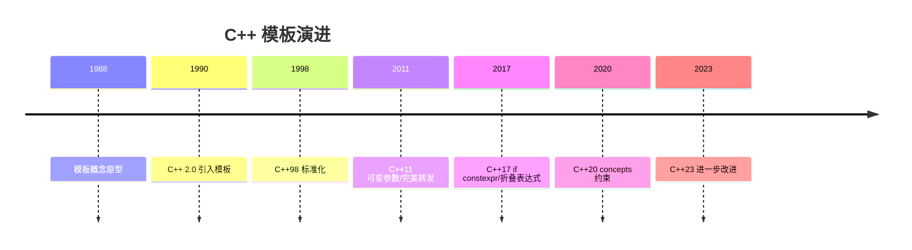
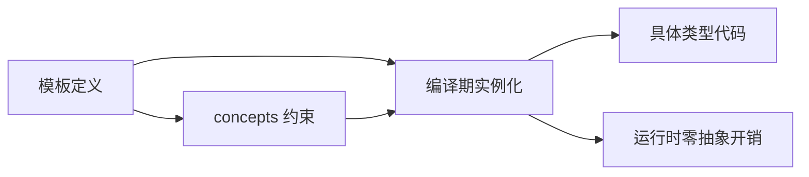

## 1. 历史动机与发展脉络

C++ 模板由 Bjarne Stroustrup 于 1988 年前后引入 C++ 2.0 的实验版本，1990 年正式加入 C++ 标准草案，1998 年 C++98 标准化。设计动机是“参数化多态”：让同一份代码适用于多种类型，同时保持静态类型检查与零运行时开销。

模板演进的关键节点：C++03 修复规范缺陷；C++11 引入可变参数模板、别名模板、`decltype`、右值引用与完美转发，使模板元编程可用性大幅提升；C++14 引入变量模板与泛型 lambda；C++17 引入 `if constexpr` 与折叠表达式；C++20 引入 concepts（`requires`），把模板约束从“文档约定”升级为“编译期检查的接口契约”；C++23 继续完善（`deducing this` 等）。

模板的实践问题同样知名：实例化导致编译时间与二进制膨胀（“模板元编程爆炸”），错误信息冗长难读，两阶段查找规则复杂。concepts 与模块（modules）正是针对这些痛点的标准回应。



## 2. 形式化定义

### 2.1 函数模板

```cpp
template <typename T>
T max_value(T a, T b) {
    return (a > b) ? a : b;
}
```

调用 `max_value(3, 5)` 时编译器按实参推断 T=int 并实例化。模板参数可以是类型参数、非类型参数（整数、枚举、指针、字面量类）与模板模板参数。

### 2.2 类模板

```cpp
template <typename T, size_t N>
class Array {
    T data[N];
public:
    T& operator[](size_t i) { return data[i]; }
};
```

类模板本身不是类型，`Array<int, 4>` 才是类型。

### 2.3 特化

全特化：为具体类型提供专属实现；偏特化：为部分类型形态（如 `T*`、`std::vector<T>`）提供实现。函数模板只支持全特化（偏特化用重载替代）。

### 2.4 可变参数模板

```cpp
template <typename... Ts>
void print_all(Ts... args);
```

`Ts` 是模板参数包，`args` 是函数参数包；展开用 `...`（如 `args...`），配合折叠表达式（C++17）计算。

### 2.5 if constexpr 与 concepts

`if constexpr (条件)` 在编译期判断，未选中的分支不参与实例化；concepts 用 `requires` 约束模板参数，失败时给出清晰错误。



## 3. 理论推导与原理解析

### 3.1 实例化模型

模板是惰性求值的：成员函数只有在被使用时才实例化；类模板的静态成员按需实例化。因此“模板代码中写了错误但未使用的成员”不会报错。实例化发生在编译单元内，因此模板定义通常必须放在头文件。

### 3.2 两阶段查找

模板名称查找分两个阶段：定义阶段（非依赖名的普通查找）与实例化阶段（依赖名 ADL 与实例化上下文查找）。这导致“模板中使用的外部函数必须在定义时可见或通过 ADL 找到”，否则实例化失败。理解两阶段查找是排查“模板编译错误但不明显”的关键。

### 3.3 SFINAE

模板参数替换失败时，该候选从重载集中移除而不报错（SFINAE：Substitution Failure Is Not An Error）。经典应用：`std::enable_if` 条件启用重载。C++20 后 concepts 是更清晰的替代。

### 3.4 元编程的图灵完备性

模板实例化系统在编译期可计算（图灵完备），代价是编译资源。C++11 后 `constexpr` 函数提供更直观的编译期计算路径，模板元编程退居“类型变换”领域（如 `std::tuple` 操作）。

## 4. 代码示例（带详尽注释）

### 4.1 函数模板与推断

```cpp
#include <iostream>
#include <string>

// 泛型取最大值：要求类型支持 operator>
template <typename T>
T max_value(const T& a, const T& b) {
    return (a > b) ? a : b;
}

int main() {
    // 自动推断 T=int
    std::cout << max_value(3, 7) << '\n';
    // 推断 T=double
    std::cout << max_value(3.14, 2.71) << '\n';
    // 显式指定模板参数
    std::cout << max_value<std::string>("a", "b") << '\n';
    return 0;
}
```

讲解：模板推断按实参自动完成；`const T&` 避免拷贝。字符串字面量是数组类型，直接比较会退化为指针比较，因此显式指定 `std::string`。这是模板初学者最经典的坑。

### 4.2 类模板

```cpp
#include <iostream>

// 固定容量数组：非类型模板参数 N 指定容量
template <typename T, std::size_t N>
class FixedArray {
    T data_[N]{}; // 值初始化
public:
    constexpr std::size_t size() const { return N; }

    // 越界检查：超出时抛出异常
    T& at(std::size_t i) {
        if (i >= N) throw std::out_of_range("index");
        return data_[i];
    }
};

int main() {
    FixedArray<int, 4> arr;
    arr.at(0) = 42;
    std::cout << arr.size() << ' ' << arr.at(0) << '\n';
    return 0;
}
```

讲解：`std::size_t N` 是非类型模板参数，在编译期确定容量，零堆分配。`at()` 带边界检查，`operator[]` 通常不检查以追求性能——两种语义的选择是容器设计的经典权衡。

### 4.3 模板特化

```cpp
#include <iostream>

// 主模板：默认实现
template <typename T>
struct TypeName {
    static const char* name() { return "unknown"; }
};

// 全特化：int 的专属实现
template <>
struct TypeName<int> {
    static const char* name() { return "int"; }
};

// 偏特化：所有指针类型
template <typename T>
struct TypeName<T*> {
    static const char* name() { return "pointer"; }
};

int main() {
    std::cout << TypeName<double>::name() << '\n';   // unknown
    std::cout << TypeName<int>::name() << '\n';       // int
    std::cout << TypeName<char*>::name() << '\n';     // pointer
    return 0;
}
```

讲解：特化让同一模板对不同类型提供不同实现。偏特化 `T*` 匹配任意指针，比全特化更通用。这是类型萃取（type traits）的基础模式。

### 4.4 可变参数模板与折叠表达式

```cpp
#include <iostream>

// 递归打印所有参数（C++17 折叠表达式版本）
template <typename... Args>
void print_all(Args... args) {
    // 一元右折叠：((std::cout << args) << ...)
    (std::cout << ... << args) << '\n';
}

// 求和：一元左折叠
template <typename... Args>
auto sum(Args... args) {
    return (args + ...); // 需要至少一个参数
}

int main() {
    print_all("a", 1, 2.5);       // a12.5
    std::cout << sum(1, 2, 3, 4) << '\n'; // 10
    return 0;
}
```

讲解：折叠表达式把参数包展开为二元运算链。`(args + ...)` 展开为 `1 + (2 + (3 + 4))`；空包时该写法不合法，需要提供默认值（`(args + ... + 0)`）。

### 4.5 if constexpr

```cpp
#include <iostream>
#include <type_traits>

// 编译期分支：整型走除法，浮点走提示
template <typename T>
auto safe_divide(T a, T b) {
    if constexpr (std::is_integral_v<T>) {
        if (b == 0) {
            return static_cast<T>(0); // 整数除零保护
        }
        return a / b;
    } else {
        return a / b; // 浮点直接除
    }
}

int main() {
    std::cout << safe_divide(10, 3) << '\n';    // 3
    std::cout << safe_divide(10.0, 4.0) << '\n'; // 2.5
    return 0;
}
```

讲解：`if constexpr` 的分支在编译期选定，未选中的分支不实例化——因此两个分支可以包含对当前类型非法的代码而不会报错。这是替代 SFINAE 的现代写法。

### 4.6 concepts 约束（C++20）

```cpp
#include <concepts>
#include <iostream>

// 定义约束：T 必须支持加法且结果可转换为 T
template <typename T>
concept Addable = requires(T a, T b) {
    { a + b } -> std::convertible_to<T>;
};

// 约束模板：不满足 Addable 时编译错误信息清晰
template <Addable T>
T add(T a, T b) {
    return a + b;
}

int main() {
    std::cout << add(1, 2) << '\n';
    // add("a", "b") 编译失败：const char* 不满足 Addable
    return 0;
}
```

讲解：concepts 把模板约束变成可命名、可复用的接口契约。错误信息从“深藏在实例化栈中”变为“约束未满足”，大幅改善模板体验。

### 4.7 别名模板与变量模板

```cpp
#include <vector>

// 别名模板：固定分配器
template <typename T>
using DefaultVec = std::vector<T>;

// 变量模板：编译期常量
template <typename T>
inline constexpr bool is_pointer_v = std::is_pointer_v<T>;

static_assert(is_pointer_v<int*>);
static_assert(!is_pointer_v<int>);
```

讲解：别名模板简化“部分固定参数”的类型；变量模板让类型萃取以“值”形式使用（`_v` 后缀约定）。两个特性共同提升模板代码的简洁性。

### 4.8 完美转发

```cpp
#include <utility>
#include <memory>

// 工厂函数：完美转发参数构造 T
template <typename T, typename... Args>
std::unique_ptr<T> make(Args&&... args) {
    // 转发引用 + std::forward 保持左值/右值属性
    return std::make_unique<T>(std::forward<Args>(args)...);
}

struct Widget {
    explicit Widget(int x) : x_(x) {}
    int x_;
};

int main() {
    auto w = make<Widget>(42);
    return w->x_;
}
```

讲解：`Args&&...` 是转发引用，`std::forward` 按实参原始类别（左值/右值）转发，避免不必要的拷贝。这是泛型工厂、容器 emplace 的底层机制。

## 5. 对比分析

### 5.1 模板与继承/虚函数

| 维度 | 模板（静态多态） | 虚函数（动态多态） |
| --- | --- | --- |
| 绑定时机 | 编译期 | 运行期 |
| 运行时开销 | 无（可内联） | 虚表间接调用 |
| 类型约束 | concepts 编译期检查 | 基类接口约束 |
| 二进制体积 | 每类型实例化 | 单一实现 |
| 适用 | 算法、容器、编译期计算 | 插件、多态对象集合 |

### 5.2 if constexpr 与运行时 if

`if constexpr` 删除未选分支（不影响实例化），运行时 `if` 两个分支都必须编译。前者适合“类型相关的分支”，后者适合“值相关的分支”。

### 5.3 模板与宏

宏是文本替换，无类型检查与作用域；模板有完整类型系统。宏能做的“代码生成”，模板几乎都能更安全地完成。现代 C++ 中宏仅用于头文件保护与少量配置。

## 6. 常见陷阱与最佳实践

陷阱一：模板实现放在 .cpp 文件导致链接错误。实例化需要定义可见，模板定义应放头文件（或显式实例化）。

陷阱二：字符串字面量推断为数组/指针类型。比较语义错误。用 `std::string_view` 或显式参数。

陷阱三：滥用元编程导致编译时间爆炸。最佳实践：优先 `constexpr` 函数与 concepts，保持模板简单。

陷阱四：`typename` 缺失。依赖类型（如 `T::value_type`）前必须写 `typename`（C++20 部分上下文可省略，但建议保留）。

陷阱五：折叠表达式空包。`(args + ...)` 空包非法；用 `(args + ... + 0)` 提供初始值。

陷阱六：`if constexpr` 两分支返回值类型不同导致函数返回类型推断失败。两个 return 的类型必须一致或可转换。

陷阱七：过度特化导致维护地狱。优先 concepts + 主模板，只在必要时特化。

## 7. 工程实践

### 7.1 泛型容器接口

```cpp
// 通用迭代接口：任何提供 begin/end 的类型
template <typename Container>
requires requires(Container& c) {
    c.begin();
    c.end();
}
double average(const Container& c) {
    double sum = 0;
    std::size_t n = 0;
    for (const auto& v : c) {
        sum += static_cast<double>(v);
        ++n;
    }
    return n == 0 ? 0 : sum / n;
}
```

讲解：`requires requires` 表达式约束接口能力，vector、list、array 均可传入。泛型算法只依赖最小接口（begin/end），是标准库设计哲学的缩影。

### 7.2 类型萃取工具

```cpp
template <typename T>
struct is_smart_pointer : std::false_type {};

template <typename T>
struct is_smart_pointer<std::unique_ptr<T>> : std::true_type {};

template <typename T>
struct is_smart_pointer<std::shared_ptr<T>> : std::true_type {};

template <typename T>
inline constexpr bool is_smart_pointer_v = is_smart_pointer<T>::value;
```

讲解：继承 `std::false_type/true_type` 让萃取结果具有 `.value` 与类型常量语义，配合 `_v` 变量模板统一使用方式。

## 8. 案例研究：泛型缓存管理器

需求：按类型分组的对象缓存，LRU 淘汰，编译期类型安全。

```cpp
#include <list>
#include <unordered_map>
#include <memory>
#include <mutex>

template <typename Key, typename Value>
class LruCache {
    using Item = std::pair<Key, std::shared_ptr<Value>>;
    std::list<Item> items_;                    // 最近使用顺序
    std::unordered_map<Key, decltype(items_.begin())> index_;
    std::size_t capacity_;
    mutable std::mutex mu_;

public:
    explicit LruCache(std::size_t cap) : capacity_(cap) {}

    // 读取：命中则移到链表头
    std::shared_ptr<Value> get(const Key& key) {
        std::lock_guard lock(mu_);
        auto it = index_.find(key);
        if (it == index_.end()) return nullptr;
        items_.splice(items_.begin(), items_, it->second);
        return it->second->second;
    }

    // 写入：超出容量淘汰最久未使用
    void put(const Key& key, std::shared_ptr<Value> value) {
        std::lock_guard lock(mu_);
        if (auto it = index_.find(key); it != index_.end()) {
            it->second->second = std::move(value);
            items_.splice(items_.begin(), items_, it->second);
            return;
        }
        items_.emplace_front(key, std::move(value));
        index_[key] = items_.begin();
        if (items_.size() > capacity_) {
            index_.erase(items_.back().first);
            items_.pop_back();
        }
    }
};
```

讲解：该案例综合类模板（Key/Value 泛型）、容器组合（list + unordered_map）、迭代器索引与线程安全。`splice` 移动节点到头部是 O(1) 操作；`unordered_map` 存储迭代器实现 O(1) 查找。模板让缓存器适配任意键值类型。

## 9. 知识要点总结与深入讲解

模板的本质是编译期代码生成：一份蓝图，按需实例化。理解“惰性实例化”与“定义可见性”，就理解了模板必须放头文件的工程约束。

模板的演进主线是“让约束可表达”：从隐式约定（C++98）到 enable_if（C++11）再到 concepts（C++20）。新代码应优先 concepts，把类型约束写进接口。

编译期分支的三个层次：`if constexpr` 处理类型分支，折叠表达式处理参数包，模板特化处理形态差异。三者组合覆盖绝大多数泛型编程需求，运行时开销为零。

### 1. 函数模板

函数模板允许定义可适用于不同类型的函数。

```cpp
 // 基本函数模板
 template <typename T>
 T max(T a, T b) {
  return a > b ? a : b;
 }
 // 使用示例
 int main() {
  int i = max(10, 20); // T = int
  double d = max(3.14, 2.71); // T = double
  std::string s = max(std::string("hello"), std::string("world")); // T = std::string
  return 0;
 }
```

#### 1.1 模板参数推导

编译器会根据函数参数自动推导模板参数类型。

```cpp
 template <typename T>
 void print(T value) {
  std::cout << value << std::endl;
 }
 int main() {
  print(42); // T = int
  print(3.14); // T = double
  print("Hello"); // T = const char*
  return 0;
 }
```

#### 1.2 显式模板参数

可以显式指定模板参数类型。

```cpp
 template <typename T>
 T add(T a, T b) {
  return a + b;
 }
 int main() {
  // 显式指定模板参数
  int result = add<int>(10, 20);
  double result2 = add<double>(10.5, 20.5);
  // 类型转换
  double result3 = add<double>(10, 20.5); // 显式指定为 double
  return 0;
 }
```

#### 1.3 模板重载

可以为特定类型提供重载版本。

```cpp
 // 通用版本
 template <typename T>
 T max(T a, T b) {
  std::cout << "Template version" << std::endl;
  return a > b ? a : b;
 }
 // 针对 const char* 的重载
 const char* max(const char* a, const char* b) {
  std::cout << "Overload version" << std::endl;
  return strcmp(a, b) > 0 ? a : b;
 }
 // 特化版本
 template <>
 int max<int>(int a, int b) {
  std::cout << "Specialized version" << std::endl;
  return a > b ? a : b;
 }
 // 使用示例
 int main() {
  max(10, 20); // 特化版本
  max(3.14, 2.71); // 模板版本
  max("hello", "world"); // 重载版本
  return 0;
 }
```

#### 1.4 多个模板参数

函数模板可以有多个模板参数。

```cpp
 // 多个模板参数
 template <typename T1, typename T2, typename T3>
 typename std::common_type<T1, T2, T3>::type max(T1 a, T2 b, T3 c) {
  return max(max(a, b), c);
 }
 // 使用示例
 int main() {
  auto result = max(10, 20.5, 15); // 返回 double 类型
  std::cout << "Max: " << result << std::endl;
  return 0;
 }
```

### 1. 类模板

类模板允许定义可适用于不同类型的类。

```cpp
 // 基本类模板
 template <typename T>
 class Stack {
 private:
  std::vector<T> elements;
 public:
  void push(const T& item) {
  elements.push_back(item);
  }
  void push(T&& item) {
  elements.push_back(std::move(item));
  }
  T pop() {
  if (elements.empty()) {
  throw std::runtime_error("Stack is empty");
  }
  T top = std::move(elements.back());
  elements.pop_back();
  return top;
  }
  bool empty() const {
  return elements.empty();
  }
  size_t size() const {
  return elements.size();
  }
  T& top() {
  if (elements.empty()) {
  throw std::runtime_error("Stack is empty");
  }
  return elements.back();
  }
  const T& top() const {
  if (elements.empty()) {
  throw std::runtime_error("Stack is empty");
  }
  return elements.back();
  }
 }
 // 使用示例
 int main() {
  Stack<int> intStack;
  intStack.push(1);
  intStack.push(2);
  std::cout << intStack.pop() << std::endl; // 输出 2
  Stack<std::string> stringStack;
  stringStack.push("hello");
  stringStack.push("world");
  std::cout << stringStack.pop() << std::endl; // 输出 world
  return 0;
 }
```

#### 1.1 模板参数默认值

可以为模板参数提供默认值。

```cpp
 template <typename T, typename Allocator = std::allocator<T>>
 class MyVector {
 private:
  std::vector<T, Allocator> data;
 public:
  MyVector() = default;
  explicit MyVector(size_t size) : data(size) {}
  MyVector(size_t size, const T& value) : data(size, value) {}
  void push_back(const T& value) {
  data.push_back(value);
  }
  void push_back(T&& value) {
  data.push_back(std::move(value));
  }
  T& operator[](size_t index) {
  return data[index];
  }
  const T& operator[](size_t index) const {
  return data[index];
  }
  size_t size() const {
  return data.size();
  }
 }
 // 使用默认分配器
 MyVector<int> v1;
 // 使用自定义分配器
 // MyVector<int, CustomAllocator<int>> v2;
```

#### 1.2 类模板特化

可以为特定类型提供特化版本。

```cpp
 // 主模板
 template <typename T>
 class MyType {
 public:
  static void print() {
  std::cout << "General template" << std::endl;
  }
 }
 // 特化版本
 template <>
 class MyType<int> {
 public:
  static void print() {
  std::cout << "Specialized for int" << std::endl;
  }
 }
 // 部分特化
 template <typename T>
 class MyType<T*> {
 public:
  static void print() {
  std::cout << "Specialized for pointer" << std::endl;
  }
 }
 // 使用示例
 int main() {
  MyType<double>::print(); // 输出 General template
  MyType<int>::print(); // 输出 Specialized for int
  MyType<int*>::print(); // 输出 Specialized for pointer
  return 0;
 }
```

### 2. 可变参数模板 (C++11)

可变参数模板允许接受任意数量的模板参数。

```cpp
 // 递归终止条件
 void print() {
  std::cout << std::endl;
 }
 // 可变参数模板
 template <typename T, typename... Args>
 void print(T first, Args... rest) {
  std::cout << first << " ";
  print(rest...); // 递归调用
 }
 // 使用示例
 int main() {
  print(1, 2.5, "hello", true); // 输出 1 2.5 hello 1
  return 0;
 }
```

#### 2.1 折叠表达式 (C++17)

折叠表达式是一种简化可变参数模板使用的语法。

```cpp
 // 使用折叠表达式求和
 template <typename... Args>
 auto sum(Args... args) {
  return (args + ...);
 }
 // 使用折叠表达式打印
 template <typename... Args>
 void print_fold(Args... args) {
  (std::cout << ... << args) << std::endl;
 }
 // 使用示例
 int main() {
  std::cout << "Sum: " << sum(1, 2, 3, 4, 5) << std::endl; // 15
  print_fold(1, " ", 2.5, " ", "hello"); // 1 2.5 hello
  return 0;
 }
```

#### 2.2 转发引用与完美转发

可变参数模板常与转发引用一起使用，实现完美转发。

```cpp
 // 完美转发函数
 template <typename... Args>
 void forward_args(Args&&... args) {
  print(std::forward<Args>(args)...);
 }
 // 使用示例
 int main() {
  int x = 10;
  forward_args(1, "hello", std::move(x));
  return 0;
 }
```

### 3. 模板元编程

模板元编程是一种在编译时执行计算的技术。

```cpp
 // 编译期计算阶乘
 template <int N>
 struct Factorial {
  static constexpr int value = N * Factorial<N-1>::value;
 }
 // 特化版本作为递归终止条件
 template <>
 struct Factorial<0> {
  static constexpr int value = 1;
 }
 // 编译期计算斐波那契数列
 template <int N>
 struct Fibonacci {
  static constexpr int value = Fibonacci<N-1>::value + Fibonacci<N-2>::value;
 }
 // 特化版本
 template <>
 struct Fibonacci<0> {
  static constexpr int value = 0;
 }
 template <>
 struct Fibonacci<1> {
  static constexpr int value = 1;
 }
 // 使用示例
 int main() {
  constexpr int fact5 = Factorial<5>::value; // 编译期计算 120
  std::cout << "5! = " << fact5 << std::endl;
  constexpr int fib10 = Fibonacci<10>::value; // 编译期计算 55
  std::cout << "Fibonacci(10) = " << fib10 << std::endl;
  return 0;
 }
```

#### 3.1 类型 traits

类型 traits 是模板元编程的重要应用，用于在编译时获取类型信息。

```cpp
 // 自定义类型 trait
 template <typename T>
 struct IsIntegral {
  static constexpr bool value = false;
 }
 // 特化
 template <>
 struct IsIntegral<int> {
  static constexpr bool value = true;
 }
 template <>
 struct IsIntegral<long> {
  static constexpr bool value = true;
 }
 // 使用示例
 template <typename T>
 void process(T value) {
  if constexpr (IsIntegral<T>::value) {
  std::cout << "Processing integral type: " << value << std::endl;
  } else {
  std::cout << "Processing non-integral type" << std::endl;
  }
 }
 int main() {
  process(42); // 处理整型
  process(3.14); // 处理非整型
  return 0;
 }
```

### 4. 模板的最佳实践

1. **使用 `auto` 推导模板参数**：减少代码冗余，提高可读性。
2. **使用概念 (C++20)**：约束模板参数，提供更清晰的错误信息。
3. **避免过度特化**：只在必要时使用模板特化。
4. **考虑编译时间**：复杂的模板会增加编译时间。
5. **使用 `typename` 和 `template` 关键字**：在模板中正确使用这些关键字消除歧义。
6. **合理使用默认模板参数**：简化模板的使用。
7. **使用 SFINAE 技术**：在编译时选择合适的函数重载。

---

### 函数模板

**基本写法：定义函数模板**
`template <typename <T>> <返回类型> <函数名>(<参数>) { }`
```cpp
// 泛型加法函数
template <typename T>
T add(T a, T b) { return a + b; }
```

---

**基本写法：多类型参数**
`template <typename <T1>, typename <T2>>`
```cpp
// 两个不同类型的参数
template <typename T1, typename T2>
auto mul(T1 a, T2 b) { return a * b; }
```

---

**基本写法：非类型模板参数**
`template <typename <T>, <类型> <N>>`
```cpp
// 编译期常量参数
template <typename T, int N>
T scale(T x) { return x * N; }
```

---

**基本写法：调用函数模板**
`<函数名><<类型>>(<参数>);`
```cpp
// 显式指定模板参数
int r = add<int>(3, 4);
```

---

### 类模板

**基本写法：定义类模板**
`template <typename <T>> class <类名> { };`
```cpp
// 泛型栈容器
template <typename T>
class Stack {
    std::vector<T> data;
public:
    void push(T v) { data.push_back(v); }
};
```

---

**基本写法：实例化类模板**
`<类名><<类型>> <变量>;`
```cpp
// 创建 int 类型栈
Stack<int> s;
```

---

**基本写法：类外定义成员**
`template <typename <T>> <返回类型> <类名><<T>>::<方法名>(<参数>) { }`
```cpp
// 类外定义成员函数
template <typename T>
void Stack<T>::push(T v) { data.push_back(v); }
```

---

### 模板特化

**基本写法：全特化**
`template <> class <类名><<具体类型>> { };`
```cpp
// 针对 bool 类型的特化实现
template <>
class Stack<bool> {
    std::vector<bool> data;
public:
    void push(bool v) { data.push_back(v); }
};
```

---

**基本写法：函数模板全特化**
`template <> <返回类型> <函数名><<具体类型>>(<参数>) { }`
```cpp
// 针对指针类型的特化
template <>
int max_ptr<int>(int* a, int* b) { return *a > *b ? *a : *b; }
```

---

**基本写法：偏特化**
`template <typename <T>> class <类名><<T>*> { };`
```cpp
// 针对指针类型的偏特化
template <typename T>
class Stack<T*> {
    std::vector<T*> data;
};
```

---

### 可变参数模板

**基本写法：参数包**
`template <typename... <Args>>`
```cpp
// 接收任意数量类型
template <typename... Args>
void print(Args... args);
```

---

**基本写法：sizeof 计算参数数量**
`sizeof...(<参数包>)`
```cpp
// 获取包中元素个数
constexpr size_t n = sizeof...(Args);
```

---

### 模板元编程

**基本写法：编译期递归**
`template <int <N>> struct <名称> { static const int value = <N> * <名称><<N-1>>::value; };`
```cpp
// 编译期阶乘
template <int N>
struct Factorial {
    static const int value = N * Factorial<N - 1>::value;
};
```

---

**基本写法：递归终止特化**
`template <> struct <名称><0> { static const int value = 1; };`
```cpp
// 0 的阶乘为 1
template <>
struct Factorial<0> {
    static const int value = 1;
};
```

---

### 别名模板

**基本写法：类型别名**
`template <typename <T>> using <别名> = <类型><<T>>;`
```cpp
// 简化容器类型书写
template <typename T>
using Vec = std::vector<T>;
```

---

### 变量模板

**基本写法：变量模板**
`template <typename <T>> constexpr <类型> <名> = <值>;`
```cpp
// 编译期常量模板
template <typename T>
constexpr T pi = T(3.14159265358979);
```

---

### if constexpr

**基本写法：编译期条件分支**
`if constexpr (<条件>) { } else { }`
```cpp
// 编译期选择分支避免非法代码
if constexpr (std::is_integral_v<T>) {
    return x + 1;
} else {
    return x;
}
```
