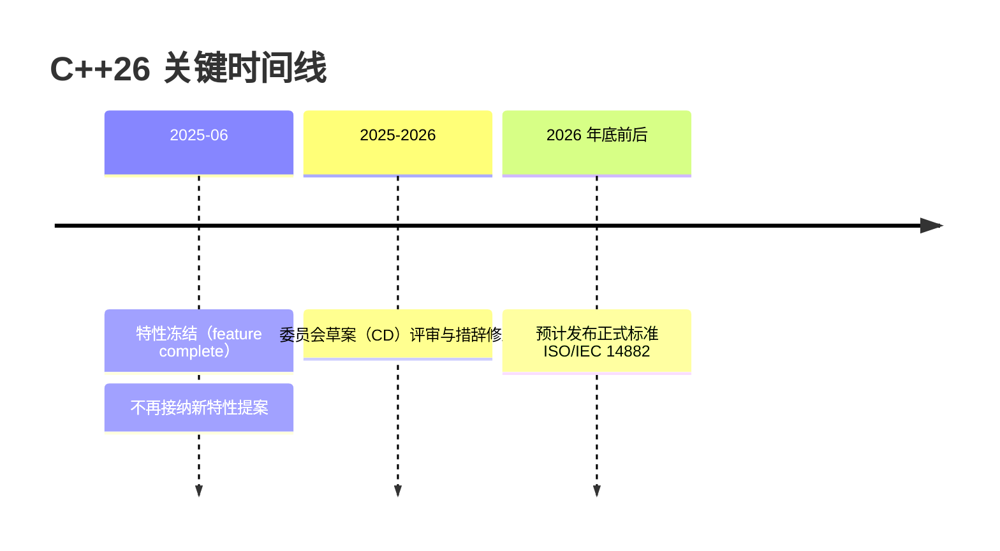

## 学习目标

- 明确 C++26 的标准进程：2025-06 特性冻结，正式标准预计 2026 年底前后发布
- 认识已并入 C++26 草案的核心语言与库特性，能读懂相关示例
- 理解「标准已定稿」与「编译器已实现」的区别，学会用特性宏做防御性检测

## 前置知识

- [C++ 概述与现代标准](/cpp/002-CppOverviewAndModernStandard)：了解 C++ 标准的三年一版节奏
- [C++23 新特性](/cpp/062-Cpp23NewFeatures)：C++26 的很多特性建立在 C++23 之上（如 mdspans 之于 linalg）

## C++26 处于什么阶段

C++ 遵循「三年一版」的发布节奏。C++26 的时间线如下：



两个关键结论：

1. **标准本体尚未正式发布**。在 ISO 正式出版之前，C++26 的一切内容都应以「标准草案」为准；
   本文档只描述已并入草案的特性，并标注提案编号（P 编号）便于溯源。
2. **定稿不等于可用**。即使标准发布，编译器完整实现通常还要再滞后数年。例如 C++23 的
   `import std;` 至今（2026 年）在各工具链上的落地仍然参差不齐。写作本文时的现状是：
   GCC 14/15、Clang 18-20、MSVC 对 C++26 特性只提供**部分或实验性**支持，其中静态反射
   （P2996）尚无主流编译器的完整实现（仅有实验分支）。

## 已并入草案的语言特性

### 契约（Contracts，P2900）

**是什么**：契约允许把「函数对调用方的承诺」直接写进函数签名——前置条件（pre）描述
「调用方必须保证什么」，后置条件（post）描述「函数保证返回时什么成立」，`contract_assert`
用于函数体内部的中间断言。可以把契约理解为「写在代码里的接口说明书」，违约即程序缺陷。

**为什么需要**：目前验证参数的做法要么是抛异常（把调用方 bug 当运行时错误），要么是
`assert`（Release 模式下消失）。契约让这一语义标准化，并允许编译期/运行期选择检查强度。

```cpp
// C++26 草案契约语法（P2900）：语境关键字，不是 [[属性]]
// 注意：早期提案中的 [[pre: ...]] 属性写法已被废弃，检索旧资料时注意区分
int divide(int a, int b)
    pre(b != 0)                 // 前置条件：调用方必须保证 b 非零
    post(r : r * b == a)        // 后置条件：返回值 r 满足恒等式
{
    contract_assert(b != 1 || a != b);  // 函数体内的契约断言（示例语义）
    return a / b;
}

divide(6, 2);   // 正常：契约成立
divide(6, 0);   // 违反前置条件：属程序缺陷，按检查级别处理
```

契约的检查级别（off / observe / enforce / quick-enforce）决定了违约时的行为——
是继续运行仅记录、还是直接终止程序。这属于构建期的全局策略，由实现定义的机制控制。

### 静态反射（P2996）

**是什么**：反射让程序「看见自己的结构」。C++26 走的是**静态反射**路线：所有反射查询都
发生在编译期，没有运行时类型元数据，因此不增加二进制体积、不影响运行性能。
可以类比：运行时反射像「带说明书出厂」，静态反射像「编译器在装配时已经把说明书上的
信息直接焊进了产品」。

核心语法（草案状态）：

```cpp
// C++26 静态反射（P2996）：目前尚无主流编译器完整实现，仅示意
#include <meta>

struct Point { int x; int y; };

constexpr auto r = ^^Point;          // ^^T 产生反射元信息，类型为 std::meta::info
// std::string_view name = std::meta::identifier_of(r);      // 查询名字 "Point"
// members_of(r) 产生成员的反射片段，[: :] 是「片段展开」运算符，
// 用于把编译期的反射信息重新注入回代码位置。
```

典型用途：序列化、ORM 字段映射、枚举名转字符串、依赖注入容器——过去需要宏、代码生成器
或第三方反射库的场景。**再次强调：截至特性冻结，没有主流编译器完整实现 P2996，生产环境
请等待落地，勿基于实验分支开发业务代码。**

### Pack indexing（P2662）

按索引直接访问参数包，不再需要递归展开或 `std::get`：

```cpp
#include <print>

template <typename... Ts>
void demo(Ts... args) {
    // C++26：包索引语法 包名...[索引]
    // 索引为 0 时等价于取第一个参数；类型版本写作 Ts...[0]
    std::println("first = {}", args...[0]);
}

int main() {
    demo(10, 3.14, "hi");   // 输出：first = 10
}
```

C++26 之前的等价写法是 `std::get<0>(std::tie(args...))` 或模板递归，包索引让这类代码
直观得多。GCC 14+、Clang 19+ 已有较好支持，属于 C++26 中较早能用的特性。

### 占位符变量 `_`（P2169）

`_` 成为合法的「有意不用」占位符，多次声明互不冲突，专治未使用变量警告：

```cpp
#include <map>
#include <string>

std::map<std::string, int> ages = {{"A", 1}, {"B", 2}};

int total = 0;
for (auto& [name, _] : ages) {   // 第二个绑定明确「不用」，且不会互相冲突
    total += 1;                  // 只关心条目数量
}
// 多个 _ 可以同时存在；如需取地址，也有 std::ignore 之外的正式语义
```

注意区分：`_` 是「每个作用域各自独立」的普通名字（可被后续声明覆盖语义），不是魔法符号；
需要「丢弃返回值并保证求值」时仍有 `std::ignore` 的场景。

### = delete("原因")（P2573）

删除函数时可以附带理由，编译器会把它放进错误信息，省去翻文档：

```cpp
struct NonCopyable {
    NonCopyable() = default;
    NonCopyable(const NonCopyable&) = delete("此类型持有系统句柄，禁止拷贝");
    NonCopyable& operator=(const NonCopyable&) = delete("同理，禁止拷贝赋值");
};

NonCopyable a;
NonCopyable b = a;   // 编译错误信息会直接显示上面写的删除原因
```

### #embed（P1967）

编译期把二进制文件内容嵌入数组，替代 xxd/xxd -i 之类的代码生成步骤：

```c
// C++26（与 C23 同款）：把资源文件直接嵌入可执行文件
static constexpr unsigned char logo[] = {
    #embed "assets/logo.png"
};
static constexpr std::size_t logo_size = sizeof(logo);
```

对嵌入式与游戏开发尤其有用：资源打进二进制、无需运行时文件 IO、构建链更短。

## 已并入草案的库特性

### std::execution（P2300）

基于 sender/receiver 的异步执行框架，是这批库特性里工程影响最大的一项。它要解决的
问题是：异步操作之间的**组合与调度**没有标准抽象——回调地狱、取消传播、线程池选型
全靠各自为政的库。

```cpp
// C++26 std::execution（P2300，草案）：示意代码，API 以最终标准为准
using namespace std::execution;

// just 构造一个携带数据的 sender；then 串接延续；sync_wait 同步等待结果
auto snd = just(42)
    | then([](int x) { return x * 2; })
    | then([](int x) { return x + 1; });

auto result = sync_wait(std::move(snd));   // 得到 optional<tuple<int>>
// result 中的值为 85
```

心智模型：**sender 是「未来的工作」本身，receiver 是「工作完成后交给谁」，调度器
（scheduler）决定「在哪个执行上下文跑」**。三者可自由组合，取消（cancellation）是一等公民。

### std::inplace_vector

固定容量、**存储在自身内部**的向量（不堆分配）。容量编译期给定，超出即断言/异常，
适合嵌入式、实时路径、容器内嵌缓冲：

```cpp
// C++26 草案：最多 8 个 int，全部内联存储，无堆分配
// std::inplace_vector<int, 8> buf;
// buf.push_back(1); buf.push_back(2);
```

与 `std::array` 的区别：inplace_vector 有动态大小（size 可变），只是容量固定；
与 `std::vector` 的区别：绝不分配堆内存，迭代器稳定性规则也不同（挪动会使迭代器失效）。

### std::hive

以「桶（bucket）」组织元素的容器，特点：**元素地址稳定**（增删不影响其他元素地址）、
支持大规模 O(1) 稀疏删除（erase 标记后批量回收）。适合粒子系统、实体组件等
「频繁增删且按地址引用」的场景。迭代顺序未指定，这是换取地址稳定性的代价。

### std::simd 与 std::linalg

- `std::simd`（基于 `std::experimental::simd` 的标准化版本）：可移植的数据并行类型，
  编译器自动映射到 SSE/AVX/NEON 指令，让向量化代码不再依赖编译器 intrinsics；
- `std::linalg`：构建在 C++23 `std::mdspan` 之上的线性代数参考接口（矩阵乘、点积、
  范数等），面向与 BLAS 生态的互操作，定位是「标准化的接口层」而非高性能实现。

### 调试与并发支持

```cpp
#include <debugging>

if (std::is_debugger_present()) {   // 检测是否被调试器附加
    std::breakpoint();              // 触发调试器断点（未被调试时通常无操作）
}
```

`hazard_pointer` 与 `rcu` 也已并入草案，为无锁数据结构提供标准化的内存回收策略，
细节见 [内存序与无锁编程](/cpp/064-MemoryOrderLockFree) 的并发回收讨论。

## 特性支持检测：特性宏

依赖草案特性时，用特性宏做防御性检测比判断编译器版本可靠得多：

```cpp
#if defined(__cpp_pack_indexing)
#  include <print>   // 有该宏的编译器一般也能提供 <print>
template <typename... Ts>
auto first(Ts... args) { return args...[0]; }
#else
template <typename... Ts>
auto first(Ts... args) { return args; }   // 回退实现
#endif
```

常用 C++26 特性宏（示例）：`__cpp_contracts`（契约）、`__cpp_pack_indexing`、
`__cpp_deleted_function`（=delete 理由）、`__cpp_lib_execution` 的取值随实现更新。
**查询权威支持情况请认准 cppreference 的 Compiler Support 页面**，不要依赖记忆中的
「某版本支持某特性」。

## 常见陷阱与误区

**误区一：把「特性冻结」当「标准发布」。** 特性冻结只是说明清单不再增加，之后还要经历
多轮草案评审。任何「C++26 已发布」的表述（在正式 ISO 出版前）都是错误的。

**误区二：照博客代码写生产业务。** 草案特性的示例代码在特性定稿前就可能变化——契约的
属性写法到关键字写法就是前车之鉴。核心代码用特性宏隔离草案特性。

**误区三：混淆 std::execution 与 C++17 并行算法。** `std::execution::par` 执行策略
（`<execution>`）是 C++17 的并行算法机制，与 P2300 的 sender/receiver 框架是两回事，
只是共用「execution」这个单词。

**误区四：误以为反射会有运行时开销。** P2996 是纯编译期反射，运行时零开销；
有开销的是用它生成代码后产生的代码本身。

## 小结

**初学者记住这三点：**

1. C++26 还没正式发布（预计 2026 年底前后），现在的它只是「特性已冻结的标准草案」；
2. 这一版的重头戏：契约、静态反射、std::execution、pack indexing、`#embed`；
3. 学习方法：理解要解决的问题 > 背语法。语法在草案期仍可能微调，问题本身是稳定的。

**进阶者还需注意：**

- 特性宏（`__cpp_*` / `__cpp_lib_*`）是依赖草案特性的唯一可靠开关；
- 反射（P2996）尚无主流编译器完整实现，不要基于实验分支开发业务；
- `std::execution` 与 C++17 并行算法、`std::linalg` 与 BLAS 实现库的定位区别要分清；
- 关注 WG21 提案原文（open-std.org）而非二手博客，提案编号是检索的最佳入口。
