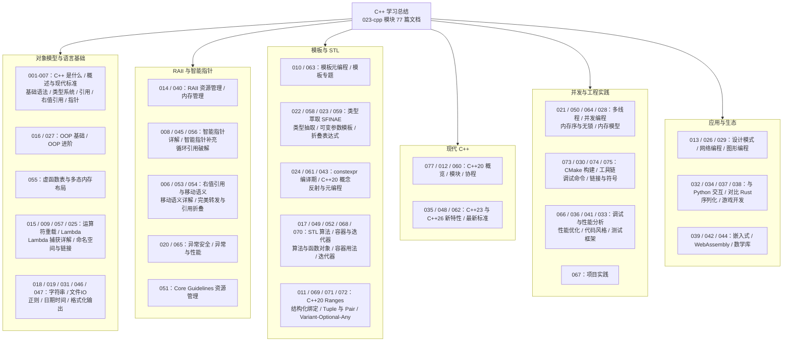

C++ 模块共 77 篇文档，从"C 是什么"讲到 C++26 最新标准。这篇总结把全部内容收拢为一张知识地图，并用"虚拟歌手音乐平台"这一贯穿领域重写核心示例：歌姬类与虚函数表、门票的 RAII 生命周期、P 主对歌曲的所有权、歌单的 STL 算法、多线程售票——每个示例都体现现代 C++ 的惯用写法。读完本文，你应该能回答"C++ 的抽象为什么是零开销的"。

## 前置知识

- [C++ 是什么：从 C 到高性能泛型编程](/cpp/001-WhatIsCpp)：C 与 C++ 的关系、能力版图、第一个现代程序。
- [C++ 基础语法](/cpp/003-CppBasicSyntax)：变量、控制流、函数的现代化写法。
- [C++ 类型系统](/cpp/004-CppTypeSystem)：基本类型、引用与值类别，是移动语义的前置。

## 学习目标

1. 说清虚函数、vptr、vtable 三者的关系，解释动态多态在内存中的实现代价。
2. 用 RAII 改造任何 C 风格的资源配对代码，保证异常安全。
3. 为拥有资源成员的类补齐" rule of five"，正确选择 `unique_ptr/shared_ptr/weak_ptr`。
4. 用 concept 约束的模板编写泛型算法，并解释特化与实例化的时机。
5. 在 CMake 工程中组织多目标构建，并用性能工具定位热点与无效拷贝。

## 知识地图



## 核心概念回顾

### 1. 对象模型：构造、析构与虚函数

C++ 的类把"数据"与"生命周期"绑定在一起：构造函数建立不变量，析构函数负责清理，二者由编译器在正确的时机自动调用。动态多态通过 `virtual` 关键字启用：每个多态对象携带一个虚指针（vptr），指向其类型的虚函数表（vtable），`基类引用/指针调用虚函数` 时运行期按 vtable 分派。这就是"零开销抽象"的典型——不用虚函数就不付任何代价，用了也只付一次间接寻址。

```cpp
#include <iostream>
#include <string>
#include <utility>

// 1. 基类：sing 为虚函数，启用动态多态
class VSinger {
public:
    explicit VSinger(std::string name) : name_(std::move(name)) {}
    virtual ~VSinger() = default;        // 2. 虚析构：经基类指针删除的安全前提
    virtual void sing() const { std::cout << name_ << " 唱了一首歌\n"; }
protected:
    std::string name_;
};

// 3. 派生类重写虚函数，拥有独立的 vtable；override 交由编译器检查签名
class SynthDiv : public VSinger {
public:
    using VSinger::VSinger;
    void sing() const override { std::cout << name_ << " 用电音演唱\n"; }
};

int main() {
    SynthDiv miku("初音未来");
    VSinger& singer = miku;              // 4. 基类引用指向派生对象
    singer.sing();                       // 5. 输出：初音未来 用电音演唱
    return 0;
}
```

### 2. RAII：资源获取即初始化

RAII 是 C++ 区别于其他主流语言的核心理念：把资源的生命周期绑定到对象的生命周期——构造获取，析构释放。由于语言规范保证栈对象离开作用域时析构必定执行（包括异常展开），RAII 在任何执行路径下都不会漏掉清理。C 风格的"路径爆炸"问题（每加一个资源清理路径乘性增长）在 RAII 面前彻底消失；标准库的 `lock_guard`、`fstream`、智能指针全是这一模式的实例。

```cpp
#include <cstdio>

// 1. RAII 类：构造即售出座位，析构即自动退票清算
class ConcertTicket {
public:
    explicit ConcertTicket(int seat) : seat_(seat) {
        std::printf("座位 %d 已售出\n", seat_);
    }
    ~ConcertTicket() noexcept {          // 2. 析构函数不抛异常是 RAII 的底线
        std::printf("座位 %d 已完成清算\n", seat_);
    }
private:
    int seat_;
};

// 3. 任何路径离开作用域都会触发析构，异常安全由此免费获得
void enjoy_concert(bool vip) {
    ConcertTicket ticket(vip ? 1 : 2);
    if (vip) {
        std::printf("走 VIP 通道提前入场\n");
        return;                          // 4. 提前返回也不会漏掉清算逻辑
    }
    std::printf("普通通道检票入场\n");
}

int main() {
    enjoy_concert(true);
    return 0;
}
```

### 3. 智能指针与所有权

现代 C++ 用智能指针显式表达所有权：`unique_ptr` 独占、零开销、可移动不可拷贝，是默认选择；`shared_ptr` 通过引用计数共享所有权，有原子计数开销，仅在确需多方共享时使用；`weak_ptr` 观察而不拥有，用来打破 `shared_ptr` 的循环引用。原则是"能用 `unique_ptr` 就不用 `shared_ptr`，能不用智能指针（栈对象）就不用智能指针"。

```cpp
#include <iostream>
#include <memory>
#include <string>
#include <utility>

// 1. 歌曲资源：析构时打印下架日志，方便观察所有权流转
struct Song {
    std::string title;
    explicit Song(std::string t) : title(std::move(t)) {}
    ~Song() { std::cout << title << " 已下架\n"; }
};

int main() {
    // 2. make_unique 异常安全地创建对象，P 主独占这首歌
    auto song = std::make_unique<Song>("Melt");
    std::cout << "当前曲目：" << song->title << '\n';

    // 3. std::move 转移所有权，转移后原指针为空
    auto newOwner = std::move(song);
    std::cout << "原主人还持有吗：" << (song == nullptr ? "否" : "是") << '\n';

    // 4. 离开作用域时 newOwner 自动析构，全程没有手写 delete
    return 0;
}
```

### 4. 移动语义与完美转发

右值引用（`T&&`）让"接管即将销毁的对象内部资源"成为可能：移动构造只搬指针不搬内容，把深拷贝的代价降到零。规则是：为拥有资源的类实现移动构造与移动赋值（合称 rule of five），并在转移后让源对象处于可析构的有效状态；`std::move` 只是无条件的右值转换，真正搬运发生在移动构造函数里。模板中的完美转发（`std::forward`）则保证参数以原来的值类别继续传递。

```cpp
#include <iostream>
#include <string>
#include <utility>

// 1. 拥有资源成员的类，需要自定义移动构造以避免昂贵的深拷贝
class Playlist {
public:
    explicit Playlist(std::string owner) : owner_(std::move(owner)) {}
    // 2. 移动构造：接管对方的歌单，而非复制一份
    Playlist(Playlist&& other) noexcept
        : owner_(std::move(other.owner_)) {}
    void show() const { std::cout << owner_ << " 的歌单已就绪\n"; }
private:
    std::string owner_;
};

int main() {
    Playlist a("P主 Miku-P");
    Playlist b(std::move(a));            // 3. 触发移动构造而非拷贝构造
    b.show();
    return 0;
}
```

### 5. 模板与 concept 约束

模板是 C++ 泛型编程的基石：编译器按实参类型实例化出具体代码，抽象不付运行时代价。C++20 的 concept 把"类型必须满足哪些操作"写成显式约束，替代了晦涩的 SFINAE：约束不满足时编译器直接报"约束未满足"，错误信息可读性大幅提升。类型萃取、可变参数模板与折叠表达式进一步支持编译期计算，把工作从运行期前移到编译期。

```cpp
#include <concepts>
#include <iostream>

// 1. 用 concept 声明约束：类型必须可比较且可累加
template <typename T>
concept PlayCountable = requires(T a, T b) {
    { a < b } -> std::convertible_to<bool>;
    { a + b };
};

// 2. 只有满足约束的类型才能实例化，错误信息直接指向约束
template <PlayCountable T>
T sum_plays(T a, T b) {
    return a < b ? b : a + b;
}

int main() {
    // 3. 两个 P 主的播放量合并（取较大者逻辑可按需替换）
    std::cout << "合并播放量：" << sum_plays(39, 152) << '\n';
    return 0;
}
```

### 6. STL：容器、迭代器与算法

STL 的架构基石是"算法作用于迭代器区间"：算法不依赖具体容器，只依赖迭代器的能力等级。`vector` 是默认容器（缓存友好、连续内存），`map/unordered_map` 表达键值映射，`sort/transform/accumulate` 覆盖绝大多数数据处理。C++11 之后 lambda 让自定义比较器内联在调用点；C++20 Ranges 管道（`views::filter | views::transform`）则把循环写成声明式组合。

```cpp
#include <algorithm>
#include <iostream>
#include <vector>

int main() {
    // 1. vector 保存演唱会歌单时长（秒）
    std::vector<int> durations{253, 180, 305, 240};

    // 2. STL 算法 + lambda：统计超过 4 分钟的长歌数量
    const auto long_songs =
        static_cast<long>(std::count_if(durations.begin(), durations.end(),
                                        [](int d) { return d >= 240; }));

    // 3. 排序后末元素即最长曲目
    std::sort(durations.begin(), durations.end());
    std::cout << "最长曲目 " << durations.back() << " 秒，长歌共 "
              << long_songs << " 首\n";
    return 0;
}
```

### 7. 并发：thread、mutex 与内存模型

C++11 把并发纳入标准库：`std::thread` 表达执行流，`std::mutex` 与 `lock_guard`（又一个 RAII）保护共享数据，`std::atomic` 提供无锁原子操作，内存模型以 happens-before 关系定义可见性。C++20 补齐 `jthread`（自动 join 与协作取消）、`semaphore`、`latch/barrier` 与协程。并发正确性优先于性能：先写对（锁），再考虑无锁。

```cpp
#include <iostream>
#include <mutex>
#include <thread>
#include <vector>

long tickets = 0;                        // 1. 共享数据：演唱会剩余门票
std::mutex mtx;                          // 2. 互斥量保护复合操作

void sell(int n) {
    for (int i = 0; i < n; ++i) {
        std::lock_guard<std::mutex> lk(mtx);  // 3. lock_guard 是 RAII，异常安全
        --tickets;
    }
}

int main() {
    tickets = 2000;
    std::vector<std::thread> pool;             // 4. 三个售票窗口并发扣减
    for (int i = 0; i < 3; ++i) pool.emplace_back(sell, 600);
    for (auto& t : pool) t.join();             // 5. join 防止主线程提前退出
    std::cout << "剩余门票：" << tickets << '\n';
    return 0;
}
```

### 8. 现代 C++ 与工程工具链

现代 C++ 的演进方向是"更安全、更声明式"：C++17 结构化绑定与 `std::optional`，C++20 模块、Ranges、协程与概念，C++23 `std::expected` 与 `print`，C++26 继续推进反射。工程侧，CMake 是事实标准的构建系统：`cmake -S . -B build` 配置、`cmake --build build` 编译；调试靠 sanitizer（`-fsanitize=address,undefined`）与性能剖析器配合。语言特性与工具链要成对学习。

```cpp
#include <iostream>
#include <map>
#include <string>
#include <utility>

int main() {
    // 1. map 记录每位歌姬的应援色（HEX）
    std::map<std::string, std::string> theme{
        {"初音未来", "#39C5BB"}, {"镜音铃", "#FFE211"}};

    // 2. C++17 结构化绑定：一次解出键与值，循环体更干净
    for (const auto& [singer, color] : theme) {
        std::cout << singer << " 的应援色是 " << color << '\n';
    }
    return 0;
}
```

## 易混淆概念对比

### 栈对象 vs 堆对象

| 维度 | 栈对象 | 堆对象 |
| --- | --- | --- |
| 创建方式 | `Concert t;` 直接定义 | `make_unique/new` 动态创建 |
| 生命周期 | 作用域结束自动析构 | 由智能指针或手动 delete 决定 |
| 分配速度 | 移动栈指针，近乎零成本 | 分配器查找空闲块，较慢 |
| 大小限制 | 受线程栈大小限制（默认约 1-8MB） | 受可用内存限制，可放大型数据 |
| 是否可多态持有 | 值语义会切割（slicing） | 基类指针可安全指向派生对象 |
| 线程安全 | 天然线程私有 | 需要自行考虑同步与所有权 |
| 典型场景 | 小型对象、局部状态、RAII 守卫 | 大数组、多态对象、跨作用域共享 |

### unique_ptr vs shared_ptr vs weak_ptr

| 维度 | unique_ptr | shared_ptr | weak_ptr |
| --- | --- | --- | --- |
| 所有权语义 | 独占，可移动不可拷贝 | 共享，引用计数 | 不拥有，仅观察 |
| 运行时开销 | 零额外开销 | 原子引用计数 + 控制块 | 控制块检查 |
| 可复制 | 否（只能 `std::move`） | 是，计数随之增减 | 是，不影响生命周期 |
| 循环引用风险 | 无 | 有，需配 weak_ptr 打破 | 无，是解决方案 |
| 解引用方式 | `*p` / `p->` | `*p` / `p->` | 先 `lock()` 提升 |
| 默认选择 | 是（首选） | 确需共享时 | 缓存、回调、观察者 |

## 常见误区与排查

### 误区 1：基类析构函数不是虚函数

```cpp
// 错误：经基类指针删除派生对象时只调用了基类析构
struct Concert { ~Concert() { std::printf("场馆清理\n"); } };
struct LiveConcert : Concert { ~LiveConcert() { std::printf("舞台拆除\n"); } };

Concert* c = new LiveConcert();
delete c;                  // 未定义行为：舞台拆除不会执行
```

```cpp
// 修正：基类析构声明为 virtual，删除经基类指针也能正确析构
struct Concert { virtual ~Concert() = default; };
struct LiveConcert : Concert { ~LiveConcert() override { std::printf("舞台拆除\n"); } };
```

### 误区 2：手写 new/delete 管理资源

```cpp
// 错误：任何提前 return 或异常都会跳过 delete，造成泄漏
void run() {
    auto* songs = new std::string[3]{"Melt", "Ghost Rule", "Hand in Hand"};
    if (songs[0].empty()) return;      // 泄漏点
    delete[] songs;
}
```

```cpp
// 修正：用 vector 或智能指针持有资源，所有路径自动清理
void run() {
    std::vector<std::string> songs{"Melt", "Ghost Rule", "Hand in Hand"};
    if (songs[0].empty()) return;      // 析构自动执行，无泄漏
}
```

### 误区 3：shared_ptr 循环引用

```cpp
// 错误：P 主与歌姬互相持有 shared_ptr，计数永远不为零
struct Producer { std::shared_ptr<struct VSinger> singer; };
struct VSinger { std::shared_ptr<Producer> producer; };
// 两者析构函数都不会执行，内存泄漏
```

```cpp
// 修正：把"反向引用"一侧改为 weak_ptr，打破引用环
struct Producer { std::shared_ptr<struct VSinger> singer; };   // 拥有方
struct VSinger  { std::weak_ptr<Producer>  producer; };        // 观察方
```

### 误区 4：move 之后继续使用原对象

```cpp
// 错误：std::move 只是转换，不搬数据；被移走后的对象状态有效但未指定
std::string title = "Melt";
std::string stolen = std::move(title);
std::cout << title;        // 可能是空串，也可能是原值，不可依赖
```

```cpp
// 修正：移动后立即让原对象退出使用，或重新赋值后再用
std::string title = "Melt";
std::string stolen = std::move(title);
title = "Tell Your World"; // 明确重置后再使用
std::cout << stolen << '\n';
```

### 误区 5：范围 for 中修改容器结构

```cpp
// 错误：遍历时插入元素使迭代器失效，行为未定义
std::vector<int> plays{100, 200};
for (int p : plays) {
    if (p > 150) plays.push_back(p);   // 迭代器失效
}
```

```cpp
// 修正：先把结果收集到新容器，循环结束后再统一插入
std::vector<int> plays{100, 200};
std::vector<int> hot;
for (int p : plays) {
    if (p > 150) hot.push_back(p);
}
plays.insert(plays.end(), hot.begin(), hot.end());
```

### 误区 6：捕获局部引用的 lambda 异步执行

```cpp
// 错误：按引用捕获局部变量，异步任务执行时栈帧早已销毁
auto make_task() {
    int seat = 7;
    return [&seat] { std::printf("座位 %d\n", seat); };   // 悬空引用
}
```

```cpp
// 修正：按值捕获（或捕获智能指针），把数据随闭包一起搬走
auto make_task() {
    int seat = 7;
    return [seat] { std::printf("座位 %d\n", seat); };    // 值捕获，安全
}
```

## 自检清单

- [ ] 能画出单继承下对象的内存布局，指出 vptr 与 vtable 的位置
- [ ] 能解释 RAII 为什么天然异常安全，并举出标准库中的三个 RAII 类型
- [ ] 能为拥有资源成员的类写出完整的" rule of five"
- [ ] 能说出 `unique_ptr/shared_ptr/weak_ptr` 的选择标准并破解循环引用
- [ ] 能解释 `std::move` 与移动构造函数各自承担的职责
- [ ] 能用 concept 约束写一个泛型函数，并说出它与 SFINAE 的关系
- [ ] 能根据访问模式选择 `vector/map/unordered_map`，并说明理由
- [ ] 能写出用 `lock_guard` 保护共享计数的多线程程序
- [ ] 能用 CMake 组织多文件构建并用 AddressSanitizer 排查内存错误
- [ ] 能说出 C++20/23 至少三个特性（模块、协程、Ranges、expected 等）的用途

## 后续学习路径

1. 精读 [右值引用与移动语义](/cpp/006-RvalueReferenceMoveSemantics) 与 [完美转发与引用折叠](/cpp/054-PerfectForwardingReferenceCollapse)，补齐值类别与转发的完整理论。
2. 攻克 [模板元编程](/cpp/010-TemplateMetaprogramming) 与 [C++20 概念](/cpp/061-Cpp20Concept)，理解零开销抽象的实现机制。
3. 进入 [内存序与无锁编程](/cpp/064-MemoryOrderLockFree)，在 [多线程与并发](/cpp/021-MultithreadingConcurrency) 之上追求可伸缩性能。
4. 按 [C++ 性能优化](/cpp/036-CppPerformance) 的方法论，用剖析器驱动地优化一次真实热点。
5. 以 [C++ 项目实践](/cpp/067-CppProjectPractice) 收官，用 [CMake 构建](/cpp/073-CMakeBuild) 搭一个虚拟歌手音乐平台的命令行播放器。
