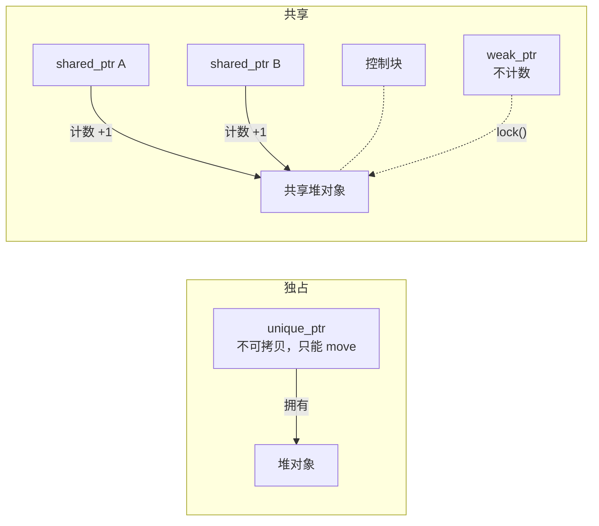

## 前置知识

- 已完成 [C++ 指针](/cpp/120-CppPointers)：知道 `new` 在堆上分配、`delete` 负责释放，见过悬垂指针有多阴险。

> 分工说明：130、140 两篇合讲智能指针。本篇是主教学，立模型：裸 new/delete 为什么必然漏、unique_ptr 独占所有权、shared_ptr 引用计数、weak_ptr 破循环引用；[智能指针深水区](/cpp/140-CppSmartPointer) 拆机制与工程细节：控制块与分配次数、线程安全边界、enable_shared_from_this、自定义删除器，以及什么时候连 shared_ptr 都不要。两篇示例互不重复，本篇是后一篇的地基。

## 学习目标

读完本文你将能够：

1. 指出裸 `new`/`delete` 在异常与提前返回路径下必然漏释放的原因，并用 `unique_ptr` 修复；
2. 说出 `make_unique` 优于裸 `new` 的两点；
3. 手算 shared_ptr 拷贝/析构序列的 `use_count`，说出归零瞬间发生什么；
4. 解释循环引用为什么让计数永不归零，并用 `weak_ptr` 修好；
5. 在「独占 / 共享 / 只观察」场景里选对指针类型。

预计 60 到 90 分钟。

## 1. 问题：一行异常，让清理代码永远执行不到

一个关卡加载器，资源用裸指针手工管理（示意骨架）：

```cpp
void loadLevel() {
    Texture* wall = new Texture("wall.png");
    Texture* sky  = new Texture("sky.png");
    if (!sky->loaded()) {
        delete wall;                                    // 提前退出，记得补一个
        throw std::runtime_error("sky.png 加载失败");
    }
    buildScene(wall, sky);   // 若这里抛异常……
    delete wall;             // ……下面两行永远执行不到
    delete sky;
}
```

这不是粗心，是**结构性缺陷**：每条提前离开函数的路径——每个 early return、每个 throw——都必须补一份释放。`buildScene` 一抛异常，最后两行 `delete` 被直接跳过，两个 Texture 悄悄漏掉；路径越多，漏的概率越接近必然。

[120 篇](/cpp/120-CppPointers) 末尾的预言在这里兑现：「裸指针只看不拥有，所有权交给智能指针」。思路很朴素——把 `delete` 塞进一个**栈上对象的析构函数**：栈对象离开作用域必然析构，正常返回、提前返回、异常展开（unwinding，异常发生时逐层退出函数并析构沿途局部对象），一条路都漏不掉。

## 2. 对照实验：异常路径下谁在替你 delete

```cpp
#include <iostream>
#include <memory>
#include <stdexcept>
#include <string>

struct Texture {
    explicit Texture(std::string name) : name_(std::move(name)) {
        std::cout << "载入 " << name_ << '\n';
    }
    ~Texture() { std::cout << "释放 " << name_ << '\n'; }
    std::string name_;
};

void buildScene() { throw std::runtime_error("场景数据损坏"); }

void withSmartPointer() {
    auto wall = std::make_unique<Texture>("wall.png");
    buildScene();                        // 抛异常，函数从这里退出
    std::cout << "这行永远执行不到\n";
}

int main() {
    try {
        withSmartPointer();
    } catch (const std::exception& e) {
        std::cout << "捕获异常: " << e.what() << '\n';
    }
}
```

预期输出：

```text
载入 wall.png
释放 wall.png
捕获异常: 场景数据损坏
```

关键在第二行：函数里没写一个 `delete`，异常也抛了，但「释放 wall.png」照样出现——`wall` 是栈上的 `unique_ptr`，异常展开必然路过它的析构函数，`delete` 就藏在里面。换回裸 `new` 再跑，泄漏无声无息；用 `-fsanitize=address` 编译可让 LeakSanitizer 点名（原文见第 6 节）。

## 3. 核心概念：所有权交给类型系统

`std::unique_ptr<T>` 是**独占所有权**：同一时刻只有一个 `unique_ptr` 拥有对象。它不可拷贝——拷贝等于两个主人，析构时双重 `delete`；只能移动——`std::move` 转手，源指针变空。这不是约定，是编译期强制：

```cpp
auto wall  = std::make_unique<Texture>("wall.png");
auto twin  = wall;                        // 想复制一个"主人"
auto moved = std::move(wall);             // 正确转手：moved 接管，wall 变空
std::cout << (wall == nullptr) << '\n';
```

拷贝那行的真实报错（g++）：

```text
error: use of deleted function 'std::unique_ptr<_Tp, _Dp>::unique_ptr(const std::unique_ptr<_Tp, _Dp>&) [with _Tp = Texture; _Dp = std::default_delete<Texture>]'
```

`deleted function` 表示被 `= delete` 禁用，括号里是拷贝构造——想转手就用 `std::move`。注释掉拷贝行后程序输出：

```text
1
```

120 篇里悬垂只能靠纪律防，这里被类型系统挡在编译期；move 后源指针当 `nullptr` 对待，是移动语义在所有权上的落地。

## 4. make_unique 优于 new 的两点

第一，**类型名只出现一次**。裸 `new` 版创建要写两遍类型：`std::unique_ptr<Texture> wall(new Texture("wall.png"));`；`make_unique` 版只要一遍：`auto sky = std::make_unique<Texture>("sky.png");`。改类型时前者要改两处，漏改轻则编译错、重则行为微妙，后者没有第二处可漏。

第二，**表达式里的异常安全**。`new` 版进函数传参时有一道缝：

```cpp
// 缝隙示意：new Texture 已执行、unique_ptr 还没接住时，
// 若 loadPalette() 抛异常，刚 new 的对象没人管——泄漏
render(std::unique_ptr<Texture>(new Texture("a.png")), loadPalette());

// make_unique 把「分配」与「接管」焊成一步，中间没有缝
render(std::make_unique<Texture>("a.png"), loadPalette());
```

C++17 起编译器才被禁止把参数里的 `new Texture` 与 `loadPalette()` 求值交错，此前这行代码真的可能泄漏；`make_unique` 在任何版本下都没有这条缝。它是 C++14 才补进标准的（C++11 只有 make_shared）。

## 5. shared_ptr：共享所有权与 use_count 实验

`unique_ptr` 解决「一个主人」。可有些对象天生多主：一份配置被网络层、UI 层、日志层同时用着，**最后一个用完的**负责释放。`std::shared_ptr` 用引用计数实现——拷贝加一，析构减一，归零的瞬间对象析构：

```cpp
#include <iostream>
#include <memory>

int main() {
    auto shared = std::make_shared<int>(42);
    std::cout << "创建后:    " << shared.use_count() << '\n';
    {
        auto copy1 = shared;                 // 拷贝：计数 +1
        auto copy2 = shared;
        std::cout << "拷贝两份后: " << shared.use_count() << '\n';
    }                                        // copy1、copy2 离开作用域：各 -1
    std::cout << "内层退出:  " << shared.use_count() << '\n';
    shared.reset();                          // 主动放弃所有权：-1
    std::cout << "reset 后:   " << shared.use_count() << '\n';
}
```

预期输出：

```text
创建后:    1
拷贝两份后: 3
内层退出:  1
reset 后:   0
```

计数归零的瞬间对象立即析构——确定性析构，与 GC 语言「等回收器心情」完全不同。`use_count` 是教学仪表盘，业务代码别靠它做逻辑；每个 shared_ptr 比裸指针多 8 字节、拷贝还有一次原子加法——多出的字节指向隐藏的「控制块」，[深水区](/cpp/140-CppSmartPointer) 拆开看。

## 6. weak_ptr：循环引用泄漏的现场

shared_ptr 的保活机制有个死角：两个对象互相持有。公会记录队长、队长记录公会：

```cpp
#include <iostream>
#include <memory>

struct Player;

struct Guild {
    std::shared_ptr<Player> leader;          // 公会持有队长
    ~Guild() { std::cout << "公会解散\n"; }
};

struct Player {
    std::shared_ptr<Guild> guild;            // 队长也持有公会——互相保活
    ~Player() { std::cout << "玩家下线\n"; }
};

int main() {
    auto guild  = std::make_shared<Guild>();
    auto player = std::make_shared<Player>();
    guild->leader = player;
    player->guild = guild;
    std::cout << "main 结束\n";
}
```

预期输出：

```text
main 结束
```

两个析构消息一个都没出现：`main` 结束时局部 `player` 析构，但 `guild->leader` 还持有 Player；局部 `guild` 析构，但 `player->guild` 还持有 Guild——**双方互相保活，谁的计数都到不了 0**。LeakSanitizer 抓现行（`g++ -std=c++17 -fsanitize=address leak.cpp && ./a.out`，字节数与地址随平台而异）：

```text
==23305==ERROR: LeakSanitizer: detected memory leaks

Direct leak of 64 byte(s) in 2 object(s) allocated from:
    #0 0x7f... in operator new(unsigned long)
    #1 0x7f... in main
SUMMARY: AddressSanitizer: 128 byte(s) leaked in 2 allocation(s).
```

解药是把反向那条引用改成 `std::weak_ptr`——只观察、不拥有，不进计数：

```cpp
#include <iostream>
#include <memory>

struct Player;

struct Guild {
    std::shared_ptr<Player> leader;          // 拥有方向：公会拥有队长
    ~Guild() { std::cout << "公会解散\n"; }
};

struct Player {
    std::weak_ptr<Guild> guild;              // 反向：玩家只观察公会
    ~Player() { std::cout << "玩家下线\n"; }
};

int main() {
    auto guild  = std::make_shared<Guild>();
    auto player = std::make_shared<Player>();
    guild->leader = player;
    player->guild = guild;
    std::cout << "guild 被强引用: " << player->guild.use_count() << '\n';
    std::cout << "main 结束\n";
}
```

预期输出：

```text
guild 被强引用: 1
main 结束
公会解散
玩家下线
```

析构消息到齐：weak_ptr 不进计数，环被拆开，析构链跑完。需要访问时用 `guild.lock()` 临时升级成 shared_ptr。判别法则一句话：**拥有方向用 shared_ptr，反向引用和观察者用 weak_ptr**。lock/expired 组合、循环引用破环与缓存场景，[140 篇](/cpp/140-CppSmartPointer) 第 6-9 节专门展开。

## 7. 所有权心智模型



选型口诀：一个主人 → `unique_ptr`（默认答案，零开销）；多个主人、最后一个走的人锁门 → `shared_ptr`；要引用但不该保活（反向、缓存、观察者）→ `weak_ptr`；只看不拥有、临时用 → 裸指针或引用（120 篇纪律）。

## 8. 常见错误与调试实录

错误一：把同一个裸指针喂给两个 shared_ptr。每次构造都新建控制块，两个控制块互不知情、各自计数为 1，析构时对同一块内存 delete 两次：

```cpp
int* raw = new int(42);
std::shared_ptr<int> a(raw);
std::shared_ptr<int> b(raw);   // 第二个控制块！
```

```text
==21013==ERROR: AddressSanitizer: attempting double-free on 0x602000000010 in thread T0
SUMMARY: AddressSanitizer: double-free
```

读报错三步：`double-free` 说明同一地址被释放两次；出错栈与 `freed by` 栈都指向两次 shared_ptr 构造；修法——第二个起一律拷贝（`auto b = a;`）共享控制块。至于 `new int[10]` 这类数组要用 `delete[]`，配错删除器是 UB，交给 [深水区](/cpp/140-CppSmartPointer) 的删除器一节处理。

错误二：move 之后再解引用源指针。转手后源是空的，解引用就是 120 篇的空指针崩溃：

```cpp
auto p = std::make_unique<int>(7);
auto q = std::move(p);
std::cout << *p << '\n';       // p 已变空
```

```text
==21944==ERROR: AddressSanitizer: SEGV on unknown address 0x000000000000
SUMMARY: AddressSanitizer: SEGV
```

`if (p)` 判空能挡住运行时；更好的纪律是读代码时就认定：move 过的源指针是空的。

## 9. 修改实验

1. 把第 2 节的 `make_unique` 改回裸 `new`/`delete`，用 `-fsanitize=address` 编译运行，亲眼看 LeakSanitizer 报泄漏；改回去再看报告清零——做三遍，直到看到 `new` 就条件反射想到路径问题；
2. 把第 5 节的第二个拷贝改成 `auto copy2 = std::move(shared);`，先笔算三处 `use_count()` 各输出几（提示：move 不改计数，但会掏空源指针），再运行验证；
3. 给第 6 节公会加 `std::vector<std::weak_ptr<Player>> members`，遍历打印所有存活成员、跳过已下线的（`expired()` 判断）。

## 10. 小练习

预测题（先写答案再运行，5 分钟）：

```cpp
auto a = std::make_shared<int>(1);
auto b = a;
std::weak_ptr<int> w = a;
std::cout << a.use_count() << '\n';
b.reset();
std::cout << a.use_count() << '\n';
std::cout << w.expired() << '\n';
```

修改题（15 分钟）：把第 5 节实验改成 `std::vector<std::shared_ptr<int>> box`，放三个指向**同一个对象**的 shared_ptr，打印每次 `push_back` 与 `erase` 后的 `use_count()`，验证「容器也是主人」。

修 Bug 题（15 分钟）：下面的函数偶发崩溃，ASan 报错如下，按读报错三步定位并修复：

```cpp
std::shared_ptr<int> getValue() {
    int value = 42;
    return std::shared_ptr<int>(&value);   // 问题在这里
}
```

```text
==22551==ERROR: AddressSanitizer: attempting free on address which was not malloc()-ed: 0x7ffd... in thread T0
SUMMARY: AddressSanitizer: bad-free
```

---

验证（先写答案再看）：

```text
预测题: 2 / 1 / 0 —— b.reset 后对象还活着，weak 未过期
修 Bug 题: 0x7ffd 开头是栈地址（120 篇讲过），bad-free 说明析构时对栈地址执行了
delete；shared_ptr 只能管 new 出来的对象。修法：return std::make_shared<int>(42);
```

## 11. 实际场景

- 游戏背包：`std::vector<std::unique_ptr<Item>>` 存格子，工厂返回 `unique_ptr` 表达「调用者接管」，背包析构整包自动清理；
- 资源管理器：纹理被多个模型引用时用 `shared_ptr<Texture>` 保活，管理器索引表存 `weak_ptr` 做缓存查询——共享保活、观察不拦路；
- UI 与数据源：界面注册进数据源时存 `weak_ptr`，数据源销毁后 `lock()` 拿到空指针自然跳过刷新，不踩悬垂崩溃。

## 12. 与之前和之后的知识的关系

- 往前：[C++ 指针](/cpp/120-CppPointers) 的「只看不拥有」纪律在这里升级为类型系统强制；移动语义（090/100 篇）解释了 unique_ptr 为什么只能 move；
- 往后：[智能指针深水区](/cpp/140-CppSmartPointer) 拆控制块、线程边界与自定义删除器；[智能指针深水区](/cpp/140-CppSmartPointer) 的 weak_ptr 与循环引用章节把第 6 节拆到 use_count 逐行级别；[RAII](/cpp/160-RAIIResourceManagement) 把本文思路推广到文件、锁、连接等一切资源；
- 更远：容器（240 篇起）装 `unique_ptr` 时不可拷贝的要求，正是移动语义的落地。

## 13. 官方文档

- cppreference unique_ptr：https://en.cppreference.com/w/cpp/memory/unique_ptr
- cppreference shared_ptr：https://en.cppreference.com/w/cpp/memory/shared_ptr
- cppreference weak_ptr：https://en.cppreference.com/w/cpp/memory/weak_ptr
- C++ Core Guidelines R.11（避免显式 new/delete）：https://isocpp.github.io/CppCoreGuidelines/CppCoreGuidelines#R11

## 14. 自我检查

- 能对着第 2 节输出讲清：异常展开为什么救不了手工 delete、却救得了 unique_ptr；
- 能背出 make_unique 优于 new 的两点，并说出「C++14 补票」这条版本线；
- 能手算拷贝/reset 序列的 use_count，说出归零瞬间的行为；
- 能画出公会-队长互指的保活图，写出 weak_ptr 修复；
- 能给四个场景（独占/共享/观察/临时使用）各选对指针。

## 本章总结

裸 new/delete 的释放语句隔着整个函数体，任何提前退出的路径都可能跳过它们——unique_ptr 把 delete 塞进栈对象析构，让所有路径无路可逃。make_unique 一处类型、一步分配，堵住求值缝隙。shared_ptr 用引用计数实现「最后一个主人锁门」，weak_ptr 拆掉互相保活的死环。三种指针加上 120 篇的裸指针纪律，构成现代 C++ 的所有权工具箱。

## 下一步

进入 [智能指针深水区](/cpp/140-CppSmartPointer)：控制块里装了什么、线程安全边界画在哪、对象怎么安全地拿「管理着自己」的那份 shared_ptr、FILE* 这类非内存资源怎么包成 RAII。
