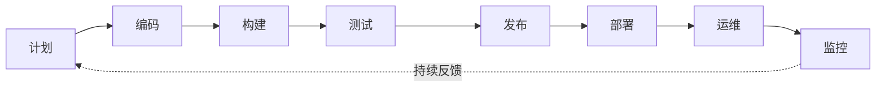

## 知识点地图

- **知识类别**：DevOps 方法论 / 模块导论（理念与地图，不写具体命令）。
- **解决什么问题**：不知道 DevOps 与传统运维、与 SRE 差在哪，学后面的工具就像没有地图的城市漫游。本篇给定位、给闭环、给本模块 40+ 篇的阅读顺序。
- **什么时候用到**：入门第一篇；向非技术同事解释"你们这个岗位是干嘛的"；规划自己的学习路线。

## DevOps：打破一堵墙

传统研发流程里，开发写完代码"扔过墙"给运维部署——开发追求变化快、运维追求稳定不变，两个目标天然打架，墙两侧互相甩锅。

DevOps（Development + Operations）是一种强调**开发与运维协作**的文化和实践，做法是把"部署、发布、监控"这些原来运维独占的环节**工程化、自动化**，让整个链路对开发可见可控。目的三个：缩短交付周期、提高部署频率、降低变更失败率。

## DevOps 与 SRE 的关系

一句话：**SRE 是 Google 用工程方法实现 DevOps 的具体流派**。理念同源（自动化、协作、小步快跑），差异在方法与指标：

| 维度 | DevOps | SRE |
| --- | --- | --- |
| 理念 | 文化与协作 | 工程化方法论 |
| 目标 | 加速交付 | 保证可靠性 |
| 方法 | CI/CD、自动化 | SLI/SLO、错误预算 |
| 角色 | 全栈工程师 | 可靠性工程师 |
| 核心指标 | 部署频率、变更前置时间 | 可用性、延迟、错误率 |

SRE 的核心创新是**把可靠性变成可谈判的数字**：定 SLO（比如可用性 99.9%），SLO 内的错误预算可以花在发版上；预算烧完就冻结变更修稳定性——"稳定与速度的矛盾"从吵架变成算术。实践细节见[监控与可观测性](/devops/240-MonitorAndObservability)与 [On-Call 实战](/devops/310-OnCallPractice)。

## 核心实践闭环



| 实践 | 描述 | 本模块对应篇目 |
| --- | --- | --- |
| CI/CD | 持续集成与持续交付 | [CI/CD 流水线](/devops/140-CICDPipeline)、Jenkins、GitLab CI |
| IaC | 基础设施即代码 | [IaC](/devops/200-IaC)、Terraform、Ansible |
| 容器化 | 应用容器化部署 | [Docker](/devops/050-ContainerDocker)、[Kubernetes 核心](/devops/090-KubernetesCoreDetailed) |
| 监控 | 全链路可观测性 | [Prometheus](/devops/250-Prometheus)、[Grafana](/devops/260-GrafanaDashboards)、[日志管理](/devops/270-LogManagement) |
| 自动化 | 减少手动操作 | [Shell 脚本](/devops/020-ShellScriptProgramming)、Ansible |

反馈箭头是闭环的灵魂：监控发现的问题回到计划与代码，"发布后出事靠人肉救"才变成"发布前指标先说话"。

## 本模块学习地图

按依赖顺序分六层，每层 2-4 篇：

```text
第一层 地基      010 理念（本篇）→ 015 Linux 系统管理 → 020 Shell 脚本 → 030 包管理 → 040 网络安全
第二层 容器      050 Docker → 060 Dockerfile → 070 容器安全
第三层 编排      090 K8s 核心资源 → 095 K8s 存储 → 098 K8s 排障 → 100 kubectl → 110/120 Helm → 130 Service Mesh
第四层 交付      140 CI/CD → 145 渐进交付 → 150/160 Jenkins/GitLabCI → 170 测试门禁 → 180/185/190 GitOps 三篇
第五层 基建即码  200 IaC → 210 Terraform → 220 Ansible → 235 密钥与配置中心
第六层 运营      240-290 监控日志三线 → 310/320/330 On-Call/复盘/排障 → 350 高可用 → 370-400 消息队列 → 410 数据库运维
```

初学者的取舍建议：第一、二层线性读完；第三层读到能看懂 090 即可暂离；第四到六层按岗位挑——后端开发读 140/145/170/250 足够上手，专职运维/SRE 顺序全读。

## 入门三问

**"要背多少命令？"**——不需要背。命令是配角，心智模型是主线：知道"磁盘水位要看挂载点"比背 df 参数重要。日常命令清单见 [Linux 系统管理](/devops/015-LinuxSystemManagement)，用的时候查。

**"没有生产环境怎么练？"**——虚拟机或云上按小时计费的实例就是练习场。本模块动手环节都能在单机 Docker/虚拟机完成；K8s 用 minikube/kind，监控栈用 docker-compose 一键起。

**"DevOps 是一个岗位吗？"**——是文化也是岗位谱系：小公司是"全栈工程师顺手做 DevOps"，大厂拆成平台工程/SRE/交付工程师。能力内核一致：脚本、容器、CI/CD、监控四件套。

## 检验清单

- 能用三句话向非技术同事解释 DevOps 解决什么问题；
- 能说出 SRE 与 DevOps 的关系及 SLO/错误预算的博弈机制；
- 能按本模块地图说出六层结构并规划自己的阅读顺序；
- 知道理念篇到此为止，动手从 [Linux 系统管理](/devops/015-LinuxSystemManagement)开始。

## 下一步

- [Linux 系统管理与服务管理](/devops/015-LinuxSystemManagement)：动手第一站；
- [Shell 脚本编程](/devops/020-ShellScriptProgramming)：把命令串成自动化；
- [On-Call 实战](/devops/310-OnCallPractice)：理念如何落到值班制度。

## 参考与致谢

- Google SRE Book（Google 出版，在线免费阅读）：<https://sre.google/books/>
- The DevOps Handbook 相关概念综述（概念介绍层面，本篇为原创综述）。
