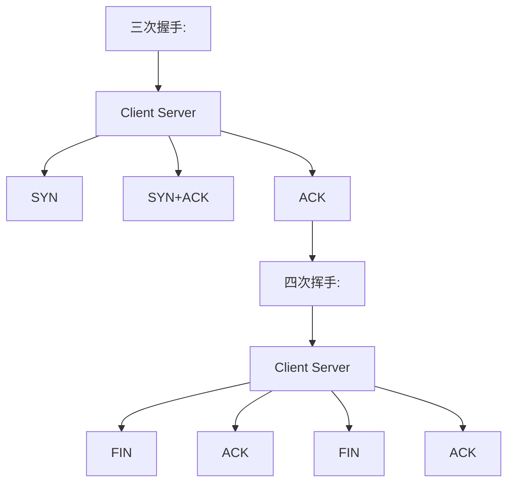
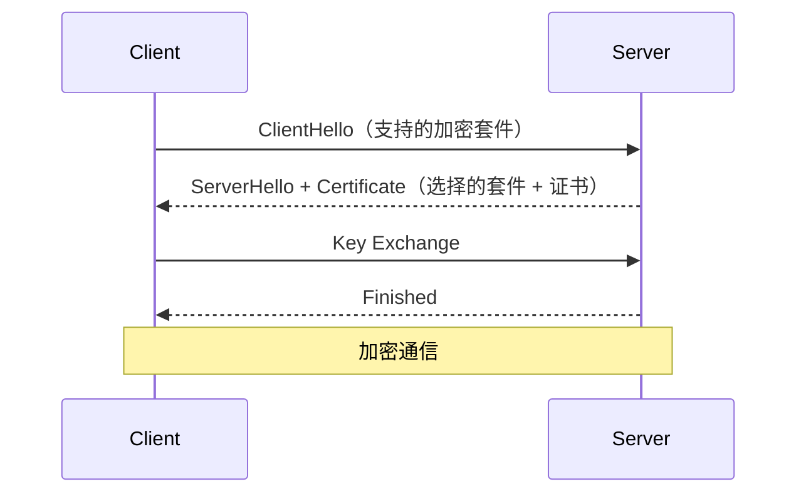
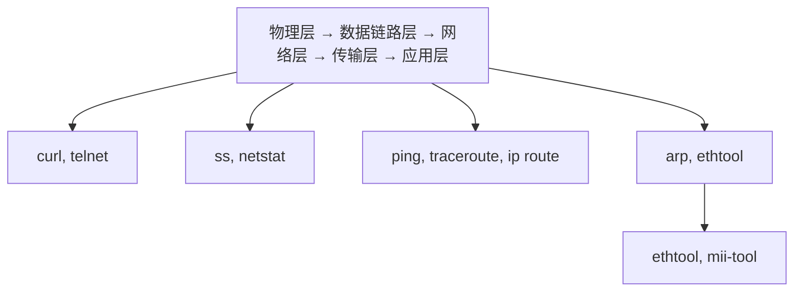

## 学习目标

本文是「运维与中间件」模块的第 4 篇，难度定位为进阶。重点内容：TCP/IP 协议栈、DNS/HTTP/HTTPS、防火墙、SSL/TLS、SSH 安全与网络故障排查。

主要章节：

- 1. TCP/IP 协议栈
- 2. DNS
- 3. HTTP/HTTPS
- 4. 防火墙
- 5. SSH 安全
- 6. VPN
- ……共 19 个章节

## 1. TCP/IP 协议栈

### 1.1 OSI 七层 vs TCP/IP 四层

| OSI        | TCP/IP     | 协议                | 数据单元  |
| :--------- | :--------- | :------------------ | :-------- |
| 应用层     | 应用层     | HTTP, DNS, SSH, FTP | 数据      |
| 表示层     | 应用层     | TLS/SSL, JPEG       | 数据      |
| 会话层     | 应用层     | RPC, NetBIOS        | 数据      |
| 传输层     | 传输层     | TCP, UDP            | 段/数据报 |
| 网络层     | 网络层     | IP, ICMP, ARP       | 包        |
| 数据链路层 | 网络接口层 | Ethernet, PPP       | 帧        |
| 物理层     | 网络接口层 | 电信号、光纤        | 比特      |

### 1.2 TCP 三次握手与四次挥手



### 1.3 常用端口

| 端口 | 协议       | 用途      |
| :--- | :--------- | :-------- |
| 22   | SSH        | 远程登录  |
| 53   | DNS        | 域名解析  |
| 80   | HTTP       | Web 服务  |
| 443  | HTTPS      | 安全 Web  |
| 3306 | MySQL      | 数据库    |
| 5432 | PostgreSQL | 数据库    |
| 6379 | Redis      | 缓存      |
| 8080 | HTTP Alt   | 代理/应用 |
| 9090 | Prometheus | 监控      |

## 2. DNS

### 2.1 DNS 解析流程

```
浏览器缓存 → 系统缓存 → 路由器缓存 → ISP DNS
    → 根域名服务器 → 顶级域名服务器 → 权威域名服务器
```

### 2.2 DNS 记录类型

| 类型      | 描述       | 示例                                |
| :-------- | :--------- | :---------------------------------- |
| **A**     | IPv4 地址  | `example.com → 93.184.216.34`       |
| **AAAA**  | IPv6 地址  | `example.com → 2606:2800:220:1:...` |
| **CNAME** | 别名       | `www.example.com → example.com`     |
| **MX**    | 邮件服务器 | `example.com → mail.example.com`    |
| **TXT**   | 文本记录   | SPF、DKIM 验证                      |
| **NS**    | 域名服务器 | `example.com → ns1.dns.com`         |
| **SRV**   | 服务记录   | `_http._tcp → server:port`          |

### 2.3 DNS 排查

```bash
# DNS 查询
dig example.com              # 完整查询
dig +short example.com       # 仅显示 IP
nslookup example.com         # Windows 兼容
host example.com             # 简洁输出

# 指定 DNS 服务器
dig @8.8.8.8 example.com

# 反向解析
dig -x 93.184.216.34

# 追踪解析过程
dig +trace example.com

# DNS 缓存清理
sudo systemd-resolve --flush-caches    # systemd-resolved
sudo rndc flush                         # BIND
```

## 3. HTTP/HTTPS

### 3.1 HTTP 请求方法

| 方法   | 用途       | 幂等 | 安全 |
| :----- | :--------- | :--- | :--- |
| GET    | 获取资源   | 是   | 是   |
| POST   | 创建资源   | 否   | 否   |
| PUT    | 更新资源   | 是   | 否   |
| DELETE | 删除资源   | 是   | 否   |
| PATCH  | 部分更新   | 否   | 否   |
| HEAD   | 获取头信息 | 是   | 是   |

### 3.2 HTTP 状态码

| 范围    | 类别       | 常见码                                                                                 |
| :------ | :--------- | :------------------------------------------------------------------------------------- |
| **1xx** | 信息       | 100 Continue                                                                           |
| **2xx** | 成功       | 200 OK, 201 Created, 204 No Content                                                    |
| **3xx** | 重定向     | 301 永久, 302 临时, 304 未修改                                                         |
| **4xx** | 客户端错误 | 400 Bad Request, 401 Unauthorized, 403 Forbidden, 404 Not Found, 429 Too Many Requests |
| **5xx** | 服务端错误 | 500 Internal Error, 502 Bad Gateway, 503 Unavailable, 504 Timeout                      |

### 3.3 HTTPS 与 TLS



```bash
# 查看证书信息
openssl s_client -connect example.com:443 -showcerts

# 检查证书过期时间
echo | openssl s_client -connect example.com:443 2>/dev/null | \
  openssl x509 -noout -dates

# 生成自签名证书
openssl req -x509 -newkey rsa:4096 -keyout key.pem -out cert.pem \
  -days 365 -nodes -subj "/CN=localhost"
```

## 4. 防火墙

### 4.1 iptables

```bash
# 查看规则
iptables -L -n -v
iptables -t nat -L -n

# 允许 SSH
iptables -A INPUT -p tcp --dport 22 -j ACCEPT

# 允许已建立的连接
iptables -A INPUT -m state --state ESTABLISHED,RELATED -j ACCEPT

# 允许本地回环
iptables -A INPUT -i lo -j ACCEPT

# 允许 HTTP/HTTPS
iptables -A INPUT -p tcp --dport 80 -j ACCEPT
iptables -A INPUT -p tcp --dport 443 -j ACCEPT

# 默认拒绝
iptables -P INPUT DROP
iptables -P FORWARD DROP
iptables -P OUTPUT ACCEPT

# 保存规则
iptables-save > /etc/iptables/rules.v4
```

### 4.2 firewalld

```bash
# 基本操作
systemctl start firewalld
systemctl enable firewalld
firewall-cmd --state

# 区域管理
firewall-cmd --get-zones               # 列出区域
firewall-cmd --get-default-zone        # 默认区域
firewall-cmd --set-default-zone=public

# 开放端口
firewall-cmd --add-port=80/tcp --permanent
firewall-cmd --add-service=http --permanent
firewall-cmd --reload

# 查看规则
firewall-cmd --list-all
firewall-cmd --list-ports

# 富规则（精细控制）
firewall-cmd --add-rich-rule='
  rule family="ipv4"
  source address="10.0.0.0/8"
  port port="3306" protocol="tcp"
  accept' --permanent
```

### 4.3 UFW（Ubuntu）

```bash
# 基本操作
ufw enable
ufw status verbose

# 开放端口
ufw allow 22/tcp
ufw allow 80/tcp
ufw allow 443/tcp
ufw allow from 10.0.0.0/8 to any port 3306

# 拒绝
ufw deny 3306/tcp
ufw delete allow 8080/tcp

# 限流（防暴力破解）
ufw limit 22/tcp
```

## 5. SSH 安全

### 5.1 SSH 密钥认证

```bash
# 生成密钥对
ssh-keygen -t ed25519 -C "user@host"
# 或 RSA
ssh-keygen -t rsa -b 4096 -C "user@host"

# 复制公钥到服务器
ssh-copy-id user@server
# 或手动
cat ~/.ssh/id_ed25519.pub | ssh user@server "mkdir -p ~/.ssh && cat >> ~/.ssh/authorized_keys"

# SSH 配置文件
cat ~/.ssh/config
Host myserver
    HostName 192.168.1.100
    User deploy
    Port 22
    IdentityFile ~/.ssh/id_ed25519
    ForwardAgent yes
```

### 5.2 SSH 加固

```bash
# /etc/ssh/sshd_config
Port 2222                          # 修改默认端口
PermitRootLogin no                 # 禁止 root 登录
PasswordAuthentication no          # 禁用密码认证
PubkeyAuthentication yes           # 启用密钥认证
MaxAuthTries 3                     # 最大尝试次数
AllowUsers deploy admin            # 限制允许的用户
ClientAliveInterval 300            # 空闲超时
ClientAliveCountMax 2              # 超时次数
LoginGraceTime 30                  # 登录超时
X11Forwarding no                   # 禁用 X 转发

# 重启 SSH
sudo systemctl restart sshd
```

### 5.3 SSH 隧道

```bash
# 本地端口转发
ssh -L 8080:localhost:80 user@server    # 本地 8080 → 服务器 80

# 远程端口转发
ssh -R 9090:localhost:3000 user@server  # 服务器 9090 → 本地 3000

# 动态端口转发（SOCKS 代理）
ssh -D 1080 user@server

# 跳板机
ssh -J bastion user@internal-server
```

## 6. VPN

### 6.1 WireGuard

```bash
# 安装
sudo apt install wireguard

# 生成密钥
wg genkey | tee privatekey | wg pubkey > publickey

# 服务端配置 /etc/wireguard/wg0.conf
[Interface]
PrivateKey = <server_private_key>
Address = 10.0.0.1/24
ListenPort = 51820
PostUp = iptables -A FORWARD -i wg0 -j ACCEPT; iptables -t nat -A POSTROUTING -o eth0 -j MASQUERADE
PostDown = iptables -D FORWARD -i wg0 -j ACCEPT; iptables -t nat -D POSTROUTING -o eth0 -j MASQUERADE

[Peer]
PublicKey = <client_public_key>
AllowedIPs = 10.0.0.2/32

# 客户端配置
[Interface]
PrivateKey = <client_private_key>
Address = 10.0.0.2/24
DNS = 8.8.8.8

[Peer]
PublicKey = <server_public_key>
Endpoint = <server_ip>:51820
AllowedIPs = 0.0.0.0/0  # 全部流量走 VPN
PersistentKeepalive = 25

# 启动
sudo wg-quick up wg0
sudo systemctl enable wg-quick@wg0
```

## 7. 网络故障排查

### 7.1 排查流程



### 7.2 常用排查命令

```bash
# 连通性
ping -c 4 8.8.8.8                    # ICMP 连通
traceroute example.com               # 路由追踪
mtr -rwzbc 100 example.com          # 持续路由统计

# 端口连通
telnet example.com 443               # TCP 连通
nc -zv example.com 443               # 端口扫描
curl -v https://example.com          # HTTP 测试

# DNS 排查
dig example.com                      # DNS 解析
nslookup example.com                 # DNS 查询

# 路由排查
ip route                             # 路由表
ip route get 8.8.8.8                 # 到目标的路径

# 抓包分析
tcpdump -i eth0 port 80              # 抓 HTTP 包
tcpdump -i eth0 host 10.0.0.1        # 抓特定主机
tcpdump -i eth0 -w capture.pcap      # 保存到文件

# 连接统计
ss -tlnp                             # TCP 监听
ss -s                                # 连接概览
netstat -an | grep :80 | wc -l       # 80 端口连接数
```

### 7.3 常见故障与解决

| 故障现象     | 可能原因          | 排查方法                       |
| :----------- | :---------------- | :----------------------------- |
| 无法 ping 通 | 防火墙/路由       | `iptables -L`, `ip route`      |
| DNS 解析失败 | DNS 配置/服务器   | `dig`, `cat /etc/resolv.conf`  |
| 连接超时     | 防火墙/服务未启动 | `telnet`, `ss -tlnp`           |
| 连接拒绝     | 服务未监听        | `ss -tlnp`, `systemctl status` |
| 连接重置     | 防火墙/应用崩溃   | `tcpdump`, 应用日志            |
| 间歇性超时   | 网络拥塞/MTU      | `mtr`, `ping -M do -s 1472`    |

## 8. 小结

网络与安全是运维的核心能力：

1. **TCP/IP** 是网络通信的基础，理解协议栈有助于定位问题
2. **DNS** 故障是最常见的网络问题，需掌握 dig/nslookup 排查
3. **HTTPS/TLS** 是 Web 安全的基石，需了解证书管理和握手过程
4. **防火墙**配置需遵循最小权限原则，默认拒绝、按需开放
5. **SSH 加固**是服务器安全的第一道防线，必须禁用密码登录
6. **网络排查**遵循从底层到高层的思路，逐步缩小问题范围
## docker network create 创建网络

**基本写法：创建桥接网络**
`docker network create <网络名>`
```bash
# 创建自定义桥接网络
docker network create mynet
```

**基本写法：指定子网创建网络**
`docker network create --subnet <CIDR> <网络名>`
```bash
# 创建指定子网的网络
docker network create --subnet 172.20.0.0/16 mynet
```

**基本写法：创建 overlay 网络**
`docker network create -d overlay <网络名>`
```bash
# 创建跨主机 overlay 网络
docker network create -d overlay myoverlay
```

---

## docker network ls 查看网络

**基本写法：列出所有网络**
`docker network ls`
```bash
# 列出所有 Docker 网络
docker network ls
```

**基本写法：过滤网络**
`docker network ls --filter driver=<驱动>`
```bash
# 只列出桥接网络
docker network ls --filter driver=bridge
```

---

## docker network inspect 查看网络详情

**基本写法：查看网络详情**
`docker network inspect <网络名>`
```bash
# 查看 mynet 网络的详细信息
docker network inspect mynet
```

**基本写法：查看网络中的容器**
`docker network inspect --format '{{range .Containers}}{{.Name}} {{end}}' <网络名>`
```bash
# 列出网络中的所有容器
docker network inspect --format '{{range .Containers}}{{.Name}} {{end}}' mynet
```

---

## docker network connect 连接容器到网络

**基本写法：连接容器到网络**
`docker network connect <网络名> <容器>`
```bash
# 将 web 容器连接到 mynet 网络
docker network connect mynet web
```

**基本写法：指定 IP 连接**
`docker network connect --ip <IP> <网络名> <容器>`
```bash
# 指定 IP 连接容器到网络
docker network connect --ip 172.20.0.5 mynet web
```

**基本写法：使用别名连接**
`docker network connect --alias <别名> <网络名> <容器>`
```bash
# 给容器设置网络别名
docker network connect --alias dbhost mynet web
```

---

## docker network disconnect 断开网络

**基本写法：断开容器与网络连接**
`docker network disconnect <网络名> <容器>`
```bash
# 将 web 容器从 mynet 断开
docker network disconnect mynet web
```

**基本写法：强制断开**
`docker network disconnect -f <网络名> <容器>`
```bash
# 强制断开容器网络
docker network disconnect -f mynet web
```

---

## docker network rm/prune 删除网络

**基本写法：删除网络**
`docker network rm <网络名>`
```bash
# 删除 mynet 网络
docker network rm mynet
```

**基本写法：删除所有未使用网络**
`docker network prune`
```bash
# 清理所有未使用的网络
docker network prune -f
```

---

## 容器使用自定义网络

**基本写法：启动容器时指定网络**
`docker run --network <网络名> <镜像>`
```bash
# 启动容器并加入 mynet 网络
docker run -d --name web --network mynet nginx
```

**基本写法：指定网络别名**
`docker run --network <网络名> --network-alias <别名> <镜像>`
```bash
# 给容器设置网络别名
docker run -d --name app --network mynet --network-alias api node
```

---

## 网络驱动类型

**基本写法：bridge 桥接网络**
`docker network create -d bridge <网络名>`
```bash
# 创建默认桥接网络
docker network create -d bridge mybridge
```

**基本写法：host 主机网络**
`docker run --network host <镜像>`
```bash
# 容器使用主机网络
docker run --network host nginx
```

**基本写法：none 无网络**
`docker run --network none <镜像>`
```bash
# 启动无网络的容器
docker run --network none alpine
```

---

## 端口映射

**基本写法：映射单个端口**
`docker run -p <宿主端口>:<容器端口> <镜像>`
```bash
# 映射 8080 到容器 80
docker run -p 8080:80 nginx
```

**基本写法：映射多个端口**
`docker run -p <端口1>:<端口1> -p <端口2>:<端口2> <镜像>`
```bash
# 映射多个端口
docker run -p 80:80 -p 443:443 nginx
```

**基本写法：绑定指定 IP**
`docker run -p <IP>:<宿主端口>:<容器端口> <镜像>`
```bash
# 绑定到指定 IP
docker run -p 127.0.0.1:8080:80 nginx
```

**基本写法：随机端口映射**
`docker run -P <镜像>`
```bash
# 随机映射到宿主机端口
docker run -P nginx
```

---

## DNS 与服务发现

**基本写法：容器间通过名称访问**
`docker run --name <容器名> --network <网络名> <镜像>`
```bash
# 在同一网络中通过容器名访问
docker run -d --name db --network mynet mysql
docker run -d --name web --network mynet nginx
# web 容器可通过 db 名称访问 mysql
```

**基本写法：自定义 DNS 服务器**
`docker run --dns <DNS服务器> <镜像>`
```bash
# 指定 DNS 服务器
docker run --dns 8.8.8.8 nginx
```

---

## 网络问题排查

**基本写法：查看容器网络配置**
`docker inspect --format '{{.NetworkSettings}}' <容器>`
```bash
# 查看容器网络设置
docker inspect --format '{{json .NetworkSettings.Networks}}' web
```

**基本写法：测试容器间连通性**
`docker exec <容器> ping <目标容器>`
```bash
# 测试 web 到 db 的连通性
docker exec web ping db
```

**基本写法：查看容器端口映射**
`docker port <容器>`
```bash
# 查看 web 容器的端口映射
docker port web
```
