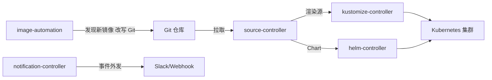

## 知识点地图

- **知识类别**：DevOps 持续交付 / GitOps 工具深用（Flux 这一支 + 多环境工程化）。
- **解决什么问题**：[ArgoCD](/devops/190-GitOpsArgoCD) 之外的另一条 GitOps 主线是 Flux——它没有 UI、以控制器集合形态工作，适合"配置即代码"的团队与多集群场景；多环境（dev/staging/prod）的仓库怎么摆、变更怎么从 dev "晋升"到 prod，是 GitOps 落地的第二道工程题。
- **什么时候用到**：团队偏好 CLI/Kustomize 工作流；需要镜像构建后自动更新配置仓库（image automation）；多环境多集群的统一交付。
- **分工声明（跨模块）**：GitOps 的**架构概念与选型比较**（Push/Pull 模式、适用性判断）见 027-cloud 模块的 [GitOps 持续交付](/cloud-computing/155-GitOpsContinuousDelivery)；本模块 [GitOps 与 ArgoCD](/devops/190-GitOpsArgoCD) 讲 ArgoCD 工具深用，本篇讲 Flux 工具深用——**概念在 cloud、实操在 devops**，两处互为表里。

## 心智模型：Flux 是"控制器集合"，不是"一个产品"



| 组件 | 功能 |
| --- | --- |
| source-controller | 管理 Git/Helm/OCI 源（拉取、校验、缓存） |
| kustomize-controller | Kustomize 构建并应用到集群 |
| helm-controller | Helm Release 生命周期 |
| notification-controller | 事件外发（Slack、webhook） |
| image-automation | 自动发现新镜像并改写 Git 里的配置 |

与 ArgoCD 的一句话对比：ArgoCD 是"带 UI 的应用层"，Flux 是"无 UI 的原子控制器"——前者人看得很爽，后者跟 CI 管道与 GitOps 自动化（如镜像回写）组合更自然。两者不是敌人，一个组织里 ArgoCD 管业务应用、Flux 管平台组件的混搭很常见。

## 动手一：Flux 的两个核心对象

Flux 一切从 GitRepository（源）与 Kustomization（渲染应用）这对搭档开始：

```yaml
# Git 仓库源：每 1 分钟拉一次
apiVersion: source.toolkit.fluxcd.io/v1
kind: GitRepository
metadata:
  name: myapp
  namespace: flux-system
spec:
  interval: 1m
  url: https://github.com/org/k8s-manifests.git
  ref:
    branch: main
---
# Kustomize 部署：每 5 分钟核对一次集群与 Git 的一致性
apiVersion: kustomize.toolkit.fluxcd.io/v1
kind: Kustomization
metadata:
  name: myapp
  namespace: flux-system
spec:
  interval: 5m
  sourceRef:
    kind: GitRepository
    name: myapp
  path: ./overlays/production
  prune: true                 # Git 里删掉的对象集群里也删（双向一致的关键）
  healthChecks:
    - apiVersion: apps/v1
      kind: Deployment
      name: myapp
      namespace: default
```

逐段讲解：

- `interval` 是拉取节奏（1m/5m），它决定"git push 到集群生效"的延迟上限——不是实时推送，是**定期核对**；急变更用 `flux reconcile kustomization myapp --with-source` 手动触发；
- `prune: true` 必须开：没有它，Git 里删除的资源会残留在集群——"Git 是唯一事实"就成了一句空话。代价是误删 Git 配置会真实删掉生产负载，所以 Git 仓库要开分支保护；
- `healthChecks` 把"应用是否健康"纳入 Kustomization 的 Ready 状态，下游（CI、通知）能感知部署结果。

排障三板斧：`flux get kustomizations` 看状态、`flux logs --kind=Kustomization` 看报错、`flux suspend/resume` 在紧急人肉操作时暂停控制器（用完必须 resume，否则配置漂移没人管）。

## 动手二：镜像自动化（Flux 的招牌能力）

CI 只负责构建推镜像，**谁更新集群里的镜像 tag**？Flux 的答案：控制器自己盯仓库、自己提 commit：

```yaml
# 盯镜像仓库
apiVersion: image.toolkit.fluxcd.io/v1beta2
kind: ImageRepository
metadata:
  name: myapp
spec:
  image: registry/myapp
  interval: 1m
---
# 版本策略：1.x 的最新版
apiVersion: image.toolkit.fluxcd.io/v1beta2
kind: ImagePolicy
metadata:
  name: myapp
spec:
  imageRepositoryRef:
    name: myapp
  policy:
    semver:
      range: '^1.x'
---
# 把新 tag 写回 Git（自动 commit + push）
apiVersion: image.toolkit.fluxcd.io/v1beta2
kind: ImageUpdateAutomation
metadata:
  name: myapp
spec:
  sourceRef:
    kind: GitRepository
    name: myapp
  git:
    checkout: { ref: { branch: main } }
    commit:
      author: { name: fluxbot, email: fluxbot@example.com }
      messageTemplate: 'Update image to {{ .Image }}'
    push: { branch: main }
  interval: 1m
```

这组配置串起一条**无 CI 部署步骤**的流水线：CI 推镜像到 registry → ImageRepository 发现新 tag → ImagePolicy 判定符合 `^1.x` → ImageUpdateAutomation 改写 Git → Kustomization 拉取新配置应用。Git 提交历史天然就是部署审计日志。

要写 `setters:` 标记进 YAML 让 automation 知道改哪个字段（`# {"$imagepolicy": "flux-system:myapp"}` 注释锚点），漏写锚点是最常见的"新镜像出了但配置没更新"原因。

## 场景：多环境的仓库布局与 Promotion

### 仓库布局：base/overlay + apps 目录

```text
k8s-manifests/
├── base/                      # 三环境相同的基础清单
│   ├── kustomization.yaml
│   └── deployment.yaml
├── overlays/
│   ├── development/           # 开发环境覆盖
│   ├── staging/               # 预发布覆盖
│   └── production/            # 生产覆盖（副本数/资源/镜像策略）
└── apps/                      # ArgoCD/Flux 对象定义（环境级）
    ├── dev.yaml
    ├── staging.yaml
    └── prod.yaml
```

base/overlay 的 Kustomize 语法细节见[密钥管理与配置中心](/devops/235-SecretsAndConfigCenter)的多环境节；这里强调 GitOps 语境下的差别——**overlay 目录就是"环境的边界"**：改 dev 只碰 development/，生产配置的每一次变更都有独立 PR 与评审。

### Promotion：环境间的晋升流程


Promotion 的三种实现：

| 方式 | 动作 | 适合 |
| --- | --- | --- |
| 分支策略 | dev 分支合并到 staging 分支 | 分支型布局，CI 可控 |
| 目录 PR | 把 staging overlay 改的镜像 tag PR 到 production/ | 目录型布局（推荐），PR 即评审 |
| 自动晋升 | bot 监测 staging 验证通过自动提生产 PR | 成熟团队，人工只做审批 |

纪律两条：**晋升只动"版本引用"，绝不手改生产 overlay 里的其他字段**（要改就单独 PR）；生产 PR 至少两人评审——GitOps 的安全模型全靠 Git 权限，分支保护形同虚设时整个体系退化成人肉运维。

### 配置差异的四种管理法

| 方法 | 说明 | 适用场景 |
| --- | --- | --- |
| Kustomize overlays | 覆盖差异 | 简单差异 |
| Helm values | 值文件差异 | Helm 项目 |
| 环境变量 | 运行时注入 | 通用 |
| 配置中心 | 动态配置 | 需要热更新（见[密钥与配置中心](/devops/235-SecretsAndConfigCenter)） |

## 常见困惑

**"Flux 和 ArgoCD 怎么选？"**——要 UI 与人肉排查友好选 ArgoCD；要纯声明式、多集群 fan-out、镜像自动化选 Flux；拿不准就先 ArgoCD（学习曲线更平），规模化后再评估。

**"Git 挂了集群会怎样？"**——已部署的负载照常运行（Flux 只是拉取失败），但变更停摆、漂移开始累积。Git 平台要纳入高可用预算（托管服务多区部署），这是 GitOps 的架构前提。

**"急修线上怎么绕过 PR？"**——`flux suspend` 后人肉 kubectl，修完**立即**把手工改动补成 PR 并 resume。没有这条补票纪律，Git 与集群从此两个版本，GitOps 名存实亡。

## 动手实践：跑通 Flux 最小闭环

任务（kind/minikube 上约 40 分钟）：

1. 安装 flux CLI，`flux bootstrap github` 引导控制器到集群；
2. fork 一个示例 manifests 仓库，bootstrap 指向它，确认 Kustomization Ready；
3. 修改 Git 里一个副本数，观察 1-5 分钟内集群自动变化（或手动 reconcile 加速）；
4. 故意删掉集群里的一个 Deployment，验证 `prune` + 健康检查把它"纠"回来（漂移修复演示）；
5. （进阶）配 ImageRepository + Policy + Automation 三件套，push 一个新 tag 镜像观察 Git 自动出现 bot 提交。

<details>
<summary>参考实现（先自己写再展开）</summary>

```bash
# 1
curl -s https://fluxcd.io/install.sh | sudo bash        # 装 CLI
flux bootstrap github --owner=<你的用户名> --repository=fleet-infra \
  --branch=main --path=clusters/kind
flux get kustomizations -n flux-system                   # 等 Ready=True

# 2-3：改 fork 仓库里的副本数字段后
git commit -am "scale to 3" && git push
flux reconcile kustomization myapp --with-source        # 手动加速
kubectl get deploy -w                                    # 观察副本数变化

# 4（漂移修复）
kubectl delete deploy myapp                              # 手工删除
flux get kustomizations                                  # 变 Reconciling
kubectl get deploy myapp                                 # 5 分钟内被拉回

# 5（镜像自动化三对象 YAML 同正文；锚点注释示例）
# deployment.yaml 里镜像行写成：
# image: registry/myapp:1.0.0 # {"$imagepolicy": "flux-system:myapp"}
git push 新 tag 镜像后：flux get images policy   # 看 Latest
git log                                          # fluxbot 的自动提交
```

判读要点：任务 4 的"被拉回"就是 GitOps 的核心承诺——**集群是 Git 的投影**；任务 5 若没出现 bot 提交，九成是 YAML 里漏了 `$imagepolicy` 锚点注释。
</details>

## 检验清单

- 能画出 Flux 五个控制器的分工并说清与 ArgoCD 的形态差异；
- 能解释 interval/prune/healthChecks 三个字段各自维护什么一致性；
- 能串起"CI 推镜像 → Flux 改 Git → 集群更新"的镜像自动化链路，知道锚点注释的作用；
- 能为三环境设计 base/overlay + apps 布局并说清 Promotion 的三种实现；
- 知道 GitOps 的两条纪律（生产 PR 双评审、手工救急必须补票）；
- 能说出本篇与 cloud-155（概念）、devops-190（ArgoCD）的分工。

## 下一步

- [GitOps 与 ArgoCD](/devops/190-GitOpsArgoCD)：另一支工具的安装、Application 与同步策略；
- [渐进式交付](/devops/145-ProgressiveDelivery)：GitOps 之上的发布策略层；
- [密钥管理与配置中心](/devops/235-SecretsAndConfigCenter)：配置差异与密钥不进 Git 的解法。

## 参考与致谢

- Flux 官方文档（Apache-2.0）：<https://fluxcd.io/docs/>
- Flux image automation 指南（Apache-2.0）：<https://fluxcd.io/flux/guides/image-update/>
- OpenGitOps 项目四原则（Apache-2.0）：<https://opengitops.dev/>
- 本篇 Flux 组件、镜像自动化、多环境与 Promotion 各节承接自旧篇 180 并重写扩写。
