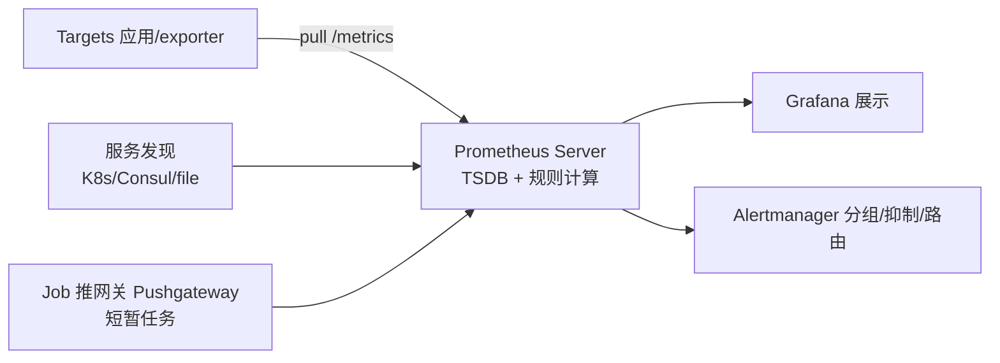

## 前置知识

建议先阅读以下内容再进入本文：

- [概述与 Linux 基础](/devops/010-OverviewLinuxBasics)

## 0. 一句话理解

> Prometheus 是"拉模型"的指标监控系统：它每隔几秒主动抓取（scrape）各服务暴露的
> `/metrics` 文本端点，把数值存成本地时序数据库，用 PromQL 查询与告警。
> 指标回答"系统发生了什么"，是可观测性三支柱中最便宜、最先看的那一支。

## 1. 架构与数据模型



数据模型就一行：`metric_name{label1="v1",label2="v2"} value [timestamp]`。
**所有维度都进标签**，同一指标名 + 不同标签组合 = 不同的时间序列。
这也埋下最大的坑：标签基数（cardinality）失控会把存储与内存打爆。

四种指标类型：

| 类型 | 语义 | 典型例子 |
| :--- | :--- | :--- |
| Counter | 只增不减的累计值 | http_requests_total |
| Gauge | 可升可降的瞬时值 | 内存占用、队列长度 |
| Histogram | 分桶统计（可算分位数） | 请求延迟分布 |
| Summary | 客户端预算好的分位数 | 不便聚合，慎用 |

## 2. PromQL 速成

```promql
# 瞬时与区间
http_requests_total                     # 当前值
http_requests_total[5m]                 # 最近 5 分钟的原始序列

# Counter 必须先 rate：每秒请求速率
rate(http_requests_total[5m])

# 按服务聚合（sum by）
sum(rate(http_requests_total[5m])) by (service)

# 错误率 = 5xx 速率 / 总速率
sum(rate(http_requests_total{status=~"5.."}[5m]))
  / sum(rate(http_requests_total[5m]))

# P95 延迟：histogram_quantile 永远套在 rate 之外
histogram_quantile(0.95,
  sum(rate(http_request_duration_seconds_bucket[5m])) by (le, service))

# 预测磁盘 4 小时后耗尽
predict_linear(node_filesystem_avail_bytes[1h], 4 * 3600) < 0
```

三条心法：

1. Counter 一律 `rate()`/`irate()` 后再用，直接画原值毫无意义。
2. `histogram_quantile` 的分母标签必须带 `le`，且先 sum 再分位（跨实例聚合）。
3. 聚合运算符（sum/avg/by/without）是控制序列量的唯一手段——查询慢先看忘了聚合没。

## 3. 告警：规则 + Alertmanager 分离

Prometheus 负责"什么时候算出告警"，Alertmanager 负责"告警发给谁、怎么合并、何时静默"。

```yaml
# 告警规则（挂到 prometheus.yml 的 rule_files）
groups:
  - name: app_alerts
    rules:
      - alert: HighErrorRate
        expr: |
          sum(rate(http_requests_total{status=~"5.."}[5m])) by (service)
            / sum(rate(http_requests_total[5m])) by (service) > 0.05
        for: 5m              # 持续 5 分钟才触发，滤掉毛刺
        labels: { severity: critical }
        annotations:
          summary: '{{ $labels.service }} 错误率过高'
          description: '当前错误率 {{ $value | humanizePercentage }}'
```

```yaml
# alertmanager.yml 路由（match/match_re 已弃用，用 matchers）
route:
  receiver: default-email
  routes:
    - matchers: [ 'severity = "critical"' ]
      receiver: oncall-pager
      repeat_interval: 15m
inhibit_rules: # 实例下线时抑制它衍生的其他告警
  - source_matchers: [ 'alertname = InstanceDown' ]
    target_matchers: [ 'severity = "warning"' ]
    equal: ['instance']
```

告警质量三问：这条告警**需要人现在行动吗**？行动指令写在 annotations 里了吗？
它会把人吵醒两次吗（分组/抑制/静默是否配置）？任何一问答不好，就别让它进值班群。

## 4. 服务发现与重标记（进阶）

生产环境不写 static_configs，靠服务发现自动纳管目标；`relabel_configs` 决定"抓谁、
怎么打标签"：

```yaml
scrape_configs:
  - job_name: kubernetes-pods
    kubernetes_sd_configs: [{ role: pod }]
    relabel_configs:
      - source_labels: [__meta_kubernetes_pod_annotation_prometheus_io_scrape]
        action: keep          # 只抓带 prometheus.io/scrape: "true" 注解的 Pod
        regex: "true"
      - source_labels: [__meta_kubernetes_pod_annotation_prometheus_io_path]
        action: replace
        target_label: __metrics_path__
        regex: (.+)
      - source_labels: [__meta_kubernetes_namespace]
        target_label: namespace
```

高频坑：指标里的 `instance`/`job` 之外想要 Pod 名、命名空间等标签，必须在
relabel 阶段映射，事后是补不回来的（标签在抓取时就已定型）。

## 5. 长期存储与扩展

| 需求 | 方案 |
| :--- | :--- |
| 数据保留 > 本地磁盘 | remote_write 到 Thanos/Mimir/VictoriaMetrics |
| 多集群全局视图 | Thanos Sidecar + Query 联邦，或 Mimir 集群 |
| 高可用 | 双副本 Prometheus 抓同一批目标（告警去重交给 Alertmanager 集群） |
| 短任务指标 | Pushgateway（注意它是"缓存最后一次"而非时序，慎用） |

## 6. 常见陷阱

1. **高基数标签**（userId、traceId 进 label）：序列数爆炸、OOM。对策：新增指标前
   估算"指标名 x 标签组合数"，用 `prometheus_tsdb_head_series` 监控序列总量。
2. **查询窗口与抓取间隔失配**：`rate()` 窗口至少是抓取间隔的 4 倍（15s 抓取用 [1m] 以上）。
3. **告警没有 for**：单点毛刺直接打电话，一周后没人再信告警。
4. **把 Prometheus 当长期存储用**：默认本地单机、有限保留期，长期数据交给 remote_write。
5. **Histogram 桶设计不当**：SLO 边界（如 300ms）必须正好是一个桶边界，否则分位数失真。

## 7. 动手试试

1. Docker 启动 Prometheus + node_exporter，用 CPU 使用率经典表达式画出本机负载曲线。
2. 写一条 `for: 1m` 的内存告警，手动制造压力触发它，在 Alertmanager UI 里静默掉。
3. 用 `promtool check rules` 校验规则文件，`promtool test rules` 写一个告警单元测试。

## 8. 小结

**初学者要点**

1. 拉模型 + 多维标签 + PromQL 是 Prometheus 的三件套；Counter 先 rate、直方图先聚合。
2. 告警 = Prometheus 规则（算）+ Alertmanager（路由/分组/抑制），各管一半。
3. 服务发现让目标自动纳管，static_configs 只属于本地实验。

**进阶注意**

1. 标签基数是第一生产事故来源，设计指标先算基数。
2. 高可用靠双抓取 + Alertmanager 集群，长期存储用 remote_write 生态（Thanos/Mimir/VictoriaMetrics）。
3. 记录规则（recording rules）预计算昂贵查询，仪表盘与告警共用，别让 UI 实时硬算。

## promtool 工具

**基本用法:检查配置**
`promtool check config <配置文件>`

```bash
# 检查 prometheus.yml 配置语法
promtool check config /etc/prometheus/prometheus.yml

# 检查规则文件
promtool check rules /etc/prometheus/rules/*.yml

# 检查告警规则文件
promtool check rules alerts.yml
```

---

**基本用法:测试 PromQL 查询**
`promtool query instant <服务器> <查询表达式>`

```bash
# 即时查询
promtool query instant http://localhost:9090 'up'

# 查询 CPU 使用率
promtool query instant http://localhost:9090 '100 - (avg by (instance) (rate(node_cpu_seconds_total{mode="idle"}[5m])) * 100)'

# 范围查询
promtool query range http://localhost:9090 'up' --start=2024-01-01T00:00:00Z --end=2024-01-01T01:00:00Z --step=60s
```

---

**基本用法:调试告警规则**
`promtool test rules <test.yaml>`

```yaml
# test.yaml 告警规则测试
rule_files:
- alerts.yml
evaluation_interval: 1m
tests:
- interval: 1m
  input_series:
  - series: 'node_cpu_seconds_total{mode="idle",instance="node1"}'
    values: '0+100x10'
  alert_rule_test:
  - eval_time: 10m
    alertname: HighCpuUsage
    exp_alerts:
    - exp_labels:
        severity: warning
        instance: node1
```

```bash
# 执行测试
promtool test rules test.yaml
```

---

## 基础查询 PromQL

**基本用法:即时查询**
`curl -G <服务器>/api/v1/query --data-urlencode "query=<表达式>"`

```bash
# 通过 HTTP 即时查询
curl -G http://localhost:9090/api/v1/query --data-urlencode "query=up"

# 查询所有节点的 CPU 空闲率
curl -G http://localhost:9090/api/v1/query \
  --data-urlencode "query=node_cpu_seconds_total{mode='idle'}"

# 查询指定时间点的数据
curl -G http://localhost:9090/api/v1/query \
  --data-urlencode "query=up" \
  --data-urlencode "time=1704067200"
```

---

**基本用法:范围查询**
`curl -G <服务器>/api/v1/query_range --data-urlencode "query=<表达式>"`

```bash
# 范围查询(过去 1 小时,每 60 秒采样)
curl -G http://localhost:9090/api/v1/query_range \
  --data-urlencode "query=up" \
  --data-urlencode "start=$(date -d '1 hour ago' +%s)" \
  --data-urlencode "end=$(date +%s)" \
  --data-urlencode "step=60"
```

---

**基本用法:基础指标查询**
`<指标名>`

```promql
# 查询所有 up 指标
up

# 查询指定 job 的指标
up{job="node-exporter"}

# 查询匹配多个标签
node_cpu_seconds_total{job="node-exporter", mode="idle"}

# 使用正则匹配
http_requests_total{method=~"GET|POST"}

# 使用负向匹配
http_requests_total{status!~"5.."}
```

---

## 聚合与计算

**基本用法:聚合函数**
`<函数>(<表达式>) by (<标签>)`

```promql
# 按实例平均 CPU 使用率
avg by (instance) (rate(node_cpu_seconds_total{mode="idle"}[5m]))

# 按 job 统计 HTTP 请求总数
sum by (job) (http_requests_total)

# 按方法统计每秒请求量
sum by (method) (rate(http_requests_total[5m]))

# 计算多实例最大值
max by (instance) (node_memory_MemAvailable_bytes)

# 计算分位数
histogram_quantile(0.95, sum by (le) (rate(http_request_duration_seconds_bucket[5m])))
```

---

**基本用法:速率计算**
`rate(<指标>[<时间窗口>])`

```promql
# 每秒速率(适用于 counter)
rate(http_requests_total[5m])

# 增量(适用于 counter,不归一化)
increase(http_requests_total[1h])

# irate 即时速率(更高精度但更不稳定)
irate(http_requests_total[1m])

# 计算过去 5 分钟的平均 QPS
sum(rate(http_requests_total[5m]))
```

---

**基本用法:数学运算**
`<表达式> <运算符> <表达式>`

```promql
# 计算内存使用率
(node_memory_MemTotal_bytes - node_memory_MemAvailable_bytes) / node_memory_MemTotal_bytes * 100

# 计算 CPU 使用率(百分比)
100 - (avg by (instance) (rate(node_cpu_seconds_total{mode="idle"}[5m])) * 100)

# 单位转换(字节转 GB)
node_memory_MemTotal_bytes / 1024 / 1024 / 1024

# 使用 clamp 防止异常值
clamp_max(clamp_min(rate(http_requests_total[5m]), 0), 1000)
```

---

## 告警规则

**基本用法:定义告警规则**
`groups: - rules:`

```yaml
# alerts.yml 告警规则文件
groups:
- name: node-alerts
  rules:
  - alert: HighCpuUsage
    expr: 100 - (avg by (instance) (rate(node_cpu_seconds_total{mode="idle"}[5m])) * 100) > 80
    for: 5m
    labels:
      severity: warning
    annotations:
      summary: "CPU 使用率过高 {{ $labels.instance }}"
      description: "实例 {{ $labels.instance }} CPU 使用率超过 80%,当前值: {{ $value }}%"
```

---

**基本用法:多条件告警**
`expr: <表达式1> and <表达式2>`

```yaml
# 多条件组合告警
groups:
- name: composite-alerts
  rules:
  - alert: HighMemoryAndCpu
    expr: >
      (node_memory_MemAvailable_bytes / node_memory_MemTotal_bytes < 0.2)
      and
      (100 - (avg by (instance) (rate(node_cpu_seconds_total{mode="idle"}[5m])) * 100) > 80)
    for: 10m
    labels:
      severity: critical
    annotations:
      summary: "节点 {{ $labels.instance }} 内存和 CPU 同时告急"

  - alert: PodCrashLooping
    expr: increase(kube_pod_container_status_restarts_total[1h]) > 5
    for: 5m
    labels:
      severity: warning
```

---

**基本用法:告警抑制与静默**
`inhibit_rules:`

```yaml
# 抑制规则:节点宕机时不发送其上所有 Pod 告警
# source_match/target_match(_re) 已弃用（Alertmanager 0.22+），统一使用 matchers
inhibit_rules:
- source_matchers:
  - alert = "NodeDown"
  target_matchers:
  - alert =~ "PodDown|ServiceDown"
  equal: ['node']

# 通过 Alertmanager API 创建静默
curl -X POST http://alertmanager:9093/api/v2/silences \
  -H "Content-Type: application/json" \
  -d '{
    "matchers": [{"name": "instance", "value": "node1", "isRegex": false}],
    "startsAt": "2024-01-01T00:00:00Z",
    "endsAt": "2024-01-01T02:00:00Z",
    "createdBy": "admin",
    "comment": "维护窗口"
  }'
```

---

## 服务发现

**基本用法:Kubernetes 服务发现**
`kubernetes_sd_configs`

```yaml
# prometheus.yml K8s 服务发现配置
scrape_configs:
- job_name: 'kubernetes-pods'
  kubernetes_sd_configs:
  - role: pod
  relabel_configs:
  - source_labels: [__meta_kubernetes_pod_annotation_prometheus_io_scrape]
    action: keep
    regex: true
  - source_labels: [__meta_kubernetes_pod_annotation_prometheus_io_path]
    action: replace
    target_label: __metrics_path__
    regex: (.+)
  - source_labels: [__meta_kubernetes_pod_annotation_prometheus_io_port, __meta_kubernetes_pod_ip]
    action: replace
    target_label: __address__
    regex: (.+);(.+)
    replacement: $2:$1
```

---

**基本用法:静态配置**
`static_configs`

```yaml
# 静态目标配置
scrape_configs:
- job_name: 'node-exporter'
  static_configs:
  - targets:
    - 'node1:9100'
    - 'node2:9100'
    labels:
      env: production

- job_name: 'mysql-exporter'
  static_configs:
  - targets: ['mysql-exporter:9104']
```

---

**基本用法:文件服务发现**
`file_sd_configs`

```yaml
# 基于文件的服务发现
scrape_configs:
- job_name: 'file-based'
  file_sd_configs:
  - files:
    - '/etc/prometheus/targets/*.yml'
    refresh_interval: 30s
```

```yaml
# targets/web.yml 目标文件
- targets:
  - web1.example.com:9100
  - web2.example.com:9100
  labels:
    service: web
```

---

## 标签与重新标记

**基本用法:relabel_configs**
`relabel_configs`

```yaml
# 重新标记示例
scrape_configs:
- job_name: 'node'
  static_configs:
  - targets: ['node1:9100']
  relabel_configs:
  - source_labels: [__address__]
    target_label: instance
    regex: '([^:]+):.*'
    replacement: '$1'

  # 过滤目标
  - source_labels: [__meta_kubernetes_pod_phase]
    action: keep
    regex: Running

  # 标签映射
  - source_labels: [__meta_kubernetes_namespace]
    target_label: namespace
```

---

**基本用法:metric_relabel_configs**
`metric_relabel_configs`

```yaml
# 采集后修改指标(过滤、改名等)
scrape_configs:
- job_name: 'app'
  static_configs:
  - targets: ['app:8080']
  metric_relabel_configs:
  # 丢弃高基数指标
  - source_labels: [__name__]
    regex: 'go_.*'
    action: drop

  # 重命名指标
  - source_labels: [__name__]
    target_label: __name__
    regex: 'http_requests_total'
    replacement: 'app_http_requests_total'
```

---

## 远程存储与联邦

**基本用法:远程写入**
`remote_write`

```yaml
# 远程写入配置(发送到 Thanos/Mimir 等)
remote_write:
- url: 'http://mimir:8080/api/v1/push'
  headers:
    X-Scope-OrgID: tenant1
  write_relabel_configs:
  - source_labels: [__name__]
    regex: 'go_.*'
    action: drop

# 远程读取
remote_read:
- url: 'http://mimir:8080/api/v1/read'
```

---

**基本用法:联邦集群**
`scrape_configs with federation`

```yaml
# 联邦配置(从其他 Prometheus 抓取)
scrape_configs:
- job_name: 'federate'
  scrape_interval: 30s
  honor_labels: true
  metrics_path: '/federate'
  params:
    'match[]':
    - '{job="node-exporter"}'
    - '{__name__=~"job:.*"}'
  static_configs:
  - targets: ['prometheus-child:9090']
```

---

## API 查询

**基本用法:查询指标元数据**
`curl <服务器>/api/v1/<端点>`

```bash
# 查询所有指标名
curl http://localhost:9090/api/v1/label/__name__/values

# 查询标签值
curl http://localhost:9090/api/v1/label/job/values

# 查询指标元数据
curl http://localhost:9090/api/v1/metadata

# 查询目标状态
curl http://localhost:9090/api/v1/targets
```

---

**基本用法:查询告警状态**
`curl <服务器>/api/v1/alerts`

```bash
# 查询当前触发的告警
curl http://localhost:9090/api/v1/alerts | jq '.data.alerts[] | {alertname: .labels.alertname, state: .state}'

# 查询规则
curl http://localhost:9090/api/v1/rules | jq '.data.groups[].rules[]'

# 查询 Alertmanager 告警
curl http://alertmanager:9093/api/v2/alerts | jq '.[]'
```

---

**基本用法:管理 Alertmanager 静默**
`curl -X <方法> <alertmanager>/api/v2/silences`

```bash
# 列出所有静默
curl http://alertmanager:9093/api/v2/silences

# 创建静默
curl -X POST http://alertmanager:9093/api/v2/silences \
  -H "Content-Type: application/json" \
  -d '{
    "matchers": [{"name": "alertname", "value": "HighCpuUsage", "isRegex": false}],
    "startsAt": "2024-01-01T00:00:00Z",
    "endsAt": "2024-01-01T04:00:00Z",
    "createdBy": "ops",
    "comment": "夜间维护"
  }'

# 删除静默(需要静默 ID)
curl -X DELETE http://alertmanager:9093/api/v2/silence/<silence-id>
```

---

## 性能与排查

**基本用法:查看采集状态**
`curl <服务器>/api/v1/targets`

```bash
# 查看所有采集目标状态
curl -s http://localhost:9090/api/v1/targets | jq '.data.activeTargets[] | {job: .labels.job, health: .health, lastError: .lastError}'

# 查看失败的目标
curl -s http://localhost:9090/api/v1/targets | jq '.data.activeTargets[] | select(.health=="down")'

# 查看 TSDB 状态
curl -s http://localhost:9090/api/v1/status/tsdb | jq '.data'
```

---

**基本用法:检查配置与规则**
`curl <服务器>/api/v1/status/config`

```bash
# 查看当前配置
curl -s http://localhost:9090/api/v1/status/config | jq '.data.yaml'

# 查看规则
curl -s http://localhost:9090/api/v1/rules | jq '.data.groups[]'

# 查看_flags
curl -s http://localhost:9090/api/v1/status/flags | jq '.data'

# 查看 TSDB 统计信息
curl -s http://localhost:9090/api/v1/status/tsdb | jq '.data.seriesCountByMetricName | to_entries | sort_by(.value) | reverse | .[:10]'
```

---

**基本用法:热重载配置**
`curl -X POST <服务器>/-/reload`

```bash
# 热重载配置文件
curl -X POST http://localhost:9090/-/reload

# 或者发送 SIGHUP 信号
kill -HUP $(pgrep prometheus)

# 验证配置生效
curl -s http://localhost:9090/api/v1/status/config | jq '.data.yaml | fromyaml | .scrape_configs | length'
```
