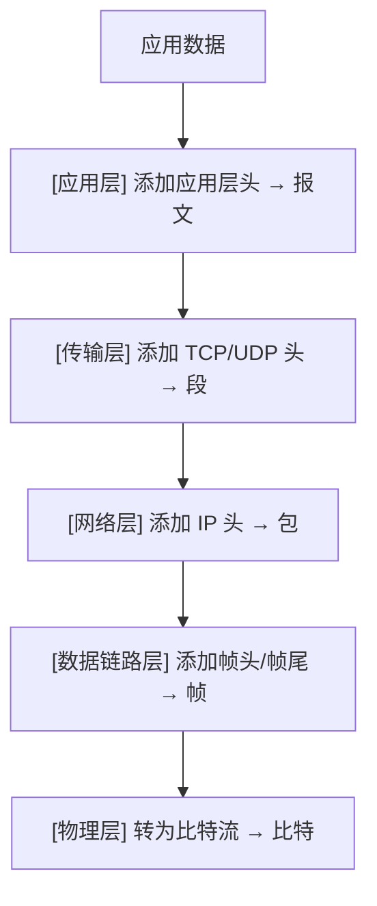
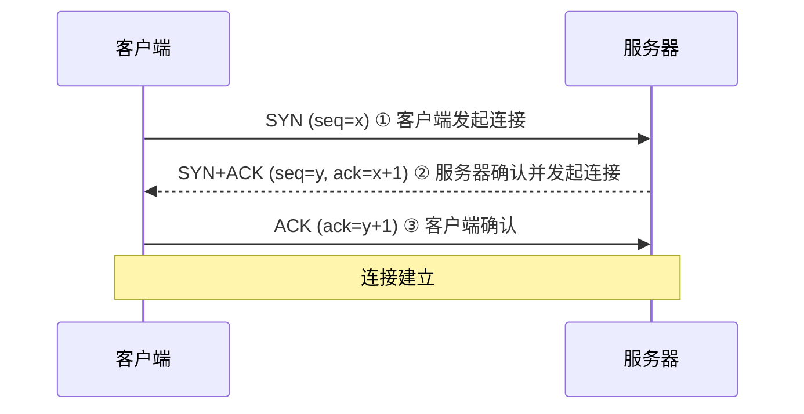
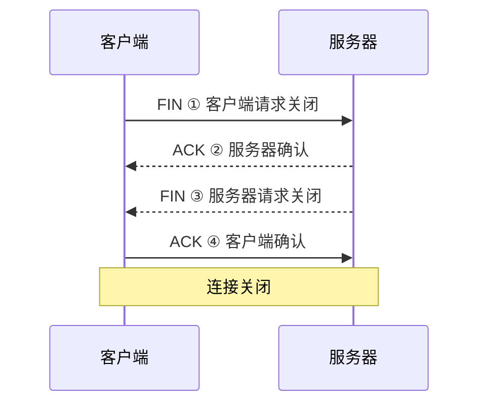

## 学习目标

本文是「Networking」模块的第 1 篇，难度定位为入门。重点内容：OSI七层模型、TCP/IP协议栈、IPv4/IPv6地址规划、子网划分、路由协议、VLAN、生成树、链路聚合、VRRP、广域网、隧道、ACL、SSH、SNMP、NAPT、认证与V……

主要章节：

- 1. OSI 七层模型
- 2. TCP/IP 协议栈
- 3. IPv4/IPv6 地址规划
- 4. 子网划分
- 5. 路由协议
- 6. VLAN 划分
- ……共 27 个章节

## 1. OSI 七层模型

### 1.1 模型概述

OSI（Open Systems Interconnection）参考模型由 ISO 提出，将网络通信划分为七个层次，每层负责特定功能。

| 层次    | 名称       | 功能               | 数据单元    | 典型协议/设备        |
| :------ | :--------- | :----------------- | :---------- | :------------------- |
| 第 7 层 | 应用层     | 为应用程序提供服务 | 报文        | HTTP、FTP、SMTP、DNS |
| 第 6 层 | 表示层     | 数据格式转换、加密 | 报文        | SSL/TLS、JPEG        |
| 第 5 层 | 会话层     | 建立/管理/终止会话 | 报文        | NetBIOS、RPC         |
| 第 4 层 | 传输层     | 端到端可靠传输     | 段(Segment) | TCP、UDP             |
| 第 3 层 | 网络层     | 路由选择与寻址     | 包(Packet)  | IP、ICMP、路由器     |
| 第 2 层 | 数据链路层 | 帧的封装与传输     | 帧(Frame)   | Ethernet、交换机     |
| 第 1 层 | 物理层     | 比特流的传输       | 比特(Bit)   | 光纤、双绞线、集线器 |

### 1.2 数据封装过程



## 2. TCP/IP 协议栈

### 2.1 TCP 三次握手



### 2.2 TCP 四次挥手



### 2.3 常用协议端口

| 协议  | 端口  | 传输层  | 用途     |
| :---- | :---- | :------ | :------- |
| HTTP  | 80    | TCP     | 网页浏览 |
| HTTPS | 443   | TCP     | 安全网页 |
| SSH   | 22    | TCP     | 远程管理 |
| DNS   | 53    | UDP/TCP | 域名解析 |
| DHCP  | 67/68 | UDP     | 地址分配 |
| SMTP  | 25    | TCP     | 邮件发送 |
| FTP   | 20/21 | TCP     | 文件传输 |
| SNMP  | 161   | UDP     | 网络管理 |

## 3. IPv4/IPv6 地址规划

### 3.1 IPv4 地址分类

| 类别 | 范围                        | 默认子网掩码  | 网络规模 |
| :--- | :-------------------------- | :------------ | :------- |
| A 类 | 1.0.0.0 ~ 126.255.255.255   | 255.0.0.0     | 大型网络 |
| B 类 | 128.0.0.0 ~ 191.255.255.255 | 255.255.0.0   | 中型网络 |
| C 类 | 192.0.0.0 ~ 223.255.255.255 | 255.255.255.0 | 小型网络 |

**私有地址范围**：

- A 类：`10.0.0.0 ~ 10.255.255.255`
- B 类：`172.16.0.0 ~ 172.31.255.255`
- C 类：`192.168.0.0 ~ 192.168.255.255`

### 3.2 IPv6 地址

IPv6 地址长度 128 位，使用冒号十六进制表示：

```
2001:0db8:85a3:0000:0000:8a2e:0370:7334
缩写 → 2001:db8:85a3::8a2e:370:7334
```

| 类型     | 前缀      | 说明               |
| :------- | :-------- | :----------------- |
| 单播     | 全球路由  | 可路由的公网地址   |
| 链路本地 | fe80::/10 | 同一链路通信       |
| 唯一本地 | fc00::/7  | 等同 IPv4 私有地址 |
| 组播     | ff00::/8  | 一对多通信         |

## 4. 子网划分

### 4.1 子网掩码计算

```
IP 地址:    192.168.1.0/24
子网掩码:   255.255.255.0
主机位数:   32 - 24 = 8
可用主机数: 2^8 - 2 = 254

划分为 4 个子网（借 2 位）：
子网1: 192.168.1.0/26    范围: .1 ~ .62      广播: .63
子网2: 192.168.1.64/26   范围: .65 ~ .126    广播: .127
子网3: 192.168.1.128/26  范围: .129 ~ .190   广播: .191
子网4: 192.168.1.192/26  范围: .193 ~ .254   广播: .255
```

### 4.2 VLSM 可变长子网掩码

VLSM 允许在同一网络中使用不同长度的子网掩码，提高地址利用率：

```
需求: 3 个子网，分别需要 50、20、10 台主机

子网1 (50台): 192.168.1.0/26   → 62 台主机
子网2 (20台): 192.168.1.64/27  → 30 台主机
子网3 (10台): 192.168.1.96/28  → 14 台主机
剩余:        192.168.1.112/28 → 可继续分配
```

## 5. 路由协议

### 5.1 静态路由

```bash
# 华为设备配置静态路由
[Huawei] ip route-static 10.1.2.0 255.255.255.0 10.1.1.2

# Cisco 设备配置静态路由
Router(config)# ip route 10.1.2.0 255.255.255.0 10.1.1.2

# 默认路由
[Huawei] ip route-static 0.0.0.0 0.0.0.0 192.168.1.1
```

### 5.2 动态路由协议对比

| 协议 | 类型     | 算法         | 管理距离 | 适用场景      |
| :--- | :------- | :----------- | :------- | :------------ |
| RIP  | 距离矢量 | Bellman-Ford | 120      | 小型网络      |
| OSPF | 链路状态 | Dijkstra     | 110      | 中大型网络    |
| BGP  | 路径矢量 | 最佳路径选择 | 20/200   | 互联网/企业间 |

### 5.3 OSPF 配置

```bash
# 华为设备 OSPF 配置
[Huawei] ospf 1 router-id 1.1.1.1
[Huawei-ospf-1] area 0
[Huawei-ospf-1-area-0.0.0.0] network 10.1.1.0 0.0.0.255
[Huawei-ospf-1-area-0.0.0.0] network 10.1.2.0 0.0.0.255

# 查看 OSPF 邻居
[Huawei] display ospf peer
```

### 5.4 BGP 基础配置

```bash
# 华为设备 BGP 配置
[Huawei] bgp 65001
[Huawei-bgp] router-id 1.1.1.1
[Huawei-bgp] peer 10.1.1.2 as-number 65002
[Huawei-bgp] ipv4-family unicast
[Huawei-bgp-af-ipv4] peer 10.1.1.2 enable
[Huawei-bgp-af-ipv4] network 192.168.1.0 255.255.255.0
```

## 6. VLAN 划分

### 6.1 VLAN 原理

VLAN（Virtual Local Area Network）将物理局域网在逻辑上划分为多个广播域，减少广播流量、提高安全性。

```bash
# 华为交换机 VLAN 配置
[Switch] vlan batch 10 20 30          # 批量创建 VLAN
[Switch] interface GigabitEthernet0/0/1
[Switch-GE0/0/1] port link-type access
[Switch-GE0/0/1] port default vlan 10

# Trunk 链路配置
[Switch] interface GigabitEthernet0/0/24
[Switch-GE0/0/24] port link-type trunk
[Switch-GE0/0/24] port trunk allow-pass vlan 10 20 30
```

### 6.2 VLAN 间路由

```bash
# 华为交换机 VLANIF 接口配置
[Switch] interface Vlanif10
[Switch-Vlanif10] ip address 192.168.10.1 24
[Switch] interface Vlanif20
[Switch-Vlanif20] ip address 192.168.20.1 24
```

## 7. 生成树技术

### 7.1 STP/RSTP/MSTP

| 协议 | 收敛速度 | 特点                        |
| :--- | :------- | :-------------------------- |
| STP  | 30~50 秒 | IEEE 802.1D，消除环路       |
| RSTP | 1~3 秒   | IEEE 802.1w，快速收敛       |
| MSTP | 1~3 秒   | IEEE 802.1s，多实例负载均衡 |

```bash
# 华为设备 MSTP 配置
[Switch] stp mode mstp
[Switch] stp region-configuration
[Switch-mst-region] region-name RG1
[Switch-mst-region] instance 1 vlan 10 20
[Switch-mst-region] instance 2 vlan 30 40
[Switch-mst-region] active region-configuration

# 设置根桥
[Switch] stp instance 1 root primary
[Switch] stp instance 2 root secondary
```

## 8. 链路聚合

链路聚合（Eth-Trunk）将多条物理链路捆绑为一条逻辑链路，提高带宽和可靠性。

```bash
# 华为设备链路聚合配置
[Switch] interface Eth-Trunk 1
[Switch-Eth-Trunk1] mode lacp-static
[Switch-Eth-Trunk1] trunkport GigabitEthernet0/0/1
[Switch-Eth-Trunk1] trunkport GigabitEthernet0/0/2
[Switch-Eth-Trunk1] port link-type trunk
[Switch-Eth-Trunk1] port trunk allow-pass vlan all

# 查看 Eth-Trunk 状态
[Switch] display eth-trunk 1
```

## 9. VRRP 协议

VRRP（Virtual Router Redundancy Protocol）实现网关冗余，多台路由器组成虚拟路由器。

```bash
# 华为设备 VRRP 配置
[RouterA] interface Vlanif10
[RouterA-Vlanif10] ip address 192.168.10.1 24
[RouterA-Vlanif10] vrrp vrid 1 virtual-ip 192.168.10.254
[RouterA-Vlanif10] vrrp vrid 1 priority 120    # 主设备优先级更高
[RouterA-Vlanif10] vrrp vrid 1 preempt-mode timer delay 20

[RouterB] interface Vlanif10
[RouterB-Vlanif10] ip address 192.168.10.2 24
[RouterB-Vlanif10] vrrp vrid 1 virtual-ip 192.168.10.254
[RouterB-Vlanif10] vrrp vrid 1 priority 100    # 备设备默认优先级
```

## 10. 广域网与隧道技术

### 10.1 广域网技术

| 技术        | 速率 | 特点                 |
| :---------- | :--- | :------------------- |
| PPP         | 可变 | 点对点协议，支持认证 |
| HDLC        | 可变 | 高级数据链路控制     |
| Frame Relay | 可变 | 帧中继，已逐渐淘汰   |
| MPLS        | 高速 | 多协议标签交换       |

### 10.2 GRE 隧道

```bash
# 华为设备 GRE 隧道配置
[RouterA] interface Tunnel0/0/1
[RouterA-Tunnel0/0/1] tunnel-protocol gre
[RouterA-Tunnel0/0/1] source 202.1.1.1
[RouterA-Tunnel0/0/1] destination 202.1.2.1
[RouterA-Tunnel0/0/1] ip address 10.1.1.1 30
```

## 11. ACL 访问控制列表

```bash
# 基本 ACL（基于源地址）
[Router] acl 2000
[Router-acl-basic-2000] rule 5 permit source 192.168.1.0 0.0.0.255
[Router-acl-basic-2000] rule 10 deny source any

# 高级 ACL（基于五元组）
[Router] acl 3000
[Router-acl-adv-3000] rule 5 permit tcp source 192.168.1.0 0.0.0.255 \
  destination 10.1.1.0 0.0.0.255 destination-port eq 80
[Router-acl-adv-3000] rule 10 deny ip source any destination any

# 应用 ACL
[Router] interface GigabitEthernet0/0/1
[Router-GE0/0/1] traffic-filter inbound acl 3000
```

## 12. SSH 安全配置

```bash
# 华为设备 SSH 配置
[Huawei] rsa local-key-pair create       # 生成 RSA 密钥对
[Huawei] aaa
[Huawei-aaa] local-user admin password cipher Admin@123
[Huawei-aaa] local-user admin service-type ssh
[Huawei-aaa] local-user admin privilege level 15
[Huawei] user-interface vty 0 4
[Huawei-ui-vty0-4] authentication-mode aaa
[Huawei-ui-vty0-4] protocol inbound ssh
[Huawei] stelnet server enable
```

## 13. SNMP 协议

```bash
# 华为设备 SNMP 配置
[Huawei] snmp-agent community read Public@123
[Huawei] snmp-agent community write Private@123
[Huawei] snmp-agent sys-info version v2c
[Huawei] snmp-agent target-host trap address udp-domain 192.168.1.100 \
  params securityname Public@123
[Huawei] snmp-agent trap enable
```

| SNMP 版本 | 认证方式     | 安全性 |
| :-------- | :----------- | :----- |
| v1        | 团体名       | 低     |
| v2c       | 团体名       | 低     |
| v3        | USM 用户认证 | 高     |

## 14. NAPT 网络地址端口转换

```bash
# 华为设备 NAPT 配置
[Router] acl 2000
[Router-acl-basic-2000] rule 5 permit source 192.168.1.0 0.0.0.255
[Router] nat address-group 1 202.1.1.10 202.1.1.20
[Router] interface GigabitEthernet0/0/1
[Router-GE0/0/1] nat outbound 2000 address-group 1

# Easy IP（直接使用接口地址）
[Router] interface GigabitEthernet0/0/1
[Router-GE0/0/1] nat outbound 2000
```

## 15. Web Portal 认证

```bash
# 华为设备 Portal 认证配置
[Switch] portal free-rule 0 destination ip 192.168.1.100 mask 255.255.255.255
[Switch] portal web-server Server1
[Switch-portal-web-server-Server1] url http://192.168.1.100/portal
[Switch] interface Vlanif10
[Switch-Vlanif10] web-auth-server Server1 direct
```

## 16. VPN 与 IPsec

### 16.1 IPsec 协议体系

| 组件     | 协议            | 功能            |
| :------- | :-------------- | :-------------- |
| 安全协议 | AH / ESP        | 数据完整性/加密 |
| 密钥管理 | IKEv1 / IKEv2   | 协商安全参数    |
| 加密算法 | AES / 3DES      | 数据加密        |
| 认证算法 | SHA2 / MD5      | 完整性验证      |
| DH 组    | Group 2/5/14/24 | 密钥交换        |

### 16.2 IPsec VPN 配置

```bash
# 华为设备 IPsec VPN 配置
# 1. 定义感兴趣流
[Router] acl 3001
[Router-acl-adv-3001] rule 5 permit ip source 192.168.1.0 0.0.0.255 \
  destination 10.1.1.0 0.0.0.255

# 2. IKE 提议
[Router] ike proposal 1
[Router-ike-proposal-1] encryption-algorithm aes-256
[Router-ike-proposal-1] dh group14
[Router-ike-proposal-1] authentication-algorithm sha2-256

# 3. IKE 对等体
[Router] ike peer Peer1 v2
[Router-ike-peer-Peer1] ike-proposal 1
[Router-ike-peer-Peer1] pre-shared-key cipher Key@123
[Router-ike-peer-Peer1] remote-address 202.1.2.1

# 4. IPsec 提议
[Router] ipsec proposal Prop1
[Router-ipsec-proposal-Prop1] encapsulation-mode tunnel
[Router-ipsec-proposal-Prop1] transform esp
[Router-ipsec-proposal-Prop1] esp authentication-algorithm sha2-256
[Router-ipsec-proposal-Prop1] esp encryption-algorithm aes-256

# 5. IPsec 策略
[Router] ipsec policy Policy1 10 isakmp
[Router-ipsec-policy-isakmp-Policy1-10] ike-peer Peer1
[Router-ipsec-policy-isakmp-Policy1-10] proposal Prop1
[Router-ipsec-policy-isakmp-Policy1-10] security acl 3001

# 6. 应用策略
[Router] interface GigabitEthernet0/0/1
[Router-GE0/0/1] ipsec policy Policy1
```
## ifconfig 接口配置

**基本写法：查看所有接口**
`ifconfig`
```bash
# 查看所有网络接口
ifconfig
```

**基本写法：查看指定接口**
`ifconfig <接口>`
```bash
# 查看 eth0 接口信息
ifconfig eth0
```

**基本写法：配置 IP 地址**
`ifconfig <接口> <IP> netmask <掩码>`
```bash
# 配置 eth0 的 IP 地址
ifconfig eth0 192.168.1.100 netmask 255.255.255.0
```

**基本写法：启用接口**
`ifconfig <接口> up`
```bash
# 启用 eth0 接口
ifconfig eth0 up
```

**基本写法：禁用接口**
`ifconfig <接口> down`
```bash
# 禁用 eth0 接口
ifconfig eth0 down
```

**基本写法：设置 MTU**
`ifconfig <接口> mtu <大小>`
```bash
# 设置 MTU 为 1500
ifconfig eth0 mtu 1500
```

---

## route 路由配置

**基本写法：查看路由表**
`route -n`
```bash
# 数字格式查看路由表
route -n
```

**基本写法：添加默认网关**
`route add default gw <网关>`
```bash
# 添加默认网关
route add default gw 192.168.1.1
```

**基本写法：添加静态路由**
`route add -net <网络> netmask <掩码> gw <网关>`
```bash
# 添加到 10.0.0.0/24 的路由
route add -net 10.0.0.0 netmask 255.255.255.0 gw 192.168.1.254
```

**基本写法：删除路由**
`route del -net <网络> netmask <掩码>`
```bash
# 删除指定路由
route del -net 10.0.0.0 netmask 255.255.255.0
```

**基本写法：通过接口添加路由**
`route add -net <网络> dev <接口>`
```bash
# 通过 eth1 接口添加路由
route add -net 172.16.0.0/16 dev eth1
```

---

## 静态 IP 配置

**基本写法：配置静态 IP（Netplan）**
```yaml
`network:
  version: 2
  ethernets:
    <接口>:
      addresses: [<IP>/<前缀>]
      gateway4: <网关>
      nameservers:
        addresses: [<DNS>]`
```
```yaml
# Ubuntu Netplan 静态 IP 配置
network:
  version: 2
  ethernets:
    eth0:
      addresses: [192.168.1.100/24]
      gateway4: 192.168.1.1
      nameservers:
        addresses: [8.8.8.8, 8.8.4.4]
```

**基本写法：应用 Netplan 配置**
`netplan apply`
```bash
# 应用 Netplan 配置
netplan apply
```

**基本写法：配置静态 IP（ifupdown）**
```bash
`auto <接口>
iface <接口> inet static
    address <IP>
    netmask <掩码>
    gateway <网关>`
```
```bash
# /etc/network/interfaces 配置
auto eth0
iface eth0 inet static
    address 192.168.1.100
    netmask 255.255.255.0
    gateway 192.168.1.1
```

**基本写法：重启网络服务**
`systemctl restart networking`
```bash
# 重启网络服务
systemctl restart networking
```

---

## DHCP 配置

**基本写法：DHCP 获取 IP**
`dhclient <接口>`
```bash
# 通过 DHCP 获取 IP 地址
dhclient eth0
```

**基本写法：释放 DHCP 租约**
`dhclient -r <接口>`
```bash
# 释放 DHCP 租约
dhclient -r eth0
```

**基本写法：配置 DHCP（Netplan）**
```yaml
`network:
  version: 2
  ethernets:
    <接口>:
      dhcp4: true`
```
```yaml
# Netplan DHCP 配置
network:
  version: 2
  ethernets:
    eth0:
      dhcp4: true
      dhcp6: true
```

---

## DNS 配置

**基本写法：查看当前 DNS**
`cat /etc/resolv.conf`
```bash
# 查看当前 DNS 配置
cat /etc/resolv.conf
```

**基本写法：设置 DNS 服务器**
`# 编辑 /etc/resolv.conf`
```bash
# 设置 DNS 服务器
echo "nameserver 8.8.8.8" > /etc/resolv.conf
echo "nameserver 8.8.4.4" >> /etc/resolv.conf
```

**基本写法：设置 DNS 搜索域**
`# 编辑 /etc/resolv.conf`
```bash
# 设置搜索域
echo "search example.com" >> /etc/resolv.conf
```

**基本写法：使用 systemd-resolved 配置**
`# 编辑 /etc/systemd/resolved.conf`
```bash
# 配置 systemd-resolved
echo "DNS=8.8.8.8 8.8.4.4" >> /etc/systemd/resolved.conf
systemctl restart systemd-resolved
```

---

## ethtool 网卡工具

**基本写法：查看网卡信息**
`ethtool <接口>`
```bash
# 查看 eth0 网卡信息
ethtool eth0
```

**基本写法：查看网卡驱动**
`ethtool -i <接口>`
```bash
# 查看网卡驱动信息
ethtool -i eth0
```

**基本写法：查看网卡统计**
`ethtool -S <接口>`
```bash
# 查看网卡统计信息
ethtool -S eth0
```

**基本写法：设置网卡速率**
`ethtool -s <接口> speed <速率> duplex <模式>`
```bash
# 设置网卡为 1000M 全双工
ethtool -s eth0 speed 1000 duplex full autoneg off
```

**基本写法：查看网卡支持的特性**
`ethtool -k <接口>`
```bash
# 查看网卡支持的卸载特性
ethtool -k eth0
```

---

## 网络接口聚合

**基本写法：创建 bond 接口**
```bash
`modprobe bonding
ip link add bond0 type bond
ip link set eth0 master bond0
ip link set eth1 master bond0`
```
```bash
# 创建 bond0 聚合接口
modprobe bonding
ip link add bond0 type bond
ip link set eth0 master bond0
ip link set eth1 master bond0
ip link set bond0 up
```

**基本写法：配置 bond 模式**
`# /etc/modprobe.d/bonding.conf`
```bash
# 配置 bond 模式为 802.3ad
echo "options bonding mode=4 miimon=100" > /etc/modprobe.d/bonding.conf
```

---

## 网络命名规范

**基本写法：查看接口命名规则**
`ip link show`
```bash
# 查看所有网络接口
ip link show
```

**基本写法：重命名网络接口**
```bash
`ip link set <接口> down
ip link set <接口> name <新名称>
ip link set <新名称> up`
```
```bash
# 重命名 eth0 为 wan0
ip link set eth0 down
ip link set eth0 name wan0
ip link set wan0 up
```

---

## NetworkManager 管理

**基本写法：查看 nmcli 状态**
`nmcli general status`
```bash
# 查看 NetworkManager 状态
nmcli general status
```

**基本写法：查看所有连接**
`nmcli connection show`
```bash
# 列出所有网络连接
nmcli connection show
```

**基本写法：查看设备状态**
`nmcli device status`
```bash
# 查看所有网络设备状态
nmcli device status
```

**基本写法：配置静态 IP**
`nmcli connection modify <连接> ipv4.addresses <IP>/<前缀> ipv4.gateway <网关> ipv4.method manual`
```bash
# 配置静态 IP
nmcli connection modify eth0 ipv4.addresses 192.168.1.100/24 ipv4.gateway 192.168.1.1 ipv4.method manual
```

**基本写法：配置 DNS**
`nmcli connection modify <连接> ipv4.dns "<DNS1> <DNS2>"`
```bash
# 配置 DNS 服务器
nmcli connection modify eth0 ipv4.dns "8.8.8.8 8.8.4.4"
```

**基本写法：启用连接**
`nmcli connection up <连接>`
```bash
# 启用网络连接
nmcli connection up eth0
```

---

## 网络故障排查

**基本写法：查看网络接口状态**
`ip -s link`
```bash
# 查看接口统计信息
ip -s link
```

**基本写法：检查网关连通性**
`ping -c 3 <网关>`
```bash
# 测试网关连通性
ping -c 3 192.168.1.1
```

**基本写法：检查 DNS 解析**
`nslookup <域名>`
```bash
# 测试 DNS 解析
nslookup example.com
```

**基本写法：查看路由路径**
`traceroute 8.8.8.8`
```bash
# 追踪到外网的路由
traceroute 8.8.8.8
```

**基本写法：重置网络配置**
`systemctl restart NetworkManager`
```bash
# 重启网络管理服务
systemctl restart NetworkManager
```

---

## IPv6 配置

**基本写法：查看 IPv6 地址**
`ip -6 addr`
```bash
# 查看所有 IPv6 地址
ip -6 addr
```

**基本写法：添加 IPv6 地址**
`ip -6 addr add <IPv6>/<前缀> dev <接口>`
```bash
# 添加 IPv6 地址
ip -6 addr add 2001:db8::100/64 dev eth0
```

**基本写法：查看 IPv6 路由**
`ip -6 route`
```bash
# 查看 IPv6 路由表
ip -6 route
```

**基本写法：禁用 IPv6**
`# /etc/sysctl.conf`
```bash
# 禁用 IPv6
echo "net.ipv6.conf.all.disable_ipv6 = 1" >> /etc/sysctl.conf
echo "net.ipv6.conf.default.disable_ipv6 = 1" >> /etc/sysctl.conf
sysctl -p
```
