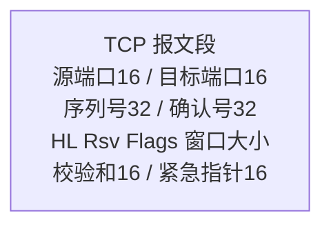
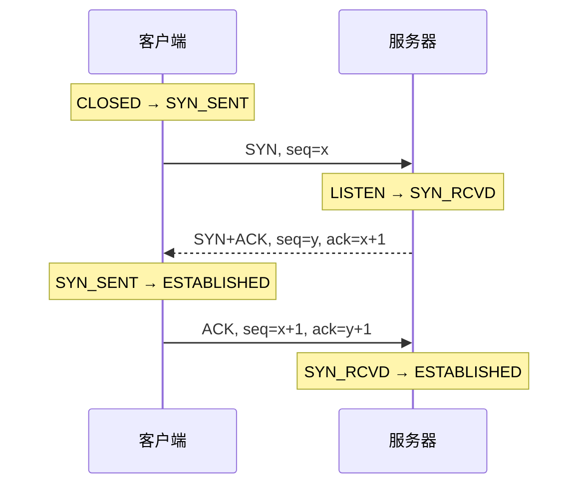
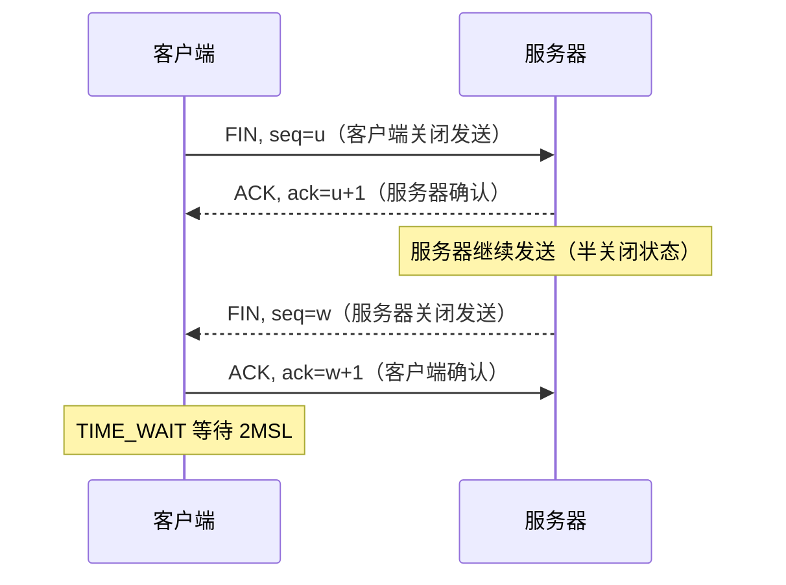
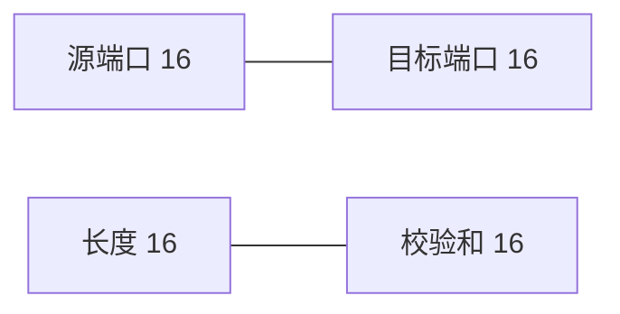
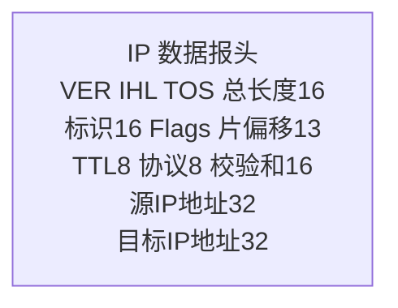

## 前置知识

建议先阅读以下内容再进入本文：

- [网络基础与协议](/networking/010-NetworkBasicsAndProtocol)

## 1. OSI 七层模型详解

### 1.1 各层功能

| 层级 | 名称       | 功能         | PDU         | 设备   |
| ---- | ---------- | ------------ | ----------- | ------ |
| 7    | 应用层     | 网络服务接口 | 数据        | 网关   |
| 6    | 表示层     | 数据格式转换 | 数据        | -      |
| 5    | 会话层     | 会话管理     | 数据        | -      |
| 4    | 传输层     | 端到端通信   | 段(Segment) | 防火墙 |
| 3    | 网络层     | 路由寻址     | 包(Packet)  | 路由器 |
| 2    | 数据链路层 | 帧传输       | 帧(Frame)   | 交换机 |
| 1    | 物理层     | 比特传输     | 比特(Bit)   | 集线器 |

### 1.2 数据封装过程

```
应用数据
    ↓ + 应用层头
表示层PDU
    ↓ + 表示层头
会话层PDU
    ↓ + TCP/UDP头
传输层段(Segment)
    ↓ + IP头
网络层包(Packet)
    ↓ + 帧头+帧尾
数据链路层帧(Frame)
    ↓
物理层比特流(Bit)
```

## 2. TCP/IP 模型

### 2.1 四层结构

| TCP/IP 层  | 对应 OSI 层 | 协议                 |
| ---------- | ----------- | -------------------- |
| 应用层     | 5/6/7       | HTTP, DNS, SMTP, FTP |
| 传输层     | 4           | TCP, UDP, SCTP       |
| 网际层     | 3           | IP, ICMP, ARP        |
| 网络接口层 | 1/2         | Ethernet, Wi-Fi      |

### 2.2 TCP vs OSI

| 特性     | OSI      | TCP/IP   |
| -------- | -------- | -------- |
| 层数     | 7        | 4        |
| 先有模型 | 是       | 否       |
| 实用性   | 理论参考 | 实际标准 |
| 严格分层 | 是       | 较灵活   |

## 3. TCP 协议深度

### 3.1 TCP 首部格式



**标志位**：

| 标志 | 含义             |
| ---- | ---------------- |
| URG  | 紧急指针有效     |
| ACK  | 确认号有效       |
| PSH  | 接收方应尽快交付 |
| RST  | 重置连接         |
| SYN  | 同步序列号       |
| FIN  | 释放连接         |

### 3.2 三次握手



**为什么是三次**：本质上是最少要保证「双方的收发能力都被确认」。两次无法让服务器确认自己的
发送与客户端的接收可达；且历史中失效的旧 SYN 若直接建立连接，会浪费服务器资源——第三次 ACK
让客户端有机会否决旧连接。

**初始序列号（ISN）是随机选取的**：防止被猜测伪造（老的四元组报文迟到的「历史幻影连接」也
需要靠序列号区分新旧）。

### 3.3 四次挥手



**为什么是四次**：TCP 全双工，两个方向各需一次 FIN/ACK。中间两次「ACK 与 FIN」通常因服务器
还有数据没发完而无法合并——若发完了，ACK+FIN 合并成一次，就退化为三次报文。

**TIME_WAIT 为什么要 2MSL**（MSL = 报文最大生存时间；Linux 把 TIME_WAIT 时长固定为约 60 秒，
不提供 sysctl 调整项，`tcp_fin_timeout` 调的是另一个状态 FIN_WAIT_2 的超时）：

1. 确保最后一个 ACK 若丢失，对方重传 FIN 时自己还在场应答；
2. 让本连接的旧报文在网络中自然消亡，避免污染相同四元组的新连接。

大量 TIME_WAIT 出现在**主动关闭方**（通常是 Web 服务器），解决靠连接复用（长连接）而非调参。

### 3.4 滑动窗口与拥塞控制

TCP 可靠且高效，靠两套独立的窗口机制：

- **流量控制（rwnd）**：接收方在 ACK 中通告剩余缓冲区大小，防止「快发送方淹死慢接收方」，
  保护的是**对端**；
- **拥塞控制（cwnd）**：发送方对网络拥塞程度的自我估计，防止「压垮网络」，保护的是**链路**。

$$\text{实际发送窗口} = \min(\text{rwnd}, \text{cwnd})$$

经典拥塞控制（Reno）的四个阶段：

| 阶段     | 行为                                        | 触发条件            |
| :------- | :------------------------------------------ | :------------------ |
| 慢启动   | cwnd 从 10 MSS 起步，每个 RTT 翻倍（指数）   | 连接建立/超时后     |
| 拥塞避免 | cwnd 达到阈值 ssthresh 后每个 RTT 线性 +1    | cwnd ≥ ssthresh     |
| 快重传   | 收到 **3 个重复 ACK** 立即重传丢失段          | 丢包（乱序到达）    |
| 快恢复   | ssthresh 与 cwnd 减半后线性增长，不回到慢启动 | 触发快重传时        |

超时重传（RTO 到期）则被视为严重拥塞：cwnd 重置回初值、重新慢启动。Linux 默认算法为 **CUBIC**
（以三次函数平滑增长，高带宽长肥管道下更激进），数据中心内常配 BBR（基于带宽与 RTT 测量而非
丢包信号，`sysctl net.ipv4.tcp_congestion_control` 可查）。

**HTTP/3 为什么要换掉 TCP**：TCP 的按序交付使一个流丢包阻塞整个连接的交付（队头阻塞），且拥
塞窗口被所有流共享；QUIC 把可靠传输下沉到「流」粒度解决前者，连接迁移解决后者无法适应 Wi-Fi
切换的问题，详见 [HTTP 协议](networking/120-HTTPProtocol)。

### 3.5 TCP 状态机

```
CLOSED → SYN_SENT → ESTABLISHED
                ↓
CLOSED → LISTEN → SYN_RCVD → ESTABLISHED

ESTABLISHED → FIN_WAIT_1 → FIN_WAIT_2 → TIME_WAIT → CLOSED
ESTABLISHED → CLOSE_WAIT → LAST_ACK → CLOSED
```

`ss -s` 中各状态的排障含义见 [网络故障排查工具](networking/290-NetworkTroubleshootTools)：
CLOSE_WAIT 偏多 = 应用漏调 close，SYN_RCVD 偏多 = SYN Flood 或握手积压。

## 4. UDP 协议

### 4.1 UDP 首部



仅 8 字节首部，无连接、无确认、无重传。

### 4.2 TCP vs UDP

| 特性     | TCP       | UDP        |
| -------- | --------- | ---------- |
| 连接     | 面向连接  | 无连接     |
| 可靠性   | 可靠      | 不可靠     |
| 顺序     | 有序      | 无序       |
| 流控     | 有        | 无         |
| 拥塞控制 | 有        | 无         |
| 速度     | 较慢      | 快         |
| 首部     | 20~60字节 | 8字节      |
| 适用     | 文件传输  | 实时音视频 |

## 5. IP 协议

### 5.1 IPv4 首部



### 5.2 IPv6 改进

| 特性     | IPv4         | IPv6       |
| -------- | ------------ | ---------- |
| 地址长度 | 32位         | 128位      |
| 首部     | 可变         | 固定40字节 |
| 分片     | 路由器可分片 | 仅源端分片 |
| 安全     | 可选         | 内置IPsec  |
| 配置     | 手动/DHCP    | 自动配置   |

### 5.3 子网划分

$$\text{子网数} = 2^n$$

$$\text{每子网主机数} = 2^m - 2$$

其中 $n$ 为借用的位数，$m$ 为剩余主机位。

**示例**：192.168.1.0/24 划分为4个子网：

| 子网 | 网络地址         | 可用范围  | 广播地址 |
| ---- | ---------------- | --------- | -------- |
| 1    | 192.168.1.0/26   | .1~.62    | .63      |
| 2    | 192.168.1.64/26  | .65~.126  | .127     |
| 3    | 192.168.1.128/26 | .129~.190 | .191     |
| 4    | 192.168.1.192/26 | .193~.254 | .255     |

## 6. ARP 与 ICMP

### 6.1 ARP 协议

将 IP 地址解析为 MAC 地址：

```
主机A: 谁有 192.168.1.1？告诉 192.168.1.100（广播）
主机B: 192.168.1.1 的 MAC 是 aa:bb:cc:dd:ee:ff（单播）
```

**ARP 缓存**：

```bash
arp -a
ip neigh show
```

### 6.2 ICMP 协议

| 类型 | 代码 | 含义         |
| ---- | ---- | ------------ |
| 0    | 0    | Echo Reply   |
| 3    | 0~15 | 目标不可达   |
| 5    | 0~3  | 重定向       |
| 8    | 0    | Echo Request |
| 11   | 0~1  | 超时         |

**Ping 原理**：发送 ICMP Echo Request，等待 Echo Reply。

**Traceroute 原理**：发送 TTL 递增的 IP 包，通过 ICMP 超时消息确定路径。
## OSI 七层模型

**基本写法：OSI 模型层次**
```text
`7. 应用层 (Application) - HTTP/FTP/SMTP/DNS
6. 表示层 (Presentation) - SSL/TLS/JPEG/ASCII
5. 会话层 (Session) - NetBIOS/RPC
4. 传输层 (Transport) - TCP/UDP
3. 网络层 (Network) - IP/ICMP
2. 数据链路层 (Data Link) - Ethernet/ARP
1. 物理层 (Physical) - 电信号/光信号`
```
```text
# OSI 七层模型从上到下
7. 应用层 - 为应用程序提供网络服务
6. 表示层 - 数据格式转换和加密
5. 会话层 - 管理会话连接
4. 传输层 - 端到端通信
3. 网络层 - 路由和寻址
2. 数据链路层 - 相邻节点通信
1. 物理层 - 比特流传输
```

---

## TCP/IP 四层模型

**基本写法：TCP/IP 模型层次**
```text
`4. 应用层 (Application) - HTTP/FTP/SMTP/DNS/SSH
3. 传输层 (Transport) - TCP/UDP
2. 网络层 (Internet) - IP/ICMP/ARP
1. 网络接口层 (Link) - Ethernet/WiFi`
```
```text
# TCP/IP 四层模型
4. 应用层 - 合并了 OSI 的应用、表示、会话层
3. 传输层 - 对应 OSI 传输层
2. 网络层 - 对应 OSI 网络层
1. 网络接口层 - 合并了 OSI 的数据链路和物理层
```

---

## OSI 与 TCP/IP 对应关系

**基本写法：模型对应映射**
```text
`OSI 模型          TCP/IP 模型        协议示例
7. 应用层    -->   4. 应用层          HTTP, DNS
6. 表示层    -->   4. 应用层          SSL/TLS
5. 会话层    -->   4. 应用层          RPC
4. 传输层    -->   3. 传输层          TCP, UDP
3. 网络层    -->   2. 网络层          IP, ICMP
2. 数据链路层 -->  1. 网络接口层      Ethernet
1. 物理层    -->   1. 网络接口层      双绞线`
```
```text
# OSI 与 TCP/IP 模型对应关系
OSI 7层模型           TCP/IP 4层模型
应用层、表示层、会话层  -->  应用层
传输层              -->  传输层
网络层              -->  网络层
数据链路层、物理层      -->  网络接口层
```

---

## TCP 协议

**基本写法：TCP 三次握手**
```text
`客户端              服务端
  |                   |
  |--- SYN ------->   |  客户端发送 SYN, seq=x
  |                   |
  |<-- SYN-ACK ----   |  服务端回复 SYN+ACK, seq=y, ack=x+1
  |                   |
  |--- ACK ------->   |  客户端发送 ACK, ack=y+1
  |                   |
  |<== 数据传输 ==>|`
```
```text
# TCP 三次握手建立连接
1. 客户端发送 SYN (seq=x)
2. 服务端回复 SYN+ACK (seq=y, ack=x+1)
3. 客户端发送 ACK (ack=y+1)
连接建立完成
```

**基本写法：TCP 四次挥手**
```text
`客户端              服务端
  |                   |
  |--- FIN ------->   |  客户端发送 FIN
  |<-- ACK --------   |  服务端回复 ACK
  |                   |
  |<-- FIN --------   |  服务端发送 FIN
  |--- ACK ------->   |  客户端回复 ACK`
```
```text
# TCP 四次挥手断开连接
1. 客户端发送 FIN
2. 服务端回复 ACK
3. 服务端发送 FIN
4. 客户端回复 ACK
连接断开完成
```

**基本写法：TCP 状态**
```text
`LISTEN       - 服务端监听端口
SYN_SENT     - 客户端已发送 SYN
SYN_RECV     - 服务端已收到 SYN
ESTABLISHED  - 连接已建立
FIN_WAIT_1   - 主动关闭方等待 FIN
FIN_WAIT_2   - 主动关闭方等待对方 FIN
TIME_WAIT    - 等待足够时间确保对方收到 ACK
CLOSE_WAIT   - 被动关闭方等待关闭
LAST_ACK     - 被动关闭方发送 FIN 后等待 ACK
CLOSED       - 连接已关闭`
```
```text
# TCP 连接状态转换
LISTEN -> SYN_RECV -> ESTABLISHED -> FIN_WAIT_1 -> FIN_WAIT_2 -> TIME_WAIT -> CLOSED
```

---

## TCP 特性

**基本写法：TCP 可靠性机制**
```text
`- 序列号：保证数据有序到达
- 确认应答：确认收到的数据
- 超时重传：未收到确认则重传
- 流量控制：滑动窗口机制
- 拥塞控制：避免网络拥塞`
```
```text
# TCP 可靠性保障机制
1. 序列号和确认号 - 保证数据有序和完整
2. 超时重传 - 丢包时自动重传
3. 滑动窗口 - 流量控制
4. 拥塞控制 - 慢启动、拥塞避免
```

**基本写法：TCP 拥塞控制算法**
```text
`- 慢启动 (Slow Start) - 连接开始时缓慢增加窗口
- 拥塞避免 (Congestion Avoidance) - 线性增加窗口
- 快重传 (Fast Retransmit) - 收到 3 个重复 ACK 立即重传
- 快恢复 (Fast Recovery) - 快重传后不回到慢启动`
```
```text
# TCP 拥塞控制四个阶段
1. 慢启动 - 窗口指数增长
2. 拥塞避免 - 窗口线性增长
3. 快重传 - 检测丢包立即重传
4. 快恢复 - 拥塞后快速恢复
```

---

## UDP 协议

**基本写法：UDP 特性**
```text
`- 无连接：不需要建立连接
- 不可靠：不保证数据到达
- 无序：不保证数据顺序
- 快速：无握手和确认开销
- 轻量：头部仅 8 字节`
```
```text
# UDP 协议特点
- 无连接，直接发送数据
- 不保证可靠性，可能丢包
- 头部小（8 字节），开销低
- 适用于实时应用：视频、语音、游戏
```

**基本写法：UDP 应用场景**
```text
`- DNS 查询 - 一次请求一次响应
- DHCP - 动态主机配置
- SNMP - 网络管理
- 流媒体 - 视频音频传输
- 在线游戏 - 实时交互`
```
```text
# UDP 常见应用
- DNS (端口 53) - 域名解析
- DHCP (端口 67/68) - IP 分配
- TFTP (端口 69) - 简单文件传输
- NTP (端口 123) - 时间同步
- SNMP (端口 161) - 网络管理
```

---

## IP 协议

**基本写法：IPv4 地址结构**
`<网络号><主机号>`
```text
# IPv4 地址分类
A 类: 1.0.0.0 - 126.255.255.255   (默认掩码 /8)
B 类: 128.0.0.0 - 191.255.255.255 (默认掩码 /16)
C 类: 192.0.0.0 - 223.255.255.255 (默认掩码 /24)
D 类: 224.0.0.0 - 239.255.255.255 (组播)
E 类: 240.0.0.0 - 255.255.255.255 (保留)
```

**基本写法：私有 IP 地址范围**
```text
`10.0.0.0/8        - A 类私有
172.16.0.0/12     - B 类私有
192.168.0.0/16    - C 类私有`
```
```text
# RFC 1918 私有 IP 地址范围
A 类私有: 10.0.0.0 - 10.255.255.255 (10.0.0.0/8)
B 类私有: 172.16.0.0 - 172.31.255.255 (172.16.0.0/12)
C 类私有: 192.168.0.0 - 192.168.255.255 (192.168.0.0/16)
```

**基本写法：CIDR 表示法**
`<IP>/<前缀长度>`
```text
# CIDR 无类域间路由
192.168.1.0/24  - 256 个地址 (254 可用)
10.0.0.0/16     - 65536 个地址
172.16.0.0/12   - 1048576 个地址
```

**基本写法：IPv6 地址**
`<8组十六进制>:<8组十六进制>`
```text
# IPv6 地址格式
2001:0db8:85a3:0000:0000:8a2e:0370:7334

# 简化形式（省略前导零和连续零组）
2001:db8:85a3::8a2e:370:7334

# 回环地址
::1

# 未指定地址
::
```

---

## ICMP 协议

**基本写法：ICMP 类型**
```text
`Type 0  - Echo Reply (ping 响应)
Type 3  - Destination Unreachable (目标不可达)
Type 8  - Echo Request (ping 请求)
Type 11 - Time Exceeded (超时)
Type 5  - Redirect (重定向)`
```
```text
# 常见 ICMP 类型
Type 0  - Echo Reply（ping 响应）
Type 3  - Destination Unreachable（目标不可达）
Type 8  - Echo Request（ping 请求）
Type 11 - Time Exceeded（TTL 超时，traceroute 使用）
```

**基本写法：ping 命令原理**
```bash
`# 发送 ICMP Echo Request
ping <目标>

# 接收 ICMP Echo Reply`
```
```bash
# ping 基于 ICMP 协议
ping -c 4 8.8.8.8
```

---

## ARP 协议

**基本写法：ARP 工作流程**
```text
`1. 主机 A 查询 IP 对应的 MAC
2. 发送 ARP 请求（广播）
3. 目标主机 B 回复 ARP 响应（单播）
4. 主机 A 缓存 ARP 条目`
```
```text
# ARP 地址解析过程
1. 主机 A 需要发送数据给 192.168.1.2
2. 查询 ARP 缓存，未找到
3. 发送 ARP 广播：谁的 IP 是 192.168.1.2？
4. 主机 B 回复：我的 IP 是 192.168.1.2，MAC 是 xx:xx:xx:xx:xx:xx
5. 主机 A 缓存 ARP 条目并发送数据
```

**基本写法：查看 ARP 表**
`arp -a`
```bash
# 查看 ARP 缓存表
arp -a
```

---

## 常见协议端口

**基本写法：常用 TCP 端口**
```text
`20/21  - FTP (文件传输)
22     - SSH (安全 Shell)
23     - Telnet (远程登录)
25     - SMTP (邮件发送)
53     - DNS (域名解析)
80     - HTTP (网页)
110    - POP3 (邮件接收)
143    - IMAP (邮件访问)
443    - HTTPS (安全网页)
3306   - MySQL
5432   - PostgreSQL
6379   - Redis
8080   - HTTP 备用`
```
```text
# 常用 TCP 服务端口
22   - SSH
80   - HTTP
443  - HTTPS
3306 - MySQL
5432 - PostgreSQL
6379 - Redis
```

**基本写法：常用 UDP 端口**
```text
`53     - DNS (域名解析)
67/68  - DHCP (动态主机配置)
69     - TFTP (简单文件传输)
123    - NTP (时间同步)
161    - SNMP (网络管理)`
```
```text
# 常用 UDP 服务端口
53   - DNS
67/68 - DHCP
123  - NTP
161  - SNMP
```

---

## 子网划分

**基本写法：子网掩码计算**
`<IP>/<前缀>`
```text
# 子网掩码示例
/24 = 255.255.255.0    - 256 个地址
/25 = 255.255.255.128  - 128 个地址
/26 = 255.255.255.192  - 64 个地址
/27 = 255.255.255.224  - 32 个地址
/28 = 255.255.255.240  - 16 个地址
/30 = 255.255.255.252  - 4 个地址
```

**基本写法：计算可用主机数**
`可用主机 = 2^(32-前缀) - 2`
```text
# 子网可用主机数计算
/24 网络：2^8 - 2 = 254 个可用主机
/25 网络：2^7 - 2 = 126 个可用主机
/26 网络：2^6 - 2 = 62 个可用主机
/30 网络：2^2 - 2 = 2 个可用主机（点对点链路）
```

**基本写法：子网划分示例**
```bash
`# 将 192.168.1.0/24 划分为 4 个子网
子网 1: 192.168.1.0/26     (0-63)
子网 2: 192.168.1.64/26    (64-127)
子网 3: 192.168.1.128/26   (128-191)
子网 4: 192.168.1.192/26   (192-255)`
```
```text
# 192.168.1.0/24 划分为 4 个 /26 子网
子网 1: 192.168.1.0/26    范围 0-63     可用 1-62
子网 2: 192.168.1.64/26   范围 64-127   可用 65-126
子网 3: 192.168.1.128/26  范围 128-191  可用 129-190
子网 4: 192.168.1.192/26  范围 192-255  可用 193-254
```
