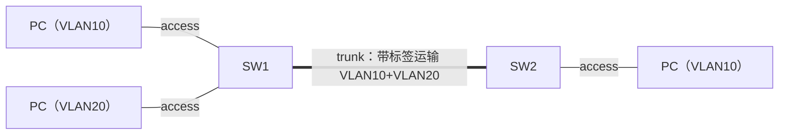

前置知识：交换机转发原理与模拟器实验环境（见
[网络实验环境与模拟器](networking/035-NetworkSimulatorLab)）；本文实验为华为 eNSP
（VRP 语法），概念与 H3C/Cisco 平台通用，命令差异以各平台文档为准。

## 知识点地图

- **知识类别**：VLAN 与 Trunk——二层网络的广播域隔离与跨交换机扩展。VLAN 是 160 篇交换技术的纵深篇，专注 access/trunk 的心智模型与动手实验。
- **解决什么问题**：一栋楼的设备全在一个广播域里，广播风暴、安全隐患、地址浪费全来了；跨交换机又要让同 VLAN 设备互通——access 口分 VLAN、trunk 口带标签运输，就是这组问题的完整答案。
- **什么时候用到**：按部门/楼层切分网络；跨交换机部署同一业务；排障时判断「二层为什么不通」（VLAN 不匹配、trunk 未放行）。

## 场景：一栋楼的广播域

一栋两层的小公司，楼内 40 台电脑接在 4 台交换机上组成一个大地二层网。用着用着出现两个
问题：一是网速莫名变慢——任何一台中毒主机的 ARP 广播都会刷满整个楼的网络，所有人都被
迫处理与自己无关的广播帧；二是财务部的电脑和销售部在同一个二层里，抓包就能互相看见
对方流量。把交换机按部门物理隔开？成本高、工位又混着坐。

VLAN（Virtual LAN）的答案：**不动网线，在交换机内部把端口划进不同的广播域**。一台物理
交换机从此像多台逻辑交换机——广播帧只在本 VLAN 内洪泛，不同 VLAN 的二层流量彻底隔离，
想要互通必须经过三层设备（这正是我们要的管控点）。

## 心智模型：access 口与 trunk 口

VLAN 的全部配置动作可以压缩成一个问题的答案：**一个帧从网线进来，它属于哪个 VLAN？**

- **access 口**：接终端（PC、服务器、AP）。答案由「这个口的配置」决定——口在 VLAN 10
  里，进来的帧就打上 VLAN 10 的内部标记。交换机内部转发时帧**总是带着 VLAN 标签**，
  但从 access 口发给终端前会把标签剥掉（终端不需要知道 VLAN 的存在）。
- **trunk 口**：接交换机。一条链路要同时运输多个 VLAN 的流量，无法靠「口配置」区分
  归属，所以在帧出 trunk 口前打上 802.1Q 标签（4 字节，含 12 位 VLAN ID），对端交换机
  读标签决定帧属于哪个 VLAN。放行列表（allow-pass）决定哪些 VLAN 的帧允许通过。



容易混淆的一点：**access/trunk 是端口角色，不是链路属性**——同一条链路两端可以一边
access（接 PC）一边 trunk（接交换机）。判断口该配什么角色只看对端设备：对端是终端就
access，对端是交换机就 trunk。

## VLAN 间为什么必须「路由」

不同 VLAN 的设备二层不通（广播域隔离），要通信只能走三层：给每个 VLAN 一个网关接口，
流量「先送到网关、网关路由、再转发到目标 VLAN」。交换机上这个网关叫 VLANIF（Cisco 叫
SVI）——一个虚拟三层接口，IP 就是该 VLAN 内所有 PC 的网关。

由此推出跨 VLAN 互通的三个必要条件，也是排错清单：

1. 每个 VLAN 有 VLANIF 且 IP 与该 VLAN 网段一致；
2. PC 的网关指向**本 VLAN** 的 VLANIF 地址；
3. 设备开启三层转发能力（VRP 里三层交换机路由默认可用，需确认 `ip routing` 类开关）。

## 实验一：跨两台交换机的单 VLAN 互通

需求（还原自真实课堂实验）：两层楼各一台交换机 S1、S2，各接两台 PC，全楼组成 VLAN 100
并互通，网关 192.168.1.1，PC 地址 192.168.1.101-104/24。

地址规划表（拓扑即文档，先写表再敲命令）：

| 设备 | 接口 | 角色 | 归属/地址 |
| --- | --- | --- | --- |
| PC1-PC4 | Ethernet | 终端 | 192.168.1.101-104/24，网关 192.168.1.1 |
| S1 | GE0/0/1、GE0/0/2 | access | VLAN 100 |
| S1 | GE0/0/24 | trunk | 放行 VLAN 100，连 S2 |
| S2 | GE0/0/1、GE0/0/2 | access | VLAN 100 |
| S2 | GE0/0/24 | trunk | 放行 VLAN 100，连 S1 |
| S2 | Vlanif100 | 网关 | 192.168.1.1/24 |

```text
# S1（S2 对称，接口归属相同）
<Huawei> system-view
[Huawei] sysname S1
[S1] vlan batch 100                       # 创建 VLAN 100
[S1] interface GigabitEthernet 0/0/1
[S1-GigabitEthernet0/0/1] port link-type access
[S1-GigabitEthernet0/0/1] port default vlan 100
[S1-GigabitEthernet0/0/1] quit
[S1] interface GigabitEthernet 0/0/24
[S1-GigabitEthernet0/0/24] port link-type trunk
[S1-GigabitEthernet0/0/24] port trunk allow-pass vlan 100

# S2 额外一步：网关配在 S2 的 VLANIF 上
[S2] interface Vlanif 100
[S2-Vlanif100] ip address 192.168.1.1 24
```

验收：任意 PC ping 其余三台，全部 `5 packet(s) received, 0% packet loss`。四步分层
验收顺序：PC 与本交换机其他 PC 通（二层同段）→ PC 与跨交换机 PC 通（trunk 生效）→
PC ping 网关（VLANIF 生效）→ 全互 ping。

**找错训练（来自真实学生的两处错误）**：一是把 trunk 拼成 `truck`——VRP 不报错也不
生效，端口仍是默认类型，跨交换机不通；二是需求写「放行所有 VLAN 但单独不允许 VLAN 1
通过」，配置却用 `port trunk allow-pass vlan all`——这两句互相矛盾，`all` 无法排除
VLAN 1，正确写法是精确放行：`port trunk allow-pass vlan 100`（或 `vlan 100` 加需要的
其他编号）。**精确放行是 trunk 的生产守则**：只放行业务需要的 VLAN，漏洞与广播都少。

## 实验二：多部门多 VLAN 与跨交换机路由

需求：S1 上三个部门（销售 vlan10、运营 vlan20、研发 vlan30），S2 上三个部门（人事
vlan40、财务 vlan50、其他 vlan60），各网段 192.168.X.0/24，每 VLAN 一台 PC（.2），
任意两台 PC 互通。

与实验一的本质差异：现在有 **6 个广播域**，跨 VLAN 流量必须走三层。两台交换机之间除了
业务 VLAN 还需要一个**互联 VLAN**（vlan100，网段 10.0.0.0/24）——它是两台三层设备之间
的「路由下一跳通道」：

| 设备 | 配置要点 |
| --- | --- |
| S1 | vlan batch 10 20 30 100；GE0/0/1 access vlan10；Vlanif10=192.168.10.1/24、Vlanif20/30 同理；Vlanif100=10.0.0.1/24 |
| S2 | vlan batch 40 50 60 100；对应 Vlanif40/50/60 = 192.168.40.1/50.1/60.1；Vlanif100=10.0.0.2/24 |
| trunk（GE0/0/24 两侧） | `port trunk allow-pass vlan 10 20 30 40 50 60 100` |
| PC | 网关填**本 VLAN** 的 Vlanif 地址（如人事部 PC 填 192.168.40.1） |

```text
# S1 核心配置
[S1] vlan batch 10 20 30 100
[S1] interface GigabitEthernet 0/0/1
[S1-GigabitEthernet0/0/1] port link-type access
[S1-GigabitEthernet0/0/1] port default vlan 10
[S1] interface Vlanif 10
[S1-Vlanif10] ip address 192.168.10.1 255.255.255.0
[S1] interface Vlanif 100
[S1-Vlanif100] ip address 10.0.0.1 255.255.255.0
[S1] ip routing                            # 确认三层转发开启
```

验收命令按数据路径设计：PC1 ping 同段网关（Vlanif 直通）→ ping 对端互联地址
`10.0.0.2`（跨设备、走互联 VLAN）→ ping 跨 VLAN 的 PC（完整三层互通）。三步分别验证
「本机三层」「互联链路」「端到端路由」。

**直连路由的观察点**：配置里没有任何静态路由，为什么全通？因为两台交换机的 Vlanif 都
是直连接口——S1 天然知道 `10.0.0.0/24` 与各本机 VLAN 网段直连，到 `192.168.40.0/24`
这类远端网段的流量交给互联地址 10.0.0.2 所在的直连段「顺路」带过去。用
`display ip routing-table` 找出这些直连路由（Direct），再思考：如果互联段不打通、或者
两台设备之间隔着路由器，才真正需要 `ip route-static`——先看懂直连路由何时够用，再学
静态路由，顺序不能反。

## 常见坑

1. **trunk 漏放行互联 VLAN**：业务 VLAN 都放了、互联 VLAN 100 没放，同 VLAN 通、跨
   VLAN 全断——因为路由的下一跳通道断了。排错时 trunk 放行列表与地址规划表逐项对照。
2. **PC 网关填错段**：人事部 PC 网关误填 192.168.10.1，现象是「同段通、跨段断」——
   PC 的 ARP 都拿不到网关 MAC。检查口诀：PC 网关必须等于**本 VLAN** 的 Vlanif 地址。
3. **allow-pass vlan all 的滥用**：图省事放行全部 VLAN，广播与未授权流量跟着全通；
   生产环境一律精确放行（见实验一找错训练）。
4. **VLANIF 与网段不对应**：Vlanif10 配成 192.168.20.1，本 VLAN PC 的网关指向它后
   ARP 能通、回程路由错乱，现象零碎难查——配置后用规划表核对每个 Vlanif 的网段。
5. **只在 S1 建 VLAN，S2 上没建**：trunk 虽然把带标签的帧送过去了，但 S2 上没有对应
   VLAN 时帧被丢弃。VRP 的 trunk 默认只放行 VLAN 1，两侧 VLAN 创建与放行列表必须成对
   检查。

## 与相邻知识的关系

- STP 与链路聚合都在交换机之间工作，与 trunk 正交：trunk 解决「一条线运多个 VLAN」，
  STP 解决「多条线成环」（见[交换与路由技术](networking/160-SwitchingAndRouting)），
  两者常同时出现在两台交换机之间；
- 三层交换机的 VLANIF 路由是静态路由/OSPF 的起点：当三层设备超过两台、互联段不再直连
  时，就需要动态路由协议接管（同上篇第 4、5 节）；
- 本文的「先写规划表再敲命令、分层验收」来自
  [网络实验环境与模拟器](networking/035-NetworkSimulatorLab) 的实验方法论。

## 实践

以下实验在 eNSP（或等价模拟器）完成，预计 60 分钟。动手前先交地址规划表（四列：设备、
接口、IP、用途）——没有规划表的实验不许开工。

实验一复刻（20 分钟）：不看本文配置，仅凭规划表完成跨楼层单 VLAN 互通。验收清单
（也是这类实验的通用评分点）：拓扑截图、VLAN 创建记录（`display vlan`）、接口划分
（`display port vlan`）、trunk 配置、四台 PC 互 ping 全通截图。

提示（思路方向）：按 access 口 → trunk 口 → VLANIF 网关的顺序配置，每完成一段就做
一次对应层的验收。卡住时对照第 6 节坑单逐条自查，再对照本文配置。

实验二复刻（25 分钟）：完成六部门多 VLAN 路由互通。验收：任选一台 PC ping 通其余
五台；在两台交换机上各截一张 `display ip routing-table`，圈出所有 Direct 路由并标注
它们各自负责哪一段路径。

提示：六台 PC 逐一改地址繁琐，模拟器的 PC 支持批量保存配置；互联 VLAN 100 是本实验的
灵魂，trunk 放行列表里必须有它。参考配置就是第 4 节的表格展开，先自己写再对照。

找错题（10 分钟）：同事的跨 VLAN 实验现象是「同 VLAN 内 PC 互 ping 全通，跨 VLAN
全部超时」。给出按概率排序的三条排查动作与每条的验证命令。验收：三条动作里必须包含
「trunk 放行互联 VLAN」与「PC 网关指向」。

提示（思路方向）：同 VLAN 通说明 access 与 trunk 的业务 VLAN 部分正常，故障集中在
三层路径。参考排查序：

```text
1. trunk 放行列表里有互联 VLAN 吗   display port vlan   （漏 100 是最高频原因）
2. 两台交换机的 Vlanif100 地址通吗  在交换机上 ping 对端互联地址（验证路由通道）
3. PC 的网关填的是本 VLAN 的 Vlanif 吗  在 PC 上 ipconfig 对照规划表
```

设计题（15 分钟）：把实验二扩展为 8 个部门 VLAN，但要求「财务 VLAN 与其他所有 VLAN
二层隔离且三层也不通，其余全部互通」。写出需要的配置要点（不用逐行命令）。验收：能
说清「三层隔离」要在哪台设备、用什么手段实现（不用 Vlanif 服务财务段，或用 ACL 拦截）。

提示（思路方向）：二层隔离靠不给财务 VLAN 配 VLANIF 或不放进 trunk；三层隔离有两条
路线——不建 Vlanif60（彻底不通）或建了 Vlanif 但用流量过滤（ACL，见
[网络安全技术](networking/220-NetworkSecurityTech)）拦住跨段访问。两种路线的取舍
（管控粒度 vs 排错复杂度）写进你的答案。

## 下一步

- STP 防环与链路聚合是交换机之间的下一课：[交换与路由技术](networking/160-SwitchingAndRouting)；
- 跨 VLAN 不通的系统排错框架：[网络诊断](/networking/290-NetworkTroubleshootTools)；
- 服务器侧 VLAN（子接口、网桥、VLAN 过滤）见
  [网络命名空间与虚拟网桥](networking/330-NetworkNamespaceVirtualBridge)。
