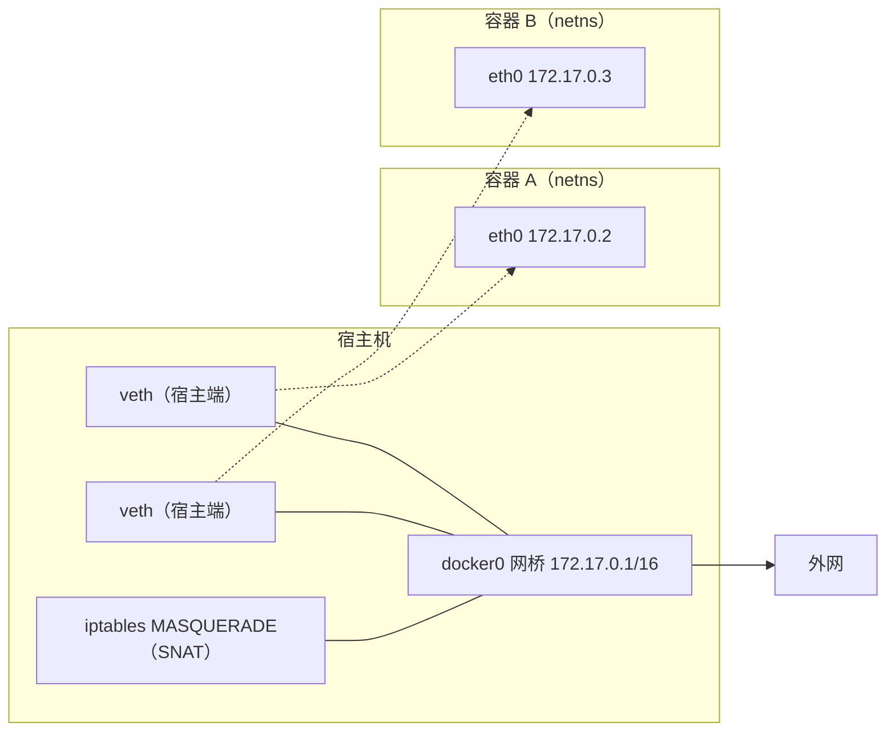

## 前置知识

建议先阅读以下内容再进入本文：

- [网络基础与协议](/networking/010-NetworkBasicsAndProtocol)

## 1. 网络命名空间

### 1.1 netns 原理

网络命名空间（netns）是 Linux 内核的网络隔离单元：**每个 netns 拥有独立的一整套网络栈**——
独立的接口、IP 地址、路由表、iptables 规则、甚至独立的环回口。同一台物理机上的两个 netns 相
互看不见对方的网卡，就像两台独立的机器。

> 类比：小区里的独门独户。楼是同一栋（同一内核），但每户有自己的门牌（IP）、自己的信箱（路
> 由表）和自己的门禁规则（防火墙）。容器技术正是给每个容器「分一套房」。

新创建的 netns 里只有一块状态为 DOWN 的 `lo` 接口——这正是理解容器网络「从零搭起」的起点。

### 1.2 ip netns 命令

```bash
sudo ip netns add ns1                 # 创建命名空间（句柄落在 /var/run/netns/ns1）
sudo ip netns list                    # 列出
sudo ip -n ns1 link set lo up        # -n 等价于 ip netns exec ns1 ...，先启 lo
sudo ip -n ns1 addr show
# 预期输出：lo: <LOOPBACK,UP,LOWER_UP> ... inet 127.0.0.1/8
sudo ip netns exec ns1 bash           # 进入 ns1 的 shell，此后命令都在 ns1 内生效
```

`ip netns exec` 是调试容器网络最常用的动作——「进入那个隔离世界执行命令」，Kubernetes 排障
中的 `crictl`/`nsenter` 思路与之一致。

### 1.3 veth pair

netns 之间、netns 与宿主机之间怎么通信？答案是 **veth pair（虚拟以太网对）**：一对互联的虚拟
网口，从一端塞进的帧会原样从另一端出来，像一根交叉网线。创建后可以单独把一端「塞进」某个
netns：

```bash
sudo ip link add veth0 type veth peer name veth1
sudo ip link set veth1 netns ns1      # veth1 归入 ns1，宿主机上不再可见
```

veth 总是成对出现、一端在容器一端在宿主——这就是容器 eth0 的真身。单独存在、没有对端的 veth
会导致发往它的包全部丢弃，是容器「有 IP 但不通」的经典原因之一。

## 2. 虚拟网桥

### 2.1 bridge 原理

veth pair 只能连接两个点，多台「虚拟机」要互通就需要交换机——Linux bridge 就是内核实现的二
层交换机：维护 MAC 地址表，按目的 MAC 转发帧。宿主机的物理网卡、各 netns 的 veth 端都可以挂
到同一个网桥上，形成一个小型局域网。

```bash
sudo ip link add br0 type bridge
sudo ip link set br0 up
sudo ip link set veth0 master br0     # veth 的宿主端挂入网桥
# 宿主机自身要参与通信时，把 IP 配在 br0 上（网桥是接口，可以直接配地址）
sudo ip addr add 172.18.0.1/16 dev br0
```

注意挂入网桥的接口不再直接收发普通报文，流量走网桥逻辑；物理网卡 eth0 挂桥后 IP 应迁到 br0
上——这是把 Linux 做软路由/虚拟化宿主时的标准动作。

### 2.2 brctl/ip link 命令

传统工具 `brctl`（bridge-utils）已逐步被 `ip link` / `bridge` 命令族取代，两者对照：

| 操作         | 旧写法（brctl）         | 新写法（iproute2）                |
| :----------- | :---------------------- | :-------------------------------- |
| 创建网桥     | `brctl addbr br0`       | `ip link add br0 type bridge`     |
| 加端口       | `brctl addif br0 eth0`  | `ip link set eth0 master br0`     |
| 看 MAC 表    | `brctl showmacs br0`    | `bridge fdb show br br0`          |
| 开关 STP     | `brctl stp br0 on`      | `ip link set br0 type bridge stp_state 1` |

新工具还能查 FDB 转发表与 VLAN 过滤（`bridge vlan`），本文末尾的速查区有完整命令清单。

### 2.3 STP 生成树

两个网桥之间如果存在两条链路（为了冗余），广播帧会沿环路无限复制，瞬间打满带宽——这是二层网
络特有的「广播风暴」。STP（生成树协议）通过在网桥间选举，逻辑上阻塞多余端口，把有环物理拓扑
剪成无环树。Linux bridge 支持 STP（`stp_state 1`），容器场景下网桥拓扑简单通常不开；数据中心
级交换网络中 STP/RSTP/MSTP 的角色见 [网络基础与协议](networking/010-NetworkBasicsAndProtocol)。

## 3. 容器网络

### 3.1 Docker 网络模型

理解了 netns + veth + bridge，Docker 的默认 bridge 网络就完全「透明」了：



- 每个容器一个 netns，`eth0` 是 veth 的容器端，宿主端挂到 `docker0` 网桥；
- 容器间通信走 docker0 二层转发；访问外网时由 iptables 的 MASQUERADE 做源地址转换；
- 外部访问容器端口（`-p 8080:80`）由 DNAT 规则实现；
- 其他模式：`host`（不隔离，直接用宿主网络栈）、`none`（只有 lo）、`macvlan`（容器直接持有
  物理网 MAC）。

验证手段就是本文的工具（Docker 不在 /var/run/netns 注册句柄，用 nsenter 通过容器进程进入）：

```bash
docker run -d --name web nginx
PID=$(docker inspect -f '{{.State.Pid}}' web)
sudo nsenter -t $PID -n ip addr        # 预期看到 eth0 172.17.0.2 与 lo
```

### 3.2 CNI 接口

CNI（Container Network Interface）是 Kubernetes 生态的容器网络插件标准：kubelet 在创建/销毁
Pod 时调用 CNI 插件的二进制，传入「网络配置 + 容器 netns 路径」，插件负责完成 veth 创建、挂
桥、分配 IP、写路由——动作集合与本文第 4 节的手工操作完全同构。不同的 CNI 插件（Flannel、
Calico、Cilium）本质是同一套原语的不同组合与数据面选择（桥接/VXLAN/BGP 路由/eBPF）。

## 4. 实战

### 4.1 手动构建容器网络

不借助 Docker，纯手工搭出「一个容器」的网络，是检验上述概念的最好练习：

```bash
# 1. 创建命名空间与网桥
sudo ip netns add pod0
sudo ip link add br0 type bridge && sudo ip link set br0 up
sudo ip addr add 172.18.0.1/16 dev br0

# 2. 连线：veth 一端进容器，一端挂桥
sudo ip link add v0h type veth peer name v0c
sudo ip link set v0c netns pod0
sudo ip link set v0h master br0 && sudo ip link set v0h up

# 3. 容器内配置地址与默认路由
sudo ip -n pod0 link set lo up
sudo ip -n pod0 link set v0c name eth0 && sudo ip -n pod0 link set eth0 up
sudo ip -n pod0 addr add 172.18.0.10/16 dev eth0
sudo ip -n pod0 route add default via 172.18.0.1

# 4. 验证容器内→外网（宿主机需开启转发与 SNAT）
sudo sysctl -w net.ipv4.ip_forward=1
sudo iptables -t nat -A POSTROUTING -s 172.18.0.0/16 ! -o br0 -j MASQUERADE
sudo ip netns exec pod0 ping -c 2 223.5.5.5
# 预期：2 received —— 纯手工容器已经拥有完整的「进桥、出网」能力
```

### 4.2 跨主机通信

两台宿主机上的网桥默认属于两个孤立二层域，打通方式有两类：

- **三层方案**：给每台宿主的网桥分配不同网段，宿主间配路由（或跑 BGP），容器流量以宿主 IP
  转发——Calico 的思路；
- **二层 Overlay**：在宿主间建 VXLAN 隧道把两个 br0 织成一个大二层，容器 IP 可跨主机连续编
  址——Flannel VXLAN 模式与 Open vSwitch 的思路。VXLAN 的封装细节与配置见
  [隧道技术](networking/310-Tunneling)。

## 命名空间基础操作

**基本写法:创建命名空间**
`ip netns add <名称>`
```bash
# 创建名为 ns1 的网络命名空间
ip netns add ns1
ip netns add ns2
```

**基本写法:列出所有命名空间**
`ip netns list`
```bash
# 查看系统中所有网络命名空间
ip netns list
```

**基本写法:删除命名空间**
`ip netns del <名称>`
```bash
# 删除指定网络命名空间
ip netns del ns1
```

**基本写法:在命名空间中执行命令**
`ip netns exec <命名空间> <命令>`
```bash
# 在 ns1 中查看网络配置
ip netns exec ns1 ip addr
# 在 ns1 中查看路由
ip netns exec ns1 ip route
```

**基本写法:进入命名空间 shell**
`ip netns exec <命名空间> bash`
```bash
# 进入 ns1 的交互式 shell
ip netns exec ns1 bash
# 提示符会改变,exit 退出
```

---

## 命名空间接口配置

**基本写法:查看命名空间内接口**
`ip netns exec <命名空间> ip link`
```bash
# 查看 ns1 中的网络接口
ip netns exec ns1 ip link show
```

**基本写法:启动命名空间的环回接口**
`ip netns exec <命名空间> ip link set lo up`
```bash
# 启动 ns1 中的 lo 接口
ip netns exec ns1 ip link set lo up
```

**基本写法:将接口移入命名空间**
`ip link set <接口> netns <命名空间>`
```bash
# 将 eth1 接口移入 ns1
ip link set eth1 netns ns1
```

**基本写法:在命名空间中配置 IP**
`ip netns exec <命名空间> ip addr add <IP/前缀> dev <接口>`
```bash
# 在 ns1 中为 veth0 配置 IP
ip netns exec ns1 ip addr add 10.0.0.1/24 dev veth0
ip netns exec ns1 ip link set veth0 up
```

**基本写法:查看命名空间路由**
`ip netns exec <命名空间> ip route`
```bash
# 查看 ns1 的路由表
ip netns exec ns1 ip route show
```

---

## veth pair 虚拟以太网对

**基本写法:创建 veth pair**
`ip link add <接口1> type veth peer name <接口2>`
```bash
# 创建一对 veth 虚拟网卡
ip link add veth0 type veth peer name veth1
```

**基本写法:将 veth 一端放入命名空间**
`ip link set <接口> netns <命名空间>`
```bash
# 将 veth0 放入 ns1,veth1 放入 ns2
ip link set veth0 netns ns1
ip link set veth1 netns ns2
```

**基本写法:命名空间间通信**
```bash
# 创建两个命名空间并通过 veth 互联
ip netns add ns1
ip netns add ns2
ip link add veth0 type veth peer name veth1
ip link set veth0 netns ns1
ip link set veth1 netns ns2
ip netns exec ns1 ip addr add 10.0.0.1/24 dev veth0
ip netns exec ns2 ip addr add 10.0.0.2/24 dev veth1
ip netns exec ns1 ip link set veth0 up
ip netns exec ns2 ip link set veth1 up
ip netns exec ns1 ip link set lo up
ip netns exec ns2 ip link set lo up
```

**基本写法:测试命名空间互通**
`ip netns exec <命名空间> ping <目标>`
```bash
# 从 ns1 ping ns2
ip netns exec ns1 ping 10.0.0.2
```

**基本写法:删除 veth pair**
`ip netns exec <命名空间> ip link delete <接口>`
```bash
# 删除 veth(另一端会自动删除)
ip netns exec ns1 ip link delete veth0
```

---

## 命名空间与网桥

**基本写法:创建网桥并连接命名空间**
```bash
# 创建网桥并连接多个命名空间
ip link add br0 type bridge
ip link set br0 up

# 创建 ns1 和 ns2 并连接到 br0
ip netns add ns1
ip netns add ns2

ip link add veth0 type veth peer name veth1
ip link add veth2 type veth peer name veth3

ip link set veth0 netns ns1
ip link set veth2 netns ns2
ip link set veth1 master br0
ip link set veth3 master br0

ip netns exec ns1 ip addr add 10.0.0.1/24 dev veth0
ip netns exec ns2 ip addr add 10.0.0.2/24 dev veth2
ip netns exec ns1 ip link set veth0 up
ip netns exec ns2 ip link set veth2 up
```

**基本写法:为网桥配置 IP**
`ip addr add <IP/前缀> dev <网桥>`
```bash
# 主机通过 br0 与命名空间通信
ip addr add 10.0.0.254/24 dev br0
```

**基本写法:验证桥接连通性**
`ip netns exec <命名空间> ping <网桥IP>`
```bash
# 从 ns1 ping 网桥
ip netns exec ns1 ping 10.0.0.254
```

**基本写法:查看网桥 MAC 表**
`bridge fdb show`
```bash
# 查看网桥转发表
bridge fdb show dev br0
```

---

## 命名空间路由

**基本写法:添加命名空间默认路由**
`ip netns exec <命名空间> ip route add default via <网关>`
```bash
# 为 ns1 设置默认网关
ip netns exec ns1 ip route add default via 10.0.0.254
```

**基本写法:命名空间间路由**
`ip netns exec <命名空间> ip route add <网段> via <网关>`
```bash
# 添加到指定网段的路由
ip netns exec ns1 ip route add 192.168.2.0/24 via 10.0.0.254
```

**基本写法:主机开启转发让命名空间访问外网**
`sysctl -w net.ipv4.ip_forward=1`
```bash
# 主机开启 IP 转发
sysctl -w net.ipv4.ip_forward=1
# 配置 NAT
iptables -t nat -A POSTROUTING -s 10.0.0.0/24 -o eth0 -j MASQUERADE
```

**基本写法:命名空间访问外网**
`ip netns exec <命名空间> ping 8.8.8.8`
```bash
# 测试命名空间访问外部网络
ip netns exec ns1 ping 8.8.8.8
```

**基本写法:配置命名空间 DNS**
`ip netns exec <命名空间> <命令>`
```bash
# 在命名空间中配置 DNS(通过 resolv.conf)
mkdir -p /etc/netns/ns1
echo "nameserver 8.8.8.8" > /etc/netns/ns1/resolv.conf
```

---

## 命名空间高级管理

**基本写法:为命名空间设置自定义 ID**
`ip netns add <名称>`
```bash
# 命名空间实际是 /var/run/netns 下的挂载点
ls /var/run/netns/
```

**基本写法:重命名命名空间**
`ip netns attach <新名称> <PID>`
```bash
# 通过 PID 附加到现有进程的网络命名空间
ip netns attach ns_new 12345
```

**基本写法:查看命名空间标识**
`ip netns identify <PID>`
```bash
# 查看进程所属的网络命名空间
ip netns identify $$
```

**基本写法:监控命名空间接口**
`ip netns exec <命名空间> ip monitor`
```bash
# 实时监控 ns1 中的网络事件
ip netns exec ns1 ip monitor link
```

**基本写法:批量查看所有命名空间**
```bash
# 遍历所有命名空间查看接口
for ns in $(ip netns list | awk '{print $1}'); do
    echo "=== $ns ==="
    ip netns exec $ns ip addr
done
```

---

## 命名空间与进程

**基本写法:在命名空间中运行进程**
`ip netns exec <命名空间> <进程>`
```bash
# 在 ns1 中运行 nginx
ip netns exec ns1 nginx -g "daemon off;"
```

**基本写法:将现有进程移入命名空间**
`nsenter -n -t <PID>`
```bash
# 进入指定进程的网络命名空间
nsenter -n -t 12345 ip addr
```

**基本写法:运行容器并指定命名空间**
`ip netns exec <命名空间> python3 -m http.server`
```bash
# 在指定命名空间中启动 HTTP 服务
ip netns exec ns1 python3 -m http.server 8080
```

**基本写法:查看进程的命名空间**
`ls -l /proc/<PID>/ns/net`
```bash
# 查看进程网络命名空间链接
ls -l /proc/$$/ns/net
readlink /proc/$$/ns/net
```

**基本写法:绑定命名空间到文件**
`mount --bind /proc/<PID>/ns/net /var/run/netns/<名称>`
```bash
# 持久化命名空间(避免进程退出后消失)
touch /var/run/netns/persistent_ns
mount --bind /proc/12345/ns/net /var/run/netns/persistent_ns
```

---

## 命名空间与容器网络

**基本写法:Docker 容器使用自定义命名空间**
`docker run --network container:<容器> <镜像>`
```bash
# 让新容器共享已有容器的网络命名空间
docker run --network container:web1 -it alpine sh
```

**基本写法:将容器接口移到命名空间**
```bash
# 容器网络是命名空间的典型应用
docker run -d --name test nginx
PID=$(docker inspect -f '{{.State.Pid}}' test)
ln -s /proc/$PID/ns/net /var/run/netns/docker_test
ip netns exec docker_test ip addr
```

**基本写法:命名空间中运行测试工具**
`ip netns exec <命名空间> tcpdump`
```bash
# 在命名空间中抓包
ip netns exec ns1 tcpdump -i veth0 -n
```

**基本写法:命名空间中端口监听**
`ip netns exec <命名空间> nc -l <端口>`
```bash
# 在 ns1 中监听 8080 端口
ip netns exec ns1 nc -l 8080
# 另一命名空间连接
ip netns exec ns2 nc 10.0.0.1 8080
```

---

## 命名空间故障排查

**基本写法:检查命名空间是否存在**
`ip netns list | grep <名称>`
```bash
# 检查 ns1 是否存在
ip netns list | grep ns1
```

**基本写法:命名空间内 ping 测试**
`ip netns exec <命名空间> ping <目标>`
```bash
# 在 ns1 中测试连通性
ip netns exec ns1 ping -c 4 10.0.0.2
ip netns exec ns1 ping -c 4 8.8.8.8
```

**基本写法:命名空间内抓包**
`ip netns exec <命名空间> tcpdump -i <接口>`
```bash
# 在 ns1 的 veth0 上抓包
ip netns exec ns1 tcpdump -i veth0 -nn
```

**基本写法:查看命名空间路由表**
`ip netns exec <命名空间> ip route show`
```bash
# 检查 ns1 的路由配置
ip netns exec ns1 ip route show
ip netns exec ns1 ip rule show
```

**基本写法:清理所有命名空间**
```bash
# 删除所有网络命名空间(谨慎操作)
for ns in $(ip netns list | awk '{print $1}'); do
    ip netns del $ns
done
```

**基本写法:清理残留 veth**
`ip link delete <接口>`
```bash
# 删除残留的 veth 接口
ip link delete veth0
ip link delete br0
```
## brctl 基础操作

**基本写法:创建网桥**
`brctl addbr <网桥名>`
```bash
# 创建名为 br0 的网桥
brctl addbr br0
```

**基本写法:删除网桥**
`brctl delbr <网桥名>`
```bash
# 删除 br0 网桥
ip link set br0 down
brctl delbr br0
```

**基本写法:查看所有网桥**
`brctl show`
```bash
# 查看系统中所有网桥及其接口
brctl show
```

**基本写法:查看指定网桥详细信息**
`brctl show <网桥名>`
```bash
# 查看 br0 网桥的接口列表
brctl show br0
```

**基本写法:查看网桥 MAC 表**
`brctl showmacs <网桥名>`
```bash
# 查看 br0 学习到的 MAC 地址表
brctl showmacs br0
```

---

## 网桥接口管理

**基本写法:添加接口到网桥**
`brctl addif <网桥> <接口>`
```bash
# 将 eth0 加入 br0
brctl addif br0 eth0
```

**基本写法:从网桥移除接口**
`brctl delif <网桥> <接口>`
```bash
# 从 br0 移除 eth0
brctl delif br0 eth0
```

**基本写法:启用网桥接口**
`ip link set <网桥> up`
```bash
# 启动 br0 接口
ip link set br0 up
```

**基本写法:为网桥配置 IP**
`ip addr add <IP/前缀> dev <网桥>`
```bash
# 为 br0 配置 IP 地址
ip addr add 192.168.1.1/24 dev br0
ip link set br0 up
```

**基本写法:完整网桥创建流程**
```bash
# 创建网桥并加入两个接口
brctl addbr br0
brctl addif br0 eth0
brctl addif br0 eth1
ip link set br0 up
ip link set eth0 up
ip link set eth1 up
ip addr add 192.168.1.1/24 dev br0
```

---

## 网桥 STP 配置

**基本写法:启用 STP 生成树协议**
`brctl stp <网桥> on`
```bash
# 启用 br0 的 STP 防止环路
brctl stp br0 on
```

**基本写法:禁用 STP**
`brctl stp <网桥> off`
```bash
# 禁用 br0 的 STP
brctl stp br0 off
```

**基本写法:查看 STP 状态**
`brctl showstp <网桥>`
```bash
# 查看 br0 的 STP 详细状态
brctl showstp br0
```

**基本写法:设置 STP 优先级**
`brctl setbridgeprio <网桥> <优先级>`
```bash
# 设置网桥优先级(用于根桥选举)
brctl setbridgeprio br0 4096
```

**基本写法:设置路径开销**
`brctl setpathcost <网桥> <接口> <开销>`
```bash
# 设置接口的路径开销
brctl setpathcost br0 eth0 100
```

---

## bridge 命令高级操作

**基本写法:使用 ip 命令创建网桥**
`ip link add <网桥> type bridge`
```bash
# 使用 iproute2 创建网桥(推荐)
ip link add name br0 type bridge
ip link set br0 up
```

**基本写法:使用 ip 命令删除网桥**
`ip link delete <网桥> type bridge`
```bash
# 删除网桥
ip link delete br0 type bridge
```

**基本写法:将接口加入网桥**
`ip link set <接口> master <网桥>`
```bash
# 将 eth0 加入 br0
ip link set eth0 master br0
```

**基本写法:将接口从网桥移除**
`ip link set <接口> nomaster`
```bash
# 从网桥移除 eth0
ip link set eth0 nomaster
```

**基本写法:查看网桥信息**
`ip link show type bridge`
```bash
# 查看所有 bridge 类型接口
ip link show type bridge
ip -d link show br0
```

---

## bridge fdb 转发表管理

**基本写法:查看转发数据库**
`bridge fdb show`
```bash
# 查看所有网桥的 MAC 转发表
bridge fdb show
```

**基本写法:查看指定网桥转发表**
`bridge fdb show dev <网桥>`
```bash
# 查看 br0 的转发表
bridge fdb show dev br0
```

**基本写法:添加静态 MAC 条目**
`bridge fdb add <MAC> dev <接口> [master]`
```bash
# 添加静态 MAC 地址到接口
bridge fdb add 00:11:22:33:44:55 dev eth0 master br0
```

**基本写法:删除 MAC 条目**
`bridge fdb del <MAC> dev <接口>`
```bash
# 删除转发表中的 MAC 条目
bridge fdb del 00:11:22:33:44:55 dev eth0
```

**基本写法:查看指定 MAC**
`bridge fdb get <MAC> dev <网桥>`
```bash
# 查询特定 MAC 地址在转发表中的信息
bridge fdb get 00:11:22:33:44:55 dev br0
```

---

## bridge vlan 管理

**基本写法:查看网桥 VLAN 信息**
`bridge vlan show`
```bash
# 查看所有接口的 VLAN 配置
bridge vlan show
```

**基本写法:为接口添加 VLAN**
`bridge vlan add dev <接口> vid <VLANID>`
```bash
# 为 eth0 添加 VLAN 100
bridge vlan add dev eth0 vid 100
```

**基本写法:删除接口 VLAN**
`bridge vlan del dev <接口> vid <VLANID>`
```bash
# 删除 eth0 的 VLAN 100
bridge vlan del eth0 vid 100
```

**基本写法:Trunk 模式配置**
`bridge vlan add dev <接口> vid <范围>`
```bash
# 配置 trunk 接口允许 VLAN 10-20
bridge vlan add dev eth0 vid 10-20
```

**基本写法:查看指定接口 VLAN**
`bridge vlan show dev <接口>`
```bash
# 查看 eth0 的 VLAN 信息
bridge vlan show dev eth0
```

---

## bridge link 链路管理

**基本写法:查看从接口状态**
`bridge link show`
```bash
# 查看所有网桥从接口状态
bridge link show
```

**基本写法:设置接口 STP 状态**
`bridge link set dev <接口> state <状态>`
```bash
# 设置接口 STP 状态
bridge link set dev eth0 state forwarding
bridge link set dev eth0 state blocking
```

**基本写法:设置接口优先级**
`bridge link set dev <接口> priority <优先级>`
```bash
# 设置 eth0 在 STP 中的优先级
bridge link set dev eth0 priority 128
```

**基本写法:设置接口 cost**
`bridge link set dev <接口> cost <开销>`
```bash
# 设置接口路径开销
bridge link set dev eth0 cost 200
```

**基本写法:启用 HW 学习模式**
`bridge link set dev <接口> hwmode vepa`
```bash
# 启用硬件学习模式
bridge link set dev eth0 hwmode vepa
bridge link set dev eth0 learning on
```

---

## 网桥与 VLAN 子接口

**基本写法:创建 VLAN 子接口**
`ip link add link <接口> name <子接口> type vlan id <VLANID>`
```bash
# 在 eth0 上创建 VLAN 100 子接口
ip link add link eth0 name eth0.100 type vlan id 100
ip link set eth0.100 up
```

**基本写法:VLAN 子接口加入网桥**
```bash
# 将不同 VLAN 子接口加入不同网桥
ip link add br100 type bridge
ip link add br200 type bridge
ip link add link eth0 name eth0.100 type vlan id 100
ip link add link eth0 name eth0.200 type vlan id 200
ip link set eth0.100 master br100
ip link set eth0.200 master br200
ip link set br100 up
ip link set br200 up
```

**基本写法:删除 VLAN 子接口**
`ip link delete <子接口>`
```bash
# 删除 VLAN 子接口
ip link delete eth0.100
```

**基本写法:VLAN 网桥配置 IP**
`ip addr add <IP/前缀> dev <网桥>`
```bash
# 为 VLAN 网桥配置网关 IP
ip addr add 192.168.100.1/24 dev br100
ip addr add 192.168.200.1/24 dev br200
```

---

## 网桥监控与调试

**基本写法:实时监控桥接事件**
`bridge monitor`
```bash
# 实时监控网桥状态变化
bridge monitor
```

**基本写法:查看桥接接口统计**
`ip -s link show <网桥>`
```bash
# 查看网桥收发包统计
ip -s link show br0
ip -s -s link show br0
```

**基本写法:抓包分析网桥流量**
`tcpdump -i <网桥> -n`
```bash
# 抓取网桥上的数据包
tcpdump -i br0 -n
tcpdump -i br0 -n -e
```

**基本写法:查看网桥学习到的 MAC**
`bridge fdb show dev <网桥>`
```bash
# 查看网桥转发表
bridge fdb show dev br0
```

**基本写法:监控接口链路状态**
`ip monitor link`
```bash
# 实时监控接口链路状态变化
ip monitor link
```

---

## 网桥持久化配置

**基本写法:RHEL/CentOS 配置文件**
`/etc/sysconfig/network-scripts/ifcfg-br0`
```bash
# /etc/sysconfig/network-scripts/ifcfg-br0
DEVICE=br0
TYPE=Bridge
BOOTPROTO=static
IPADDR=192.168.1.1
PREFIX=24
ONBOOT=yes
STP=yes

# /etc/sysconfig/network-scripts/ifcfg-eth0
DEVICE=eth0
TYPE=Ethernet
BOOTPROTO=none
ONBOOT=yes
BRIDGE=br0
```

**基本写法:netplan 配置网桥**
```bash
# /etc/netplan/01-bridge.yaml
network:
  version: 2
  renderer: networkd
  bridges:
    br0:
      dhcp4: no
      addresses: [192.168.1.1/24]
      interfaces: [eth0, eth1]
      parameters:
        stp: true
        forward-delay: 4
```

**基本写法:Debian 传统配置**
`/etc/network/interfaces`
```bash
# /etc/network/interfaces
auto br0
iface br0 inet static
    address 192.168.1.1/24
    bridge_ports eth0 eth1
    bridge_stp on
    bridge_fd 4
```

**基本写法:应用配置**
`netplan apply`
```bash
# 应用 netplan 配置
netplan apply

# 重启网络服务
systemctl restart network
```
