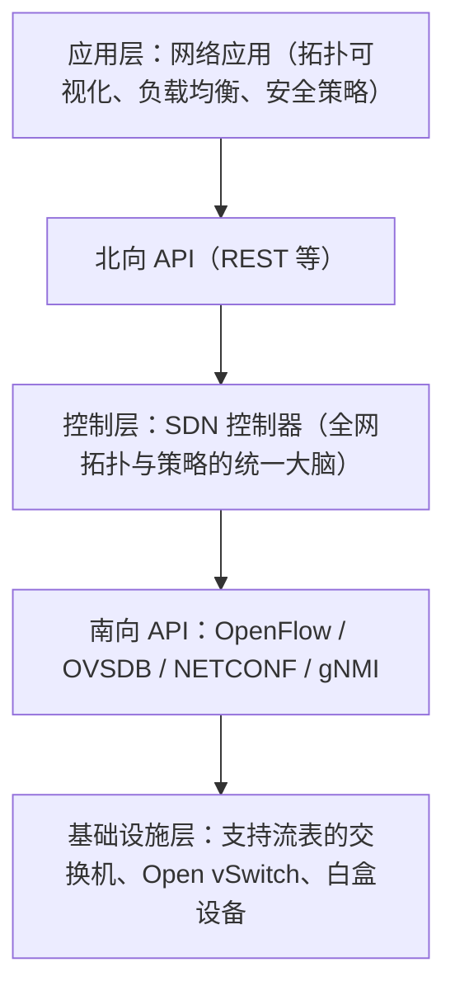
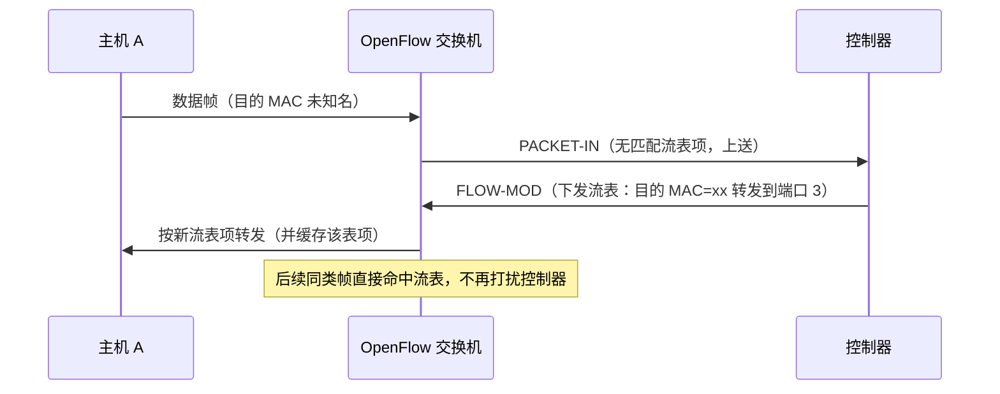

前置知识：交换机/路由器的转发原理、VLAN 与路由协议基础（见 [交换与路由](networking/160-SwitchingAndRouting)）；
了解网络自动化工具链（见 [SDN 与网络自动化](networking/350-NetworkProgrammability)）。

学习目标：

- 说清「控制平面与数据平面分离」到底分离了什么，SDN 与传统分布式的本质差异；
- 掌握 OpenFlow 流表的匹配-动作模型与 packet-in/flow-mod 交互流程；
- 认识南向接口的完整谱系：OpenFlow、OVSDB、NETCONF/YANG、gNMI、P4，避免「SDN=OpenFlow」的误区；
- 了解 SDN 在云网络（VPC）、数据中心与 SD-WAN 中的真实落地形态。

## 1. 为什么需要 SDN

传统网络设备是「自治单元」：每台交换机、路由器各自运行生成树、OSPF、BGP，通过分布式协议商量
出转发表。这套体系支撑了互联网几十年，但有三个结构性痛点：

- **控制分散**：全局视角只存在于「全网所有设备状态的总和」里，想要一个跨全网的策略（比如
  「所有视频流量避开某条链路」）要在每台设备上分别配置；
- **设备垂直集成**：控制软件与转发硬件由同一厂商捆绑，创新慢、锁定强；
- **配置即手工**：CLI 逐台下发，无法版本化、无法自动化（这正是
  [网络自动化](networking/360-NetworkAutomation) 要解决的另一半问题）。

SDN（Software Defined Networking）的回答是三句话：**转发和控制分离、逻辑上集中的控制器、
开放可编程接口**。

> 类比：传统网络像每个路口都装了一位自主决策的交警，各自根据见到的车流放行；SDN 像城市交通
> 控制中心——路口只保留信号灯（转发面），配时方案全部由控制中心（控制面）根据全城车流统一下
> 发。类比失真提示：控制中心失联时路口会瘫痪，而 SDN 的交换机在控制器失联时仍按已下发的流表
> 继续转发。

## 2. SDN 架构



三个关键点：

1. **北向接口**没有统一标准，控制器一般暴露 REST API 供上层应用编排；
2. **南向接口**是设备与控制器的通信协议，OpenFlow 最著名但绝非唯一（见第 4 节）；
3. 控制器「逻辑集中、物理分布」：生产环境一定跑控制器集群，集群内部通过东西向协议同步拓扑与
   流表状态，避免单点故障。

## 3. 控制与转发分离的实质：以 OpenFlow 为例

OpenFlow（ONF 于 2009 年发布 1.0，长期部署最广的是 1.3.x 系列）把交换机的转发决策抽象成
**流表（flow table）**：

| 组成     | 说明                                                     |
| :------- | :------------------------------------------------------- |
| 匹配字段 | 入端口、以太网头、IP 头、TCP/UDP 端口等十余个字段         |
| 优先级   | 数字越大越先匹配；同优先级按精确度，均未命中走 table-miss |
| 计数器   | 命中包数、字节数、存活时间，用于监控与超时回收            |
| 动作     | 转发到端口、泛洪、改写字段、丢弃、上送控制器（controller） |

一次完整的「未知单播」处理流程：



OpenFlow 1.3 起支持**多级流水线（pipeline）**：报文依次经过多张流表，每级可以改写字段后传给
下一级，表达能力大幅提升。现代实现（如 Open vSwitch）还引入 megaflow 等缓存机制，避免首包
都上送控制器。

### 3.1 Ryu 最小学习交换机

Ryu 是用 Python 编写的开源控制器框架，几十行代码即可实现一个 MAC 学习交换机，是理解流表机制
最快的路径：

```python
# simple_l2.py —— 最小 MAC 学习交换机（ryu-manager simple_l2.py 运行）
from ryu.base import app_manager
from ryu.controller import ofp_event
from ryu.controller.handler import MAIN_DISPATCHER, set_ev_cls
from ryu.lib.packet import ethernet
from ryu.ofproto import ofproto_v1_3

class L2Switch(app_manager.RyuApp):
    OFP_VERSIONS = [ofproto_v1_3.OFP_VERSION]

    def __init__(self, *args, **kwargs):
        super(L2Switch, self).__init__(*args, **kwargs)
        self.mac_to_port = {}          # 每台交换机的 MAC -> 端口表

    @set_ev_cls(ofp_event.EventOFPPacketIn, MAIN_DISPATCHER)
    def packet_in_handler(self, ev):
        msg = ev.msg
        dpid = msg.datapath.id
        ofproto = msg.datapath.ofproto
        parser = msg.datapath.ofproto_parser
        # 解析以太网帧，学习源 MAC
        eth = ethernet.ethernet(msg.data)
        in_port = msg.match['in_port']
        self.mac_to_port.setdefault(dpid, {})
        self.mac_to_port[dpid][eth.src] = in_port

        out_port = self.mac_to_port[dpid].get(
            eth.dst, ofproto.OFPP_FLOOD)       # 未知名则泛洪
        actions = [parser.OFPActionOutput(out_port)]

        # 目的 MAC 已知时，顺手下发流表（FLOW-MOD），下次不再 PACKET-IN
        if out_port != ofproto.OFPP_FLOOD:
            match = parser.OFPMatch(in_port=in_port,
                                    eth_dst=eth.dst, eth_src=eth.src)
            self.add_flow(msg.datapath, 1, match, actions)

        out = parser.OFPPacketOut(datapath=msg.datapath,
                                  buffer_id=msg.buffer_id,
                                  in_port=in_port, actions=actions)
        msg.datapath.send_msg(out)

    def add_flow(self, datapath, priority, match, actions):
        parser = datapath.ofproto_parser
        inst = [parser.OFPInstructionActions(
            datapath.ofproto.OFPIT_APPLY_ACTIONS, actions)]
        mod = parser.OFPFlowMod(datapath=datapath, priority=priority,
                                match=match, instructions=inst)
        datapath.send_msg(mod)
```

配套实验环境用 Mininet 在一台 Linux 虚拟机里模拟多主机多交换机拓扑，`pingall` 观察首包
PACKET-IN 与后续流表命中。

## 4. 南向接口谱系：OpenFlow 不是全部

「SDN = OpenFlow」是流传最广的误解。现实中设备可编程化有多个层次：

| 接口/技术       | 层次           | 说明                                                       |
| :-------------- | :------------- | :--------------------------------------------------------- |
| OpenFlow        | 转发面可编程   | 流表模型，ONF 主推；新项目热度下降，存量部署仍多            |
| OVSDB（RFC 7047）| 管理面配置    | Open vSwitch 的管理协议，与 OpenFlow 常搭配使用             |
| NETCONF（RFC 6241）/ YANG（RFC 7950） | 设备配置模型 | 基于 SSH/XML 的标准配置协议 + 数据建模语言，传统厂商设备主流演进方向 |
| RESTCONF / gNMI | 设备配置/遥测  | HTTP 或 gRPC 承载 YANG 模型；gNMI 另擅长高频遥测订阅         |
| P4             | 数据面语言     | 自定义报文解析与处理流水线，配合可编程 ASIC/DPU 使用         |

选型直觉：管「配置」（端口、VLAN、BGP 邻居）用 NETCONF/YANG 或 gNMI；管「每流转发行为」才用
OpenFlow；要重新定义转发面本身则进入 P4/DPU 领域。

## 5. 控制器生态

| 控制器        | 开发语言 | 定位                                                         |
| :------------ | :------- | :----------------------------------------------------------- |
| OpenDaylight  | Java     | Linux 基金会主导的平台级项目，模块众多，常作厂商方案底座      |
| ONOS          | Java     | ONF 主导，面向运营商级（高可用、分布式核心）场景              |
| Ryu           | Python   | 轻量框架，适合科研、原型与教学                                |
| APIC-EM/SDN 控制器（厂商产品） | -       | 与自家硬件深度绑定的企业级控制器                              |

## 6. 现实落地：SDN 如今长什么样

纯粹「OpenFlow 交换机 + 控制器」的形态在公网生产环境并不普遍，但 SDN 的思想已经无处不在：

- **公有云 VPC 就是 SDN**：你在控制台点出的子网、路由表、安全组，背后正是集中控制面把转发规则
  下发到遍布机房的白盒交换机与主机虚拟交换机——用户感知不到任何「配置设备」的过程，这就是
  SDN 想要的终态体验；
- **数据中心网络**：Overlay（VXLAN）+ 集中控制器实现多租户二三层隔离；另一条主流路线是 EVPN-VXLAN
  （RFC 8365 等），用 BGP 在设备间分发 MAC/IP 可达性，属于「分布式的类 SDN」演进，两条路线在
  现网并存。VXLAN 封装细节见 [隧道技术](networking/310-Tunneling)；
- **Open vSwitch + 容器网络**：Kubernetes CNI 插件（如 OVN-Kubernetes）大量复用 OVS/OVN，
  把 Pod 网络的虚拟交换交给了 SDN 控制面，原理衔接见
  [网络命名空间与虚拟网桥](networking/330-NetworkNamespaceVirtualBridge)；
- **SD-WAN**：把 SDN 的集中控制用于广域网，控制器根据链路质量（丢包/延迟/抖动）为不同应用
  选择路径，是当前企业网 SDN 商业化最成功的形态。

## 7. 陷阱与工程注意

1. **控制器不是单点故障，但可能是「脑（思维）瓶颈」**：流表预先下发后设备可独立转发，但拓扑
   变化、新业务上线都依赖控制器；生产部署必须做集群 + 数据面逃生（controller loss 时保底转
   发策略）；
2. **流表容量与表项爆炸**：按「每会话一条」粒度下发微流表会撑爆 TCAM（通常只有数千至数万条）；
   工程上靠聚合（按前缀/按租户）、超时回收与缓存分层解决；
3. **一致性问题**：多台设备更新流表存在时间差，更新窗口内可能出现环路或黑洞；严谨方案依赖
   两阶段更新与版本一致性协议，普通实现要靠拓扑设计（如先断后建）规避；
4. **OpenFlow 与现网协议并存的两难**：控制器算出的路径如果无视生成树/路由协议的假设，故障
   排障思维要整个切换——建议明确划分「传统区」与「SDN 区」，不要混跑；
5. **安全**：控制器与设备间通道（TLS）与控制器自身 API 的鉴权是新的攻击面；南向通道未加密的
   实验环境绝不能照搬到生产。

## 8. 小结

**初学者要点**

- SDN 三要素：转发与控制分离、逻辑集中控制器、开放可编程接口；
- OpenFlow 流表 = 匹配字段 + 优先级 + 计数器 + 动作；未知流量 PACKET-IN 上送，控制器 FLOW-MOD
  下发表项；
- 控制器先认一个就够：写原型用 Ryu（Python），看平台级项目认 OpenDaylight / ONOS 两个名字。

**进阶注意**

- 南向接口按需求选型：配置管理走 NETCONF/YANG 或 gNMI，逐流转发用 OpenFlow，重新定义数据面
  才是 P4；
- 真实落地看云网络：VPC、数据中心 Overlay、SD-WAN、OVS/CNI 都是 SDN 思想的载体，「OpenFlow
  式微」不等于「SDN 失败」；
- 生产化的三大工程问题——控制器高可用、流表容量、更新一致性——在设计阶段就要给出答案，而不
  是上线后补救。
