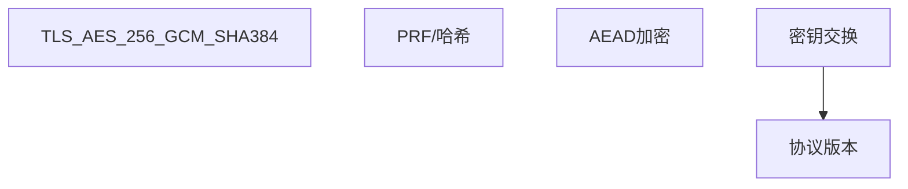

## 1. PKI 体系

### 1.1 组成

| 组件     | 功能           |
| -------- | -------------- |
| CA       | 证书颁发机构   |
| RA       | 注册机构       |
| 证书库   | 存储已颁发证书 |
| CRL/OCSP | 证书吊销查询   |
| 终端实体 | 证书使用者     |

### 1.2 证书链验证

```
根CA → 中间CA → 终端证书
  ↑ 验证签名    ↑ 验证签名
```

### 1.3 证书生命周期

```
申请 → 审核 → 签发 → 使用 → 续签/吊销
```

## 2. TLS 协议

### 2.1 TLS 1.3 握手

```
Client → Server: ClientHello + Key Share
Server → Client: ServerHello + Key Share + Certificate + Finished
Client → Server: Finished
```

1-RTT 完成，支持 0-RTT 恢复。

### 2.2 密码套件



## 3. 密钥管理

### 3.1 密钥生命周期

```
生成 → 分发 → 存储 → 使用 → 轮换 → 销毁
```

### 3.2 HSM

硬件安全模块（HSM）提供安全的密钥存储和密码运算。

### 3.3 KMS

密钥管理服务（KMS）提供云端密钥管理：

- 密钥自动轮换
- 访问审计
- 集成加密/解密API

## 4. 密码工程实践

### 4.1 安全随机数

```python
# 安全随机数生成
import secrets
key = secrets.token_bytes(32)  # 256位密钥
nonce = secrets.token_bytes(12)  # 96位nonce
```

### 4.2 AEAD 加密

```python
from cryptography.hazmat.primitives.ciphers.aead import AESGCM

key = AESGCM.generate_key(bit_length=256)
aesgcm = AESGCM(key)
nonce = os.urandom(12)
ct = aesgcm.encrypt(nonce, plaintext, associated_data)
pt = aesgcm.decrypt(nonce, ct, associated_data)
```

### 4.3 密码学禁忌

- 不要自己实现密码算法
- 不要使用ECB模式
- 不要重复使用nonce
- 不要使用MD5/SHA1
- 不要硬编码密钥
## Base64 编码解码

**基本写法：Base64 编码**
`echo -n "<字符串>" | base64`
```bash
# 编码字符串为 Base64
echo -n "hello world" | base64
```

**基本写法：Base64 解码**
`echo "<Base64>" | base64 -d`
```bash
# 解码 Base64 字符串
echo "aGVsbG8gd29ybGQ=" | base64 -d
```

**基本写法：编码文件**
`base64 <文件>`
```bash
# 编码文件内容为 Base64
base64 image.png > image.b64
```

**基本写法：解码到文件**
`base64 -d <文件> > <输出>`
```bash
# 解码 Base64 文件
base64 -d image.b64 > image.png
```

**基本写法：Python Base64**
`python3 -c "import base64; print(base64.b64encode(b'<字符串>').decode())"`
```bash
# Python 编码 Base64
python3 -c "import base64; print(base64.b64encode(b'hello').decode())"
```

**基本写法：URL 安全 Base64**
`python3 -c "import base64; print(base64.urlsafe_b64encode(b'<字符串>').decode())"`
```bash
# URL 安全的 Base64 编码
python3 -c "import base64; print(base64.urlsafe_b64encode(b'hello?world').decode())"
```

---

## 十六进制编码

**基本写法：字符串转十六进制**
`echo -n "<字符串>" | xxd -p`
```bash
# 字符串转十六进制
echo -n "hello" | xxd -p
```

**基本写法：十六进制转字符串**
`echo "<十六进制>" | xxd -r -p`
```bash
# 十六进制转字符串
echo "68656c6c6f" | xxd -r -p
```

**基本写法：文件转十六进制**
`xxd -p <文件>`
```bash
# 文件转十六进制表示
xxd -p file.bin > file.hex
```

**基本写法：十六进制转文件**
`xxd -r -p <文件> > <输出>`
```bash
# 十六进制转回文件
xxd -r -p file.hex > file.bin
```

**基本写法：Python 十六进制编码**
`python3 -c "print('<字符串>'.encode().hex())"`
```bash
# Python 字符串转十六进制
python3 -c "print('hello'.encode().hex())"
```

**基本写法：Python 十六进制解码**
`python3 -c "print(bytes.fromhex('<十六进制>').decode())"`
```bash
# Python 十六进制转字符串
python3 -c "print(bytes.fromhex('68656c6c6f').decode())"
```

---

## URL 编码解码

**基本写法：URL 编码（Python）**
`python3 -c "import urllib.parse; print(urllib.parse.quote('<字符串>'))"`
```bash
# URL 编码字符串
python3 -c "import urllib.parse; print(urllib.parse.quote('hello world & test'))"
```

**基本写法：URL 解码（Python）**
`python3 -c "import urllib.parse; print(urllib.parse.unquote('<编码>'))"`
```bash
# URL 解码字符串
python3 -c "import urllib.parse; print(urllib.parse.unquote('hello%20world%20%26%20test'))"
```

**基本写法：curl URL 编码**
`curl --data-urlencode "<数据>" <URL>`
```bash
# curl 自动编码 POST 数据
curl -G --data-urlencode "q=hello world & test" https://example.com/search
```

**基本写法：JavaScript URL 编码**
`node -e "console.log(encodeURIComponent('<字符串>'))"`
```bash
# JavaScript URL 编码
node -e "console.log(encodeURIComponent('hello world & test'))"
```

---

## HTML 实体编码

**基本写法：HTML 实体编码**
`python3 -c "import html; print(html.escape('<字符串>'))"`
```bash
# HTML 实体编码
python3 -c "import html; print(html.escape('<script>alert(1)</script>'))"
```

**基本写法：HTML 实体解码**
`python3 -c "import html; print(html.unescape('<字符串>'))"`
```bash
# HTML 实体解码
python3 -c "import html; print(html.unescape('&lt;script&gt;alert(1)&lt;/script&gt;'))"
```

**基本写法：数字 HTML 实体**
`python3 -c "print(''.join(f'&#%d;' % ord(c) for c in '<字符串>'))"`
```bash
# 转换为数字 HTML 实体
python3 -c "print(''.join(f'&#%d;' % ord(c) for c in '<script>'))"
```

---

## ROT13 编码

**基本写法：ROT13 编码**
`echo "<字符串>" | tr 'A-Za-z' 'N-ZA-Mn-za-m'`
```bash
# ROT13 编码（编码解码相同）
echo "hello world" | tr 'A-Za-z' 'N-ZA-Mn-za-m'
```

**基本写法：Python ROT13**
`python3 -c "import codecs; print(codecs.encode('<字符串>', 'rot13'))"`
```bash
# Python ROT13 编码
python3 -c "import codecs; print(codecs.encode('hello world', 'rot13'))"
```

---

## ASCII 编码

**基本写法：字符转 ASCII 码**
`python3 -c "print([ord(c) for c in '<字符串>'])"`
```bash
# 字符串转 ASCII 码列表
python3 -c "print([ord(c) for c in 'hello'])"
```

**基本写法：ASCII 码转字符**
`python3 -c "print(''.join(chr(n) for n in [<码1>, <码2>]))"`
```bash
# ASCII 码列表转字符串
python3 -c "print(''.join(chr(n) for n in [104, 101, 108, 108, 111]))"
```

**基本写法：查看字符 ASCII 码**
`printf '%d\n' "'<字符>"`
```bash
# 查看字符的 ASCII 码
printf '%d\n' "'A"
```

---

## 字符串与字节转换

**基本写法：字符串转字节**
`python3 -c "print(b'<字符串>')"`
```bash
# 字符串转字节
python3 -c "print(b'hello')"
```

**基本写法：字节转字符串**
`python3 -c "print(b'<字节>'.decode())"`
```bash
# 字节转字符串
python3 -c "print(b'hello'.decode())"
```

**基本写法：查看二进制表示**
`echo -n "<字符串>" | xxd -b`
```bash
# 查看字符串的二进制表示
echo -n "A" | xxd -b
```

---

## Unicode 编码

**基本写法：Unicode 转义**
`python3 -c "print('<字符串>'.encode('unicode_escape').decode())"`
```bash
# 字符串转 Unicode 转义
python3 -c "print('你好'.encode('unicode_escape').decode())"
```

**基本写法：Unicode 解码**
`python3 -c "print('<转义>'.encode().decode('unicode_escape'))"`
```bash
# Unicode 转义转字符串
python3 -c "print('\\u4f60\\u597d'.encode().decode('unicode_escape'))"
```

**基本写法：查看字符 Unicode 码点**
`python3 -c "print(hex(ord('<字符>')))"`
```bash
# 查看字符的 Unicode 码点
python3 -c "print(hex(ord('你')))"
```

---

## 多种编码组合

**基本写法：Base64 后十六进制**
`echo -n "<字符串>" | base64 | xxd -p`
```bash
# 先 Base64 编码再转十六进制
echo -n "hello" | base64 | xxd -p
```

**基本写法：十六进制后 Base64**
`echo -n "<字符串>" | xxd -p | base64`
```bash
# 先十六进制编码再 Base64
echo -n "hello" | xxd -p | base64
```

**基本写法：URL 编码后 Base64**
`python3 -c "import urllib.parse, base64; print(base64.b64encode(urllib.parse.quote('<字符串>').encode()).decode())"`
```bash
# URL 编码后再 Base64 编码
python3 -c "import urllib.parse, base64; print(base64.b64encode(urllib.parse.quote('hello world').encode()).decode())"
```

---

## 文件编码检测

**基本写法：检测文件编码**
`file -i <文件>`
```bash
# 检测文件编码类型
file -i document.txt
```

**基本写法：转换文件编码**
`iconv -f <原编码> -t <目标编码> <文件> -o <输出>`
```bash
# 将 GBK 转换为 UTF-8
iconv -f GBK -t UTF-8 input.txt -o output.txt
```

**基本写法：查看文件十六进制**
`hexdump -C <文件> | head`
```bash
# 查看文件十六进制内容
hexdump -C binary.bin | head -20
```

**基本写法：查看文件二进制**
`xxd <文件> | head`
```bash
# 查看文件二进制内容
xxd binary.bin | head -20
```

---

## 实用编码工具

**基本写法：CyberChef 命令行替代**
`python3 -c "import base64; print(base64.b64decode('<Base64>').hex())"`
```bash
# Base64 解码后转十六进制
python3 -c "import base64; print(base64.b64decode('aGVsbG8=').hex())"
```

**基本写法：批量 Base64 解码**
`while read line; do echo "$line" | base64 -d; done < <文件>`
```bash
# 批量解码文件中的 Base64
while read line; do echo "$line" | base64 -d 2>/dev/null; echo; done < b64list.txt
```

**基本写法：检测编码类型**
`python3 -c "import chardet; print(chardet.detect(open('<文件>','rb').read()))"`
```bash
# 使用 chardet 检测文件编码
python3 -c "import chardet; print(chardet.detect(open('file.txt','rb').read()))"
```
