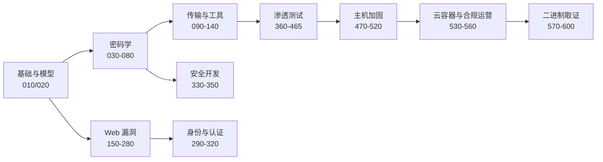

# 安全基础与防御

## 知识点地图

- **知识类别**：模块总览与学习路径——网络安全（cybersecurity）领域的全景地图，不展开任何单一主题的细节。
- **解决什么问题**：网络安全是个 60+ 篇的大模块，从密码学数学到内核提权到合规审计，第一眼根本看不出先学哪个、每篇解决什么问题。本篇回答三个问题：这个领域关心什么、模块按什么顺序读、每个知识块什么时候会用到。
- **什么时候用到**：刚进入模块时定路线；学到中途迷路时回来看坐标系；给同事/同学推荐「从哪篇开始」时当索引。

## 1. 这个领域在防御什么

把「网络安全」四个字落到具体动作上，是四件互相咬合的事：

1. **守住数据**：静态的（加密存储）、传输中的（TLS）、使用中的（访问控制）——密码学与协议篇负责；
2. **守住代码**：写出来的服务不被注入、不泄权限——Web 漏洞与安全开发篇负责；
3. **守住主机与边界**：防火墙、IDS/IPS、系统加固——主机加固篇负责；
4. **被攻进来之后能恢复**：检测、应急响应、取证复盘——运营与取证篇负责。

攻防是一体两面：渗透测试方法论（360 系列）把「怎么攻」系统化，正是为了验证前三件事有没有做对。贯穿全部的标准框架——OWASP Top 10（Web 风险排名）、PTES（渗透测试流程）、NIST CSF（安全治理框架）——会在对应篇章分别出现。

## 2. 模块地图：九个知识块，先读哪个

每个知识块的入口篇与一句话定位：

| 知识块 | 入口篇 | 定位 |
| --- | --- | --- |
| 基础与模型 | [安全模型与框架](/cybersecurity/020-SecurityModelFramework) | CIA 三元组、纵深防御、威胁建模——全模块的思考框架 |
| 密码学 | [密码学应用](/cybersecurity/030-CryptographyApplication) | 对称/非对称/哈希/证书/口令哈希五条主线（030-080） |
| 传输与工具 | [HTTPS 原理](/cybersecurity/090-HTTPSPrinciple) | TLS 握手与部署（090），OpenSSL/GPG/SSH 工具链（100-140） |
| Web 漏洞 | [Web 安全导览](/cybersecurity/150-WebSecurityPenetrationTesting) | OWASP Top 10 逐项攻防（150-280），注入、XSS、CSRF、SSRF、上传、反序列化 |
| 身份与认证 | [认证与授权](/cybersecurity/290-AuthenticationAuthorization) | Session/Token/OAuth2/OIDC，JWT 攻防在 [JWT 安全实践](/cybersecurity/315-JWTSecurityPractice) |
| 安全开发 | [安全编码原则](/cybersecurity/330-SecureCodingPrinciples) | 把漏洞挡在编码阶段；WAF 规则（350）做运行时兜底 |
| 渗透测试 | [渗透测试方法论](/cybersecurity/360-PenetrationTestingMethodology) | PTES 七阶段流程；信息收集、Nmap、漏扫逐篇展开（380-460）；[无线安全](/cybersecurity/465-WirelessSecurity) 与 [社会工程学](/cybersecurity/365-SocialEngineering) 补齐人与射频两个维度 |
| 主机加固 | [防火墙配置](/cybersecurity/470-FirewallConfig) | ufw/firewalld/iptables 与厂商防火墙；IDS/IPS、SELinux、auditd、基线（480-520） |
| 云与运营 | [云安全](/cybersecurity/530-CloudSecurity) | 云与容器（530/535）、合规（540）、SOC 与应急响应（550/560） |
| 二进制与取证 | [恶意软件分析](/cybersecurity/570-MalwareAnalysis) | 逆向（590）、[二进制漏洞利用](/cybersecurity/585-BinaryExploitationPwn)（585）、[IoT 与工控](/cybersecurity/580-IoTOTSecurity)（580）、隐写（600） |

## 3. 三条学习路线

**路线一：应用开发者（最小必修）**——你写代码，需要知道自己的代码会被怎么打：
[Web 安全导览](/cybersecurity/150-WebSecurityPenetrationTesting) → [SQL 注入](/cybersecurity/180-SQLInjection) → [XSS 攻击](/cybersecurity/190-XSSAttack) → [XSS 防御](/cybersecurity/200-XSSDefense) → [认证与授权](/cybersecurity/290-AuthenticationAuthorization) → [JWT 安全实践](/cybersecurity/315-JWTSecurityPractice) → [安全编码原则](/cybersecurity/330-SecureCodingPrinciples)。六周节奏，每周两篇。

**路线二：安全工程师（全模块顺读）**——按第 2 节的编号顺序通读。密码学五篇（030-080）是后面一切的词汇表，跳过它们，TLS 与 JWT 篇会变成命令背诵。

**路线三：运维/SRE（先守后攻）**——[防火墙配置](/cybersecurity/470-FirewallConfig) → [IDS/IPS](/cybersecurity/480-IDSIPSCommands) → [安全基线](/cybersecurity/520-SecurityBaseline) → [审计命令](/cybersecurity/510-AuditdCommands) → [应急响应](/cybersecurity/560-IncidentResponse)。防御视角优先，渗透系列按需补。

## 4. 动手环境与法律边界

- **靶场**：DVWA、Juice Shop（Web 靶场）、VulnHub 虚拟机——所有渗透篇的命令都在这些授权靶场里练；
- **自己的机器**：工具链安装（nmap、Burp、sqlmap、hashcat）在本机 Linux 虚拟机进行；
- **法律红线**：对未授权系统运行扫描、爆破、利用代码是违法行为，各国都有 computer crime 类法律（详见 [IoT 与工控安全](/cybersecurity/580-IoTOTSecurity) 的法律法规一节）。本模块所有「攻击」操作默认你在靶场或自有资产上执行。

## 5. 动手实践

### 练习一：给自己画一张资产威胁表

任务：选一个你负责或熟悉的系统（个人博客、课程项目均可），列 5 个资产（数据库、登录接口、静态资源...），为每个资产写出「最担心的一种攻击」并指向模块中对应的防御篇。
提示：资产的暴露面决定威胁——有登录框就往 Web 漏洞块找，走 HTTPS 就往传输块找。这练习的产出就是你的个人学习顺序。

### 练习二：搭一个 DVWA 靶场

任务：用 Docker 一条命令跑起 DVWA（`docker run -d -p 80:80 vulnerables/web-dvwa`），登录后在 DVWA Security 里把等级调成 Low，浏览一遍所有漏洞模块的名字。
提示：这一步只求「环境能跑、名字眼熟」——后续 SQL 注入、XSS、文件上传各篇的实验都回到这里做，各篇会指回对应模块。

### 练习三（复盘）：写一段 200 字的模块使用说明

任务：假如下学期有同学问「网络安全模块怎么入门」，用不超过 200 字给出你的推荐路线与理由，贴在学习笔记里。
提示：答案没有标准——对照第 3 节三条路线，说出你的选择与取舍即可。能说清「为什么这样排」，说明第 2 节的地图真的成了你的。

## 6. 与之前和之后的知识的关系

- 往前：[Linux 基础](/devops/015-LinuxSystemManagement) 与 [计算机网络](/cs-fundamentals/270-ComputerNetwork) 类篇目（命令行、TCP/IP、HTTP）是全模块的底子——本模块大量命令默认你会在 Linux 终端里操作；
- 往后：本篇只是地图，每一个知识块都由专篇展开——从第 2 节的表格挑你的入口即可。

## 7. 自我检查

- 能说出安全四件事（守数据、守代码、守边界、能恢复）各对应模块的哪个知识块；
- 能给应用开发者、安全工程师、运维三类角色各指出一条不同的入口路线；
- 能说出 DVWA 是什么、为什么所有攻击练习都要在靶场里做。

## 本章总结

本篇是网络安全模块的地图：四件咬合的事（数据、代码、边界、恢复）划出领域边界；十个知识块按「密码学打底、Web 漏洞主战场、渗透验证、加固兜底、运营收尾」的顺序展开；三条学习路线按角色分流。带着「我的资产怕什么」这个问题往下读，每一篇都会给出答案的一半——另一半永远在动手实验里。

## 参考与致谢

- OWASP Top 10（2021）与 OWASP Cheat Sheet 系列：https://owasp.org/Top10/
- PTES 渗透测试执行标准：http://www.pentest-standard.org/
- NIST Cybersecurity Framework：https://www.nist.gov/cyberframework
- 本篇为总览重写：原第一章防火墙配置拆入 [防火墙配置](/cybersecurity/470-FirewallConfig)（含华为策略节）、原第二章 IDS/IPS 拆入 [IDS/IPS 命令](/cybersecurity/480-IDSIPSCommands)、原第三章系统加固拆入 [安全基线](/cybersecurity/520-SecurityBaseline)（含 Windows 加固节）、原第四至七章密码学与 TLS 分别由 [对称加密](/cybersecurity/040-SymmetricEncryption)、[非对称加密](/cybersecurity/050-AsymmetricEncryption)、[哈希算法](/cybersecurity/060-HashAlgorithm)、[密码哈希](/cybersecurity/070-PasswordHash)、[HTTPS 原理](/cybersecurity/090-HTTPSPrinciple) 覆盖、原 JWT 系列九节拆入 [JWT 安全实践](/cybersecurity/315-JWTSecurityPractice)。
