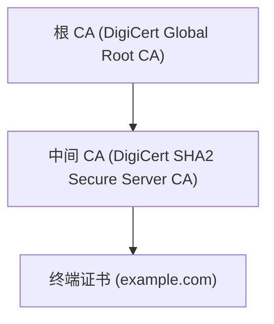

## 1. 数字证书基础

### 1.1 什么是数字证书

数字证书是电子文档，用于证明公钥的所有权。由受信任的证书颁发机构（CA）签名。

### 1.2 核心组成

```
证书 = 公钥 + 身份信息 + 有效期 + CA 签名
```

### 1.3 信任模型

```
根 CA → 中间 CA → 终端证书
  ↑
信任锚
```

## 2. X.509 标准

### 2.1 证书结构

```
Certificate ::= SEQUENCE {
    tbsCertificate       TBSCertificate,
    signatureAlgorithm   AlgorithmIdentifier,
    signatureValue       BIT STRING
}

TBSCertificate ::= SEQUENCE {
    version              [0] EXPLICIT INTEGER DEFAULT v1,
    serialNumber         CertificateSerialNumber,
    signature            AlgorithmIdentifier,
    issuer               Name,
    validity             Validity,
    subject              Name,
    subjectPublicKeyInfo SubjectPublicKeyInfo,
    issuerUniqueID       [1] IMPLICIT UniqueIdentifier OPTIONAL,
    subjectUniqueID      [2] IMPLICIT UniqueIdentifier OPTIONAL,
    extensions           [3] EXPLICIT Extensions OPTIONAL
}
```

### 2.2 关键字段

| 字段          | 描述                |
| ------------- | ------------------- |
| Version       | v1(0)、v2(1)、v3(2) |
| Serial Number | CA 分配的唯一序列号 |
| Issuer        | 颁发者 DN           |
| Validity      | 起止时间            |
| Subject       | 主体 DN             |
| Public Key    | 公钥及算法          |
| Extensions    | 扩展信息            |

### 2.3 重要扩展

| 扩展                           | 描述              | 关键性 |
| ------------------------------ | ----------------- | ------ |
| Subject Alternative Name (SAN) | 证书覆盖的域名/IP | 关键   |
| Basic Constraints              | CA 标志和路径深度 | 关键   |
| Key Usage                      | 密钥用途          | 关键   |
| Extended Key Usage             | 扩展密钥用途      | 非关键 |
| Authority Key Identifier       | 颁发者密钥标识    | 非关键 |
| Subject Key Identifier         | 主体密钥标识      | 非关键 |
| CRL Distribution Points        | CRL 分发点        | 非关键 |
| Authority Information Access   | OCSP 地址         | 非关键 |

### 2.4 证书编码

| 格式    | 扩展名     | 描述                   |
| ------- | ---------- | ---------------------- |
| DER     | .der, .cer | 二进制编码             |
| PEM     | .pem, .crt | Base64 编码 + 头尾标记 |
| PKCS#7  | .p7b       | 证书链容器             |
| PKCS#12 | .p12, .pfx | 含私钥的容器           |

## 3. PKI 体系

### 3.1 PKI 组件

| 组件               | 功能           |
| ------------------ | -------------- |
| CA（证书颁发机构） | 签发和管理证书 |
| RA（注册机构）     | 身份验证       |
| 证书库             | 存储已颁发证书 |
| CRL/OCSP           | 证书状态查询   |
| 终端实体           | 证书使用者     |

### 3.2 证书生命周期

```
申请 → 验证 → 签发 → 部署 → 使用 → 续期/吊销 → 过期
```

### 3.3 证书类型

| 类型           | 验证级别         | 适用场景  |
| -------------- | ---------------- | --------- |
| DV（域名验证） | 仅验证域名控制权 | 个人网站  |
| OV（组织验证） | 验证组织身份     | 企业网站  |
| EV（扩展验证） | 严格身份验证     | 金融/电商 |

## 4. 证书链验证

### 4.1 验证流程

```
1. 检查证书签名是否由上级 CA 签发
2. 逐级验证直到根 CA
3. 检查每个证书的有效期
4. 检查证书是否被吊销（CRL/OCSP）
5. 检查 Key Usage 和 Extended Key Usage
6. 检查 SAN 是否匹配目标域名
```

### 4.2 证书链示例



### 4.3 交叉签名

当根 CA 更换密钥时，使用新旧密钥同时签名中间 CA，确保过渡期兼容性。

## 5. 证书吊销

### 5.1 CRL（证书吊销列表）

```xml
<!-- CRL 结构 -->
CertificateList ::= SEQUENCE {
    tbsCertList          TBSCertList,
    signatureAlgorithm   AlgorithmIdentifier,
    signatureValue       BIT STRING
}
```

**缺点**：

- 需要定期下载完整列表
- 延迟高
- 列表可能很大

### 5.2 OCSP（在线证书状态协议）

```http
GET /ocsp?serial=123456 HTTP/1.1
Host: ocsp.example-ca.com
```

**响应**：

| 状态    | 含义       |
| ------- | ---------- |
| good    | 证书有效   |
| revoked | 证书已吊销 |
| unknown | 未知       |

### 5.3 OCSP Stapling

服务器主动获取并缓存 OCSP 响应，在 TLS 握手时发送给客户端。

**优势**：

- 减少客户端到 OCSP 服务器的请求
- 提高隐私性
- 减少延迟

## 6. 证书管理实践

### 6.1 OpenSSL 常用命令

```bash
# 生成私钥
openssl genrsa -out private.key 2048

# 生成 CSR
openssl req -new -key private.key -out request.csr

# 自签名证书
openssl req -x509 -key private.key -out cert.pem -days 365

# 查看证书信息
openssl x509 -in cert.pem -text -noout

# 验证证书链
openssl verify -CAfile ca.pem cert.pem

# 转换格式
openssl x509 -in cert.der -inform DER -out cert.pem -outform PEM
```

### 6.2 Let's Encrypt 自动化

```bash
# 使用 certbot 获取证书
certbot certonly --webroot -w /var/www/html -d example.com

# 自动续期
certbot renew --quiet
```

### 6.3 证书固定（Certificate Pinning）

```http
Public-Key-Pins: pin-sha256="base64=="; max-age=5184000
```

> 注意：HTTP Public Key Pinning (HPKP) 已被 Chrome 废弃，推荐使用 Certificate Transparency。

### 6.4 证书透明度（CT）

所有公开可信证书必须记录在 CT 日志中，可被公开审计。

```http
Expect-CT: enforce, max-age=86400, report-uri="https://example.com/ct-report"
```
## SSL/TLS 连接测试

**基本写法：测试 HTTPS 连接**
`openssl s_client -connect <主机>:<端口>`
```bash
# 测试 HTTPS 连接
openssl s_client -connect example.com:443
```

**基本写法：指定 SNI**
`openssl s_client -connect <主机>:<端口> -servername <域名>`
```bash
# 指定 SNI 测试虚拟主机
openssl s_client -connect example.com:443 -servername example.com
```

**基本写法：查看证书链**
`openssl s_client -showcerts -connect <主机>:<端口>`
```bash
# 查看完整证书链
openssl s_client -showcerts -connect example.com:443
```

**基本写法：静默模式测试**
`echo | openssl s_client -connect <主机>:443 2>/dev/null`
```bash
# 静默测试不阻塞
echo | openssl s_client -connect example.com:443 2>/dev/null
```

**基本写法：测试 SMTP TLS**
`openssl s_client -starttls smtp -connect <主机>:<端口>`
```bash
# 测试 SMTP 服务的 STARTTLS
openssl s_client -starttls smtp -connect smtp.example.com:587
```

---

## TLS 版本测试

**基本写法：测试 TLS 1.2**
`openssl s_client -tls1_2 -connect <主机>:<端口>`
```bash
# 测试服务器是否支持 TLS 1.2
openssl s_client -tls1_2 -connect example.com:443
```

**基本写法：测试 TLS 1.3**
`openssl s_client -tls1_3 -connect <主机>:<端口>`
```bash
# 测试服务器是否支持 TLS 1.3
openssl s_client -tls1_3 -connect example.com:443
```

**基本写法：禁用旧版本**
`openssl s_client -no_ssl3 -no_tls1 -no_tls1_1 -connect <主机>:<端口>`
```bash
# 禁用 SSL3、TLS1.0、TLS1.1
openssl s_client -no_ssl3 -no_tls1 -no_tls1_1 -connect example.com:443
```

**基本写法：查看协商的 TLS 版本**
`openssl s_client -connect <主机>:443 </dev/null 2>&1 | grep Protocol`
```bash
# 查看实际协商的 TLS 版本
openssl s_client -connect example.com:443 </dev/null 2>&1 | grep Protocol
```

---

## 密码套件测试

**基本写法：查看支持的密码套件**
`openssl ciphers -v`
```bash
# 列出所有支持的密码套件
openssl ciphers -v
```

**基本写法：测试特定密码套件**
`openssl s_client -cipher <密码套件> -connect <主机>:<端口>`
```bash
# 测试服务器是否支持特定密码套件
openssl s_client -cipher 'ECDHE-RSA-AES256-GCM-SHA384' -connect example.com:443
```

**基本写法：只使用强密码套件**
`openssl s_client -cipher 'HIGH:!aNULL:!MD5' -connect <主机>:<端口>`
```bash
# 只使用高强度密码套件
openssl s_client -cipher 'HIGH:!aNULL:!MD5:!RC4' -connect example.com:443
```

**基本写法：查看协商的密码套件**
`openssl s_client -connect <主机>:443 </dev/null 2>&1 | grep Cipher`
```bash
# 查看实际协商的密码套件
openssl s_client -connect example.com:443 </dev/null 2>&1 | grep Cipher
```

---

## 证书验证

**基本写法：验证证书链**
`openssl verify -CAfile <CA证书> <证书>`
```bash
# 验证证书是否有效
openssl verify -CAfile ca.crt server.crt
```

**基本写法：验证证书链含中间证书**
`openssl verify -CAfile <CA证书> -untrusted <中间证书> <证书>`
```bash
# 使用中间证书验证
openssl verify -CAfile root.crt -untrusted intermediate.crt server.crt
```

**基本写法：使用系统 CA 验证**
`openssl verify <证书>`
```bash
# 使用系统信任的 CA 验证证书
openssl verify server.crt
```

**基本写法：在线验证证书**
`openssl s_client -connect <主机>:443 -verify_return_error`
```bash
# 连接时验证证书有效性
openssl s_client -connect example.com:443 -verify_return_error
```

---

## 证书信息提取

**基本写法：查看证书过期时间**
`openssl x509 -enddate -noout -in <证书>`
```bash
# 查看证书过期日期
openssl x509 -enddate -noout -in cert.pem
```

**基本写法：从远程服务器获取过期时间**
`echo | openssl s_client -connect <主机>:443 2>/dev/null | openssl x509 -noout -enddate`
```bash
# 查看远程服务器证书过期时间
echo | openssl s_client -connect example.com:443 2>/dev/null | openssl x509 -noout -enddate
```

**基本写法：查看证书主题**
`openssl x509 -subject -noout -in <证书>`
```bash
# 查看证书主题
openssl x509 -subject -noout -in cert.pem
```

**基本写法：查看证书颁发者**
`openssl x509 -issuer -noout -in <证书>`
```bash
# 查看证书颁发者
openssl x509 -issuer -noout -in cert.pem
```

**基本写法：查看证书 SAN**
`openssl x509 -text -noout -in <证书> | grep -A1 "Subject Alternative Name"`
```bash
# 查看证书的 Subject Alternative Names
openssl x509 -text -noout -in cert.pem | grep -A1 "Subject Alternative Name"
```

---

## 证书匹配验证

**基本写法：验证证书和私钥匹配**
`openssl x509 -noout -modulus -in <证书> | openssl md5; openssl rsa -noout -modulus -in <私钥> | openssl md5`
```bash
# 对比证书和私钥的 modulus 是否一致
openssl x509 -noout -modulus -in cert.pem | openssl md5
openssl rsa -noout -modulus -in private.key | openssl md5
```

**基本写法：验证 CSR 和私钥匹配**
`openssl req -noout -modulus -in <CSR> | openssl md5; openssl rsa -noout -modulus -in <私钥> | openssl md5`
```bash
# 对比 CSR 和私钥的 modulus
openssl req -noout -modulus -in request.csr | openssl md5
openssl rsa -noout -modulus -in private.key | openssl md5
```

**基本写法：一键验证匹配**
`[ "$(openssl x509 -noout -modulus -in cert.pem | openssl md5)" = "$(openssl rsa -noout -modulus -in private.key | openssl md5)" ] && echo "匹配" || echo "不匹配"`
```bash
# 一键检查证书和私钥是否匹配
[ "$(openssl x509 -noout -modulus -in cert.pem | openssl md5)" = "$(openssl rsa -noout -modulus -in private.key | openssl md5)" ] && echo "匹配" || echo "不匹配"
```

---

## 证书下载与导出

**基本写法：下载服务器证书**
`echo | openssl s_client -connect <主机>:443 2>/dev/null | openssl x509 -out <文件>`
```bash
# 下载远程服务器证书
echo | openssl s_client -connect example.com:443 2>/dev/null | openssl x509 -out cert.pem
```

**基本写法：下载完整证书链**
`openssl s_client -showcerts -connect <主机>:443 </dev/null 2>/dev/null | openssl x509 -out <文件>`
```bash
# 下载完整证书链
openssl s_client -showcerts -connect example.com:443 </dev/null 2>/dev/null | awk '/-----BEGIN/,/-----END/{print}' > chain.pem
```

**基本写法：从 PFX 导出证书和私钥**
`openssl pkcs12 -in <PFX> -clcerts -nokeys -out <证书>; openssl pkcs12 -in <PFX> -nocerts -nodes -out <私钥>`
```bash
# 从 PFX 文件分别导出证书和私钥
openssl pkcs12 -in cert.pfx -clcerts -nokeys -out cert.pem
openssl pkcs12 -in cert.pfx -nocerts -nodes -out private.key
```

---

## 证书过期监控

**基本写法：检查证书剩余天数**
`openssl x509 -enddate -noout -in <证书> | cut -d= -f2`
```bash
# 查看证书过期日期
openssl x509 -enddate -noout -in cert.pem | cut -d= -f2
```

**基本写法：计算剩余天数**
```bash
`expiry=$(echo | openssl s_client -connect <主机>:443 2>/dev/null | openssl x509 -noout -enddate | cut -d= -f2)
days=$(( ( $(date -d "$expiry" +%s) - $(date +%s) ) / 86400 ))
echo "剩余 $days 天"`
```
```bash
# 计算远程证书剩余有效天数
expiry=$(echo | openssl s_client -connect example.com:443 2>/dev/null | openssl x509 -noout -enddate | cut -d= -f2)
days=$(( ( $(date -d "$expiry" +%s) - $(date +%s) ) / 86400 ))
echo "证书剩余 $days 天"
```

**基本写法：批量检查证书过期**
`for f in *.pem; do echo "$f: $(openssl x509 -enddate -noout -in $f | cut -d= -f2)"; done`
```bash
# 批量检查所有证书的过期时间
for f in *.pem; do echo "$f: $(openssl x509 -enddate -noout -in $f | cut -d= -f2)"; done
```

---

## 证书调试

**基本写法：查看证书完整信息**
`openssl x509 -text -noout -in <证书>`
```bash
# 查看证书完整详细信息
openssl x509 -text -noout -in cert.pem
```

**基本写法：查看证书序列号**
`openssl x509 -serial -noout -in <证书>`
```bash
# 查看证书序列号
openssl x509 -serial -noout -in cert.pem
```

**基本写法：查看证书指纹**
`openssl x509 -fingerprint -sha256 -noout -in <证书>`
```bash
# 查看 SHA256 指纹
openssl x509 -fingerprint -sha256 -noout -in cert.pem
```

**基本写法：查看公钥信息**
`openssl x509 -pubkey -noout -in <证书> | openssl rsa -pubin -text -noout`
```bash
# 查看证书中的公钥信息
openssl x509 -pubkey -noout -in cert.pem | openssl rsa -pubin -text -noout
```

---

## nmap SSL 扫描

**基本写法：枚举 SSL 密码套件**
`nmap --script ssl-enum-ciphers -p 443 <主机>`
```bash
# 使用 nmap 枚举 SSL 支持的密码套件
nmap --script ssl-enum-ciphers -p 443 example.com
```

**基本写法：检测 SSL 漏洞**
`nmap --script ssl-* -p 443 <主机>`
```bash
# 运行所有 SSL 相关脚本
nmap --script ssl-* -p 443 example.com
```

**基本写法：获取 SSL 证书**
`nmap --script ssl-cert -p 443 <主机>`
```bash
# 使用 nmap 获取 SSL 证书信息
nmap --script ssl-cert -p 443 example.com
```

---

## 证书吊销检查

**基本写法：检查 OCSP 状态**
`openssl ocsp -issuer <CA证书> -cert <证书> -url <OCSP URL> -no_nonce`
```bash
# 检查证书的 OCSP 吊销状态
openssl ocsp -issuer ca.crt -cert server.crt -url http://ocsp.example.com -no_nonce
```

**基本写法：从证书提取 OCSP URL**
`openssl x509 -text -noout -in <证书> | grep "OCSP"`
```bash
# 提取证书中的 OCSP URL
openssl x509 -text -noout -in cert.pem | grep "OCSP - URI"
```

**基本写法：检查 CRL**
`openssl crl -text -noout -in <CRL文件>`
```bash
# 查看证书吊销列表内容
openssl crl -text -noout -in crl.pem
```
